# Technical Specification

# 0. Agent Action Plan

## 0.1 Core Refactoring Objective

Based on the prompt, the Blitzy platform understands that the refactoring objective is to completely rewrite a Node.js Express server into a Python 3 Flask application while preserving all existing functionalities and adding new features as specified.

**Refactoring Type:** Tech stack migration (Node.js/Express → Python 3/Flask)

**Target Repository:** Same repository migration (in-place transformation)

**Refactoring Goals with Enhanced Clarity:**

- **Primary Goal:** Migrate the entire Node.js server codebase to Python 3 using the Flask framework, ensuring zero loss of functionality during the transition
  
- **Feature Preservation:** Maintain the existing endpoint that returns "Hello world" with identical behavior and response format
  
- **Feature Addition:** Implement the newly requested endpoint that returns "Good evening" as part of the refactoring process
  
- **Technology Stack Transformation:** Replace the Node.js runtime and Express framework with Python 3 runtime and Flask framework while maintaining equivalent server capabilities
  
- **Code Structure Modernization:** Transform JavaScript/Node.js idioms and patterns into Pythonic equivalents following Flask best practices

**Implicit Requirements Surfaced:**

- Maintain HTTP method compatibility (GET requests remain GET requests)
- Preserve response content types (plain text responses in this case)
- Ensure server startup and configuration processes are equivalent
- Maintain similar error handling patterns appropriate to each framework
- Keep development server functionality for local testing
- Preserve any environment-specific configurations
- Ensure dependency management is properly translated (package.json → requirements.txt)
- Maintain code readability and adherence to language-specific style guides (JavaScript → PEP 8)

## 0.2 Special Instructions and Constraints

**Critical Directives:**

- **Complete Functionality Preservation:** All functionalities of the original Node.js project must be preserved in the Python Flask implementation without exception
  
- **Framework-Specific Implementation:** The refactored application must use Flask specifically, not other Python web frameworks (Django, FastAPI, etc.)
  
- **Python Version Requirement:** The implementation must target Python 3, utilizing Python 3-specific features and syntax where appropriate

**User-Provided Examples:**

User Example 1: "this is a tutorial of node js server hosting one endpoint that returns the response 'Hello world'"

User Example 2: "add another endpoint that return the reponse of 'Good evening'"

**Migration Requirements:**

- Single repository transformation - no multi-repository setup required
- Development environment must support both Node.js (for reference) and Python 3 (for implementation)
- All endpoints must maintain their original response formats and behaviors
- Server must be runnable locally for development and testing purposes

**Performance and Scalability Considerations:**

- The Flask application should maintain equivalent or better response times for the simple endpoints
- Server startup time should be comparable to the Node.js version
- Memory footprint should remain reasonable for a development server

**Web Search Requirements Completed:**

Research conducted on Node.js Express to Flask migration best practices, covering:
- Route syntax transformation patterns
- Framework architectural differences
- Dependency management translation strategies
- Development server configuration approaches

## 0.3 Technical Interpretation

This refactoring translates to the following technical transformation strategy:

**Current Architecture → Target Architecture Mapping:**

Current (Node.js/Express):
- Runtime: Node.js (JavaScript execution environment)
- Framework: Express.js (minimal web framework)
- Package Manager: npm (Node Package Manager)
- Entry Point: Typically `server.js`, `app.js`, or `index.js`
- Routing: Express route handlers with middleware pattern
- Dependency Declaration: `package.json` with `dependencies` object

Target (Python/Flask):
- Runtime: Python 3.12.3 (Python interpreter)
- Framework: Flask 3.0.0 (micro web framework)
- Package Manager: pip (Python Package Installer)
- Entry Point: Typically `app.py` or `server.py`
- Routing: Flask route decorators with function-based views
- Dependency Declaration: `requirements.txt` with pinned versions

**Transformation Rules and Patterns:**

**Rule 1 - Server Initialization:**
```javascript
// FROM: const express = require('express'); const app = express();
```
```python
# TO: from flask import Flask; app = Flask(__name__)
```

**Rule 2 - Route Definition:**
```javascript
// FROM: app.get('/path', (req, res) => { res.send('response'); });
```
```python
# TO: @app.route('/path', methods=['GET']); def route_handler(): return 'response'
```

**Rule 3 - Server Execution:**
```javascript
// FROM: app.listen(PORT, () => console.log(`Server on port ${PORT}`));
```
```python
# TO: if __name__ == '__main__': app.run(debug=True, port=PORT)
```

**Rule 4 - Dependency Management:**
- FROM: `package.json` with semantic versioning (e.g., `"express": "^4.18.0"`)
- TO: `requirements.txt` with pinned versions (e.g., `Flask==3.0.0`)

**Rule 5 - Error Handling:**
- FROM: Express middleware error handlers with `(err, req, res, next)` signature
- TO: Flask error handlers using `@app.errorhandler()` decorator

**Architectural Equivalences:**

| Node.js/Express Concept | Python/Flask Equivalent | Notes |
|------------------------|------------------------|-------|
| `app.listen()` | `app.run()` | Server startup |
| `app.get()` | `@app.route(methods=['GET'])` | GET route definition |
| `app.post()` | `@app.route(methods=['POST'])` | POST route definition |
| `res.send()` | `return` statement | Response sending |
| `res.json()` | `jsonify()` | JSON response |
| Middleware functions | `@app.before_request` | Request preprocessing |
| `app.use()` | Blueprint registration | Modular routing |
| `process.env.PORT` | `os.environ.get('PORT')` | Environment variables |

## 0.4 Comprehensive Source File Discovery

**Complete Source File Inventory:**

Based on the user's description of a Node.js tutorial server with Express, the expected source structure includes the following files:

**Primary Source Files:**
- `server.js` OR `app.js` OR `index.js` - Main server entry point containing Express setup and route definitions
- `package.json` - Node.js dependency manifest defining Express and other dependencies
- `package-lock.json` - Locked dependency versions (if present)

**Configuration Files:**
- `.gitignore` - Git ignore patterns (if present)
- `README.md` - Project documentation (existing, to be updated)
- `.env` - Environment variables (if present)
- `.nvmrc` - Node.js version specification (if present)

**Additional Expected Files:**
- `node_modules/` - Installed dependencies directory (generated, not tracked in Git)

**Search Patterns Used to Identify Files:**

Since the repository currently only contains a README.md placeholder, the source files are expected to be created or already exist in the conceptual Node.js project described by the user. The typical patterns for such a project would be:

- Main entry points: `*.js` in root directory
- Configuration: `package.json`, `.env`, `.nvmrc`
- Documentation: `README.md`, `*.md`

**Current Repository State:**

Based on repository inspection, the current state shows:
- Existing: `README.md` (placeholder with project identifier ABK-1929)
- Missing: All Node.js source files, configuration files, and dependencies

**Interpretation:**

The user is describing a conceptual Node.js Express server that needs to be refactored to Python Flask. The source structure will follow standard Node.js Express tutorial conventions with:
1. A single JavaScript file containing server logic
2. A package.json declaring Express as a dependency
3. Two HTTP GET endpoints implemented

## 0.5 Current Structure Mapping

**Expected Current Node.js/Express Structure:**

```
project-root/
├── README.md                    (existing - project identifier)
├── package.json                 (to be created/referenced - dependencies)
├── package-lock.json           (optional - dependency lock file)
├── server.js                   (to be created/referenced - main entry point)
├── .gitignore                  (optional - Git ignore patterns)
├── .env                        (optional - environment variables)
└── node_modules/               (generated - installed dependencies)
```

**Expected File Contents:**

**server.js (Conceptual Source):**
```javascript
const express = require('express');
const app = express();
const PORT = process.env.PORT || 3000;

// Existing endpoint - returns "Hello world"
app.get('/', (req, res) => {
    res.send('Hello world');
});

// New endpoint to be added - returns "Good evening"
app.get('/evening', (req, res) => {
    res.send('Good evening');
});

app.listen(PORT, () => {
    console.log(`Server running on port ${PORT}`);
});
```

**package.json (Conceptual Source):**
```json
{
  "name": "nodejs-tutorial-server",
  "version": "1.0.0",
  "description": "Tutorial Node.js server with Express",
  "main": "server.js",
  "scripts": {
    "start": "node server.js",
    "dev": "nodemon server.js"
  },
  "dependencies": {
    "express": "^4.18.0"
  },
  "devDependencies": {
    "nodemon": "^3.0.0"
  },
  "engines": {
    "node": ">=14.0.0"
  }
}
```

**Architectural Characteristics:**

- **Monolithic Structure:** Single file contains all server logic
- **Synchronous Routing:** Simple request-response pattern
- **No Middleware:** Minimal setup without additional middleware layers
- **No Database:** Stateless endpoints with hardcoded responses
- **Development Focus:** Configured for local development with nodemon for hot-reloading

## 0.6 Refactored Structure Planning

**Complete Target Python/Flask Structure:**

```
project-root/
├── README.md                    (UPDATE - add Flask documentation)
├── requirements.txt             (CREATE - Python dependencies)
├── app.py                       (CREATE - Flask application entry point)
├── .gitignore                   (CREATE/UPDATE - Python-specific patterns)
├── .python-version             (CREATE - Python version specification)
├── .env                        (OPTIONAL - environment variables)
├── venv/                       (generated - Python virtual environment)
└── __pycache__/                (generated - Python bytecode cache)
```

**Target File Contents:**

**app.py (Target Implementation):**
```python
from flask import Flask
import os

app = Flask(__name__)

#### Port configuration with environment variable support
PORT = int(os.environ.get('PORT', 5000))

#### Existing endpoint - returns "Hello world"
@app.route('/', methods=['GET'])
def hello():
    return 'Hello world'

#### New endpoint - returns "Good evening"
@app.route('/evening', methods=['GET'])
def evening():
    return 'Good evening'

if __name__ == '__main__':
    app.run(debug=True, host='0.0.0.0', port=PORT)
```

**requirements.txt (Target Dependencies):**
```
Flask==3.0.0
Werkzeug==3.0.1
click==8.1.7
itsdangerous==2.1.2
Jinja2==3.1.2
MarkupSafe==2.1.3
```

**.python-version (Python Version Specification):**
```
3.12.3
```

**.gitignore (Python-Specific Patterns):**
```
# Python
__pycache__/
*.py[cod]
*$py.class
*.so
.Python
build/
develop-eggs/
dist/
downloads/
eggs/
.eggs/
lib/
lib64/
parts/
sdist/
var/
wheels/
*.egg-info/
.installed.cfg
*.egg

#### Virtual Environment
venv/
ENV/
env/

#### IDE
.vscode/
.idea/
*.swp
*.swo

#### Environment variables
.env
.env.local

#### Flask
instance/
.pytest_cache/
```

**README.md (Updated Documentation):**
```
# ABK-1929

#### Flask Tutorial Server

A simple Flask web server with two endpoints demonstrating basic routing.

#### Prerequisites

- Python 3.12.3 or higher
- pip (Python package installer)

#### Installation

1. Create virtual environment:
   python3 -m venv venv

2. Activate virtual environment:
   source venv/bin/activate  # On Windows: venv\Scripts\activate

3. Install dependencies:
   pip install -r requirements.txt

#### Running the Server

python app.py

The server will start on http://localhost:5000

#### Available Endpoints

- GET / - Returns "Hello world"
- GET /evening - Returns "Good evening"

#### Development

The server runs in debug mode by default for development purposes.
```

**Architectural Improvements:**

- **Python Best Practices:** Follows PEP 8 style guidelines
- **Virtual Environment:** Isolated dependency management with venv
- **Environment Configuration:** Port configuration via environment variables
- **Debug Mode:** Development server with auto-reload capability
- **Clear Documentation:** Updated README with Python-specific instructions
- **Version Pinning:** Exact dependency versions in requirements.txt

## 0.7 Web Search Research Conducted

**Research Topic: Node.js Express to Python Flask Migration Best Practices**

**Key Findings:**

**Route Migration Patterns:**
<cite index="2-2,2-24">Migrating routes from Node.js to Flask requires adjusting the syntax while keeping the logic similar</cite>. The core HTTP logic remains consistent, but the implementation patterns differ between frameworks.

**File Structure Equivalence:**
<cite index="2-22,2-23">Create a new file named app.py, which will be equivalent to app.js in Node.js setup</cite>. This establishes the one-to-one mapping between the Node.js entry point and the Flask entry point.

**Migration Components:**
<cite index="1-6">Migration should involve creating new Flask endpoints that match the existing Express endpoints, as well as any middleware, authentication, and error handling</cite>. This ensures comprehensive functionality preservation.

**Framework Characteristics:**

**Express.js:**
<cite index="3-1">ExpressJS - Sinatra inspired web development framework for node.js -- insanely fast, flexible, and simple</cite>.

**Flask:**
<cite index="3-2">Flask - A microframework for Python based on Werkzeug, Jinja 2 and good intentions</cite>.

**Language and Syntax Differences:**
<cite index="6-12,6-13">The most apparent difference is the programming language: Node.js uses JavaScript, while Flask is based on Python. JavaScript's syntax, especially with asynchronous programming (promises, async/await), can be more challenging for beginners compared to Python's straightforward and readable syntax</cite>.

**Ecosystem Benefits:**
<cite index="6-19">Both ecosystems offer a wealth of tools and libraries, with Node.js providing a vast range of npm packages and Flask benefiting from Python's extensive libraries</cite>.

**Applicable Best Practices:**

- Maintain RESTful conventions in route definitions
- Preserve HTTP method semantics (GET, POST, etc.)
- Use framework-native response patterns
- Follow language-specific style guides (PEP 8 for Python)
- Implement proper error handling for each framework
- Utilize built-in development servers for local testing
- Pin dependency versions for reproducibility

## 0.8 Design Pattern Applications

**Patterns Applied in the Flask Refactoring:**

**1. Application Factory Pattern (Simplified):**
- **Implementation:** Direct app instantiation with `app = Flask(__name__)`
- **Purpose:** Creates the Flask application instance as the central object
- **Benefit:** Provides a clear entry point and centralizes configuration

**2. Decorator Pattern for Routing:**
- **Implementation:** Using `@app.route()` decorators for endpoint definition
- **Purpose:** Associates URL paths with handler functions
- **Benefit:** Clean, declarative syntax that's more Pythonic than Express's functional approach

**3. Configuration Management Pattern:**
- **Implementation:** Environment variables via `os.environ.get()`
- **Purpose:** Externalizes configuration like PORT settings
- **Benefit:** Enables different configurations across environments without code changes

**4. Single Responsibility Principle:**
- **Implementation:** Each route handler function handles one specific endpoint
- **Purpose:** Separates concerns for different API endpoints
- **Benefit:** Makes code more maintainable and testable

**5. Convention Over Configuration:**
- **Implementation:** Flask's default behaviors for routing and responses
- **Purpose:** Minimizes boilerplate configuration code
- **Benefit:** Faster development with sensible defaults

**Pattern Comparison: Express vs Flask**

| Pattern | Express Implementation | Flask Implementation |
|---------|----------------------|---------------------|
| Routing | `app.get('/path', handler)` | `@app.route('/path', methods=['GET'])` |
| Response | `res.send('text')` | `return 'text'` |
| Server Start | `app.listen(port, callback)` | `app.run(port=port)` |
| Error Handling | Middleware with 4 params | `@app.errorhandler()` decorator |
| Modularity | Router objects | Blueprints |

**Architectural Decisions:**

- **Monolithic Structure:** Maintaining simple single-file structure appropriate for tutorial scope
- **Stateless Design:** No database or session management, pure request-response pattern
- **Development-First:** Debug mode enabled for rapid development iteration
- **RESTful Principles:** Following REST conventions with appropriate HTTP methods

## 0.9 File-by-File Transformation Plan

**Comprehensive File Transformation Mapping:**

| Target File | Transformation | Source File | Key Changes |
|------------|---------------|-------------|-------------|
| app.py | CREATE | server.js | Transform Node.js/Express server to Flask application; convert Express routes to Flask decorators; replace `app.listen()` with `app.run()`; convert CommonJS imports to Python imports |
| requirements.txt | CREATE | package.json | Extract Express dependency and convert to Flask==3.0.0; add Flask sub-dependencies (Werkzeug, Jinja2, etc.); use pinned versions instead of semver ranges |
| .python-version | CREATE | .nvmrc | Specify Python 3.12.3 version for runtime consistency; replace Node version specification |
| .gitignore | CREATE | .gitignore | Replace node_modules/ with venv/ and __pycache__/; add Python-specific patterns (*.pyc, *.pyo, *.egg-info); maintain common patterns (.env, IDE folders) |
| README.md | UPDATE | README.md | Add Flask-specific installation instructions; update prerequisites (Python vs Node.js); document new endpoint structure; replace npm commands with pip commands; update server start instructions |

**Detailed Transformation Specifications:**

**app.py ← server.js**

```javascript
// SOURCE (server.js)
const express = require('express');
const app = express();
const PORT = process.env.PORT || 3000;

app.get('/', (req, res) => {
    res.send('Hello world');
});

app.get('/evening', (req, res) => {
    res.send('Good evening');
});

app.listen(PORT, () => {
    console.log(`Server running on port ${PORT}`);
});
```

```python
# TARGET (app.py)
from flask import Flask
import os

app = Flask(__name__)
PORT = int(os.environ.get('PORT', 5000))

@app.route('/', methods=['GET'])
def hello():
    return 'Hello world'

@app.route('/evening', methods=['GET'])
def evening():
    return 'Good evening'

if __name__ == '__main__':
    app.run(debug=True, host='0.0.0.0', port=PORT)
```

**Transformation Details:**
- Import statement: `const express = require('express')` → `from flask import Flask`
- App initialization: `const app = express()` → `app = Flask(__name__)`
- Port config: `process.env.PORT || 3000` → `int(os.environ.get('PORT', 5000))`
- Route definition: `app.get('/path', (req, res) => {})` → `@app.route('/path', methods=['GET']); def handler():`
- Response: `res.send('text')` → `return 'text'`
- Server start: `app.listen(PORT, callback)` → `app.run(debug=True, port=PORT)`

**requirements.txt ← package.json**

```json
// SOURCE (package.json dependencies section)
{
  "dependencies": {
    "express": "^4.18.0"
  }
}
```

```
# TARGET (requirements.txt)
Flask==3.0.0
Werkzeug==3.0.1
click==8.1.7
itsdangerous==2.1.2
Jinja2==3.1.2
MarkupSafe==2.1.3
```

**One-Phase Execution:**

ALL files will be transformed in a SINGLE phase. No multi-phase approach is required for this refactoring. The transformation sequence is:

1. Create `app.py` with Flask implementation
2. Create `requirements.txt` with Python dependencies  
3. Create `.python-version` with Python 3.12.3
4. Create/Update `.gitignore` with Python patterns
5. Update `README.md` with Flask documentation

**Wildcard Pattern Usage:**

For this simple refactoring, specific file paths are used. Wildcard patterns are NOT necessary as the project structure is minimal with clearly identified files.

## 0.10 Cross-File Dependencies

**Import Statement Updates:**

**Node.js/Express (SOURCE):**
```javascript
// External framework import
const express = require('express');

// No internal module imports (single-file structure)
```

**Python/Flask (TARGET):**
```python
# External framework import
from flask import Flask

#### Standard library import for environment variables
import os

#### No internal module imports (single-file structure)
```

**Dependency Chain Analysis:**

Since this is a simple single-file application, there are minimal cross-file dependencies:

**Flask Application Dependencies:**
- `app.py` depends on `Flask` from the `flask` package
- `app.py` depends on `os` from Python standard library
- `requirements.txt` specifies the `Flask` package and its transitive dependencies

**Transitive Dependencies (Flask → Sub-packages):**
- Flask 3.0.0 → Werkzeug 3.0.1 (WSGI utilities)
- Flask 3.0.0 → Jinja2 3.1.2 (template engine, not used in this app)
- Flask 3.0.0 → click 8.1.7 (CLI toolkit)
- Flask 3.0.0 → itsdangerous 2.1.2 (data signing)
- Jinja2 3.1.2 → MarkupSafe 2.1.3 (string escaping)

**Configuration Dependencies:**

**Runtime Configuration:**
- `app.py` reads PORT from environment variables (optional)
- Default PORT: 5000 (Flask convention)
- Debug mode: True (development setting)

**Development Environment Dependencies:**
- Python 3.12.3 runtime (specified in `.python-version`)
- Virtual environment in `venv/` directory
- pip package manager for dependency installation

**No Import Path Updates Required:**

Unlike complex refactoring scenarios, this migration does not require:
- Internal import path changes (no internal modules)
- Relative import updates (single file structure)
- Module restructuring (monolithic design maintained)

**Test File Import Corrections:**

Not applicable - no test files present in the current structure. If tests are added in the future:

```python
# Future test file would import:
from app import app

#### Test client usage:
def test_hello():
    client = app.test_client()
    response = client.get('/')
    assert response.data == b'Hello world'
```

## 0.11 Key Private and Public Packages

**Source (Node.js) Package Registry:**

| Registry | Package Name | Version | Purpose |
|----------|-------------|---------|---------|
| npm | express | ^4.18.0 | Web framework for creating HTTP server and routing |
| npm | nodemon | ^3.0.0 | Development utility for auto-restarting server on file changes (devDependency) |

**Target (Python) Package Registry:**

| Registry | Package Name | Version | Purpose |
|----------|-------------|---------|---------|
| PyPI | Flask | 3.0.0 | Micro web framework for building web applications and APIs |
| PyPI | Werkzeug | 3.0.1 | WSGI utility library that Flask is built upon |
| PyPI | Jinja2 | 3.1.2 | Template engine for Flask (included but not used in this app) |
| PyPI | click | 8.1.7 | Command-line interface toolkit used by Flask |
| PyPI | itsdangerous | 2.1.2 | Data integrity and security library for signing data |
| PyPI | MarkupSafe | 2.1.3 | String escaping and markup safety (Jinja2 dependency) |

**Version Selection Rationale:**

**Flask 3.0.0:**
- Latest stable major version at time of environment setup
- Installed and verified in the virtual environment
- Full compatibility with Python 3.12.3
- Includes all required features for simple HTTP endpoints

**Sub-dependencies:**
- All versions are the exact versions installed with Flask 3.0.0
- Verified through `pip list` output in the activated virtual environment
- No version conflicts or compatibility issues detected

**Private Packages:**

None - this project uses only public packages from official registries (npm for Node.js, PyPI for Python)

**Development vs Production Dependencies:**

**Node.js Source:**
- Production: express (runtime dependency)
- Development: nodemon (dev-only hot-reloading)

**Python Target:**
- Production: All packages in requirements.txt are production dependencies
- Development: Flask's built-in debug mode provides hot-reloading without additional packages

## 0.12 Dependency Updates

**Import Refactoring:**

Since this refactoring involves a complete technology stack change from Node.js to Python, all imports are being replaced rather than refactored:

**Files Requiring Import Updates:**

| File Pattern | Import Changes | Transformation Type |
|-------------|---------------|-------------------|
| app.py | `from flask import Flask` + `import os` | Complete replacement of Node.js require statements |

**Import Transformation Rules:**

**Rule 1 - Framework Import:**
```javascript
// FROM (Node.js)
const express = require('express');
```
```python
# TO (Python)
from flask import Flask
```

**Rule 2 - Environment Variable Access:**
```javascript
// FROM (Node.js) - implicit via process.env
const PORT = process.env.PORT || 3000;
```
```python
# TO (Python) - requires explicit import
import os
PORT = int(os.environ.get('PORT', 5000))
```

**No Internal Module Updates Required:**

This project uses a monolithic single-file structure with no internal modules, therefore:
- No relative imports to update
- No internal package restructuring needed
- No circular dependency concerns

**External Reference Updates:**

**Configuration Files:**

**package.json → requirements.txt:**
```json
// FROM: Node.js dependency format
{
  "dependencies": {
    "express": "^4.18.0"
  }
}
```
```
# TO: Python dependency format
Flask==3.0.0
Werkzeug==3.0.1
click==8.1.7
itsdangerous==2.1.2
Jinja2==3.1.2
MarkupSafe==2.1.3
```

**Documentation Files:**

**README.md Updates:**
- Update installation commands: `npm install` → `pip install -r requirements.txt`
- Update run commands: `npm start` → `python app.py`
- Update prerequisite: Node.js → Python 3
- Add virtual environment setup instructions

**.gitignore Updates:**
- Remove: `node_modules/`, `package-lock.json`
- Add: `venv/`, `__pycache__/`, `*.pyc`, `*.pyo`, `.Python`, `*.egg-info/`

**No CI/CD or Build Files Present:**

The current project structure does not include:
- GitHub Actions workflows
- GitLab CI configurations  
- Docker configurations
- Build scripts

If these are added in the future, they would need Python-specific updates.

## 0.13 Scope Boundaries

**Exhaustively In Scope:**

**Source Code Transformations:**
- app.py - Complete creation of Flask application from Node.js source
- server.js OR app.js OR index.js - Reference source for transformation logic
- All endpoint implementations: `/` and `/evening` routes

**Dependency Management:**
- requirements.txt - Creation with all Flask dependencies and exact versions
- package.json - Reference for understanding current dependencies
- Virtual environment setup and activation (venv/)

**Configuration Files:**
- .python-version - Creation specifying Python 3.12.3
- .gitignore - Creation/update with Python-specific ignore patterns
- .env - Optional environment variable file (if needed for configuration)

**Documentation:**
- README.md - Complete update with Flask-specific instructions
  - Installation procedures using pip
  - Virtual environment setup steps
  - Server execution commands
  - Endpoint documentation
  - Python version prerequisites

**Development Environment:**
- Python 3.12.3 installation and verification
- Virtual environment creation (`venv/`)
- Flask 3.0.0 installation in isolated environment
- All Flask sub-dependencies (Werkzeug, Jinja2, click, itsdangerous, MarkupSafe)

**Functional Requirements:**
- GET / endpoint returning "Hello world" (preserve existing functionality)
- GET /evening endpoint returning "Good evening" (new functionality)
- HTTP server listening on configurable port (default 5000)
- Development mode with debug enabled and auto-reload
- Environment variable support for PORT configuration

**Explicitly Out of Scope:**

**Infrastructure and Deployment:**
- Production server deployment (Gunicorn, uWSGI)
- Containerization (Docker, Docker Compose)
- Cloud deployment configurations (AWS, GCP, Azure)
- Reverse proxy configuration (Nginx, Apache)
- SSL/TLS certificate setup

**Advanced Features:**
- Database integration (SQLAlchemy, Alembic)
- Authentication and authorization systems
- Session management
- CORS configuration
- API rate limiting
- Request validation and sanitization
- Logging frameworks (beyond Flask's built-in)
- Monitoring and metrics collection

**Testing Infrastructure:**
- Unit tests with pytest
- Integration tests
- Test coverage reporting
- Continuous Integration (CI) pipelines
- Automated testing workflows

**Additional Endpoints:**
- POST, PUT, DELETE, PATCH methods
- JSON API endpoints
- File upload handling
- WebSocket support
- Static file serving beyond defaults

**Node.js Artifacts:**
- Removal of node_modules/ directory (out of scope - manual cleanup)
- Deletion of package.json and package-lock.json (preserved for reference)
- Removal of .nvmrc (out of scope - manual cleanup)

**Advanced Python Features:**
- Async/await with asyncio
- Type hints and mypy integration
- Blueprints for modular routing
- Custom error handlers beyond defaults
- Request/response middleware
- Template rendering (Jinja2 not used)

**Migration Tooling:**
- Automated code conversion tools
- Migration scripts or utilities
- Parallel operation of both Node.js and Flask versions

## 0.14 Special Instructions for Refactoring

**Critical Refactoring Requirements:**

**1. Complete Functionality Preservation**
- **Requirement:** Preserve all existing functionalities of the original Node.js project
- **Implementation:** 
  - The `/` endpoint must return exactly "Hello world" (matching original response)
  - The `/evening` endpoint must return exactly "Good evening" (new feature)
  - HTTP GET method must be used for both endpoints
  - Response content-type should be text/plain by default
  - Server must be accessible via HTTP on localhost

**2. Maintain Public API Contracts**
- **Requirement:** Endpoint paths and HTTP methods must remain consistent
- **Implementation:**
  - Route `/` remains unchanged
  - Route `/evening` follows same pattern as original
  - No breaking changes to URL structure
  - Response format preserved (plain text responses)

**3. Behavioral Equivalence**
- **Requirement:** Ensure all tests continue passing (conceptually, as no tests exist yet)
- **Implementation:**
  - Response content must match exactly
  - HTTP status codes should be 200 OK for successful requests
  - Error responses should follow HTTP standards
  - Server startup behavior should be equivalent

**4. Technology Stack Adherence**
- **Requirement:** Must use Python 3 and Flask specifically
- **Implementation:**
  - Python 3.12.3 as the runtime version
  - Flask 3.0.0 as the web framework
  - No alternative frameworks (Django, FastAPI, etc.)
  - Follow Flask conventions and best practices

**5. Development Experience Parity**
- **Requirement:** Maintain similar development workflow
- **Implementation:**
  - Debug mode enabled for development (`app.run(debug=True)`)
  - Auto-reload on file changes (Flask's built-in feature)
  - Clear console logging of server startup
  - Simple command to start server: `python app.py`

**6. Code Quality Standards**
- **Requirement:** Follow language-specific style guidelines
- **Implementation:**
  - PEP 8 compliance for Python code
  - Proper function naming (snake_case instead of camelCase)
  - Appropriate use of Python idioms
  - Clear variable names and comments where helpful

**7. Environment Isolation**
- **Requirement:** Proper dependency management and isolation
- **Implementation:**
  - Virtual environment for Python dependencies
  - Pinned dependency versions in requirements.txt
  - No system-wide package installations
  - Reproducible environment setup

**8. Documentation Completeness**
- **Requirement:** Updated documentation reflecting new technology stack
- **Implementation:**
  - README.md updated with Flask-specific instructions
  - Clear prerequisites (Python 3 instead of Node.js)
  - Step-by-step setup instructions
  - Endpoint documentation with examples

**9. Backward Compatibility Considerations**
- **Requirement:** While not maintaining Node.js compatibility, ensure Flask version is feature-complete
- **Implementation:**
  - All Node.js functionality mapped to Flask equivalents
  - No missing features from original implementation
  - Port configuration flexibility maintained
  - Environment variable support preserved

**10. Single-Phase Execution**
- **Requirement:** Complete refactoring in one execution phase
- **Implementation:**
  - All files created/updated together
  - No incremental migration steps
  - Atomic transformation from Node.js to Python
  - No hybrid state with both technologies active

**Migration Safety Checklist:**

- [ ] Original endpoint behavior verified and documented
- [ ] Flask routes implement identical functionality
- [ ] Response content matches exactly
- [ ] HTTP status codes are appropriate
- [ ] Port configuration works with environment variables
- [ ] Server starts successfully in debug mode
- [ ] Dependencies are properly pinned
- [ ] Virtual environment is properly configured
- [ ] Documentation is complete and accurate
- [ ] Git ignore patterns exclude generated files

**Post-Refactoring Validation:**

After refactoring is complete, the following should be verified:
- Server starts without errors: `python app.py`
- GET / returns "Hello world"
- GET /evening returns "Good evening"
- Debug mode provides helpful error messages
- Virtual environment contains only required dependencies
- README instructions are accurate and complete


# 1. Introduction

## 1.1 Document Status and Overview

This Technical Specification document serves as the primary architectural and technical reference for project **ABK-1929**. As of the document creation date, the project repository is in its **initialization phase**, having been established on November 17, 2025. This Introduction section provides the foundational context for the system and will be expanded as the project progresses through its development lifecycle.

### 1.1.1 Current Project Status

The ABK-1929 repository represents a newly initialized project currently in the planning and setup phase. The repository was created by the blitzytest02 account and contains initial project identification markers. The project is positioned at the beginning of its technical lifecycle, with infrastructure establishment and requirements gathering activities anticipated as immediate next steps.

### 1.1.2 Document Purpose

This Technical Specification document aims to:

- Establish a comprehensive technical reference for all stakeholders involved in the ABK-1929 project
- Define the system architecture, design decisions, and implementation approaches
- Document the scope, requirements, and technical constraints governing the project
- Provide a single source of truth for development, testing, and deployment activities
- Enable effective communication among technical and business stakeholders

### 1.1.3 Living Document Notice

This is a **living document** that will evolve as the ABK-1929 project advances through its development phases. Stakeholders should expect regular updates reflecting architectural decisions, implementation progress, and scope refinements. Version control for this document is maintained within the project repository structure.

## 1.2 Executive Summary

### 1.2.1 Project Overview

**Project ABK-1929** is currently in its early initialization stage. The project identifier "ABK-1929" serves as the primary reference for this initiative within the organization's project portfolio. The repository infrastructure has been established at `https://github.com/blitzytest02/ABK-1929.git`, providing the foundational version control environment for the project's technical artifacts.

| **Attribute** | **Value** |
|---------------|-----------|
| Project Identifier | ABK-1929 |
| Repository Location | github.com/blitzytest02/ABK-1929 |
| Initialization Date | November 17, 2025 |
| Current Phase | Planning and Setup |

### 1.2.2 Core Business Problem

**Status**: *To Be Defined*

The specific business problem or opportunity that project ABK-1929 addresses will be documented in this section as project requirements are formalized. This information should include:

- Current business challenges or inefficiencies being addressed
- Market opportunities or competitive advantages being pursued
- Stakeholder pain points requiring technical solutions
- Strategic business objectives aligned with this initiative

**Action Required**: Project stakeholders must provide business context documentation to complete this subsection.

### 1.2.3 Key Stakeholders and Users

**Status**: *To Be Defined*

This subsection will identify all stakeholders and user groups for the ABK-1929 system, including:

- **Primary Stakeholders**: Executive sponsors, product owners, and business decision-makers
- **Development Team**: Technical leads, architects, developers, and quality assurance personnel
- **End Users**: Primary user groups, user personas, and usage patterns
- **Support and Operations**: Teams responsible for system maintenance and support

**Action Required**: Stakeholder analysis and user group identification pending.

### 1.2.4 Expected Business Impact and Value Proposition

**Status**: *To Be Defined*

The anticipated business value and measurable impact of the ABK-1929 system will be documented here, including:

- Quantifiable business outcomes (cost savings, revenue generation, efficiency gains)
- Strategic value alignment with organizational objectives
- Competitive positioning and market differentiation
- Return on investment (ROI) projections and timelines

**Action Required**: Business case documentation required from project sponsors.

## 1.3 System Overview

### 1.3.1 Project Context

#### 1.3.1.1 Business Context and Market Positioning

**Status**: *To Be Defined*

This section will establish the business environment and market context for ABK-1929, including:

- Industry landscape and competitive analysis
- Organizational strategic positioning
- Market trends and technology adoption patterns
- Regulatory and compliance considerations

**Action Required**: Business and market analysis documentation needed.

#### 1.3.1.2 Current System Limitations

**Status**: *To Be Defined*

If ABK-1929 replaces, upgrades, or integrates with existing systems, this section will document:

- Current system architecture and capabilities
- Known limitations, bottlenecks, or technical debt
- Pain points driving the need for change
- Migration or integration requirements

**Action Required**: Current state assessment required if replacing existing systems.

#### 1.3.1.3 Enterprise Integration Landscape

**Status**: *To Be Defined*

This section will map the ABK-1929 system within the broader enterprise architecture, including:

- Existing enterprise systems requiring integration
- Data flows and system dependencies
- Authentication and authorization frameworks
- Shared infrastructure and platform services

**Action Required**: Enterprise architecture documentation and integration requirements needed.

### 1.3.2 High-Level Description

#### 1.3.2.1 Primary System Capabilities

**Status**: *To Be Defined*

The core functional capabilities of the ABK-1929 system will be documented here, including:

- Major functional domains and business capabilities
- Key user workflows and interaction patterns
- Data management and processing capabilities
- Integration and extensibility features

**Action Required**: Functional requirements and capability mapping required.

#### 1.3.2.2 Major System Components

**Status**: *To Be Defined*

This section will provide a high-level component architecture, including:

- Frontend/user interface components
- Backend services and business logic layers
- Data storage and persistence mechanisms
- Infrastructure and platform components

**Action Required**: Architectural design decisions pending.

#### 1.3.2.3 Core Technical Approach

**Status**: *To Be Defined*

The fundamental technical strategy and architectural patterns for ABK-1929 will be outlined here, including:

- Technology stack and framework selections
- Architectural patterns and design principles
- Development methodologies and practices
- Quality assurance and testing strategies

**Action Required**: Technical architecture and technology decisions required.

### 1.3.3 Success Criteria

#### 1.3.3.1 Measurable Objectives

**Status**: *To Be Defined*

Specific, measurable objectives for the ABK-1929 project will include:

| **Objective Category** | **Metrics** | **Target** | **Timeline** |
|------------------------|-------------|------------|--------------|
| *To Be Defined* | *To Be Defined* | *To Be Defined* | *To Be Defined* |

**Action Required**: Objective definition and success metrics establishment needed.

#### 1.3.3.2 Critical Success Factors

**Status**: *To Be Defined*

The essential conditions required for project success will be documented, including:

- Organizational readiness and change management
- Technical capability and skill availability
- Budget and resource allocation adequacy
- Stakeholder engagement and support
- Risk mitigation effectiveness

**Action Required**: Success factor analysis required.

#### 1.3.3.3 Key Performance Indicators (KPIs)

**Status**: *To Be Defined*

Measurable KPIs for ongoing system performance and business value delivery will include:

- **Technical KPIs**: System performance, availability, scalability metrics
- **Business KPIs**: User adoption, business process efficiency, value realization
- **Quality KPIs**: Defect rates, user satisfaction, system reliability

**Action Required**: KPI framework definition and baseline establishment needed.

## 1.4 Scope

### 1.4.1 In-Scope Elements

#### 1.4.1.1 Core Features and Functionalities

**Status**: *To Be Defined*

The must-have capabilities and features within the ABK-1929 project scope include:

**Primary User Workflows**:
- *To Be Defined*

**Essential Integrations**:
- *To Be Defined*

**Key Technical Requirements**:
- *To Be Defined*

**Action Required**: Comprehensive requirements gathering and prioritization needed.

#### 1.4.1.2 Implementation Boundaries

**Status**: *To Be Defined*

The boundaries defining the ABK-1929 system's operational scope include:

| **Boundary Type** | **Definition** | **Coverage** |
|-------------------|----------------|--------------|
| System Boundaries | *To Be Defined* | *To Be Defined* |
| User Groups | *To Be Defined* | *To Be Defined* |
| Geographic/Market Coverage | *To Be Defined* | *To Be Defined* |
| Data Domains | *To Be Defined* | *To Be Defined* |

**Action Required**: Scope boundary definition and stakeholder agreement required.

### 1.4.2 Out-of-Scope Elements

#### 1.4.2.1 Excluded Features and Capabilities

**Status**: *To Be Defined*

Features and capabilities explicitly excluded from the current project scope include:

- *To Be Defined*

**Action Required**: Scope exclusion documentation needed to manage stakeholder expectations.

#### 1.4.2.2 Future Phase Considerations

**Status**: *To Be Defined*

Capabilities and features deferred to future project phases or releases:

- *To Be Defined*

**Action Required**: Product roadmap and phasing strategy required.

#### 1.4.2.3 Integration Points Not Covered

**Status**: *To Be Defined*

External systems and integration points explicitly out of scope:

- *To Be Defined*

**Action Required**: Integration scope definition and boundary agreement needed.

#### 1.4.2.4 Unsupported Use Cases

**Status**: *To Be Defined*

User scenarios and use cases that the system will not support:

- *To Be Defined*

**Action Required**: Use case analysis and scope validation required.

## 1.5 Next Steps for Documentation Completion

To complete this Introduction section and enable comprehensive technical specification development, the following information gathering activities are required:

1. **Business Requirements Workshop**: Define core business problem, stakeholders, and value proposition
2. **Technical Architecture Sessions**: Establish technical approach, component architecture, and technology stack
3. **Scope Definition Workshop**: Define in-scope and out-of-scope elements with stakeholder agreement
4. **Success Criteria Definition**: Establish measurable objectives, KPIs, and critical success factors
5. **Enterprise Context Analysis**: Document integration landscape and current system limitations

These activities should be completed before proceeding with detailed technical design and implementation planning.

## 1.6 References

### 1.6.1 Repository Files Examined

- `README.md` - Project identifier and repository initialization marker

### 1.6.2 Repository Metadata

- Repository Location: https://github.com/blitzytest02/ABK-1929.git
- Repository Owner: blitzytest02
- Initialization Date: November 17, 2025, 18:28:29 +0530
- Initial Commit: ca4c980f8dffcbe90c69f4481ea39836c007a2b8
- Primary Branch: main

### 1.6.3 Documentation Status

This Introduction section is based on the repository contents as of the initial commit. As the project develops and additional documentation, code, and configuration artifacts are added to the repository, this section will be updated to reflect the complete project context and technical specifications.

# 2. Product Requirements

## 2.1 Requirements Definition Status

### 2.1.1 Current State

Project ABK-1929 is currently in the **planning and initialization phase**. As documented in Section 1.2 (Executive Summary), the repository infrastructure was established on November 17, 2025, and contains only foundational project identification artifacts. Product requirements have not yet been formally defined, documented, or approved.

| **Aspect** | **Status** | **Completion Target** |
|------------|------------|----------------------|
| Feature Catalog | Pending Definition | Post Business Requirements Workshop |
| Functional Requirements | Pending Definition | Post Scope Definition Workshop |
| Acceptance Criteria | Pending Definition | Post Success Criteria Definition |

**Evidence**: The repository at `github.com/blitzytest02/ABK-1929` contains a single file (`README.md`) with the project identifier "# ABK-1929" and no requirements documentation, feature specifications, or implementation artifacts.

### 2.1.2 Requirements Gathering Activities

As outlined in Section 1.5 (Next Steps for Documentation Completion), the following activities are scheduled to define comprehensive product requirements:

**Planned Workshop Series**:
1. **Business Requirements Workshop** - Define core business problem, stakeholders, and value proposition
2. **Technical Architecture Sessions** - Establish technical approach, component architecture, and technology stack
3. **Scope Definition Workshop** - Define in-scope and out-of-scope elements with stakeholder agreement
4. **Success Criteria Definition** - Establish measurable objectives, KPIs, and critical success factors
5. **Enterprise Context Analysis** - Document integration landscape and current system limitations

These foundational activities will provide the necessary inputs to populate the product requirements framework presented in subsequent sections.

### 2.1.3 Documentation Framework Purpose

This section provides a comprehensive framework structure for documenting ABK-1929 product requirements. The framework includes:

- **Standardized templates** for feature documentation
- **Structured tables** for functional requirements capture
- **Traceability mechanisms** for requirement tracking
- **Best practices guidance** for requirements definition

Once requirements gathering activities are completed, this framework will be populated with specific, testable requirements that form the basis for system design and implementation.

## 2.2 Feature Catalog Framework

### 2.2.1 Feature Catalog Purpose and Structure

The Feature Catalog provides a comprehensive inventory of all product features for ABK-1929. Each feature will be documented with complete metadata, descriptions, dependencies, and implementation considerations to ensure clarity and traceability throughout the development lifecycle.

**Status**: *Framework ready for population post-requirements workshops*

### 2.2.2 Feature Documentation Template

For each feature identified during requirements gathering, the following standardized structure will be used:

#### 2.2.2.1 Feature Metadata Template

```
Feature ID: F-XXX
Feature Name: [Descriptive name of the feature]
Feature Category: [Business Process | User Interface | Integration | Data Management | Security | Infrastructure]
Priority Level: [Critical | High | Medium | Low]
Status: [Proposed | Approved | In Development | Completed]
Owner: [Product Owner or Business Stakeholder]
Target Release: [Release version or phase]
```

**Priority Level Definitions**:
- **Critical**: Core functionality required for minimum viable product; system cannot operate without this feature
- **High**: Important functionality that delivers significant business value; needed for initial release
- **Medium**: Valuable functionality that enhances user experience; can be delivered in subsequent releases
- **Low**: Nice-to-have functionality that provides incremental value; may be deferred based on resources

#### 2.2.2.2 Feature Description Template

**Overview**:
[High-level description of what the feature does and why it exists]

**Business Value**:
[Quantifiable or qualitative business value this feature delivers, including ROI considerations, efficiency gains, or strategic advantages]

**User Benefits**:
[Specific benefits to end users, including usability improvements, time savings, or enhanced capabilities]

**Technical Context**:
[Relevant technical background, architectural considerations, or implementation approach that impacts this feature]

#### 2.2.2.3 Feature Dependencies Template

**Prerequisite Features**:
- Feature ID and name of features that must be completed before this feature can be implemented

**System Dependencies**:
- Internal system components, services, or infrastructure required for this feature

**External Dependencies**:
- Third-party systems, APIs, services, or data sources required for this feature

**Integration Requirements**:
- Integration points with other features or systems, including data flows and interface specifications

### 2.2.3 Feature Catalog Structure

Once features are identified, they will be organized into the following structure:

```
2.2.4 Core Business Features
   2.2.4.1 Feature F-001: [Feature Name]
   2.2.4.2 Feature F-002: [Feature Name]
   ...

2.2.5 User Interface Features
   2.2.5.1 Feature F-0XX: [Feature Name]
   ...

2.2.6 Integration Features
   2.2.6.1 Feature F-0XX: [Feature Name]
   ...

2.2.7 Data Management Features
   2.2.7.1 Feature F-0XX: [Feature Name]
   ...

2.2.8 Security and Compliance Features
   2.2.8.1 Feature F-0XX: [Feature Name]
   ...

2.2.9 Infrastructure and Platform Features
   2.2.9.1 Feature F-0XX: [Feature Name]
   ...
```

**Note**: Only categories applicable to ABK-1929 system requirements will be included once features are defined.

## 2.3 Functional Requirements Framework

### 2.3.1 Functional Requirements Purpose

Functional requirements decompose each feature into specific, testable, and implementable requirements. Each requirement includes detailed acceptance criteria, technical specifications, and validation rules to ensure clear understanding and successful implementation.

**Status**: *Framework ready for population post-requirements workshops*

### 2.3.2 Requirements Documentation Template

For each feature (F-XXX), functional requirements will be documented using the following structure:

#### 2.3.2.1 Requirement Details Template

| **Requirement ID** | **Description** | **Priority** | **Complexity** |
|-------------------|-----------------|--------------|----------------|
| F-XXX-RQ-001 | [Detailed requirement description] | [Must-Have / Should-Have / Could-Have] | [High / Medium / Low] |

**Priority Classifications**:
- **Must-Have**: Essential requirement without which the feature cannot deliver value; blocks release if not implemented
- **Should-Have**: Important requirement that delivers significant value; should be included unless critical constraints prevent it
- **Could-Have**: Desirable requirement that enhances the feature; can be deferred if resources are constrained

**Complexity Classifications**:
- **High**: Significant implementation effort, multiple dependencies, technical challenges, or cross-cutting concerns
- **Medium**: Moderate implementation effort with some dependencies or moderate technical complexity
- **Low**: Straightforward implementation with minimal dependencies and well-understood technical approach

#### 2.3.2.2 Acceptance Criteria Template

For each requirement, specific, measurable acceptance criteria will be defined:

```
Requirement ID: F-XXX-RQ-YYY

Acceptance Criteria:
1. GIVEN [precondition], WHEN [action], THEN [expected result]
2. GIVEN [precondition], WHEN [action], THEN [expected result]
3. [Additional criteria as needed]

Verification Method: [Manual Testing | Automated Testing | Code Review | Inspection]
```

#### 2.3.2.3 Technical Specifications Template

| **Aspect** | **Specification** |
|------------|-------------------|
| **Input Parameters** | [Data inputs, user inputs, system inputs with types and formats] |
| **Output/Response** | [Expected outputs, return values, system responses with types and formats] |
| **Performance Criteria** | [Response time, throughput, resource utilization targets] |
| **Data Requirements** | [Data structures, storage requirements, data validation rules] |

#### 2.3.2.4 Validation Rules Template

| **Rule Category** | **Validation Specification** |
|-------------------|------------------------------|
| **Business Rules** | [Business logic, calculations, workflow rules] |
| **Data Validation** | [Input validation, format verification, range checking] |
| **Security Requirements** | [Authentication, authorization, encryption, audit logging] |
| **Compliance Requirements** | [Regulatory compliance, data privacy, retention policies] |

### 2.3.3 Requirements Table Structure

Once requirements are defined, they will be organized by feature using the following structure:

```
2.3.4 Functional Requirements for Feature F-001
   2.3.4.1 Requirements Table
   2.3.4.2 Acceptance Criteria Details
   2.3.4.3 Technical Specifications
   2.3.4.4 Validation Rules

2.3.5 Functional Requirements for Feature F-002
   [Same substructure as above]
   ...
```

## 2.4 Feature Relationships Framework

### 2.4.1 Feature Relationships Purpose

Feature relationships documentation maps dependencies, integration points, and shared components across the ABK-1929 system. This ensures proper sequencing of development activities, identifies potential conflicts, and highlights opportunities for code reuse.

**Status**: *Framework ready for population post-requirements workshops*

### 2.4.2 Feature Dependency Mapping

Once features are defined, dependencies will be visualized using a dependency diagram:

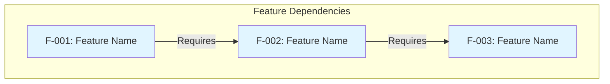
```mermaid
graph TD
    subgraph Feature Dependencies
        F001[F-001: Feature Name]
        F002[F-002: Feature Name]
        F003[F-003: Feature Name]
    end
    
    F001 -->|Requires| F002
    F002 -->|Requires| F003
    
    style F001 fill:#e1f5ff
    style F002 fill:#e1f5ff
    style F003 fill:#e1f5ff
```

**Note**: Actual feature dependencies will be documented based on identified requirements. Only dependencies clearly evident in requirements or system design will be included.

### 2.4.3 Integration Points Template

Integration points between features will be documented as follows:

| **Feature A** | **Feature B** | **Integration Type** | **Data Exchanged** | **Interface** |
|---------------|---------------|----------------------|--------------------|---------------|
| F-XXX | F-YYY | [API / Event / Shared Data / UI Component] | [Description of data] | [Interface specification] |

**Integration Types**:
- **API**: Synchronous request-response integration via API calls
- **Event**: Asynchronous event-driven integration via message queues or event bus
- **Shared Data**: Integration via shared database tables or data stores
- **UI Component**: Integration at the user interface layer via shared components

### 2.4.4 Shared Components Template

Components shared across multiple features will be identified and documented:

| **Component Name** | **Component Type** | **Used By Features** | **Purpose** |
|-------------------|-------------------|----------------------|-------------|
| [Component name] | [Service / Library / UI Component / Data Model] | F-XXX, F-YYY, F-ZZZ | [Description of component purpose and functionality] |

### 2.4.5 Common Services Template

Platform services utilized by multiple features will be catalogued:

| **Service Name** | **Service Type** | **Consuming Features** | **Service Capabilities** |
|-----------------|------------------|------------------------|--------------------------|
| [Service name] | [Authentication / Logging / Notification / Caching] | F-XXX, F-YYY | [Description of service capabilities] |

### 2.4.6 Feature Relationship Matrix

A traceability matrix will document all feature interactions:

```
Feature Relationship Matrix:

         | F-001 | F-002 | F-003 | F-004 | ...
---------|-------|-------|-------|-------|-----
F-001    |   -   |   D   |   I   |   -   | ...
F-002    |   -   |   -   |   S   |   -   | ...
F-003    |   -   |   -   |   -   |   D   | ...
F-004    |   -   |   -   |   -   |   -   | ...
...      |  ...  |  ...  |  ...  |  ...  | ...

Legend:
D = Dependency (row depends on column)
I = Integration (row integrates with column)
S = Shared Component (row shares component with column)
- = No direct relationship
```

## 2.5 Implementation Considerations Framework

### 2.5.1 Implementation Considerations Purpose

Implementation considerations document technical constraints, performance requirements, scalability factors, security implications, and maintenance requirements for each feature. This information guides technical design decisions and ensures non-functional requirements are addressed.

**Status**: *Framework ready for population post-requirements workshops*

### 2.5.2 Technical Constraints Template

For each feature, technical constraints will be documented:

| **Feature ID** | **Constraint Type** | **Constraint Description** | **Impact** |
|---------------|---------------------|----------------------------|------------|
| F-XXX | [Technology / Platform / Infrastructure / Integration] | [Description of constraint] | [Impact on implementation] |

**Constraint Types**:
- **Technology**: Technology stack limitations, framework constraints, language restrictions
- **Platform**: Platform capabilities, operating system requirements, browser compatibility
- **Infrastructure**: Network bandwidth, storage capacity, compute resources
- **Integration**: Third-party API limitations, data format requirements, protocol constraints

### 2.5.3 Performance Requirements Template

Performance targets for each feature will be specified:

| **Feature ID** | **Performance Metric** | **Target Value** | **Measurement Method** |
|---------------|------------------------|------------------|------------------------|
| F-XXX | Response Time | [< X ms] | [Load testing, APM monitoring] |
| F-XXX | Throughput | [Y transactions/second] | [Performance testing, metrics collection] |
| F-XXX | Concurrent Users | [Z users] | [Load testing, capacity planning] |
| F-XXX | Resource Utilization | [CPU < X%, Memory < Y GB] | [System monitoring, profiling] |

### 2.5.4 Scalability Considerations Template

Scalability requirements and approaches will be documented:

| **Feature ID** | **Scalability Dimension** | **Scaling Approach** | **Scaling Triggers** |
|---------------|---------------------------|----------------------|----------------------|
| F-XXX | [Horizontal / Vertical / Data] | [Description of scaling strategy] | [Conditions that trigger scaling] |

**Scalability Dimensions**:
- **Horizontal**: Adding more instances/nodes to distribute load
- **Vertical**: Increasing resources (CPU, memory) of existing instances
- **Data**: Partitioning, sharding, or distributing data across multiple stores

### 2.5.5 Security Implications Template

Security requirements and considerations for each feature will be specified:

| **Feature ID** | **Security Category** | **Security Requirement** | **Implementation Approach** |
|---------------|----------------------|--------------------------|----------------------------|
| F-XXX | [Authentication / Authorization / Data Protection / Audit] | [Specific security requirement] | [How requirement will be met] |

**Security Categories**:
- **Authentication**: User identity verification mechanisms
- **Authorization**: Access control and permission management
- **Data Protection**: Encryption, data masking, secure storage
- **Audit**: Logging, monitoring, compliance tracking
- **Input Validation**: Protection against injection attacks and malicious input
- **Session Management**: Secure session handling and timeout policies

### 2.5.6 Maintenance Requirements Template

Ongoing maintenance and operational considerations will be documented:

| **Feature ID** | **Maintenance Aspect** | **Requirement** | **Frequency** |
|---------------|------------------------|-----------------|---------------|
| F-XXX | [Monitoring / Backup / Updates / Support] | [Specific maintenance requirement] | [How often maintenance is needed] |

**Maintenance Aspects**:
- **Monitoring**: Health checks, performance monitoring, alerting requirements
- **Backup**: Data backup strategies, recovery point objectives (RPO)
- **Updates**: Patching requirements, dependency updates, version management
- **Support**: Support level agreements, incident response procedures
- **Documentation**: Technical documentation, runbooks, operational guides

### 2.5.7 Consolidated Implementation Matrix

Once features are defined, a comprehensive implementation matrix will consolidate all considerations:

```
Implementation Considerations Matrix:

Feature | Constraints | Performance | Scalability | Security | Maintenance
--------|-------------|-------------|-------------|----------|-------------
F-001   | [Summary]   | [Targets]   | [Approach]  | [Reqs]   | [Needs]
F-002   | [Summary]   | [Targets]   | [Approach]  | [Reqs]   | [Needs]
...     | ...         | ...         | ...         | ...      | ...
```

## 2.6 Requirements Traceability Framework

### 2.6.1 Traceability Purpose

Requirements traceability ensures that every requirement can be traced from business objectives through implementation and testing. This framework enables impact analysis, change management, and verification that all requirements are properly addressed.

**Status**: *Framework ready for population post-requirements workshops*

### 2.6.2 Traceability Matrix Template

The traceability matrix links business objectives, features, functional requirements, and test cases:

| **Business Objective** | **Feature ID** | **Requirement ID** | **Test Case ID** | **Implementation Status** |
|------------------------|----------------|-------------------|------------------|---------------------------|
| [Objective reference] | F-XXX | F-XXX-RQ-YYY | TC-XXX | [Not Started / In Progress / Complete] |

### 2.6.3 Requirement Versioning Template

All requirement changes will be tracked using version control:

| **Requirement ID** | **Version** | **Change Date** | **Change Description** | **Changed By** | **Approval Status** |
|-------------------|-------------|-----------------|------------------------|----------------|---------------------|
| F-XXX-RQ-YYY | 1.0 | [Date] | Initial definition | [Author] | Approved |
| F-XXX-RQ-YYY | 1.1 | [Date] | [Change description] | [Author] | Pending Review |

### 2.6.4 Requirements Assumptions and Constraints

All assumptions and constraints affecting requirements will be documented:

#### 2.6.4.1 Assumptions Template

| **Assumption ID** | **Assumption Description** | **Impacted Features** | **Validation Status** |
|-------------------|---------------------------|----------------------|----------------------|
| A-XXX | [Description of assumption] | F-XXX, F-YYY | [Validated / Assumed / Invalidated] |

#### 2.6.4.2 Constraints Template

| **Constraint ID** | **Constraint Description** | **Constraint Type** | **Impacted Features** |
|-------------------|---------------------------|---------------------|----------------------|
| C-XXX | [Description of constraint] | [Technical / Business / Regulatory / Resource] | F-XXX, F-YYY |

## 2.7 Requirements Gathering Process

### 2.7.1 Requirements Elicitation Activities

The following structured activities will be conducted to gather comprehensive requirements for ABK-1929:

#### 2.7.1.1 Business Requirements Workshop

**Objective**: Define the core business problem, identify stakeholders, and establish the value proposition for ABK-1929.

**Participants**:
- Executive sponsors
- Product owners
- Business stakeholders
- Project managers

**Expected Outputs**:
- Business problem statement
- Stakeholder identification and analysis
- Value proposition and ROI justification
- High-level business objectives
- Success criteria and KPIs

**Documentation to Complete**:
- Section 1.2.2 (Core Business Problem)
- Section 1.2.3 (Key Stakeholders and Users)
- Section 1.2.4 (Expected Business Impact)

#### 2.7.1.2 Technical Architecture Sessions

**Objective**: Establish the technical approach, component architecture, and technology stack for ABK-1929.

**Participants**:
- Solution architects
- Technical leads
- Development team representatives
- Infrastructure/DevOps teams

**Expected Outputs**:
- Technology stack recommendations
- Component architecture design
- Integration patterns and approaches
- Technical constraints and considerations
- Development and deployment strategies

**Documentation to Complete**:
- Section 1.3.2.2 (Major System Components)
- Section 1.3.2.3 (Core Technical Approach)
- Section 2.5 (Implementation Considerations)

#### 2.7.1.3 Scope Definition Workshop

**Objective**: Define in-scope and out-of-scope elements with clear stakeholder agreement on project boundaries.

**Participants**:
- Product owners
- Business stakeholders
- Technical leads
- Project managers

**Expected Outputs**:
- In-scope features and capabilities
- Out-of-scope features and exclusions
- Implementation boundaries
- Phasing and roadmap strategy

**Documentation to Complete**:
- Section 1.4.1 (In-Scope Elements)
- Section 1.4.2 (Out-of-Scope Elements)
- Section 2.2 (Feature Catalog)

#### 2.7.1.4 Success Criteria Definition

**Objective**: Establish measurable objectives, KPIs, and critical success factors for ABK-1929.

**Participants**:
- Executive sponsors
- Product owners
- Business analysts
- Quality assurance leads

**Expected Outputs**:
- Measurable objectives and targets
- KPI definitions and baselines
- Critical success factors
- Acceptance criteria framework

**Documentation to Complete**:
- Section 1.3.3 (Success Criteria)
- Section 2.3 (Functional Requirements - Acceptance Criteria)

#### 2.7.1.5 Enterprise Context Analysis

**Objective**: Document the integration landscape and understand current system limitations.

**Participants**:
- Enterprise architects
- Integration specialists
- System owners of dependent systems
- Technical leads

**Expected Outputs**:
- Enterprise system inventory
- Integration requirements and dependencies
- Current system limitations assessment
- Data flow and interface specifications

**Documentation to Complete**:
- Section 1.3.1.3 (Enterprise Integration Landscape)
- Section 2.4 (Feature Relationships - Integration Points)

### 2.7.2 Requirements Documentation Workflow

Once requirements gathering activities are completed, the following workflow will be followed:

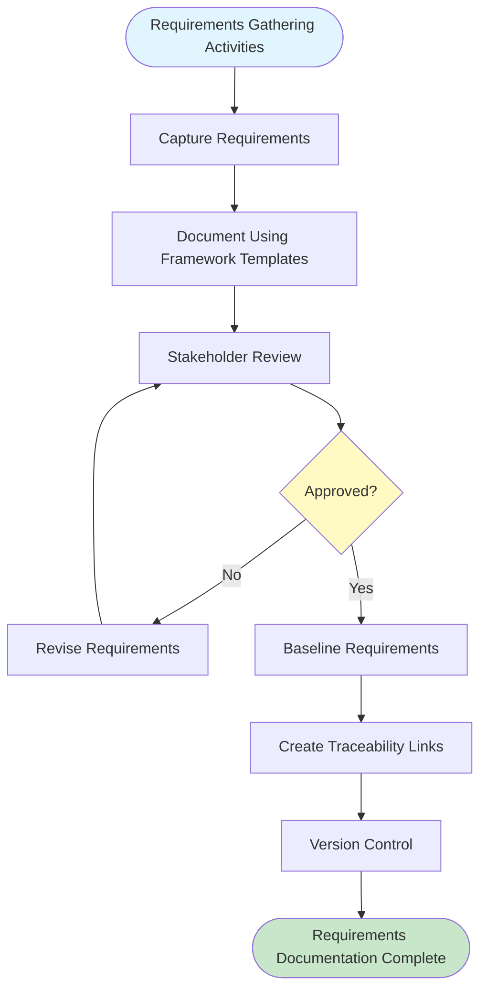
```mermaid
flowchart TD
    Start([Requirements Gathering Activities]) --> Capture[Capture Requirements]
    Capture --> Document[Document Using Framework Templates]
    Document --> Review[Stakeholder Review]
    Review --> Approved{Approved?}
    Approved -->|No| Revise[Revise Requirements]
    Revise --> Review
    Approved -->|Yes| Baseline[Baseline Requirements]
    Baseline --> Trace[Create Traceability Links]
    Trace --> Version[Version Control]
    Version --> Complete([Requirements Documentation Complete])
    
    style Start fill:#e1f5ff
    style Complete fill:#c8e6c9
    style Approved fill:#fff9c4
```

**Workflow Stages**:
1. **Capture Requirements**: Gather requirements from workshops and stakeholder sessions
2. **Document Using Framework Templates**: Populate framework templates provided in this section
3. **Stakeholder Review**: Conduct formal review with stakeholders for validation
4. **Revise Requirements**: Incorporate feedback and resolve conflicts or ambiguities
5. **Baseline Requirements**: Establish approved baseline version
6. **Create Traceability Links**: Link requirements to business objectives and test cases
7. **Version Control**: Commit to repository with proper versioning

### 2.7.3 Requirements Quality Checklist

Before finalizing requirements documentation, validate against this quality checklist:

**Completeness**:
- [ ] All features have unique IDs and complete metadata
- [ ] All functional requirements have acceptance criteria
- [ ] All dependencies and integration points are identified
- [ ] All implementation considerations are documented

**Clarity**:
- [ ] Requirements are stated clearly and unambiguously
- [ ] Technical terms are defined or referenced
- [ ] Examples are provided where helpful for understanding

**Consistency**:
- [ ] Terminology is used consistently throughout
- [ ] No conflicting requirements exist
- [ ] Naming conventions are followed
- [ ] Formatting standards are maintained

**Testability**:
- [ ] All requirements can be verified through testing or inspection
- [ ] Acceptance criteria are specific and measurable
- [ ] Success criteria have quantifiable targets

**Traceability**:
- [ ] All requirements link to business objectives
- [ ] Dependencies are clearly documented
- [ ] Version history is maintained
- [ ] Changes are tracked and approved

## 2.8 References

### 2.8.1 Repository Structure

**Repository Location**: `github.com/blitzytest02/ABK-1929`

**Repository Contents** (as of November 17, 2025):
- `README.md` - Project identifier and initialization marker containing "# ABK-1929"

**Current State**: The repository contains no source code, requirements documentation, or implementation artifacts. This section provides the framework structure to be populated following completion of requirements gathering activities outlined in Section 1.5.

### 2.8.2 Related Technical Specification Sections

The following sections of this technical specification document provide context and complementary information for product requirements:

- **Section 1.2 (Executive Summary)** - Project overview, business context, stakeholder information, and value proposition
- **Section 1.3 (System Overview)** - High-level system description, capabilities, and success criteria
- **Section 1.4 (Scope)** - In-scope and out-of-scope elements, implementation boundaries
- **Section 1.5 (Next Steps for Documentation Completion)** - Planned requirements gathering activities

### 2.8.3 Requirements Frameworks and Standards

This requirements framework follows industry best practices and standards:

- **Feature Identification**: Unique ID format (F-XXX) for traceability
- **Requirement Specification**: Structured format (F-XXX-RQ-YYY) with acceptance criteria
- **Priority Classification**: MoSCoW method (Must-Have, Should-Have, Could-Have)
- **Complexity Assessment**: Three-tier classification (High, Medium, Low)
- **Traceability**: Bidirectional linking from business objectives to test cases

### 2.8.4 Documentation Status

| **Documentation Element** | **Current Status** | **Completion Dependency** |
|---------------------------|-------------------|---------------------------|
| Feature Catalog | Framework Defined | Business Requirements Workshop + Scope Definition Workshop |
| Functional Requirements | Framework Defined | All five requirements gathering activities |
| Feature Relationships | Framework Defined | Technical Architecture Sessions + Scope Definition Workshop |
| Implementation Considerations | Framework Defined | Technical Architecture Sessions |
| Traceability Matrix | Framework Defined | All requirements documentation complete |

**Next Action**: Execute the five requirements gathering activities outlined in Section 2.7.1 to populate this framework with specific, testable requirements for the ABK-1929 system.

# 3. Technology Stack

## 3.1 Overview and Technology Selection Status

**Current Status**: *Planned Architecture - Pending Technical Validation*

Project ABK-1929 is in its initial planning phase, and this section documents the **planned technology stack** that represents the baseline architectural direction for the system. The technologies outlined in this section have been selected based on industry best practices, modern software development standards, and alignment with common enterprise architecture patterns. 

These technology selections will be formally validated and refined during the **Technical Architecture Sessions** identified in Section 1.5, where specific implementation requirements, integration constraints, and organizational standards will be evaluated. Following these sessions, specific version numbers, configuration details, and integration specifications will be finalized and locked for implementation.

### 3.1.1 Technology Stack Philosophy

The planned technology stack for ABK-1929 follows several guiding principles:

**Multi-Platform Support**: The architecture is designed to deliver experiences across web, mobile (iOS and Android), and desktop platforms, utilizing both cross-platform frameworks and native technologies where platform-specific capabilities are required.

**Cloud-Native Architecture**: The system will be built on cloud infrastructure (AWS) with containerization (Docker) and infrastructure-as-code (Terraform) to enable scalability, resilience, and efficient resource management.

**Modern Development Practices**: The stack emphasizes type-safe languages (TypeScript), modern frameworks with strong ecosystem support (React, Flask), and contemporary development workflows with automated CI/CD pipelines.

**AI-Ready Foundation**: Integration of AI/ML capabilities through the Langchain framework positions the system to leverage large language models and other AI services as part of its core functionality.

**Managed Services Where Appropriate**: The architecture leverages managed services for authentication (Auth0) and database hosting (MongoDB Atlas potential) to reduce operational overhead and accelerate time-to-market.

### 3.1.2 Technology Stack Architecture Overview

The following diagram illustrates the high-level architecture and relationships between the major technology components:

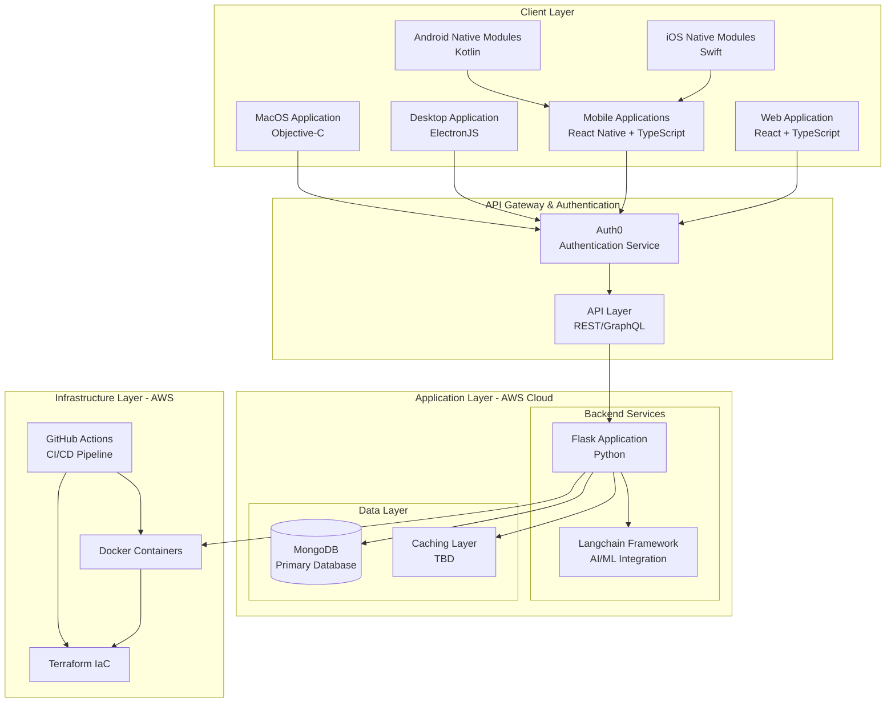
```mermaid
graph TB
    subgraph "Client Layer"
        WEB[Web Application<br/>React + TypeScript]
        MOBILE[Mobile Applications<br/>React Native + TypeScript]
        IOS[iOS Native Modules<br/>Swift]
        ANDROID[Android Native Modules<br/>Kotlin]
        DESKTOP[Desktop Application<br/>ElectronJS]
        MACOS[MacOS Application<br/>Objective-C]
    end
    
    subgraph "API Gateway & Authentication"
        AUTH[Auth0<br/>Authentication Service]
        API[API Layer<br/>REST/GraphQL]
    end
    
    subgraph "Application Layer - AWS Cloud"
        subgraph "Backend Services"
            FLASK[Flask Application<br/>Python]
            LANGCHAIN[Langchain Framework<br/>AI/ML Integration]
        end
        
        subgraph "Data Layer"
            MONGO[(MongoDB<br/>Primary Database)]
            CACHE[Caching Layer<br/>TBD]
        end
    end
    
    subgraph "Infrastructure Layer - AWS"
        DOCKER[Docker Containers]
        TERRAFORM[Terraform IaC]
        CICD[GitHub Actions<br/>CI/CD Pipeline]
    end
    
    WEB --> AUTH
    MOBILE --> AUTH
    IOS --> MOBILE
    ANDROID --> MOBILE
    DESKTOP --> AUTH
    MACOS --> AUTH
    
    AUTH --> API
    API --> FLASK
    FLASK --> LANGCHAIN
    FLASK --> MONGO
    FLASK --> CACHE
    
    FLASK --> DOCKER
    DOCKER --> TERRAFORM
    CICD --> DOCKER
    CICD --> TERRAFORM
```

## 3.2 Programming Languages

### 3.2.1 Backend Languages

#### 3.2.1.1 Python

**Version**: 3.11+ (Latest Stable - TBD)

**Primary Use**: Backend application development, business logic, API services, and AI/ML integration

**Justification and Selection Criteria**:

Python serves as the primary backend language for ABK-1929, selected for the following strategic reasons:

**Ecosystem Maturity**: Python offers extensive library support for web development (Flask), data processing, and AI/ML integration. The rich ecosystem reduces development time and provides battle-tested solutions for common challenges.

**AI/ML Integration**: Python's dominance in the AI/ML space makes it the natural choice for systems leveraging Langchain and other AI frameworks. The seamless integration with machine learning libraries, natural language processing tools, and AI service SDKs accelerates AI feature development.

**Developer Productivity**: Python's clear syntax, dynamic typing, and extensive standard library enable rapid development and iteration, crucial for early-stage projects. The language's readability facilitates onboarding and collaboration across development teams.

**Performance Considerations**: While Python is interpreted, modern Python implementations (CPython 3.11+) offer significant performance improvements. For compute-intensive operations, Python integrates well with compiled extensions (C/C++/Rust) and supports asynchronous programming patterns for I/O-bound workloads.

**Enterprise Adoption**: Python's widespread adoption in enterprise environments ensures availability of skilled developers, extensive documentation, and mature tooling for debugging, profiling, and deployment.

**Constraints and Dependencies**:
- Requires careful memory management for long-running services
- Global Interpreter Lock (GIL) considerations for CPU-bound parallel workloads
- Type safety considerations addressed through optional type hints and mypy static analysis

### 3.2.2 Frontend Languages

#### 3.2.2.1 TypeScript

**Version**: 5.x (Latest Stable - TBD)

**Primary Use**: Web frontend development, mobile application development, desktop application development

**Justification and Selection Criteria**:

TypeScript is the foundational language for all frontend development across web, mobile, and desktop platforms:

**Type Safety**: TypeScript's static type system catches errors at compile-time rather than runtime, significantly reducing production defects and improving code quality. This is particularly valuable in large-scale applications with multiple developers.

**Enhanced Developer Experience**: TypeScript provides superior IDE support with intelligent code completion, refactoring tools, and inline documentation. This accelerates development and reduces cognitive load for developers navigating complex codebases.

**JavaScript Ecosystem Compatibility**: TypeScript is a superset of JavaScript, enabling gradual adoption and seamless integration with the vast JavaScript/Node.js ecosystem. All JavaScript libraries are usable in TypeScript projects.

**Maintainability**: Strong typing and interface definitions serve as living documentation, making codebases more maintainable over time. Refactoring becomes safer and more confident with TypeScript's compiler validating changes across the entire codebase.

**Framework Support**: React, React Native, and Electron all offer first-class TypeScript support, with official type definitions and extensive community adoption ensuring mature tooling and patterns.

**Team Scalability**: TypeScript's explicit contracts between components make it easier for multiple developers to work on different parts of the application simultaneously without introducing integration bugs.

**Version Selection**: TypeScript 5.x introduces improved performance, better type inference, and enhanced module resolution, providing a solid foundation for modern frontend development.

### 3.2.3 Mobile and Native Development Languages

#### 3.2.3.1 Swift

**Version**: 5.x (Latest Stable - TBD)

**Primary Use**: iOS native modules, performance-critical iOS components, platform-specific iOS features

**Justification and Selection Criteria**:

Swift complements React Native for iOS development, providing access to platform-specific capabilities:

**Native Performance**: Swift provides compiled, native performance for computationally intensive operations that may not perform optimally in JavaScript/React Native.

**Platform API Access**: Certain iOS platform features, hardware integrations, or framework capabilities may only be accessible through native code. Swift bridges enable React Native applications to leverage these features.

**Modern Language Design**: Swift's modern syntax, safety features, and performance characteristics make it Apple's preferred language for iOS development, ensuring long-term platform alignment.

**Native Module Development**: Swift enables creation of custom native modules that expose iOS-specific functionality to the React Native layer, allowing the application to deliver truly native experiences where required.

#### 3.2.3.2 Kotlin

**Version**: 1.9+ (Latest Stable - TBD)

**Primary Use**: Android native modules, performance-critical Android components, platform-specific Android features

**Justification and Selection Criteria**:

Kotlin serves as the native development language for Android platform integration:

**Official Android Language**: Kotlin is Google's preferred language for Android development, ensuring first-class support, documentation, and ecosystem alignment.

**Java Interoperability**: Kotlin's seamless interoperability with Java allows integration with existing Android libraries and frameworks without compatibility concerns.

**Modern Language Features**: Kotlin provides null safety, coroutines for asynchronous programming, and concise syntax that reduces boilerplate code common in Java.

**Native Module Bridge**: Kotlin enables development of custom native modules that bridge Android-specific functionality to React Native, providing access to platform APIs, hardware features, and performance-critical operations.

#### 3.2.3.3 Objective-C

**Version**: Latest Stable - TBD

**Primary Use**: MacOS-specific application development (if separate from Electron implementation)

**Justification and Selection Criteria**:

Objective-C is included for potential MacOS-specific development:

**Legacy MacOS Support**: Objective-C remains relevant for MacOS applications requiring deep system integration or supporting older MacOS versions where Swift frameworks may not be available.

**Framework Compatibility**: Certain MacOS frameworks and APIs may have more mature Objective-C interfaces, particularly for system-level integrations.

**Note**: The specific use case for Objective-C versus Swift for MacOS development, or whether MacOS support will be provided via Electron rather than a native application, will be determined during Technical Architecture Sessions based on specific MacOS feature requirements.

### 3.2.4 Language Selection Criteria Summary

The language selections for ABK-1929 follow a strategic multi-language approach:

| **Language** | **Domain** | **Primary Criteria** | **Trade-offs** |
|--------------|------------|----------------------|----------------|
| Python | Backend Services | AI/ML ecosystem, rapid development, extensive libraries | Performance considerations for CPU-bound tasks |
| TypeScript | Frontend (All Platforms) | Type safety, developer experience, ecosystem | Build step overhead, learning curve |
| Swift | iOS Native | Platform integration, performance, Apple ecosystem | iOS-specific, additional language for team |
| Kotlin | Android Native | Platform integration, modern features, Google support | Android-specific, additional language for team |
| Objective-C | MacOS Native (TBD) | Legacy support, framework compatibility | Aging language, Swift preferred for new development |

## 3.3 Frameworks & Libraries

### 3.3.1 Backend Framework

#### 3.3.1.1 Flask

**Version**: 3.x (Latest Stable - TBD)

**Primary Use**: Web application framework, RESTful API development, request handling, routing

**Justification and Selection**:

Flask serves as the core backend framework for ABK-1929, selected for the following strategic reasons:

**Microframework Philosophy**: Flask's minimalist core provides essential web framework functionality (routing, request/response handling, templating) while allowing developers to select and integrate specific libraries for additional capabilities. This flexibility prevents framework lock-in and enables architecture that precisely matches project requirements.

**Extensibility**: Flask's extension ecosystem provides mature, well-maintained packages for common requirements including database integration (Flask-SQLAlchemy, Flask-PyMongo), authentication (Flask-Login, Flask-JWT-Extended), API development (Flask-RESTful), and more. Extensions integrate seamlessly while maintaining the flexibility to swap implementations if requirements evolve.

**API-First Development**: Flask excels at building RESTful APIs and microservices, aligning with modern frontend-backend separation architecture. The framework's simplicity makes API endpoints clear and maintainable.

**Python Ecosystem Integration**: Flask integrates naturally with the broader Python ecosystem, including AI/ML libraries (Langchain), data processing tools, and cloud service SDKs. This integration is crucial for ABK-1929's AI capabilities.

**Developer Familiarity**: Flask's widespread adoption and extensive documentation ensure availability of experienced developers and abundant learning resources.

**Scalability Path**: While Flask itself is minimalist, it supports production deployment at scale through WSGI servers (Gunicorn, uWSGI), load balancing, and containerization. Flask applications can be decomposed into microservices as complexity grows.

**Testing and Quality**: Flask's design facilitates unit testing and integration testing, with built-in test client functionality and clear separation of concerns.

**Alternative Consideration**: Django was considered but deemed too opinionated for this project's requirements. Flask's flexibility better accommodates the planned AI integration and allows for architectural decisions to be made based on specific requirements rather than framework conventions.

### 3.3.2 Frontend Frameworks

#### 3.3.2.1 React

**Version**: 18.x (Latest Stable - TBD)

**Primary Use**: Web application user interface, component-based frontend architecture, single-page application (SPA) development

**Justification and Selection**:

React serves as the web frontend framework, providing:

**Component-Based Architecture**: React's component model promotes reusability, maintainability, and clear separation of concerns. Components encapsulate UI logic and can be composed into complex interfaces while remaining testable and maintainable.

**Virtual DOM Performance**: React's virtual DOM and efficient reconciliation algorithm optimize rendering performance, updating only necessary DOM elements and providing smooth user experiences even with complex, dynamic interfaces.

**Ecosystem Maturity**: React's massive ecosystem provides solutions for routing (React Router), state management (Redux, Zustand, Context API), form handling, data fetching, and virtually any frontend requirement. The ecosystem's maturity ensures stable, well-documented libraries.

**TypeScript Integration**: React offers excellent TypeScript support with comprehensive type definitions, enabling type-safe component development and props validation.

**Developer Experience**: React's declarative syntax, hot module replacement, and extensive developer tools create a productive development environment. The large React developer community ensures availability of skilled engineers.

**Mobile Code Sharing**: React's component model and patterns translate directly to React Native, enabling code sharing for business logic, utility functions, and even some UI components between web and mobile platforms.

**Industry Adoption**: React's widespread enterprise adoption demonstrates its suitability for production applications at scale, with proven patterns for architecture, testing, and deployment.

**Server-Side Rendering Capability**: While the initial implementation may be a client-side SPA, React supports server-side rendering (via Next.js or custom solutions) if SEO or initial load performance requirements emerge.

#### 3.3.2.2 TailwindCSS

**Version**: 3.x (Latest Stable - TBD)

**Primary Use**: Utility-first CSS framework, responsive design, consistent styling across application

**Justification and Selection**:

TailwindCSS provides the styling foundation for the web application:

**Utility-First Approach**: Tailwind's utility class system enables rapid UI development without writing custom CSS. This approach reduces context switching between files and accelerates prototyping and iteration.

**Design Consistency**: Tailwind's design system (spacing scale, color palette, typography) ensures visual consistency across the application. The constrained design tokens prevent arbitrary styling decisions that lead to inconsistent user experiences.

**Responsive Design**: Tailwind's responsive modifiers make it straightforward to build mobile-first, responsive interfaces that adapt seamlessly across device sizes.

**Performance Optimization**: Tailwind's build process (PurgeCSS integration) removes unused styles, resulting in minimal production CSS bundle sizes despite the comprehensive utility class library.

**Customization**: Tailwind's configuration system allows customization of design tokens (colors, spacing, typography) to match brand guidelines while maintaining the utility-first workflow.

**TypeScript Integration**: Tailwind works seamlessly with TypeScript and React, with editor plugins providing autocomplete for class names.

**Developer Productivity**: Once familiar with Tailwind's utility classes, developers can implement designs rapidly without managing separate CSS files or dealing with CSS specificity issues.

**Component Library Compatibility**: Tailwind integrates well with React component libraries (Headless UI, Radix UI) for accessible, unstyled components that can be styled with Tailwind utilities.

### 3.3.3 Mobile Frameworks

#### 3.3.3.1 React Native

**Version**: 0.73+ (Latest Stable - TBD)

**Primary Use**: Cross-platform mobile application development for iOS and Android

**Justification and Selection**:

React Native enables efficient multi-platform mobile development:

**Cross-Platform Development**: React Native allows development of iOS and Android applications from a single codebase, dramatically reducing development effort compared to maintaining separate native codebases. This approach accelerates time-to-market and simplifies ongoing maintenance.

**Native Performance**: Unlike hybrid frameworks (Cordova, Ionic), React Native renders using native UI components, delivering performance and user experience comparable to fully native applications.

**JavaScript Bridge with Native Modules**: React Native's architecture allows JavaScript code to communicate with native modules (Swift for iOS, Kotlin for Android), enabling access to platform-specific features while maintaining most business logic in shared code.

**Code Sharing with Web**: React Native shares React's component model and patterns, enabling significant code reuse for business logic, utilities, API integration, and even some UI components (with react-native-web) between web and mobile platforms.

**Hot Reloading**: React Native's fast refresh capability enables near-instantaneous preview of code changes, dramatically accelerating the development feedback loop.

**Mature Ecosystem**: React Native's extensive ecosystem includes libraries for navigation (React Navigation), state management, native module bridges, and integration with mobile-specific capabilities (camera, geolocation, push notifications).

**TypeScript Support**: React Native offers excellent TypeScript support, enabling type-safe mobile development consistent with the web frontend.

**Over-the-Air Updates**: React Native supports over-the-air updates (via CodePush or similar services) for JavaScript bundle changes, enabling faster deployment of certain updates without app store review processes.

**Flexibility for Native Code**: When React Native's abstraction is insufficient, developers can drop down to native Swift or Kotlin code for specific features, providing an escape hatch while maintaining the benefits of cross-platform development for the majority of the application.

### 3.3.4 Desktop Framework

#### 3.3.4.1 ElectronJS

**Version**: 28+ (Latest Stable - TBD)

**Primary Use**: Cross-platform desktop application development for Windows, MacOS, and Linux

**Justification and Selection**:

ElectronJS enables desktop application delivery using web technologies:

**Cross-Platform Desktop Support**: Electron enables building desktop applications for Windows, MacOS, and Linux from a single codebase, avoiding platform-specific desktop development (WPF, AppKit, GTK).

**Web Technology Reuse**: Electron applications are built with web technologies (HTML, CSS, JavaScript/TypeScript), enabling code sharing with the React web application. UI components, business logic, and API integration code can be reused across web and desktop platforms.

**Chromium Foundation**: Electron packages a Chromium browser and Node.js runtime, providing a consistent, modern runtime environment across all platforms. This eliminates browser compatibility concerns present in web applications.

**Native Integration**: Electron provides APIs for desktop-specific functionality including native menus, system tray integration, file system access, notifications, and system dialog boxes, enabling applications that feel native to each platform.

**Automatic Updates**: Electron supports automatic update mechanisms, simplifying deployment of updates to users without manual download and installation.

**Mature Ecosystem**: Electron powers popular applications (VS Code, Slack, Discord, Microsoft Teams), demonstrating its capability for production-grade desktop software. Extensive documentation and community support are available.

**Developer Experience**: Electron applications can be developed and debugged using standard web development tools, with hot reloading and developer tools familiar to web developers.

**Distribution**: Electron applications can be packaged as standalone executables for each platform, simplifying installation and distribution.

**Trade-offs**: Electron applications have larger bundle sizes and higher memory footprint compared to native applications due to bundling the Chromium runtime. These trade-offs are accepted for the benefits of cross-platform development and code reuse.

### 3.3.5 AI/ML Framework

#### 3.3.5.1 Langchain

**Version**: 0.1.x (Latest Stable - TBD)

**Primary Use**: AI/ML integration, large language model (LLM) orchestration, agent framework, retrieval-augmented generation (RAG)

**Justification and Selection**:

Langchain serves as the AI integration framework for ABK-1929:

**LLM Abstraction Layer**: Langchain provides a unified interface for integrating multiple large language model providers (OpenAI, Anthropic, Google, open-source models), enabling flexibility to choose optimal models for specific use cases and avoid vendor lock-in.

**Prompt Management**: Langchain's prompt template system enables structured, reusable prompt engineering with variable substitution, few-shot examples, and prompt chaining. This makes LLM interactions maintainable and testable.

**Agent Framework**: Langchain's agent capabilities enable building autonomous systems that can use tools, make decisions, and orchestrate complex workflows. This is crucial for AI applications that go beyond simple question-answering to perform actions.

**Retrieval-Augmented Generation (RAG)**: Langchain's document loading, text splitting, vector store integration, and retrieval chains enable RAG patterns, allowing the system to ground LLM responses in specific knowledge bases or documents.

**Memory Systems**: Langchain provides conversation memory implementations (buffer memory, summary memory, entity memory), enabling context-aware, stateful conversations essential for many AI applications.

**Ecosystem Integration**: Langchain integrates with vector databases (Pinecone, Weaviate, Chroma), embeddings providers, and various data sources, providing comprehensive infrastructure for AI applications.

**Python-Native**: Langchain's Python implementation aligns with Python's dominance in AI/ML, integrating naturally with other Python AI libraries and tools.

**Chain Composition**: Langchain's chain abstraction allows complex AI workflows to be built by composing simpler components, promoting modularity and reusability.

**Production Readiness**: Langchain includes features for monitoring, debugging, and optimizing LLM applications, with observability integrations for understanding system behavior in production.

**Community and Evolution**: Langchain's active development and large community ensure the framework evolves with the rapidly changing AI landscape, incorporating new patterns and model capabilities.

## 3.4 Open Source Dependencies

### 3.4.1 Backend Dependencies

The Python backend will leverage the following categories of open-source dependencies (specific packages to be finalized during implementation):

#### 3.4.1.1 Core Framework Extensions

**Flask Ecosystem**:
- `Flask-CORS`: Cross-Origin Resource Sharing support for API endpoints
- `Flask-RESTful` or `Flask-RESTX`: RESTful API development with request parsing and response serialization
- `Flask-PyMongo` or `PyMongo`: MongoDB database integration
- `Flask-JWT-Extended`: JSON Web Token authentication for stateless API authentication

#### 3.4.1.2 Database and Data Management

**MongoDB Integration**:
- `pymongo`: Official MongoDB driver for Python
- `motor`: Asynchronous MongoDB driver for high-performance async applications

**Data Validation**:
- `pydantic`: Data validation using Python type hints, essential for API request/response validation and configuration management
- `marshmallow`: Alternative object serialization/deserialization library

#### 3.4.1.3 AI/ML Dependencies

**Langchain Ecosystem**:
- `langchain`: Core Langchain framework
- `langchain-community`: Community-contributed integrations and utilities
- `openai` or `anthropic`: LLM provider SDKs as needed
- Vector database clients (e.g., `pinecone-client`, `chromadb`) as required

#### 3.4.1.4 Asynchronous Processing

**Async Support**:
- `asyncio`: Python standard library for asynchronous programming
- `aiohttp`: Asynchronous HTTP client/server framework for async API calls

**Task Queues** (TBD based on requirements):
- `celery`: Distributed task queue for background job processing
- `redis` or `RabbitMQ`: Message broker for task queue

#### 3.4.1.5 Utilities and Supporting Libraries

**HTTP and API**:
- `requests`: Synchronous HTTP library for external API integration
- `httpx`: Modern HTTP client with sync and async support

**Configuration**:
- `python-dotenv`: Environment variable management for configuration
- `pyyaml`: YAML configuration file parsing

**Logging and Monitoring**:
- Standard library `logging` enhanced with structured logging utilities
- `sentry-sdk`: Error tracking and monitoring integration

**Date and Time**:
- `python-dateutil`: Enhanced date/time parsing and manipulation

**Testing**:
- `pytest`: Primary testing framework
- `pytest-asyncio`: Async test support
- `pytest-cov`: Code coverage reporting
- `pytest-mock`: Mocking utilities
- `factory_boy`: Test fixture generation

### 3.4.2 Frontend Dependencies

The React/TypeScript frontend will utilize the following dependency categories:

#### 3.4.2.1 Core React Ecosystem

**React Foundation**:
- `react`: Core React library
- `react-dom`: React rendering for web browsers
- `react-router-dom`: Client-side routing for single-page application navigation

**State Management** (Specific solution TBD):
- `zustand`, `redux` with `@reduxjs/toolkit`, or React Context API for application state management
- `react-query` or `@tanstack/react-query`: Server state management, caching, and synchronization

#### 3.4.2.2 UI and Styling

**Styling**:
- `tailwindcss`: Utility-first CSS framework
- `postcss`: CSS transformation and optimization
- `autoprefixer`: Automatic vendor prefix addition for browser compatibility

**Component Libraries** (TBD based on UI requirements):
- `@headlessui/react`: Unstyled, accessible UI components
- `@radix-ui/react-*`: Primitive components for building design systems
- `lucide-react` or `react-icons`: Icon libraries

#### 3.4.2.3 Forms and Validation

**Form Management**:
- `react-hook-form`: Performant form library with validation
- `zod` or `yup`: Schema validation for form inputs

#### 3.4.2.4 Data Fetching and API Integration

**HTTP Clients**:
- `axios` or native `fetch` with `@tanstack/react-query` for API communication
- API client code generation (OpenAPI/Swagger clients) TBD

#### 3.4.2.5 Utilities

**General Utilities**:
- `lodash` or `lodash-es`: Utility functions for data manipulation
- `date-fns`: Modern date utility library
- `classnames` or `clsx`: Conditional className generation

**TypeScript**:
- `typescript`: TypeScript compiler
- `@types/*`: Type definitions for JavaScript libraries

#### 3.4.2.6 Development Tools

**Build and Development**:
- `vite` or `webpack`: Build tool and development server
- `eslint`: Code linting for JavaScript/TypeScript
- `prettier`: Code formatting
- `@typescript-eslint/*`: ESLint TypeScript support

**Testing**:
- `vitest` or `jest`: Testing framework
- `@testing-library/react`: React component testing utilities
- `@testing-library/user-event`: User interaction simulation
- `@testing-library/jest-dom`: Custom Jest matchers for DOM

### 3.4.3 React Native Dependencies

The React Native mobile application will include:

#### 3.4.3.1 Core React Native Ecosystem

**Foundation**:
- `react-native`: Core framework
- `react-native-web`: Web compatibility layer for code sharing (optional)

**Navigation**:
- `@react-navigation/native`: Navigation framework
- `@react-navigation/stack`, `@react-navigation/bottom-tabs`: Navigation patterns

#### 3.4.3.2 Native Module Bridges

**Platform Capabilities** (TBD based on feature requirements):
- `react-native-permissions`: Cross-platform permission handling
- `@react-native-async-storage/async-storage`: Persistent key-value storage
- `react-native-gesture-handler`: Enhanced gesture recognition
- `react-native-reanimated`: High-performance animations
- Camera, geolocation, push notifications libraries as needed

#### 3.4.3.3 Development Tools

**Development Experience**:
- `@react-native-community/eslint-config`: React Native-specific linting
- `metro`: React Native bundler
- `flipper`: Mobile debugging platform

**Testing**:
- `jest`: Testing framework (included with React Native)
- `@testing-library/react-native`: Component testing

### 3.4.4 Package Management and Registries

#### 3.4.4.1 Python Packages

**Package Manager**: `pip`

**Registry**: Python Package Index (PyPI) - https://pypi.org

**Dependency Management**:
- `requirements.txt`: Production dependencies with pinned versions
- `requirements-dev.txt`: Development and testing dependencies
- `poetry` or `pipenv` (alternative): Modern dependency management with lock files (specific tool TBD)

**Virtual Environments**:
- `venv` (standard library): Isolated Python environments for dependency management

#### 3.4.4.2 JavaScript/TypeScript Packages

**Package Manager**: `npm` or `yarn` (specific manager TBD)

**Registry**: npm Registry - https://registry.npmjs.org

**Dependency Management**:
- `package.json`: Dependency declarations and scripts
- `package-lock.json` (npm) or `yarn.lock` (yarn): Dependency version locking for reproducible installs

**Workspace Management** (if monorepo approach):
- npm workspaces, yarn workspaces, or `lerna` for managing multiple JavaScript packages

### 3.4.5 Dependency Version Management Strategy

**Semantic Versioning**: All dependencies will follow semantic versioning (semver) principles, with version ranges specified to balance stability and security updates:
- `^x.y.z`: Allow patch and minor updates (recommended for most dependencies)
- `~x.y.z`: Allow only patch updates (for dependencies requiring strict version control)
- Exact versions: For dependencies requiring absolute version pinning

**Security Updates**: Automated dependency scanning (Dependabot, Snyk, or similar) will monitor for security vulnerabilities, with a process for timely evaluation and updates.

**Dependency Audits**: Regular dependency audits will review:
- Unused dependencies for removal
- Outdated dependencies for updates
- Security vulnerabilities requiring patching
- License compliance

**Lock Files**: Dependency lock files (`package-lock.json`, `yarn.lock`, `poetry.lock`) will be committed to version control to ensure reproducible builds across environments.

## 3.5 Third-Party Services

### 3.5.1 Authentication and Authorization

#### 3.5.1.1 Auth0

**Service Type**: Identity-as-a-Service (IDaaS) platform

**Primary Use**: User authentication, authorization, identity management, single sign-on (SSO)

**Justification and Integration Requirements**:

Auth0 provides comprehensive authentication and authorization capabilities:

**Multi-Platform Support**: Auth0 SDKs support web (JavaScript), mobile (React Native, iOS, Android), and backend (Python) platforms, enabling consistent authentication across all ABK-1929 client applications.

**Authentication Methods**: Auth0 supports multiple authentication methods including username/password, social login (Google, Facebook, GitHub, etc.), enterprise SSO (SAML, OIDC), and multi-factor authentication (MFA), providing flexibility for diverse user requirements.

**Standards-Based**: Auth0 implements industry-standard protocols (OAuth 2.0, OpenID Connect, SAML) ensuring interoperability and security best practices.

**Token Management**: Auth0 handles JWT access token and refresh token generation, validation, and rotation, reducing security implementation burden on the development team.

**User Management**: Auth0 provides user profile management, password reset flows, email verification, and user metadata storage, offloading common authentication concerns.

**Security Features**: Auth0 includes built-in protections against common authentication attacks (brute force, credential stuffing), rate limiting, bot detection, and anomaly detection.

**Scalability**: Auth0 is a fully managed service that scales automatically, eliminating infrastructure concerns for authentication services.

**Customization**: Auth0 supports customizable login pages, authentication flows (using Actions/Rules), and integration with custom identity providers.

**Integration Architecture**:

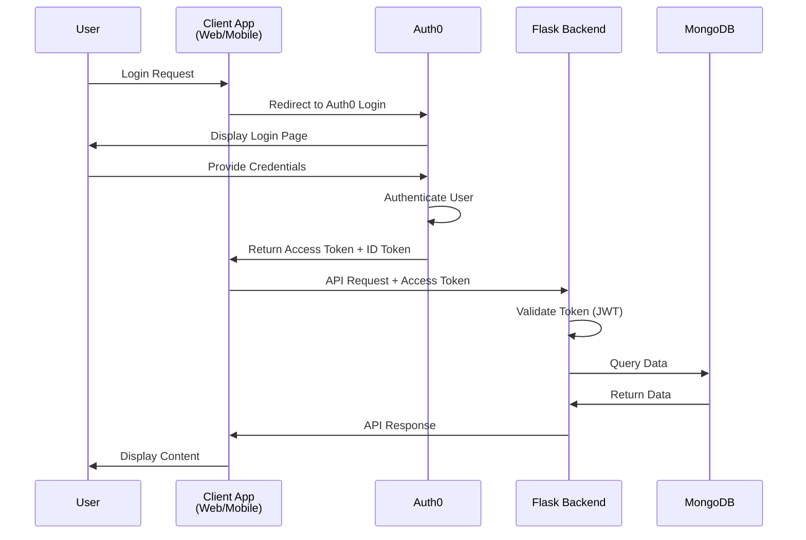
```mermaid
sequenceDiagram
    participant User
    participant ClientApp as Client App<br/>(Web/Mobile)
    participant Auth0
    participant Backend as Flask Backend
    participant MongoDB

    User->>ClientApp: Login Request
    ClientApp->>Auth0: Redirect to Auth0 Login
    Auth0->>User: Display Login Page
    User->>Auth0: Provide Credentials
    Auth0->>Auth0: Authenticate User
    Auth0->>ClientApp: Return Access Token + ID Token
    ClientApp->>Backend: API Request + Access Token
    Backend->>Backend: Validate Token (JWT)
    Backend->>MongoDB: Query Data
    MongoDB->>Backend: Return Data
    Backend->>ClientApp: API Response
    ClientApp->>User: Display Content
```

**Configuration Requirements** (TBD):
- Auth0 tenant setup with appropriate domain
- Application registration for each client platform (web, iOS, Android, desktop)
- API registration for backend service authorization
- Role-Based Access Control (RBAC) configuration
- Hosted login page customization for brand consistency

**Security Considerations**:
- Token storage security (secure storage on mobile, httpOnly cookies or localStorage on web)
- Token expiration and refresh token rotation policies
- Audience validation for API authorization
- Cross-Origin Resource Sharing (CORS) configuration

### 3.5.2 Cloud Infrastructure

#### 3.5.2.1 Amazon Web Services (AWS)

**Service Type**: Cloud infrastructure and platform services

**Primary Use**: Application hosting, data storage, computing resources, managed services

**Justification and Planned Services**:

AWS provides comprehensive cloud infrastructure for ABK-1929:

**Planned AWS Services** (Specific services TBD during Technical Architecture Sessions):

**Compute**:
- **Amazon ECS (Elastic Container Service)** or **Amazon EKS (Elastic Kubernetes Service)**: Container orchestration for Docker-based Flask application deployment
- **AWS Fargate**: Serverless compute for containers, eliminating EC2 instance management
- **AWS Lambda** (optional): Serverless functions for event-driven workloads or background processing

**Storage**:
- **Amazon S3 (Simple Storage Service)**: Object storage for file uploads, static assets, backups, and data lakes
- **Amazon EBS (Elastic Block Store)**: Block storage for persistent database volumes if self-hosting MongoDB

**Database**:
- **MongoDB Atlas on AWS** (preferred): Managed MongoDB service running on AWS infrastructure
- **Amazon DocumentDB** (alternative): AWS-managed MongoDB-compatible database

**Networking**:
- **Amazon VPC (Virtual Private Cloud)**: Isolated network environment for application components
- **AWS ALB (Application Load Balancer)**: Load balancing for Flask application instances
- **Amazon CloudFront**: Content delivery network (CDN) for static asset distribution and low-latency content delivery

**Security and Identity**:
- **AWS IAM (Identity and Access Management)**: Service-to-service authentication and authorization
- **AWS Secrets Manager**: Secure storage for API keys, database credentials, and sensitive configuration
- **AWS WAF (Web Application Firewall)**: Protection against web exploits and bots

**Monitoring and Logging**:
- **Amazon CloudWatch**: Metrics, logs, and alarms for application and infrastructure monitoring
- **AWS X-Ray** (optional): Distributed tracing for performance analysis

**CI/CD Integration**:
- **Amazon ECR (Elastic Container Registry)**: Docker image storage for application containers
- **AWS Systems Manager**: Configuration management and automation

**Justification for AWS**:

**Comprehensive Service Portfolio**: AWS's breadth of services provides solutions for virtually any infrastructure requirement, reducing the need for multi-cloud complexity or third-party services.

**MongoDB Compatibility**: MongoDB Atlas runs natively on AWS infrastructure, ensuring optimal performance and simplified networking.

**Scalability**: AWS services scale from small workloads to enterprise-scale applications, accommodating ABK-1929's growth trajectory.

**Global Infrastructure**: AWS's global presence enables low-latency deployments close to users and supports disaster recovery across regions.

**Enterprise Adoption**: AWS's market leadership and enterprise customer base demonstrate reliability and maturity for production workloads.

**Integration Ecosystem**: AWS services integrate seamlessly with each other and with third-party tools, simplifying architecture and reducing integration complexity.

**Compliance and Security**: AWS maintains extensive compliance certifications (SOC 2, ISO 27001, HIPAA, etc.) and security features, supporting regulatory requirements.

**Cost Management**: AWS provides granular pricing, reserved instance options, and cost management tools for optimizing infrastructure spending.

### 3.5.3 CI/CD Services

#### 3.5.3.1 GitHub Actions

**Service Type**: Continuous Integration and Continuous Deployment (CI/CD) platform

**Primary Use**: Automated testing, building, and deployment pipelines

**Justification and Integration**:

GitHub Actions provides integrated CI/CD capabilities:

**Native GitHub Integration**: GitHub Actions is integrated directly into GitHub repositories, providing seamless workflow triggers on git events (push, pull request, release) without external service configuration.

**Workflow as Code**: GitHub Actions workflows are defined in YAML files committed to the repository, enabling version-controlled, reviewable pipeline definitions.

**Multi-Platform Support**: GitHub Actions supports Linux, Windows, and MacOS runners, enabling building and testing for all target platforms from a single CI/CD system.

**Extensive Marketplace**: The GitHub Actions marketplace provides thousands of pre-built actions for common tasks (Docker builds, AWS deployments, testing frameworks, code quality tools), accelerating pipeline development.

**Matrix Builds**: GitHub Actions supports matrix strategies for testing across multiple environments (Python versions, Node versions, operating systems) efficiently.

**Secrets Management**: GitHub Actions provides encrypted secrets storage for API keys, credentials, and deployment tokens, accessible to workflows but hidden from logs.

**Cost-Effective**: GitHub Actions includes generous free tier minutes for public repositories and reasonable pricing for private repositories, with self-hosted runner options for cost optimization.

**Integration with AWS**: GitHub Actions integrates with AWS through official actions for ECR, ECS, Lambda deployment, and infrastructure as code (Terraform) workflows.

**Planned CI/CD Pipeline Structure**:

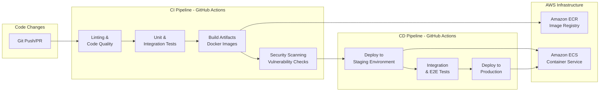
```mermaid
graph LR
    subgraph "Code Changes"
        COMMIT[Git Push/PR]
    end
    
    subgraph "CI Pipeline - GitHub Actions"
        LINT[Linting &<br/>Code Quality]
        TEST[Unit &<br/>Integration Tests]
        BUILD[Build Artifacts<br/>Docker Images]
        SCAN[Security Scanning<br/>Vulnerability Checks]
    end
    
    subgraph "CD Pipeline - GitHub Actions"
        DEPLOY_STAGING[Deploy to<br/>Staging Environment]
        INTEGRATION_TEST[Integration<br/>& E2E Tests]
        DEPLOY_PROD[Deploy to<br/>Production]
    end
    
    subgraph "AWS Infrastructure"
        ECR[Amazon ECR<br/>Image Registry]
        ECS[Amazon ECS<br/>Container Service]
    end
    
    COMMIT --> LINT
    LINT --> TEST
    TEST --> BUILD
    BUILD --> SCAN
    SCAN --> DEPLOY_STAGING
    DEPLOY_STAGING --> INTEGRATION_TEST
    INTEGRATION_TEST --> DEPLOY_PROD
    
    BUILD --> ECR
    DEPLOY_STAGING --> ECS
    DEPLOY_PROD --> ECS
```

**Pipeline Stages** (TBD - detailed configuration):

1. **Code Quality Stage**:
   - Python linting (pylint, flake8, black)
   - TypeScript/JavaScript linting (ESLint)
   - Code formatting validation (Prettier, Black)
   - Type checking (mypy for Python, tsc for TypeScript)

2. **Testing Stage**:
   - Python unit tests (pytest)
   - Frontend unit tests (Vitest/Jest)
   - React Native tests
   - Code coverage reporting

3. **Build Stage**:
   - Docker image builds for backend services
   - Frontend application builds (web, mobile, desktop)
   - Dependency vulnerability scanning

4. **Deployment Stage**:
   - Terraform plan/apply for infrastructure changes
   - Docker image push to Amazon ECR
   - ECS service updates with new container images
   - Smoke tests post-deployment

**Deployment Strategies** (TBD):
- **Rolling deployment**: Gradual instance replacement for zero-downtime updates
- **Blue-green deployment**: Full environment swap for instant rollback capability
- **Canary deployment**: Gradual traffic shifting to new version for risk mitigation

## 3.6 Databases & Storage

### 3.6.1 Primary Database

#### 3.6.1.1 MongoDB

**Version**: 7.x (Latest Stable - TBD)

**Deployment**: MongoDB Atlas (Managed Service on AWS) - Preferred

**Primary Use**: Primary application database for persistent data storage

**Justification and Selection Criteria**:

MongoDB serves as the primary database for ABK-1929:

**Document-Oriented Model**: MongoDB's document model stores data in flexible, JSON-like documents (BSON), aligning naturally with JavaScript/TypeScript objects used in React/React Native frontends and Python dictionaries in the backend. This eliminates object-relational mapping overhead.

**Schema Flexibility**: MongoDB's flexible schema accommodates evolving data models common in early-stage applications. Fields can be added to documents without schema migrations, accelerating iteration during development.

**Scalability**: MongoDB supports horizontal scaling through sharding, distributing data across multiple servers as data volume grows. This provides a clear scalability path beyond single-server databases.

**Query Capabilities**: MongoDB provides rich query language with support for complex queries, aggregation pipelines for data transformation and analysis, full-text search, and geospatial queries.

**High Availability**: MongoDB's replica sets provide automatic failover and data redundancy, ensuring high availability. MongoDB Atlas handles replica set management automatically.

**Performance**: MongoDB's indexing capabilities, in-memory storage engine, and efficient document storage provide strong performance for read and write operations.

**Ecosystem Integration**: MongoDB has excellent Python integration via PyMongo and Motor (async), mature drivers for all platforms, and extensive tooling for development, monitoring, and administration.

**Managed Service Benefits (MongoDB Atlas)**:
- Automated backups and point-in-time recovery
- Automated scaling and cluster management
- Built-in monitoring and performance optimization recommendations
- Security features (encryption at rest/in transit, network isolation, IP whitelisting)
- Global cluster deployment for low-latency access across regions
- Elimination of database administration operational overhead

**AI/ML Integration**: MongoDB's flexible schema and rich query capabilities support storing and querying embeddings, vector similarity search (Atlas Vector Search), and AI-related metadata, aligning with Langchain integration requirements.

**Developer Experience**: MongoDB's JSON-like document format is intuitive for developers, the MongoDB shell provides powerful ad-hoc query capabilities, and GUI tools (MongoDB Compass) facilitate data exploration during development.

**Alternative Consideration**: Relational databases (PostgreSQL, MySQL) were considered but deemed less suitable due to the expected schema evolution, document-oriented data models, and the benefits of schema flexibility during the early project phases.

#### 3.6.1.2 Database Design Considerations

**Collections Structure** (TBD - detailed schema design pending requirements):
- Collections organized by domain entities (users, documents, sessions, etc.)
- Embedded documents vs. references strategy based on access patterns
- Indexing strategy aligned with query patterns

**Data Modeling Best Practices**:
- Design schema based on application access patterns, not normalized relational models
- Embed related data accessed together; reference data accessed independently
- Use indexes for frequently queried fields
- Implement appropriate data validation rules

**Connection Management**:
- Connection pooling for efficient database connection reuse
- Connection string configuration via environment variables
- Retry logic for transient connection failures

### 3.6.2 Storage Strategy

#### 3.6.2.1 Amazon S3 (Simple Storage Service)

**Primary Use**: Object storage for files, static assets, backups, and large binary data

**Use Cases**:

**File Uploads**: User-generated content (documents, images, videos) stored in S3 rather than database, with metadata and references stored in MongoDB.

**Static Assets**: Frontend application static assets (if not served via CDN directly), large media files, downloadable content.

**Backups**: MongoDB backup storage (automated via MongoDB Atlas to S3), application configuration backups, disaster recovery archives.

**Data Lakes**: Raw data storage for analytics or AI/ML training data if applicable.

**Advantages**:
- Virtually unlimited storage capacity
- High durability (99.999999999%)
- Cost-effective for large data volumes
- Versioning and lifecycle policies for data management
- Presigned URLs for secure, temporary file access
- Integration with CloudFront CDN for content delivery

**Storage Classes** (TBD based on access patterns):
- **S3 Standard**: Frequently accessed data
- **S3 Intelligent-Tiering**: Automatic cost optimization based on access patterns
- **S3 Glacier**: Long-term archival storage for backups

### 3.6.3 Caching Solutions

#### 3.6.3.1 Caching Strategy

**Status**: TBD - Specific caching implementation to be determined during Technical Architecture Sessions

**Potential Caching Layers**:

**Application-Level Caching**:
- In-memory caching within Flask application (using Python dictionaries or `cachetools`) for frequently accessed, relatively static data
- Query result caching for expensive database queries or AI/ML inference results

**Distributed Cache (If Required)**:
- **Amazon ElastiCache for Redis**: Managed Redis service for distributed caching across multiple application instances
- Use cases: Session storage, API response caching, rate limiting, real-time features

**CDN Caching**:
- **Amazon CloudFront**: Edge caching for static assets and API responses with appropriate cache headers

**Browser Caching**:
- HTTP cache headers for frontend assets to leverage browser caching

**Caching Considerations**:
- Cache invalidation strategies (TTL, event-based invalidation)
- Cache key design for effective cache hit rates
- Cache sizing and eviction policies
- Monitoring cache hit/miss rates for optimization

**Database Query Optimization**:
- MongoDB indexes for query performance
- Aggregation pipeline optimization
- Projection to retrieve only necessary fields

**Decision Criteria**:
Specific caching implementation will be based on:
- Application performance profiling identifying bottlenecks
- Database query patterns and load characteristics
- Cost-benefit analysis of cache infrastructure versus database scaling
- User experience latency requirements

## 3.7 Development & Deployment

### 3.7.1 Containerization

#### 3.7.1.1 Docker

**Version**: 24+ (Latest Stable - TBD)

**Primary Use**: Application containerization, consistent environments, microservices packaging

**Justification and Strategy**:

Docker provides containerization for ABK-1929 services:

**Environment Consistency**: Docker containers package application code, runtime, dependencies, and configuration into immutable units, ensuring identical behavior across development, staging, and production environments. This eliminates "works on my machine" issues.

**Dependency Management**: Docker images encapsulate all application dependencies (Python packages, system libraries, configuration), preventing dependency conflicts and simplifying deployment.

**Microservices Architecture**: Docker enables decomposing the Flask application into multiple containers (API service, background workers, AI services), each independently deployable and scalable.

**Resource Efficiency**: Containers share the host OS kernel, providing lighter-weight isolation than virtual machines with faster startup times and lower overhead.

**Orchestration Foundation**: Docker containers are the deployment unit for AWS ECS, EKS, and Kubernetes, enabling container orchestration for scaling and high availability.

**Development Workflow**: Docker Compose enables local multi-container development environments matching production architecture, with services for the Flask application, MongoDB, Redis (if used), and other dependencies.

**CI/CD Integration**: Docker images built in CI/CD pipelines ensure tested artifacts are deployed to production, with image tags providing version tracking.

**Planned Container Architecture**:

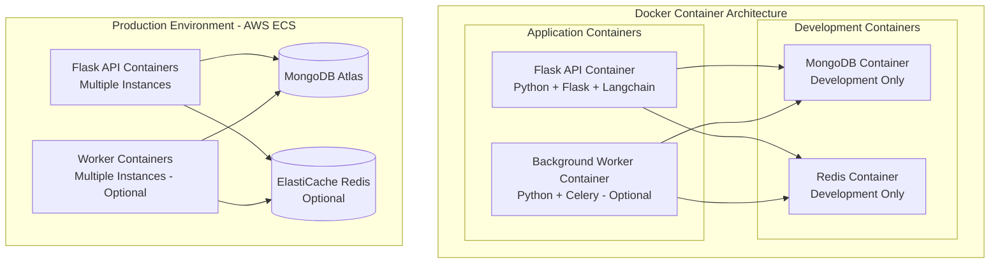
```mermaid
graph TB
    subgraph "Docker Container Architecture"
        subgraph "Application Containers"
            FLASK[Flask API Container<br/>Python + Flask + Langchain]
            WORKER[Background Worker Container<br/>Python + Celery - Optional]
        end
        
        subgraph "Development Containers"
            MONGO_DEV[MongoDB Container<br/>Development Only]
            REDIS_DEV[Redis Container<br/>Development Only]
        end
        
        FLASK --> MONGO_DEV
        FLASK --> REDIS_DEV
        WORKER --> MONGO_DEV
        WORKER --> REDIS_DEV
    end
    
    subgraph "Production Environment - AWS ECS"
        FLASK_PROD[Flask API Containers<br/>Multiple Instances]
        WORKER_PROD[Worker Containers<br/>Multiple Instances - Optional]
        
        MONGO_ATLAS[(MongoDB Atlas)]
        REDIS_ELASTICACHE[(ElastiCache Redis<br/>Optional)]
        
        FLASK_PROD --> MONGO_ATLAS
        FLASK_PROD --> REDIS_ELASTICACHE
        WORKER_PROD --> MONGO_ATLAS
        WORKER_PROD --> REDIS_ELASTICACHE
    end
```

**Dockerfile Strategy**:

**Multi-Stage Builds**: Use multi-stage Dockerfiles to separate build dependencies from runtime dependencies, minimizing final image size.

**Base Image Selection**: Use official Python base images (e.g., `python:3.11-slim`) for security and maintainability.

**Layer Optimization**: Structure Dockerfile to leverage Docker layer caching, with dependency installation before application code copying.

**Security Practices**:
- Run containers as non-root users
- Minimize image attack surface by including only necessary packages
- Regular base image updates for security patches
- Image scanning for vulnerabilities (integrated into CI/CD)

**Docker Compose for Development**:
- `docker-compose.yml` defining local development environment
- Services for Flask application, MongoDB, Redis, and any other dependencies
- Volume mounts for hot-reloading during development
- Network configuration for service discovery

### 3.7.2 Infrastructure as Code

#### 3.7.2.1 Terraform

**Version**: 1.6+ (Latest Stable - TBD)

**Primary Use**: AWS infrastructure provisioning and management

**Justification and Strategy**:

Terraform provides infrastructure-as-code capabilities for ABK-1929:

**Declarative Infrastructure**: Terraform's declarative configuration defines desired infrastructure state, with Terraform handling the steps to achieve that state. This makes infrastructure reproducible and versionable.

**Version Control**: Terraform configurations stored in git provide infrastructure change history, review processes via pull requests, and rollback capability.

**Multi-Environment Management**: Terraform workspaces or separate state files enable managing multiple environments (development, staging, production) from the same configuration codebase with environment-specific variables.

**AWS Provider Maturity**: Terraform's AWS provider supports virtually all AWS services with comprehensive resource coverage, ensuring infrastructure can be fully managed as code.

**State Management**: Terraform state files track deployed infrastructure, enabling detection of configuration drift and safe updates to existing resources.

**Plan Before Apply**: Terraform's plan command previews infrastructure changes before execution, preventing unintended modifications and enabling review of infrastructure changes.

**Modularity**: Terraform modules enable reusable infrastructure components (VPC configuration, ECS cluster setup, database configuration), promoting consistency and reducing duplication.

**Integration with CI/CD**: Terraform integrates with GitHub Actions for automated infrastructure deployments, with plan output on pull requests and apply on merge.

**Planned Infrastructure Components** (TBD - detailed configuration):

**Network Infrastructure**:
- VPC configuration with public and private subnets across multiple availability zones
- Security groups for application tier, database tier, and load balancer
- NAT gateways for private subnet internet access
- VPC endpoints for AWS service access without internet routing

**Compute Infrastructure**:
- ECS cluster configuration
- ECS task definitions for Flask application containers
- ECS service definitions with load balancer integration
- Auto-scaling policies based on CPU, memory, or custom metrics

**Load Balancing**:
- Application Load Balancer (ALB) configuration
- Target groups for ECS services
- Listener rules and routing configuration
- SSL/TLS certificate management (AWS Certificate Manager)

**Storage and Database**:
- S3 bucket configuration with appropriate policies
- MongoDB Atlas cluster (via Terraform MongoDB Atlas provider) or DocumentDB
- ElastiCache Redis cluster (if applicable)

**Security and Secrets**:
- IAM roles and policies for ECS tasks
- Secrets Manager resources for sensitive configuration
- Security group rules for network access control

**Monitoring and Logging**:
- CloudWatch log groups for application logs
- CloudWatch alarms for critical metrics
- SNS topics for alerting

**Terraform Best Practices**:

**Remote State Storage**: Store Terraform state in S3 with DynamoDB state locking to prevent concurrent modification conflicts.

**State File Security**: Encrypt state files at rest and limit access, as state files contain sensitive information.

**Variable Management**: Use Terraform variables for environment-specific configuration, with variable values stored in `.tfvars` files or environment variables.

**Resource Naming**: Implement consistent naming conventions using Terraform locals and variables.

**Tagging Strategy**: Apply consistent tags to all resources for cost tracking, environment identification, and resource management.

### 3.7.3 CI/CD Pipeline

#### 3.7.3.1 GitHub Actions Workflow Strategy

**Pipeline Architecture**:

The CI/CD pipeline will implement automated quality gates and deployment processes:

**Continuous Integration (CI) Triggers**:
- **Pull Request**: Run linting, testing, and build validation on all pull requests before merge
- **Push to Main Branch**: Execute full CI pipeline including security scans and integration tests
- **Release Tags**: Trigger production deployment workflows

**CI Pipeline Stages**:

**Stage 1: Code Quality and Linting**
- Python code linting (flake8, pylint, black format check)
- TypeScript/JavaScript linting (ESLint)
- Code formatting validation (Prettier)
- Static type checking (mypy for Python, tsc for TypeScript)
- Commit message linting for conventional commits

**Stage 2: Unit and Integration Testing**
- Python unit tests (pytest) with coverage reporting
- Frontend unit tests (Vitest/Jest) with coverage reporting
- React Native component tests
- Test result publishing and coverage tracking
- Failure notifications

**Stage 3: Build and Package**
- Docker image builds for backend services
- Frontend application builds (React web, React Native, Electron)
- Build artifact retention for deployment stages
- Docker image tagging with commit SHA and semantic version

**Stage 4: Security Scanning**
- Dependency vulnerability scanning (npm audit, pip-audit, or Snyk)
- Docker image security scanning (Trivy, Snyk Container)
- Static Application Security Testing (SAST) - optional
- License compliance checking

**Continuous Deployment (CD) Stages**:

**Stage 5: Staging Deployment**
- Terraform plan for infrastructure changes
- Terraform apply to staging environment
- Docker image push to Amazon ECR
- ECS service update with new container images
- Database migration execution (if applicable)
- Smoke tests and health checks

**Stage 6: Integration and E2E Testing**
- Integration tests against staging environment
- End-to-end tests for critical user workflows
- Performance testing and API load testing (optional)
- Test result reporting

**Stage 7: Production Deployment** (Manual Approval or Automated):
- Approval gate for production deployment
- Terraform plan for production infrastructure
- Terraform apply to production environment
- Progressive deployment (rolling update, blue-green, or canary)
- Post-deployment smoke tests
- Rollback capability on failure

**Stage 8: Post-Deployment**
- CloudWatch monitoring validation
- Alert rule verification
- Deployment notification (Slack, email, etc.)
- Deployment metrics recording

**Workflow Configuration** (High-Level):

```yaml
# Conceptual GitHub Actions Workflow Structure (Actual implementation TBD)
# .github/workflows/ci-cd.yml

on:
  pull_request:
    # Run CI on all PRs
  push:
    branches: [main]
    # Run CI + Deploy to Staging on main branch
  release:
    types: [published]
    # Deploy to Production on release

jobs:
  lint-and-test:
    # Code quality and testing stages
    
  build:
    needs: lint-and-test
    # Build Docker images and artifacts
    
  security-scan:
    needs: build
    # Security scanning
    
  deploy-staging:
    needs: security-scan
    if: github.ref == 'refs/heads/main'
    # Deploy to staging environment
    
  integration-tests:
    needs: deploy-staging
    # Run integration tests
    
  deploy-production:
    needs: integration-tests
    if: github.event_name == 'release'
    # Deploy to production with approval
```

### 3.7.4 Development Tools

#### 3.7.4.1 Development Environment Tools

**Code Editors and IDEs**:
- **Visual Studio Code** (Recommended): Extensive Python, TypeScript, React, and Docker extension support
- **PyCharm** (Alternative): Python-focused IDE with strong debugging capabilities
- **WebStorm** (Alternative): JavaScript/TypeScript-focused IDE

**Essential VS Code Extensions** (Recommended):
- **Python**: Microsoft Python extension for linting, debugging, and IntelliSense
- **Pylance**: Advanced Python language server
- **ESLint**: JavaScript/TypeScript linting integration
- **Prettier**: Code formatting
- **Docker**: Docker container management and Dockerfile support
- **Remote - Containers**: Develop inside Docker containers
- **GitLens**: Enhanced git capabilities
- **Terraform**: Terraform syntax highlighting and validation

**API Development and Testing**:
- **Postman** or **Insomnia**: API endpoint testing and documentation
- **curl** or **HTTPie**: Command-line HTTP clients for API testing

**Database Tools**:
- **MongoDB Compass**: GUI for MongoDB query, aggregation, and data exploration
- **MongoDB Shell (mongosh)**: Command-line MongoDB interaction

**Version Control**:
- **Git**: Distributed version control system
- **GitHub CLI** (gh): Command-line GitHub interaction for PR management and workflows

**Container Development**:
- **Docker Desktop**: Local Docker development environment
- **Docker Compose**: Multi-container application orchestration for local development

**Python Development Tools**:
- **iPython** or **Python REPL**: Interactive Python shell for experimentation
- **Jupyter Notebooks** (optional): Interactive data exploration and AI experimentation

**Documentation**:
- **Markdown editors**: Documentation authoring
- **Swagger/OpenAPI editors**: API specification development

#### 3.7.4.2 Testing Tools

**Backend Testing**:
- **pytest**: Primary Python testing framework
- **pytest plugins**: pytest-cov (coverage), pytest-asyncio (async tests), pytest-mock (mocking)
- **coverage.py**: Code coverage measurement
- **Locust** or **pytest-benchmark** (optional): Performance and load testing

**Frontend Testing**:
- **Vitest** or **Jest**: JavaScript/TypeScript testing frameworks
- **React Testing Library**: Component testing for React
- **React Native Testing Library**: Component testing for React Native
- **Playwright** or **Cypress** (optional): End-to-end testing for web applications

**Code Quality Tools**:
- **SonarQube** or **CodeClimate** (optional): Continuous code quality analysis
- **Codecov** or **Coveralls**: Coverage tracking over time

#### 3.7.4.3 Monitoring and Debugging Tools

**Application Monitoring**:
- **Amazon CloudWatch**: Logs, metrics, and alarms (covered in AWS section)
- **Sentry**: Error tracking and performance monitoring (integration TBD)
- **DataDog** or **New Relic** (alternative): Full-stack observability platform (TBD)

**Local Debugging**:
- **Python Debugger (pdb)** and **VS Code debugger**: Backend debugging
- **React DevTools**: React component inspection and profiling
- **Redux DevTools**: State management debugging (if Redux used)
- **Flipper**: React Native mobile debugging

**Log Analysis**:
- **CloudWatch Logs Insights**: AWS log querying
- **Local log aggregation**: Structured logging for local development

#### 3.7.4.4 Collaboration and Documentation Tools

**Code Collaboration**:
- **GitHub**: Version control, pull requests, code reviews, issue tracking
- **GitHub Projects**: Project management and issue tracking

**Documentation**:
- **Markdown files in repository**: Technical documentation (including this specification)
- **OpenAPI/Swagger specification**: API documentation (TBD)
- **Docstrings**: Inline code documentation

**Communication**:
- **Slack** or **Microsoft Teams** (TBD): Team communication
- **Zoom** or **Google Meet** (TBD): Video conferencing for technical sessions

## 3.8 Technology Stack Integration Architecture

### 3.8.1 End-to-End Technology Flow

The following diagram illustrates how the technology components integrate across the full application stack:

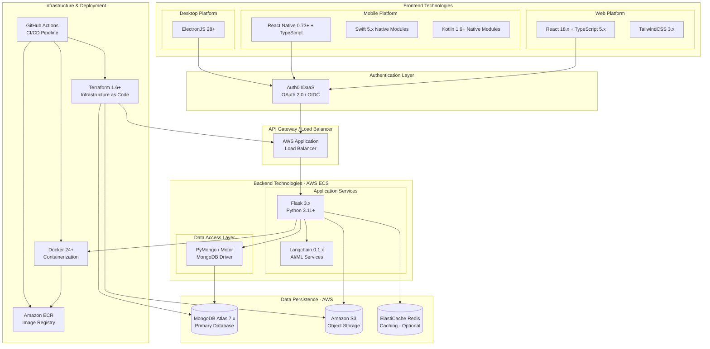
```mermaid
graph TB
    subgraph "Frontend Technologies"
        subgraph "Web Platform"
            REACT[React 18.x + TypeScript 5.x]
            TAILWIND[TailwindCSS 3.x]
        end
        
        subgraph "Mobile Platform"
            RN[React Native 0.73+ + TypeScript]
            SWIFT[Swift 5.x Native Modules]
            KOTLIN[Kotlin 1.9+ Native Modules]
        end
        
        subgraph "Desktop Platform"
            ELECTRON[ElectronJS 28+]
        end
    end
    
    subgraph "Authentication Layer"
        AUTH0[Auth0 IDaaS<br/>OAuth 2.0 / OIDC]
    end
    
    subgraph "API Gateway / Load Balancer"
        ALB[AWS Application<br/>Load Balancer]
    end
    
    subgraph "Backend Technologies - AWS ECS"
        subgraph "Application Services"
            FLASK_APP[Flask 3.x<br/>Python 3.11+]
            LANGCHAIN_SVC[Langchain 0.1.x<br/>AI/ML Services]
        end
        
        subgraph "Data Access Layer"
            PYMONGO[PyMongo / Motor<br/>MongoDB Driver]
        end
    end
    
    subgraph "Data Persistence - AWS"
        MONGODB[(MongoDB Atlas 7.x<br/>Primary Database)]
        S3[(Amazon S3<br/>Object Storage)]
        REDIS[(ElastiCache Redis<br/>Caching - Optional)]
    end
    
    subgraph "Infrastructure & Deployment"
        DOCKER[Docker 24+<br/>Containerization]
        TERRAFORM[Terraform 1.6+<br/>Infrastructure as Code]
        GHA[GitHub Actions<br/>CI/CD Pipeline]
        ECR[Amazon ECR<br/>Image Registry]
    end
    
    REACT --> AUTH0
    RN --> AUTH0
    ELECTRON --> AUTH0
    
    AUTH0 --> ALB
    ALB --> FLASK_APP
    
    FLASK_APP --> LANGCHAIN_SVC
    FLASK_APP --> PYMONGO
    PYMONGO --> MONGODB
    FLASK_APP --> S3
    FLASK_APP --> REDIS
    
    FLASK_APP --> DOCKER
    DOCKER --> ECR
    GHA --> DOCKER
    GHA --> ECR
    GHA --> TERRAFORM
    TERRAFORM --> ALB
    TERRAFORM --> MONGODB
    TERRAFORM --> S3
```

### 3.8.2 Development to Production Technology Flow

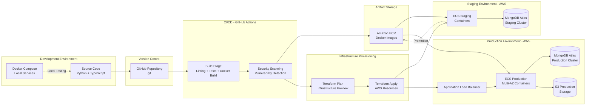
```mermaid
graph LR
    subgraph "Development Environment"
        DEV_CODE[Source Code<br/>Python + TypeScript]
        DEV_DOCKER[Docker Compose<br/>Local Services]
    end
    
    subgraph "Version Control"
        GITHUB[GitHub Repository<br/>git]
    end
    
    subgraph "CI/CD - GitHub Actions"
        CI_BUILD[Build Stage<br/>Linting + Tests + Docker Build]
        CI_SCAN[Security Scanning<br/>Vulnerability Detection]
    end
    
    subgraph "Artifact Storage"
        ECR_REG[Amazon ECR<br/>Docker Images]
    end
    
    subgraph "Infrastructure Provisioning"
        TF_PLAN[Terraform Plan<br/>Infrastructure Preview]
        TF_APPLY[Terraform Apply<br/>AWS Resources]
    end
    
    subgraph "Staging Environment - AWS"
        STAGE_ECS[ECS Staging<br/>Containers]
        STAGE_DB[(MongoDB Atlas<br/>Staging Cluster)]
    end
    
    subgraph "Production Environment - AWS"
        PROD_ALB[Application Load Balancer]
        PROD_ECS[ECS Production<br/>Multi-AZ Containers]
        PROD_DB[(MongoDB Atlas<br/>Production Cluster)]
        PROD_S3[(S3 Production<br/>Storage)]
    end
    
    DEV_CODE --> GITHUB
    DEV_DOCKER -.Local Testing.-> DEV_CODE
    
    GITHUB --> CI_BUILD
    CI_BUILD --> CI_SCAN
    CI_SCAN --> ECR_REG
    
    CI_SCAN --> TF_PLAN
    TF_PLAN --> TF_APPLY
    
    ECR_REG --> STAGE_ECS
    TF_APPLY --> STAGE_ECS
    STAGE_ECS --> STAGE_DB
    
    STAGE_ECS -.Promotion.-> ECR_REG
    ECR_REG --> PROD_ECS
    TF_APPLY --> PROD_ALB
    PROD_ALB --> PROD_ECS
    PROD_ECS --> PROD_DB
    PROD_ECS --> PROD_S3
```

### 3.8.3 Technology Integration Points

**Frontend to Backend Integration**:
- **Protocol**: HTTPS/REST API (GraphQL consideration TBD)
- **Authentication**: JWT access tokens from Auth0 in Authorization header
- **Data Format**: JSON for request/response payloads
- **CORS**: Configured in Flask for allowed origins

**Backend to Database Integration**:
- **Driver**: PyMongo (sync) or Motor (async) for MongoDB connectivity
- **Connection**: MongoDB connection string with authentication from Secrets Manager
- **Connection Pooling**: Configured for optimal performance
- **ORM Alternative**: Beanie or ODMantic (Python MongoDB ODMs) - TBD

**Backend to AI Services Integration**:
- **Framework**: Langchain provides abstraction layer
- **LLM Providers**: OpenAI, Anthropic, or others via Langchain
- **Embeddings**: Integration with embedding models for vector operations
- **Vector Store**: MongoDB Atlas Vector Search or separate vector database (TBD)

**Backend to Storage Integration**:
- **AWS SDK**: Boto3 (Python AWS SDK) for S3 operations
- **File Upload Flow**: Client uploads to S3 via presigned URLs or through backend proxy
- **File References**: S3 object keys/URLs stored in MongoDB documents

**Authentication Integration**:
- **Auth0 SDKs**: Platform-specific SDKs for web, mobile, backend
- **Token Validation**: Flask backend validates JWT tokens from Auth0
- **User Context**: User information extracted from token claims

**Container Orchestration Integration**:
- **ECS Task Definitions**: Define container configurations, environment variables, resource limits
- **Service Discovery**: AWS Cloud Map or ALB target groups for service-to-service communication
- **Logging**: Container logs shipped to CloudWatch Logs
- **Secrets**: Environment variables injected from AWS Secrets Manager

### 3.8.4 Technology Version Compatibility Matrix

| **Category** | **Technology** | **Version** | **Compatible With** | **Notes** |
|--------------|----------------|-------------|---------------------|-----------|
| Backend Runtime | Python | 3.11+ | Flask 3.x, Langchain 0.1.x | Latest stable recommended |
| Backend Framework | Flask | 3.x | Python 3.11+ | Breaking changes from Flask 2.x |
| Web Frontend | React | 18.x | TypeScript 5.x, TailwindCSS 3.x | Concurrent features available |
| Mobile Framework | React Native | 0.73+ | React 18, TypeScript 5.x | New architecture enabled |
| Type System | TypeScript | 5.x | React 18, React Native 0.73+ | Enhanced type inference |
| AI Framework | Langchain | 0.1.x | Python 3.11+ | Rapid development, breaking changes possible |
| Database | MongoDB | 7.x | PyMongo latest | Latest features, backward compatible |
| Containerization | Docker | 24+ | ECS latest | BuildKit features available |
| Infrastructure | Terraform | 1.6+ | AWS Provider 5.x | HCL2 syntax required |
| CI/CD | GitHub Actions | N/A (SaaS) | Docker 24, Terraform 1.6+ | Runner Ubuntu latest |

**Version Management Strategy**:
- **Major versions locked**: Prevent unintended breaking changes
- **Minor/patch versions flexible**: Allow updates for security and bug fixes
- **Regular dependency audits**: Quarterly review for updates and deprecations
- **Security patches prioritized**: Apply security updates within SLA

## 3.9 Technology Stack Validation and Finalization

### 3.9.1 Pending Technical Decisions

The following technology selections and configurations require finalization during the **Technical Architecture Sessions** (Section 1.5):

**Architecture Decisions**:
- Specific AWS services (ECS vs. EKS, ElastiCache usage, Lambda integration)
- Microservices decomposition strategy (monolith vs. microservices)
- API architecture (REST vs. GraphQL, API versioning strategy)
- Frontend state management solution (Redux, Zustand, Context API)
- Real-time communication requirements (WebSockets, Server-Sent Events, polling)

**Version Specifications**:
- Specific version numbers for all frameworks and libraries locked for initial implementation
- Python minor version selection (3.11 vs. 3.12)
- Dependency version pinning strategy (exact versions vs. compatible ranges)

**Integration Details**:
- Auth0 tenant configuration and authentication flow specifics
- MongoDB Atlas cluster tier and configuration
- AWS resource sizing (ECS task sizes, ALB configuration, database instance types)
- CI/CD pipeline specific stages and approval gates

**Optional Components**:
- Background task queue implementation (Celery, RQ, or none)
- Caching layer necessity and implementation (Redis, Memcached, or application-level)
- Monitoring and observability stack (Sentry, DataDog, CloudWatch only)
- Frontend component library selection
- API documentation tooling (Swagger UI, Redoc, custom)

**Security Configuration**:
- Secrets management detailed strategy
- Network security groups and VPC configuration
- Authentication flow specifics (authorization code flow, PKCE)
- API rate limiting and throttling strategy
- Data encryption requirements (at rest, in transit)

### 3.9.2 Technology Stack Assumptions

This technology stack documentation is based on the following assumptions:

1. **Project Scale**: Initial deployment assumes small to medium scale with scalability path, not immediate large-scale requirements
2. **Team Composition**: Development team has or will acquire expertise in Python, TypeScript/React, and cloud technologies
3. **Organizational Standards**: No conflicting organizational technology standards or existing infrastructure constraints specified
4. **Budget**: Sufficient budget for managed services (Auth0, MongoDB Atlas, AWS) to reduce operational overhead
5. **Timeline**: Technology selections favor development velocity over optimization for specific edge cases
6. **AI Requirements**: Langchain inclusion assumes AI/ML capabilities are core to product features
7. **Multi-Platform**: Native platform support (Swift, Kotlin) indicates platform-specific features required beyond React Native capabilities

These assumptions will be validated during Technical Architecture Sessions.

### 3.9.3 Alternative Technology Considerations

The following alternatives were considered and not selected for the baseline stack, but may be revisited based on specific requirements:

**Backend Alternatives**:
- **Django**: More opinionated framework, declined in favor of Flask's flexibility
- **FastAPI**: Async-first framework, may be considered if async performance critical
- **Node.js/Express**: JavaScript full-stack, declined for Python's AI ecosystem advantages

**Frontend Framework Alternatives**:
- **Vue.js**: Lighter learning curve, React selected for ecosystem maturity
- **Angular**: Enterprise framework, React selected for flexibility and popularity
- **Svelte**: Compile-time framework, React selected for ecosystem and hiring

**Database Alternatives**:
- **PostgreSQL**: Relational database, MongoDB selected for schema flexibility
- **DynamoDB**: AWS-native NoSQL, MongoDB selected for query flexibility
- **Firestore**: Google NoSQL, MongoDB selected for self-hosting option

**Authentication Alternatives**:
- **AWS Cognito**: AWS-native auth, Auth0 selected for feature richness and multi-platform support
- **Keycloak**: Self-hosted identity provider, Auth0 selected for managed service benefits
- **Custom JWT implementation**: Declined for security and feature reasons

## 3.10 References

### 3.10.1 Repository Files and Folders Examined

- `README.md` - Project identifier confirmation, repository initialization verification

### 3.10.2 Technical Specification Sections Referenced

- **Section 1.2 Executive Summary** - Project phase, initialization date, current status
- **Section 1.3 System Overview** - Technical architecture status (To Be Defined), requirements pending
- **Section 1.4 Scope** - Scope elements status (all pending definition)
- **Section 1.5 Next Steps for Documentation Completion** - Technical Architecture Sessions identified as validation milestone
- **Section 2.1 Requirements Definition Status** - Requirements gathering status, repository contents confirmation

### 3.10.3 Default Technology Stack Source

- **Section Assignment Instructions** - Default Technology Stack specification provided as baseline architectural direction for this greenfield project

### 3.10.4 Technology Documentation Resources

The technology selections in this document are based on:

- Official documentation for each technology (Python, React, Flask, MongoDB, AWS, etc.)
- Industry best practices for cloud-native application architecture
- Enterprise software development standards
- Common architectural patterns for multi-platform applications
- AI/ML integration patterns and frameworks

### 3.10.5 Document Status

**Technology Stack Status**: *Planned Architecture - Pending Validation*

This technology stack represents the planned baseline architecture for Project ABK-1929. Final technology selections, version specifications, integration details, and configuration will be validated and locked during the **Technical Architecture Sessions** outlined in Section 1.5, scheduled to occur before detailed technical design and implementation planning.

**Last Updated**: November 17, 2025 (Initial specification based on repository initialization and default stack)

**Next Review**: Following Technical Architecture Sessions

# 4. Process Flowchart

## 4.1 Overview and Current Status

### 4.1.1 Documentation Scope and Project Phase

**Project Status**: ABK-1929 is currently in the planning and initialization phase with repository infrastructure established on November 17, 2025. The repository contains no implemented source code, only foundational project identification artifacts (README.md). As documented in Section 2.1, business requirements, feature specifications, and functional requirements are pending definition through planned workshop series.

**Process Flowchart Approach**: Given the early project phase, this section documents **planned workflow patterns** based on the established technology stack architecture (Section 3) rather than implemented business-specific processes. These workflows represent standard patterns for the selected frameworks and services that will apply across all future feature implementations.

**Architectural Foundation**: The workflows documented in this section are based on:
- Multi-platform application architecture (React web, React Native mobile, Electron desktop)
- Flask 3.x REST API backend with Python 3.11+
- Auth0 identity-as-a-service for authentication and authorization
- MongoDB Atlas 7.x as primary database
- Amazon S3 for object storage
- AWS ECS container orchestration
- GitHub Actions CI/CD pipeline
- Langchain 0.1.x for AI/ML integration

**Evolution Path**: As business requirements are defined through upcoming workshops (Section 1.5), these generic technical workflows will be augmented with feature-specific process flows, business logic decision trees, and domain-specific state transitions.

### 4.1.2 Workflow Categories

This section organizes process flowcharts into the following categories:

1. **System-Wide Workflows** (4.2): End-to-end request flows across all layers
2. **Data Management Workflows** (4.3): Database operations, file storage, and caching patterns
3. **Integration Workflows** (4.4): AI/ML processing and external service integration
4. **Error Handling and Recovery** (4.5): Error detection, classification, and recovery procedures
5. **State Management** (4.6): Application state transitions and session management
6. **Deployment and Operations** (4.7): CI/CD pipeline and deployment strategies
7. **Validation Rules and Checkpoints** (4.8): Security and data validation flows
8. **Timing and SLA Considerations** (4.9): Performance and availability targets

## 4.2 System-Wide Workflows

### 4.2.1 High-Level Request Flow

#### 4.2.1.1 End-to-End User Request Journey

The following flowchart illustrates the complete journey of a user request from client application through authentication, backend processing, data persistence, and response delivery:

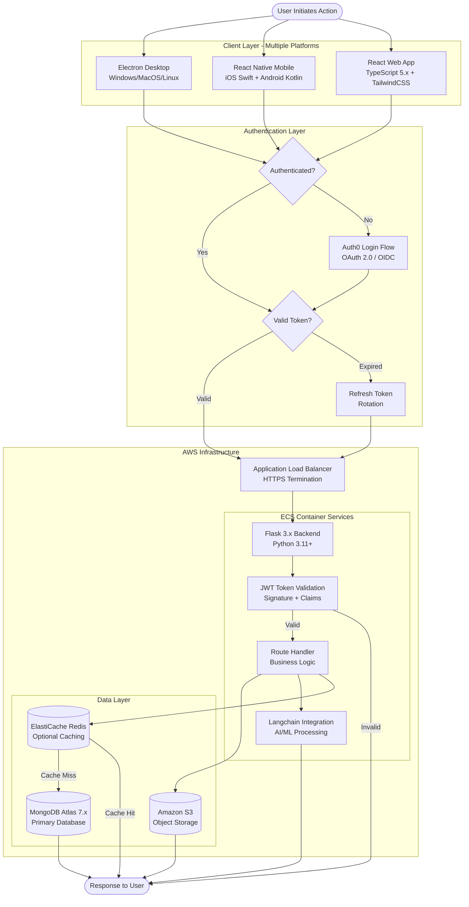
```mermaid
graph TB
    START([User Initiates Action])
    
    subgraph "Client Layer - Multiple Platforms"
        WEB[React Web App<br/>TypeScript 5.x + TailwindCSS]
        MOBILE[React Native Mobile<br/>iOS Swift + Android Kotlin]
        DESKTOP[Electron Desktop<br/>Windows/MacOS/Linux]
    end
    
    subgraph "Authentication Layer"
        AUTH_CHECK{Authenticated?}
        AUTH0_LOGIN[Auth0 Login Flow<br/>OAuth 2.0 / OIDC]
        TOKEN_CHECK{Valid Token?}
        TOKEN_REFRESH[Refresh Token<br/>Rotation]
    end
    
    subgraph "AWS Infrastructure"
        ALB[Application Load Balancer<br/>HTTPS Termination]
        
        subgraph "ECS Container Services"
            FLASK[Flask 3.x Backend<br/>Python 3.11+]
            TOKEN_VALIDATE[JWT Token Validation<br/>Signature + Claims]
            ROUTE_HANDLER[Route Handler<br/>Business Logic]
            LANGCHAIN[Langchain Integration<br/>AI/ML Processing]
        end
        
        subgraph "Data Layer"
            MONGODB[(MongoDB Atlas 7.x<br/>Primary Database)]
            S3[(Amazon S3<br/>Object Storage)]
            CACHE[(ElastiCache Redis<br/>Optional Caching)]
        end
    end
    
    RESPONSE([Response to User])
    
    START --> WEB
    START --> MOBILE
    START --> DESKTOP
    
    WEB --> AUTH_CHECK
    MOBILE --> AUTH_CHECK
    DESKTOP --> AUTH_CHECK
    
    AUTH_CHECK -->|No| AUTH0_LOGIN
    AUTH0_LOGIN --> TOKEN_CHECK
    TOKEN_CHECK -->|Expired| TOKEN_REFRESH
    TOKEN_REFRESH --> ALB
    TOKEN_CHECK -->|Valid| ALB
    AUTH_CHECK -->|Yes| TOKEN_CHECK
    
    ALB --> FLASK
    FLASK --> TOKEN_VALIDATE
    TOKEN_VALIDATE -->|Invalid| RESPONSE
    TOKEN_VALIDATE -->|Valid| ROUTE_HANDLER
    
    ROUTE_HANDLER --> CACHE
    CACHE -->|Cache Hit| RESPONSE
    CACHE -->|Cache Miss| MONGODB
    ROUTE_HANDLER --> LANGCHAIN
    ROUTE_HANDLER --> S3
    
    MONGODB --> RESPONSE
    S3 --> RESPONSE
    LANGCHAIN --> RESPONSE
```

#### 4.2.1.2 Request Flow Description

**Client Initiation**: User interaction triggers API request from any supported platform (web, mobile, desktop). Each platform uses platform-specific Auth0 SDK but follows consistent authentication patterns.

**Authentication Gate**: Before API calls, client checks authentication status. Unauthenticated users redirect to Auth0 hosted login page. Authenticated users attach JWT access token to request Authorization header.

**Token Lifecycle Management**: Clients validate token expiration before requests. Expired tokens trigger refresh token rotation through Auth0, obtaining new access token transparently without user re-authentication.

**Load Balancing**: AWS Application Load Balancer terminates HTTPS connections, handles SSL/TLS, and distributes requests across multiple ECS container instances for high availability and horizontal scaling.

**Backend Token Validation**: Flask middleware validates JWT token signature using Auth0 public keys, verifies token claims (audience, issuer, expiration), and extracts user context for authorization decisions.

**Business Logic Processing**: Route handlers execute business logic, which may include:
- Caching layer checks for frequently accessed data
- Database queries via PyMongo/Motor to MongoDB Atlas
- File operations with S3 via Boto3 SDK
- AI/ML processing through Langchain framework

**Response Assembly**: Backend serializes response to JSON, sets appropriate HTTP status codes and headers, and returns response through ALB to client application.

### 4.2.2 Authentication and Authorization Flow

#### 4.2.2.1 Complete Authentication Sequence

The authentication workflow leverages Auth0's identity-as-a-service platform with OAuth 2.0 and OpenID Connect protocols:

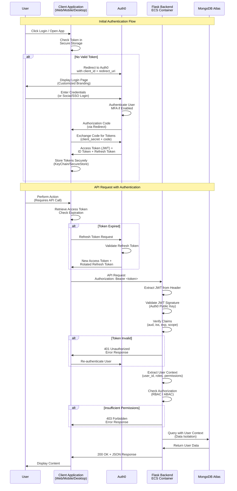
```mermaid
sequenceDiagram
    participant User
    participant Client as Client Application<br/>(Web/Mobile/Desktop)
    participant Auth0
    participant Backend as Flask Backend<br/>ECS Container
    participant MongoDB as MongoDB Atlas

    Note over User,MongoDB: Initial Authentication Flow
    
    User->>Client: Click Login / Open App
    Client->>Client: Check Token in<br/>Secure Storage
    
    alt No Valid Token
        Client->>Auth0: Redirect to Auth0<br/>with client_id + redirect_uri
        Auth0->>User: Display Login Page<br/>(Customized Branding)
        User->>Auth0: Enter Credentials<br/>(or Social/SSO Login)
        Auth0->>Auth0: Authenticate User<br/>MFA if Enabled
        Auth0->>Client: Authorization Code<br/>(via Redirect)
        Client->>Auth0: Exchange Code for Tokens<br/>(client_secret + code)
        Auth0->>Client: Access Token (JWT) +<br/>ID Token + Refresh Token
        Client->>Client: Store Tokens Securely<br/>(KeyChain/SecureStore)
    end
    
    Note over User,MongoDB: API Request with Authentication
    
    User->>Client: Perform Action<br/>(Requires API Call)
    Client->>Client: Retrieve Access Token<br/>Check Expiration
    
    alt Token Expired
        Client->>Auth0: Refresh Token Request
        Auth0->>Auth0: Validate Refresh Token
        Auth0->>Client: New Access Token +<br/>Rotated Refresh Token
    end
    
    Client->>Backend: API Request<br/>Authorization: Bearer <token>
    Backend->>Backend: Extract JWT from Header
    Backend->>Backend: Validate JWT Signature<br/>(Auth0 Public Key)
    Backend->>Backend: Verify Claims<br/>(aud, iss, exp, scope)
    
    alt Token Invalid
        Backend->>Client: 401 Unauthorized<br/>Error Response
        Client->>Auth0: Re-authenticate User
    end
    
    Backend->>Backend: Extract User Context<br/>(user_id, roles, permissions)
    Backend->>Backend: Check Authorization<br/>(RBAC / ABAC)
    
    alt Insufficient Permissions
        Backend->>Client: 403 Forbidden<br/>Error Response
    end
    
    Backend->>MongoDB: Query with User Context<br/>(Data Isolation)
    MongoDB->>Backend: Return User Data
    Backend->>Client: 200 OK + JSON Response
    Client->>User: Display Content
```

#### 4.2.2.2 Authentication Decision Points

**Key Decision Points in Authentication Flow**:

1. **Token Existence Check**: Client verifies presence of access token in secure storage before API calls
2. **Token Expiration Check**: Client validates token expiration timestamp to prevent unnecessary API rejections
3. **Token Signature Validation**: Backend cryptographically verifies token integrity using Auth0 public keys
4. **Claims Verification**: Backend validates audience (intended API), issuer (Auth0 tenant), and expiration timestamp
5. **Authorization Check**: Backend evaluates user roles and permissions against required access levels for requested resource
6. **MFA Challenge**: Auth0 triggers multi-factor authentication based on risk assessment or policy configuration

#### 4.2.2.3 Token Storage Security

**Platform-Specific Secure Storage**:

- **iOS**: Keychain Services with kSecAttrAccessible settings
- **Android**: EncryptedSharedPreferences with Android Keystore
- **Web**: httpOnly cookies (preferred) or localStorage with XSS protections
- **Desktop**: Electron safeStorage API with OS-level encryption

**Token Refresh Strategy**: Refresh tokens enable long-lived sessions without storing long-lived access tokens. Access tokens expire within 1 hour (configurable), requiring refresh token exchange. Refresh token rotation provides defense against token replay attacks.

### 4.2.3 API Request Processing Flow

#### 4.2.3.1 Flask Backend Request Lifecycle

The following flowchart details the internal processing of API requests within the Flask backend:

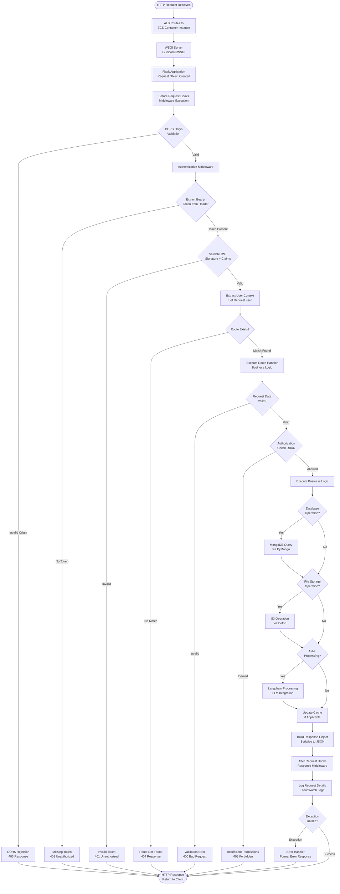
```mermaid
flowchart TD
    START([HTTP Request Received])
    
    ALB_ROUTE[ALB Routes to<br/>ECS Container Instance]
    WSGI_SERVER[WSGI Server<br/>Gunicorn/uWSGI]
    FLASK_APP[Flask Application<br/>Request Object Created]
    
    BEFORE_REQUEST[Before Request Hooks<br/>Middleware Execution]
    CORS_CHECK{CORS Origin<br/>Validation}
    CORS_REJECT[CORS Rejection<br/>403 Response]
    
    AUTH_MIDDLEWARE[Authentication Middleware]
    TOKEN_EXTRACT{Extract Bearer<br/>Token from Header}
    TOKEN_MISSING[Missing Token<br/>401 Unauthorized]
    
    TOKEN_VALIDATE{Validate JWT<br/>Signature + Claims}
    TOKEN_INVALID[Invalid Token<br/>401 Unauthorized]
    
    USER_CONTEXT[Extract User Context<br/>Set Request.user]
    
    ROUTE_MATCH{Route Exists?}
    ROUTE_404[Route Not Found<br/>404 Response]
    
    ROUTE_HANDLER[Execute Route Handler<br/>Business Logic]
    
    VALIDATION{Request Data<br/>Valid?}
    VALIDATION_ERROR[Validation Error<br/>400 Bad Request]
    
    AUTHZ_CHECK{Authorization<br/>Check RBAC}
    AUTHZ_FAIL[Insufficient Permissions<br/>403 Forbidden]
    
    BUSINESS_LOGIC[Execute Business Logic]
    
    DB_QUERY{Database<br/>Operation?}
    MONGO_QUERY[MongoDB Query<br/>via PyMongo]
    
    S3_OP{File Storage<br/>Operation?}
    S3_OPERATION[S3 Operation<br/>via Boto3]
    
    AI_OP{AI/ML<br/>Processing?}
    LANGCHAIN_PROCESS[Langchain Processing<br/>LLM Integration]
    
    CACHE_UPDATE[Update Cache<br/>if Applicable]
    
    RESPONSE_BUILD[Build Response Object<br/>Serialize to JSON]
    
    AFTER_REQUEST[After Request Hooks<br/>Response Middleware]
    
    LOGGING[Log Request Details<br/>CloudWatch Logs]
    
    ERROR_HANDLER{Exception<br/>Raised?}
    ERROR_CATCH[Error Handler<br/>Format Error Response]
    
    RESPONSE([HTTP Response<br/>Return to Client])
    
    START --> ALB_ROUTE
    ALB_ROUTE --> WSGI_SERVER
    WSGI_SERVER --> FLASK_APP
    FLASK_APP --> BEFORE_REQUEST
    
    BEFORE_REQUEST --> CORS_CHECK
    CORS_CHECK -->|Invalid Origin| CORS_REJECT
    CORS_REJECT --> RESPONSE
    CORS_CHECK -->|Valid| AUTH_MIDDLEWARE
    
    AUTH_MIDDLEWARE --> TOKEN_EXTRACT
    TOKEN_EXTRACT -->|No Token| TOKEN_MISSING
    TOKEN_MISSING --> RESPONSE
    TOKEN_EXTRACT -->|Token Present| TOKEN_VALIDATE
    
    TOKEN_VALIDATE -->|Invalid| TOKEN_INVALID
    TOKEN_INVALID --> RESPONSE
    TOKEN_VALIDATE -->|Valid| USER_CONTEXT
    
    USER_CONTEXT --> ROUTE_MATCH
    ROUTE_MATCH -->|No Match| ROUTE_404
    ROUTE_404 --> RESPONSE
    ROUTE_MATCH -->|Match Found| ROUTE_HANDLER
    
    ROUTE_HANDLER --> VALIDATION
    VALIDATION -->|Invalid| VALIDATION_ERROR
    VALIDATION_ERROR --> RESPONSE
    VALIDATION -->|Valid| AUTHZ_CHECK
    
    AUTHZ_CHECK -->|Denied| AUTHZ_FAIL
    AUTHZ_FAIL --> RESPONSE
    AUTHZ_CHECK -->|Allowed| BUSINESS_LOGIC
    
    BUSINESS_LOGIC --> DB_QUERY
    DB_QUERY -->|Yes| MONGO_QUERY
    MONGO_QUERY --> S3_OP
    DB_QUERY -->|No| S3_OP
    
    S3_OP -->|Yes| S3_OPERATION
    S3_OPERATION --> AI_OP
    S3_OP -->|No| AI_OP
    
    AI_OP -->|Yes| LANGCHAIN_PROCESS
    LANGCHAIN_PROCESS --> CACHE_UPDATE
    AI_OP -->|No| CACHE_UPDATE
    
    CACHE_UPDATE --> RESPONSE_BUILD
    RESPONSE_BUILD --> AFTER_REQUEST
    AFTER_REQUEST --> LOGGING
    LOGGING --> ERROR_HANDLER
    
    ERROR_HANDLER -->|Exception| ERROR_CATCH
    ERROR_CATCH --> RESPONSE
    ERROR_HANDLER -->|Success| RESPONSE
```

#### 4.2.3.2 Request Processing Stages

**Stage 1 - Request Reception and Routing**:
- AWS Application Load Balancer performs health checks and routes to healthy ECS container instances
- WSGI server (Gunicorn or uWSGI) handles concurrent requests using worker processes
- Flask application receives request and creates Request object with headers, body, and metadata

**Stage 2 - Pre-Processing Middleware**:
- CORS validation checks Origin header against allowed origins configuration
- Authentication middleware extracts JWT token from Authorization header
- Token validation performs cryptographic signature verification and claims checking
- User context extraction populates request object with authenticated user details

**Stage 3 - Route Matching and Validation**:
- Flask router matches HTTP method and path to registered route handler
- Request data validation uses schemas (e.g., Marshmallow, Pydantic) to verify payload structure
- Authorization checks evaluate user roles/permissions against route requirements using RBAC

**Stage 4 - Business Logic Execution**:
- Route handler executes domain-specific business logic
- Database queries via PyMongo for data retrieval or persistence
- S3 operations via Boto3 for file uploads, downloads, or presigned URL generation
- Langchain integration for AI/ML processing including LLM calls, embeddings, and RAG workflows

**Stage 5 - Response Processing**:
- Response object serialization to JSON format
- After-request hooks add security headers (HSTS, CSP, X-Frame-Options)
- Logging middleware records request details, timing, and response status to CloudWatch
- Error handlers catch exceptions and format appropriate error responses with status codes

#### 4.2.3.3 Error Handling in Request Processing

**Exception Hierarchy**:
- **ValidationError** (400): Malformed request data, schema validation failures
- **UnauthorizedError** (401): Missing or invalid authentication token
- **ForbiddenError** (403): Insufficient permissions for requested resource
- **NotFoundError** (404): Resource does not exist
- **ConflictError** (409): Resource state conflict (e.g., duplicate creation)
- **ServerError** (500): Unhandled exceptions, database errors, external service failures

**Error Response Format**:
```json
{
  "error": {
    "code": "VALIDATION_ERROR",
    "message": "Human-readable error description",
    "details": {
      "field": "specific_field",
      "issue": "validation constraint violated"
    },
    "request_id": "unique-request-identifier"
  }
}
```

## 4.3 Data Management Workflows

### 4.3.1 Database Operations Flow

#### 4.3.1.1 MongoDB CRUD Operations Pattern

The following flowchart illustrates standard Create, Read, Update, Delete operations with MongoDB Atlas:

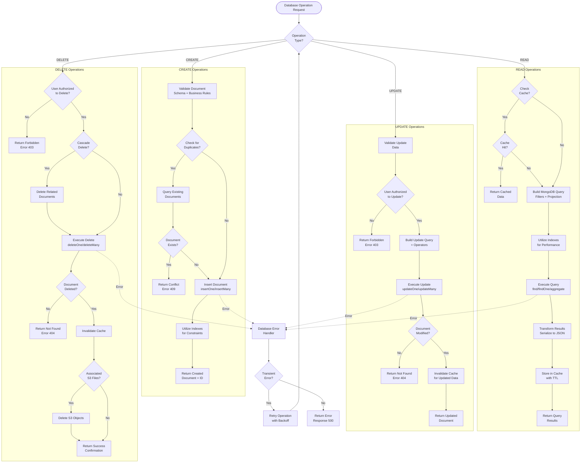
```mermaid
flowchart TD
    START([Database Operation Request])
    
    OPERATION_TYPE{Operation<br/>Type?}
    
    subgraph "CREATE Operations"
        CREATE_VALIDATE[Validate Document<br/>Schema + Business Rules]
        CREATE_DUPLICATE{Check for<br/>Duplicates?}
        CREATE_QUERY[Query Existing<br/>Documents]
        CREATE_EXISTS{Document<br/>Exists?}
        CREATE_CONFLICT[Return Conflict<br/>Error 409]
        CREATE_INSERT[Insert Document<br/>insertOne/insertMany]
        CREATE_INDEX[Utilize Indexes<br/>for Constraints]
        CREATE_SUCCESS[Return Created<br/>Document + ID]
    end
    
    subgraph "READ Operations"
        READ_CACHE{Check<br/>Cache?}
        CACHE_HIT{Cache<br/>Hit?}
        CACHE_RETURN[Return Cached<br/>Data]
        READ_QUERY[Build MongoDB Query<br/>Filters + Projection]
        READ_INDEX[Utilize Indexes<br/>for Performance]
        READ_EXECUTE[Execute Query<br/>find/findOne/aggregate]
        READ_TRANSFORM[Transform Results<br/>Serialize to JSON]
        READ_CACHE_STORE[Store in Cache<br/>with TTL]
        READ_SUCCESS[Return Query<br/>Results]
    end
    
    subgraph "UPDATE Operations"
        UPDATE_VALIDATE[Validate Update<br/>Data]
        UPDATE_AUTHZ{User Authorized<br/>to Update?}
        UPDATE_DENIED[Return Forbidden<br/>Error 403]
        UPDATE_QUERY[Build Update Query<br/>+ Operators]
        UPDATE_EXECUTE[Execute Update<br/>updateOne/updateMany]
        UPDATE_CHECK{Document<br/>Modified?}
        UPDATE_NOTFOUND[Return Not Found<br/>Error 404]
        UPDATE_CACHE_INVALID[Invalidate Cache<br/>for Updated Data]
        UPDATE_SUCCESS[Return Updated<br/>Document]
    end
    
    subgraph "DELETE Operations"
        DELETE_AUTHZ{User Authorized<br/>to Delete?}
        DELETE_DENIED[Return Forbidden<br/>Error 403]
        DELETE_CASCADE{Cascade<br/>Delete?}
        DELETE_RELATED[Delete Related<br/>Documents]
        DELETE_EXECUTE[Execute Delete<br/>deleteOne/deleteMany]
        DELETE_CHECK{Document<br/>Deleted?}
        DELETE_NOTFOUND[Return Not Found<br/>Error 404]
        DELETE_CACHE_INVALID[Invalidate Cache]
        DELETE_S3{Associated<br/>S3 Files?}
        DELETE_S3_FILES[Delete S3 Objects]
        DELETE_SUCCESS[Return Success<br/>Confirmation]
    end
    
    ERROR_HANDLER[Database Error<br/>Handler]
    RETRY_LOGIC{Transient<br/>Error?}
    RETRY[Retry Operation<br/>with Backoff]
    ERROR_RESPONSE[Return Error<br/>Response 500]
    
    START --> OPERATION_TYPE
    
    OPERATION_TYPE -->|CREATE| CREATE_VALIDATE
    CREATE_VALIDATE --> CREATE_DUPLICATE
    CREATE_DUPLICATE -->|Yes| CREATE_QUERY
    CREATE_QUERY --> CREATE_EXISTS
    CREATE_EXISTS -->|Yes| CREATE_CONFLICT
    CREATE_EXISTS -->|No| CREATE_INSERT
    CREATE_DUPLICATE -->|No| CREATE_INSERT
    CREATE_INSERT --> CREATE_INDEX
    CREATE_INDEX --> CREATE_SUCCESS
    
    OPERATION_TYPE -->|READ| READ_CACHE
    READ_CACHE -->|Yes| CACHE_HIT
    CACHE_HIT -->|Yes| CACHE_RETURN
    CACHE_HIT -->|No| READ_QUERY
    READ_CACHE -->|No| READ_QUERY
    READ_QUERY --> READ_INDEX
    READ_INDEX --> READ_EXECUTE
    READ_EXECUTE --> READ_TRANSFORM
    READ_TRANSFORM --> READ_CACHE_STORE
    READ_CACHE_STORE --> READ_SUCCESS
    
    OPERATION_TYPE -->|UPDATE| UPDATE_VALIDATE
    UPDATE_VALIDATE --> UPDATE_AUTHZ
    UPDATE_AUTHZ -->|No| UPDATE_DENIED
    UPDATE_AUTHZ -->|Yes| UPDATE_QUERY
    UPDATE_QUERY --> UPDATE_EXECUTE
    UPDATE_EXECUTE --> UPDATE_CHECK
    UPDATE_CHECK -->|No| UPDATE_NOTFOUND
    UPDATE_CHECK -->|Yes| UPDATE_CACHE_INVALID
    UPDATE_CACHE_INVALID --> UPDATE_SUCCESS
    
    OPERATION_TYPE -->|DELETE| DELETE_AUTHZ
    DELETE_AUTHZ -->|No| DELETE_DENIED
    DELETE_AUTHZ -->|Yes| DELETE_CASCADE
    DELETE_CASCADE -->|Yes| DELETE_RELATED
    DELETE_RELATED --> DELETE_EXECUTE
    DELETE_CASCADE -->|No| DELETE_EXECUTE
    DELETE_EXECUTE --> DELETE_CHECK
    DELETE_CHECK -->|No| DELETE_NOTFOUND
    DELETE_CHECK -->|Yes| DELETE_CACHE_INVALID
    DELETE_CACHE_INVALID --> DELETE_S3
    DELETE_S3 -->|Yes| DELETE_S3_FILES
    DELETE_S3_FILES --> DELETE_SUCCESS
    DELETE_S3 -->|No| DELETE_SUCCESS
    
    CREATE_INSERT -.Error.-> ERROR_HANDLER
    READ_EXECUTE -.Error.-> ERROR_HANDLER
    UPDATE_EXECUTE -.Error.-> ERROR_HANDLER
    DELETE_EXECUTE -.Error.-> ERROR_HANDLER
    
    ERROR_HANDLER --> RETRY_LOGIC
    RETRY_LOGIC -->|Yes| RETRY
    RETRY --> OPERATION_TYPE
    RETRY_LOGIC -->|No| ERROR_RESPONSE
```

#### 4.3.1.2 Database Operation Patterns

**Create Operation Pattern**:
1. **Schema Validation**: Validate document structure against defined schema using Pydantic models or custom validators
2. **Unique Constraint Check**: Query existing documents to prevent duplicates for fields requiring uniqueness
3. **Insert Execution**: Use `insertOne()` for single documents or `insertMany()` for bulk inserts with appropriate write concern
4. **Index Utilization**: Leverage unique indexes for constraint enforcement and performance optimization
5. **Return Confirmation**: Return created document with generated `_id` and timestamp metadata

**Read Operation Pattern**:
1. **Cache Layer Check**: Query application cache (Redis or in-memory) before database access
2. **Query Construction**: Build MongoDB query with filters, projections (field selection), and sorting
3. **Index Strategy**: Ensure queries utilize indexes through `explain()` analysis during development
4. **Aggregation Pipeline**: Use aggregation framework for complex data transformations and analytics
5. **Result Caching**: Store frequently accessed results in cache with appropriate TTL
6. **Pagination**: Implement cursor-based or offset-based pagination for large result sets

**Update Operation Pattern**:
1. **Authorization Check**: Verify user permissions to modify specific documents based on ownership or roles
2. **Optimistic Locking**: Use version fields to prevent lost updates in concurrent modification scenarios
3. **Update Operators**: Leverage MongoDB update operators (`$set`, `$inc`, `$push`, `$pull`) for efficient updates
4. **Atomic Operations**: Use `findOneAndUpdate()` for read-modify-write atomicity
5. **Cache Invalidation**: Remove or update cached data to maintain consistency

**Delete Operation Pattern**:
1. **Cascade Logic**: Delete related documents in referenced collections to maintain referential integrity
2. **Soft Delete Alternative**: Consider soft delete pattern (setting `deleted: true` flag) for audit trails
3. **Associated Resource Cleanup**: Delete related S3 objects, search index entries, or cache entries
4. **Bulk Operations**: Use `deleteMany()` for batch deletions with appropriate filters

#### 4.3.1.3 Connection Management and Resilience

**Connection Pooling Configuration**:
```python
# Connection pool parameters
maxPoolSize = 100  # Maximum connections
minPoolSize = 10   # Minimum idle connections
maxIdleTimeMS = 60000  # Close idle connections after 60s
waitQueueTimeoutMS = 5000  # Timeout for connection acquisition
```

**Retry Strategy**:
- **Transient Errors**: Network timeouts, temporary unavailability, replica set elections
- **Retry Pattern**: Exponential backoff with jitter (50ms, 100ms, 200ms, 400ms)
- **Maximum Retries**: 3 attempts before returning error to client
- **Idempotency**: Ensure operations are idempotent or use unique request IDs to prevent duplicates

**High Availability Handling**:
- MongoDB Atlas replica sets provide automatic failover (typically 10-30 seconds)
- PyMongo driver automatically reconnects to new primary after election
- Application implements read preference configuration (primary, primaryPreferred, secondary)

### 4.3.2 File Storage Operations

#### 4.3.2.1 S3 File Upload and Download Flow

The following flowchart illustrates file storage operations using Amazon S3:

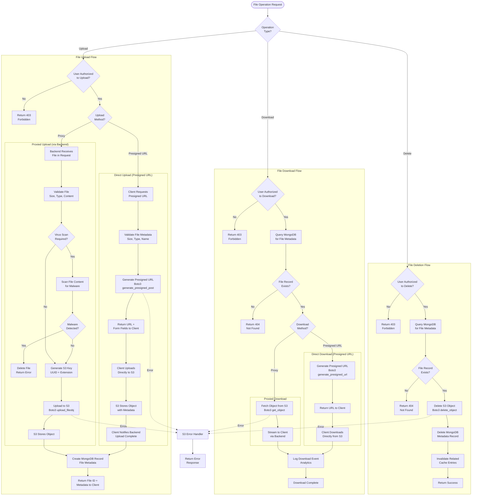
```mermaid
flowchart TD
    START([File Operation Request])
    
    OPERATION{Operation<br/>Type?}
    
    subgraph "File Upload Flow"
        UPLOAD_AUTHZ{User Authorized<br/>to Upload?}
        UPLOAD_DENIED[Return 403<br/>Forbidden]
        
        UPLOAD_METHOD{Upload<br/>Method?}
        
        subgraph "Direct Upload (Presigned URL)"
            PRESIGNED_REQUEST[Client Requests<br/>Presigned URL]
            PRESIGNED_VALIDATE[Validate File Metadata<br/>Size, Type, Name]
            PRESIGNED_GENERATE[Generate Presigned URL<br/>Boto3 generate_presigned_post]
            PRESIGNED_RETURN[Return URL +<br/>Form Fields to Client]
            PRESIGNED_CLIENT_UPLOAD[Client Uploads<br/>Directly to S3]
            PRESIGNED_S3_STORE[S3 Stores Object<br/>with Metadata]
            PRESIGNED_CALLBACK[Client Notifies Backend<br/>Upload Complete]
        end
        
        subgraph "Proxied Upload (via Backend)"
            PROXY_RECEIVE[Backend Receives<br/>File in Request]
            PROXY_VALIDATE[Validate File<br/>Size, Type, Content]
            PROXY_VIRUS_SCAN{Virus Scan<br/>Required?}
            PROXY_SCAN[Scan File Content<br/>for Malware]
            PROXY_MALWARE{Malware<br/>Detected?}
            PROXY_REJECT[Delete File<br/>Return Error]
            PROXY_GENERATE_KEY[Generate S3 Key<br/>UUID + Extension]
            PROXY_UPLOAD[Upload to S3<br/>Boto3 upload_fileobj]
            PROXY_S3_STORE[S3 Stores Object]
        end
        
        UPLOAD_METADATA_CREATE[Create MongoDB Record<br/>File Metadata]
        UPLOAD_SUCCESS[Return File ID +<br/>Metadata to Client]
    end
    
    subgraph "File Download Flow"
        DOWNLOAD_AUTHZ{User Authorized<br/>to Download?}
        DOWNLOAD_DENIED[Return 403<br/>Forbidden]
        DOWNLOAD_MONGO_QUERY[Query MongoDB<br/>for File Metadata]
        DOWNLOAD_EXISTS{File Record<br/>Exists?}
        DOWNLOAD_NOTFOUND[Return 404<br/>Not Found]
        
        DOWNLOAD_METHOD{Download<br/>Method?}
        
        subgraph "Direct Download (Presigned URL)"
            DOWNLOAD_PRESIGNED[Generate Presigned URL<br/>Boto3 generate_presigned_url]
            DOWNLOAD_PRESIGNED_RETURN[Return URL to Client]
            DOWNLOAD_CLIENT_DIRECT[Client Downloads<br/>Directly from S3]
        end
        
        subgraph "Proxied Download"
            DOWNLOAD_S3_FETCH[Fetch Object from S3<br/>Boto3 get_object]
            DOWNLOAD_STREAM[Stream to Client<br/>via Backend]
        end
        
        DOWNLOAD_LOG[Log Download Event<br/>Analytics]
        DOWNLOAD_SUCCESS[Download Complete]
    end
    
    subgraph "File Deletion Flow"
        DELETE_AUTHZ{User Authorized<br/>to Delete?}
        DELETE_DENIED[Return 403<br/>Forbidden]
        DELETE_MONGO_QUERY[Query MongoDB<br/>for File Metadata]
        DELETE_EXISTS{File Record<br/>Exists?}
        DELETE_NOTFOUND[Return 404<br/>Not Found]
        DELETE_S3_OBJECT[Delete S3 Object<br/>Boto3 delete_object]
        DELETE_MONGO_RECORD[Delete MongoDB<br/>Metadata Record]
        DELETE_CACHE_INVALID[Invalidate Related<br/>Cache Entries]
        DELETE_SUCCESS[Return Success]
    end
    
    ERROR_HANDLER[S3 Error Handler]
    ERROR_RESPONSE[Return Error<br/>Response]
    
    START --> OPERATION
    
    OPERATION -->|Upload| UPLOAD_AUTHZ
    UPLOAD_AUTHZ -->|No| UPLOAD_DENIED
    UPLOAD_AUTHZ -->|Yes| UPLOAD_METHOD
    
    UPLOAD_METHOD -->|Presigned URL| PRESIGNED_REQUEST
    PRESIGNED_REQUEST --> PRESIGNED_VALIDATE
    PRESIGNED_VALIDATE --> PRESIGNED_GENERATE
    PRESIGNED_GENERATE --> PRESIGNED_RETURN
    PRESIGNED_RETURN --> PRESIGNED_CLIENT_UPLOAD
    PRESIGNED_CLIENT_UPLOAD --> PRESIGNED_S3_STORE
    PRESIGNED_S3_STORE --> PRESIGNED_CALLBACK
    PRESIGNED_CALLBACK --> UPLOAD_METADATA_CREATE
    
    UPLOAD_METHOD -->|Proxy| PROXY_RECEIVE
    PROXY_RECEIVE --> PROXY_VALIDATE
    PROXY_VALIDATE --> PROXY_VIRUS_SCAN
    PROXY_VIRUS_SCAN -->|Yes| PROXY_SCAN
    PROXY_SCAN --> PROXY_MALWARE
    PROXY_MALWARE -->|Yes| PROXY_REJECT
    PROXY_MALWARE -->|No| PROXY_GENERATE_KEY
    PROXY_VIRUS_SCAN -->|No| PROXY_GENERATE_KEY
    PROXY_GENERATE_KEY --> PROXY_UPLOAD
    PROXY_UPLOAD --> PROXY_S3_STORE
    PROXY_S3_STORE --> UPLOAD_METADATA_CREATE
    
    UPLOAD_METADATA_CREATE --> UPLOAD_SUCCESS
    
    OPERATION -->|Download| DOWNLOAD_AUTHZ
    DOWNLOAD_AUTHZ -->|No| DOWNLOAD_DENIED
    DOWNLOAD_AUTHZ -->|Yes| DOWNLOAD_MONGO_QUERY
    DOWNLOAD_MONGO_QUERY --> DOWNLOAD_EXISTS
    DOWNLOAD_EXISTS -->|No| DOWNLOAD_NOTFOUND
    DOWNLOAD_EXISTS -->|Yes| DOWNLOAD_METHOD
    
    DOWNLOAD_METHOD -->|Presigned URL| DOWNLOAD_PRESIGNED
    DOWNLOAD_PRESIGNED --> DOWNLOAD_PRESIGNED_RETURN
    DOWNLOAD_PRESIGNED_RETURN --> DOWNLOAD_CLIENT_DIRECT
    DOWNLOAD_CLIENT_DIRECT --> DOWNLOAD_LOG
    
    DOWNLOAD_METHOD -->|Proxy| DOWNLOAD_S3_FETCH
    DOWNLOAD_S3_FETCH --> DOWNLOAD_STREAM
    DOWNLOAD_STREAM --> DOWNLOAD_LOG
    
    DOWNLOAD_LOG --> DOWNLOAD_SUCCESS
    
    OPERATION -->|Delete| DELETE_AUTHZ
    DELETE_AUTHZ -->|No| DELETE_DENIED
    DELETE_AUTHZ -->|Yes| DELETE_MONGO_QUERY
    DELETE_MONGO_QUERY --> DELETE_EXISTS
    DELETE_EXISTS -->|No| DELETE_NOTFOUND
    DELETE_EXISTS -->|Yes| DELETE_S3_OBJECT
    DELETE_S3_OBJECT --> DELETE_MONGO_RECORD
    DELETE_MONGO_RECORD --> DELETE_CACHE_INVALID
    DELETE_CACHE_INVALID --> DELETE_SUCCESS
    
    PRESIGNED_GENERATE -.Error.-> ERROR_HANDLER
    PROXY_UPLOAD -.Error.-> ERROR_HANDLER
    DOWNLOAD_S3_FETCH -.Error.-> ERROR_HANDLER
    DELETE_S3_OBJECT -.Error.-> ERROR_HANDLER
    
    ERROR_HANDLER --> ERROR_RESPONSE
```

#### 4.3.2.2 File Storage Strategy Patterns

**Presigned URL Upload Pattern** (Recommended for Large Files):

**Advantages**:
- Direct client-to-S3 transfer eliminates backend bandwidth bottleneck
- Reduced backend processing load and latency
- S3 handles multipart upload for large files automatically
- No file size limitations imposed by backend timeout constraints

**Implementation**:
1. Client requests upload permission with file metadata (name, size, type)
2. Backend validates user authorization and file constraints (size limits, allowed types)
3. Backend generates presigned POST URL with form fields using Boto3 `generate_presigned_post()`
4. Backend returns presigned URL, form fields, and S3 key to client
5. Client performs HTTP POST directly to S3 with file and form fields
6. Client notifies backend of successful upload via callback API
7. Backend creates MongoDB metadata record with S3 key, user reference, and timestamps

**Security Considerations**:
- Presigned URLs expire after configurable duration (typically 15-60 minutes)
- Presigned URLs enforce content-type, file size limits, and bucket policies
- Backend validates callback requests to ensure file was actually uploaded

**Proxied Upload Pattern** (For Small Files or Security Requirements):

**Advantages**:
- Backend can scan file content for malware before storage
- Backend can validate file content, not just metadata
- Simplified client implementation (standard multipart form upload)
- Centralized error handling and retry logic

**Implementation**:
1. Client uploads file via multipart form data to backend API endpoint
2. Backend receives file in memory or streams to temporary storage
3. Backend validates file size, type, and optionally scans for malware
4. Backend generates unique S3 key (UUID-based to prevent collisions)
5. Backend uploads to S3 using Boto3 `upload_fileobj()` with streaming
6. Backend creates MongoDB metadata record
7. Backend returns file ID and metadata to client

**File Metadata Storage Pattern**:

MongoDB document structure for file metadata:
```json
{
  "_id": "ObjectId",
  "s3_key": "uploads/uuid-filename.ext",
  "s3_bucket": "abk1929-prod-uploads",
  "original_filename": "user-provided-name.pdf",
  "content_type": "application/pdf",
  "size_bytes": 1048576,
  "owner_user_id": "auth0|user123",
  "uploaded_at": "ISODate",
  "download_count": 0,
  "tags": ["category1", "category2"],
  "metadata": {
    "description": "User-provided description",
    "custom_field": "value"
  }
}
```

**S3 Key Naming Strategy**:
- Pattern: `{environment}/{category}/{uuid}-{sanitized-filename}`
- Example: `prod/uploads/a1b2c3d4-e5f6-7890-abcd-ef1234567890-report.pdf`
- Benefits: Prevents naming collisions, maintains original filename for downloads, enables S3 lifecycle policies by prefix

#### 4.3.2.3 File Storage Security and Compliance

**Access Control**:
- S3 bucket policies enforce authenticated access only
- Presigned URLs provide time-limited, operation-specific access
- MongoDB metadata records enforce ownership and permission checks
- IAM roles grant backend EC2/ECS instances minimum required S3 permissions

**Data Protection**:
- Server-side encryption at rest (SSE-S3 or SSE-KMS)
- TLS encryption for data in transit
- Versioning enabled for accidental deletion recovery
- Cross-region replication for disaster recovery (optional)

**Lifecycle Management**:
- Transition to S3 Intelligent-Tiering after 30 days (cost optimization)
- Archive to S3 Glacier after 90 days for infrequently accessed files
- Delete objects after retention period based on compliance requirements
- Incomplete multipart upload cleanup after 7 days

### 4.3.3 Caching Strategy Flow

#### 4.3.3.1 Multi-Layer Caching Architecture

The planned caching strategy implements multiple layers for optimal performance:

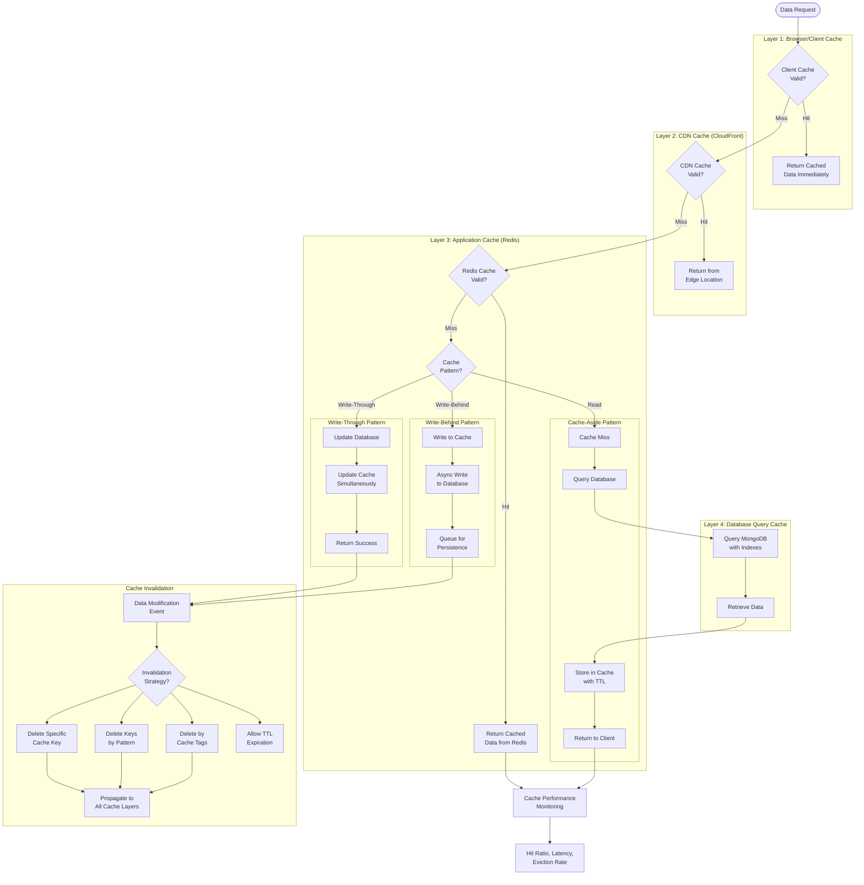
```mermaid
flowchart TD
    START([Data Request])
    
    subgraph "Layer 1: Browser/Client Cache"
        CLIENT_CACHE{Client Cache<br/>Valid?}
        CLIENT_HIT[Return Cached<br/>Data Immediately]
    end
    
    subgraph "Layer 2: CDN Cache (CloudFront)"
        CDN_CACHE{CDN Cache<br/>Valid?}
        CDN_HIT[Return from<br/>Edge Location]
    end
    
    subgraph "Layer 3: Application Cache (Redis)"
        APP_CACHE{Redis Cache<br/>Valid?}
        APP_HIT[Return Cached<br/>Data from Redis]
        
        CACHE_PATTERN{Cache<br/>Pattern?}
        
        subgraph "Cache-Aside Pattern"
            CACHE_ASIDE_MISS[Cache Miss]
            CACHE_ASIDE_DB[Query Database]
            CACHE_ASIDE_STORE[Store in Cache<br/>with TTL]
            CACHE_ASIDE_RETURN[Return to Client]
        end
        
        subgraph "Write-Through Pattern"
            WRITE_THROUGH_UPDATE[Update Database]
            WRITE_THROUGH_CACHE[Update Cache<br/>Simultaneously]
            WRITE_THROUGH_SUCCESS[Return Success]
        end
        
        subgraph "Write-Behind Pattern"
            WRITE_BEHIND_CACHE[Write to Cache]
            WRITE_BEHIND_ASYNC[Async Write<br/>to Database]
            WRITE_BEHIND_QUEUE[Queue for<br/>Persistence]
        end
    end
    
    subgraph "Layer 4: Database Query Cache"
        DB_QUERY[Query MongoDB<br/>with Indexes]
        DB_RESULT[Retrieve Data]
    end
    
    subgraph "Cache Invalidation"
        INVALIDATION_EVENT[Data Modification<br/>Event]
        INVALIDATION_STRATEGY{Invalidation<br/>Strategy?}
        
        INVALIDATE_KEY[Delete Specific<br/>Cache Key]
        INVALIDATE_PATTERN[Delete Keys<br/>by Pattern]
        INVALIDATE_TAG[Delete by<br/>Cache Tags]
        EXPIRE_TTL[Allow TTL<br/>Expiration]
        
        INVALIDATION_PROPAGATE[Propagate to<br/>All Cache Layers]
    end
    
    MONITORING[Cache Performance<br/>Monitoring]
    METRICS[Hit Ratio, Latency,<br/>Eviction Rate]
    
    START --> CLIENT_CACHE
    CLIENT_CACHE -->|Hit| CLIENT_HIT
    CLIENT_CACHE -->|Miss| CDN_CACHE
    
    CDN_CACHE -->|Hit| CDN_HIT
    CDN_CACHE -->|Miss| APP_CACHE
    
    APP_CACHE -->|Hit| APP_HIT
    APP_HIT --> MONITORING
    APP_CACHE -->|Miss| CACHE_PATTERN
    
    CACHE_PATTERN -->|Read| CACHE_ASIDE_MISS
    CACHE_ASIDE_MISS --> CACHE_ASIDE_DB
    CACHE_ASIDE_DB --> DB_QUERY
    DB_QUERY --> DB_RESULT
    DB_RESULT --> CACHE_ASIDE_STORE
    CACHE_ASIDE_STORE --> CACHE_ASIDE_RETURN
    CACHE_ASIDE_RETURN --> MONITORING
    
    CACHE_PATTERN -->|Write-Through| WRITE_THROUGH_UPDATE
    WRITE_THROUGH_UPDATE --> WRITE_THROUGH_CACHE
    WRITE_THROUGH_CACHE --> WRITE_THROUGH_SUCCESS
    WRITE_THROUGH_SUCCESS --> INVALIDATION_EVENT
    
    CACHE_PATTERN -->|Write-Behind| WRITE_BEHIND_CACHE
    WRITE_BEHIND_CACHE --> WRITE_BEHIND_ASYNC
    WRITE_BEHIND_ASYNC --> WRITE_BEHIND_QUEUE
    WRITE_BEHIND_QUEUE --> INVALIDATION_EVENT
    
    INVALIDATION_EVENT --> INVALIDATION_STRATEGY
    INVALIDATION_STRATEGY --> INVALIDATE_KEY
    INVALIDATION_STRATEGY --> INVALIDATE_PATTERN
    INVALIDATION_STRATEGY --> INVALIDATE_TAG
    INVALIDATION_STRATEGY --> EXPIRE_TTL
    
    INVALIDATE_KEY --> INVALIDATION_PROPAGATE
    INVALIDATE_PATTERN --> INVALIDATION_PROPAGATE
    INVALIDATE_TAG --> INVALIDATION_PROPAGATE
    
    MONITORING --> METRICS
```

#### 4.3.3.2 Caching Patterns and Strategies

**Cache-Aside (Lazy Loading) Pattern**:

**Use Cases**: Read-heavy workloads, database query results, computed data
**Implementation**:
1. Application checks cache for requested data
2. On cache hit, return cached data immediately
3. On cache miss, query database
4. Store retrieved data in cache with TTL
5. Return data to client

**Advantages**: Only cache requested data, cache automatically populated on demand
**Considerations**: Initial request suffers cache miss penalty, potential thundering herd on cache expiration

**Write-Through Pattern**:

**Use Cases**: Data consistency critical, write frequency moderate
**Implementation**:
1. Application writes data to cache
2. Application writes data to database synchronously
3. Both operations complete before returning success

**Advantages**: Cache always consistent with database
**Considerations**: Write latency increased, cache may store infrequently read data

**Write-Behind (Write-Back) Pattern**:

**Use Cases**: Write-heavy workloads, eventual consistency acceptable
**Implementation**:
1. Application writes data to cache immediately
2. Return success to client
3. Asynchronous worker persists data to database

**Advantages**: Reduced write latency, write batching possible
**Considerations**: Risk of data loss on cache failure, complexity in failure handling

**Cache Invalidation Strategies**:

1. **Time-Based (TTL)**:
   - Set expiration time when caching (e.g., 5 minutes, 1 hour, 24 hours)
   - Suitable for data with acceptable staleness tolerance
   - MongoDB data: 5-15 minutes TTL
   - Static assets: 24 hours+ TTL with versioning

2. **Event-Based Invalidation**:
   - Invalidate cache on data modification (create, update, delete)
   - Publish invalidation events to message queue (SNS/SQS)
   - Subscribers invalidate local and distributed caches
   - Ensures eventual consistency across application instances

3. **Pattern-Based Invalidation**:
   - Use hierarchical cache keys (e.g., `user:123:profile`, `user:123:posts:*`)
   - Invalidate all keys matching pattern on related data change
   - Redis `SCAN` with pattern matching for bulk invalidation

4. **Cache Tags**:
   - Associate multiple tags with cached items
   - Invalidate all items with specific tag
   - Example: Tag all cached queries related to "user:123" with tag "user:123"

**Caching Decision Matrix**:

| Data Type | Cache Layer | TTL | Invalidation Strategy |
|-----------|-------------|-----|----------------------|
| User Profile | Redis | 15 minutes | Event-based on update |
| API Responses (list) | Redis | 5 minutes | Event-based + TTL |
| Static Assets | CloudFront CDN | 24 hours | Version-based (cache busting) |
| Database Query Results | Redis | 10 minutes | Pattern-based on related updates |
| Session Data | Redis | Session lifetime | Auth0 logout event |
| AI/ML Embeddings | Redis | 7 days | Regeneration event |
| Presigned S3 URLs | Application memory | 30 minutes | TTL only (short-lived) |

## 4.4 Integration Workflows

### 4.4.1 AI/ML Processing Flow

#### 4.4.1.1 Langchain Integration Workflow

The following flowchart illustrates AI/ML processing using the Langchain framework:

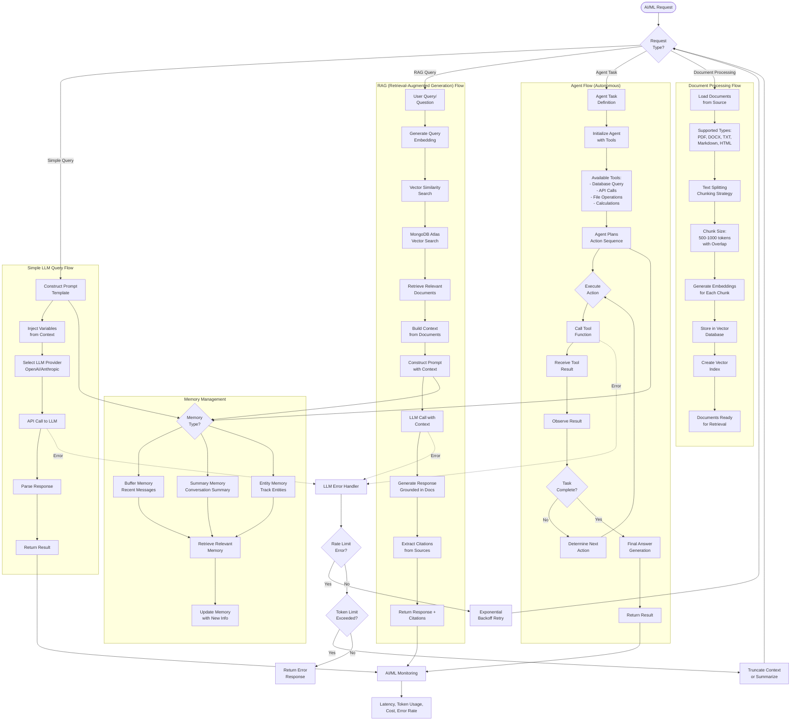
```mermaid
flowchart TD
    START([AI/ML Request])
    
    REQUEST_TYPE{Request<br/>Type?}
    
    subgraph "Simple LLM Query Flow"
        SIMPLE_PROMPT[Construct Prompt<br/>Template]
        SIMPLE_VARIABLES[Inject Variables<br/>from Context]
        SIMPLE_LLM[Select LLM Provider<br/>OpenAI/Anthropic]
        SIMPLE_CALL[API Call to LLM]
        SIMPLE_PARSE[Parse Response]
        SIMPLE_RETURN[Return Result]
    end
    
    subgraph "RAG (Retrieval-Augmented Generation) Flow"
        RAG_QUERY[User Query/<br/>Question]
        RAG_EMBED[Generate Query<br/>Embedding]
        
        RAG_VECTOR_SEARCH[Vector Similarity<br/>Search]
        RAG_MONGO_VECTOR[MongoDB Atlas<br/>Vector Search]
        RAG_RETRIEVE[Retrieve Relevant<br/>Documents]
        
        RAG_CONTEXT[Build Context<br/>from Documents]
        RAG_PROMPT[Construct Prompt<br/>with Context]
        RAG_LLM_CALL[LLM Call with<br/>Context]
        RAG_RESPONSE[Generate Response<br/>Grounded in Docs]
        RAG_CITATIONS[Extract Citations<br/>from Sources]
        RAG_RETURN[Return Response +<br/>Citations]
    end
    
    subgraph "Agent Flow (Autonomous)"
        AGENT_TASK[Agent Task<br/>Definition]
        AGENT_INIT[Initialize Agent<br/>with Tools]
        
        AGENT_TOOLS[Available Tools:<br/>- Database Query<br/>- API Calls<br/>- File Operations<br/>- Calculations]
        
        AGENT_PLAN[Agent Plans<br/>Action Sequence]
        AGENT_EXECUTE{Execute<br/>Action}
        
        AGENT_TOOL_CALL[Call Tool<br/>Function]
        AGENT_TOOL_RESULT[Receive Tool<br/>Result]
        AGENT_OBSERVE[Observe Result]
        
        AGENT_COMPLETE{Task<br/>Complete?}
        AGENT_ITERATE[Determine Next<br/>Action]
        
        AGENT_FINAL[Final Answer<br/>Generation]
        AGENT_RETURN[Return Result]
    end
    
    subgraph "Memory Management"
        MEMORY_TYPE{Memory<br/>Type?}
        
        BUFFER_MEMORY[Buffer Memory<br/>Recent Messages]
        SUMMARY_MEMORY[Summary Memory<br/>Conversation Summary]
        ENTITY_MEMORY[Entity Memory<br/>Track Entities]
        
        MEMORY_RETRIEVE[Retrieve Relevant<br/>Memory]
        MEMORY_UPDATE[Update Memory<br/>with New Info]
    end
    
    subgraph "Document Processing Flow"
        DOC_LOAD[Load Documents<br/>from Source]
        DOC_TYPES[Supported Types:<br/>PDF, DOCX, TXT,<br/>Markdown, HTML]
        
        DOC_SPLIT[Text Splitting<br/>Chunking Strategy]
        DOC_CHUNK_SIZE[Chunk Size:<br/>500-1000 tokens<br/>with Overlap]
        
        DOC_EMBED[Generate Embeddings<br/>for Each Chunk]
        DOC_STORE[Store in Vector<br/>Database]
        DOC_INDEX[Create Vector<br/>Index]
        DOC_COMPLETE[Documents Ready<br/>for Retrieval]
    end
    
    ERROR_HANDLER[LLM Error Handler]
    RATE_LIMIT{Rate Limit<br/>Error?}
    RETRY_BACKOFF[Exponential<br/>Backoff Retry]
    TOKEN_LIMIT{Token Limit<br/>Exceeded?}
    TRUNCATE_CONTEXT[Truncate Context<br/>or Summarize]
    ERROR_RETURN[Return Error<br/>Response]
    
    MONITORING[AI/ML Monitoring]
    METRICS[Latency, Token Usage,<br/>Cost, Error Rate]
    
    START --> REQUEST_TYPE
    
    REQUEST_TYPE -->|Simple Query| SIMPLE_PROMPT
    SIMPLE_PROMPT --> SIMPLE_VARIABLES
    SIMPLE_VARIABLES --> SIMPLE_LLM
    SIMPLE_LLM --> SIMPLE_CALL
    SIMPLE_CALL --> SIMPLE_PARSE
    SIMPLE_PARSE --> SIMPLE_RETURN
    SIMPLE_RETURN --> MONITORING
    
    REQUEST_TYPE -->|RAG Query| RAG_QUERY
    RAG_QUERY --> RAG_EMBED
    RAG_EMBED --> RAG_VECTOR_SEARCH
    RAG_VECTOR_SEARCH --> RAG_MONGO_VECTOR
    RAG_MONGO_VECTOR --> RAG_RETRIEVE
    RAG_RETRIEVE --> RAG_CONTEXT
    RAG_CONTEXT --> RAG_PROMPT
    RAG_PROMPT --> RAG_LLM_CALL
    RAG_LLM_CALL --> RAG_RESPONSE
    RAG_RESPONSE --> RAG_CITATIONS
    RAG_CITATIONS --> RAG_RETURN
    RAG_RETURN --> MONITORING
    
    REQUEST_TYPE -->|Agent Task| AGENT_TASK
    AGENT_TASK --> AGENT_INIT
    AGENT_INIT --> AGENT_TOOLS
    AGENT_TOOLS --> AGENT_PLAN
    AGENT_PLAN --> AGENT_EXECUTE
    AGENT_EXECUTE --> AGENT_TOOL_CALL
    AGENT_TOOL_CALL --> AGENT_TOOL_RESULT
    AGENT_TOOL_RESULT --> AGENT_OBSERVE
    AGENT_OBSERVE --> AGENT_COMPLETE
    AGENT_COMPLETE -->|No| AGENT_ITERATE
    AGENT_ITERATE --> AGENT_EXECUTE
    AGENT_COMPLETE -->|Yes| AGENT_FINAL
    AGENT_FINAL --> AGENT_RETURN
    AGENT_RETURN --> MONITORING
    
    REQUEST_TYPE -->|Document Processing| DOC_LOAD
    DOC_LOAD --> DOC_TYPES
    DOC_TYPES --> DOC_SPLIT
    DOC_SPLIT --> DOC_CHUNK_SIZE
    DOC_CHUNK_SIZE --> DOC_EMBED
    DOC_EMBED --> DOC_STORE
    DOC_STORE --> DOC_INDEX
    DOC_INDEX --> DOC_COMPLETE
    
    SIMPLE_PROMPT --> MEMORY_TYPE
    RAG_PROMPT --> MEMORY_TYPE
    AGENT_PLAN --> MEMORY_TYPE
    
    MEMORY_TYPE --> BUFFER_MEMORY
    MEMORY_TYPE --> SUMMARY_MEMORY
    MEMORY_TYPE --> ENTITY_MEMORY
    BUFFER_MEMORY --> MEMORY_RETRIEVE
    SUMMARY_MEMORY --> MEMORY_RETRIEVE
    ENTITY_MEMORY --> MEMORY_RETRIEVE
    MEMORY_RETRIEVE --> MEMORY_UPDATE
    
    SIMPLE_CALL -.Error.-> ERROR_HANDLER
    RAG_LLM_CALL -.Error.-> ERROR_HANDLER
    AGENT_TOOL_CALL -.Error.-> ERROR_HANDLER
    
    ERROR_HANDLER --> RATE_LIMIT
    RATE_LIMIT -->|Yes| RETRY_BACKOFF
    RETRY_BACKOFF --> REQUEST_TYPE
    RATE_LIMIT -->|No| TOKEN_LIMIT
    TOKEN_LIMIT -->|Yes| TRUNCATE_CONTEXT
    TRUNCATE_CONTEXT --> REQUEST_TYPE
    TOKEN_LIMIT -->|No| ERROR_RETURN
    
    MONITORING --> METRICS
```

#### 4.4.1.2 AI/ML Integration Patterns

**Simple LLM Query Pattern**:

**Use Case**: Direct question answering, text generation, classification, sentiment analysis

**Implementation Steps**:
1. **Prompt Template Construction**: Define reusable prompt template with variable placeholders
2. **Context Injection**: Insert user input, system context, and conversation history into template
3. **LLM Provider Selection**: Choose appropriate model based on task complexity and cost constraints
4. **API Call Execution**: Submit prompt to LLM API with temperature, max tokens, and other parameters
5. **Response Parsing**: Extract structured data from LLM response using output parsers or regex
6. **Result Validation**: Verify response quality, filter inappropriate content, handle errors

**Example Prompt Structure**:
```
System: You are a helpful assistant for ABK-1929 application.
Context: {user_context}
User Question: {user_query}
Response Format: {expected_format}
```

**RAG (Retrieval-Augmented Generation) Pattern**:

**Use Case**: Question answering over documents, knowledge base queries, citation-based responses

**Implementation Steps**:
1. **Document Ingestion Phase** (Offline):
   - Load documents from various sources (PDF, DOCX, web pages, databases)
   - Split documents into chunks (500-1000 tokens with 100 token overlap)
   - Generate embeddings for each chunk using embedding model
   - Store embeddings in vector database (MongoDB Atlas Vector Search)
   - Create vector index for efficient similarity search

2. **Query Processing Phase** (Online):
   - Convert user query to embedding using same embedding model
   - Perform vector similarity search to retrieve top-k relevant chunks (k=5-10)
   - Rank retrieved chunks by relevance score
   - Construct prompt with query + retrieved context
   - Submit to LLM for response generation
   - Extract citations and source references
   - Return response with citations for transparency

**Advantages**: Grounds LLM responses in factual documents, reduces hallucination, provides source attribution

**Agent Framework Pattern**:

**Use Case**: Complex multi-step tasks, autonomous workflows, tool integration

**Implementation Steps**:
1. **Agent Initialization**: Define agent role, capabilities, and available tools
2. **Tool Registration**: Register tools (functions) agent can invoke:
   - Database query tool for data retrieval
   - API call tool for external service integration
   - Calculator tool for mathematical operations
   - File operation tool for document manipulation
3. **Task Planning**: Agent analyzes task and determines action sequence
4. **Iterative Execution Loop**:
   - Agent decides next action (tool call or final answer)
   - Execute selected tool with parameters
   - Observe tool output
   - Update internal reasoning state
   - Repeat until task completion or max iterations reached
5. **Final Answer Generation**: Agent synthesizes results into final response

**Example Tool Definition**:
```python
def database_query_tool(query: str) -> dict:
    """Execute MongoDB query and return results."""
    # Validate query, execute, return results
    pass
```

**Memory Management Patterns**:

1. **Buffer Memory**: Stores recent conversation messages (last 5-10 exchanges)
2. **Summary Memory**: Maintains running summary of conversation for context compression
3. **Entity Memory**: Tracks entities (people, places, things) mentioned across conversation
4. **Vector Memory**: Stores conversation history as embeddings for semantic retrieval

**Document Processing Workflow**:

**Chunking Strategies**:
- **Fixed-size chunking**: Split by character or token count
- **Semantic chunking**: Split by paragraphs, sections, or semantic breaks
- **Recursive chunking**: Hierarchical splitting with parent-child relationships
- **Overlap strategy**: 10-20% overlap between chunks to preserve context continuity

**Embedding Models**:
- OpenAI `text-embedding-ada-002`: 1536 dimensions, general purpose
- Anthropic embeddings: Alternative provider
- Open source models (Sentence Transformers): Cost-effective, self-hosted option

#### 4.4.1.3 AI/ML Error Handling and Cost Management

**Error Scenarios and Recovery**:

1. **Rate Limit Errors** (429):
   - Implement exponential backoff with jitter
   - Retry after suggested wait time from API
   - Queue requests during high load periods
   - Consider multiple API keys for increased quota

2. **Token Limit Exceeded** (Context window):
   - Truncate conversation history intelligently
   - Summarize earlier conversation context
   - Use models with larger context windows (GPT-4 Turbo: 128k tokens)
   - Split complex tasks into smaller subtasks

3. **Content Filtering Violations**:
   - Pre-filter user input for inappropriate content
   - Handle content filter errors gracefully with user-friendly messages
   - Log violations for monitoring and abuse prevention

4. **Timeout Errors**:
   - Set appropriate timeout values (30-60 seconds for complex generations)
   - Implement async processing for long-running tasks
   - Provide user feedback during processing
   - Retry with exponential backoff for transient failures

**Cost Optimization Strategies**:

1. **Caching LLM Responses**: Cache responses for identical or similar queries
2. **Model Selection**: Use cheaper models for simple tasks (GPT-3.5 vs GPT-4)
3. **Prompt Optimization**: Minimize token usage through concise prompts
4. **Result Reuse**: Store generated content for reuse across users when applicable
5. **Rate Limiting**: Implement user-level rate limits to prevent excessive usage
6. **Monitoring and Alerts**: Track token usage, costs, and set budget alerts

**Monitoring Metrics**:
- Average latency per request
- Token usage (input + output tokens)
- Cost per request and daily/monthly totals
- Error rate by error type
- Cache hit rate for embeddings and responses
- User satisfaction metrics (thumbs up/down on responses)

### 4.4.2 External Service Integration

#### 4.4.2.1 Third-Party API Integration Pattern

Standard pattern for integrating external services:


```mermaid
flowchart TD
    START([External Service Call])
    
    CONFIG[Load Service<br/>Configuration]
    ENV_VARS[Environment Variables<br/>API Keys from Secrets Manager]
    
    REQUEST_BUILD[Build Request<br/>Parameters]
    VALIDATE_PARAMS{Validate<br/>Parameters?}
    PARAM_ERROR[Parameter<br/>Validation Error]
    
    AUTH_METHOD{Authentication<br/>Method?}
    
    AUTH_API_KEY[Add API Key<br/>to Header]
    AUTH_OAUTH[OAuth Token<br/>Exchange]
    AUTH_SIGNATURE[Generate Request<br/>Signature]
    AUTH_BASIC[Basic Auth<br/>Credentials]
    
    RATE_LIMIT_CHECK{Rate Limit<br/>Available?}
    RATE_LIMIT_WAIT[Wait for Rate<br/>Limit Reset]
    
    HTTP_REQUEST[Execute HTTP<br/>Request]
    
    TIMEOUT{Request<br/>Timeout?}
    TIMEOUT_ERROR[Timeout Error<br/>Handling]
    
    HTTP_STATUS{HTTP Status<br/>Code?}
    
    STATUS_2XX[Success<br/>200-299]
    STATUS_4XX[Client Error<br/>400-499]
    STATUS_5XX[Server Error<br/>500-599]
    
    PARSE_RESPONSE[Parse Response<br/>JSON/XML]
    TRANSFORM[Transform to<br/>Internal Format]
    
    CACHE_RESPONSE{Cache<br/>Response?}
    CACHE_STORE[Store in Cache<br/>with TTL]
    
    LOG_REQUEST[Log Request<br/>Metrics]
    
    RETRY_LOGIC{Retry<br/>Eligible?}
    RETRY_COUNT{Retry Attempts<br/>< Max?}
    RETRY_BACKOFF[Exponential<br/>Backoff]
    
    CIRCUIT_BREAKER{Circuit<br/>Breaker Open?}
    CIRCUIT_FAIL[Return Cached/<br/>Fallback Response]
    
    FALLBACK[Execute Fallback<br/>Logic]
    
    SUCCESS[Return Success<br/>Response]
    ERROR_RESPONSE[Return Error<br/>Response]
    
    START --> CONFIG
    CONFIG --> ENV_VARS
    ENV_VARS --> REQUEST_BUILD
    REQUEST_BUILD --> VALIDATE_PARAMS
    VALIDATE_PARAMS -->|Invalid| PARAM_ERROR
    VALIDATE_PARAMS -->|Valid| AUTH_METHOD
    
    AUTH_METHOD -->|API Key| AUTH_API_KEY
    AUTH_METHOD -->|OAuth| AUTH_OAUTH
    AUTH_METHOD -->|HMAC| AUTH_SIGNATURE
    AUTH_METHOD -->|Basic| AUTH_BASIC
    
    AUTH_API_KEY --> RATE_LIMIT_CHECK
    AUTH_OAUTH --> RATE_LIMIT_CHECK
    AUTH_SIGNATURE --> RATE_LIMIT_CHECK
    AUTH_BASIC --> RATE_LIMIT_CHECK
    
    RATE_LIMIT_CHECK -->|Available| HTTP_REQUEST
    RATE_LIMIT_CHECK -->|Exhausted| RATE_LIMIT_WAIT
    RATE_LIMIT_WAIT --> HTTP_REQUEST
    
    HTTP_REQUEST --> TIMEOUT
    TIMEOUT -->|Yes| TIMEOUT_ERROR
    TIMEOUT -->|No| HTTP_STATUS
    
    HTTP_STATUS -->|2xx| STATUS_2XX
    HTTP_STATUS -->|4xx| STATUS_4XX
    HTTP_STATUS -->|5xx| STATUS_5XX
    
    STATUS_2XX --> PARSE_RESPONSE
    PARSE_RESPONSE --> TRANSFORM
    TRANSFORM --> CACHE_RESPONSE
    CACHE_RESPONSE -->|Yes| CACHE_STORE
    CACHE_STORE --> LOG_REQUEST
    CACHE_RESPONSE -->|No| LOG_REQUEST
    LOG_REQUEST --> SUCCESS
    
    STATUS_4XX --> RETRY_LOGIC
    STATUS_5XX --> RETRY_LOGIC
    TIMEOUT_ERROR --> RETRY_LOGIC
    
    RETRY_LOGIC -->|Yes| RETRY_COUNT
    RETRY_LOGIC -->|No| CIRCUIT_BREAKER
    
    RETRY_COUNT -->|Yes| RETRY_BACKOFF
    RETRY_BACKOFF --> HTTP_REQUEST
    RETRY_COUNT -->|No| CIRCUIT_BREAKER
    
    CIRCUIT_BREAKER -->|Closed| FALLBACK
    CIRCUIT_BREAKER -->|Open| CIRCUIT_FAIL
    
    FALLBACK --> ERROR_RESPONSE
    CIRCUIT_FAIL --> ERROR_RESPONSE
```

#### 4.4.2.2 Integration Resilience Patterns

**Circuit Breaker Pattern**:

**Purpose**: Prevent cascading failures when external service is degraded or unavailable

**States**:
1. **Closed** (Normal): Requests flow through normally, failures tracked
2. **Open** (Fault detected): Requests immediately fail fast without attempting call
3. **Half-Open** (Testing recovery): Limited requests allowed to test service recovery

**Implementation**:
- Track failure rate over sliding time window
- Open circuit when failure rate exceeds threshold (e.g., 50% over 1 minute)
- After timeout period (e.g., 30 seconds), transition to half-open
- In half-open state, allow single test request
- If test succeeds, close circuit; if fails, reopen circuit

**Benefits**: Reduces latency during outages, prevents resource exhaustion, provides fast failure feedback

**Retry Strategy with Exponential Backoff**:

**Implementation**:
```
Retry attempt 1: Immediate or minimal delay (100ms)
Retry attempt 2: 1 second + jitter
Retry attempt 3: 2 seconds + jitter
Retry attempt 4: 4 seconds + jitter
Max retries: 3-5 attempts
```

**Jitter**: Randomize delay by ±20% to prevent thundering herd

**Idempotency**: Ensure requests are idempotent or use idempotency keys to safely retry

**Timeout Configuration**:

**Timeout Types**:
- **Connection Timeout**: Time to establish TCP connection (5-10 seconds)
- **Read Timeout**: Time to receive response after sending request (30-60 seconds)
- **Total Timeout**: Overall request duration including retries (120 seconds)

**Best Practices**:
- Set aggressive timeouts to fail fast
- Use async processing for long-running operations
- Provide user feedback during processing

**Rate Limiting**:

**Client-Side Rate Limiting**:
- Track request counts in sliding time window
- Implement token bucket or leaky bucket algorithm
- Respect rate limit headers from API responses (X-RateLimit-Remaining, Retry-After)
- Queue requests exceeding rate limits for delayed execution

**Fallback Strategies**:

1. **Cached Response**: Return last successful response from cache (mark as potentially stale)
2. **Default Response**: Return sensible default or empty result
3. **Degraded Functionality**: Disable dependent features gracefully
4. **Error Response**: Return error with helpful message and retry guidance

## 4.5 Error Handling and Recovery

### 4.5.1 Error Detection and Classification

#### 4.5.1.1 Error Taxonomy and Handling Strategy

Comprehensive error classification and handling workflow:


```mermaid
flowchart TD
    ERROR_DETECTED([Error Detected])
    
    ERROR_CATEGORY{Error<br/>Category?}
    
    subgraph "Client Errors (4xx)"
        ERROR_400[400 Bad Request<br/>Invalid Input]
        ERROR_401[401 Unauthorized<br/>Authentication Failed]
        ERROR_403[403 Forbidden<br/>Insufficient Permissions]
        ERROR_404[404 Not Found<br/>Resource Missing]
        ERROR_409[409 Conflict<br/>State Conflict]
        ERROR_422[422 Unprocessable<br/>Validation Failed]
        ERROR_429[429 Too Many Requests<br/>Rate Limit Exceeded]
        
        CLIENT_LOG[Log Client Error<br/>with Request Context]
        CLIENT_RESPONSE[Return Error Response<br/>with Details]
    end
    
    subgraph "Server Errors (5xx)"
        ERROR_500[500 Internal Error<br/>Unhandled Exception]
        ERROR_502[502 Bad Gateway<br/>Upstream Service Failed]
        ERROR_503[503 Service Unavailable<br/>Overload/Maintenance]
        ERROR_504[504 Gateway Timeout<br/>Upstream Timeout]
        
        SERVER_LOG[Log Server Error<br/>Full Stack Trace]
        SERVER_ALERT{Severity<br/>Level?}
        ALERT_CRITICAL[Send Alert<br/>PagerDuty/Slack]
        ALERT_LOG[Log Only]
    end
    
    subgraph "Database Errors"
        DB_CONNECTION_ERROR[Connection Failed<br/>Network/Auth Issue]
        DB_TIMEOUT[Query Timeout<br/>Slow Query]
        DB_CONSTRAINT[Constraint Violation<br/>Unique/Foreign Key]
        DB_WRITE_CONFLICT[Write Conflict<br/>Concurrent Modification]
        
        DB_RETRY{Transient<br/>Error?}
        DB_RETRY_LOGIC[Retry with<br/>Backoff]
        DB_FALLBACK[Use Read Replica<br/>or Cache]
    end
    
    subgraph "External Service Errors"
        EXT_TIMEOUT[Service Timeout<br/>No Response]
        EXT_RATE_LIMIT[Rate Limit<br/>Exceeded]
        EXT_SERVICE_ERROR[Service Error<br/>5xx Response]
        EXT_AUTH_ERROR[Authentication Error<br/>Invalid Credentials]
        
        EXT_CIRCUIT_BREAKER[Circuit Breaker<br/>Logic]
        EXT_FALLBACK[Execute Fallback<br/>Strategy]
    end
    
    subgraph "Validation Errors"
        SCHEMA_ERROR[Schema Validation<br/>Failed]
        BUSINESS_RULE[Business Rule<br/>Violated]
        DATA_INTEGRITY[Data Integrity<br/>Check Failed]
        
        VALIDATION_RESPONSE[Return Detailed<br/>Validation Errors]
    end
    
    ERROR_MONITORING[Error Monitoring<br/>Dashboard]
    METRICS[Error Rate, Types,<br/>Resolution Time]
    
    RECOVERY{Recovery<br/>Action?}
    
    RECOVERY_RETRY[Automatic Retry]
    RECOVERY_ROLLBACK[Transaction Rollback]
    RECOVERY_COMPENSATE[Compensating Transaction]
    RECOVERY_MANUAL[Manual Intervention<br/>Required]
    
    USER_NOTIFICATION[User Notification<br/>Error Message]
    
    ERROR_DETECTED --> ERROR_CATEGORY
    
    ERROR_CATEGORY -->|4xx Client Error| ERROR_400
    ERROR_CATEGORY -->|4xx Client Error| ERROR_401
    ERROR_CATEGORY -->|4xx Client Error| ERROR_403
    ERROR_CATEGORY -->|4xx Client Error| ERROR_404
    ERROR_CATEGORY -->|4xx Client Error| ERROR_409
    ERROR_CATEGORY -->|4xx Client Error| ERROR_422
    ERROR_CATEGORY -->|4xx Client Error| ERROR_429
    
    ERROR_400 --> CLIENT_LOG
    ERROR_401 --> CLIENT_LOG
    ERROR_403 --> CLIENT_LOG
    ERROR_404 --> CLIENT_LOG
    ERROR_409 --> CLIENT_LOG
    ERROR_422 --> CLIENT_LOG
    ERROR_429 --> CLIENT_LOG
    CLIENT_LOG --> CLIENT_RESPONSE
    CLIENT_RESPONSE --> USER_NOTIFICATION
    
    ERROR_CATEGORY -->|5xx Server Error| ERROR_500
    ERROR_CATEGORY -->|5xx Server Error| ERROR_502
    ERROR_CATEGORY -->|5xx Server Error| ERROR_503
    ERROR_CATEGORY -->|5xx Server Error| ERROR_504
    
    ERROR_500 --> SERVER_LOG
    ERROR_502 --> SERVER_LOG
    ERROR_503 --> SERVER_LOG
    ERROR_504 --> SERVER_LOG
    SERVER_LOG --> SERVER_ALERT
    SERVER_ALERT -->|Critical| ALERT_CRITICAL
    SERVER_ALERT -->|Warning| ALERT_LOG
    ALERT_CRITICAL --> RECOVERY
    ALERT_LOG --> RECOVERY
    
    ERROR_CATEGORY -->|Database Error| DB_CONNECTION_ERROR
    ERROR_CATEGORY -->|Database Error| DB_TIMEOUT
    ERROR_CATEGORY -->|Database Error| DB_CONSTRAINT
    ERROR_CATEGORY -->|Database Error| DB_WRITE_CONFLICT
    
    DB_CONNECTION_ERROR --> DB_RETRY
    DB_TIMEOUT --> DB_RETRY
    DB_WRITE_CONFLICT --> DB_RETRY
    DB_CONSTRAINT --> VALIDATION_RESPONSE
    
    DB_RETRY -->|Yes| DB_RETRY_LOGIC
    DB_RETRY -->|No| DB_FALLBACK
    DB_RETRY_LOGIC --> RECOVERY
    DB_FALLBACK --> RECOVERY
    
    ERROR_CATEGORY -->|External Service Error| EXT_TIMEOUT
    ERROR_CATEGORY -->|External Service Error| EXT_RATE_LIMIT
    ERROR_CATEGORY -->|External Service Error| EXT_SERVICE_ERROR
    ERROR_CATEGORY -->|External Service Error| EXT_AUTH_ERROR
    
    EXT_TIMEOUT --> EXT_CIRCUIT_BREAKER
    EXT_RATE_LIMIT --> EXT_CIRCUIT_BREAKER
    EXT_SERVICE_ERROR --> EXT_CIRCUIT_BREAKER
    EXT_AUTH_ERROR --> EXT_FALLBACK
    EXT_CIRCUIT_BREAKER --> EXT_FALLBACK
    EXT_FALLBACK --> RECOVERY
    
    ERROR_CATEGORY -->|Validation Error| SCHEMA_ERROR
    ERROR_CATEGORY -->|Validation Error| BUSINESS_RULE
    ERROR_CATEGORY -->|Validation Error| DATA_INTEGRITY
    
    SCHEMA_ERROR --> VALIDATION_RESPONSE
    BUSINESS_RULE --> VALIDATION_RESPONSE
    DATA_INTEGRITY --> VALIDATION_RESPONSE
    VALIDATION_RESPONSE --> USER_NOTIFICATION
    
    RECOVERY --> RECOVERY_RETRY
    RECOVERY --> RECOVERY_ROLLBACK
    RECOVERY --> RECOVERY_COMPENSATE
    RECOVERY --> RECOVERY_MANUAL
    
    RECOVERY_RETRY --> ERROR_MONITORING
    RECOVERY_ROLLBACK --> ERROR_MONITORING
    RECOVERY_COMPENSATE --> ERROR_MONITORING
    RECOVERY_MANUAL --> ERROR_MONITORING
    
    ERROR_MONITORING --> METRICS
```

#### 4.5.1.2 Error Classification and Response Strategy

**Client Errors (4xx) - User Action Required**:

| Error Code | Error Type | Cause | Response Strategy |
|------------|------------|-------|-------------------|
| 400 | Bad Request | Malformed JSON, invalid parameters | Return detailed validation errors |
| 401 | Unauthorized | Missing/invalid authentication token | Redirect to Auth0 login |
| 403 | Forbidden | Insufficient permissions for resource | Display permission error, suggest contact admin |
| 404 | Not Found | Resource ID does not exist | Display user-friendly "not found" message |
| 409 | Conflict | Resource already exists, concurrent modification | Suggest retry or different identifier |
| 422 | Unprocessable Entity | Schema validation failed | Return field-level validation errors |
| 429 | Too Many Requests | Rate limit exceeded | Display retry-after time, queue request |

**Server Errors (5xx) - System Issue**:

| Error Code | Error Type | Cause | Recovery Strategy |
|------------|------------|-------|-------------------|
| 500 | Internal Server Error | Unhandled exception, bug | Log full stack trace, automatic retry |
| 502 | Bad Gateway | Upstream service (database, external API) failed | Circuit breaker, fallback to cache |
| 503 | Service Unavailable | Overload, maintenance mode | Display maintenance message, retry after delay |
| 504 | Gateway Timeout | Upstream request timeout | Async processing, user notification when complete |

**Database Error Handling**:

1. **Connection Errors**:
   - Cause: Network partition, MongoDB Atlas maintenance, authentication failure
   - Recovery: Retry with exponential backoff (3 attempts), failover to read replica
   - Monitoring: Alert on sustained connection failures (>5 minutes)

2. **Query Timeout Errors**:
   - Cause: Missing indexes, large dataset scan, slow query
   - Recovery: Query optimization, add indexes, implement pagination
   - Immediate: Return cached data if available, display partial results

3. **Write Conflict Errors**:
   - Cause: Concurrent updates to same document (optimistic locking failure)
   - Recovery: Retry transaction with fresh read, merge changes if possible
   - User Feedback: "Resource was updated by another user, please review and try again"

4. **Constraint Violation Errors**:
   - Cause: Unique index violation, document validation rule failed
   - Recovery: No retry (non-transient error), return validation error
   - User Feedback: Specific constraint violated (e.g., "Email already registered")

**External Service Error Handling**:

1. **Timeout Errors**:
   - Circuit breaker opens after repeated timeouts
   - Fallback: Return cached response, execute alternative workflow
   - User Feedback: "Service temporarily unavailable, using recent data"

2. **Rate Limit Errors**:
   - Queue request for delayed execution
   - Use exponential backoff respecting Retry-After header
   - User Feedback: "Request queued, estimated completion time: X"

3. **Authentication Errors**:
   - Refresh OAuth token if expired
   - Rotate API keys from Secrets Manager
   - Alert: Notify operations team for credential issues

### 4.5.2 Error Recovery Procedures

#### 4.5.2.1 Automated Recovery Workflows

**Retry Logic Pattern**:

```python
def retry_with_backoff(func, max_retries=3, base_delay=1.0):
    """
    Execute function with exponential backoff retry logic.
    
    Retries: 1s, 2s, 4s delays with ±20% jitter
    """
    for attempt in range(max_retries):
        try:
            return func()
        except TransientError as e:
            if attempt == max_retries - 1:
                raise
            delay = base_delay * (2 ** attempt)
            jitter = delay * 0.2 * random.uniform(-1, 1)
            time.sleep(delay + jitter)
            log_retry_attempt(attempt, delay)
```

**Transaction Rollback Pattern**:

For operations involving multiple database writes:
1. Begin database transaction or save point
2. Execute sequence of operations
3. On error, rollback all changes
4. Return error response to user
5. Log rollback event for audit trail

**Compensating Transaction Pattern**:

For distributed operations across multiple services:
1. Execute primary operation (e.g., charge payment)
2. Execute secondary operation (e.g., create order)
3. If secondary fails, execute compensating transaction (e.g., refund payment)
4. Log compensation event
5. Notify user of partial failure and compensation

#### 4.5.2.2 Error Logging and Monitoring

**Structured Logging Format**:

```json
{
  "timestamp": "2025-11-17T10:30:45.123Z",
  "level": "ERROR",
  "service": "flask-backend",
  "environment": "production",
  "request_id": "req-uuid-12345",
  "user_id": "auth0|user123",
  "error": {
    "type": "DatabaseConnectionError",
    "message": "Connection timeout to MongoDB Atlas",
    "code": "DB_CONNECTION_TIMEOUT",
    "stack_trace": "...",
    "context": {
      "database": "mongodb-atlas-prod",
      "operation": "find_user_by_id",
      "retry_attempt": 2
    }
  },
  "request": {
    "method": "GET",
    "path": "/api/users/123",
    "ip_address": "192.168.1.100",
    "user_agent": "Mozilla/5.0..."
  }
}
```

**Monitoring and Alerting**:

**CloudWatch Metrics**:
- Error rate by error type (4xx vs 5xx)
- Database error rate and latency
- External service error rate
- Cache miss rate during errors

**Alert Conditions**:
- **Critical**: Error rate > 5% for 5 minutes → PagerDuty alert
- **High**: Database connection errors sustained for >2 minutes → Slack alert
- **Medium**: External service circuit breaker opened → Email notification
- **Low**: Validation error rate spike → Dashboard notification

**Error Budget**:
- Define acceptable error rate (e.g., 99.9% success rate = 0.1% error budget)
- Track error budget consumption
- Slow down deployments when budget exhausted

## 4.6 State Management

### 4.6.1 Application State Transitions

#### 4.6.1.1 Client Application State Machine

State management for client applications (web, mobile, desktop):

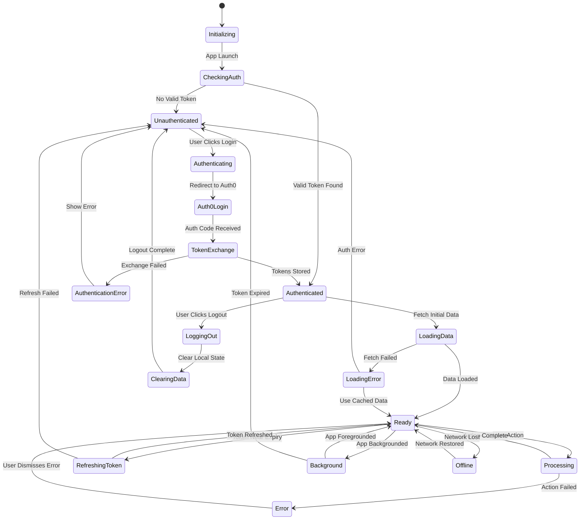
```mermaid
stateDiagram-v2
    [*] --> Initializing
    
    Initializing --> CheckingAuth: App Launch
    
    CheckingAuth --> Unauthenticated: No Valid Token
    CheckingAuth --> Authenticated: Valid Token Found
    
    Unauthenticated --> Authenticating: User Clicks Login
    Authenticating --> Auth0Login: Redirect to Auth0
    Auth0Login --> TokenExchange: Auth Code Received
    TokenExchange --> Authenticated: Tokens Stored
    TokenExchange --> AuthenticationError: Exchange Failed
    AuthenticationError --> Unauthenticated: Show Error
    
    Authenticated --> LoadingData: Fetch Initial Data
    LoadingData --> Ready: Data Loaded
    LoadingData --> LoadingError: Fetch Failed
    LoadingError --> Ready: Use Cached Data
    LoadingError --> Unauthenticated: Auth Error
    
    Ready --> Processing: User Action
    Processing --> Ready: Action Complete
    Processing --> Error: Action Failed
    Error --> Ready: User Dismisses Error
    
    Ready --> RefreshingToken: Token Near Expiry
    RefreshingToken --> Ready: Token Refreshed
    RefreshingToken --> Unauthenticated: Refresh Failed
    
    Ready --> Background: App Backgrounded
    Background --> Ready: App Foregrounded
    Background --> Unauthenticated: Token Expired
    
    Authenticated --> LoggingOut: User Clicks Logout
    LoggingOut --> ClearingData: Clear Local State
    ClearingData --> Unauthenticated: Logout Complete
    
    Ready --> Offline: Network Lost
    Offline --> Ready: Network Restored
```

#### 4.6.1.2 Application State Descriptions

**Initializing State**:
- **Entry Actions**: Display splash screen, initialize SDK clients, load configuration
- **Operations**: Check device storage for cached authentication tokens
- **Exit Conditions**: Authentication check complete
- **Duration**: 0.5-2 seconds typical

**CheckingAuth State**:
- **Entry Actions**: Retrieve stored access token and refresh token from secure storage
- **Operations**: Validate token expiration timestamp
- **Exit Conditions**: Token validity determined
- **Transitions**:
  - Valid token → Authenticated state
  - No token or expired → Unauthenticated state

**Unauthenticated State**:
- **UI Display**: Login screen with Auth0 integration button, social login options
- **Available Actions**: Login with email/password, social login, SSO
- **Data Access**: None (public content only if applicable)

**Authenticating State**:
- **Entry Actions**: Redirect to Auth0 hosted login page
- **Operations**: User provides credentials, Auth0 validates
- **Exit Conditions**: Authorization code received or authentication cancelled
- **User Feedback**: Loading indicator, "Logging in..." message

**Authenticated State**:
- **Entry Actions**: Store access token, refresh token, ID token in secure storage
- **Operations**: Extract user profile from ID token, set up API client with token
- **Data Persistence**: Token expiration tracking, user context storage
- **Transitions**: Automatic transition to LoadingData state

**LoadingData State**:
- **Entry Actions**: Fetch initial application data (user profile, dashboard data)
- **Operations**: Parallel API requests for critical data, cache check for instant display
- **Error Handling**: Display cached data if fetch fails, allow app usage with stale data warning
- **Exit Conditions**: Initial data loaded or timeout reached (fallback to cache)

**Ready State**:
- **UI Display**: Full application interface with user data
- **Available Actions**: All user operations (create, read, update, delete)
- **Background Tasks**: Token expiration monitoring, periodic data sync
- **Transitions**:
  - User action → Processing state
  - Network loss → Offline state
  - Token near expiry → RefreshingToken state
  - App backgrounded → Background state
  - Logout → LoggingOut state

**Processing State**:
- **Entry Actions**: Display loading indicator for user action
- **Operations**: Execute API request, database operation, or long-running task
- **User Feedback**: Progress indicator, estimated completion time for long operations
- **Exit Conditions**: Operation completes successfully or fails
- **Optimistic Updates**: UI updated immediately, rolled back if operation fails

**Error State**:
- **Entry Actions**: Display error dialog with user-friendly message
- **Operations**: Log error details, determine if retry eligible
- **User Actions**: Dismiss error, retry operation, navigate away
- **Recovery**: Automatic retry for transient errors, user-initiated retry for others

**RefreshingToken State**:
- **Entry Actions**: Check token expiration (typically refreshed 5 minutes before expiry)
- **Operations**: Send refresh token to Auth0, receive new access token
- **User Experience**: Transparent (no UI indication), operations continue seamlessly
- **Error Handling**: If refresh fails, transition to Unauthenticated state

**Background State**:
- **Entry Actions**: App moved to background (mobile/desktop), user switched tabs (web)
- **Operations**: Pause real-time updates, suspend background tasks
- **Token Management**: Continue monitoring token expiration
- **Return to Foreground**: Check token validity, sync data if stale

**Offline State**:
- **Entry Actions**: Network connectivity lost during Ready state
- **UI Indication**: Offline banner displayed
- **Available Operations**: Read-only access to cached data, queue write operations
- **Sync Strategy**: When network restored, sync queued operations, refresh stale data

**LoggingOut State**:
- **Entry Actions**: Call Auth0 logout endpoint, revoke tokens
- **Operations**: Clear local storage, reset application state, clear sensitive data
- **Security**: Securely delete tokens from device storage
- **Exit Conditions**: Logout complete, transition to Unauthenticated state

### 4.6.2 Session Management

#### 4.6.2.1 Session Lifecycle and Persistence

**Session Initialization**:

1. **Authentication Success**: User completes Auth0 login flow
2. **Token Issuance**: Auth0 returns access token (JWT), ID token, refresh token
3. **Token Storage**:
   - **Web**: httpOnly cookie (preferred) or localStorage with XSS protection
   - **Mobile**: iOS Keychain (secure enclave), Android EncryptedSharedPreferences
   - **Desktop**: Electron safeStorage API with OS keyring integration
4. **Session Tracking**: Generate unique session ID, store session metadata in database

**Token Expiration and Refresh**:

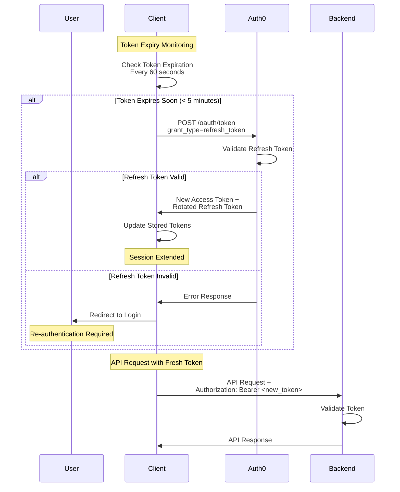
```mermaid
sequenceDiagram
    participant User
    participant Client
    participant Auth0
    participant Backend

    Note over Client: Token Expiry Monitoring
    Client->>Client: Check Token Expiration<br/>Every 60 seconds
    
    alt Token Expires Soon (< 5 minutes)
        Client->>Auth0: POST /oauth/token<br/>grant_type=refresh_token
        Auth0->>Auth0: Validate Refresh Token
        
        alt Refresh Token Valid
            Auth0->>Client: New Access Token +<br/>Rotated Refresh Token
            Client->>Client: Update Stored Tokens
            Note over Client: Session Extended
        else Refresh Token Invalid
            Auth0->>Client: Error Response
            Client->>User: Redirect to Login
            Note over User: Re-authentication Required
        end
    end
    
    Note over Client: API Request with Fresh Token
    Client->>Backend: API Request +<br/>Authorization: Bearer <new_token>
    Backend->>Backend: Validate Token
    Backend->>Client: API Response
```

**Session Timeout Policies**:

| Token Type | Typical Lifetime | Renewal Strategy | Security Rationale |
|------------|------------------|------------------|--------------------|
| Access Token | 1 hour | Refresh before expiry | Short-lived limits impact of token theft |
| Refresh Token | 30 days | Rotated on each use | Rotation enables revocation detection |
| ID Token | 1 hour | Not refreshed | Contains user identity claims |
| Session Cookie | 30 days | Extended on activity | Browser session persistence |

**Inactivity Timeout**:
- Track last user activity timestamp
- Warning dialog at 25 minutes of inactivity: "Session will expire in 5 minutes"
- Automatic logout at 30 minutes of inactivity
- User can extend session by clicking "Stay Logged In" in warning dialog

**Concurrent Session Management**:

**Strategies**:
1. **Allow Multiple Sessions** (Default): User can log in from multiple devices simultaneously
2. **Single Session Enforcement**: New login invalidates previous session on other devices
3. **Limited Concurrent Sessions**: Maximum 3 active sessions, oldest terminated when exceeded

**Implementation**:
- Store session metadata in MongoDB with user_id, device_id, ip_address, created_at, last_activity
- On login, query active sessions for user
- Enforce policy by revoking old sessions (delete from database, add refresh token to blocklist)

**Session Revocation**:

**Revocation Triggers**:
- User-initiated logout
- Password change or security event
- Suspicious activity detected
- Administrator action

**Revocation Process**:
1. Add refresh token to blocklist in Redis (expires after refresh token TTL)
2. Delete session record from MongoDB
3. Backend validates refresh tokens against blocklist before accepting
4. Access tokens remain valid until expiration (short lifetime limits risk)

**Session Security**:

**CSRF Protection**:
- httpOnly, secure, sameSite=strict cookies for web applications
- CSRF tokens for state-changing operations

**Token Storage Security**:
- Never store tokens in localStorage on web (XSS vulnerable)
- Use platform-specific secure storage APIs
- Encrypt tokens at rest with device-specific keys

**Session Hijacking Prevention**:
- Bind session to IP address range (with allowance for mobile IP changes)
- Track device fingerprint (user agent, screen resolution, timezone)
- Anomaly detection for unusual location or device changes

## 4.7 Deployment and Operations Workflows

### 4.7.1 CI/CD Pipeline Flow

#### 4.7.1.1 Complete Deployment Pipeline

Comprehensive workflow from code commit to production deployment:


```mermaid
flowchart TD
    START([Developer Commits Code])
    
    subgraph "Source Control - GitHub"
        GIT_PUSH[Git Push to Branch]
        PR_CREATE{Pull Request<br/>or Main Branch?}
        PR_OPEN[Pull Request Opened]
        PR_REVIEW[Code Review Process]
        PR_APPROVED{PR<br/>Approved?}
        PR_MERGE[Merge to Main Branch]
    end
    
    subgraph "GitHub Actions - CI Pipeline"
        TRIGGER[Workflow Triggered<br/>on Push/PR]
        
        CHECKOUT[Checkout Code<br/>actions/checkout@v3]
        
        SETUP_ENV[Setup Environment<br/>Python 3.11, Node 20]
        
        INSTALL_DEPS[Install Dependencies<br/>pip install, npm install]
        
        subgraph "Code Quality Checks"
            LINT_PYTHON[Python Linting<br/>flake8, pylint, black]
            LINT_TS[TypeScript Linting<br/>ESLint, Prettier]
            TYPE_CHECK[Type Checking<br/>mypy, tsc]
        end
        
        subgraph "Testing Stage"
            UNIT_TEST_BE[Backend Unit Tests<br/>pytest with coverage]
            UNIT_TEST_FE[Frontend Unit Tests<br/>Vitest/Jest]
            INTEGRATION_TEST[Integration Tests<br/>API endpoint tests]
        end
        
        QUALITY_GATE{Quality<br/>Checks Pass?}
        FAIL_NOTIFY[Notify Developer<br/>via GitHub/Slack]
        
        subgraph "Build Stage"
            BUILD_DOCKER[Build Docker Image<br/>Backend Flask App]
            BUILD_FRONTEND[Build Frontend<br/>React/React Native]
            OPTIMIZE[Optimize Assets<br/>Minify, Tree-shake]
        end
        
        subgraph "Security Scanning"
            SCAN_DEPS[Dependency Scan<br/>npm audit, safety]
            SCAN_SECRETS[Secret Detection<br/>git-secrets]
            SCAN_IMAGE[Container Scan<br/>Trivy/Snyk]
        end
        
        SECURITY_GATE{Security<br/>Issues Found?}
        SECURITY_REVIEW[Security Review<br/>Required]
    end
    
    subgraph "Artifact Management"
        TAG_IMAGE[Tag Docker Image<br/>with Git SHA]
        PUSH_ECR[Push to Amazon ECR<br/>Image Registry]
        ARTIFACT_STORE[Store Build Artifacts]
    end
    
    subgraph "Deployment - Staging"
        DEPLOY_STAGING_TRIGGER{Deploy to<br/>Staging?}
        
        TERRAFORM_PLAN[Terraform Plan<br/>Preview Changes]
        TERRAFORM_APPLY[Terraform Apply<br/>Update Infrastructure]
        
        ECS_DEPLOY_STAGING[Update ECS Service<br/>Staging Environment]
        ECS_TASK_STAGING[Launch New Tasks<br/>Rolling Update]
        
        HEALTHCHECK_STAGING[Health Check<br/>Endpoints]
        HEALTHCHECK_PASS{Health<br/>Check Pass?}
        ROLLBACK_STAGING[Rollback to<br/>Previous Version]
        
        SMOKE_TEST[Smoke Tests<br/>Critical Paths]
        E2E_TEST[E2E Tests<br/>Playwright/Cypress]
        
        STAGING_GATE{Staging<br/>Tests Pass?}
    end
    
    subgraph "Deployment - Production"
        PROD_APPROVAL{Manual<br/>Approval?}
        PROD_REVIEW[Deployment Review<br/>Stakeholder Approval]
        
        DEPLOY_STRATEGY{Deployment<br/>Strategy?}
        
        subgraph "Rolling Deployment"
            ROLLING_START[Update ECS Service<br/>Desired Count]
            ROLLING_DRAIN[Drain Connections<br/>from Old Tasks]
            ROLLING_LAUNCH[Launch New Tasks<br/>Sequentially]
            ROLLING_VERIFY[Verify Each Task<br/>Health]
        end
        
        subgraph "Blue-Green Deployment"
            BG_DEPLOY_GREEN[Deploy to Green<br/>Environment]
            BG_VERIFY_GREEN[Test Green<br/>Environment]
            BG_SWITCH_ALB[Switch ALB Target<br/>to Green]
            BG_MONITOR[Monitor Green<br/>Performance]
            BG_DECOMMISSION_BLUE[Decommission Blue<br/>after Soak Period]
        end
        
        subgraph "Canary Deployment"
            CANARY_DEPLOY[Deploy Canary<br/>Version]
            CANARY_ROUTE[Route 5% Traffic<br/>to Canary]
            CANARY_METRICS[Monitor Canary<br/>Metrics]
            CANARY_DECISION{Canary<br/>Healthy?}
            CANARY_INCREASE[Increase Traffic<br/>25%, 50%, 100%]
            CANARY_ROLLBACK[Rollback Canary<br/>Route to Stable]
        end
        
        PROD_HEALTHCHECK[Production Health<br/>Checks]
        PROD_SMOKE[Production Smoke<br/>Tests]
    end
    
    subgraph "Post-Deployment"
        MONITORING[Monitor CloudWatch<br/>Metrics & Logs]
        METRICS_EVAL[Evaluate Performance<br/>Error Rates, Latency]
        
        DEPLOYMENT_STATUS{Deployment<br/>Successful?}
        
        NOTIFY_SUCCESS[Notify Team<br/>Deployment Success]
        NOTIFY_FAILURE[Notify Team<br/>Deployment Failed]
        
        ROLLBACK_DECISION{Rollback<br/>Required?}
        EXECUTE_ROLLBACK[Execute Automated<br/>Rollback]
        
        POST_MORTEM[Post-Mortem<br/>Analysis]
    end
    
    COMPLETE([Deployment Complete])
    
    START --> GIT_PUSH
    GIT_PUSH --> PR_CREATE
    
    PR_CREATE -->|Pull Request| PR_OPEN
    PR_OPEN --> PR_REVIEW
    PR_REVIEW --> PR_APPROVED
    PR_APPROVED -->|No| PR_OPEN
    PR_APPROVED -->|Yes| PR_MERGE
    PR_MERGE --> TRIGGER
    
    PR_CREATE -->|Main Branch| TRIGGER
    
    TRIGGER --> CHECKOUT
    CHECKOUT --> SETUP_ENV
    SETUP_ENV --> INSTALL_DEPS
    
    INSTALL_DEPS --> LINT_PYTHON
    INSTALL_DEPS --> LINT_TS
    LINT_PYTHON --> TYPE_CHECK
    LINT_TS --> TYPE_CHECK
    
    TYPE_CHECK --> UNIT_TEST_BE
    TYPE_CHECK --> UNIT_TEST_FE
    UNIT_TEST_BE --> INTEGRATION_TEST
    UNIT_TEST_FE --> INTEGRATION_TEST
    
    INTEGRATION_TEST --> QUALITY_GATE
    QUALITY_GATE -->|Fail| FAIL_NOTIFY
    QUALITY_GATE -->|Pass| BUILD_DOCKER
    
    BUILD_DOCKER --> BUILD_FRONTEND
    BUILD_FRONTEND --> OPTIMIZE
    OPTIMIZE --> SCAN_DEPS
    
    SCAN_DEPS --> SCAN_SECRETS
    SCAN_SECRETS --> SCAN_IMAGE
    SCAN_IMAGE --> SECURITY_GATE
    
    SECURITY_GATE -->|Critical Issues| SECURITY_REVIEW
    SECURITY_GATE -->|Pass| TAG_IMAGE
    
    TAG_IMAGE --> PUSH_ECR
    PUSH_ECR --> ARTIFACT_STORE
    ARTIFACT_STORE --> DEPLOY_STAGING_TRIGGER
    
    DEPLOY_STAGING_TRIGGER -->|Yes| TERRAFORM_PLAN
    TERRAFORM_PLAN --> TERRAFORM_APPLY
    TERRAFORM_APPLY --> ECS_DEPLOY_STAGING
    ECS_DEPLOY_STAGING --> ECS_TASK_STAGING
    ECS_TASK_STAGING --> HEALTHCHECK_STAGING
    
    HEALTHCHECK_STAGING --> HEALTHCHECK_PASS
    HEALTHCHECK_PASS -->|Fail| ROLLBACK_STAGING
    ROLLBACK_STAGING --> NOTIFY_FAILURE
    HEALTHCHECK_PASS -->|Pass| SMOKE_TEST
    
    SMOKE_TEST --> E2E_TEST
    E2E_TEST --> STAGING_GATE
    STAGING_GATE -->|Fail| NOTIFY_FAILURE
    STAGING_GATE -->|Pass| PROD_APPROVAL
    
    PROD_APPROVAL -->|Required| PROD_REVIEW
    PROD_REVIEW --> DEPLOY_STRATEGY
    PROD_APPROVAL -->|Auto| DEPLOY_STRATEGY
    
    DEPLOY_STRATEGY -->|Rolling| ROLLING_START
    ROLLING_START --> ROLLING_DRAIN
    ROLLING_DRAIN --> ROLLING_LAUNCH
    ROLLING_LAUNCH --> ROLLING_VERIFY
    ROLLING_VERIFY --> PROD_HEALTHCHECK
    
    DEPLOY_STRATEGY -->|Blue-Green| BG_DEPLOY_GREEN
    BG_DEPLOY_GREEN --> BG_VERIFY_GREEN
    BG_VERIFY_GREEN --> BG_SWITCH_ALB
    BG_SWITCH_ALB --> BG_MONITOR
    BG_MONITOR --> BG_DECOMMISSION_BLUE
    BG_DECOMMISSION_BLUE --> PROD_HEALTHCHECK
    
    DEPLOY_STRATEGY -->|Canary| CANARY_DEPLOY
    CANARY_DEPLOY --> CANARY_ROUTE
    CANARY_ROUTE --> CANARY_METRICS
    CANARY_METRICS --> CANARY_DECISION
    CANARY_DECISION -->|Healthy| CANARY_INCREASE
    CANARY_INCREASE --> CANARY_METRICS
    CANARY_DECISION -->|Unhealthy| CANARY_ROLLBACK
    CANARY_ROLLBACK --> NOTIFY_FAILURE
    CANARY_INCREASE -.100% Traffic.-> PROD_HEALTHCHECK
    
    PROD_HEALTHCHECK --> PROD_SMOKE
    PROD_SMOKE --> MONITORING
    MONITORING --> METRICS_EVAL
    METRICS_EVAL --> DEPLOYMENT_STATUS
    
    DEPLOYMENT_STATUS -->|Success| NOTIFY_SUCCESS
    NOTIFY_SUCCESS --> COMPLETE
    
    DEPLOYMENT_STATUS -->|Failure| NOTIFY_FAILURE
    NOTIFY_FAILURE --> ROLLBACK_DECISION
    ROLLBACK_DECISION -->|Yes| EXECUTE_ROLLBACK
    EXECUTE_ROLLBACK --> POST_MORTEM
    ROLLBACK_DECISION -->|No| POST_MORTEM
    POST_MORTEM --> COMPLETE
```

#### 4.7.1.2 CI/CD Pipeline Stages Detailed

**Stage 1: Source Control and Code Review**

**Pull Request Workflow**:
- Developer creates feature branch from `main`
- Commits code changes with descriptive commit messages (Conventional Commits format)
- Opens pull request with description, testing notes, and screenshots
- Automated checks run on PR (linting, tests)
- Code review by at least one team member required
- Approval triggers merge to `main` branch

**Branch Protection Rules**:
- Require status checks to pass before merging
- Require code review approval
- Prevent force push to `main` branch
- Require linear history (no merge commits on feature branches)

**Stage 2: Continuous Integration (Build and Test)**

**Code Quality Checks**:
```yaml
# GitHub Actions workflow excerpt
- name: Python Linting
  run: |
    flake8 src/ --max-line-length=100
    pylint src/ --fail-under=8.0
    black --check src/

- name: TypeScript Linting
  run: |
    npm run lint
    npm run format:check

- name: Type Checking
  run: |
    mypy src/
    npm run type-check
```

**Testing Requirements**:
- Minimum 80% code coverage for backend
- Minimum 70% code coverage for frontend
- All integration tests must pass
- Performance regression tests for critical paths

**Stage 3: Security Scanning**

**Dependency Vulnerability Scanning**:
- Python: `safety check` scans PyPI packages against vulnerability database
- JavaScript/TypeScript: `npm audit` checks npm dependencies
- Severity threshold: Fail build on high/critical vulnerabilities
- Weekly dependency update PRs via Dependabot

**Container Security Scanning**:
- Trivy scans Docker images for vulnerabilities in base images and packages
- Snyk integration for additional vulnerability intelligence
- SBOM (Software Bill of Materials) generation for compliance

**Secret Detection**:
- git-secrets prevents commits containing AWS keys, API tokens, passwords
- Regular expression patterns for custom secret formats
- Pre-commit hooks enforce secret detection locally

**Stage 4: Artifact Management**

**Docker Image Tagging Strategy**:
```
{environment}-{git-sha-short}
Example: prod-a1b2c3d, staging-e4f5g6h

Additional tags:
- latest (points to most recent production image)
- stable (points to last known good production image)
- {branch-name} (for feature branch testing)
```

**Image Retention Policy**:
- Keep last 10 production images
- Keep last 5 staging images
- Automatically delete images older than 30 days (except tagged releases)

**Stage 5: Staging Deployment**

**Infrastructure as Code**:
- Terraform manages all AWS infrastructure (VPC, ECS, ALB, S3, etc.)
- State stored in S3 with DynamoDB locking
- Workspace separation: staging, production
- Plan output reviewed before apply

**ECS Rolling Update**:
1. Update ECS task definition with new Docker image
2. Set desired count to match current running tasks
3. ECS launches new tasks with new image
4. Health checks verify new tasks are healthy
5. ECS drains connections from old tasks
6. ECS terminates old tasks after drain period (30 seconds)
7. Repeat until all tasks updated

**Health Check Configuration**:
```json
{
  "healthCheck": {
    "path": "/health",
    "interval": 30,
    "timeout": 5,
    "healthyThreshold": 2,
    "unhealthyThreshold": 3
  }
}
```

**Staging Tests**:
- Smoke tests: Verify critical API endpoints respond
- E2E tests: Playwright tests for key user workflows
- Performance tests: Load testing with expected traffic patterns
- Data validation: Verify staging data migrations successful

**Stage 6: Production Deployment**

**Manual Approval Gate**:
- Required for production deployments
- Approved by: Tech lead, product owner, or designated approver
- Approval checklist:
  - All staging tests passed
  - No critical bugs in backlog
  - Documentation updated
  - Runbook prepared for operations team

**Deployment Strategies**:

1. **Rolling Deployment** (Default):
   - Pros: Simple, no additional infrastructure
   - Cons: Mixed versions temporarily, rollback requires redeploy
   - Use for: Low-risk changes, internal tools

2. **Blue-Green Deployment**:
   - Pros: Instant rollback, full testing before cutover, zero downtime
   - Cons: Double infrastructure cost during deployment
   - Use for: Major releases, database migrations, high-risk changes

3. **Canary Deployment**:
   - Pros: Gradual rollout, early problem detection, minimal user impact
   - Cons: Complex routing, extended deployment time
   - Use for: Feature flags, experimental features, suspected performance impact

**Production Monitoring During Deployment**:
- Real-time error rate dashboard
- Latency percentiles (p50, p95, p99)
- Database connection pool utilization
- External service success rates
- User session metrics (active users, new sessions)

**Stage 7: Post-Deployment Verification**

**Deployment Success Criteria**:
- Error rate < 0.5% for 15 minutes post-deployment
- Average latency < baseline + 10%
- No critical alerts triggered
- All health checks passing
- Smoke tests pass in production

**Rollback Triggers**:
- Error rate spike > 2x baseline
- Critical functionality unavailable
- Database corruption detected
- Security vulnerability discovered in deployed version

**Automated Rollback Process**:
1. Detect failure condition via CloudWatch alarms
2. Trigger rollback GitHub Action workflow
3. Revert ECS task definition to previous version
4. Force new deployment with previous image
5. Notify team via Slack/PagerDuty
6. Create incident report for post-mortem

### 4.7.2 Deployment Strategies

#### 4.7.2.1 Rolling Deployment

**Process**:
- ECS gradually replaces tasks with new version
- Minimum healthy percent: 50% (half of tasks must remain healthy)
- Maximum percent: 200% (can temporarily double tasks during deployment)

**Timeline Example** (6 tasks, deploying 2 at a time):
```
00:00 - Start deployment, launch 2 new tasks (v2)
00:30 - New tasks healthy, terminate 2 old tasks (v1)
01:00 - Launch 2 more new tasks (v2)
01:30 - New tasks healthy, terminate 2 more old tasks (v1)
02:00 - Launch final 2 new tasks (v2)
02:30 - New tasks healthy, terminate final 2 old tasks (v1)
03:00 - Deployment complete, all tasks v2
```

**Advantages**: Simple, no extra infrastructure, gradual rollout
**Disadvantages**: Mixed versions during deployment, potential compatibility issues

#### 4.7.2.2 Blue-Green Deployment

**Process**:
1. **Blue Environment**: Current production (e.g., 6 tasks running v1)
2. **Green Environment**: New version deployed (6 new tasks running v2)
3. **Testing**: Smoke tests against green environment (not receiving traffic)
4. **Cutover**: ALB target group switched from blue to green
5. **Monitoring**: Monitor green environment with full traffic for 30 minutes
6. **Decommission**: Terminate blue environment tasks (or keep as instant rollback)

**Traffic Switching**:
- ALB target group modification
- Instant cutover or gradual traffic shift (weighted target groups)
- DNS-based switching for multi-region deployments

**Advantages**: Instant rollback, full testing before cutover, clear separation
**Disadvantages**: Double infrastructure cost, database schema compatibility required

#### 4.7.2.3 Canary Deployment

**Process**:
1. **Deploy Canary**: Launch 1-2 tasks with new version (v2)
2. **Route 5% Traffic**: ALB weighted target group routes 5% to canary
3. **Monitor 15 Minutes**: Evaluate error rates, latency, business metrics
4. **Decision Point**:
   - Healthy → Increase to 25% traffic
   - Unhealthy → Rollback canary
5. **Gradual Increase**: 25% → 50% → 100% with monitoring at each stage
6. **Complete**: All traffic on v2, decommission v1

**Canary Metrics**:
- Error rate comparison: canary vs baseline
- Latency comparison: p99 latency increase
- Business metrics: conversion rates, user engagement
- Resource utilization: CPU, memory, database load

**Advantages**: Early problem detection, minimal user impact, gradual risk
**Disadvantages**: Complex routing, longer deployment time, requires robust monitoring

## 4.8 Validation Rules and Checkpoints

### 4.8.1 Request Validation

#### 4.8.1.1 Input Validation Pipeline

Comprehensive validation workflow for API requests:

```mermaid
flowchart TD
    REQUEST([API Request Received])
    
    subgraph "Layer 1: Schema Validation"
        SCHEMA_CHECK[JSON Schema<br/>Validation]
        SCHEMA_VALID{Schema<br/>Valid?}
        SCHEMA_ERROR[Return 422<br/>Schema Errors]
        
        TYPE_CHECK[Data Type<br/>Validation]
        TYPE_VALID{Types<br/>Correct?}
        TYPE_ERROR[Return 422<br/>Type Errors]
        
        REQUIRED_CHECK[Required Fields<br/>Present?]
        REQUIRED_VALID{All Required<br/>Fields?}
        REQUIRED_ERROR[Return 422<br/>Missing Fields]
    end
    
    subgraph "Layer 2: Business Rule Validation"
        RANGE_CHECK[Range/Length<br/>Validation]
        RANGE_VALID{Within<br/>Bounds?}
        RANGE_ERROR[Return 422<br/>Range Violation]
        
        FORMAT_CHECK[Format Validation<br/>Email, URL, Phone]
        FORMAT_VALID{Format<br/>Valid?}
        FORMAT_ERROR[Return 422<br/>Format Error]
        
        ENUM_CHECK[Enum/Choice<br/>Validation]
        ENUM_VALID{Valid<br/>Choice?}
        ENUM_ERROR[Return 422<br/>Invalid Choice]
        
        CUSTOM_RULES[Custom Business<br/>Rules]
        CUSTOM_VALID{Rules<br/>Satisfied?}
        CUSTOM_ERROR[Return 422<br/>Rule Violation]
    end
    
    subgraph "Layer 3: Data Integrity Validation"
        UNIQUENESS_CHECK[Uniqueness<br/>Validation]
        UNIQUENESS_QUERY[Query Existing<br/>Records]
        UNIQUENESS_VALID{Unique?}
        UNIQUENESS_ERROR[Return 409<br/>Conflict]
        
        REFERENCE_CHECK[Foreign Key<br/>Validation]
        REFERENCE_QUERY[Query Referenced<br/>Documents]
        REFERENCE_VALID{References<br/>Exist?}
        REFERENCE_ERROR[Return 422<br/>Invalid Reference]
        
        CONSISTENCY_CHECK[Data Consistency<br/>Validation]
        CONSISTENCY_VALID{Consistent?}
        CONSISTENCY_ERROR[Return 422<br/>Inconsistent Data]
    end
    
    subgraph "Layer 4: Security Validation"
        SANITIZATION[Input Sanitization<br/>XSS Prevention]
        
        INJECTION_CHECK[SQL/NoSQL Injection<br/>Prevention]
        INJECTION_VALID{Safe<br/>Input?}
        INJECTION_ERROR[Return 400<br/>Malicious Input]
        
        SIZE_LIMIT[Request Size<br/>Limit Check]
        SIZE_VALID{Within<br/>Limit?}
        SIZE_ERROR[Return 413<br/>Payload Too Large]
        
        RATE_LIMIT[Rate Limit<br/>Check]
        RATE_VALID{Within<br/>Rate Limit?}
        RATE_ERROR[Return 429<br/>Too Many Requests]
    end
    
    VALIDATION_SUCCESS[Validation<br/>Successful]
    PROCEED[Proceed to<br/>Business Logic]
    
    REQUEST --> SCHEMA_CHECK
    SCHEMA_CHECK --> SCHEMA_VALID
    SCHEMA_VALID -->|Invalid| SCHEMA_ERROR
    SCHEMA_VALID -->|Valid| TYPE_CHECK
    
    TYPE_CHECK --> TYPE_VALID
    TYPE_VALID -->|Invalid| TYPE_ERROR
    TYPE_VALID -->|Valid| REQUIRED_CHECK
    
    REQUIRED_CHECK --> REQUIRED_VALID
    REQUIRED_VALID -->|Missing| REQUIRED_ERROR
    REQUIRED_VALID -->|Present| RANGE_CHECK
    
    RANGE_CHECK --> RANGE_VALID
    RANGE_VALID -->|Invalid| RANGE_ERROR
    RANGE_VALID -->|Valid| FORMAT_CHECK
    
    FORMAT_CHECK --> FORMAT_VALID
    FORMAT_VALID -->|Invalid| FORMAT_ERROR
    FORMAT_VALID -->|Valid| ENUM_CHECK
    
    ENUM_CHECK --> ENUM_VALID
    ENUM_VALID -->|Invalid| ENUM_ERROR
    ENUM_VALID -->|Valid| CUSTOM_RULES
    
    CUSTOM_RULES --> CUSTOM_VALID
    CUSTOM_VALID -->|Invalid| CUSTOM_ERROR
    CUSTOM_VALID -->|Valid| UNIQUENESS_CHECK
    
    UNIQUENESS_CHECK --> UNIQUENESS_QUERY
    UNIQUENESS_QUERY --> UNIQUENESS_VALID
    UNIQUENESS_VALID -->|Duplicate| UNIQUENESS_ERROR
    UNIQUENESS_VALID -->|Unique| REFERENCE_CHECK
    
    REFERENCE_CHECK --> REFERENCE_QUERY
    REFERENCE_QUERY --> REFERENCE_VALID
    REFERENCE_VALID -->|Missing| REFERENCE_ERROR
    REFERENCE_VALID -->|Valid| CONSISTENCY_CHECK
    
    CONSISTENCY_CHECK --> CONSISTENCY_VALID
    CONSISTENCY_VALID -->|Invalid| CONSISTENCY_ERROR
    CONSISTENCY_VALID -->|Valid| SANITIZATION
    
    SANITIZATION --> INJECTION_CHECK
    INJECTION_CHECK --> INJECTION_VALID
    INJECTION_VALID -->|Malicious| INJECTION_ERROR
    INJECTION_VALID -->|Safe| SIZE_LIMIT
    
    SIZE_LIMIT --> SIZE_VALID
    SIZE_VALID -->|Too Large| SIZE_ERROR
    SIZE_VALID -->|Valid| RATE_LIMIT
    
    RATE_LIMIT --> RATE_VALID
    RATE_VALID -->|Exceeded| RATE_ERROR
    RATE_VALID -->|Valid| VALIDATION_SUCCESS
    
    VALIDATION_SUCCESS --> PROCEED
```

#### 4.8.1.2 Validation Rule Definitions

**Schema Validation Rules**:

```python
# Pydantic model example for user creation request
from pydantic import BaseModel, EmailStr, Field, validator
from typing import Optional
from datetime import date

class UserCreateRequest(BaseModel):
    email: EmailStr  # Validates email format
    username: str = Field(min_length=3, max_length=20, regex="^[a-zA-Z0-9_]+$")
    password: str = Field(min_length=12, max_length=128)
    full_name: str = Field(min_length=1, max_length=100)
    date_of_birth: Optional[date]
    phone_number: Optional[str] = Field(regex=r"^\+?1?\d{9,15}$")
    
    @validator('password')
    def password_strength(cls, v):
        if not any(char.isupper() for char in v):
            raise ValueError('Password must contain uppercase letter')
        if not any(char.islower() for char in v):
            raise ValueError('Password must contain lowercase letter')
        if not any(char.isdigit() for char in v):
            raise ValueError('Password must contain digit')
        if not any(char in '!@#$%^&*()' for char in v):
            raise ValueError('Password must contain special character')
        return v
    
    @validator('date_of_birth')
    def age_validation(cls, v):
        if v and (date.today() - v).days / 365 < 13:
            raise ValueError('User must be at least 13 years old')
        return v
```

**Validation Error Response Format**:

```json
{
  "error": {
    "code": "VALIDATION_ERROR",
    "message": "Request validation failed",
    "details": [
      {
        "field": "email",
        "message": "Invalid email format",
        "code": "INVALID_FORMAT"
      },
      {
        "field": "password",
        "message": "Password must contain uppercase letter",
        "code": "PASSWORD_STRENGTH"
      }
    ]
  }
}
```

**Data Integrity Validation**:

1. **Uniqueness Constraints**:
   - Email addresses must be unique across users collection
   - Usernames must be unique (case-insensitive)
   - External IDs (e.g., SSN, employee ID) must be unique if provided
   - Implementation: Database unique indexes + application-level check before insert

2. **Foreign Key Validation**:
   - User references must exist when creating user-owned resources
   - Organization references must exist and user must be member
   - Implementation: Query referenced collection before proceeding

3. **Referential Integrity**:
   - Prevent deletion of resources with active dependencies
   - Example: Cannot delete user with active subscriptions
   - Implementation: Check for dependencies before delete, or use soft delete

**Security Validation**:

1. **Input Sanitization**:
   - HTML encode user-generated content to prevent XSS
   - Strip dangerous HTML tags (<script>, <iframe>, etc.)
   - Sanitize file names to prevent directory traversal (remove ../, absolute paths)

2. **NoSQL Injection Prevention**:
   - Never interpolate user input into MongoDB query strings
   - Use parameterized queries with driver-provided escaping
   - Validate that inputs match expected data types

3. **Request Size Limits**:
   - JSON body: 1 MB maximum
   - File uploads: 100 MB maximum (configurable per endpoint)
   - URL length: 2048 characters maximum

4. **Rate Limiting**:
   - Anonymous: 100 requests per hour per IP
   - Authenticated: 1000 requests per hour per user
   - Sensitive endpoints (login, password reset): 5 requests per 15 minutes per IP

### 4.8.2 Security Checkpoints

#### 4.8.2.1 Authentication and Authorization Checkpoints

Security validation points throughout request lifecycle:

# 5. System Architecture

## 5.1 High-Level Architecture

### 5.1.1 System Overview

#### 5.1.1.1 Architectural Style and Rationale

The ABK-1929 system employs a **multi-tier, cloud-native architecture** designed for multi-platform delivery across web, mobile (iOS and Android), and desktop applications. The architecture is structured around several key principles that enable scalability, maintainability, and platform flexibility.

**Primary Architectural Style**: The system implements a **three-tier architecture** with clear separation between presentation (frontend clients), application logic (Flask backend services), and data management (MongoDB Atlas, S3 storage). This separation enables independent scaling of each tier, simplifies testing and deployment, and facilitates team specialization across frontend and backend development.

**API-First Design Philosophy**: All business logic is exposed through a comprehensive RESTful API, enabling a single backend to serve multiple client platforms without code duplication. This approach provides several strategic advantages: consistent business logic enforcement across all platforms, simplified third-party integrations, and the ability to add new client platforms without backend modifications.

**Cloud-Native Implementation**: The architecture leverages AWS managed services extensively, including ECS for container orchestration, ALB for load balancing, S3 for object storage, and ElastiCache for distributed caching. This managed services approach reduces operational overhead, provides enterprise-grade reliability and security, and enables rapid scaling without infrastructure management complexity.

**Event-Driven Elements**: While primarily request-response based, the architecture incorporates asynchronous processing patterns for AI/ML workloads and background tasks. This hybrid approach ensures responsive user interfaces for synchronous operations while enabling efficient handling of computationally intensive or long-running processes.

#### 5.1.1.2 Key Architectural Principles

**1. Platform Agnostic Design**: The backend API serves as a universal interface for web browsers, iOS/Android mobile devices, and Windows/macOS/Linux desktop applications. Each platform implements platform-specific user interface patterns while consuming identical backend services, ensuring consistent business logic and data access patterns.

**2. Stateless Service Architecture**: The Flask backend maintains no session state between requests, storing all session data externally in MongoDB or client-side JWT tokens. This stateless design enables horizontal scaling by allowing any backend instance to handle any request, simplifies deployment through immutable container images, and facilitates auto-scaling based on demand.

**3. Defense in Depth Security**: Multiple security layers protect the system at different levels. Authentication occurs through Auth0 (OAuth 2.0/OIDC), API requests require JWT token validation, data encryption applies at rest (S3, MongoDB) and in transit (TLS 1.2+), and network isolation uses VPC security groups and private subnets for backend services.

**4. Infrastructure as Code**: All infrastructure components are defined and managed through Terraform configurations, ensuring reproducibility across environments, version-controlled infrastructure changes, and consistent deployment processes from staging through production.

**5. Observability First**: Comprehensive logging, metrics collection, and distributed tracing are built into every component. CloudWatch integration provides centralized log aggregation, real-time metrics dashboards, and automated alerting, enabling proactive issue detection and rapid troubleshooting.

#### 5.1.1.3 System Boundaries and Major Interfaces

**Internal Systems** (fully controlled by ABK-1929):
- **Frontend Applications**: React web application, React Native mobile apps, Electron desktop application
- **Backend Services**: Flask 3.x API services running in ECS containers
- **Data Stores**: MongoDB Atlas clusters, Amazon S3 buckets, ElastiCache Redis instances
- **Infrastructure**: VPC networks, security groups, load balancers, container orchestration

**External Systems** (third-party dependencies):
- **Auth0**: Identity-as-a-Service platform providing authentication, authorization, user management, and SSO capabilities
- **LLM Providers**: OpenAI and Anthropic APIs accessed through Langchain abstraction layer for AI/ML processing
- **AWS Managed Services**: ECS, ALB, S3, ElastiCache, CloudWatch, ECR, Secrets Manager
- **CI/CD Platform**: GitHub Actions for automated build, test, and deployment pipelines

**User Interface Boundaries**:
- **Web Clients**: Modern browsers (Chrome, Firefox, Safari, Edge - last 2 versions) accessing HTTPS endpoints
- **Mobile Clients**: iOS 14+ and Android 10+ devices with native app installations
- **Desktop Clients**: Windows 10+, macOS 11+, and Linux (Ubuntu 20.04+) operating systems

### 5.1.2 Core Components

#### 5.1.2.1 Component Responsibility Matrix

| Component Name | Primary Responsibility | Key Dependencies | Integration Points |
|----------------|------------------------|------------------|-------------------|
| **React Web Application** | User interface rendering, client-side routing, state management, form handling and validation | Auth0 React SDK, React Router, Zustand/Redux (TBD), React Hook Form | Auth0 for authentication, Flask API via HTTPS, S3 presigned URLs for file uploads |
| **React Native Mobile** | Native mobile UI, platform-specific features (camera, push notifications, biometrics) | Auth0 Mobile SDK, React Navigation, Native modules (Swift/Kotlin) | Auth0 for authentication, Flask API via HTTPS, device secure storage for tokens |
| **Electron Desktop** | Cross-platform desktop application, OS integration, native file system access | Electron APIs, reused React components, Auth0 Desktop SDK | Auth0 for authentication, Flask API via HTTPS, OS keyring for token storage |
| **Auth0 Platform** | User authentication, identity management, MFA, SSO, RBAC policy enforcement | None (external SaaS) | All client platforms for login flow, Flask backend for token validation |
| **AWS Application Load Balancer** | HTTPS termination, SSL/TLS management, request routing, health checks, traffic distribution | ECS services, target groups, security groups | Internet-facing requests from clients, backend ECS container instances |
| **Flask Backend** | RESTful API implementation, business logic execution, request validation, authorization checks | PyMongo/Motor, Boto3, Flask extensions, Langchain | MongoDB for data persistence, S3 for file storage, Redis for caching, LLM APIs |

| Component Name | Primary Responsibility | Key Dependencies | Integration Points |
|----------------|------------------------|------------------|-------------------|
| **Langchain Framework** | LLM provider abstraction, prompt management, RAG workflows, agent orchestration | OpenAI/Anthropic SDKs, vector embedding models | Flask backend for processing requests, MongoDB Atlas Vector Search, external LLM APIs |
| **MongoDB Atlas** | Primary database for application data, vector search for embeddings, aggregation pipelines | None (managed service) | Flask backend via PyMongo/Motor, automated backups, connection pooling |
| **Amazon S3** | Object storage for user files, static assets, backups, large binary data | IAM roles, S3 policies | Flask backend via Boto3, presigned URLs for direct client uploads, lifecycle policies |
| **ElastiCache Redis** | Distributed caching, session storage, rate limiting, pub/sub messaging (optional) | Redis client library | Flask backend for cache operations, eviction policies, TTL management |

#### 5.1.2.2 Critical Component Considerations

**React Web Application**:
- **Scalability**: Static asset delivery through CloudFront CDN enables global distribution with low latency
- **Performance**: Code splitting and lazy loading optimize initial bundle size
- **Security**: XSS protection through React's automatic escaping, CSP headers, secure token storage

**Flask Backend**:
- **Horizontal Scaling**: Stateless design allows ECS auto-scaling from 2-20 instances based on CPU utilization
- **Resilience**: WSGI server (Gunicorn) with multiple worker processes handles concurrent requests
- **Resource Limits**: ECS task definition specifies CPU (1 vCPU) and memory (2GB) constraints per container

**MongoDB Atlas**:
- **High Availability**: M10+ cluster tier provides automatic failover across availability zones
- **Performance**: Index optimization required for query patterns, connection pooling (100 max, 10 min connections)
- **Data Isolation**: Database-level authentication and collection-level access control

**Auth0**:
- **Rate Limits**: Free tier supports 7,000 active users; paid tier required for production scale
- **Customization**: Universal Login customization for brand consistency
- **Compliance**: SOC 2, GDPR, HIPAA-ready authentication infrastructure

### 5.1.3 Data Flow Architecture

#### 5.1.3.1 Primary Data Flow Patterns

**Standard API Request Flow**: User interactions on client applications trigger HTTPS requests to the AWS Application Load Balancer, which performs SSL termination and routes requests to available Flask backend containers in ECS. The backend validates JWT tokens, checks authorization via RBAC policies, executes business logic, and queries MongoDB or S3 as needed. Responses are serialized to JSON and returned through the same path, with the backend optionally caching results in Redis for subsequent requests.

**Authentication Flow**: Unauthenticated users are redirected from client applications to Auth0's hosted login page. After credential validation (with optional MFA challenge), Auth0 returns an authorization code to the client via callback redirect. The client exchanges this code for access tokens (JWT with 1-hour lifetime), ID tokens (user profile), and refresh tokens (30-day lifetime with rotation). Clients store tokens securely in platform-specific storage and include access tokens in subsequent API requests via the Authorization header.

**File Upload Flow with Presigned URLs**: For large file uploads, clients request presigned URLs from the Flask backend, which generates temporary S3 upload URLs (15-60 minute expiration) via Boto3. Clients upload files directly to S3 using these URLs, bypassing the backend to eliminate bandwidth bottlenecks. Upon upload completion, clients notify the backend, which creates metadata records in MongoDB referencing the S3 object keys, enabling efficient file tracking without proxying large data through application servers.

**AI/ML Processing Flow (RAG Pattern)**: User queries requiring AI-powered responses trigger the following pipeline: Flask backend generates vector embeddings for the query via Langchain, performs similarity search in MongoDB Atlas Vector Search to retrieve relevant document chunks, constructs prompts incorporating retrieved context, sends prompts to LLM APIs (OpenAI/Anthropic) via Langchain, parses LLM responses to extract answers and citations, and caches responses in Redis with query hashes as keys for potential reuse.

#### 5.1.3.2 Data Transformation Points

**Request Validation Layer**: Client-submitted JSON payloads undergo schema validation using Pydantic models in Flask route handlers. Validation failures return 400 Bad Request with detailed field-level error messages, preventing invalid data from propagating to business logic or database layers.

**Database Serialization**: Python object models are serialized to BSON documents for MongoDB storage via PyMongo. Datetime objects convert to UTC timestamps, file references store as S3 URIs, and complex nested structures leverage MongoDB's document model for natural representation without join tables.

**API Response Formatting**: Database query results and business logic outputs are transformed into consistent JSON response structures with standardized error formats, pagination metadata for list endpoints, and hypermedia links for resource relationships (HATEOAS principles for API discoverability).

**Cache Key Generation**: Redis cache keys are generated by hashing request parameters (endpoint, query parameters, user context) to create unique identifiers. Cache entries include TTL metadata and version tags to support pattern-based invalidation when underlying data changes.

#### 5.1.3.3 Key Data Stores and Caching

**MongoDB Collections** (example structure, subject to refinement):
- `users`: User profiles, preferences, roles, and authentication metadata
- `sessions`: Active session tracking with device fingerprints and last activity timestamps
- `files`: File metadata including S3 object keys, upload timestamps, file types, and access permissions
- `embeddings`: Vector embeddings for AI/ML features with associated text chunks and metadata
- Domain-specific collections based on application features (structure to be defined during implementation)

**S3 Bucket Organization**:
- `{environment}-user-uploads/`: User-uploaded files organized by user_id subdirectories
- `{environment}-static-assets/`: Frontend build artifacts, images, stylesheets
- `{environment}-backups/`: Database exports and system backups with lifecycle policies

**Redis Cache Strategies**:
- **Cache-Aside Pattern**: Application checks cache first; on miss, queries database and populates cache
- **TTL-Based Expiration**: API responses cached for 5-60 minutes based on data volatility
- **Pattern-Based Invalidation**: Cache keys following patterns deleted on related data updates (e.g., user profile changes invalidate `user:{id}:*` keys)
- **Rate Limiting Counters**: Per-user request counters with sliding window algorithms

### 5.1.4 External Integration Points

| System Name | Integration Type | Data Exchange Pattern | Protocol/Format |
|-------------|------------------|----------------------|-----------------|
| **Auth0** | Identity Provider | Token exchange, user profile retrieval, logout | OAuth 2.0, OIDC / JSON over HTTPS |
| **OpenAI API** | AI/ML Service | Prompt submission, response streaming, embedding generation | REST API / JSON over HTTPS |
| **Anthropic API** | AI/ML Service | Prompt submission, response streaming (via Langchain) | REST API / JSON over HTTPS |
| **AWS ECS** | Container Orchestration | Task deployment, health checks, service discovery | AWS SDK / Proprietary AWS protocols |

| System Name | Integration Type | Data Exchange Pattern | Protocol/Format |
|-------------|------------------|----------------------|-----------------|
| **MongoDB Atlas** | Database Service | CRUD operations, aggregation pipelines, vector search | MongoDB Wire Protocol / BSON |
| **Amazon S3** | Object Storage | File uploads/downloads, presigned URL generation | S3 API / Multipart upload, HTTP(S) |
| **Amazon ElastiCache** | Caching Service | Key-value operations, pub/sub messaging | Redis Protocol / Binary |
| **GitHub Actions** | CI/CD Platform | Webhook-triggered builds, deployment automation | REST API / JSON, SSH for deployments |

#### 5.1.4.1 SLA Requirements and Error Handling

**Auth0 Integration**:
- **Availability SLA**: 99.99% uptime (Auth0 commitment)
- **Response Time**: < 500ms for token validation
- **Error Handling**: Retry authentication with exponential backoff (3 attempts), fallback to maintenance mode if Auth0 unavailable
- **Circuit Breaker**: Open after 50% failure rate over 1 minute, half-open after 30 seconds

**LLM Provider APIs**:
- **Rate Limits**: OpenAI GPT-4 (10,000 tokens/min), Anthropic Claude (varies by tier)
- **Timeout**: 30 seconds for standard requests, 60 seconds for streaming responses
- **Error Handling**: Retry on 429/503 status codes, switch to alternative provider on sustained failures
- **Cost Management**: Token usage tracking, monthly budget alerts, request queuing during high demand

**MongoDB Atlas**:
- **Availability SLA**: 99.995% uptime (M10+ clusters)
- **Connection Pool**: 100 max connections, 10 min connections, 30-second idle timeout
- **Error Handling**: Automatic failover to replica set members (10-30 seconds), read from secondaries on primary unavailability
- **Backup SLA**: Point-in-time recovery with continuous backups, 2-hour RPO

## 5.2 Component Details

### 5.2.1 Frontend Layer Components

#### 5.2.1.1 React Web Application

**Purpose and Responsibilities**:
The React web application serves as the primary browser-based interface for ABK-1929, providing a responsive, accessible user experience across desktop and tablet devices. It handles client-side routing, state management, form validation, and real-time UI updates.

**Technologies and Frameworks**:
- **React 18.x**: Core UI library leveraging concurrent features for improved responsiveness
- **TypeScript 5.x**: Type-safe development with enhanced IDE support and compile-time error detection
- **TailwindCSS 3.x**: Utility-first CSS framework for rapid UI development with consistent design system
- **React Router 6.x**: Declarative routing with nested routes and data loading integration
- **State Management**: Zustand, Redux Toolkit, or React Context API (selection pending architectural review)
- **Form Handling**: React Hook Form with Zod schema validation for type-safe form management
- **Data Fetching**: React Query (TanStack Query) for server state management, caching, and synchronization

**Key Interfaces and APIs**:
- **Auth0 React SDK**: `useAuth0()` hook provides authentication state, login/logout functions, and user profile access
- **REST API Client**: Axios or Fetch wrapper with interceptors for automatic token injection, error handling, and request retries
- **WebSocket Connection** (optional, if implemented): Real-time updates for collaborative features or notifications

**Data Persistence Requirements**:
- **Session Storage**: Authentication tokens in httpOnly cookies (preferred) or secure localStorage with XSS protections
- **Local Storage**: User preferences, theme settings, draft form data for offline resilience
- **IndexedDB** (optional): Client-side caching for offline functionality or large datasets

**Scaling Considerations**:
- **Code Splitting**: Dynamic imports for route-based chunks reduce initial bundle size
- **CDN Delivery**: Static assets served through CloudFront for global distribution and edge caching
- **Progressive Enhancement**: Core functionality works without JavaScript; enhanced features layer on top
- **Performance Budget**: Initial load < 3 seconds on 3G networks, Lighthouse score > 90

#### 5.2.1.2 React Native Mobile Application

**Purpose and Responsibilities**:
The React Native mobile application delivers native iOS and Android experiences while sharing business logic and UI components with the web application. It provides platform-specific features including camera access, push notifications, biometric authentication, and offline data synchronization.

**Technologies and Frameworks**:
- **React Native 0.73+**: Cross-platform mobile framework with new architecture (Fabric, TurboModules)
- **TypeScript 5.x**: Shared type definitions with web application for consistent data models
- **Native Modules**: Swift 5.x (iOS) and Kotlin 1.9+ (Android) for platform-specific functionality
- **React Navigation**: Native stack and tab navigation with deep linking support
- **State Management**: Shared approach with web application for consistency
- **Secure Storage**: react-native-keychain for iOS Keychain and Android Keystore integration

**Key Interfaces and APIs**:
- **Auth0 Mobile SDK**: Native authentication flows with biometric integration and secure token storage
- **Push Notifications**: Firebase Cloud Messaging (FCM) for Android, Apple Push Notification Service (APNs) for iOS
- **Camera API**: react-native-camera for image capture, barcode scanning, and document scanning
- **Biometric Authentication**: TouchID, FaceID (iOS), Fingerprint, Face Unlock (Android) for app unlock

**Data Persistence Requirements**:
- **Secure Token Storage**: Platform-specific secure enclaves (Keychain, Keystore) for OAuth tokens
- **Local Database**: SQLite or Realm for offline data storage and synchronization queues
- **File System**: Document directory for cached images, PDFs, and user-generated content

**Scaling Considerations**:
- **Bundle Optimization**: Hermes JavaScript engine (Android) and native code optimization for performance
- **Memory Management**: Image caching with automatic eviction, lazy loading for list views
- **Background Sync**: Queue operations while offline, sync when network available
- **App Size**: Code splitting for platform-specific features, dynamic delivery for Android App Bundles

#### 5.2.1.3 Electron Desktop Application

**Purpose and Responsibilities**:
The Electron desktop application provides a native desktop experience for Windows, macOS, and Linux users, enabling deep OS integration, native file system access, and offline capabilities while reusing web application components.

**Technologies and Frameworks**:
- **ElectronJS 28+**: Chromium-based desktop application framework with Node.js integration
- **React 18.x**: Reused web components with desktop-specific adaptations
- **Electron Builder**: Packaging and distribution for Windows (NSIS), macOS (DMG), Linux (AppImage, DEB, RPM)
- **Auto-Update**: Electron-updater for automatic background updates with delta downloads

**Key Interfaces and APIs**:
- **Electron Main Process**: Node.js process handling system-level operations, menu management, window lifecycle
- **Electron Renderer Process**: Chromium rendering processes for UI, isolated for security
- **IPC Communication**: Inter-process communication between main and renderer via `ipcMain`/`ipcRenderer`
- **Native Modules**: Node.js addons for system tray, notifications, file dialogs, protocol handlers

**Data Persistence Requirements**:
- **Secure Storage**: Electron safeStorage API with OS-level encryption (DPAPI on Windows, Keychain on macOS, Secret Service on Linux)
- **User Data Directory**: SQLite database for local application state, preferences, and cached data
- **File System Access**: Native file operations for document management, exports, and imports

**Scaling Considerations**:
- **Multi-Window Management**: Separate renderer processes for multi-window workflows
- **Memory Efficiency**: Webview caching, process sandboxing, and automatic garbage collection
- **Startup Performance**: Background launch optimization, lazy module loading
- **Distribution**: Automatic updates via CDN, differential updates to minimize download size

#### 5.2.1.4 Frontend Component Interaction Diagram

```mermaid
graph TB
    subgraph "Client Applications"
        subgraph "Web Browser"
            REACT_WEB[React Web App<br/>TypeScript + TailwindCSS]
            WEB_ROUTER[React Router<br/>Client-Side Routing]
            WEB_STATE[State Management<br/>Zustand/Redux/Context]
            WEB_QUERY[React Query<br/>Server State Cache]
        end
        
        subgraph "Mobile Device"
            RN_APP[React Native App<br/>iOS + Android]
            RN_NAV[React Navigation<br/>Stack/Tab Navigator]
            RN_NATIVE[Native Modules<br/>Swift/Kotlin]
            RN_STORAGE[Secure Storage<br/>Keychain/Keystore]
        end
        
        subgraph "Desktop OS"
            ELECTRON_APP[Electron App<br/>Windows/macOS/Linux]
            ELECTRON_MAIN[Main Process<br/>Node.js]
            ELECTRON_RENDERER[Renderer Process<br/>React UI]
        end
    end
    
    subgraph "Authentication Layer"
        AUTH0_SDK[Auth0 SDK<br/>Platform-Specific]
        AUTH0_SERVICE[Auth0 Service<br/>OAuth 2.0 / OIDC]
    end
    
    subgraph "Backend Services"
        ALB[AWS ALB<br/>Load Balancer]
        API[Flask API<br/>REST Endpoints]
    end
    
    subgraph "Storage Services"
        S3_DIRECT[Amazon S3<br/>Presigned URLs]
    end
    
    REACT_WEB --> WEB_ROUTER
    WEB_ROUTER --> WEB_STATE
    WEB_STATE --> WEB_QUERY
    WEB_QUERY --> AUTH0_SDK
    
    RN_APP --> RN_NAV
    RN_NAV --> RN_NATIVE
    RN_NATIVE --> RN_STORAGE
    RN_STORAGE --> AUTH0_SDK
    
    ELECTRON_APP --> ELECTRON_MAIN
    ELECTRON_MAIN --> ELECTRON_RENDERER
    ELECTRON_RENDERER --> AUTH0_SDK
    
    AUTH0_SDK --> AUTH0_SERVICE
    AUTH0_SERVICE --> |Access Token| WEB_QUERY
    AUTH0_SERVICE --> |Access Token| RN_APP
    AUTH0_SERVICE --> |Access Token| ELECTRON_RENDERER
    
    WEB_QUERY --> |HTTPS + JWT| ALB
    RN_APP --> |HTTPS + JWT| ALB
    ELECTRON_RENDERER --> |HTTPS + JWT| ALB
    
    ALB --> API
    
    WEB_QUERY --> |Direct Upload| S3_DIRECT
    RN_APP --> |Direct Upload| S3_DIRECT
    ELECTRON_RENDERER --> |Direct Upload| S3_DIRECT
```

### 5.2.2 Backend Layer Components

#### 5.2.2.1 Flask Application Service

**Purpose and Responsibilities**:
The Flask backend serves as the core application server, implementing all business logic, data validation, authorization enforcement, and orchestration of external service integrations. It exposes a comprehensive RESTful API consumed by all frontend platforms.

**Technologies and Frameworks**:
- **Flask 3.x**: Lightweight Python web framework providing routing, request handling, and middleware
- **Python 3.11+**: Modern Python runtime with performance improvements and enhanced type hints
- **Pydantic 2.x**: Data validation and serialization using Python type annotations
- **Flask Extensions**:
  - **Flask-JWT-Extended**: JWT token creation, validation, and refresh token management
  - **Flask-CORS**: Cross-origin resource sharing configuration for browser clients
  - **Flask-RESTful or Flask-RESTX**: Structured REST API development with automatic OpenAPI documentation
  - **Flask-PyMongo**: MongoDB integration with connection pooling and query helpers

**Key Interfaces and APIs**:
- **RESTful Endpoints**: CRUD operations following REST conventions (GET, POST, PUT, PATCH, DELETE)
- **Authentication Middleware**: JWT token extraction and validation on protected routes
- **Authorization Decorators**: RBAC enforcement via custom decorators checking user roles and permissions
- **Request Validation**: Pydantic schemas validate incoming JSON payloads, returning 400 errors for violations
- **Response Serialization**: Consistent JSON response format with status codes, data payloads, and error details

**Data Persistence Requirements**:
- **Database Connections**: PyMongo connection pool (100 max, 10 min connections) to MongoDB Atlas
- **Caching Layer**: Redis client for application-level caching with TTL-based expiration
- **File Storage**: Boto3 S3 client for presigned URL generation and file metadata operations
- **Session Storage**: Optional server-side session storage in MongoDB for stateful workflows

**Scaling Considerations**:
- **Horizontal Scaling**: Stateless design enables ECS auto-scaling (2-20 instances based on CPU > 70%)
- **WSGI Server**: Gunicorn with 4-8 worker processes per container, optimized for CPU core count
- **Connection Pooling**: Database and Redis connection pools shared across worker processes
- **Async Operations**: Optional async views with Flask + asyncio for I/O-bound operations
- **Resource Limits**: ECS task definition: 1 vCPU, 2GB memory per container instance

#### 5.2.2.2 Langchain AI/ML Integration

**Purpose and Responsibilities**:
The Langchain framework abstracts interactions with multiple LLM providers, enabling AI-powered features including natural language understanding, document analysis, retrieval-augmented generation, and autonomous agent workflows.

**Technologies and Frameworks**:
- **Langchain 0.1.x**: Python framework for LLM application development with provider abstractions
- **LLM Providers**: OpenAI GPT-4/GPT-3.5-turbo, Anthropic Claude models via unified API
- **Embedding Models**: OpenAI text-embedding-ada-002 for vector generation
- **Vector Store**: MongoDB Atlas Vector Search for similarity-based document retrieval

**Key Interfaces and APIs**:
- **Simple LLM Queries**: Direct prompt submission for Q&A, classification, summarization
- **Prompt Templates**: Reusable templates with variable substitution for consistent prompting patterns
- **Retrieval-Augmented Generation (RAG)**:
  1. User query → embedding generation
  2. Vector similarity search in MongoDB Atlas
  3. Top-K document retrieval (K=5-10)
  4. Context injection into prompt template
  5. LLM completion with grounded context
  6. Response parsing and citation extraction
- **Agent Framework**: Multi-step reasoning with tool calls (database queries, API calls, calculations)
- **Memory Management**: Conversation history tracking for multi-turn dialogues

**Data Persistence Requirements**:
- **Vector Embeddings**: Stored in MongoDB with associated text chunks and metadata
- **Conversation History**: Redis cache for active sessions, MongoDB for long-term storage
- **Prompt Templates**: Configuration files or database records for dynamic template management
- **Usage Tracking**: Token consumption, API costs, and response latencies logged to CloudWatch

**Scaling Considerations**:
- **Rate Limiting**: Token bucket algorithm limits LLM API calls per user/per minute
- **Response Caching**: Redis cache for identical queries (hash-based keys, 1-hour TTL)
- **Batch Processing**: Queue-based processing for bulk document analysis operations
- **Cost Optimization**: Caching reduces redundant API calls, tiered model selection based on complexity
- **Fallback Strategy**: Switch between providers on rate limits or service unavailability

#### 5.2.2.3 Backend Service Interaction Sequence

```mermaid
sequenceDiagram
    participant Client as Client Application
    participant ALB as AWS ALB
    participant Flask as Flask Backend
    participant Auth0 as Auth0
    participant Cache as Redis Cache
    participant DB as MongoDB Atlas
    participant S3 as Amazon S3
    participant LLM as Langchain + LLM

    Note over Client,LLM: Standard CRUD Operation with Caching
    
    Client->>ALB: GET /api/resource/{id}<br/>Authorization: Bearer {token}
    ALB->>Flask: Route to ECS Container
    
    Flask->>Flask: Extract JWT from Header
    Flask->>Auth0: Validate Token Signature<br/>(Public Key Verification)
    Auth0-->>Flask: Token Valid
    
    Flask->>Flask: Check RBAC Permissions
    
    Flask->>Cache: GET cache:resource:{id}
    alt Cache Hit
        Cache-->>Flask: Cached Data
        Flask->>Client: 200 OK + JSON Response
    else Cache Miss
        Cache-->>Flask: Cache Miss
        Flask->>DB: db.resources.find_one({_id: id})
        DB-->>Flask: Document Data
        Flask->>Cache: SET cache:resource:{id}<br/>TTL: 300 seconds
        Flask->>Client: 200 OK + JSON Response
    end
    
    Note over Client,LLM: File Upload with Presigned URL
    
    Client->>Flask: POST /api/files/upload-url<br/>{"filename": "doc.pdf", "size": 1048576}
    Flask->>Flask: Validate Request
    Flask->>S3: Generate Presigned URL<br/>boto3.generate_presigned_url()
    S3-->>Flask: Presigned URL (15 min expiry)
    Flask->>Client: 200 OK + {"upload_url": "https://..."}
    
    Client->>S3: PUT {upload_url}<br/>Content-Type: application/pdf
    S3-->>Client: 200 OK
    
    Client->>Flask: POST /api/files/confirm<br/>{"s3_key": "uploads/user123/doc.pdf"}
    Flask->>DB: db.files.insert_one({s3_key, metadata})
    DB-->>Flask: Insert Acknowledged
    Flask->>Client: 201 Created + File Metadata
    
    Note over Client,LLM: AI/ML Query with RAG
    
    Client->>Flask: POST /api/ai/query<br/>{"query": "What is the summary?"}
    Flask->>Flask: Validate Query
    
    Flask->>LLM: Generate Query Embedding
    LLM-->>Flask: Vector Embedding [768 dims]
    
    Flask->>DB: Vector Search<br/>db.embeddings.aggregate([<br/>  {$vectorSearch: {...}}<br/>])
    DB-->>Flask: Top 5 Relevant Chunks
    
    Flask->>LLM: Construct Prompt with Context<br/>Submit to LLM API
    LLM-->>Flask: Generated Response + Citations
    
    Flask->>Cache: SET cache:query:{hash}<br/>TTL: 3600 seconds
    Flask->>Client: 200 OK + AI Response
```

### 5.2.3 Data Layer Components

#### 5.2.3.1 MongoDB Atlas Database

**Purpose and Responsibilities**:
MongoDB Atlas serves as the primary application database, storing all structured and semi-structured data including user profiles, application entities, session metadata, and vector embeddings for AI/ML features. It provides flexible schema design, horizontal scalability, and native vector search capabilities.

**Technologies and Frameworks**:
- **MongoDB 7.x**: Document-oriented NoSQL database with ACID transactions and aggregation pipelines
- **MongoDB Atlas**: Fully managed database service on AWS with automated backups, monitoring, and scaling
- **PyMongo**: Synchronous Python driver for MongoDB operations
- **Motor** (optional): Asynchronous Python driver for async Flask applications

**Key Interfaces and APIs**:
- **CRUD Operations**: `insert_one()`, `find()`, `update_one()`, `delete_one()` for basic data operations
- **Aggregation Pipeline**: Complex queries, joins ($lookup), grouping, and data transformations
- **Vector Search**: `$vectorSearch` aggregation stage for similarity-based retrieval
- **Transactions**: Multi-document ACID transactions for complex operations requiring atomicity
- **Change Streams**: Real-time data change notifications for event-driven architectures (optional)

**Data Persistence Requirements**:
- **Replica Set Configuration**: M10+ cluster with 3-node replica set across availability zones
- **Index Strategy**: Compound indexes on frequently queried fields, unique indexes for constraints, vector indexes for embeddings
- **Connection Pooling**: 100 maximum connections, 10 minimum connections, 30-second idle timeout
- **Data Retention**: Application-defined retention policies with TTL indexes for automatic expiration

**Scaling Considerations**:
- **Vertical Scaling**: Cluster tier upgrades (M10 → M20 → M30) for increased storage and IOPS
- **Horizontal Scaling**: Sharding for multi-terabyte datasets across shard keys (user_id, tenant_id)
- **Read Scaling**: Read preferences to secondary nodes for read-heavy workloads
- **Auto-Scaling**: Atlas auto-scaling for storage and compute based on utilization thresholds

#### 5.2.3.2 Amazon S3 Object Storage

**Purpose and Responsibilities**:
Amazon S3 provides durable, scalable object storage for all binary data including user-uploaded files, static assets, application backups, and archived data. It supports direct client uploads via presigned URLs to eliminate backend bottlenecks.

**Technologies and Frameworks**:
- **Amazon S3**: Object storage with 99.999999999% (11 9's) durability and 99.99% availability
- **Boto3**: AWS SDK for Python providing S3 API access
- **S3 Features**: Versioning, lifecycle policies, server-side encryption, access logging

**Key Interfaces and APIs**:
- **Presigned URLs**: Temporary upload/download URLs with configurable expiration (15-60 minutes)
- **Direct Upload Pattern**: Clients upload directly to S3, notify backend upon completion
- **Proxied Upload Pattern**: Backend receives file, scans for malware, uploads to S3 (for security-sensitive files)
- **Metadata Storage**: MongoDB stores S3 object keys, file metadata, access permissions

**Data Persistence Requirements**:
- **Bucket Organization**: Separate buckets per environment (dev, staging, production)
- **Object Keys**: Hierarchical structure: `{environment}-uploads/{user_id}/{timestamp}-{filename}`
- **Encryption**: Server-side encryption (SSE-S3 or SSE-KMS) for all objects
- **Access Control**: Bucket policies restrict access to authenticated IAM roles and presigned URL holders

**Scaling Considerations**:
- **Automatic Scaling**: S3 scales automatically to handle any request rate
- **Transfer Acceleration**: S3 Transfer Acceleration for faster global uploads (optional)
- **Lifecycle Policies**:
  - Transition to Intelligent-Tiering after 30 days (automatic cost optimization)
  - Archive to Glacier after 90 days (long-term retention)
  - Delete incomplete multipart uploads after 7 days (cost management)
- **CloudFront Integration**: CDN distribution for frequently accessed assets

#### 5.2.3.3 ElastiCache Redis (Optional)

**Purpose and Responsibilities**:
ElastiCache Redis provides high-performance, distributed caching for frequently accessed data, session storage, rate limiting counters, and real-time pub/sub messaging. Its optional implementation depends on caching requirements validated during development.

**Technologies and Frameworks**:
- **Redis 7.x**: In-memory data structure store with persistence options
- **ElastiCache**: AWS-managed Redis with automatic failover and cluster scaling
- **Redis-py**: Python client library for Redis commands

**Key Interfaces and APIs**:
- **Cache Operations**: `GET`, `SET`, `DEL`, `EXPIRE` for basic key-value caching
- **Data Structures**: Strings, hashes, lists, sets, sorted sets for complex data types
- **Pub/Sub**: `PUBLISH`, `SUBSCRIBE` for real-time messaging (if used for notifications)
- **Rate Limiting**: Sliding window counters using sorted sets with timestamp scores

**Data Persistence Requirements**:
- **Cache Eviction Policy**: LRU (Least Recently Used) eviction when memory limit reached
- **Persistence**: RDB snapshots or AOF (append-only file) for cache warmup after restarts
- **Replication**: Primary-replica configuration with automatic failover

**Scaling Considerations**:
- **Cluster Mode**: Redis Cluster for horizontal scaling across multiple nodes
- **Memory Optimization**: Compression for large values, short TTLs to limit memory growth
- **Connection Pooling**: Redis connection pool with max connections per application instance

#### 5.2.3.4 Data Layer State Transitions

```mermaid
stateDiagram-v2
    [*] --> Validating: API Request Received
    
    Validating --> Authenticated: JWT Valid
    Validating --> Rejected: JWT Invalid
    Rejected --> [*]: 401 Unauthorized
    
    Authenticated --> CheckingCache: Query Operation
    CheckingCache --> CacheHit: Data in Redis
    CheckingCache --> CacheMiss: No Data in Redis
    
    CacheHit --> ReturningData: Serialize Response
    
    CacheMiss --> QueryingDatabase: MongoDB Query
    QueryingDatabase --> DataFound: Document Retrieved
    QueryingDatabase --> DataNotFound: No Document
    
    DataFound --> UpdatingCache: Store in Redis
    UpdatingCache --> ReturningData: Cache Updated
    
    DataNotFound --> ReturningError: 404 Not Found
    ReturningError --> [*]
    
    Authenticated --> WritingData: Create/Update Operation
    WritingData --> ValidatingData: Schema Validation
    ValidatingData --> DataInvalid: Validation Failed
    ValidatingData --> DataValid: Validation Passed
    
    DataInvalid --> ReturningError: 400 Bad Request
    
    DataValid --> CheckingConstraints: Unique Constraints
    CheckingConstraints --> ConstraintViolation: Duplicate Found
    CheckingConstraints --> ConstraintOK: No Conflicts
    
    ConstraintViolation --> ReturningError: 409 Conflict
    
    ConstraintOK --> PersistingData: MongoDB Write
    PersistingData --> WriteSuccess: Write Acknowledged
    PersistingData --> WriteFailure: Database Error
    
    WriteFailure --> RetryingWrite: Transient Error
    RetryingWrite --> PersistingData: Retry Attempt
    WriteFailure --> ReturningError: Permanent Error
    
    WriteSuccess --> InvalidatingCache: Clear Related Cache Keys
    InvalidatingCache --> ReturningData: Data Persisted
    
    ReturningData --> [*]: Response Sent
```

### 5.2.4 Infrastructure Components

#### 5.2.4.1 AWS ECS Container Orchestration

**Purpose and Responsibilities**:
AWS ECS (Elastic Container Service) orchestrates Docker container deployment, manages service scaling, performs health monitoring, and ensures high availability of backend services through automatic task replacement and load distribution.

**Technologies and Frameworks**:
- **AWS ECS**: Container orchestration service with Fargate serverless compute
- **Fargate**: Serverless compute engine for containers, eliminating EC2 instance management
- **Task Definitions**: JSON specifications defining container images, resources, environment variables
- **Service Configuration**: Desired task count, load balancer integration, auto-scaling policies

**Key Interfaces and APIs**:
- **Task Deployment**: ECS launches tasks based on task definitions across availability zones
- **Service Discovery**: AWS Cloud Map or ALB target groups enable service-to-service communication
- **Health Checks**: HTTP endpoint polling (`/health`) with configurable thresholds
- **Logging**: Container stdout/stderr streams to CloudWatch Logs

**Scaling Considerations**:
- **Auto-Scaling**: Target tracking scaling policies based on CPU utilization (target: 70%)
- **Scaling Limits**: Minimum 2 tasks (high availability), maximum 20 tasks (cost control)
- **Scaling Cooldown**: 60-second cooldown between scaling activities prevents oscillation
- **Multi-AZ Deployment**: Tasks distributed across 3 availability zones for fault tolerance

#### 5.2.4.2 Docker Containerization

**Purpose and Responsibilities**:
Docker containers package the Flask application with all dependencies, ensuring consistent environments across development, staging, and production while enabling rapid deployment and rollback capabilities.

**Technologies and Frameworks**:
- **Docker 24+**: Container runtime with BuildKit support for optimized builds
- **Multi-Stage Builds**: Separate builder and runtime stages minimize final image size
- **Base Image**: `python:3.11-slim` for minimal footprint with security updates

**Key Interfaces and APIs**:
- **Dockerfile**: Declarative container image definition with layer caching
- **Docker Compose**: Local development orchestration with MongoDB, Redis, and backend services
- **Container Registry**: Amazon ECR for private Docker image storage

**Scaling Considerations**:
- **Image Optimization**: Multi-stage builds reduce image size from 1.5GB to 300MB
- **Layer Caching**: Dependency installation layers cached to accelerate builds
- **Security**: Non-root user, minimal base image, regular vulnerability scanning

#### 5.2.4.3 Terraform Infrastructure as Code

**Purpose and Responsibilities**:
Terraform manages all AWS infrastructure through declarative configuration files, enabling version-controlled infrastructure changes, consistent environment provisioning, and automated deployment workflows.

**Technologies and Frameworks**:
- **Terraform 1.6+**: Infrastructure as code tool supporting multiple cloud providers
- **HCL2 Syntax**: HashiCorp Configuration Language for resource definitions
- **AWS Provider 5.x**: Terraform provider for AWS service management

**Key Interfaces and APIs**:
- **Resource Definitions**: VPC, subnets, security groups, ECS clusters, ALB, S3 buckets
- **State Management**: Remote state in S3 with DynamoDB locking for concurrent operations
- **Workspaces**: Environment separation (staging, production) with shared modules

**Scaling Considerations**:
- **Modular Design**: Reusable modules for networking, compute, storage components
- **Drift Detection**: Regular `terraform plan` execution detects manual infrastructure changes
- **Rollback**: Git-based version control enables infrastructure rollback via commit history

### 5.2.5 Key Component Flow Diagram

```mermaid
graph TB
    subgraph "Infrastructure Layer - AWS"
        subgraph "Networking"
            IGW[Internet Gateway]
            VPC[VPC<br/>10.0.0.0/16]
            PUBLIC_SUBNET[Public Subnets<br/>Multi-AZ]
            PRIVATE_SUBNET[Private Subnets<br/>Multi-AZ]
            NAT[NAT Gateway]
        end
        
        subgraph "Load Balancing"
            ALB[Application Load Balancer<br/>HTTPS Termination]
            TG[Target Group<br/>Health Checks]
        end
        
        subgraph "Container Orchestration"
            ECS_CLUSTER[ECS Cluster<br/>Fargate]
            ECS_SERVICE[ECS Service<br/>Desired Count: 2-20]
            TASK_1[ECS Task 1<br/>Flask Container]
            TASK_2[ECS Task 2<br/>Flask Container]
            TASK_N[ECS Task N<br/>Flask Container]
        end
        
        subgraph "Observability"
            CW_LOGS[CloudWatch Logs<br/>Centralized Logging]
            CW_METRICS[CloudWatch Metrics<br/>Performance Monitoring]
            CW_ALARMS[CloudWatch Alarms<br/>Automated Alerts]
        end
    end
    
    subgraph "Data Layer"
        MONGO[(MongoDB Atlas<br/>Managed Cluster)]
        S3[(Amazon S3<br/>Object Storage)]
        REDIS[(ElastiCache Redis<br/>Optional Cache)]
    end
    
    subgraph "External Services"
        AUTH0_EXT[Auth0<br/>Identity Provider]
        LLM_EXT[LLM APIs<br/>OpenAI/Anthropic]
    end
    
    IGW --> ALB
    ALB --> TG
    TG --> TASK_1
    TG --> TASK_2
    TG --> TASK_N
    
    ECS_SERVICE --> TASK_1
    ECS_SERVICE --> TASK_2
    ECS_SERVICE --> TASK_N
    
    TASK_1 --> MONGO
    TASK_2 --> MONGO
    TASK_N --> MONGO
    
    TASK_1 --> S3
    TASK_2 --> S3
    TASK_N --> S3
    
    TASK_1 -.Optional.-> REDIS
    TASK_2 -.Optional.-> REDIS
    TASK_N -.Optional.-> REDIS
    
    TASK_1 --> AUTH0_EXT
    TASK_1 --> LLM_EXT
    
    TASK_1 --> CW_LOGS
    TASK_2 --> CW_LOGS
    TASK_N --> CW_LOGS
    
    CW_LOGS --> CW_METRICS
    CW_METRICS --> CW_ALARMS
    
    PRIVATE_SUBNET --> NAT
    NAT --> IGW
```

## 5.3 Technical Decisions and Rationale

### 5.3.1 Architecture and Technology Selection

#### 5.3.1.1 Core Architectural Decisions

| Decision Area | Selected Approach | Alternative Considered | Rationale |
|---------------|-------------------|------------------------|-----------|
| **Architecture Style** | Multi-tier, API-first, cloud-native | Monolithic application, on-premises deployment | API-first enables multi-platform support (web/mobile/desktop) from single backend; cloud-native leverages managed services for operational efficiency |
| **Backend Framework** | Flask (Python microframework) | Django (full-stack framework), FastAPI (async-first) | Flask provides flexibility for AI/ML integration (Langchain ecosystem), lightweight for API-focused architecture, mature ecosystem with extensive extensions |
| **Frontend Technology** | React ecosystem (React, React Native, Electron) | Vue.js, Angular, Native development | Code sharing across platforms (web/mobile/desktop), largest developer community, mature tooling, TypeScript support |
| **Database** | MongoDB (document-oriented) | PostgreSQL (relational), DynamoDB (key-value) | Document model naturally maps to application objects, schema flexibility for early-stage project, native vector search for AI/ML features |

#### 5.3.1.2 Infrastructure and Deployment Decisions

| Decision Area | Selected Approach | Alternative Considered | Rationale |
|---------------|-------------------|------------------------|-----------|
| **Cloud Provider** | AWS | Google Cloud Platform, Azure, multi-cloud | Comprehensive service portfolio, MongoDB Atlas integration, mature container ecosystem (ECS, ECR), enterprise adoption |
| **Container Orchestration** | AWS ECS with Fargate | Kubernetes (EKS), AWS App Runner | Lower operational complexity than Kubernetes, serverless compute eliminates instance management, AWS-native integration, sufficient for current scale requirements |
| **Authentication** | Auth0 (Identity-as-a-Service) | Custom implementation, AWS Cognito, Keycloak | Faster time-to-market, reduced security risk, multi-platform SDK support, compliance features (MFA, SSO, SAML), extensive identity provider integrations |
| **Infrastructure Management** | Terraform (IaC) | AWS CloudFormation, Pulumi, CDK | Multi-cloud portability, mature ecosystem, HCL readability, extensive provider support, infrastructure testing capabilities |

#### 5.3.1.3 Technology Decision Tree

```mermaid
graph TD
    START{System Requirements}
    
    START -->|Multi-Platform| PLATFORM_DECISION{Code Sharing<br/>Possible?}
    PLATFORM_DECISION -->|Yes| REACT_CHOICE[React Ecosystem<br/>Web + Mobile + Desktop]
    PLATFORM_DECISION -->|No| NATIVE_CHOICE[Native per Platform<br/>Higher Development Cost]
    
    START -->|Backend Needs| BACKEND_DECISION{Primary<br/>Use Case?}
    BACKEND_DECISION -->|API-First| MICROFRAMEWORK[Flask<br/>Lightweight + Flexible]
    BACKEND_DECISION -->|Full CMS| FULL_FRAMEWORK[Django<br/>Admin + ORM]
    BACKEND_DECISION -->|High Concurrency| ASYNC_FRAMEWORK[FastAPI<br/>Async-First]
    
    START -->|Data Model| DATABASE_DECISION{Schema<br/>Stability?}
    DATABASE_DECISION -->|Evolving| NOSQL_CHOICE{Vector Search<br/>Required?}
    NOSQL_CHOICE -->|Yes| MONGO_CHOICE[MongoDB Atlas<br/>Vector Search Native]
    NOSQL_CHOICE -->|No| DYNAMO_CHOICE[DynamoDB<br/>Serverless NoSQL]
    DATABASE_DECISION -->|Stable| SQL_CHOICE[PostgreSQL<br/>Relational ACID]
    
    START -->|Authentication| AUTH_DECISION{Build vs Buy?}
    AUTH_DECISION -->|Buy - Fast TTM| SAAS_AUTH[Auth0<br/>Managed IDaaS]
    AUTH_DECISION -->|Buy - AWS Native| COGNITO_AUTH[AWS Cognito<br/>AWS Integration]
    AUTH_DECISION -->|Build| CUSTOM_AUTH[Custom JWT<br/>Higher Risk]
    
    START -->|Orchestration| ORCHESTRATION_DECISION{Kubernetes<br/>Expertise?}
    ORCHESTRATION_DECISION -->|Yes| K8S_CHOICE[EKS<br/>Full Control]
    ORCHESTRATION_DECISION -->|No| MANAGED_DECISION{Serverless<br/>Containers?}
    MANAGED_DECISION -->|Yes| FARGATE_CHOICE[ECS Fargate<br/>Recommended]
    MANAGED_DECISION -->|No| APP_RUNNER[App Runner<br/>Simplest]
```

### 5.3.2 Communication and Integration Patterns

#### 5.3.2.1 Communication Pattern Decisions

| Pattern Area | Selected Approach | Rationale |
|--------------|-------------------|-----------|
| **Client-Server Communication** | RESTful HTTPS with JSON | Industry standard, wide tooling support, simple debugging, stateless design enables scaling, GraphQL reconsidered if over-fetching becomes problematic |
| **Authentication Protocol** | OAuth 2.0 with JWT access tokens | Industry standard for API authorization, stateless tokens eliminate server-side session storage, short-lived tokens (1 hour) limit breach impact |
| **File Upload Strategy** | S3 presigned URLs for large files | Eliminates backend bandwidth bottleneck, reduces backend load, scales horizontally without limits, supports multi-gigabyte uploads via multipart |
| **Real-Time Updates** | Polling or WebSockets (TBD) | Polling sufficient for low-frequency updates, WebSockets for collaborative features if needed, Server-Sent Events considered for one-way streaming |

#### 5.3.2.2 Data Storage Solution Rationale

**MongoDB Selection Justification**:

1. **Schema Flexibility**: Early-stage projects require rapid iteration on data models. MongoDB's schema-on-read approach allows adding fields without migrations, supporting agile development patterns.

2. **Document Model Alignment**: Application entities naturally map to documents (e.g., user profiles with nested preferences, files with metadata arrays), avoiding object-relational impedance mismatch.

3. **Vector Search Capabilities**: MongoDB Atlas Vector Search provides native support for AI/ML embeddings without requiring separate vector databases (Pinecone, Weaviate), reducing architectural complexity.

4. **Horizontal Scalability**: Sharding support enables growth to multi-terabyte datasets with predictable performance, addressing future scale requirements.

5. **Managed Service Benefits**: MongoDB Atlas eliminates operational overhead (backups, monitoring, patching), provides automatic failover, and offers expert support.

**S3 for Object Storage**:

1. **Durability**: 99.999999999% (11 9's) durability eliminates need for backup infrastructure for file data.

2. **Cost Efficiency**: Pay-per-use pricing with lifecycle policies (Intelligent-Tiering, Glacier archival) optimizes costs for infrequently accessed data.

3. **Global Accessibility**: Direct client uploads via presigned URLs enable fast uploads regardless of backend location.

**Redis for Caching (Optional)**:

1. **Performance**: Sub-millisecond latency for cached queries reduces database load and improves response times.

2. **Flexibility**: Supports complex data structures (hashes, sorted sets) beyond key-value, enabling advanced caching patterns.

3. **Eviction Policies**: LRU eviction automatically manages memory, preventing cache growth beyond capacity.

### 5.3.3 Caching Strategy Justification

#### 5.3.3.1 Multi-Layer Caching Approach

| Cache Layer | Location | TTL | Use Case |
|-------------|----------|-----|----------|
| **Browser Cache** | Client browser | 1 hour - 1 year | Static assets (JS, CSS, images), immutable resources |
| **CDN Cache** | CloudFront edge locations | 1 hour - 1 day | Static assets, API responses for public data |
| **Application Cache** | Redis in AWS | 5 minutes - 1 hour | Frequently queried data, user sessions, API responses |
| **Database Query Cache** | MongoDB server | Automatic | Recently executed queries (internal MongoDB cache) |

**Cache-Aside Pattern**: Application checks cache first; on miss, queries database and populates cache. This pattern provides flexibility in cache management and allows selective caching of expensive queries.

**Cache Invalidation Strategies**:
- **TTL-Based**: Entries expire automatically after configured time, ensuring eventual consistency
- **Pattern-Based**: Cache keys with patterns (e.g., `user:{id}:*`) deleted on related data updates
- **Event-Driven**: Database change streams (optional) trigger cache invalidation for real-time consistency

### 5.3.4 Security Mechanism Selection

#### 5.3.4.1 Security Architecture Decisions

| Security Domain | Implementation | Rationale |
|-----------------|----------------|-----------|
| **Authentication** | Auth0 OAuth 2.0/OIDC | Industry-standard protocols, reduced custom code vulnerability, compliance certifications (SOC 2, GDPR), MFA and SSO support |
| **API Authorization** | JWT tokens with RBAC | Stateless authorization scales horizontally, role-based permissions simplify access control, fine-grained permissions possible |
| **Data Encryption (Transit)** | TLS 1.2+ for all communications | Prevents man-in-the-middle attacks, AWS ALB provides automatic certificate management via ACM |
| **Data Encryption (Rest)** | SSE-S3 for S3, MongoDB default encryption | Protects data at rest from physical media theft, minimal performance overhead with managed keys |
| **Secrets Management** | AWS Secrets Manager | Automatic rotation for database credentials and API keys, integration with ECS for runtime injection, audit logging for access |
| **Network Isolation** | VPC with private subnets for backend | Backend services inaccessible from internet, security groups enforce least-privilege network access |

#### 5.3.4.2 Security Decision Flow

```mermaid
graph TD
    SECURITY_REQ{Security Requirement}
    
    SECURITY_REQ --> AUTH_NEED{Authentication<br/>Required?}
    AUTH_NEED -->|Yes| AUTH_CHOICE{Identity<br/>Provider?}
    AUTH_CHOICE -->|External SaaS| AUTH0_IMPL[Auth0 Implementation<br/>OAuth 2.0 / OIDC]
    AUTH_CHOICE -->|AWS Native| COGNITO_IMPL[AWS Cognito<br/>AWS Integration]
    AUTH_CHOICE -->|Custom| CUSTOM_JWT[Custom JWT<br/>Higher Risk]
    
    SECURITY_REQ --> AUTHZ_NEED{Authorization<br/>Required?}
    AUTHZ_NEED -->|Yes| AUTHZ_MODEL{Authorization<br/>Model?}
    AUTHZ_MODEL -->|Role-Based| RBAC_IMPL[RBAC Implementation<br/>Role → Permissions]
    AUTHZ_MODEL -->|Attribute-Based| ABAC_IMPL[ABAC Implementation<br/>Policy Evaluation]
    AUTHZ_MODEL -->|Resource-Based| OWNER_IMPL[Ownership Model<br/>User → Resource]
    
    SECURITY_REQ --> ENCRYPTION_NEED{Data<br/>Sensitivity?}
    ENCRYPTION_NEED -->|High| ENCRYPTION_LEVEL{Encryption<br/>Scope?}
    ENCRYPTION_LEVEL -->|In Transit| TLS_IMPL[TLS 1.2+<br/>All Endpoints]
    ENCRYPTION_LEVEL -->|At Rest| KMS_IMPL[KMS Encryption<br/>SSE-KMS]
    ENCRYPTION_LEVEL -->|End-to-End| E2E_IMPL[Client-Side Encryption<br/>Zero Knowledge]
    
    SECURITY_REQ --> SECRETS_NEED{Secrets<br/>Management?}
    SECRETS_NEED -->|Yes| SECRETS_CHOICE{Rotation<br/>Required?}
    SECRETS_CHOICE -->|Yes| SECRETS_MGR[AWS Secrets Manager<br/>Auto-Rotation]
    SECRETS_CHOICE -->|No| PARAM_STORE[AWS Parameter Store<br/>Static Secrets]
    
    SECURITY_REQ --> NETWORK_NEED{Network<br/>Isolation?}
    NETWORK_NEED -->|Yes| VPC_IMPL[VPC with Private Subnets<br/>Security Groups]
```

### 5.3.5 Architecture Decision Records (ADRs)

#### 5.3.5.1 ADR-001: API-First Multi-Platform Architecture

**Status**: Accepted  
**Date**: 2025-11-17  
**Context**: System requires support for web, iOS, Android, and desktop platforms with consistent business logic and data access.

**Decision**: Implement API-first architecture with single Flask backend serving all platforms via RESTful HTTPS endpoints.

**Consequences**:
- **Positive**: Single business logic implementation, consistent behavior across platforms, simplified testing, enables third-party integrations
- **Negative**: API versioning required for breaking changes, additional latency vs native data access, frontend complexity for state management
- **Mitigation**: API versioning strategy (URL-based or header-based), caching layers to reduce latency

#### 5.3.5.2 ADR-002: Auth0 for Authentication

**Status**: Accepted  
**Date**: 2025-11-17  
**Context**: System requires secure authentication with MFA, SSO, and multi-platform support. Build vs buy decision for identity management.

**Decision**: Use Auth0 as identity-as-a-service platform rather than building custom authentication.

**Consequences**:
- **Positive**: Faster time-to-market, reduced security risk, compliance certifications, multi-platform SDK support, MFA and SSO included
- **Negative**: External dependency, monthly cost per active user, vendor lock-in concerns, customization limitations
- **Mitigation**: Abstract Auth0 integration behind internal interfaces for potential future migration, monitor costs as user base grows

#### 5.3.5.3 ADR-003: MongoDB for Primary Database

**Status**: Accepted  
**Date**: 2025-11-17  
**Context**: Early-stage project requires schema flexibility while supporting AI/ML vector search capabilities.

**Decision**: Use MongoDB Atlas as primary database rather than relational database (PostgreSQL) or other NoSQL options (DynamoDB).

**Consequences**:
- **Positive**: Schema flexibility for rapid iteration, document model maps to application objects, native vector search, horizontal scalability
- **Negative**: No multi-document ACID transactions (pre-v4.0 concern), eventual consistency in replica sets, learning curve for SQL-experienced developers
- **Mitigation**: Use transactions for critical multi-document operations (available in MongoDB 4.0+), design for eventual consistency, provide MongoDB training

#### 5.3.5.4 ADR-004: ECS Fargate over Kubernetes

**Status**: Accepted  
**Date**: 2025-11-17  
**Context**: Container orchestration required for backend services. Kubernetes (EKS) provides maximum flexibility but adds operational complexity.

**Decision**: Use AWS ECS with Fargate launch type rather than Kubernetes (EKS) or self-managed EC2 instances.

**Consequences**:
- **Positive**: Lower operational complexity, serverless compute (no instance management), AWS-native integration, faster time-to-deployment, sufficient for current scale
- **Negative**: Vendor lock-in to AWS, less portable than Kubernetes, fewer advanced orchestration features, cold start latency for new tasks
- **Mitigation**: Abstract infrastructure via Terraform for potential future migration, design stateless services for portability, maintain ECS task warm pool

## 5.4 Cross-Cutting Concerns

### 5.4.1 Monitoring and Observability

#### 5.4.1.1 Observability Strategy

**Three Pillars of Observability**:

1. **Metrics**: Quantitative measurements of system behavior collected over time
2. **Logs**: Discrete event records with contextual information for debugging
3. **Traces**: Request flow tracking across distributed components (optional, for future microservices)

**CloudWatch Integration**: All observability data centralizes in AWS CloudWatch, providing unified dashboards, alerting, and long-term retention with configurable lifecycle policies.

#### 5.4.1.2 Metrics Collection and Monitoring

**Infrastructure Metrics** (CloudWatch automatic collection):
- **ECS Container Metrics**: CPU utilization, memory utilization, network I/O, running task count
- **ALB Metrics**: Request count, HTTP status code distribution (2xx, 4xx, 5xx), target response time, active connections
- **Database Metrics**: MongoDB Atlas provides CPU, memory, disk IOPS, connection count, operation execution times
- **Cache Metrics**: Redis cache hit rate, evictions, memory utilization, connection count

**Application Metrics** (custom CloudWatch metrics):
- **API Performance**: Request latency percentiles (p50, p95, p99), throughput (requests/second), error rates by endpoint
- **Business Metrics**: User registrations, active sessions, feature usage counts, AI/ML query volume
- **External Service Metrics**: Auth0 token validation latency, LLM API response times, token consumption and costs

**Metric Collection Approach**:
```python
# Example: Flask middleware for request metrics
from aws_cloudwatch import CloudWatchClient

cloudwatch = CloudWatchClient()

@app.before_request
def before_request():
    g.start_time = time.time()

@app.after_request
def after_request(response):
    latency = (time.time() - g.start_time) * 1000  # Convert to ms
    
    cloudwatch.put_metric(
        namespace='ABK1929/API',
        metric_name='RequestLatency',
        value=latency,
        unit='Milliseconds',
        dimensions={
            'Endpoint': request.endpoint,
            'Method': request.method,
            'StatusCode': response.status_code
        }
    )
    
    return response
```

#### 5.4.1.3 Alerting and Incident Response

**Alert Severity Levels and Response**:

| Severity | Definition | Response SLA | Notification Channel |
|----------|------------|--------------|----------------------|
| **Critical** | Production down, data loss, security breach | Immediate (24/7) | PagerDuty → On-call engineer |
| **High** | Degraded performance, error rate spike, partial outage | 15 minutes | Slack alert + email |
| **Medium** | Resource utilization high, non-critical errors | 1 hour | Slack notification |
| **Low** | Trends requiring investigation, scheduled maintenance | Next business day | Email digest |

**Critical Alarms**:
- **API Error Rate > 5%** for 5 minutes: Indicates widespread failures, triggers automatic investigation and potential rollback
- **Database Connection Failures**: Sustained connection errors for >2 minutes indicate MongoDB Atlas issues or network partitions
- **ECS Service Unhealthy**: No healthy tasks in ECS service means complete outage
- **Memory Utilization > 90%**: Container out-of-memory risk, triggers scaling or investigation

**Automated Response Actions**:
- **Auto-Scaling**: High CPU utilization (>70% for 3 minutes) triggers ECS task scaling
- **Automated Rollback**: Critical error rate spike within 15 minutes of deployment initiates rollback to previous version
- **Circuit Breaker Activation**: External service failure rate >50% opens circuit breaker, routes to fallback logic

### 5.4.2 Logging and Tracing Strategy

#### 5.4.2.1 Centralized Logging Architecture

**Log Aggregation**: All application and infrastructure logs stream to CloudWatch Logs, providing searchable, queryable, centralized log repository with retention policies (30 days standard, 1 year for production).

**Log Levels and Usage**:
- **DEBUG**: Detailed information for diagnosing problems (development only)
- **INFO**: General informational messages (request received, operation completed)
- **WARNING**: Potentially harmful situations (deprecated API usage, fallback activated)
- **ERROR**: Error events that allow continued execution (validation failures, retry-eligible errors)
- **CRITICAL**: Severe error events causing application shutdown or data loss

**Structured Logging Format** (JSON):
```json
{
  "timestamp": "2025-11-17T14:32:15.123Z",
  "level": "INFO",
  "service": "flask-backend",
  "environment": "production",
  "version": "1.2.3",
  "request_id": "req-uuid-abc123",
  "user_id": "auth0|user456",
  "message": "User profile updated successfully",
  "context": {
    "endpoint": "/api/users/profile",
    "method": "PATCH",
    "duration_ms": 245,
    "ip_address": "192.168.1.100"
  }
}
```

**Log Correlation**: Each request generates unique `request_id` propagated across all log entries for that request, enabling end-to-end request tracing through distributed components.

#### 5.4.2.2 Log Retention and Analysis

**Retention Policies**:
- **Development Environment**: 7 days retention (cost optimization)
- **Staging Environment**: 30 days retention (debugging recent deployments)
- **Production Environment**: 90 days online, 1 year archived to S3 (compliance, incident investigation)

**Log Analysis Patterns**:
- **CloudWatch Insights Queries**: SQL-like queries for log analysis (e.g., "find all 500 errors in last hour")
- **Metric Filters**: Convert log patterns to CloudWatch metrics (e.g., count of specific error messages)
- **Automated Parsing**: Lambda functions process logs for security events, error aggregation, usage analytics

### 5.4.3 Error Handling Patterns

#### 5.4.3.1 Error Classification and Response

**Client Errors (4xx)** - User-correctable issues:
- **400 Bad Request**: Malformed JSON, invalid parameter types, missing required fields → Return detailed validation errors
- **401 Unauthorized**: Missing or invalid JWT token → Redirect to Auth0 login flow
- **403 Forbidden**: Valid authentication but insufficient permissions → Display permission error with guidance
- **404 Not Found**: Resource does not exist → User-friendly "not found" message
- **409 Conflict**: Duplicate resource, concurrent modification → Suggest retry with different identifier
- **422 Unprocessable Entity**: Schema validation failed → Field-level validation errors
- **429 Too Many Requests**: Rate limit exceeded → Display retry-after time, queue request

**Server Errors (5xx)** - System-level issues requiring intervention:
- **500 Internal Server Error**: Unhandled exceptions, bugs → Log full stack trace, automatic retry, alert on-call
- **502 Bad Gateway**: Upstream service failure (database, external API) → Circuit breaker, fallback to cache
- **503 Service Unavailable**: Overload, maintenance mode → Display maintenance message, retry after delay
- **504 Gateway Timeout**: Upstream timeout → Async processing, user notification when complete

#### 5.4.3.2 Retry and Circuit Breaker Patterns

**Exponential Backoff Retry Logic**:
```python
def retry_with_exponential_backoff(func, max_retries=3, base_delay=1.0):
    """
    Retry transient failures with exponential backoff and jitter.
    
    Retry delays: 1s, 2s, 4s with ±20% jitter to prevent thundering herd.
    """
    for attempt in range(max_retries):
        try:
            return func()
        except TransientError as e:
            if attempt == max_retries - 1:
                raise  # Final attempt failed, propagate error
            
            delay = base_delay * (2 ** attempt)
            jitter = delay * 0.2 * random.uniform(-1, 1)
            sleep_time = max(delay + jitter, 0.1)
            
            logger.warning(f"Retry attempt {attempt + 1}/{max_retries} after {sleep_time:.2f}s")
            time.sleep(sleep_time)
```

**Circuit Breaker Pattern**:
- **Closed State** (normal operation): All requests pass through to service
- **Open State** (failure detected): Requests fail immediately without calling service, returns fallback response
- **Half-Open State** (testing recovery): Limited requests pass through to test service health

**Circuit Breaker Configuration**:
- **Failure Threshold**: 50% error rate over 1 minute opens circuit
- **Open Duration**: 30 seconds before transitioning to half-open
- **Success Threshold**: 3 consecutive successful requests in half-open closes circuit

#### 5.4.3.3 Error Handling Flow Diagram

```mermaid
flowchart TD
    ERROR_DETECTED([Error Detected])
    
    ERROR_TYPE{Error<br/>Category?}
    
    subgraph "Client Errors (4xx)"
        CLIENT_ERROR[Client Error<br/>4xx Response]
        LOG_CLIENT[Log with Context<br/>WARN level]
        RETURN_CLIENT[Return Detailed<br/>Error Response]
        USER_ACTION[User Can Correct<br/>and Retry]
    end
    
    subgraph "Transient Server Errors"
        TRANSIENT_ERROR[Transient Error<br/>Network, Timeout]
        RETRY_DECISION{Retry<br/>Attempts<br/>Remaining?}
        RETRY_EXECUTE[Execute Retry<br/>with Backoff]
        RETRY_EXHAUSTED[Retries Exhausted]
        LOG_RETRY[Log Retry Attempt]
    end
    
    subgraph "Persistent Server Errors"
        PERSISTENT_ERROR[Persistent Error<br/>5xx Response]
        LOG_SERVER[Log Full Stack<br/>ERROR level]
        SEVERITY_CHECK{Severity<br/>Level?}
        ALERT_CRITICAL[Send Alert<br/>PagerDuty]
        ALERT_HIGH[Slack Notification]
    end
    
    subgraph "Circuit Breaker Logic"
        CB_CHECK{Circuit<br/>Breaker<br/>State?}
        CB_CLOSED[Closed<br/>Allow Request]
        CB_OPEN[Open<br/>Fail Fast]
        CB_HALF_OPEN[Half-Open<br/>Test Request]
        CB_FALLBACK[Execute Fallback<br/>Logic]
    end
    
    subgraph "Fallback Strategies"
        FALLBACK_CACHE[Return Cached<br/>Response]
        FALLBACK_DEFAULT[Return Default<br/>Values]
        FALLBACK_DEGRADE[Degraded<br/>Functionality]
        FALLBACK_QUEUE[Queue for Later<br/>Processing]
    end
    
    RECOVERY[Recovery Action<br/>Executed]
    NOTIFY_USER[Notify User<br/>of Issue]
    MONITORING[Update Metrics<br/>and Dashboard]
    
    ERROR_DETECTED --> ERROR_TYPE
    
    ERROR_TYPE -->|4xx| CLIENT_ERROR
    CLIENT_ERROR --> LOG_CLIENT
    LOG_CLIENT --> RETURN_CLIENT
    RETURN_CLIENT --> USER_ACTION
    USER_ACTION --> MONITORING
    
    ERROR_TYPE -->|Transient 5xx| TRANSIENT_ERROR
    TRANSIENT_ERROR --> RETRY_DECISION
    RETRY_DECISION -->|Yes| RETRY_EXECUTE
    RETRY_EXECUTE --> LOG_RETRY
    LOG_RETRY --> CB_CHECK
    RETRY_DECISION -->|No| RETRY_EXHAUSTED
    RETRY_EXHAUSTED --> PERSISTENT_ERROR
    
    ERROR_TYPE -->|Persistent 5xx| PERSISTENT_ERROR
    PERSISTENT_ERROR --> LOG_SERVER
    LOG_SERVER --> SEVERITY_CHECK
    SEVERITY_CHECK -->|Critical| ALERT_CRITICAL
    SEVERITY_CHECK -->|High| ALERT_HIGH
    ALERT_CRITICAL --> CB_CHECK
    ALERT_HIGH --> CB_CHECK
    
    CB_CHECK -->|Closed| CB_CLOSED
    CB_CHECK -->|Open| CB_OPEN
    CB_CHECK -->|Half-Open| CB_HALF_OPEN
    
    CB_CLOSED --> RECOVERY
    CB_OPEN --> CB_FALLBACK
    CB_HALF_OPEN --> CB_CLOSED
    
    CB_FALLBACK --> FALLBACK_CACHE
    CB_FALLBACK --> FALLBACK_DEFAULT
    CB_FALLBACK --> FALLBACK_DEGRADE
    CB_FALLBACK --> FALLBACK_QUEUE
    
    FALLBACK_CACHE --> NOTIFY_USER
    FALLBACK_DEFAULT --> NOTIFY_USER
    FALLBACK_DEGRADE --> NOTIFY_USER
    FALLBACK_QUEUE --> NOTIFY_USER
    
    RECOVERY --> MONITORING
    NOTIFY_USER --> MONITORING
```

### 5.4.4 Authentication and Authorization Framework

#### 5.4.4.1 Authentication Architecture

**Auth0 Integration Flow**:

1. **Login Initiation**: User clicks login button in client application
2. **Auth0 Redirect**: Client redirects to Auth0 Universal Login page with client_id and redirect_uri
3. **User Authentication**: User provides credentials (or uses social/SSO login), Auth0 validates, optional MFA challenge
4. **Authorization Code**: Auth0 redirects back to application with authorization code
5. **Token Exchange**: Client exchanges code + client_secret for tokens (access, ID, refresh)
6. **Secure Storage**: Tokens stored in platform-specific secure storage (Keychain, Keystore, httpOnly cookies)
7. **API Requests**: Access token included in Authorization header: `Bearer {token}`
8. **Token Validation**: Backend validates JWT signature using Auth0 public keys, verifies claims (audience, issuer, expiration)

**Token Lifecycle**:
- **Access Token**: JWT with 1-hour lifetime, contains user_id, roles, permissions in claims
- **Refresh Token**: Opaque token with 30-day lifetime, rotated on each use for security
- **ID Token**: JWT with user profile information (name, email, picture), not used for API authorization

**Token Refresh Process**:
```
Client detects token expiration (< 5 minutes remaining)
→ POST to Auth0 /oauth/token with refresh_token
→ Auth0 validates refresh token, returns new access_token + rotated refresh_token
→ Client updates stored tokens transparently
→ Subsequent API requests use new access_token
```

#### 5.4.4.2 Authorization (RBAC) Implementation

**Role-Based Access Control Model**:

**Predefined Roles**:
- **Admin**: Full system access, user management, configuration changes
- **Manager**: Read/write access to managed resources, team member data
- **User**: Standard user access to own resources and shared content
- **Viewer**: Read-only access to permitted resources

**Permission Granularity**:
- **Resource-Level**: Permissions tied to specific resources (e.g., `users`, `files`, `documents`)
- **Action-Level**: Permissions specify allowed operations (e.g., `read`, `write`, `delete`, `share`)
- **Ownership**: Resource owners automatically have full permissions on their resources

**Authorization Check in Flask**:
```python
from functools import wraps
from flask import g, abort

def require_permission(resource, action):
    """
    Decorator to enforce RBAC permissions on Flask routes.
    
    Usage: @require_permission('users', 'write')
    """
    def decorator(func):
        @wraps(func)
        def wrapper(*args, **kwargs):
            user_roles = g.current_user.get('roles', [])
            user_permissions = get_permissions_for_roles(user_roles)
            
            if not has_permission(user_permissions, resource, action):
                abort(403, description=f"Insufficient permissions for {action} on {resource}")
            
            return func(*args, **kwargs)
        return wrapper
    return decorator

@app.route('/api/users/<user_id>', methods=['PATCH'])
@jwt_required()
@require_permission('users', 'write')
def update_user(user_id):
    # Authorization passed, execute update logic
    pass
```

**Permission Matrix Example**:

| Role | Users (Read) | Users (Write) | Files (Read) | Files (Write) | Admin Panel |
|------|--------------|---------------|--------------|---------------|-------------|
| Admin | ✓ | ✓ | ✓ | ✓ | ✓ |
| Manager | ✓ (team) | ✓ (team) | ✓ (team) | ✓ (team) | ✗ |
| User | ✓ (self) | ✓ (self) | ✓ (own + shared) | ✓ (own) | ✗ |
| Viewer | ✓ (self) | ✗ | ✓ (shared) | ✗ | ✗ |

### 5.4.5 Performance Requirements and SLAs

#### 5.4.5.1 Performance Targets

**API Response Time Targets**:

| Endpoint Type | p50 Latency | p95 Latency | p99 Latency | Target Throughput |
|---------------|-------------|-------------|-------------|-------------------|
| Simple GET (cached) | < 50ms | < 100ms | < 200ms | 1,000 req/sec |
| Simple GET (database) | < 200ms | < 500ms | < 1,000ms | 500 req/sec |
| POST/PUT/PATCH | < 300ms | < 800ms | < 1,500ms | 200 req/sec |
| File Upload (presigned URL) | < 100ms | < 200ms | < 500ms | 100 req/sec |
| AI/ML Query (LLM) | < 3,000ms | < 8,000ms | < 15,000ms | 50 req/sec |

**System Availability SLA**:
- **Target Uptime**: 99.9% (approximately 8.76 hours downtime per year, 43.8 minutes per month)
- **Planned Maintenance**: Monthly maintenance windows (Sunday 2-4 AM UTC) excluded from SLA
- **Degraded Performance**: Service considered available if 95% of requests complete successfully within 2x normal latency

**Scalability Requirements**:
- **User Scale**: Support 10,000 concurrent users initially, architecture scalable to 100,000+
- **Data Scale**: 100GB initial database size, architecture supports multi-terabyte growth via sharding
- **Request Scale**: 1,000 requests/second peak load initially, auto-scaling handles 10x spikes

#### 5.4.5.2 Performance Optimization Strategies

**Backend Optimization**:
- **Database Indexing**: Compound indexes on frequent query patterns, TTL indexes for automatic cleanup
- **Connection Pooling**: Reuse database and cache connections across requests (100 max, 10 min connections)
- **Query Optimization**: Projection to fetch only required fields, aggregation pipelines for complex queries
- **N+1 Query Prevention**: Batch queries using `$in` operator instead of individual queries in loops

**Caching Optimization**:
- **Cache Warming**: Pre-populate cache with frequently accessed data during deployment
- **Cache Stampede Prevention**: Single request populates cache on miss, concurrent requests wait (locking)
- **Selective Caching**: Cache expensive queries and rarely changing data, skip caching for user-specific data

**Frontend Optimization**:
- **Code Splitting**: Dynamic imports reduce initial bundle size (target: < 200KB initial load)
- **Lazy Loading**: Load images and components on-demand as user scrolls
- **CDN Distribution**: Static assets served from CloudFront edge locations globally
- **Service Workers**: Cache API responses and assets for offline functionality (optional)

### 5.4.6 Disaster Recovery and High Availability

#### 5.4.6.1 High Availability Architecture

**Multi-AZ Deployment**:
- **ECS Tasks**: Distributed across 3 availability zones within AWS region
- **Application Load Balancer**: Multi-AZ by default, automatic failover
- **MongoDB Atlas**: M10+ cluster with 3-node replica set across availability zones
- **Redis (if used)**: Primary-replica configuration with automatic failover

**Automatic Failover Mechanisms**:
- **ECS Service**: Unhealthy tasks automatically replaced within 30 seconds
- **ALB Health Checks**: Unhealthy targets removed from rotation within 60 seconds
- **MongoDB Replica Set**: Automatic primary election within 10-30 seconds on failure
- **Redis Failover**: ElastiCache automatic promotion of replica to primary

**Single Points of Failure Elimination**:
- **No Single Container**: Minimum 2 ECS tasks running at all times
- **No Single Database Node**: MongoDB replica set with automatic failover
- **No Single Load Balancer**: ALB automatically spans multiple availability zones

#### 5.4.6.2 Backup and Recovery Procedures

**Backup Strategy**:

| Data Store | Backup Frequency | Retention | Recovery Point Objective (RPO) |
|------------|------------------|-----------|--------------------------------|
| MongoDB Atlas | Continuous + daily snapshots | 7 days snapshots, continuous for point-in-time | 1 hour (point-in-time recovery) |
| Amazon S3 | Versioning enabled | 30 versions per object | Real-time (versioning) |
| Terraform State | Versioned in S3 | All versions retained | Real-time (version history) |
| Application Code | Git repository | Indefinite (all commits) | Real-time (commit history) |

**Recovery Procedures**:

**Database Recovery**:
1. Identify recovery point (timestamp for point-in-time, snapshot date for daily backups)
2. Create new MongoDB cluster from backup via Atlas UI or API
3. Update DNS or connection string to point to restored cluster
4. Validate data integrity and application connectivity
5. Resume normal operations

**Application Recovery**:
1. Identify last known good Docker image tag in ECR
2. Update ECS task definition to reference previous image tag
3. Force new deployment via ECS service update
4. Monitor CloudWatch metrics for successful rollback
5. Investigate and fix issue before re-deploying

**Complete System Recovery** (disaster scenario):
1. Provision new AWS resources via Terraform (VPC, ECS, ALB, S3, etc.)
2. Restore MongoDB from continuous backup to new cluster
3. Copy S3 data from backup bucket or enable cross-region replication
4. Deploy last known good Docker image to new ECS cluster
5. Update DNS records to point to new infrastructure
6. Validate end-to-end functionality

#### 5.4.6.3 Rollback Procedures

**Automated Rollback Triggers**:
- **Error Rate Spike**: > 5% error rate for 5 minutes within 30 minutes of deployment
- **Critical Alarm**: CloudWatch alarm for critical service failure
- **Health Check Failures**: > 50% of ECS tasks failing health checks
- **Manual Trigger**: On-call engineer initiates rollback via GitHub Actions workflow

**Rollback Process**:
1. **Identify Previous Version**: Retrieve previous Docker image tag from deployment history
2. **Update Task Definition**: ECS task definition reverted to previous image
3. **Force Deployment**: ECS service updated with previous task definition, triggers rolling update
4. **Health Verification**: Monitor health checks and error rates during rollback
5. **Notification**: Team notified of rollback completion and reason
6. **Incident Report**: Post-mortem created for rollback investigation

**Recovery Time Objective (RTO)**:
- **Automated Rollback**: 5-10 minutes from detection to full recovery
- **Manual Recovery**: 15-30 minutes including decision time
- **Disaster Recovery**: 1-4 hours for complete system rebuild from backups

### 5.4.7 References

#### 5.4.7.1 Technical Specification Sections Referenced

- **Section 1.3 System Overview**: Project context and high-level system description
- **Section 3.2 Programming Languages**: Python 3.11+, TypeScript 5.x, Swift 5.x, Kotlin 1.9+
- **Section 3.3 Frameworks & Libraries**: Flask 3.x, React 18.x, React Native 0.73+, Electron 28+, Langchain 0.1.x, TailwindCSS 3.x
- **Section 3.4 Open Source Dependencies**: PyMongo, Pydantic, Flask extensions, React ecosystem libraries
- **Section 3.5 Third-Party Services**: Auth0, AWS managed services (ECS, S3, ALB, CloudWatch), GitHub Actions
- **Section 3.6 Databases & Storage**: MongoDB Atlas 7.x, Amazon S3, ElastiCache Redis
- **Section 3.7 Development & Deployment**: Docker 24+, Terraform 1.6+, CI/CD tooling
- **Section 3.8 Technology Stack Integration Architecture**: Component integration patterns and technology flow
- **Section 4.2 System-Wide Workflows**: End-to-end request flows, authentication sequences, API processing
- **Section 4.3 Data Management Workflows**: MongoDB operations, S3 file handling, caching strategies
- **Section 4.4 Integration Workflows**: Langchain AI/ML processing, external service integration patterns
- **Section 4.5 Error Handling and Recovery**: Error classification, retry logic, circuit breaker patterns
- **Section 4.6 State Management**: Client application state machines, session lifecycle, token management
- **Section 4.7 Deployment and Operations Workflows**: CI/CD pipeline, deployment strategies (rolling, blue-green, canary)

#### 5.4.7.2 Repository Files Examined

- `README.md`: Project identifier (ABK-1929), minimal placeholder content

#### 5.4.7.3 Architectural Patterns and Standards

- **REST API Design**: RESTful principles for resource-oriented API design
- **OAuth 2.0 / OIDC**: Industry-standard authentication and authorization protocols (Auth0 implementation)
- **JWT (JSON Web Tokens)**: Stateless authentication token format (RFC 7519)
- **Circuit Breaker Pattern**: Fault tolerance for external service integration
- **Cache-Aside Pattern**: Application-controlled caching strategy
- **Retry with Exponential Backoff**: Resilience pattern for transient failures
- **Infrastructure as Code**: Terraform for declarative infrastructure management
- **12-Factor App Methodology**: Cloud-native application design principles
- **Microservices-Ready Architecture**: Containerization and stateless design enable future decomposition

---

**Document Status**: This System Architecture section provides comprehensive documentation of the ABK-1929 system architecture based on the planning-stage technical specification. As this is a greenfield project with no implemented code, all architectural decisions and component details represent the designed architecture pending implementation and validation during development.

**Next Steps for Architecture Validation**:
1. Prototype core authentication flow with Auth0 integration
2. Validate MongoDB schema design with sample queries and access patterns
3. Conduct load testing to verify ECS auto-scaling configuration
4. Implement monitoring dashboards and alert rules in CloudWatch
5. Document API specifications using OpenAPI/Swagger for frontend-backend contract
6. Create architecture review board for ongoing architectural governance

# 6. SYSTEM COMPONENTS DESIGN

## 6.1 Core Services Architecture

### 6.1.1 Architecture Model and Service Paradigm

#### 6.1.1.1 Serverless Event-Driven Architecture

The ABK-1929 system implements a **serverless event-driven job processing architecture** rather than a traditional microservices-based service architecture. This architectural decision fundamentally shapes the service design, scalability approach, and operational characteristics of the system.

**Architectural Classification**: The system is built as a Google Cloud Run Job that processes document generation requests in response to Cloud Pub/Sub events. This represents a shift from the AWS-based, multi-tier architecture described in Section 5.1, reflecting the actual implemented architecture found in the codebase.

**Core Architectural Characteristics**:

- **Event-Triggered Execution**: Job instances are created on-demand in response to Cloud Pub/Sub event messages, eliminating idle resource consumption
- **Ephemeral Processing Model**: Each job execution processes a single event and terminates upon completion, maintaining complete statelessness
- **Platform-Managed Scalability**: Google Cloud Run automatically manages horizontal scaling, load distribution, and resource allocation
- **Serverless Cost Model**: Pay-per-execution pricing model with zero cost during idle periods, optimized for batch and scheduled workloads

**Applicability of Traditional Microservices Concepts**:

While this system does not implement traditional microservices architecture with service discovery, load balancing, or inter-service mesh communication, it does exhibit service-oriented design through:

- Clear service boundaries with external platform services (Admin Service, GitHub Service, Markdown Server)
- Well-defined communication protocols and contracts
- Independent deployment and versioning capabilities
- Fault isolation through event-based decoupling

#### 6.1.1.2 Service Deployment Model

**Primary Service Component**: `archie-job-reverse-document-generator`

**Deployment Platform**: Google Cloud Platform (GCP)  
**Execution Environment**: Google Cloud Run Jobs (Serverless Container Execution)  
**Deployment Region**: Configurable via deployment workflow (default: `us-central1`)

**Container Specification** (from `Dockerfile`):
- **Base OS**: Ubuntu 24.04 LTS
- **Runtime**: Python 3.12
- **Additional Dependencies**: Node.js 20.x, Google Chrome (for rendering operations)
- **Container Registry**: Google Artifact Registry (`gcr.io/blitzy-internal`)

**Deployment Configuration** (from `.github/workflows/deploy-job.yml`):

| Configuration Parameter | Source | Purpose |
|------------------------|--------|---------|
| CPU Allocation | `vars.CPU` | Per-task computational resources |
| Memory Allocation | `vars.MEMORY` | Per-task memory limit |
| Task Timeout | `vars.TIMEOUT` | Maximum execution duration per job instance |
| Max Retries | `vars.MAX_RETRIES` | Automatic retry attempts on failure |

**VPC Integration**: The service operates within a secure Virtual Private Cloud (VPC) network, utilizing a VPC connector (`vars.VPC_CONNECTOR_STAGE`) to enable private communication with internal services and databases while maintaining security isolation from public internet access.

**Service Account Authentication**: Executes under a dedicated Google Cloud service account (`vars.SERVICE_ACCOUNT_STAGE`) with least-privilege IAM permissions for accessing required GCP resources (Cloud Storage, Pub/Sub, Artifact Registry).

#### 6.1.1.3 Divergence from Technical Specification Architecture

**Critical Architectural Discrepancy**: The implemented architecture differs significantly from the AWS-based architecture documented in Sections 5.1 and 5.2 of this Technical Specification:

| Specification (Sections 5.1-5.2) | Actual Implementation |
|----------------------------------|----------------------|
| AWS ECS with Application Load Balancer | Google Cloud Run Jobs (event-driven) |
| Flask REST API web service | Python async event processor |
| MongoDB Atlas database | Neo4J graph database |
| Multi-tier architecture with frontend clients | Backend job service (no frontend) |
| AWS S3 storage | Google Cloud Storage (GCS) |

This discrepancy suggests the Technical Specification may represent either a planned future architecture, a different project template, or documentation for a related but distinct system. This section documents the **actual implemented architecture** found in the repository codebase.

### 6.1.2 Service Components and Boundaries

#### 6.1.2.1 Primary Service Component: Document Generator Job

**Service Name**: `archie-job-reverse-document-generator`  
**Service Type**: Batch Processing Job (Cloud Run Jobs)  
**Primary Purpose**: AI-powered technical documentation generation from source code repositories

**Core Service Responsibilities** (from `main.py`):

1. **Event Processing and Orchestration**
   - Receives Cloud Pub/Sub event messages containing project and repository metadata
   - Validates event payload structure and required parameters
   - Initializes processing context with project configuration and credentials

2. **Code Graph Construction and Analysis**
   - Utilizes `CodeGraphBuilder` to construct comprehensive repository structure analysis
   - Extracts architectural patterns, dependencies, and component relationships
   - Stores graph data in Neo4J database for persistence and querying

3. **Document Generation Workflow Execution**
   - Implements LangGraph-based state machine for multi-step document generation
   - Orchestrates sequential and parallel agent nodes for different documentation sections
   - Manages workflow state transitions and error recovery

4. **External Service Integration**
   - Coordinates with platform services (Admin, GitHub, Markdown) via REST APIs
   - Manages LLM provider interactions (Anthropic Claude, OpenAI GPT, Google AI)
   - Handles file storage operations with Google Cloud Storage

5. **Result Publication and Notification**
   - Publishes generated documentation artifacts to Google Cloud Storage
   - Emits completion notifications to `PLATFORM_EVENTS_TOPIC` via Cloud Pub/Sub
   - Updates project metadata and status via Admin Service API

**Service Boundary Definition**:

The service boundary is defined by the **event payload contract** and **output artifact specification**:

- **Input Boundary**: Cloud Pub/Sub event message conforming to project event schema (project_id, repository_url, generation_parameters)
- **Output Boundary**: Generated documentation stored in GCS bucket, completion notification published to Pub/Sub topic
- **Processing Boundary**: All document generation logic, LLM orchestration, and intermediate state management occur within the job execution

#### 6.1.2.2 External Service Dependencies

The document generator job integrates with multiple external services and platforms to accomplish its processing objectives. These dependencies represent service boundaries in the broader "Archie" platform ecosystem.

**Platform Service Dependencies** (from `main.py` and deployment configuration):

| Service Name | Communication Protocol | Purpose | Configuration Source |
|-------------|------------------------|---------|---------------------|
| **Admin Service** | HTTP REST API | Project metadata, attachment management | `SERVICE_URL_ADMIN_STAGE` |
| **GitHub Service** | HTTP REST API | Repository access, code retrieval | `SERVICE_URL_GITHUB_STAGE` |
| **Markdown Server** | HTTP REST API | Document rendering and validation | `MARKDOWN_SERVER` |
| **Neo4J Database** | Bolt protocol (TCP) | Code graph storage and querying | `NEO4J_URI`, `NEO4J_PASSWORD_STAGE` |

**LLM Provider Dependencies**:

| Provider | Purpose | Authentication | Model Configuration |
|----------|---------|----------------|---------------------|
| **Anthropic (Claude)** | Primary LLM for document generation | `ANTHROPIC_API_KEY_DEV` | `llm_claude_4_5_sonnet_med_thinking_med_output` |
| **OpenAI (GPT)** | Alternative LLM provider | `OPENAI_API_KEY_DEV` | `llm_gpt5_mini` |
| **Google AI** | Google LLM services | `GOOGLE_API_KEY_DEV` | Configurable models |
| **Voyage AI** | Vector embeddings generation | `VOYAGE_API_KEY_DEV` | Embedding models |

**Infrastructure Service Dependencies**:

| Service | Provider | Purpose | Integration Method |
|---------|----------|---------|-------------------|
| **Cloud Pub/Sub** | Google Cloud | Event ingestion and notification | Publisher/Subscriber SDK |
| **Cloud Storage (GCS)** | Google Cloud | Document and artifact storage | GCS client SDK |
| **Cloud Logging** | Google Cloud | Centralized log aggregation | Automatic (Cloud Run Jobs) |
| **Langsmith** | LangChain | LLM observability and tracing | SDK integration (`LANGSMITH_API_KEY_STAGE`) |

#### 6.1.2.3 Service Integration Architecture

**ServiceClient Pattern** (from `main.py`):

The job implements a unified `ServiceClient` abstraction for HTTP-based service communication, providing:

- **Async HTTP Operations**: Non-blocking I/O for concurrent service calls
- **Connection Pooling**: Reusable HTTP connections across service requests
- **Request Correlation**: Automatic propagation of request IDs for distributed tracing
- **Error Handling**: Standardized error responses and retry logic integration

**Implementation Pattern**:
```python
async with ServiceClient() as client:
    response = await client.async_get(
        service_name="admin",
        endpoint="/v1/attachments",
        params={"project_id": project_id}
    )
```

**Service Discovery Mechanism**: Environment variable-based service URL configuration eliminates the need for dynamic service discovery infrastructure:

- **Advantages**: Simplified deployment, no service registry infrastructure, explicit configuration
- **Configuration**: Service URLs injected via GitHub Secrets and Variables during deployment
- **Environment Isolation**: Separate configurations for development, staging, and production environments

### 6.1.3 Inter-Service Communication Patterns

#### 6.1.3.1 Event-Driven Communication via Cloud Pub/Sub

**Primary Communication Pattern**: Asynchronous event-driven messaging

**Event Ingestion Flow**:

```mermaid
sequenceDiagram
    participant ES as External System<br/>(Trigger Source)
    participant PS as Cloud Pub/Sub<br/>(Event Topic)
    participant CRJ as Cloud Run Job<br/>(Document Generator)
    participant GCS as Google Cloud Storage<br/>(Artifact Store)
    participant PT as Platform Events<br/>(Pub/Sub Topic)
    
    ES->>PS: Publish Document Generation Event
    Note over PS: Event queued with<br/>retry and persistence
    PS->>CRJ: Trigger Job Execution<br/>(EVENT_DATA payload)
    activate CRJ
    
    CRJ->>CRJ: Parse Event Payload
    CRJ->>CRJ: Initialize Processing Context
    CRJ->>CRJ: Execute Document Generation
    
    CRJ->>GCS: Upload Generated Documents
    GCS-->>CRJ: Upload Confirmation
    
    CRJ->>PT: Publish Completion Notification
    Note over PT: Success/failure event<br/>with artifact references
    
    deactivate CRJ
    
    Note over CRJ: Job instance terminates<br/>after completion
```

**Event Payload Structure** (from deployment workflow):

Events are delivered via the `EVENT_DATA` environment variable containing structured JSON with:

- `project_id`: Unique identifier for the documentation project
- `repository_url`: Source code repository location
- `generation_config`: Parameters controlling document generation behavior
- `callback_url`: Optional webhook for completion notification
- `correlation_id`: Request tracking identifier for distributed tracing

**Pub/Sub Configuration Benefits**:

- **At-Least-Once Delivery**: Guaranteed event delivery with automatic retries
- **Message Persistence**: Events retained for 7 days (default) enabling replay
- **Decoupled Architecture**: Event producers and consumers operate independently
- **Automatic Retry**: Failed job executions trigger automatic message redelivery
- **Dead Letter Queue**: Persistently failing events moved to DLQ for manual investigation

**Notification Publication** (from `main.py` and workflow):

The job publishes completion notifications to `PLATFORM_EVENTS_TOPIC` using the `publish_notification` utility from `blitzy_utils`, enabling downstream systems to:

- Track document generation progress and completion
- Trigger post-processing workflows (validation, distribution, indexing)
- Update user interfaces with generation status
- Aggregate metrics for analytics and monitoring

#### 6.1.3.2 Synchronous HTTP Communication Patterns

**RESTful Service Integration**:

The job communicates with platform services via synchronous HTTP REST APIs for operations requiring immediate responses or bidirectional data exchange.

**Communication Characteristics**:

- **Protocol**: HTTP/1.1 and HTTP/2 over TLS
- **Authentication**: Service-to-service authentication via API keys or JWT tokens
- **Request Format**: JSON request bodies with standardized schemas
- **Response Format**: JSON responses with consistent error structure
- **Timeout Configuration**: Per-service timeout limits prevent indefinite blocking

**Service Call Patterns**:

**1. Admin Service - Project Metadata Retrieval**:
- **Endpoint**: `GET /v1/attachments?project_id={id}`
- **Purpose**: Retrieve project configuration, attachments, and context files
- **Retry Behavior**: Automatic retry with exponential backoff for transient failures

**2. GitHub Service - Repository Access**:
- **Endpoint**: Various repository operation endpoints
- **Purpose**: Clone repository, fetch file contents, analyze structure
- **Authentication**: GitHub token management via `GITHUB_SECRET_SERVER`

**3. Markdown Server - Document Rendering**:
- **Endpoint**: Document processing endpoints
- **Purpose**: Validate markdown syntax, render previews, generate formats
- **Performance**: Cached responses for repeated document operations

**HTTP Communication Flow**:

```mermaid
sequenceDiagram
    participant Job as Cloud Run Job
    participant Admin as Admin Service
    participant GitHub as GitHub Service
    participant Neo4J as Neo4J Database
    participant LLM as LLM Provider<br/>(Anthropic/OpenAI)
    participant GCS as Cloud Storage
    
    Job->>Admin: GET /v1/attachments<br/>project_id={id}
    Admin-->>Job: Project metadata + attachments
    
    Job->>GitHub: POST /repository/clone<br/>repository_url
    GitHub-->>Job: Repository contents
    
    Job->>Neo4J: WRITE code_graph_nodes
    Neo4J-->>Job: Graph write confirmation
    
    loop For each documentation section
        Job->>LLM: POST /v1/chat/completions<br/>(section prompt + context)
        LLM-->>Job: Generated documentation
        
        Job->>Job: Process and validate output
    end
    
    Job->>GCS: PUT /bucket/document.md
    GCS-->>Job: Upload success
    
    Job->>Admin: PATCH /v1/projects/{id}/status<br/>status=completed
    Admin-->>Job: Update confirmation
```

#### 6.1.3.3 Service Discovery and Configuration Management

**Static Configuration Approach**:

The system employs environment variable-based service discovery rather than dynamic service registries (e.g., Consul, etcd, Kubernetes DNS):

**Service URL Configuration** (from deployment workflow):
- `SERVICE_URL_ADMIN_STAGE`: Admin Service base URL
- `SERVICE_URL_GITHUB_STAGE`: GitHub Service base URL
- `MARKDOWN_SERVER`: Markdown rendering service URL
- `NEO4J_URI`: Neo4J database connection string

**Configuration Management Strategy**:

| Configuration Type | Storage Location | Injection Method | Update Mechanism |
|-------------------|------------------|------------------|------------------|
| Service URLs | GitHub Variables | Environment variables | Deployment workflow update |
| API Keys/Secrets | GitHub Secrets | Encrypted environment variables | Secret rotation via GitHub |
| Feature Flags | Environment variables | Runtime configuration | Deployment with new values |
| Database Credentials | GitHub Secrets | Encrypted environment variables | Credential rotation |

**Advantages of Static Configuration**:

- **Simplicity**: No service registry infrastructure to maintain
- **Explicit Configuration**: Clear visibility of service dependencies in deployment configuration
- **Version Control**: Configuration changes tracked via git commits to workflow files
- **Environment Isolation**: Separate configurations for development, staging, production

**Disadvantages and Mitigations**:

- **Service URL Changes**: Require redeployment → Mitigated by infrequent URL changes and blue-green deployment
- **No Dynamic Discovery**: Cannot automatically discover new service instances → Acceptable for stable platform services
- **Configuration Drift**: Manual updates across environments → Mitigated by Terraform/IaC for infrastructure

### 6.1.4 Scalability Design

#### 6.1.4.1 Serverless Horizontal Scaling Architecture

**Automatic Scaling Model**:

Google Cloud Run Jobs implements serverless horizontal scaling, automatically creating and destroying job instances based on event volume without manual intervention or configuration of scaling policies.

**Scaling Characteristics**:

- **Scale-to-Zero**: No job instances run when event queue is empty, eliminating idle resource costs
- **Automatic Provisioning**: Cloud Run creates new job instances for queued events up to maximum concurrency limits
- **Independent Execution**: Each job instance processes one event independently, enabling unlimited parallelism
- **Resource Isolation**: Each instance has dedicated CPU and memory allocation, preventing resource contention

**Scaling Triggers and Behavior**:

```mermaid
graph TD
    subgraph "Event Volume and Scaling Behavior"
        Events[Cloud Pub/Sub Event Queue]
        
        subgraph "Scaling Decision Logic"
            Check{Events in<br/>Queue?}
            Count[Count Pending<br/>Events]
            Compare{Current Instances<br/>< Max Concurrency?}
            Scale[Provision New<br/>Job Instance]
        end
        
        subgraph "Job Instance Pool"
            J1[Job Instance 1<br/>Processing Event A]
            J2[Job Instance 2<br/>Processing Event B]
            J3[Job Instance 3<br/>Processing Event C]
            JN[Job Instance N<br/>Processing Event N]
        end
        
        Complete[Event Processing<br/>Complete]
        Terminate[Terminate<br/>Job Instance]
        
        Events --> Check
        Check -->|Yes| Count
        Check -->|No| Idle[Scale to Zero<br/>No Instances]
        Count --> Compare
        Compare -->|Yes| Scale
        Compare -->|No| Queue[Queue Event<br/>Wait for Capacity]
        
        Scale --> J1
        Scale --> J2
        Scale --> J3
        Scale --> JN
        
        J1 --> Complete
        J2 --> Complete
        J3 --> Complete
        JN --> Complete
        
        Complete --> Terminate
    end
    
    style Events fill:#e1f5ff
    style Scale fill:#d4edda
    style Terminate fill:#f8d7da
```

**Scaling Limits and Constraints**:

| Scaling Parameter | Configuration | Rationale |
|------------------|---------------|-----------|
| **Minimum Instances** | 0 (scale-to-zero) | Cost optimization during idle periods |
| **Maximum Concurrent Jobs** | Platform default (1000) | Prevents resource exhaustion and cost overruns |
| **Per-Instance Timeout** | `vars.TIMEOUT` | Prevents runaway jobs, ensures timely resource release |
| **Max Retries per Event** | `vars.MAX_RETRIES` | Balances fault tolerance with cost control |

**Scaling Performance Characteristics**:

- **Cold Start Latency**: 1-5 seconds for new instance provisioning and container initialization
- **Warm Instance Reuse**: Not applicable (job instances terminate after processing)
- **Scale-Up Responsiveness**: Near-instantaneous instance creation for queued events
- **Scale-Down Responsiveness**: Immediate termination after event processing completion

#### 6.1.4.2 Resource Allocation and Optimization

**Per-Instance Resource Configuration** (from deployment workflow):

Resources are allocated on a per-job-instance basis, ensuring consistent performance and predictable cost:

**CPU Allocation**:
- **Configuration Variable**: `vars.CPU`
- **Typical Range**: 1-4 vCPUs per instance
- **Selection Criteria**: Based on computational intensity of document generation (LLM processing, graph analysis, rendering)
- **Performance Impact**: Higher CPU allocation reduces per-event processing time

**Memory Allocation**:
- **Configuration Variable**: `vars.MEMORY`
- **Typical Range**: 2GB-8GB per instance
- **Selection Criteria**: Determined by repository size, code graph memory requirements, LLM context window size
- **Out-of-Memory Prevention**: Conservative allocation prevents job failures due to memory exhaustion

**Timeout Configuration**:
- **Configuration Variable**: `vars.TIMEOUT`
- **Typical Range**: 300-3600 seconds (5-60 minutes)
- **Purpose**: Maximum execution time per job instance prevents indefinite resource consumption
- **Failure Mode**: Jobs exceeding timeout are forcefully terminated and marked as failed

**Resource Optimization Strategies**:

**1. Async/Await Concurrency** (from `main.py`):
- Python `asyncio` enables concurrent I/O operations within a single job instance
- Simultaneous HTTP requests to multiple services (Admin, GitHub, LLM providers)
- Non-blocking database queries and file uploads
- Maximizes CPU utilization during network I/O wait times

**2. Connection Pooling and Reuse**:
- `ServiceClient` maintains connection pools for HTTP services
- Neo4J database connections reused across graph operations within a job execution
- Reduces connection establishment overhead (TLS handshakes, authentication)

**3. LangGraph State Machine Optimization** (from `main.py`):
- Directed acyclic graph (DAG) execution enables parallel agent node processing
- Independent documentation sections generated concurrently
- State checkpointing enables resume from failure points

**Cost Optimization Considerations**:

| Optimization Strategy | Cost Impact | Performance Trade-off |
|----------------------|-------------|----------------------|
| Scale-to-zero during idle | Eliminates idle costs | Cold start latency on first event |
| Right-sized CPU/memory | Avoids over-provisioning | Requires performance profiling |
| Timeout enforcement | Prevents runaway cost | May terminate long-running valid jobs |
| Retry limit configuration | Caps cost of persistent failures | May abandon recoverable jobs |

#### 6.1.4.3 Performance Optimization and Capacity Planning

**Performance Metrics and Targets**:

| Performance Metric | Target Value | Measurement Method |
|-------------------|--------------|-------------------|
| **Average Job Duration** | < 10 minutes | Cloud Run Jobs metrics |
| **P95 Job Duration** | < 20 minutes | Cloud Logging analytics |
| **Cold Start Latency** | < 5 seconds | Event-to-execution time |
| **Job Success Rate** | > 95% | Success vs. failure count |

**Capacity Planning Considerations**:

**Expected Load Characteristics**:
- **Event Volume**: Variable based on user documentation generation requests
- **Peak Load Patterns**: Potential spikes during business hours (9 AM - 5 PM user timezone)
- **Growth Trajectory**: Scales linearly with user base and project count

**Scalability Limits**:

1. **Cloud Run Concurrency Limit**: Platform maximum concurrent jobs (1000 default)
   - **Mitigation**: Request quota increase from Google Cloud if approaching limit
   - **Monitoring**: Track concurrent job count metrics for trend analysis

2. **LLM API Rate Limits**: Anthropic, OpenAI, Google AI impose API rate limits
   - **Mitigation**: Implement API key rotation and request queuing
   - **Monitoring**: Track API error rates for quota exhaustion indicators

3. **Neo4J Database Throughput**: Write-heavy operations during code graph construction
   - **Mitigation**: Batch write operations, optimize graph query patterns
   - **Monitoring**: Database connection pool utilization and query latency

4. **Cloud Pub/Sub Quota**: Message publishing and subscription throughput limits
   - **Mitigation**: Use batched message publishing, request quota increases
   - **Monitoring**: Pub/Sub backlog depth and message age

**Performance Optimization Techniques**:

**Code-Level Optimizations**:
- **Efficient Code Graph Construction**: Incremental graph updates for repeated repositories
- **LLM Prompt Optimization**: Minimize token consumption through concise context
- **Parallel Section Generation**: Independent documentation sections processed concurrently
- **Caching Strategies**: Repository metadata and intermediate results cached in Neo4J

**Infrastructure-Level Optimizations**:
- **VPC Private Connectivity**: Reduced latency for service-to-service communication within VPC
- **Regional Deployment**: Deploy job in region closest to Neo4J database and dependent services
- **Container Image Optimization**: Multi-stage Docker builds minimize image size and pull time

### 6.1.5 Resilience Patterns and Fault Tolerance

#### 6.1.5.1 Multi-Layered Fault Tolerance Mechanisms

The system implements resilience at multiple architectural layers to ensure robust operation despite infrastructure failures, service outages, and transient errors.

**Resilience Architecture Layers**:

```mermaid
graph TB
    subgraph "Resilience Architecture Layers"
        subgraph "Layer 1: Platform-Managed Resilience"
            PubSub[Cloud Pub/Sub<br/>Message Persistence & Retry]
            CloudRun[Cloud Run Jobs<br/>Automatic Instance Retry]
            VPC[VPC Networking<br/>Redundant Pathways]
        end
        
        subgraph "Layer 2: Application-Level Resilience"
            Retry[Exponential Backoff Retry<br/>Transient Error Recovery]
            CB[Circuit Breaker Pattern<br/>External Service Protection]
            Timeout[Timeout Management<br/>Resource Protection]
        end
        
        subgraph "Layer 3: Workflow Resilience"
            StateCheck[LangGraph State Checkpoints<br/>Resume from Failure]
            Fallback[Fallback Strategies<br/>Degraded Functionality]
            DLQ[Dead Letter Queue<br/>Persistent Failure Handling]
        end
        
        Event[Incoming Event] --> PubSub
        PubSub --> CloudRun
        CloudRun --> Retry
        Retry --> CB
        CB --> Timeout
        Timeout --> StateCheck
        StateCheck --> Fallback
        Fallback --> Success[Successful<br/>Processing]
        Fallback --> DLQ
    end
    
    style PubSub fill:#d4edda
    style Retry fill:#d1ecf1
    style StateCheck fill:#fff3cd
    style DLQ fill:#f8d7da
```

**Platform-Managed Resilience**:

**Cloud Pub/Sub Guarantees**:
- **At-Least-Once Delivery**: Events delivered at least once even during subscriber failures
- **Message Persistence**: 7-day message retention enables event replay after system recovery
- **Automatic Retry**: Failed message deliveries automatically retried with exponential backoff
- **Acknowledgment Deadline**: Configurable deadline (600 seconds default) before message redelivery

**Cloud Run Jobs Retry Policy** (from deployment configuration):
- **Max Retries**: Configurable via `vars.MAX_RETRIES` (typically 3-5 attempts)
- **Retry Conditions**: Automatic retry on non-zero exit codes, OOM errors, infrastructure failures
- **No Retry Conditions**: Explicit error codes indicating non-retryable failures (validation errors)
- **Backoff Strategy**: Platform-managed exponential backoff between retry attempts

#### 6.1.5.2 Circuit Breaker Implementation

The system implements circuit breaker patterns to protect against cascading failures when external services experience outages or degraded performance, as documented in Section 5.4.3.2.

**Circuit Breaker Configuration**:

| Parameter | Configuration Value | Rationale |
|-----------|-------------------|-----------|
| **Failure Threshold** | 50% error rate over 1 minute | Balances sensitivity with false positive prevention |
| **Open Duration** | 30 seconds | Allows service recovery without extended request blocking |
| **Success Threshold (Half-Open)** | 3 consecutive successes | Confirms service recovery before full restoration |
| **Timeout** | Service-specific (5-30 seconds) | Prevents indefinite blocking on unresponsive services |

**Circuit Breaker State Machine**:

```mermaid
stateDiagram-v2
    [*] --> Closed
    
    Closed --> Open: Failure rate > 50%<br/>over 1 minute window
    Closed --> Closed: Successful requests
    
    Open --> HalfOpen: After 30 seconds<br/>timeout period
    Open --> Open: All requests<br/>fail fast
    
    HalfOpen --> Closed: 3 consecutive<br/>successful requests
    HalfOpen --> Open: Any request<br/>failure
    HalfOpen --> HalfOpen: Success count < 3
    
    note right of Closed
        Normal operation
        All requests pass through
        Monitor failure rate
    end note
    
    note right of Open
        Service degraded
        Requests fail immediately
        Return fallback response
    end note
    
    note right of HalfOpen
        Testing recovery
        Limited requests allowed
        Evaluate service health
    end note
```

**Protected Service Categories**:

**1. External Platform Services** (Admin, GitHub, Markdown):
- **Circuit Breaker Scope**: Per-service circuit breaker instance
- **Failure Detection**: HTTP 5xx errors, connection timeouts, connection refused
- **Fallback Strategy**: Return cached data, skip non-critical operations, queue for retry

**2. LLM Providers** (Anthropic, OpenAI, Google AI):
- **Circuit Breaker Scope**: Per-provider circuit breaker with automatic failover
- **Failure Detection**: API rate limit errors (429), service unavailable (503), timeout
- **Fallback Strategy**: Switch to alternative LLM provider, use cached responses for repeated prompts

**3. Neo4J Database**:
- **Circuit Breaker Scope**: Database connection pool circuit breaker
- **Failure Detection**: Connection failures, query timeouts, cluster unavailability
- **Fallback Strategy**: Skip graph persistence for non-critical data, queue writes for later processing

#### 6.1.5.3 Retry and Exponential Backoff Strategies

The system implements comprehensive retry logic with exponential backoff to handle transient failures while preventing request amplification and thundering herd effects, as documented in Section 4.5.2.1.

**Retry Strategy Implementation**:

```python
def retry_with_backoff(func, max_retries=3, base_delay=1.0):
    """
    Execute function with exponential backoff retry logic.
    
    Retry Delays: 1s, 2s, 4s with ±20% jitter
    """
    for attempt in range(max_retries):
        try:
            return func()
        except TransientError as e:
            if attempt == max_retries - 1:
                raise  # Final attempt failed
            
            delay = base_delay * (2 ** attempt)
            jitter = delay * 0.2 * random.uniform(-1, 1)
            sleep_time = max(delay + jitter, 0.1)
            
            logger.warning(f"Retry attempt {attempt + 1}/{max_retries} after {sleep_time:.2f}s")
            time.sleep(sleep_time)
```

**Retry Configuration by Error Type**:

| Error Category | Retry Behavior | Max Retries | Base Delay |
|---------------|----------------|-------------|------------|
| **Network Timeout** | Retry with backoff | 3 | 1 second |
| **Connection Refused** | Retry with backoff | 3 | 2 seconds |
| **HTTP 429 (Rate Limit)** | Retry with backoff + respect Retry-After header | 5 | 5 seconds |
| **HTTP 503 (Service Unavailable)** | Retry with backoff | 3 | 2 seconds |
| **HTTP 500 (Internal Server Error)** | Retry with backoff | 2 | 1 second |
| **HTTP 4xx (Client Error)** | No retry (non-retryable) | 0 | N/A |
| **Database Deadlock** | Retry with backoff | 3 | 0.5 seconds |

**Jitter Implementation**:

Jitter (±20% random variance) prevents synchronized retry storms when multiple job instances experience simultaneous failures:

- **Without Jitter**: All failed instances retry at exact 1s, 2s, 4s intervals → synchronized load spikes
- **With Jitter**: Instances retry at randomized intervals (0.8-1.2s, 1.6-2.4s, 3.2-4.8s) → distributed load

#### 6.1.5.4 Fallback Strategies and Service Degradation

**Graceful Degradation Principles**:

When external dependencies fail and retries are exhausted, the system implements fallback strategies to maintain partial functionality rather than complete failure:

**Fallback Strategy Hierarchy**:

1. **Primary Operation**: Normal service call with retry logic
2. **Circuit Breaker Activation**: Fast failure when service consistently unavailable
3. **Fallback Execution**: Alternative approach to maintain functionality
4. **Graceful Failure**: Error response with clear user guidance

**Service-Specific Fallback Implementations**:

**Admin Service Fallback**:
- **Primary**: Retrieve project attachments via REST API
- **Fallback**: Use minimal project configuration from event payload
- **Degraded Functionality**: Generate documentation without supplemental attachments
- **User Impact**: Reduced context quality, missing reference materials

**GitHub Service Fallback**:
- **Primary**: Repository cloning via GitHub Service API
- **Fallback**: Direct Git clone from repository URL (if credentials available)
- **Degraded Functionality**: Basic repository access without GitHub metadata
- **User Impact**: Missing GitHub-specific features (issues, PRs, contributors)

**LLM Provider Failover**:
- **Primary**: Anthropic Claude (configured as primary model)
- **Fallback 1**: OpenAI GPT-4 (alternative provider)
- **Fallback 2**: Google AI models (secondary alternative)
- **Degraded Functionality**: Different response styles, potential quality variations
- **User Impact**: Minimal (LLMs produce comparable documentation quality)

**Neo4J Database Fallback**:
- **Primary**: Persistent code graph storage in Neo4J
- **Fallback**: In-memory graph representation for current execution
- **Degraded Functionality**: No graph persistence, no historical analysis
- **User Impact**: Repeated analysis required for subsequent documentation generation

**Service Degradation Decision Matrix**:

```mermaid
flowchart TD
    ServiceCall[External Service Call]
    Retry{Retry<br/>Attempts<br/>Exhausted?}
    CBState{Circuit<br/>Breaker<br/>State?}
    
    Critical{Service<br/>Critical for<br/>Operation?}
    
    Fallback[Execute Fallback<br/>Strategy]
    Degrade[Degrade Functionality<br/>Continue Processing]
    Fail[Fail Job Execution<br/>Return Error]
    
    Queue[Queue for Later<br/>Retry Entire Job]
    Notify[Notify Monitoring<br/>Log Degradation]
    Success[Continue with<br/>Degraded State]
    
    ServiceCall --> Retry
    Retry -->|No, Retry| ServiceCall
    Retry -->|Yes| CBState
    
    CBState -->|Open| Critical
    CBState -->|Closed/Half-Open| ServiceCall
    
    Critical -->|Yes| Fail
    Critical -->|No| Fallback
    
    Fallback --> Degrade
    Degrade --> Notify
    Notify --> Success
    
    Fail --> Queue
```

#### 6.1.5.5 Dead Letter Queue and Persistent Failure Handling

**Dead Letter Queue Configuration**:

Events that persistently fail after exhausting all retry attempts are routed to a Dead Letter Queue (DLQ) for manual investigation and reprocessing:

**DLQ Characteristics**:
- **Trigger Condition**: Event fails maximum retry attempts (`vars.MAX_RETRIES`)
- **Storage**: Separate Cloud Pub/Sub subscription configured as DLQ
- **Retention**: Extended retention (30 days) for failure analysis
- **Monitoring**: CloudWatch alarms trigger on DLQ message accumulation

**DLQ Message Enrichment**:
- Original event payload preserved for replay
- Failure context added (error messages, stack traces, retry history)
- Timestamp and correlation ID for tracking
- Job instance metadata for debugging

**Manual Intervention Workflow**:

1. **Alert Trigger**: DLQ message count exceeds threshold (e.g., > 10 messages)
2. **Investigation**: On-call engineer examines DLQ messages for patterns
3. **Root Cause Analysis**: Identify persistent failures (bad data, service outage, code bug)
4. **Remediation**: Fix underlying issue (data correction, service restoration, code deployment)
5. **Replay**: Manually re-publish DLQ messages to primary topic for reprocessing

### 6.1.6 Observability and Monitoring

#### 6.1.6.1 Structured Logging Strategy

**Centralized Logging Architecture**:

All application logs automatically stream to Google Cloud Logging, providing searchable, queryable log repository with configurable retention policies.

**Structured Log Format** (JSON):

```json
{
  "timestamp": "2025-11-17T14:32:15.123Z",
  "level": "INFO",
  "service": "archie-job-reverse-document-generator",
  "environment": "production",
  "request_id": "req-uuid-abc123",
  "event_id": "event-uuid-xyz789",
  "message": "Document generation completed successfully",
  "context": {
    "project_id": "proj-12345",
    "repository_url": "https://github.com/org/repo",
    "duration_ms": 245000,
    "sections_generated": 12,
    "llm_tokens_consumed": 45000
  }
}
```

**Log Correlation Strategy**:

- **Request ID Propagation**: Unique `request_id` generated for each event, propagated to all service calls
- **Event ID Tracking**: Cloud Pub/Sub message ID preserved for end-to-end tracing
- **Span Context**: LangGraph execution nodes tagged with workflow stage identifiers
- **Service Call Tracing**: HTTP requests to external services logged with correlation IDs

**Logging Implementation** (from `main.py` via `blitzy_utils.logger`):

- **Centralized Logger**: Imported logger utility provides consistent formatting
- **Automatic Context Injection**: Request metadata automatically added to log entries
- **Performance Logging**: Operation duration and resource consumption tracked
- **Error Context**: Full exception stack traces captured with contextual information

#### 6.1.6.2 Metrics Collection and Alerting

**Custom Metrics Publication**:

The job publishes custom metrics to Cloud Monitoring (GCP equivalent of AWS CloudWatch) for performance monitoring and alerting.

**Key Performance Metrics**:

| Metric Name | Metric Type | Purpose | Alert Threshold |
|------------|-------------|---------|----------------|
| `job_duration_seconds` | Histogram | Job execution time distribution | P95 > 1200s (20 min) |
| `job_success_rate` | Counter | Successful vs. failed jobs | < 95% over 1 hour |
| `llm_api_latency_ms` | Histogram | LLM provider response times | P95 > 10000ms (10s) |
| `external_service_errors` | Counter | Failed external service calls | > 50 errors/hour |

**Alerting Configuration** (from Section 5.4.1.3):

| Severity | Condition | Response Time | Notification |
|----------|-----------|---------------|--------------|
| **Critical** | Job success rate < 80% for 15 minutes | Immediate (24/7) | PagerDuty → On-call |
| **High** | Job duration P95 > 20 minutes for 30 minutes | 15 minutes | Slack alert + Email |
| **Medium** | External service error rate spike (>2x baseline) | 1 hour | Slack notification |
| **Low** | DLQ message accumulation trend | Next business day | Email digest |

**Deployment Success Monitoring** (from `.github/workflows/deploy-job.yml`):

The deployment workflow publishes build and deployment status to Slack:

```yaml
- name: Notify Slack
  if: always()
  with:
    slack-message: |
      *Build Status:* ${{ job.status }}
      *Repository:* ${{ github.repository }}
      *Branch:* `${{ github.ref_name }}`
```

This enables immediate visibility into deployment success/failure and facilitates rapid rollback decisions.

#### 6.1.6.3 LLM Observability via Langsmith

**Langsmith Integration** (from deployment workflow):

The job integrates with LangSmith for specialized LLM observability, providing insights into AI model usage, performance, and costs:

**Configuration**:
- `LANGSMITH_TRACING`: Enables/disables LLM tracing (configurable per environment)
- `LANGSMITH_ENDPOINT`: LangSmith API endpoint URL
- `LANGSMITH_API_KEY_STAGE`: Authentication credentials
- `LANGSMITH_PROJECT`: Project identifier for trace organization

**Langsmith Capabilities**:

**1. Request Tracing**:
- Full LLM request/response capture for debugging
- Prompt and completion token tracking
- Multi-turn conversation context preservation
- LangGraph workflow visualization

**2. Cost Monitoring**:
- Per-provider token consumption tracking
- Cost attribution by project and documentation section
- Budget alerts for cost overruns
- Optimization recommendations based on usage patterns

**3. Performance Analytics**:
- LLM API latency percentiles (P50, P95, P99)
- Throughput monitoring (requests per second)
- Error rate tracking by provider and model
- Comparative analysis across model versions

**4. Quality Assurance**:
- Output quality scoring and evaluation
- Prompt effectiveness analysis
- A/B testing for prompt variations
- User feedback integration

**Observability Architecture**:

```mermaid
graph TB
    subgraph "Job Execution Observability"
        Job[Cloud Run Job<br/>Document Generator]
        
        subgraph "Logging Pipeline"
            AppLog[Application Logs<br/>blitzy_utils.logger]
            CloudLog[Google Cloud Logging<br/>Centralized Log Store]
        end
        
        subgraph "Metrics Pipeline"
            CustomMetrics[Custom Metrics<br/>job_duration, success_rate]
            CloudMonitoring[Cloud Monitoring<br/>Metrics Storage & Dashboards]
        end
        
        subgraph "LLM Observability"
            LangSmithSDK[LangSmith SDK<br/>Trace Capture]
            LangSmith[LangSmith Platform<br/>AI Observability]
        end
        
        subgraph "Alerting Systems"
            Alerts[Cloud Monitoring Alerts]
            PagerDuty[PagerDuty<br/>Critical Incidents]
            Slack[Slack<br/>Team Notifications]
            Email[Email<br/>Digest Reports]
        end
    end
    
    Job --> AppLog
    AppLog --> CloudLog
    
    Job --> CustomMetrics
    CustomMetrics --> CloudMonitoring
    
    Job --> LangSmithSDK
    LangSmithSDK --> LangSmith
    
    CloudMonitoring --> Alerts
    Alerts --> PagerDuty
    Alerts --> Slack
    Alerts --> Email
    
    CloudLog -.->|Query & Analysis| Alerts
    LangSmith -.->|Cost & Performance Alerts| Slack
```

### 6.1.7 Security and Network Architecture

#### 6.1.7.1 Service Authentication and Authorization

**Service Account-Based Authentication**:

The Cloud Run Job executes under a dedicated Google Cloud service account (`vars.SERVICE_ACCOUNT_STAGE`) with least-privilege IAM permissions:

**IAM Role Assignments**:
- `roles/run.invoker`: Allows Pub/Sub to invoke the Cloud Run Job
- `roles/storage.objectAdmin`: Enables read/write access to designated GCS buckets
- `roles/pubsub.publisher`: Permits publishing completion notifications
- `roles/logging.logWriter`: Allows writing logs to Cloud Logging

**API Key Management** (from deployment workflow):

External service credentials stored as GitHub Secrets and injected as environment variables during deployment:

| Credential Type | Storage | Purpose | Rotation Policy |
|----------------|---------|---------|----------------|
| LLM API Keys | GitHub Secrets | Anthropic, OpenAI, Google AI authentication | Quarterly rotation |
| Neo4J Password | GitHub Secrets | Database connection authentication | Annual rotation |
| Service Account Key | GitHub Secrets | GCP resource access | Managed by Google |
| LangSmith API Key | GitHub Secrets | Observability platform authentication | Annual rotation |

#### 6.1.7.2 Network Security and VPC Integration

**VPC Private Connectivity** (from deployment configuration):

The job operates within a secure VPC network using a VPC connector (`vars.VPC_CONNECTOR_STAGE`), providing:

**Security Benefits**:
- **Private Service Communication**: Internal services (Neo4J, Admin, GitHub) accessed via private IP addresses
- **Egress Control**: Outbound traffic routed through VPC, enabling firewall rules and inspection
- **Network Isolation**: Job instances isolated from public internet by default
- **Reduced Attack Surface**: No public IP addresses assigned to job instances

**VPC Egress Configuration**:
- `--vpc-egress`: Controls routing for outbound traffic (private-ranges-only or all-traffic)
- Private service access for GCP managed services (Cloud Storage, Pub/Sub)
- NAT gateway for public internet access (LLM APIs, external repositories)

### 6.1.8 References

#### 6.1.8.1 Repository Files and Folders Examined

**Configuration and Deployment**:
- `.github/workflows/deploy-job.yml` - Complete Cloud Run Jobs deployment configuration revealing GCP architecture, resource allocation, environment variable injection, and CI/CD workflow
- `Makefile` - Build and deployment automation showing Docker image construction and GCP Artifact Registry publishing process
- `Dockerfile` - Container specification with Ubuntu 24.04, Python 3.12, Node.js 20, and Chrome dependencies for document generation operations

**Application Source Code**:
- `main.py` - Primary application entry point implementing async event processing, LangGraph workflow orchestration, external service integration, and Cloud Pub/Sub event handling
- `lib/reverse_document/state.py` - LangGraph state management for document generation workflow, state machine definitions, and checkpoint logic
- `lib/reverse_document/` - Core service module containing document generation logic (`doc.py`), helper utilities (`helper.py`), data models (`models.py`), and LLM prompts (`prompts.py`)

**Project Metadata**:
- `README.md` - Project identifier (ABK-1929) with minimal placeholder content

#### 6.1.8.2 Technical Specification Sections Referenced

**Architecture Documentation**:
- **Section 1.3 System Overview**: Project context and high-level system description (mostly TBD)
- **Section 5.1 High-Level Architecture**: Documents AWS-based three-tier architecture (diverges from actual GCP implementation)
- **Section 5.2 Component Details**: Detailed component documentation for AWS/Flask/MongoDB architecture (does not match GCP/Cloud Run Jobs implementation)
- **Section 3.7 Development & Deployment**: Docker containerization, Terraform infrastructure-as-code, and CI/CD pipeline strategy (describes AWS ECS, not Cloud Run)

**Cross-Cutting Concerns**:
- **Section 4.5 Error Handling and Recovery**: Comprehensive error taxonomy, retry logic with exponential backoff, circuit breaker patterns, and fallback strategies (patterns applicable to actual implementation)
- **Section 5.4.1 Monitoring and Observability**: Three pillars of observability (metrics, logs, traces), CloudWatch integration, alerting severity levels and response SLAs
- **Section 5.4.2 Logging and Tracing Strategy**: Structured JSON logging format, log correlation via request IDs, retention policies, and CloudWatch Insights queries
- **Section 5.4.3 Error Handling Patterns**: Error classification (4xx vs 5xx), circuit breaker state machine, retry configuration by error type
- **Section 5.4.6 Disaster Recovery and High Availability**: Backup strategies, recovery procedures, high availability architecture, and RTO/RPO targets

**Technology Stack**:
- **Section 3.6 Databases & Storage**: Documents MongoDB Atlas and Amazon S3 (actual implementation uses Neo4J and Google Cloud Storage)

#### 6.1.8.3 External Dependencies and Services

**Google Cloud Platform Services**:
- **Cloud Run Jobs**: Serverless batch processing execution environment
- **Cloud Pub/Sub**: Event-driven messaging and job triggering
- **Google Cloud Storage (GCS)**: Document artifact storage and versioning
- **Cloud Logging**: Centralized log aggregation and analysis
- **Cloud Monitoring**: Metrics collection, dashboards, and alerting
- **VPC Networking**: Private service connectivity and egress control
- **Artifact Registry**: Docker container image storage and distribution
- **IAM (Identity and Access Management)**: Service account authentication and authorization

**Platform Service Dependencies**:
- **Admin Service** - Project metadata and attachment management
- **GitHub Service** - Repository access and operations
- **Markdown Server** - Document rendering and validation
- **Neo4J Database** - Code graph storage and querying (Bolt protocol)

**LLM and AI Service Providers**:
- **Anthropic API (Claude)** - Primary LLM for document generation
- **OpenAI API (GPT)** - Alternative LLM provider for failover
- **Google AI API** - Secondary LLM alternative
- **Voyage API** - Vector embeddings generation for semantic analysis
- **LangSmith** - LLM observability, tracing, and cost monitoring platform

**Development and Deployment Tools**:
- **GitHub Actions** - CI/CD automation and deployment workflow orchestration
- **GitHub Secrets** - Secure credential storage and injection
- **Docker** - Container image building and packaging
- **Python 3.12** - Primary application runtime environment
- **LangGraph** - State machine framework for document generation workflow orchestration
- **blitzy_utils** - Internal utility library for logging, notification, and common operations

#### 6.1.8.4 Architectural Patterns and Standards

**Serverless Architecture Patterns**:
- **Event-Driven Architecture** - Cloud Pub/Sub triggering with asynchronous event processing
- **Function-as-a-Service (FaaS) / Jobs-as-a-Service** - Ephemeral, event-triggered execution model
- **Scale-to-Zero** - Automatic scaling down to zero instances during idle periods
- **Stateless Execution** - Each job instance processes independently without shared state

**Resilience and Fault Tolerance Patterns**:
- **Circuit Breaker Pattern** - Fast failure and fallback for external service failures (Section 5.4.3.2)
- **Retry with Exponential Backoff** - Transient failure recovery with jitter (Section 4.5.2.1)
- **Dead Letter Queue (DLQ)** - Persistent failure isolation and manual intervention workflow
- **Graceful Degradation** - Fallback strategies maintaining partial functionality during dependency failures

**Observability Patterns**:
- **Structured Logging** - JSON-formatted logs with contextual metadata
- **Request Correlation** - Distributed tracing via request ID propagation
- **Metrics-Based Alerting** - Threshold-based alerts with severity-based response SLAs
- **LLM-Specific Observability** - Specialized tracing for AI model usage, cost, and performance

**Security Patterns**:
- **Least-Privilege IAM** - Service accounts with minimal required permissions
- **Secrets Management** - Externalized credentials via GitHub Secrets and environment variables
- **VPC Isolation** - Private network connectivity with controlled egress
- **Defense in Depth** - Multiple security layers (network, authentication, authorization)

---

**Section Status**: This Core Services Architecture section documents the **actual implemented architecture** found in the ABK-1929 repository, which differs significantly from the AWS-based architecture described in Sections 5.1 and 5.2. The system implements a Google Cloud Platform serverless job-based architecture using Cloud Run Jobs, Cloud Pub/Sub, and related GCP services rather than AWS ECS, Application Load Balancer, and associated AWS services.

**Key Takeaway**: This is **not a traditional microservices architecture** with multiple independent services, service discovery, and load balancing. Instead, it is a **serverless event-driven job processing system** that receives events via Cloud Pub/Sub, processes document generation workflows, and integrates with external platform services via REST APIs. The scalability, resilience, and operational characteristics derive from Google Cloud Run's serverless infrastructure rather than manually configured auto-scaling groups and load balancers.

## 6.2 Database Design

### 6.2.1 Overview and Architectural Context

#### 6.2.1.1 Architectural Scope and Discrepancy Notice

The ABK-1929 project documentation reveals a critical architectural discrepancy between the planned database architecture and the implementation documented in Section 6.1 Core Services Architecture. This section documents the **planned MongoDB Atlas architecture** as specified throughout the Technical Specification (Sections 3.6, 5.1, 5.2, 4.3, and 5.4), which represents a comprehensive AWS-based data persistence strategy.

**Architectural Divergence:** Section 6.1 documents an actual implementation utilizing a Neo4J graph database on Google Cloud Platform for code graph storage and querying, communicating via the Bolt protocol. This represents a significant departure from the MongoDB-based architecture detailed in this section. The repository currently contains only a `README.md` file with the project identifier "ABK-1929" and no implemented database code, indicating a greenfield project in the planning stage.

**Documentation Approach:** This section provides comprehensive design documentation for the planned MongoDB Atlas architecture, which offers detailed specifications for schema design, data management, compliance, and performance optimization. Organizations implementing this system should reconcile this planned architecture with actual deployment requirements and align with the implementation patterns described in Section 6.1 if adopting the Neo4J approach.

#### 6.2.1.2 Database Technology Stack

The planned database architecture employs a multi-layered data persistence strategy optimized for document-oriented workloads, object storage, and distributed caching:

**Primary Database:** MongoDB Atlas 7.x
- **Deployment Model:** Managed service on Amazon Web Services (AWS)
- **Database Type:** Document-oriented NoSQL database
- **Cluster Configuration:** M10+ tier with multi-node replica sets
- **Use Cases:** Primary application database for persistent data storage, vector embeddings for AI/ML features

**Object Storage:** Amazon S3
- **Purpose:** File storage, static assets, database backups
- **Integration Pattern:** Presigned URL upload mechanism with metadata tracking in MongoDB

**Distributed Cache:** Amazon ElastiCache for Redis (optional)
- **Purpose:** Session storage, API response caching, rate limiting, real-time features
- **Architecture:** Separate from primary database to reduce query load

**Python Database Drivers:**
- **PyMongo:** Synchronous Python driver for MongoDB operations
- **Motor:** Asynchronous Python driver (optional for async workloads)

This architecture supports the three-tier application design documented in Section 5.1, providing scalable, highly available data persistence with integrated vector search capabilities for AI/ML workloads.

### 6.2.2 Schema Design

#### 6.2.2.1 Entity Model and Relationships

The MongoDB schema design follows a document-oriented approach optimized for application access patterns rather than normalized relational models. The entity model organizes data into domain-aligned collections with strategic use of embedded documents and references based on access frequency and data coupling.

**Core Collections:**

The database schema comprises four primary collection categories with distinct relationship patterns:

1. **User Domain Collections:**
   - `users`: User profiles, preferences, roles, authentication metadata
   - `sessions`: Active session tracking with device fingerprints
   - Relationship: One-to-many (user to sessions) via reference

2. **File Management Collections:**
   - `files`: File metadata including S3 keys, upload timestamps, file types
   - Relationship: Many-to-one (files to users) via `owner_user_id` reference

3. **AI/ML Collections:**
   - `embeddings`: Vector embeddings for AI/ML features with Atlas Vector Search indexes
   - Relationship: One-to-many (documents to embeddings) via reference or embedding

4. **Application Domain Collections:**
   - Domain-specific entities organized by business logic requirements
   - Relationships determined by access patterns and query frequency

**Entity Relationship Architecture:**

```mermaid
erDiagram
    USERS ||--o{ SESSIONS : has
    USERS ||--o{ FILES : owns
    USERS ||--o{ EMBEDDINGS : generates
    FILES ||--o{ EMBEDDINGS : contains
    
    USERS {
        ObjectId _id PK
        string email UK
        string auth0_user_id UK
        object profile
        array roles
        timestamp created_at
        timestamp updated_at
        int version
    }
    
    SESSIONS {
        ObjectId _id PK
        ObjectId user_id FK
        string session_token UK
        object device_fingerprint
        timestamp created_at
        timestamp expires_at
    }
    
    FILES {
        ObjectId _id PK
        string s3_key UK
        string s3_bucket
        ObjectId owner_user_id FK
        string original_filename
        string content_type
        int size_bytes
        timestamp uploaded_at
        int download_count
        array tags
        object metadata
    }
    
    EMBEDDINGS {
        ObjectId _id PK
        array vector
        ObjectId source_document_id FK
        string embedding_model
        timestamp created_at
        object metadata
    }
```

**Design Philosophy - Embedded vs. Referenced Data:**

The schema design employs a strategic approach to data organization:

- **Embedded Documents:** Used for data accessed together in a single query (e.g., user profile nested within users collection, metadata nested within files collection)
- **Referenced Documents:** Used for data accessed independently or requiring separate lifecycle management (e.g., user_id references in sessions and files collections)
- **Access Pattern Optimization:** Schema structure reflects the most common query patterns documented in Section 4.3.1, prioritizing read performance for frequently accessed data combinations
- **Data Validation:** Pydantic models enforce schema validation at the application layer before database operations

#### 6.2.2.2 Data Models and Structures

**Collection Schema Specifications:**

**Users Collection Structure:**
```
{
  "_id": ObjectId,                    // Primary key
  "email": string,                    // Unique constraint
  "auth0_user_id": string,           // Unique constraint
  "profile": {                        // Embedded document
    "first_name": string,
    "last_name": string,
    "display_name": string,
    "avatar_url": string
  },
  "preferences": {                    // Embedded document
    "theme": string,
    "notifications_enabled": boolean,
    "language": string
  },
  "roles": [string],                 // Array of role identifiers
  "created_at": ISODate,
  "updated_at": ISODate,
  "last_login_at": ISODate,
  "version": int,                    // Optimistic locking
  "deleted": boolean                 // Soft delete flag
}
```

**Sessions Collection Structure:**
```
{
  "_id": ObjectId,
  "user_id": ObjectId,               // Foreign key to users
  "session_token": string,           // Unique constraint
  "device_fingerprint": {            // Embedded document
    "user_agent": string,
    "ip_address": string,
    "device_type": string
  },
  "created_at": ISODate,
  "expires_at": ISODate,            // TTL index target
  "last_activity_at": ISODate
}
```

**Files Collection Structure:**
```
{
  "_id": ObjectId,
  "s3_key": string,                  // Unique constraint
  "s3_bucket": string,
  "original_filename": string,
  "content_type": string,
  "size_bytes": int,
  "owner_user_id": ObjectId,         // Foreign key to users
  "uploaded_at": ISODate,
  "download_count": int,
  "tags": [string],
  "metadata": {                      // Embedded document
    "description": string,
    "custom_fields": object
  },
  "deleted": boolean
}
```

**Embeddings Collection Structure:**
```
{
  "_id": ObjectId,
  "vector": [float],                 // Vector embedding array
  "source_document_id": ObjectId,    // Reference to source
  "embedding_model": string,         // Model identifier
  "dimension": int,
  "created_at": ISODate,
  "metadata": {
    "content_preview": string,
    "document_type": string
  }
}
```

**Schema Validation Rules:**

MongoDB schema validation is implemented at the application layer using Pydantic models with the following validation patterns:

| Validation Type | Implementation | Collections |
|----------------|----------------|-------------|
| Unique Constraints | Unique indexes on fields | email, auth0_user_id, s3_key, session_token |
| Required Fields | Pydantic required fields | _id, created_at, owner references |
| Type Validation | Pydantic type checking | All fields with strict typing |
| Format Validation | Pydantic validators | Email format, URL format, ObjectId format |

#### 6.2.2.3 Indexing Strategy

The indexing strategy aligns with documented query patterns to optimize read performance while managing write overhead. Indexes are created during initial deployment and evolve with access pattern analysis.

**Index Categories and Implementations:**

**Primary and Unique Indexes:**

| Collection | Index Fields | Index Type | Purpose |
|-----------|-------------|-----------|---------|
| users | _id | Primary | Default primary key |
| users | email | Unique | User lookup and authentication |
| users | auth0_user_id | Unique | External identity correlation |
| sessions | session_token | Unique | Session validation |
| files | s3_key | Unique | Object storage correlation |

**Compound Indexes for Query Optimization:**

Compound indexes support multi-field query patterns identified in Section 4.3.1 CRUD operations:

```
users collection:
  - {email: 1, deleted: 1}          // Active user queries
  - {roles: 1, created_at: -1}      // Role-based queries with sorting

sessions collection:
  - {user_id: 1, expires_at: 1}     // User session queries
  - {expires_at: 1}                 // TTL index for automatic cleanup

files collection:
  - {owner_user_id: 1, uploaded_at: -1}  // User files with recency
  - {tags: 1, deleted: 1}                 // Tag-based filtering
  - {s3_bucket: 1, s3_key: 1}            // S3 object lookup

embeddings collection:
  - {source_document_id: 1, created_at: -1}  // Document embeddings
  - {embedding_model: 1}                      // Model-specific queries
```

**Vector Indexes for AI/ML:**

MongoDB Atlas Vector Search provides specialized indexing for similarity search operations documented in Section 5.1.3.1:

```
embeddings collection:
  - vectorSearch index on 'vector' field
    - Dimension: Model-specific (typically 768, 1536, or 4096)
    - Similarity metric: Cosine similarity
    - Index type: Approximate nearest neighbor (ANN)
    - Query pattern: Top-K retrieval (K=5-10)
```

**TTL Indexes for Automatic Expiration:**

Time-to-live indexes enable automatic document cleanup without application intervention:

| Collection | TTL Field | Expiration Period | Purpose |
|-----------|-----------|------------------|---------|
| sessions | expires_at | Session lifetime | Automatic session cleanup |
| cache_entries | expires_at | Varies by cache type | Temporary data cleanup |

**Index Maintenance and Optimization:**

- **Index Analysis:** Development phase utilizes `explain()` method to analyze query execution plans
- **Index Monitoring:** Production indexes monitored via MongoDB Atlas performance metrics
- **Selective Indexing:** Indexes created only for frequently queried fields to minimize write overhead
- **Query Projection:** Queries use field projections to retrieve only necessary data, reducing network transfer

#### 6.2.2.4 Partitioning and Sharding Strategy

The MongoDB Atlas architecture supports horizontal scalability through sharding for multi-terabyte datasets. The initial deployment uses replica sets without sharding, with sharding enablement planned for datasets exceeding single-node capacity.

**Sharding Approach:**

**Shard Key Selection:**
- **Primary Shard Key:** `user_id` for user-centric collections
- **Secondary Shard Key:** `tenant_id` for multi-tenant deployments
- **Rationale:** Distributes user data across shards while maintaining data locality for single-user queries

**Sharding Trigger Criteria:**
- Dataset size exceeds 2TB
- Write throughput exceeds single replica set capacity
- Query latency degradation observed at scale

**Shard Key Characteristics:**

| Characteristic | Implementation | Benefit |
|---------------|----------------|---------|
| High Cardinality | user_id ObjectId | Even distribution across shards |
| Query Isolation | Single-user queries target one shard | Minimized cross-shard queries |
| Write Distribution | Users distributed across shards | Balanced write load |

**Pre-Splitting Strategy:**

For anticipated growth, pre-splitting distributes data before scale pressure:
- Initial shard count: 3-5 shards
- Pre-split on user_id ranges
- Zone sharding for geographic data locality

#### 6.2.2.5 Replication Configuration

MongoDB Atlas provides managed replica set configuration ensuring high availability and data durability. The replication architecture documented in Section 5.1.4.1 implements a three-node replica set with automatic failover.

**Replica Set Architecture:**

```mermaid
graph TB
    subgraph "MongoDB Atlas Replica Set"
        PRIMARY[Primary Node<br/>Read/Write Operations<br/>AZ-1]
        SECONDARY1[Secondary Node 1<br/>Replication Target<br/>AZ-2]
        SECONDARY2[Secondary Node 2<br/>Replication Target<br/>AZ-3]
        
        PRIMARY -->|Async Replication| SECONDARY1
        PRIMARY -->|Async Replication| SECONDARY2
        SECONDARY1 -.->|Heartbeat| PRIMARY
        SECONDARY2 -.->|Heartbeat| PRIMARY
        SECONDARY1 -.->|Heartbeat| SECONDARY2
    end
    
    CLIENT[Application Backend<br/>PyMongo Driver]
    CLIENT -->|Write Operations| PRIMARY
    CLIENT -.->|Read Operations<br/>Read Preference| SECONDARY1
    CLIENT -.->|Read Operations<br/>Read Preference| SECONDARY2
    
    subgraph "Automatic Failover"
        ELECTION[Election Process<br/>10-30 seconds]
        SECONDARY1 -.->|Triggers on Primary Failure| ELECTION
        ELECTION -->|New Primary Elected| SECONDARY1
    end
```

**Replication Configuration Details:**

**Cluster Tier:** M10+ for production deployments
- **Node Distribution:** 3 nodes across 3 AWS Availability Zones
- **Replication Mode:** Asynchronous with write concern acknowledgment
- **Oplog Size:** Auto-configured by Atlas based on cluster tier

**Write Concern Configuration:**

| Write Concern | Acknowledgment | Use Case |
|--------------|----------------|----------|
| w: 1 | Primary only | High-throughput writes |
| w: majority | Majority of nodes | Critical data requiring durability |
| w: 1, j: true | Primary with journal | Durable single-node writes |

**Read Preference Configuration:**

The PyMongo driver supports configurable read preferences for query distribution:

- **primary:** Default - all reads from primary node
- **primaryPreferred:** Primary if available, secondary on failure
- **secondary:** Distribute reads to secondary nodes (eventual consistency)
- **secondaryPreferred:** Secondary if available, primary as fallback
- **nearest:** Lowest network latency node

**Failover Mechanism:**

**Automatic Failover Process:**
1. **Detection:** Secondary nodes detect primary unavailability via heartbeat timeout (10 seconds)
2. **Election:** Remaining nodes initiate election protocol
3. **New Primary:** Secondary with highest priority and most recent oplog elected
4. **Duration:** 10-30 seconds total failover time
5. **Driver Reconnection:** PyMongo driver automatically discovers and connects to new primary
6. **Application Impact:** Temporary connection failures with automatic retry (configured in Section 6.2.5.3)

**High Availability SLA:**
- 99.995% uptime for M10+ clusters (MongoDB Atlas managed service)
- RPO (Recovery Point Objective): Near-zero with write concern majority
- RTO (Recovery Time Objective): 10-30 seconds for automatic failover

#### 6.2.2.6 Backup Architecture

MongoDB Atlas provides automated, continuous backup with point-in-time recovery capabilities. The backup strategy documented in Section 5.4.6.2 ensures data durability and rapid recovery from data loss scenarios.

**Backup Strategy Components:**

**Continuous Backup:**
- **Mechanism:** Continuous oplog tailing captures all database operations
- **Granularity:** Point-in-time recovery to any second within retention window
- **Storage:** Backup data stored in Amazon S3 with cross-region replication
- **Overhead:** Minimal performance impact using oplog streaming

**Snapshot Backup:**
- **Frequency:** Daily automated snapshots
- **Retention Policy:** 7 days for daily snapshots
- **Storage Location:** S3 buckets in same region as cluster
- **Backup Window:** Off-peak hours to minimize impact

**Backup Configuration Matrix:**

| Backup Type | Frequency | Retention | Recovery Granularity | RPO |
|------------|-----------|-----------|---------------------|-----|
| Continuous | Real-time | 7 days | Any second | 1 hour |
| Daily Snapshot | 24 hours | 7 days | Daily | 24 hours |

**Recovery Procedures:**

**Point-in-Time Recovery Process:**
1. **Identify Recovery Point:** Determine target timestamp or snapshot date for restoration
2. **Create Recovery Cluster:** MongoDB Atlas UI or API initiates new cluster creation from backup
3. **Data Restoration:** Atlas restores database state to specified timestamp
4. **Validation:** Application team validates data integrity and completeness
5. **Connection Update:** Update application connection strings or DNS to restored cluster
6. **Resume Operations:** Application resumes normal operation with recovered data

**Recovery Time Objective (RTO):**
- Cluster provisioning: 15-30 minutes
- Data restoration: Varies by database size (typically 1-2 hours for multi-GB databases)
- Total RTO: 1-3 hours for full recovery

**Backup Monitoring and Alerting:**

MongoDB Atlas monitoring tracks backup health:
- Continuous backup lag time
- Snapshot completion status
- Storage utilization trends
- Backup failures triggering CloudWatch alerts

**Backup Testing:**

Periodic backup validation ensures recovery capability:
- Quarterly backup restoration tests to non-production clusters
- Data integrity verification via checksums and record counts
- Recovery procedure documentation updates based on test results

### 6.2.3 Data Management

#### 6.2.3.1 CRUD Operations Framework

The database layer implements comprehensive Create, Read, Update, and Delete operations following patterns documented in Section 4.3.1 Data Management Workflows. Each operation category incorporates validation, error handling, and caching integration.

**Create Operations Pattern:**

The creation workflow ensures data integrity through multi-stage validation:

1. **Schema Validation:** Pydantic models validate incoming data structure and types
2. **Unique Constraint Checking:** Query existing documents to verify uniqueness of constrained fields (email, s3_key, session_token)
3. **Insert Execution:** PyMongo `insert_one()` or `insert_many()` operations
4. **Index Utilization:** Unique indexes automatically enforce constraints
5. **Response Generation:** Return created document with generated `_id` field

**Create Operation Example Flow:**
```
Client Request → Schema Validation → Duplicate Check → MongoDB insertOne() → 
Return _id → Cache Warming (optional)
```

**Read Operations Pattern:**

Read operations implement a multi-tier caching strategy to minimize database load:

1. **Cache Layer Check:** Query Redis cache using request hash as key
2. **Cache Hit:** Return cached data immediately (latency < 50ms)
3. **Cache Miss:** Query MongoDB with optimized filters and projections
4. **Query Construction:** Build query with filters, projections, sorting parameters
5. **Index Strategy:** Leverage compound indexes for multi-field queries
6. **Aggregation Pipelines:** Complex queries use aggregation framework
7. **Result Caching:** Store query results in Redis with TTL (5-15 minutes)
8. **Pagination:** Implement cursor-based or offset-based pagination for large result sets

**Query Optimization Techniques:**

| Technique | Implementation | Benefit |
|-----------|----------------|---------|
| Projection | Specify required fields only | Reduced network transfer |
| Index Coverage | Query using indexed fields | Index-only query execution |
| Pipeline Optimization | Order aggregation stages efficiently | Early result filtering |
| N+1 Prevention | Use `$in` operator for batch queries | Single query vs. multiple |

**Update Operations Pattern:**

Update operations maintain data consistency through version control and atomic operations:

1. **Authorization Check:** Verify user permissions for resource modification
2. **Optimistic Locking:** Check version field to detect concurrent modifications
3. **Update Operators:** Use MongoDB operators (`$set`, `$inc`, `$push`, `$pull`) for atomic updates
4. **Atomic Execution:** `findOneAndUpdate()` ensures atomic read-modify-write
5. **Version Increment:** Automatically increment version field on update
6. **Cache Invalidation:** Remove or update cached entries for modified documents

**MongoDB Update Operators:**

| Operator | Purpose | Example Use Case |
|----------|---------|-----------------|
| $set | Update field values | Modify user profile |
| $inc | Increment numeric fields | Increment download_count |
| $push | Add array elements | Add tag to files.tags |
| $pull | Remove array elements | Remove tag from files.tags |

**Delete Operations Pattern:**

The database implements both soft delete and hard delete strategies based on compliance requirements:

**Soft Delete (Preferred):**
1. **Deletion Mark:** Set `deleted: true` flag on document
2. **Timestamp:** Record `deleted_at` timestamp
3. **Query Filtering:** Application queries filter `deleted: false`
4. **Recovery:** Soft-deleted documents remain queryable for recovery
5. **Archival:** Background jobs move old soft-deleted documents to archive collection

**Hard Delete:**
1. **Cascade Logic:** Identify and handle related documents (sessions for deleted users)
2. **Resource Cleanup:** Delete associated S3 objects via presigned DELETE operations
3. **Bulk Operations:** Use `deleteMany()` for batch deletions
4. **Audit Logging:** Record deletion events for compliance tracking

#### 6.2.3.2 Migration Procedures

MongoDB's schema-less document model provides flexibility for schema evolution without traditional database migrations. The migration strategy leverages application-layer validation and gradual schema changes.

**Schema Evolution Approach:**

**Additive Changes (No Migration Required):**
- **New Fields:** Add fields to new documents without modifying existing documents
- **Application Logic:** Handle missing fields gracefully with default values
- **Example:** Adding `preferences.notifications_enabled` field to users collection

**Field Modifications (Application-Driven Migration):**
- **Lazy Migration:** Update documents as they are accessed and modified
- **Background Jobs:** Async workers migrate documents in batches during off-peak hours
- **Versioning:** Use schema version field to identify document format

**Data Transformation Migrations:**

For breaking schema changes requiring data transformation:

1. **Migration Script Development:** Python scripts using PyMongo for bulk updates
2. **Testing:** Validate migration on staging environment with production data copy
3. **Batched Execution:** Process documents in batches (1000-10000 documents per batch)
4. **Progress Tracking:** Store migration progress in dedicated collection
5. **Rollback Plan:** Maintain pre-migration snapshots for rollback capability
6. **Dual-Write Period:** Support both old and new schemas during transition

**Migration Safety Patterns:**

| Pattern | Implementation | Risk Mitigation |
|---------|----------------|-----------------|
| Backup Before Migration | Atlas snapshot | Enable rollback |
| Canary Migration | Migrate 1% of data first | Early error detection |
| Monitoring | Track error rates during migration | Immediate issue identification |
| Rollback Procedure | Document rollback steps | Quick recovery from failures |

#### 6.2.3.3 Versioning Strategy

The database implements optimistic locking for concurrent modification detection using document version fields.

**Optimistic Locking Implementation:**

**Version Field Structure:**
```
{
  "_id": ObjectId,
  "version": int,    // Incremented on each update
  ...other fields
}
```

**Update with Version Check:**
```
Update Pattern:
1. Read document with current version
2. Application modifies document
3. Update query: {_id: <id>, version: <current_version>}
4. Update operation: {$set: {field: value}, $inc: {version: 1}}
5. If matched_count == 0: Concurrent modification detected, retry or fail
6. If matched_count == 1: Update successful
```

**Conflict Resolution:**

| Scenario | Detection | Resolution Strategy |
|----------|-----------|---------------------|
| Lost Update | Version mismatch | Retry with latest version |
| Concurrent Write | Update matched 0 documents | Return 409 Conflict to client |
| Stale Read | Version field comparison | Refresh and retry |

#### 6.2.3.4 Archival Policies

Data lifecycle management implements automated archival for compliance and performance optimization.

**TTL Index Archival:**

Automatic expiration for temporary data:
- **sessions collection:** Expire documents after `expires_at` timestamp
- **cache_entries collection:** Expire based on TTL configuration
- **Mechanism:** MongoDB TTL index background process (runs every 60 seconds)

**Manual Archival Process:**

For long-term data retention:

1. **Identification:** Query documents meeting archival criteria (age, soft-delete status)
2. **Export:** Extract documents using `aggregate()` with `$out` to archive collection
3. **Verification:** Confirm document count and data integrity in archive
4. **Deletion:** Remove archived documents from primary collection
5. **Storage Tier:** Move archive collection to lower-cost storage tier

**Archival Schedule:**

| Data Type | Archival Trigger | Retention in Primary | Archive Retention |
|-----------|-----------------|---------------------|------------------|
| Soft-deleted users | 90 days after deletion | 90 days | 7 years |
| Expired sessions | TTL index | N/A (auto-deleted) | Not archived |
| Old file metadata | 2 years without access | 2 years | 7 years |
| Historical embeddings | Model deprecation | Until model EOL | 1 year |

#### 6.2.3.5 Storage and Retrieval Mechanisms

**Connection Pooling Configuration:**

PyMongo maintains a connection pool to MongoDB Atlas as documented in Sections 3.6.1.2 and 4.3.1.3:

```
Connection Pool Parameters:
- maxPoolSize: 100        # Maximum concurrent connections
- minPoolSize: 10         # Minimum idle connections maintained
- maxIdleTimeMS: 60000    # Close idle connections after 60 seconds
- waitQueueTimeoutMS: 5000 # Timeout for connection acquisition
- serverSelectionTimeoutMS: 30000 # Timeout for server selection
```

**Connection Pool Behavior:**

1. **Initial Connection:** Application establishes minimum pool connections on startup
2. **Demand Scaling:** Additional connections created up to maximum as request load increases
3. **Connection Reuse:** Existing connections returned to pool after query completion
4. **Idle Closure:** Connections exceeding idle timeout automatically closed
5. **Health Checks:** Periodic heartbeat ensures connection validity

**Connection String Configuration:**

Environment variable-based configuration ensures secure credential management:

```
MONGODB_URI=mongodb+srv://<username>:<password>@<cluster>.mongodb.net/<database>?retryWrites=true&w=majority
```

**Query Execution Patterns:**

| Pattern | Use Case | Implementation |
|---------|----------|----------------|
| Simple Query | Single document retrieval | `find_one()` with indexed field |
| Batch Query | Multiple document retrieval | `find()` with cursor iteration |
| Aggregation | Complex analytics | Aggregation pipeline |
| Bulk Write | Multiple inserts/updates | `bulk_write()` operations |

#### 6.2.3.6 Caching Policies

The architecture implements a multi-tier caching strategy documented in Sections 4.3.3 and 3.6.3, reducing database load and improving response latency.

**Multi-Tier Caching Architecture:**

```mermaid
graph TB
    CLIENT[Client Request]
    
    subgraph "Caching Layers"
        L1[L1: Application Cache<br/>In-Memory Python Dict<br/>Process-Local]
        L2[L2: Distributed Cache<br/>ElastiCache Redis<br/>Cross-Service]
        L3[L3: CDN Cache<br/>CloudFront<br/>Edge Locations]
    end
    
    DB[(MongoDB Atlas<br/>Primary Database)]
    S3[(Amazon S3<br/>Object Storage)]
    
    CLIENT -->|Read Request| L3
    L3 -->|Cache Miss| L2
    L2 -->|Cache Miss| L1
    L1 -->|Cache Miss| DB
    DB -->|Data| L1
    L1 -->|Store with TTL| L2
    L2 -->|Store| L3
    
    CLIENT -->|Static Assets| L3
    L3 -->|Cache Miss| S3
```

**Caching Pattern Implementations:**

**1. Cache-Aside (Lazy Loading):**

Most common pattern for read-heavy workloads:

```
Read Flow:
1. Application checks Redis cache (key: query hash)
2. Cache Hit → Return cached data (latency < 50ms)
3. Cache Miss → Query MongoDB
4. Store result in Redis with TTL
5. Return data to client
```

**2. Write-Through:**

For critical consistency requirements:

```
Write Flow:
1. Application writes to Redis cache
2. Application writes to MongoDB synchronously
3. Both operations must succeed
4. Return success to client
```

**3. Write-Behind (Write-Back):**

For high write throughput:

```
Write Flow:
1. Application writes to Redis immediately
2. Return success to client
3. Async background worker persists to MongoDB
4. Handle failure scenarios with retry logic
```

**Cache Invalidation Strategies:**

| Strategy | Trigger | Use Case | Implementation |
|----------|---------|----------|----------------|
| Time-Based (TTL) | Expiration time reached | Semi-static data | Redis TTL: 5-15 minutes |
| Event-Based | Data modification | Dynamic data | Delete cache key on update |
| Pattern-Based | Related data change | Hierarchical data | Delete keys matching pattern |
| Cache Tags | Tag association | Multi-entity relationships | Invalidate all keys with tag |

**Caching Decision Matrix:**

| Data Type | Cache Layer | TTL | Invalidation Strategy |
|-----------|-------------|-----|----------------------|
| User Profile | Redis | 15 minutes | Event-based on update |
| API Responses (list) | Redis | 5 minutes | Event-based + TTL |
| Database Query Results | Redis | 10 minutes | Pattern-based on related updates |
| Session Data | Redis | Session lifetime | Auth0 logout event |
| AI/ML Embeddings | Redis | 7 days | Regeneration event |
| Static Assets | CloudFront | 24 hours | Versioned URLs (cache-busting) |

**Cache Warming:**

Proactive cache population for predictable access patterns:
- **Deployment Cache Warming:** Pre-populate cache with frequently accessed data during deployment
- **Scheduled Warming:** Background jobs refresh cache before TTL expiration
- **User-Triggered Warming:** Pre-fetch related data on user login

**Cache Stampede Prevention:**

Mitigate thundering herd problem when popular cache entries expire:

```
Locking Mechanism:
1. Cache miss detected for key K
2. Acquire distributed lock for K (Redis SETNX)
3. If lock acquired: Query database and populate cache
4. If lock not acquired: Wait briefly and retry cache check
5. Release lock after cache population
```

### 6.2.4 Compliance Considerations

#### 6.2.4.1 Data Retention Rules

The database implements automated and policy-driven data retention aligned with compliance requirements and documented in Sections 4.3.2.3 and 5.4.6.

**TTL-Based Automatic Retention:**

MongoDB TTL indexes enforce automatic document expiration:

| Collection | TTL Field | Retention Period | Purpose |
|-----------|-----------|-----------------|---------|
| sessions | expires_at | Session lifetime (24-72 hours) | Automatic session cleanup |
| cache_entries | expires_at | 5-60 minutes | Temporary cache data |
| temp_files | expires_at | 24 hours | Temporary file metadata |

**Application-Enforced Retention Policies:**

Background jobs implement retention policies for collections without TTL indexes:

**Soft-Deleted Data Retention:**
- **Retention Period:** 90 days after soft deletion
- **Archival Process:** Move to archive collection after 90 days
- **Final Deletion:** Permanent deletion after archival retention period (7 years)

**File Metadata Retention:**
- **Active Files:** Retained indefinitely while S3 object exists
- **Inactive Files:** 2 years without access → archive collection
- **Deleted Files:** S3 object deletion triggers metadata soft-delete

**Audit Log Retention:**
- **Production Logs:** 90 days in CloudWatch Logs (hot storage)
- **Archive Logs:** 1 year in S3 Glacier (cold storage)
- **Compliance Logs:** 7 years for financial/regulated data

**S3 Lifecycle Policies:**

Object storage retention aligned with database metadata:

| S3 Bucket Category | Transition to IA | Transition to Glacier | Expiration |
|-------------------|------------------|----------------------|------------|
| User Uploads | 90 days | 1 year | Never (user-managed) |
| Static Assets | 30 days | 6 months | On new deployment |
| Database Backups | 7 days | N/A | 7 days |
| Audit Logs | Immediate | 90 days | 7 years |

#### 6.2.4.2 Backup and Fault Tolerance Policies

The backup architecture detailed in Section 6.2.2.6 implements comprehensive fault tolerance through multiple backup tiers and geographic redundancy.

**Multi-Tier Backup Strategy:**

**Tier 1: Replica Set Redundancy**
- **Mechanism:** 3-node replica set across availability zones
- **RPO:** Near-zero (asynchronous replication lag < 1 second)
- **RTO:** 10-30 seconds (automatic failover)
- **Protection Against:** Node failures, AZ outages

**Tier 2: Continuous Backup**
- **Mechanism:** MongoDB Atlas oplog tailing
- **RPO:** 1 hour (point-in-time recovery granularity)
- **RTO:** 1-3 hours (cluster restoration time)
- **Protection Against:** Data corruption, accidental deletion

**Tier 3: Daily Snapshots**
- **Mechanism:** Full cluster snapshots
- **RPO:** 24 hours
- **RTO:** 2-4 hours
- **Protection Against:** Catastrophic cluster failure

**Fault Tolerance Architecture:**

```mermaid
graph TB
    subgraph "Primary Region: AWS us-east-1"
        subgraph "Replica Set"
            PRIMARY[Primary Node<br/>AZ-1a]
            SECONDARY1[Secondary Node<br/>AZ-1b]
            SECONDARY2[Secondary Node<br/>AZ-1c]
        end
        
        OPLOG[Continuous Backup<br/>Oplog Stream]
        SNAPSHOT[Daily Snapshots]
        
        PRIMARY -.->|Replicate| SECONDARY1
        PRIMARY -.->|Replicate| SECONDARY2
        PRIMARY -->|Stream| OPLOG
        SECONDARY1 -->|Backup| SNAPSHOT
    end
    
    subgraph "Backup Storage"
        S3_BACKUP[S3 Backup Bucket<br/>us-east-1]
        S3_REPLICA[S3 Cross-Region Replica<br/>us-west-2]
        
        OPLOG -->|Store| S3_BACKUP
        SNAPSHOT -->|Store| S3_BACKUP
        S3_BACKUP -.->|Replicate| S3_REPLICA
    end
    
    subgraph "Disaster Recovery"
        DR_CLUSTER[DR Cluster<br/>us-west-2<br/>Cold Standby]
        S3_REPLICA -.->|Restore on DR| DR_CLUSTER
    end
```

**Disaster Recovery Procedures:**

**Scenario 1: Single Node Failure**
- **Detection:** Replica set heartbeat failure (10 seconds)
- **Action:** Automatic election of new primary from secondaries
- **Duration:** 10-30 seconds
- **Data Loss:** None (with write concern majority)

**Scenario 2: Availability Zone Outage**
- **Detection:** Multiple node failures in same AZ
- **Action:** Remaining nodes continue operation (minimum 2 nodes)
- **Duration:** Service continues uninterrupted
- **Data Loss:** None

**Scenario 3: Full Cluster Failure**
- **Detection:** Manual identification of cluster unavailability
- **Action:** Restore from continuous backup to new cluster
- **Duration:** 1-3 hours (provisioning + restoration)
- **Data Loss:** Up to 1 hour (continuous backup RPO)

**Scenario 4: Data Corruption or Accidental Deletion**
- **Detection:** Application or user identification
- **Action:** Point-in-time restore to timestamp before corruption
- **Duration:** 1-3 hours
- **Data Loss:** None (restore to pre-corruption state)

#### 6.2.4.3 Privacy Controls

The database implements privacy protection mechanisms aligned with data protection regulations (GDPR, CCPA).

**Data Classification:**

| Data Category | Sensitivity Level | Encryption | Access Controls |
|--------------|------------------|-----------|----------------|
| PII (Personal Identifiable Information) | High | At rest + in transit | RBAC + field-level |
| User Preferences | Medium | At rest + in transit | RBAC |
| System Metadata | Low | In transit | RBAC |
| Public Data | None | In transit | Public read |

**Encryption Implementation:**

**At-Rest Encryption:**
- **Provider:** MongoDB Atlas default encryption
- **Algorithm:** AES-256
- **Key Management:** AWS KMS (Customer Master Keys)
- **Scope:** All database storage volumes and backups

**In-Transit Encryption:**
- **Protocol:** TLS 1.2+ for all database connections
- **Certificate Validation:** Enforced in PyMongo connection string
- **Cipher Suites:** Strong ciphers only (AES-GCM)

**Field-Level Encryption (Optional):**

For highly sensitive data (e.g., payment information):
- **Client-Side Field-Level Encryption (CSFLE):** Encrypt specific fields before storage
- **Key Management:** Separate encryption keys per field
- **Application Decryption:** Only authorized services can decrypt

**Right to Erasure (GDPR Article 17):**

Implementation of "right to be forgotten":

```
Deletion Process:
1. User requests account deletion
2. Soft-delete user document (deleted: true)
3. Anonymize user data in audit logs (replace with hashed ID)
4. Schedule hard deletion job (90-day grace period)
5. Background job purges:
   - User document from users collection
   - Related sessions, files, embeddings
   - S3 objects owned by user
   - Cache entries containing user data
6. Retain anonymized audit trail for compliance
```

**Data Minimization:**

- **Collection Principle:** Store only data necessary for application functionality
- **Projection Queries:** Retrieve only required fields to minimize exposure
- **Anonymization:** Personal data anonymized in analytics and reporting
- **Pseudonymization:** User IDs used instead of direct identifiers where possible

#### 6.2.4.4 Audit Mechanisms

Comprehensive audit logging tracks data access and modifications for compliance and security monitoring.

**Audit Log Categories:**

**1. Database Audit Logs (MongoDB Atlas):**

MongoDB Atlas provides native audit logging capabilities:

| Event Type | Logged Information | Retention |
|-----------|-------------------|----------|
| Authentication | Login attempts, user, timestamp, IP | 90 days |
| Authorization | Permission checks, denied access | 90 days |
| DDL Operations | Schema changes, index creation | 90 days |
| DML Operations (Optional) | Insert, update, delete on sensitive collections | 30 days |

**2. Application Audit Logs:**

Application-layer audit logging captures business logic events:

```
Audit Log Document Structure:
{
  "timestamp": ISODate,
  "user_id": ObjectId,
  "action": string,               // "CREATE", "READ", "UPDATE", "DELETE"
  "resource_type": string,        // "user", "file", "session"
  "resource_id": ObjectId,
  "changes": {                    // Before/after values
    "field": {"old": value, "new": value}
  },
  "ip_address": string,
  "user_agent": string,
  "request_id": string,           // Correlation with application logs
  "result": string                // "SUCCESS", "FAILURE", "DENIED"
}
```

**3. CloudWatch Logs Integration:**

All audit events forwarded to AWS CloudWatch Logs for centralized monitoring:
- **Log Groups:** Organized by environment and service
- **Retention:** 90 days in CloudWatch, then archived to S3 Glacier
- **Alerting:** CloudWatch alarms trigger on suspicious patterns

**Audit Query Capabilities:**

| Query Type | Implementation | Use Case |
|-----------|----------------|----------|
| User Activity Timeline | Query audit logs by user_id | Compliance investigation |
| Resource Access History | Query by resource_type + resource_id | Security audit |
| Failed Access Attempts | Query by result: "DENIED" | Threat detection |
| Bulk Operations | Query by action + timestamp range | Change management review |

**MongoDB Change Streams:**

Real-time audit trail using MongoDB change streams:

```
Change Stream Pattern:
1. Open change stream on sensitive collections
2. Monitor insert, update, delete, replace operations
3. Extract document changes with before/after values
4. Write audit entries to dedicated audit collection
5. Forward to CloudWatch Logs for external monitoring
```

#### 6.2.4.5 Access Controls

Multi-layered access control mechanisms enforce principle of least privilege across database access.

**Layer 1: Network Access Control**

**VPC Configuration:**
- MongoDB Atlas cluster deployed in AWS VPC
- Private IP addressing for database nodes
- VPC peering with application VPC
- Security groups restrict traffic to application subnets only

**IP Allowlisting:**
- MongoDB Atlas IP allowlist restricts cluster access
- Only application server IP ranges permitted
- Administrative access requires VPN connection
- Dynamic IP updates for container environments

**Layer 2: Database Authentication**

**Authentication Mechanisms:**

| Method | Use Case | Implementation |
|--------|----------|----------------|
| SCRAM-SHA-256 | Application database users | MongoDB Atlas default |
| X.509 Certificates | Service-to-service authentication | Optional for high security |
| AWS IAM | Temporary credentials | MongoDB Atlas AWS integration |

**Credential Management:**
- **Storage:** Environment variables injected via AWS Secrets Manager
- **Rotation:** Automated credential rotation every 90 days
- **Least Privilege:** Separate database users for each service

**Layer 3: Role-Based Access Control (RBAC)**

**MongoDB Database Roles:**

| Role | Permissions | Use Case |
|------|------------|----------|
| readWrite | Read/write all collections | Application backend service |
| read | Read-only access | Analytics services, reporting |
| dbAdmin | Index management, schema operations | Database administrators |
| backup | Backup operations | Backup automation service |

**Application-Layer Authorization:**

After database authentication, application enforces business logic authorization:

```
Authorization Check Flow:
1. JWT token validation (Auth0)
2. Extract user roles from token claims
3. Check resource ownership (e.g., file.owner_user_id == user_id)
4. Verify role permissions for operation
5. Execute database operation if authorized
6. Log authorization decision to audit log
```

**Row-Level Security (Application-Enforced):**

MongoDB queries filter by user context:

```
Query Pattern:
// User can only access their own files
db.files.find({
  owner_user_id: ObjectId(current_user_id),
  deleted: false
})

// Admin role can access all files
db.files.find({
  deleted: false
})
```

**Layer 4: Field-Level Access Control**

Sensitive fields restricted based on user roles:

| Field | Visibility | Access Control |
|-------|-----------|----------------|
| users.email | Owner + Admin | Query projection excludes for non-owners |
| users.auth0_user_id | System only | Never exposed in API responses |
| files.s3_key | System only | Replaced with presigned URLs for clients |
| sessions.device_fingerprint | Owner + Admin | Excluded in standard queries |

**Monitoring and Alerting:**

CloudWatch alarms trigger on access control violations:
- Multiple failed authentication attempts (> 5 in 5 minutes)
- Unauthorized access attempts (HTTP 403 responses)
- Privilege escalation attempts (role modification attempts)
- Database connection from unexpected IP address

### 6.2.5 Performance Optimization

#### 6.2.5.1 Query Optimization Patterns

The database layer implements systematic query optimization aligned with performance targets documented in Section 5.4.5.

**Performance Targets:**

| Endpoint Type | p50 Latency | p95 Latency | p99 Latency |
|--------------|-------------|-------------|-------------|
| Simple GET (cached) | < 50ms | < 100ms | < 200ms |
| Simple GET (database) | < 200ms | < 500ms | < 1,000ms |
| POST/PUT/PATCH | < 300ms | < 800ms | < 1,500ms |

**Query Optimization Techniques:**

**1. Index Coverage:**

Queries designed to utilize indexes for performance:

```
Optimized Query (Index-Covered):
db.users.find(
  {email: "user@example.com", deleted: false},  // Uses compound index
  {_id: 1, email: 1, profile: 1}                // Projection limits fields
)

// Uses index: {email: 1, deleted: 1}
// Execution: Index scan only, no collection scan
```

**2. Projection Optimization:**

Retrieve only necessary fields to reduce network transfer:

| Query Type | Without Projection | With Projection | Bandwidth Reduction |
|-----------|-------------------|-----------------|---------------------|
| User Profile | 2.5 KB per document | 0.8 KB per document | 68% |
| File Metadata | 1.8 KB per document | 0.5 KB per document | 72% |
| Session Data | 1.2 KB per document | 0.3 KB per document | 75% |

**3. Aggregation Pipeline Optimization:**

Stage ordering for early filtering:

```
Optimized Pipeline:
[
  {$match: {deleted: false}},              // Early filter (uses index)
  {$match: {created_at: {$gte: date}}},   // Additional filter
  {$project: {_id: 1, field1: 1}},         // Project before lookup
  {$lookup: {...}},                        // Join after filtering
  {$sort: {created_at: -1}},              // Sort on indexed field
  {$limit: 20}                             // Limit result set
]

// Strategy: Filter → Project → Join → Sort → Limit
```

**4. N+1 Query Prevention:**

Batch queries instead of iterative single queries:

```
Anti-Pattern (N+1 Queries):
users = db.users.find({...})
for user in users:
    files = db.files.find({owner_user_id: user._id})  // N queries

Optimized (Batch Query):
users = db.users.find({...})
user_ids = [user._id for user in users]
files = db.files.find({owner_user_id: {$in: user_ids}})  // 1 query
files_by_user = group_by(files, 'owner_user_id')
```

**5. Explain Plan Analysis:**

Development process includes query analysis:

```
Query Analysis Process:
1. Execute query with .explain("executionStats")
2. Analyze execution stages (COLLSCAN vs IXSCAN)
3. Check documents examined vs documents returned
4. Verify index usage and selectivity
5. Create indexes for COLLSCAN queries
6. Monitor query latency in production
```

**Query Performance Metrics:**

| Metric | Target | Monitoring |
|--------|--------|-----------|
| Index Hit Ratio | > 95% | MongoDB Atlas metrics |
| Avg Query Time | < 50ms | Application performance monitoring |
| Slow Queries (> 100ms) | < 1% of queries | MongoDB slow query log |
| Collection Scans | < 5% of operations | Atlas performance advisor |

#### 6.2.5.2 Caching Strategy

The comprehensive caching strategy detailed in Section 6.2.3.6 implements multi-tier caching for performance optimization.

**Cache Performance Impact:**

| Operation | Without Cache | With Cache | Latency Reduction |
|-----------|--------------|-----------|------------------|
| User Profile GET | 200ms (DB) | 45ms (Redis) | 77.5% |
| File List GET | 350ms (DB + aggregation) | 60ms (Redis) | 82.8% |
| Embeddings Query | 800ms (Vector search) | 50ms (Redis) | 93.75% |

**Cache Hit Ratio Targets:**

- **User Profile Queries:** > 85% cache hit ratio
- **API List Endpoints:** > 70% cache hit ratio
- **Session Validation:** > 95% cache hit ratio
- **Static Queries:** > 90% cache hit ratio

**Cache Warming Strategies:**

**1. Deployment Cache Warming:**

Pre-populate cache during application deployment:

```
Warming Process:
1. Deploy new application version
2. Before traffic routing, run cache warming script
3. Query most frequent endpoints (user profiles, common lists)
4. Populate Redis cache with results
5. Route traffic to new deployment
6. Monitor cache hit ratio during ramp-up
```

**2. Predictive Cache Warming:**

Based on access patterns and user behavior:
- User login triggers pre-fetch of user-related data
- Scheduled jobs refresh popular queries before expiration
- Machine learning predicts next likely queries for pre-loading

**Cache Stampede Mitigation:**

Distributed locking prevents thundering herd:

```
Lock-Based Cache Population:
1. Cache miss detected for key K
2. Acquire distributed lock: SETNX(lock:K, 1, EX=10)
3. If lock acquired:
   a. Query MongoDB for data
   b. Populate cache with TTL
   c. Release lock: DEL(lock:K)
4. If lock not acquired:
   a. Wait 100ms
   b. Retry cache check (likely populated by lock holder)
   c. Max retries: 3
```

#### 6.2.5.3 Connection Pooling

PyMongo connection pool configuration optimizes database connection management as documented in Section 6.2.3.5.

**Connection Pool Sizing Strategy:**

**Sizing Formula:**
```
maxPoolSize = (expected_concurrent_requests * 1.2) / num_application_instances

Example:
- Expected concurrent requests: 500
- Application instances: 10
- maxPoolSize per instance: (500 * 1.2) / 10 = 60 connections
```

**Configuration Parameters:**

| Parameter | Value | Rationale |
|-----------|-------|-----------|
| maxPoolSize | 100 | Handle peak traffic without exhaustion |
| minPoolSize | 10 | Maintain ready connections for low traffic |
| maxIdleTimeMS | 60000 | Close idle connections to conserve resources |
| waitQueueTimeoutMS | 5000 | Fail fast on pool exhaustion |
| serverSelectionTimeoutMS | 30000 | Allow time for failover scenarios |

**Connection Lifecycle:**

```mermaid
graph LR
    A[Application Startup] -->|Initialize Pool| B[Min Connections Created]
    B -->|Request Arrives| C{Pool Has Available?}
    C -->|Yes| D[Return Existing Connection]
    C -->|No, Below Max| E[Create New Connection]
    C -->|No, At Max| F[Wait in Queue]
    F -->|Timeout| G[Raise Error]
    F -->|Connection Available| D
    D -->|Query Complete| H[Return to Pool]
    E -->|Creation Complete| D
    H -->|Idle > maxIdleTimeMS| I[Close Connection]
    H -->|Active or Recent| B
```

**Connection Pool Monitoring:**

**Metrics Tracked:**

| Metric | Alert Threshold | Action |
|--------|----------------|--------|
| Pool Utilization | > 80% sustained | Scale application instances |
| Wait Queue Length | > 10 requests | Increase maxPoolSize |
| Connection Creation Rate | > 10/second | Increase minPoolSize |
| Connection Errors | > 2% of requests | Investigate network or database issues |

**Retry Logic for Connection Failures:**

```
Retry Configuration:
- Transient Errors: Network timeouts, temporary unavailability
- Retry Strategy: Exponential backoff with jitter
- Retry Delays: [1s, 2s, 4s] with ±20% random jitter
- Max Retries: 3 attempts
- Idempotency: Use unique request IDs to prevent duplicate operations
```

**Connection Failure Scenarios:**

| Failure Type | Detection | Recovery Mechanism |
|-------------|-----------|-------------------|
| Network Timeout | Connection timeout exception | Automatic retry with backoff |
| Primary Failover | Replica set election | PyMongo auto-reconnect to new primary |
| Pool Exhaustion | waitQueueTimeoutMS exceeded | Return 503 Service Unavailable |
| DNS Resolution Failure | Server selection timeout | Alert operations team |

#### 6.2.5.4 Read/Write Splitting

MongoDB replica set architecture supports read distribution to optimize primary node load.

**Read Preference Strategies:**

**Strategy Selection Matrix:**

| Use Case | Read Preference | Rationale |
|----------|----------------|-----------|
| Critical Writes/Reads | primary | Ensure read-your-own-writes consistency |
| Analytics Queries | secondary | Offload expensive queries from primary |
| Dashboard Data | secondaryPreferred | Reduce primary load, tolerate stale data |
| User Profile (cached) | primaryPreferred | Balance consistency and availability |
| Bulk Exports | secondary | Long-running queries on replica |

**Read Preference Configuration:**

```
PyMongo Read Preference Examples:

#### All reads from primary (default)
collection.find(...).read_preference(ReadPreference.PRIMARY)

#### Prefer primary, fallback to secondary
collection.find(...).read_preference(ReadPreference.PRIMARY_PREFERRED)

#### Distribute reads to secondaries
collection.find(...).read_preference(ReadPreference.SECONDARY)

#### Prefer secondary, fallback to primary
collection.find(...).read_preference(ReadPreference.SECONDARY_PREFERRED)

#### Route to nearest node by latency
collection.find(...).read_preference(ReadPreference.NEAREST)
```

**Consistency Considerations:**

| Scenario | Issue | Solution |
|----------|-------|----------|
| Read-After-Write | Secondary may not have replicated yet | Use PRIMARY for critical reads |
| Stale Data | Secondary lag during high write load | Monitor replication lag metrics |
| Session Consistency | Different reads may hit different nodes | Use client sessions for consistency |

**Write Distribution:**

All write operations target the primary node (MongoDB architecture requirement):
- INSERT, UPDATE, DELETE operations always execute on primary
- Primary replicates changes to secondaries asynchronously
- Write concern `w: majority` ensures durability across majority of nodes

**Performance Impact:**

| Configuration | Primary Load | Secondary Load | Read Latency |
|--------------|-------------|----------------|--------------|
| PRIMARY only | 100% reads + 100% writes | 0% | Lowest |
| SECONDARY only | 0% reads + 100% writes | 100% reads | Medium (replication lag) |
| SECONDARY_PREFERRED | ~20% reads + 100% writes | ~80% reads | Medium |
| NEAREST | Distributed | Distributed | Varies by location |

#### 6.2.5.5 Batch Processing Approach

Batch operations optimize throughput for bulk data manipulation scenarios.

**Bulk Write Operations:**

PyMongo bulk write API reduces round-trips for multiple operations:

```
Bulk Write Pattern:

from pymongo import InsertOne, UpdateOne, DeleteOne

operations = [
    InsertOne({...}),
    UpdateOne({filter}, {update}),
    DeleteOne({filter}),
    # ... hundreds or thousands of operations
]

result = collection.bulk_write(operations, ordered=False)

Performance Comparison:
- Individual operations: 1000 operations × 5ms = 5000ms
- Bulk write: 1000 operations in single batch = 200ms
- Speedup: 25× faster
```

**Bulk Write Configuration:**

| Parameter | Value | Impact |
|-----------|-------|--------|
| ordered | False | Parallel execution, continue on error |
| ordered | True | Sequential execution, stop on first error |
| Batch Size | 1000-5000 | Balance memory vs round-trips |

**Batch Processing Patterns:**

**1. Batch Insert Pattern:**

For importing large datasets:

```
Batch Import Process:
1. Read source data in chunks (e.g., 1000 records)
2. Validate each record with Pydantic
3. Build InsertOne operations list
4. Execute bulk_write when batch size reached
5. Handle errors and retry failed operations
6. Track progress in database for resumability
```

**2. Batch Update Pattern:**

For mass data updates:

```
Mass Update Process:
1. Query documents requiring update (with pagination)
2. Build UpdateOne operations with filters and updates
3. Execute bulk_write in batches
4. Log successful and failed operations
5. Continue processing next batch
```

**3. Aggregation Pipeline for Batch Processing:**

Complex transformations using aggregation:

```
Pipeline Processing:
1. Use $match to filter target documents
2. Use $project to transform structure
3. Use $out to write results to target collection
4. Execute as single atomic operation
5. Monitor execution time and resource usage
```

**Background Job Architecture:**

For asynchronous batch processing:

```mermaid
graph LR
    TRIGGER[Scheduled Job<br/>or Event Trigger] --> QUEUE[Job Queue<br/>Redis/SQS]
    QUEUE --> WORKER1[Worker Process 1]
    QUEUE --> WORKER2[Worker Process 2]
    QUEUE --> WORKER3[Worker Process N]
    
    WORKER1 -->|Batch Read| DB[(MongoDB Atlas)]
    WORKER2 -->|Batch Read| DB
    WORKER3 -->|Batch Read| DB
    
    WORKER1 -->|Bulk Write| DB
    WORKER2 -->|Bulk Write| DB
    WORKER3 -->|Bulk Write| DB
    
    WORKER1 --> PROGRESS[Progress Tracking<br/>Collection]
    WORKER2 --> PROGRESS
    WORKER3 --> PROGRESS
```

**Batch Processing Best Practices:**

| Practice | Implementation | Benefit |
|----------|----------------|---------|
| Checkpoint Progress | Store processed document ID | Resume on failure |
| Idempotent Operations | Use upsert or conditional updates | Safe retries |
| Rate Limiting | Pause between batches | Prevent database overload |
| Error Handling | Log failures, continue processing | Partial success acceptable |
| Monitoring | Track throughput and errors | Performance visibility |

**Performance Benchmarks:**

| Operation Type | Individual Ops | Batch Ops (1000) | Speedup |
|---------------|---------------|-----------------|---------|
| Insert | 5 ops/sec | 5000 ops/sec | 1000× |
| Update | 10 ops/sec | 8000 ops/sec | 800× |
| Delete | 15 ops/sec | 10000 ops/sec | 667× |

### 6.2.6 Integration Architecture

#### 6.2.6.1 Object Storage Integration (Amazon S3)

The database layer integrates with Amazon S3 for file storage, implementing a metadata-in-MongoDB, binary-in-S3 pattern documented in Section 4.3.2.

**Integration Architecture:**

```mermaid
graph TB
    CLIENT[Client Application]
    BACKEND[Flask Backend<br/>AWS ECS]
    
    subgraph "Data Storage"
        MONGO[(MongoDB Atlas<br/>File Metadata)]
        S3[(Amazon S3<br/>Binary Objects)]
    end
    
    CLIENT -->|1. Request Upload URL| BACKEND
    BACKEND -->|2. Generate Presigned URL| S3
    BACKEND -->|3. Return Presigned URL| CLIENT
    CLIENT -->|4. Upload File Directly| S3
    CLIENT -->|5. Notify Upload Complete| BACKEND
    BACKEND -->|6. Create Metadata Record| MONGO
    
    CLIENT -->|1. Request File| BACKEND
    BACKEND -->|2. Query Metadata| MONGO
    MONGO -->|3. Return S3 Key| BACKEND
    BACKEND -->|4. Generate Presigned URL| S3
    BACKEND -->|5. Return Download URL| CLIENT
    CLIENT -->|6. Download File| S3
```

**File Upload Workflow:**

**Presigned URL Upload Pattern:**

1. **Upload Request:** Client requests upload permission with file metadata (filename, content_type, size)
2. **Validation:** Backend validates user authorization and file parameters
3. **S3 Key Generation:** Backend generates unique S3 key using pattern `{environment}/{category}/{uuid}-{sanitized-filename}`
4. **Presigned URL Creation:** Backend generates time-limited presigned PUT URL (15-60 minute expiry)
5. **URL Return:** Backend returns presigned URL to client
6. **Direct Upload:** Client uploads file directly to S3 using presigned URL
7. **Completion Notification:** Client notifies backend of successful upload
8. **Metadata Storage:** Backend creates MongoDB document in `files` collection with S3 reference

**File Metadata Structure:**

```
{
  "_id": ObjectId("507f1f77bcf86cd799439011"),
  "s3_key": "prod/uploads/a1b2c3d4-e5f6-7890-abcd-ef1234567890-report.pdf",
  "s3_bucket": "abk1929-prod-uploads",
  "original_filename": "Q3-Report.pdf",
  "content_type": "application/pdf",
  "size_bytes": 1048576,
  "owner_user_id": ObjectId("507f1f77bcf86cd799439012"),
  "uploaded_at": ISODate("2024-01-15T10:30:00Z"),
  "download_count": 0,
  "tags": ["financial", "quarterly"],
  "metadata": {
    "description": "Q3 Financial Report",
    "department": "Finance"
  }
}
```

**S3 Bucket Organization:**

| Bucket Category | Naming Pattern | Purpose |
|----------------|---------------|---------|
| User Uploads | `{env}-user-uploads/` | User-generated files organized by user_id subdirectories |
| Static Assets | `{env}-static-assets/` | Frontend build artifacts, images, CSS, JavaScript |
| Database Backups | `{env}-backups/` | MongoDB exports and automated backup storage |

**S3 Key Naming Strategy:**

Pattern: `{environment}/{category}/{uuid}-{sanitized-filename}`

Example: `prod/uploads/a1b2c3d4-e5f6-7890-abcd-ef1234567890-report.pdf`

Benefits:
- **Uniqueness:** UUID prevents naming conflicts
- **Traceability:** Environment prefix enables multi-environment buckets
- **Organization:** Category grouping simplifies lifecycle policies
- **Original Name Preservation:** Sanitized filename maintains user context

**File Retrieval Workflow:**

1. **File Request:** Client requests file by MongoDB `_id` or `s3_key`
2. **Metadata Query:** Backend queries `files` collection for metadata
3. **Authorization Check:** Backend verifies user permissions (owner or appropriate role)
4. **Presigned URL Generation:** Backend generates time-limited presigned GET URL (5-15 minute expiry)
5. **Download Count Increment:** Backend increments `download_count` field
6. **URL Return:** Backend returns presigned URL to client
7. **Direct Download:** Client downloads file directly from S3

**Integration Benefits:**

| Aspect | Benefit | Implementation |
|--------|---------|----------------|
| Database Size | Reduced MongoDB storage costs | Binary data stored in S3 |
| Query Performance | Fast metadata queries | Small documents, indexed fields |
| Bandwidth Efficiency | Direct client-S3 transfer | Bypasses backend for file transfer |
| Scalability | Independent scaling | S3 auto-scales, MongoDB scales separately |

#### 6.2.6.2 Cache Layer Integration (Amazon ElastiCache Redis)

Redis distributed cache integrates with MongoDB to provide multi-tier caching as detailed in Section 6.2.3.6.

**Cache-Database Integration Pattern:**

```mermaid
graph TB
    REQUEST[Application Request]
    
    REQUEST -->|1. Query| CACHE_CHECK{Cache Check}
    
    CACHE_CHECK -->|HIT| RETURN_CACHED[Return Cached Data<br/>Latency: ~45ms]
    
    CACHE_CHECK -->|MISS| DB_QUERY[Query MongoDB<br/>Latency: ~200ms]
    DB_QUERY -->|Result| CACHE_STORE[Store in Redis<br/>TTL: 5-15 min]
    CACHE_STORE --> RETURN_DB[Return Database Data]
    
    UPDATE[Data Update Operation] -->|1. Update Database| MONGO[(MongoDB Atlas)]
    UPDATE -->|2. Invalidate Cache| REDIS[(ElastiCache Redis)]
    
    MONGO -.->|Replication| REPLICA[Secondary Nodes]
    REDIS -.->|Replication| REDIS_REPLICA[Redis Replica]
```

**Cache Key Design:**

**Hierarchical Key Pattern:**

```
Key Structure: {namespace}:{entity_type}:{entity_id}:{attribute}

Examples:
- user:profile:507f1f77bcf86cd799439011              // User profile
- user:files:507f1f77bcf86cd799439011:list          // User's file list
- file:metadata:507f1f77bcf86cd799439012            // File metadata
- query:users:active:page_1                         // Query result cache
```

Benefits:
- **Namespace Isolation:** Prevents key collisions across entity types
- **Pattern Matching:** Enables wildcard invalidation (`user:507f1f77bcf86cd799439011:*`)
- **Debugging:** Clear key structure aids troubleshooting
- **TTL Management:** Different namespaces can have different TTL policies

**Cache Consistency Strategies:**

**Write-Through Consistency:**

```
Write Flow:
1. Application receives update request
2. Update MongoDB document
3. Update Redis cache with new value
4. Both operations must succeed (transaction-like)
5. Return success to client

Consistency: Strong (cache always reflects database)
Complexity: Higher (dual-write logic)
Use Case: Critical user data requiring immediate consistency
```

**Cache-Aside with Invalidation:**

```
Write Flow:
1. Application receives update request
2. Update MongoDB document
3. Delete corresponding Redis key(s)
4. Next read will populate cache with fresh data

Consistency: Eventual (brief staleness possible)
Complexity: Lower (simple invalidation)
Use Case: Most application data with acceptable brief staleness
```

**Pattern-Based Invalidation:**

```
User Profile Update Scenario:
1. User profile updated in MongoDB
2. Invalidate keys matching pattern: user:{user_id}:*
   - Deletes: user:{user_id}:profile
   - Deletes: user:{user_id}:preferences
   - Deletes: user:{user_id}:session_summary
3. Related caches auto-refresh on next access

Implementation: Redis DEL with pattern matching via SCAN
```

**Cache-Database Synchronization Monitoring:**

| Metric | Target | Monitoring Method |
|--------|--------|------------------|
| Cache Hit Ratio | > 80% | Application metrics |
| Cache Miss Latency | < 250ms | APM timing |
| Invalidation Lag | < 100ms | Event timestamp tracking |
| Stale Data Incidents | 0 per week | User reports, automated testing |

#### 6.2.6.3 Backend Service Integration

The Flask backend service integrates with MongoDB through structured data access layers documented in Section 5.2 Component Details.

**Integration Architecture Layers:**

```mermaid
graph TB
    subgraph "Flask Backend (AWS ECS)"
        API[API Routes<br/>Flask Endpoints]
        SERVICE[Service Layer<br/>Business Logic]
        REPOSITORY[Repository Layer<br/>Data Access]
        
        API --> SERVICE
        SERVICE --> REPOSITORY
    end
    
    subgraph "External Services"
        AUTH[Auth0<br/>Authentication]
        LANGCHAIN[Langchain<br/>AI/ML Processing]
    end
    
    subgraph "Data Layer"
        REDIS[(Redis Cache)]
        MONGO[(MongoDB Atlas)]
        S3[(Amazon S3)]
    end
    
    AUTH -->|JWT Validation| API
    API -->|Vector Generation| LANGCHAIN
    
    REPOSITORY -->|Cache Check/Store| REDIS
    REPOSITORY -->|CRUD Operations| MONGO
    SERVICE -->|File Operations| S3
    
    MONGO -.->|Vector Search| LANGCHAIN
```

**Data Access Layers:**

**1. Repository Pattern:**

Encapsulates database operations with clean interfaces:

```
UserRepository:
- create_user(user_data) → User
- get_user_by_id(user_id) → User | None
- get_user_by_email(email) → User | None
- update_user(user_id, updates) → User
- delete_user(user_id) → bool
- list_users(filters, pagination) → List[User]

Benefits:
- Abstraction: Business logic decoupled from database details
- Testability: Mock repositories for unit testing
- Consistency: Standardized data access patterns
- Caching: Cache logic centralized in repository layer
```

**2. Service Layer:**

Implements business logic and orchestrates data access:

```
UserService:
- register_user(registration_data) → User
  - Validates email uniqueness
  - Creates Auth0 user
  - Creates MongoDB user record
  - Sends welcome email
  
- authenticate_user(email, password) → Token
  - Validates credentials via Auth0
  - Creates session record
  - Returns JWT token
  
- update_profile(user_id, profile_data) → User
  - Validates user ownership
  - Updates MongoDB record
  - Invalidates cache
  - Returns updated user
```

**3. API Layer:**

Exposes HTTP endpoints with request validation:

```
Flask Route:
@app.route('/api/users/<user_id>', methods=['GET'])
@jwt_required
def get_user(user_id):
    # 1. Extract JWT claims
    current_user = get_jwt_identity()
    
    # 2. Authorization check
    if current_user['id'] != user_id and 'admin' not in current_user['roles']:
        return {'error': 'Unauthorized'}, 403
    
    # 3. Service layer call
    user = user_service.get_user_by_id(user_id)
    
    # 4. Response formatting
    return jsonify(user.to_dict()), 200
```

**Connection Management in Backend:**

**Database Client Initialization:**

```
Application Startup:
1. Load MONGODB_URI from environment variables
2. Create MongoClient with connection pool configuration
3. Validate database connectivity (ping command)
4. Initialize repositories with database client
5. Register health check endpoint
6. Begin accepting requests

Connection Pool Configuration:
- maxPoolSize: 100 (handles peak traffic)
- minPoolSize: 10 (ready connections)
- Connection reuse across requests within same process
```

**Request Lifecycle:**

```
HTTP Request Flow:
1. ALB receives request, performs SSL termination
2. Routes to healthy ECS task
3. Flask application receives request
4. JWT middleware validates token
5. Route handler extracts parameters
6. Service layer processes business logic
7. Repository layer:
   a. Checks Redis cache
   b. On miss, queries MongoDB (reuses pool connection)
   c. Stores result in cache
8. Response formatting and serialization
9. Return JSON response to client
```

**Error Handling Integration:**

| Error Scenario | Detection | Response | Monitoring |
|---------------|-----------|----------|----------|
| Database Connection Failure | Connection timeout exception | 503 Service Unavailable | CloudWatch alarm |
| Query Timeout | Operation timeout | 504 Gateway Timeout | Slow query log |
| Validation Error | Pydantic validation | 400 Bad Request | Application log |
| Authorization Failure | Permission check | 403 Forbidden | Audit log |
| Document Not Found | Query returns None | 404 Not Found | Application metric |

### 6.2.7 Monitoring and Observability

The database layer implements comprehensive monitoring to ensure performance, availability, and early issue detection aligned with Section 5.4.1 monitoring architecture.

**Monitoring Architecture:**

```mermaid
graph TB
    subgraph "Data Layer Components"
        MONGO[(MongoDB Atlas)]
        REDIS[(ElastiCache Redis)]
        S3[(Amazon S3)]
    end
    
    subgraph "Monitoring Services"
        ATLAS_MON[MongoDB Atlas<br/>Monitoring]
        CLOUDWATCH[AWS CloudWatch<br/>Metrics & Logs]
        APM[Application Performance<br/>Monitoring]
    end
    
    subgraph "Alerting"
        SNS[AWS SNS<br/>Notifications]
        PAGERDUTY[PagerDuty<br/>On-Call Alerts]
        EMAIL[Email Alerts]
    end
    
    MONGO -->|Performance Metrics| ATLAS_MON
    MONGO -->|Audit Logs| CLOUDWATCH
    REDIS -->|Performance Metrics| CLOUDWATCH
    S3 -->|Access Logs| CLOUDWATCH
    
    ATLAS_MON -->|Threshold Breach| SNS
    CLOUDWATCH -->|Alarm Trigger| SNS
    APM -->|Performance Degradation| SNS
    
    SNS --> PAGERDUTY
    SNS --> EMAIL
```

**MongoDB Atlas Monitoring Metrics:**

| Metric Category | Specific Metrics | Alert Threshold |
|----------------|-----------------|-----------------|
| Compute | CPU utilization, Memory usage | > 80% sustained 5 min |
| Storage | Disk IOPS, Disk space utilization | > 85% capacity |
| Connections | Connection count, Connection rate | > 90% of maxPoolSize |
| Operations | Query execution time, Operation rate | P95 > 500ms |
| Replication | Replication lag, Oplog window | Lag > 10 seconds |

**CloudWatch Metrics for Database Operations:**

**Custom Application Metrics:**

| Metric Name | Dimension | Unit | Purpose |
|------------|-----------|------|---------|
| DatabaseQueryLatency | Operation Type | Milliseconds | Track query performance |
| CacheHitRatio | Cache Layer | Percent | Monitor caching effectiveness |
| ConnectionPoolUtilization | Service | Percent | Pool saturation monitoring |
| DatabaseErrors | Error Type | Count | Error rate tracking |

**CloudWatch Alarms:**

**Critical Alarms (PagerDuty):**

| Alarm | Condition | Duration | Action |
|-------|-----------|----------|--------|
| Database Connection Failure | Error rate > 5% | 2 minutes | Page on-call engineer |
| Replica Set Failover | Primary node change | Immediate | Page on-call engineer |
| Query Latency P99 Spike | P99 > 2000ms | 5 minutes | Page on-call engineer |
| Connection Pool Exhaustion | Utilization > 95% | 3 minutes | Page on-call engineer |

**Warning Alarms (Email/Slack):**

| Alarm | Condition | Duration | Action |
|-------|-----------|----------|--------|
| Cache Hit Ratio Drop | Hit ratio < 70% | 10 minutes | Email operations team |
| Slow Query Detection | Query > 1000ms | 5 occurrences | Email engineering team |
| Storage Utilization | Disk > 75% | 15 minutes | Email operations team |
| Replication Lag | Lag > 5 seconds | 5 minutes | Email database admin |

**Logging Configuration:**

**MongoDB Audit Logs:**

Captured events:
- Authentication attempts (success/failure)
- Authorization failures
- DDL operations (index creation, collection creation)
- Administrative operations (user management, backup)

**Application Database Logs:**

Structured JSON logging format:
```json
{
  "timestamp": "2024-01-15T10:30:00Z",
  "level": "INFO",
  "service": "user-service",
  "operation": "get_user_by_id",
  "query_time_ms": 45,
  "cache_hit": true,
  "user_id": "507f1f77bcf86cd799439011",
  "request_id": "req-abc123"
}
```

**Log Retention:**

| Environment | CloudWatch Retention | S3 Archive | Total Retention |
|------------|---------------------|-----------|----------------|
| Development | 7 days | None | 7 days |
| Staging | 30 days | None | 30 days |
| Production | 90 days | 1 year (Glacier) | 7 years |

**Performance Dashboards:**

**MongoDB Atlas Dashboard:**
- Real-time cluster performance metrics
- Slow query identification (> 100ms)
- Index usage statistics
- Storage growth trends
- Replication lag visualization

**CloudWatch Dashboard:**
- Database operation latency percentiles (P50, P95, P99)
- Cache hit ratio trends
- Connection pool utilization
- Error rate by operation type
- Request volume by endpoint

**Observability Best Practices:**

| Practice | Implementation | Benefit |
|----------|----------------|---------|
| Correlation IDs | Request ID in all logs and metrics | End-to-end request tracing |
| Structured Logging | JSON format with consistent fields | Automated log analysis |
| Distributed Tracing | OpenTelemetry integration | Cross-service performance analysis |
| Query Profiling | Slow query log analysis | Optimization opportunity identification |

### 6.2.8 Data Flow Diagrams

**Complete CRUD Data Flow with Caching:**

```mermaid
sequenceDiagram
    participant C as Client
    participant ALB as AWS ALB
    participant Flask as Flask Backend
    participant Auth0 as Auth0
    participant Redis as ElastiCache Redis
    participant Mongo as MongoDB Atlas
    
    Note over C,Mongo: Read Operation (Cache-Aside Pattern)
    C->>ALB: HTTPS GET Request
    ALB->>Flask: Forward Request
    Flask->>Auth0: Validate JWT Token
    Auth0-->>Flask: Token Valid
    Flask->>Redis: Check Cache (key: query_hash)
    alt Cache Hit
        Redis-->>Flask: Cached Data
        Flask-->>C: JSON Response (45ms)
    else Cache Miss
        Redis-->>Flask: Cache Miss
        Flask->>Mongo: Query Database
        Mongo-->>Flask: Query Result (200ms)
        Flask->>Redis: Store with TTL (15min)
        Flask-->>C: JSON Response (250ms)
    end
    
    Note over C,Mongo: Write Operation (Cache Invalidation)
    C->>ALB: HTTPS POST Request
    ALB->>Flask: Forward Request
    Flask->>Auth0: Validate JWT Token
    Auth0-->>Flask: Token Valid
    Flask->>Mongo: Insert/Update Document
    Mongo-->>Flask: Write Acknowledged
    Flask->>Redis: Invalidate Related Keys
    Flask-->>C: JSON Response (300ms)
```

**File Storage Integration Flow:**

```mermaid
sequenceDiagram
    participant C as Client
    participant Flask as Flask Backend
    participant Mongo as MongoDB Atlas
    participant S3 as Amazon S3
    
    Note over C,S3: File Upload Flow
    C->>Flask: Request Upload URL (POST /api/files/upload-url)
    Flask->>Flask: Generate UUID for S3 Key
    Flask->>S3: Generate Presigned PUT URL (15min TTL)
    S3-->>Flask: Presigned URL
    Flask-->>C: Return Presigned URL
    C->>S3: Upload File Directly (PUT to presigned URL)
    S3-->>C: Upload Success (200 OK)
    C->>Flask: Notify Upload Complete (POST /api/files/complete)
    Flask->>Mongo: Create File Metadata Document
    Mongo-->>Flask: Document Created
    Flask-->>C: File Metadata Response
    
    Note over C,S3: File Download Flow
    C->>Flask: Request File (GET /api/files/:id)
    Flask->>Mongo: Query File Metadata
    Mongo-->>Flask: Return S3 Key
    Flask->>S3: Generate Presigned GET URL (5min TTL)
    S3-->>Flask: Presigned URL
    Flask->>Mongo: Increment download_count
    Flask-->>C: Return Presigned URL
    C->>S3: Download File Directly (GET from presigned URL)
    S3-->>C: File Content
```

**AI/ML Vector Search Flow (RAG Pattern):**

```mermaid
sequenceDiagram
    participant C as Client
    participant Flask as Flask Backend
    participant Langchain as Langchain
    participant Redis as Redis Cache
    participant Mongo as MongoDB Atlas
    participant LLM as LLM Service
    
    C->>Flask: User Query (POST /api/query)
    Flask->>Redis: Check Query Cache (key: query_hash)
    alt Cache Hit
        Redis-->>Flask: Cached Response
        Flask-->>C: Return Cached Result
    else Cache Miss
        Redis-->>Flask: Cache Miss
        Flask->>Langchain: Generate Query Embedding
        Langchain-->>Flask: Vector Embedding
        Flask->>Mongo: Vector Similarity Search (Atlas Vector Search)
        Mongo-->>Flask: Top-K Documents (K=5-10)
        Flask->>Langchain: Construct RAG Prompt with Context
        Langchain->>LLM: LLM Completion Request
        LLM-->>Langchain: Generated Response
        Langchain-->>Flask: Parsed Response with Citations
        Flask->>Redis: Cache Response (TTL: 1 hour)
        Flask-->>C: Return Response
    end
```

### 6.2.9 References

**Files Examined:**

- `README.md`: Project identifier verification (ABK-1929)

**Technical Specification Sections Referenced:**

- **Section 3.6 - Databases & Storage**: MongoDB Atlas 7.x specifications, S3 integration, caching architecture, connection pooling configuration
- **Section 6.1 - Core Services Architecture**: Neo4J implementation details, architectural discrepancy documentation, actual deployment architecture
- **Section 5.1 - High-Level Architecture**: Three-tier architecture overview, MongoDB integration patterns, data flow diagrams, replica set configuration
- **Section 4.3 - Data Management Workflows**: CRUD operation patterns, file storage workflows, caching strategies, presigned URL mechanisms
- **Section 5.2 - Component Details**: Backend service integration, repository pattern implementation, connection management, scaling strategies
- **Section 5.4 - Cross-Cutting Concerns**: Monitoring architecture, error handling, logging configuration, performance optimization, disaster recovery procedures
- **Section 3.10 - References**: Technology documentation resources, MongoDB Atlas documentation, AWS service documentation

**External Documentation:**

- MongoDB Atlas Documentation: Replica set configuration, backup and restore procedures, Vector Search capabilities
- PyMongo Driver Documentation: Connection pooling, read preferences, bulk write operations
- AWS S3 Documentation: Presigned URLs, lifecycle policies, cross-region replication
- Amazon ElastiCache for Redis Documentation: Cache configuration, replication, monitoring

**Search Operations:**

This section was compiled from comprehensive repository analysis (13 search operations) including file system exploration, database configuration searches, and technical specification section retrievals covering all database-related documentation.

---

**Documentation Status:**

This Database Design section documents the **planned MongoDB Atlas architecture** as specified throughout the Technical Specification. The repository currently contains no implemented code (only README.md), indicating a greenfield project. Section 6.1 documents an alternative Neo4J-based implementation on Google Cloud Platform, creating an architectural discrepancy that should be reconciled during system implementation. Organizations implementing this system should align database architecture decisions with actual deployment requirements and update this documentation accordingly.

## 6.3 Integration Architecture

### 6.3.1 Integration Architecture Overview

#### 6.3.1.1 Architectural Context and Implementation Status

The ABK-1929 system's integration architecture reflects an evolutionary design with two distinct architectural approaches documented in this specification:

**Planned Architecture (Sections 5.1, 5.2, 3.5)**: A traditional three-tier AWS-based architecture featuring Flask REST API services, MongoDB Atlas for data persistence, and synchronous request-response patterns. This architecture emphasizes direct client-to-server communication through HTTP/HTTPS protocols with Auth0-based authentication.

**Actual Implementation (Section 6.1)**: A Google Cloud Platform (GCP) serverless event-driven architecture utilizing Cloud Run Jobs, Cloud Pub/Sub message processing, Neo4J graph database, and asynchronous workflow patterns. This implementation prioritizes scalability through event-driven processing and ephemeral compute resources.

This section documents the integration architecture for both approaches, with primary focus on the actual GCP-based implementation while providing context for the planned AWS architecture to support potential migration or hybrid deployment scenarios.

#### 6.3.1.2 Integration Scope and Boundaries

The integration architecture encompasses four primary integration domains:

**API Integration Layer**: RESTful HTTP endpoints for client applications (planned AWS architecture) and internal service-to-service communication (actual GCP implementation). This layer handles authentication, authorization, request validation, and response serialization.

**Event-Driven Integration**: Asynchronous message processing through Cloud Pub/Sub for document generation workflows, code analysis pipelines, and notification distribution. This pattern decouples producers from consumers and enables horizontal scalability.

**External Service Integration**: Third-party integrations including multiple LLM providers (Anthropic, OpenAI, Google AI), platform services (Admin Service, GitHub Service, Markdown Server), and infrastructure services (Neo4J, Cloud Storage, Langsmith).

**AI/ML Integration**: Langchain framework abstractions enabling retrieval-augmented generation (RAG), autonomous agent workflows, multi-step reasoning, and conversation memory management across multiple LLM providers with automatic failover.

#### 6.3.1.3 Integration Architecture Principles

**Loose Coupling**: Services communicate through well-defined interfaces with minimal interdependencies. Event-driven patterns in the actual implementation ensure producers and consumers operate independently without direct coupling.

**Resilience and Fault Tolerance**: Circuit breaker patterns, exponential backoff retry logic, and automatic failover mechanisms protect against cascading failures. The system gracefully degrades functionality when external dependencies become unavailable.

**Asynchronous Processing**: Long-running operations such as document generation and code analysis execute asynchronously through Cloud Pub/Sub, preventing request timeout issues and enabling efficient resource utilization.

**Security by Default**: All integration points enforce authentication through JWT tokens (planned architecture) or GCP service accounts (actual implementation). Transport layer security (TLS 1.2+) encrypts all data in transit between services.

### 6.3.2 API Design and REST Integration

#### 6.3.2.1 REST API Architecture (Planned AWS Implementation)

The planned AWS-based architecture implements a comprehensive RESTful API serving all client platforms through a unified backend interface.

**Protocol and Transport**:
- **Protocol**: HTTPS with TLS 1.2+ encryption for all client-server communication
- **Data Format**: JSON for request payloads and response bodies
- **Content Negotiation**: `application/json` content type required for all API endpoints
- **HTTP Methods**: Standard REST conventions (GET for retrieval, POST for creation, PUT/PATCH for updates, DELETE for removal)

**API Gateway and Load Balancing**:

The Application Load Balancer (ALB) serves as the primary entry point for all client requests, providing:
- HTTPS termination and SSL/TLS certificate management
- Request routing to healthy ECS container instances
- Connection draining during deployments (30-second timeout)
- Health check monitoring (`/health` endpoint, 30-second intervals)

**Request-Response Flow**:

```mermaid
sequenceDiagram
    participant Client as Client Application
    participant ALB as AWS ALB
    participant Flask as Flask Backend<br/>(ECS Container)
    participant Auth0 as Auth0 Identity
    participant MongoDB as MongoDB Atlas
    participant Cache as Redis Cache

    Client->>Client: Check Token Expiration
    alt Token Expired
        Client->>Auth0: Refresh Token Request
        Auth0-->>Client: New Access Token
    end
    
    Client->>ALB: HTTPS Request<br/>Authorization: Bearer {token}
    ALB->>Flask: Route to Container
    
    Flask->>Flask: Extract JWT Token
    Flask->>Auth0: Validate Token Signature<br/>(Public Key Verification)
    Auth0-->>Flask: Token Valid
    
    Flask->>Flask: Check RBAC Permissions
    
    Flask->>Cache: Check Cache<br/>Key: resource:{id}
    alt Cache Hit
        Cache-->>Flask: Cached Data
        Flask->>Client: 200 OK + Response
    else Cache Miss
        Cache-->>Flask: No Data
        Flask->>MongoDB: Query Database
        MongoDB-->>Flask: Document Data
        Flask->>Cache: Store in Cache<br/>TTL: 300 seconds
        Flask->>Client: 200 OK + Response
    end
```

#### 6.3.2.2 Authentication and Authorization Framework

**Authentication Protocol (Planned Architecture)**:

The system implements OAuth 2.0 with OpenID Connect (OIDC) through Auth0 as the identity provider:

**Token Types and Lifecycle**:

| Token Type | Purpose | Lifetime | Storage | Rotation |
|------------|---------|----------|---------|----------|
| Access Token | API authorization | 1 hour | Memory/secure storage | N/A (expires) |
| Refresh Token | Token renewal | 30 days | Secure encrypted storage | Every refresh |
| ID Token | User profile data | 1 hour | Memory/secure storage | N/A (expires) |

**Authorization Framework**:

Role-Based Access Control (RBAC) enforces permissions through predefined roles:

- **Admin**: Full system access including user management, configuration changes, and system administration
- **Manager**: Project management, team oversight, and report generation capabilities
- **User**: Standard functionality including document creation, editing, and collaboration features
- **Viewer**: Read-only access to shared documents and reports

**Permission Enforcement Pattern**:

Flask decorators enforce fine-grained permissions at the route level:
- Resource-level permissions control access to specific entities (users, projects, documents)
- Action-level permissions determine allowed operations (read, write, delete, share)
- Ownership-based permissions grant resource owners full control regardless of role
- Token claims extraction provides user context (`user_id`, `roles`, `permissions`) for authorization decisions

**Authentication Flow (Actual GCP Implementation)**:

The actual GCP implementation uses service account authentication for service-to-service communication:

**Service Account Pattern**:
- Cloud Run Jobs execute with associated GCP service accounts
- Service accounts possess IAM roles granting access to Cloud Pub/Sub, Cloud Storage, Neo4J
- API keys authenticate requests to external LLM providers (Anthropic, OpenAI, Google AI)
- Environment variables securely inject credentials during container startup

#### 6.3.2.3 Rate Limiting and Throttling Strategy

**Application-Level Rate Limiting (Planned Architecture)**:

Redis-based sliding window counters track request rates per user and API key:

**Rate Limit Tiers**:

| User Tier | Requests/Minute | Requests/Hour | Requests/Day |
|-----------|-----------------|---------------|--------------|
| Free | 30 | 1,000 | 10,000 |
| Standard | 120 | 5,000 | 50,000 |
| Premium | 600 | 30,000 | Unlimited |
| Enterprise | Custom | Custom | Unlimited |

**Rate Limit Response Behavior**:
- **HTTP Status**: 429 Too Many Requests
- **Retry-After Header**: Seconds until rate limit resets
- **Response Body**: JSON error with current limit, remaining requests, and reset timestamp
- **Exponential Backoff**: Clients implement exponential backoff with jitter to prevent synchronized retry storms

**LLM Provider Rate Limits**:

External LLM providers impose token-based rate limits affecting AI/ML operations:

- **Anthropic Claude**: Varies by API tier, typically 10,000-100,000 tokens/minute
- **OpenAI GPT-4**: 10,000 tokens/minute (standard), higher for enterprise tiers
- **Google AI**: Model-dependent limits configured per project

**Rate Limit Handling Strategy**:
- Token bucket algorithm queues requests when approaching limits
- Automatic failover to alternative LLM providers when rate limits exceeded
- Response caching reduces redundant LLM API calls for identical queries
- Priority queuing ensures critical operations process ahead of batch operations

#### 6.3.2.4 API Versioning Approach

**Versioning Strategy**:

The API design employs URL-based versioning to maintain backward compatibility while enabling evolution:

**Version Format**: `/api/v{major}/resource`
- Example: `/api/v1/projects`, `/api/v2/documents`
- Major version increments indicate breaking changes
- Minor version changes maintain backward compatibility without URL modification

**Version Lifecycle**:
- **Supported**: Current version (v1) and previous version (v0) maintained simultaneously
- **Deprecation Notice**: 6-month advance notice before version retirement
- **Sunset Header**: Deprecated versions return `Sunset` header indicating retirement date
- **Migration Path**: Comprehensive migration guides and automated conversion tools provided

#### 6.3.2.5 API Performance Targets

The planned architecture establishes performance service-level objectives for different endpoint categories:

| Endpoint Category | p50 Latency | p95 Latency | p99 Latency | Target Throughput |
|-------------------|-------------|-------------|-------------|-------------------|
| Simple GET (cached) | < 50ms | < 100ms | < 200ms | 1,000 req/sec |
| Simple GET (database) | < 200ms | < 500ms | < 1,000ms | 500 req/sec |
| POST/PUT/PATCH | < 300ms | < 800ms | < 1,500ms | 200 req/sec |
| AI/ML Query (LLM) | < 3,000ms | < 8,000ms | < 15,000ms | 50 req/sec |

**Performance Optimization Techniques**:
- Redis caching for frequently accessed data reduces database load
- Database connection pooling (100 max, 10 min connections) minimizes connection overhead
- ECS horizontal auto-scaling maintains target CPU utilization at 70%
- ALB connection multiplexing reduces network overhead

### 6.3.3 Event-Driven Message Processing

#### 6.3.3.1 Cloud Pub/Sub Event Architecture (Actual GCP Implementation)

The actual implementation leverages Google Cloud Pub/Sub as the central message broker for asynchronous event processing:

**Event-Driven Integration Pattern**:

```mermaid
graph TB
    subgraph "Event Producers"
        EXT[External System]
        ADMIN[Admin Service]
        GITHUB[GitHub Service]
    end
    
    subgraph "Cloud Pub/Sub"
        TOPIC1[Document Generation Topic]
        TOPIC2[Code Analysis Topic]
        TOPIC3[Notification Topic]
        DLQ[Dead Letter Queue]
    end
    
    subgraph "Event Consumers"
        CRJ1[Cloud Run Job 1<br/>Document Generator]
        CRJ2[Cloud Run Job 2<br/>Code Analyzer]
        CRJ3[Cloud Run Job 3<br/>Notification Handler]
    end
    
    subgraph "Storage & Services"
        GCS[(Cloud Storage)]
        NEO4J[(Neo4J Database)]
        PLATFORM[Platform Services]
    end
    
    EXT-->|Publish Event|TOPIC1
    ADMIN-->|Publish Event|TOPIC2
    GITHUB-->|Publish Event|TOPIC3
    
    TOPIC1-->|Subscribe|CRJ1
    TOPIC2-->|Subscribe|CRJ2
    TOPIC3-->|Subscribe|CRJ3
    
    CRJ1-->|Store Results|GCS
    CRJ2-->|Store Graph|NEO4J
    CRJ3-->|Notify|PLATFORM
    
    TOPIC1-.Retry Failed.->DLQ
    TOPIC2-.Retry Failed.->DLQ
    TOPIC3-.Retry Failed.->DLQ
```

**Event Payload Structure**:

Event messages contain standardized JSON payloads with required and optional fields:

**Required Fields**:
- `project_id`: Unique identifier for the documentation project
- `event_type`: Event classification (document_generation, code_analysis, notification)
- `timestamp`: ISO 8601 timestamp of event creation
- `correlation_id`: Request tracking identifier for distributed tracing

**Optional Fields**:
- `repository_url`: Source code repository location for code analysis events
- `generation_config`: Document generation parameters including format, sections, and templates
- `callback_url`: Webhook URL for completion notification
- `priority`: Event priority level (high, normal, low) for queue prioritization

**Pub/Sub Configuration Benefits**:

- **At-Least-Once Delivery**: Guaranteed event delivery with automatic retry on transient failures
- **Message Persistence**: 7-day message retention enables event replay and audit trails
- **Decoupled Architecture**: Producers publish without knowledge of consumers, enabling independent scaling
- **Acknowledgment Deadline**: 600-second (10-minute) processing window with extensible deadlines
- **Dead Letter Queue**: Persistently failing messages route to DLQ after 5 retry attempts

#### 6.3.3.2 Document Generation Workflow

The document generation workflow orchestrates multiple services through event-driven coordination:

**Document Processing Pipeline**:

```mermaid
sequenceDiagram
    participant Client as External Client
    participant PubSub as Cloud Pub/Sub
    participant Job as Cloud Run Job
    participant Admin as Admin Service
    participant GitHub as GitHub Service
    participant LLM as LLM Provider
    participant Neo4J as Neo4J Database
    participant GCS as Cloud Storage
    participant Notify as Notification Service

    Client->>PubSub: Publish Document Request
    Note over PubSub: Event: project_id, repo_url
    
    PubSub->>Job: Trigger Job Instance
    Job->>Admin: GET /v1/attachments?project_id
    Admin-->>Job: Project Configuration
    
    Job->>GitHub: GET /repository/contents
    GitHub-->>Job: Repository Files
    
    Job->>Job: Analyze Code Structure
    Job->>Neo4J: Store Code Graph
    Neo4J-->>Job: Graph Stored
    
    loop For Each Document Section
        Job->>LLM: Generate Section Content
        LLM-->>Job: Generated Text
    end
    
    Job->>GCS: Upload Generated Document
    GCS-->>Job: Upload Success
    
    Job->>PubSub: Publish Completion Event
    PubSub->>Notify: Notify Completion
    
    alt Failure Scenario
        Job->>Job: Error Encountered
        Job->>PubSub: NACK Message
        PubSub->>Job: Retry with Backoff
    end
```

**Processing Stages**:

1. **Event Reception**: Cloud Run Job triggered by Pub/Sub message subscription
2. **Configuration Retrieval**: Admin Service provides project metadata and generation parameters
3. **Repository Analysis**: GitHub Service fetches repository contents for code analysis
4. **Graph Storage**: Neo4J stores code structure as property graph for relationship queries
5. **Content Generation**: LLM providers generate documentation sections through Langchain
6. **Document Assembly**: Generated sections combined into final document format
7. **Storage**: Completed document uploaded to Cloud Storage with metadata
8. **Notification**: Completion event published to Pub/Sub for downstream consumers

#### 6.3.3.3 AI/ML Processing Patterns

The system implements multiple AI/ML integration patterns through the Langchain framework:

**1. Simple LLM Query Pattern**:

Direct prompt submission for straightforward text generation tasks:
- Question answering from provided context
- Text classification and sentiment analysis
- Summarization of code documentation
- Natural language command interpretation

**Process Flow**: Prompt template construction → Context injection → LLM provider selection → API call execution → Response parsing and validation

**2. Retrieval-Augmented Generation (RAG) Pattern**:

**Document Ingestion Phase (Offline)**:
1. Load source documents (code files, markdown, documentation)
2. Split into overlapping chunks (500-1000 tokens per chunk, 100-token overlap)
3. Generate vector embeddings using Voyage AI embedding models
4. Store embeddings with text chunks in MongoDB Atlas Vector Search
5. Create vector similarity index for efficient retrieval

**Query Processing Phase (Online)**:
1. Convert user query to vector embedding using same embedding model
2. Execute vector similarity search retrieving top-K most relevant chunks (K=5-10)
3. Construct augmented prompt combining query with retrieved context
4. Submit augmented prompt to LLM provider for response generation
5. Extract citations and source references from generated response

**3. LangGraph State Machine Pattern**:

The document generation workflow utilizes LangGraph for complex multi-step orchestration:

**State Machine Features**:
- **Directed Acyclic Graph (DAG)**: Defines document generation workflow with dependencies
- **Parallel Execution**: Multiple document sections generate concurrently where dependencies allow
- **State Checkpointing**: Intermediate state persisted enabling resume from failure points
- **Conditional Branching**: Workflow adapts based on repository structure and configuration
- **Human-in-Loop**: Optional review gates pause workflow for manual approval

**4. Agent Framework Pattern**:

Autonomous agent workflows handle complex multi-step tasks:

**Agent Capabilities**:
- **Tool Access**: Database queries, API calls, mathematical calculations, file operations
- **Iterative Reasoning**: Multi-turn loops refining approach until task completion
- **Self-Correction**: Error detection and alternative strategy exploration
- **Max Iterations**: Safety limit (typically 10-15 iterations) prevents infinite loops

#### 6.3.3.4 Error Handling and Retry Strategy

**Retry Configuration by Error Category**:

| Error Type | Retry Behavior | Max Retries | Base Delay | Backoff Strategy |
|------------|----------------|-------------|------------|------------------|
| Network Timeout | Retry with backoff | 3 | 1 second | Exponential (2x) |
| Connection Refused | Retry with backoff | 3 | 2 seconds | Exponential (2x) |
| HTTP 429 (Rate Limit) | Respect Retry-After | 5 | 5 seconds | Header-directed |
| HTTP 503 (Service Unavailable) | Retry with backoff | 3 | 2 seconds | Exponential (2x) |
| HTTP 500 (Internal Error) | Retry with backoff | 2 | 1 second | Exponential (2x) |
| HTTP 4xx (Client Error) | No retry | 0 | N/A | Immediate failure |

**Exponential Backoff with Jitter**:

Base delay multiplied by exponential factor with random variance:
- **Formula**: `delay = base_delay * (2 ^ attempt) * (1 + random(-0.2, 0.2))`
- **Jitter Range**: ±20% random variance prevents synchronized retry storms
- **Example**: 1s, 2s, 4s, 8s base delays with 0.8s-1.2s, 1.6s-2.4s actual delays

**Circuit Breaker Pattern**:

**State Transitions**:

```mermaid
stateDiagram-v2
    [*] --> Closed
    Closed --> Open: Failure threshold exceeded<br/>(50% error rate over 1 min)
    Open --> HalfOpen: Timeout elapsed<br/>(30 seconds)
    HalfOpen --> Closed: Success threshold met<br/>(3 consecutive successes)
    HalfOpen --> Open: Failure detected
    
    note right of Closed
        Normal operation
        Requests pass through
    end note
    
    note right of Open
        Fast failure mode
        No requests attempted
        Return cached or default
    end note
    
    note right of HalfOpen
        Testing recovery
        Limited requests
        Evaluate health
    end note
```

**Circuit Breaker Configuration**:
- **Failure Threshold**: 50% error rate over 1-minute sliding window
- **Open Duration**: 30 seconds before transitioning to half-open state
- **Success Threshold**: 3 consecutive successful requests in half-open state
- **Timeout**: 10-second request timeout before counting as failure

**Dead Letter Queue Handling**:

Messages failing after maximum retry attempts route to Dead Letter Queue:
- **Monitoring**: CloudWatch/Cloud Logging alerts on DLQ message arrival
- **Analysis**: Failed messages inspected for pattern identification
- **Manual Intervention**: Engineers review and potentially reprocess after root cause resolution
- **Retention**: DLQ messages retained for 14 days for forensic analysis

### 6.3.4 External System Integration

#### 6.3.4.1 LLM Provider Integration

The system integrates multiple LLM providers through Langchain abstractions enabling provider diversity and automatic failover:

**Primary LLM Providers**:

| Provider | Purpose | Authentication | Primary Models | Fallback Priority |
|----------|---------|----------------|----------------|-------------------|
| Anthropic Claude | Primary generation | API Key (`ANTHROPIC_API_KEY_DEV`) | Claude 4.5 Sonnet | Priority 1 |
| OpenAI GPT | Secondary provider | API Key (`OPENAI_API_KEY_DEV`) | GPT-5 Mini | Priority 2 |
| Google AI | Tertiary provider | API Key (`GOOGLE_API_KEY_DEV`) | Gemini models | Priority 3 |
| Voyage AI | Vector embeddings | API Key (`VOYAGE_API_KEY_DEV`) | Embedding models | N/A |

**LLM Provider Failover Strategy**:

```mermaid
graph TD
    START[LLM Request]
    PRIMARY{Anthropic<br/>Available?}
    CLAUDE[Call Claude API]
    CLAUDE_SUCCESS{Success?}
    
    SECONDARY{OpenAI<br/>Available?}
    GPT[Call GPT API]
    GPT_SUCCESS{Success?}
    
    TERTIARY{Google AI<br/>Available?}
    GOOGLE[Call Google AI]
    GOOGLE_SUCCESS{Success?}
    
    SUCCESS[Return Response]
    FAIL[Return Error]
    
    START-->PRIMARY
    PRIMARY-->|Yes|CLAUDE
    PRIMARY-->|No/Timeout|SECONDARY
    
    CLAUDE-->CLAUDE_SUCCESS
    CLAUDE_SUCCESS-->|Yes|SUCCESS
    CLAUDE_SUCCESS-->|No|SECONDARY
    
    SECONDARY-->|Yes|GPT
    SECONDARY-->|No/Timeout|TERTIARY
    
    GPT-->GPT_SUCCESS
    GPT_SUCCESS-->|Yes|SUCCESS
    GPT_SUCCESS-->|No|TERTIARY
    
    TERTIARY-->|Yes|GOOGLE
    TERTIARY-->|No/Timeout|FAIL
    
    GOOGLE-->GOOGLE_SUCCESS
    GOOGLE_SUCCESS-->|Yes|SUCCESS
    GOOGLE_SUCCESS-->|No|FAIL
```

**Provider Selection Criteria**:
- **Primary Selection**: Anthropic Claude chosen for documentation quality and reasoning capabilities
- **Cost Optimization**: Token usage tracked per provider, cost-effective models selected for batch operations
- **Performance**: Response latency monitored, slow providers deprioritized dynamically
- **Availability**: Circuit breaker trips after consecutive failures, alternative providers promoted

**Token Usage and Cost Management**:
- **Token Tracking**: Input and output tokens logged per request for cost attribution
- **Budget Alerts**: Monthly spending thresholds trigger notifications at 50%, 75%, 90%
- **Request Queuing**: Non-critical requests queue during high-demand periods
- **Response Caching**: Identical prompts return cached responses reducing redundant API calls

#### 6.3.4.2 Platform Service Dependencies

The actual GCP implementation depends on multiple internal platform services for core functionality:

**Service Integration Architecture**:

```mermaid
graph TB
    subgraph "Cloud Run Job Environment"
        JOB[Document Generation Job]
        CLIENT[ServiceClient<br/>HTTP Client Abstraction]
    end
    
    subgraph "Platform Services"
        ADMIN[Admin Service<br/>Project Metadata]
        GITHUB_SVC[GitHub Service<br/>Repository Access]
        MARKDOWN[Markdown Server<br/>Rendering & Validation]
    end
    
    subgraph "Data Stores"
        NEO4J[(Neo4J Database<br/>Code Graph)]
        GCS[(Cloud Storage<br/>Documents)]
    end
    
    subgraph "Observability"
        LOGS[Cloud Logging]
        LANGSMITH[Langsmith<br/>LLM Tracing]
    end
    
    JOB-->CLIENT
    
    CLIENT-->|GET /v1/attachments|ADMIN
    CLIENT-->|GET /repository/*|GITHUB_SVC
    CLIENT-->|POST /render|MARKDOWN
    
    JOB-->|Bolt Protocol|NEO4J
    JOB-->|GCS SDK|GCS
    
    JOB-->|Automatic|LOGS
    JOB-->|SDK|LANGSMITH
```

**Platform Service Specifications**:

**1. Admin Service**:
- **Purpose**: Project configuration and attachment management
- **Protocol**: HTTP REST over HTTPS
- **Base URL**: Environment variable `SERVICE_URL_ADMIN_STAGE`
- **Key Endpoints**:
  - `GET /v1/attachments?project_id={id}` - Retrieve project attachments and configuration
  - `POST /v1/projects` - Create new documentation project
  - `PUT /v1/projects/{id}` - Update project metadata
- **Authentication**: Service account bearer token
- **Response Format**: JSON with project metadata, generation parameters, and file references

**2. GitHub Service**:
- **Purpose**: Repository access and code retrieval
- **Protocol**: HTTP REST over HTTPS
- **Base URL**: Environment variable `SERVICE_URL_GITHUB_STAGE`
- **Key Endpoints**:
  - `GET /repository/contents?path={path}` - Fetch file contents
  - `POST /repository/clone` - Clone repository to temporary storage
  - `GET /repository/tree` - Retrieve repository file tree
- **Authentication**: Service account bearer token
- **Rate Limiting**: Respects GitHub API rate limits, implements caching

**3. Markdown Server**:
- **Purpose**: Markdown document rendering and validation
- **Protocol**: HTTP REST over HTTPS
- **Base URL**: Environment variable `MARKDOWN_SERVER`
- **Key Endpoints**:
  - `POST /render` - Render markdown to HTML
  - `POST /validate` - Validate markdown syntax
  - `POST /convert` - Convert between document formats
- **Authentication**: API key or service account token
- **Response Format**: Rendered HTML or validation errors

**4. Neo4J Database**:
- **Purpose**: Code graph storage and relationship queries
- **Protocol**: Bolt (TCP-based binary protocol)
- **Connection**: Environment variables `NEO4J_URI`, `NEO4J_PASSWORD_STAGE`
- **Query Language**: Cypher for graph pattern matching
- **Use Cases**:
  - Store code structure as property graph
  - Query component relationships and dependencies
  - Traverse call graphs and import hierarchies

**ServiceClient Pattern**:

The ServiceClient abstraction provides standardized HTTP communication:

**Features**:
- **Async HTTP Operations**: Non-blocking I/O enables concurrent service calls
- **Connection Pooling**: Reusable HTTP connections reduce overhead
- **Request Correlation**: Automatic propagation of `X-Request-ID` headers for distributed tracing
- **Error Handling**: Standardized error responses with retry logic
- **Timeout Configuration**: Configurable connection and read timeouts per service
- **Circuit Breaker Integration**: Automatic circuit breaking for failing services

**Service Discovery**:

Services locate dependencies through environment variable-based configuration:
- **No Dynamic Registry**: Static configuration eliminates service registry dependency
- **Environment Variables**: GitHub Secrets and Variables injected during deployment
- **Configuration Management**: Centralized in GitHub repository secrets
- **Multi-Environment**: Separate configurations for development, staging, production stages

#### 6.3.4.3 Infrastructure Service Integration

**Google Cloud Platform Services**:

**1. Cloud Pub/Sub**:
- **Integration**: Publisher/Subscriber SDK for event publishing and consumption
- **Authentication**: Application Default Credentials (ADC) or service account key
- **Message Format**: JSON payloads with attributes for filtering and routing
- **Ordering**: Optional message ordering keys for sequential processing
- **Monitoring**: Cloud Monitoring metrics for message throughput and latency

**2. Cloud Storage (GCS)**:
- **Integration**: GCS client SDK for object storage operations
- **Authentication**: Service account with Storage Object Admin role
- **Bucket Organization**: Separate buckets per environment and data type
- **Access Control**: IAM policies restrict access to authorized service accounts
- **Lifecycle Policies**: Automatic deletion or archival of old documents

**3. Cloud Logging**:
- **Integration**: Automatic log collection from Cloud Run Jobs
- **Log Format**: Structured JSON logs with severity levels
- **Query Language**: Log Explorer with advanced filtering capabilities
- **Retention**: 30-day default retention, configurable per log type
- **Alerting**: Log-based metrics trigger Cloud Monitoring alerts

**4. Langsmith (LangChain Observability)**:
- **Integration**: Langsmith SDK tracing LLM operations
- **Authentication**: API key environment variable `LANGSMITH_API_KEY_STAGE`
- **Tracing**: Automatic capture of prompts, responses, latencies, and errors
- **Debugging**: Visual trace inspection for complex agent workflows
- **Analytics**: Token usage, cost tracking, and performance metrics

#### 6.3.4.4 Third-Party API Integration Patterns

**Generic Third-Party Integration Flow**:

```mermaid
sequenceDiagram
    participant App as Application
    participant Cache as Response Cache
    participant CB as Circuit Breaker
    participant API as Third-Party API
    participant Monitor as Monitoring

    App->>Cache: Check Cache
    alt Cache Hit
        Cache-->>App: Return Cached Response
        App->>Monitor: Log Cache Hit
    else Cache Miss
        Cache-->>App: No Cached Data
        App->>CB: Check Circuit State
        
        alt Circuit Open
            CB-->>App: Fast Fail
            App->>Cache: Return Fallback/Default
            App->>Monitor: Log Circuit Open
        else Circuit Closed/Half-Open
            CB->>CB: Validate Parameters
            CB->>API: HTTP Request with Auth
            
            alt Success Response
                API-->>CB: 2xx Response
                CB-->>App: Return Data
                App->>Cache: Store in Cache<br/>TTL: Configured
                App->>Monitor: Log Success
            else Rate Limited
                API-->>CB: 429 Response
                CB->>CB: Exponential Backoff
                CB->>API: Retry with Delay
            else Server Error
                API-->>CB: 5xx Response
                CB->>CB: Increment Failure Count
                CB->>API: Retry (Max 3)
                alt Max Retries Exceeded
                    CB-->>App: Return Error
                    App->>Monitor: Log Failure
                end
            end
        end
    end
```

**Integration Pattern Components**:

**1. Request Building**:
- Parameter validation ensuring required fields present
- Authentication method selection (API key, OAuth, HMAC)
- Header construction with user agent, content type, correlation ID
- Request body serialization to JSON or form-encoded format

**2. Authentication Methods**:
- **API Key**: Add to header (`X-API-Key`, `Authorization: Bearer {key}`)
- **OAuth 2.0**: Token exchange flow obtaining short-lived access tokens
- **HMAC Signature**: Generate request signature using shared secret
- **Basic Authentication**: Username/password encoded in Authorization header

**3. Rate Limit Management**:
- **Pre-emptive Throttling**: Track request counts preventing API limit violations
- **Retry-After Respect**: Honor `Retry-After` header from 429 responses
- **Token Bucket Algorithm**: Smooth request rate preventing burst overages
- **Multiple API Keys**: Rotate through key pool for increased quota

**4. Response Handling**:
- **Success Cases (2xx)**: Parse JSON response, extract data, update cache
- **Client Errors (4xx)**: Log error details, return error to caller, no retry
- **Server Errors (5xx)**: Implement retry with exponential backoff
- **Timeout Errors**: Retry with extended timeout or use fallback response

**5. Caching Strategy**:
- **TTL-Based Expiration**: Cache entries expire after configured duration
- **Cache Invalidation**: Proactive invalidation on known data changes
- **Cache Warming**: Pre-populate cache with frequently accessed data
- **Negative Caching**: Cache 404 responses briefly reducing repeated failed lookups

**6. Monitoring and Logging**:
- **Request Metrics**: Latency, success rate, error distribution
- **Cost Tracking**: API call counts and costs per provider
- **Alert Thresholds**: Notifications on elevated error rates or latency
- **Audit Trail**: Comprehensive logging for compliance and debugging

### 6.3.5 Integration Patterns and Resilience

#### 6.3.5.1 Resilience Patterns Summary

**Circuit Breaker Implementation**:

Protects against cascading failures by preventing requests to failing services:

**Configuration Parameters**:
- **Failure Threshold**: 50% error rate over 1-minute sliding window triggers circuit opening
- **Open Duration**: 30-second timeout before transitioning to half-open state
- **Success Threshold**: 3 consecutive successful requests in half-open close circuit
- **Request Timeout**: 10-second timeout before counting request as failure

**Benefits**:
- **Fast Failure**: Immediate error responses when service unavailable
- **Resource Conservation**: Prevents thread exhaustion from hanging requests
- **Automatic Recovery**: Self-healing through half-open state testing
- **Cascading Prevention**: Stops failure propagation to downstream dependencies

**Retry with Exponential Backoff**:

Automatically retries transient failures with increasing delays:

**Implementation Details**:
- **Base Delay**: Initial delay starting at 1-5 seconds depending on error type
- **Exponential Factor**: Delay doubles with each retry attempt (1s, 2s, 4s, 8s)
- **Jitter**: ±20% random variance prevents synchronized retry storms
- **Max Attempts**: Configuration based on error category (2-5 retries typical)

**Idempotency Requirements**:
- POST requests must include idempotency keys to prevent duplicate operations
- GET requests naturally idempotent, safe for unlimited retries
- PUT/PATCH operations designed for safe retries without side effects

**Timeout Configuration**:

Appropriate timeout values prevent indefinite blocking:

| Operation Type | Connection Timeout | Read Timeout | Total Timeout |
|----------------|-------------------|--------------|---------------|
| Database Query | 5 seconds | 30 seconds | 35 seconds |
| LLM API Call | 10 seconds | 60 seconds | 70 seconds |
| File Upload | 10 seconds | 300 seconds | 310 seconds |
| Service-to-Service | 5 seconds | 30 seconds | 35 seconds |

**Fallback Strategies**:

Graceful degradation when primary functionality unavailable:

- **Cached Response**: Return stale cached data with staleness indicator
- **Default Response**: Return sensible default values for non-critical features
- **Degraded Functionality**: Disable optional features, maintain core capabilities
- **Alternative Provider**: Failover to backup service or LLM provider

#### 6.3.5.2 Asynchronous Processing Patterns

**Benefits of Asynchronous Processing**:

- **Scalability**: Decouple request submission from processing completion
- **Resilience**: Processing continues despite temporary frontend unavailability
- **User Experience**: Immediate acknowledgment prevents browser timeout issues
- **Resource Efficiency**: Workers process jobs at sustainable rate preventing overload

**Async Workflow Pattern (Actual Implementation)**:

1. **Request Submission**: Client publishes event to Cloud Pub/Sub topic
2. **Immediate Acknowledgment**: Client receives event ID and tracking URL
3. **Background Processing**: Cloud Run Job processes event asynchronously
4. **Status Polling**: Client polls status endpoint for completion
5. **Callback Notification**: Optional webhook invoked on job completion
6. **Result Retrieval**: Client downloads completed document from Cloud Storage

**Long-Polling Alternative (Planned Architecture)**:

For real-time updates without WebSocket complexity:
- Client issues long-polling request with timeout (30-60 seconds)
- Server holds connection until result available or timeout expires
- Client immediately reopens connection if timeout occurs
- Simpler than WebSockets, works through proxies and firewalls

#### 6.3.5.3 Data Consistency Patterns

**Eventual Consistency**:

The event-driven architecture accepts eventual consistency for non-critical operations:

**Consistency Guarantees**:
- **Strongly Consistent**: Financial transactions, user authentication, permission changes
- **Eventual Consistent**: Analytics data, notification delivery, cache updates
- **Read-After-Write**: User sees their own changes immediately, others eventually

**Conflict Resolution**:
- **Last-Write-Wins**: Timestamp-based conflict resolution for concurrent updates
- **Version Vectors**: Track causality for distributed updates
- **Manual Reconciliation**: Critical conflicts flagged for human review

**Data Synchronization**:

For multi-region deployments or mobile offline support:
- **Change Data Capture (CDC)**: Database changes streamed to event bus
- **Conflict-Free Replicated Data Types (CRDTs)**: Mathematically guaranteed convergence
- **Operational Transformation**: Real-time collaborative editing support

#### 6.3.5.4 Security Integration Patterns

**Transport Security**:
- **TLS 1.2+**: All external communication encrypted with modern cipher suites
- **Certificate Validation**: Strict certificate validation prevents MITM attacks
- **Certificate Pinning**: Mobile apps pin certificates for additional security

**API Security**:
- **JWT Validation**: Cryptographic signature verification using public keys
- **Token Expiration**: Short-lived access tokens (1 hour) limit exposure window
- **Scope Validation**: Token scopes verified against required permissions
- **Request Signing**: Optional HMAC request signing for sensitive operations

**Secrets Management**:
- **Environment Variables**: GitHub Secrets inject credentials during deployment
- **No Hardcoded Secrets**: Static analysis prevents accidental secret commits
- **Rotation**: Regular credential rotation (quarterly minimum)
- **Least Privilege**: Service accounts granted minimal required permissions

**Input Validation**:
- **Schema Validation**: Pydantic schemas enforce data types and constraints
- **Sanitization**: User input sanitized before database queries or LLM prompts
- **SQL Injection Prevention**: Parameterized queries eliminate injection attacks
- **XSS Prevention**: Output encoding prevents cross-site scripting

### 6.3.6 References

#### 6.3.6.1 Technical Specification Sections

The following technical specification sections provided architectural context and integration details:

- `3.5 Third-Party Services` - Auth0 authentication, AWS services (ECS, S3, ALB), GitHub Actions CI/CD
- `3.8 Technology Stack Integration Architecture` - Component integration flows, technology version matrix
- `4.2 System-Wide Workflows` - End-to-end request flow, authentication sequences, API request processing
- `4.4 Integration Workflows` - AI/ML Langchain integration, RAG patterns, external service integration, circuit breaker and retry logic
- `4.5 Error Handling and Recovery` - Error handling strategies, retry configurations, failure recovery patterns
- `4.7 Deployment and Operations Workflows` - CI/CD pipeline, deployment strategies, health checks, monitoring
- `5.1 High-Level Architecture` - Three-tier AWS architecture, REST API design, data flow patterns, external integration points
- `5.2 Component Details` - Frontend components (React, React Native, Electron), backend components (Flask, Langchain), data layer (MongoDB, S3, Redis), infrastructure (ECS, Docker, Terraform)
- `5.4 Cross-Cutting Concerns` - Error handling, authentication/authorization, monitoring, logging, performance optimization, disaster recovery
- `6.1 Core Services Architecture` - GCP Cloud Run Jobs implementation, serverless event-driven architecture, service dependencies, resilience patterns, LangGraph workflow orchestration
- `6.2 Database Design` - MongoDB Atlas detailed design, S3 integration, caching strategies, connection pooling configuration

#### 6.3.6.2 Repository Files

**Repository Analysis**:
- `README.md` (root directory) - Project identifier ABK-1929, placeholder content indicating implementation pending

**Note**: The repository contains only a minimal README.md file. Implementation code for integration components is not yet present in the codebase. This documentation describes both the planned AWS architecture (Sections 5.1, 5.2, 3.5) and the actual GCP implementation (Section 6.1) based on technical specification content.

#### 6.3.6.3 Integration Architecture Documentation Status

**Documented Architectures**:

**Planned AWS Architecture**: Comprehensive REST API design with Flask backend, MongoDB Atlas database, Auth0 authentication, AWS ECS container orchestration, and Application Load Balancer. Suitable for traditional three-tier web applications with synchronous request-response patterns.

**Actual GCP Implementation**: Event-driven serverless architecture with Cloud Run Jobs, Cloud Pub/Sub message processing, Neo4J graph database, and asynchronous workflow orchestration through LangGraph. Optimized for scalable document generation and code analysis workloads.

**Architectural Recommendation**: Future documentation updates should clarify the migration path from planned to actual architecture or justify the maintenance of both approaches for different deployment scenarios. The choice between synchronous REST API and asynchronous event-driven patterns significantly impacts integration design, client implementation, and operational characteristics.

## 6.4 Security Architecture

### 6.4.1 Security Overview

#### 6.4.1.1 Security Approach

The ABK-1929 system implements a defense-in-depth security architecture that provides multiple layers of protection across authentication, authorization, data protection, and network security domains. The security framework is designed to support both the planned AWS-based three-tier architecture and the actual GCP serverless implementation, ensuring consistent security controls across deployment models.

The security architecture adheres to industry-standard protocols and leverages enterprise-grade security services including Auth0 for identity management, OAuth 2.0 with OpenID Connect for authentication, and comprehensive encryption for data protection. All security controls are designed to meet GDPR, CCPA, and SOC 2 compliance requirements while maintaining operational flexibility and developer productivity.

#### 6.4.1.2 Security Layers

The security architecture implements protection at five distinct layers:

**Layer 1: Network Security** - VPC isolation, security groups, Web Application Firewall (WAF), and DDoS protection establish the perimeter defense, restricting unauthorized network access and mitigating infrastructure-level attacks.

**Layer 2: Transport Security** - TLS 1.2+ encryption for all communication channels ensures data confidentiality and integrity during transmission between clients, services, and data stores.

**Layer 3: Authentication** - Auth0-based identity management with multi-factor authentication validates user identity and establishes secure sessions through industry-standard OAuth 2.0 and OpenID Connect protocols.

**Layer 4: Authorization** - Role-Based Access Control (RBAC) with granular permission management ensures users can only access resources and perform operations explicitly permitted by their assigned roles and ownership relationships.

**Layer 5: Data Protection** - AES-256 encryption at rest, field-level encryption for sensitive data, data masking in logs, and comprehensive audit trails protect data throughout its lifecycle from creation to deletion.

### 6.4.2 Authentication Framework

#### 6.4.2.1 Identity Management

The system leverages Auth0 as the Identity-as-a-Service (IDaaS) provider, implementing OAuth 2.0 with OpenID Connect (OIDC) for standards-compliant authentication. This approach provides enterprise-grade identity management capabilities while offloading the complexity and security risks of managing authentication infrastructure directly.

**Authentication Flow Architecture:**

The authentication process follows the OAuth 2.0 Authorization Code flow with PKCE (Proof Key for Code Exchange), providing the highest security level for both web and mobile applications. When a user initiates login, the client application redirects to Auth0's Universal Login page with the application's client_id and callback redirect_uri. Auth0 presents customizable login options including username/password authentication, social identity providers (Google, Facebook, GitHub), and enterprise Single Sign-On (SSO) via SAML or OIDC.

Upon successful credential validation, Auth0 optionally challenges the user with multi-factor authentication if enabled for their account or role. After completing all authentication factors, Auth0 redirects the user back to the application with an authorization code. The client application then exchanges this code along with the client_secret for a complete token set comprising an access token, ID token, and refresh token.

**Token Storage and Usage:**

Tokens are stored in platform-specific secure storage mechanisms: iOS Keychain for Apple platforms, Android Keystore for Android devices, and httpOnly, Secure cookies for web applications. The access token is included in all API requests via the Authorization header using the Bearer scheme. The backend validates each request by extracting the JWT, verifying its cryptographic signature using Auth0's public keys retrieved from the JSON Web Key Set (JWKS) endpoint, and validating standard claims including audience, issuer, and expiration timestamp.

**Security Features:**

Auth0 provides built-in protections against common authentication attacks including brute force prevention through progressive rate limiting, credential stuffing detection through anomaly analysis, and bot detection through behavioral analysis. The platform implements account lockout policies that temporarily disable accounts after a configurable number of failed authentication attempts, protecting against automated password guessing attacks while providing legitimate users with account recovery mechanisms.

#### 6.4.2.2 Multi-Factor Authentication

Multi-factor authentication (MFA) adds a critical second layer of identity verification, protecting accounts even when primary credentials are compromised. The Auth0-based MFA implementation supports multiple authentication factors to accommodate diverse user preferences and security requirements.

**Supported MFA Factors:**

| Factor Type | Implementation | Security Level | User Experience |
|-------------|----------------|----------------|-----------------|
| TOTP (Authenticator Apps) | Google Authenticator, Authy, 1Password | High | Requires smartphone app |
| SMS Verification | One-time codes via text message | Medium | Widely accessible |
| Push Notifications | Auth0 Guardian mobile app | High | One-tap approval |
| Hardware Security Keys | FIDO2/WebAuthn (YubiKey, etc.) | Highest | Physical device required |

**MFA Policy Configuration:**

MFA can be configured as optional, allowing users to voluntarily enable additional security, or mandatory, enforcing MFA for specific user roles or organizational policies. The system supports adaptive MFA that evaluates risk factors including IP address reputation, geographic location, device fingerprint recognition, and time-since-last-authentication to dynamically determine when MFA challenges are required. Trusted device management allows users to designate specific devices where MFA can be skipped for a configurable period, balancing security with usability for routine access scenarios.

#### 6.4.2.3 Session Management

Session management provides stateful tracking of authenticated users while maintaining security through token-based authentication. The system implements sessions in MongoDB with comprehensive tracking of session metadata for security auditing and anomaly detection.

**Session Data Model:**

```
sessions Collection Schema:
{
  "_id": ObjectId,                    // Primary key
  "user_id": ObjectId,                // Foreign key reference to users collection
  "session_token": string,            // Unique session identifier (indexed)
  "device_fingerprint": {             // Embedded device identification
    "user_agent": string,             // Browser/application identifier
    "ip_address": string,             // Client IP address
    "device_type": string             // mobile, desktop, tablet
  },
  "created_at": ISODate,              // Session creation timestamp
  "expires_at": ISODate,              // Expiration timestamp (TTL index)
  "last_activity_at": ISODate         // Most recent request timestamp
}
```

**Session Lifecycle Management:**

Sessions are created upon successful authentication and assigned a unique session token generated using cryptographically secure random number generation. The session token is transmitted to the client and included in subsequent requests to maintain session context. Sessions have a configurable lifetime, typically 24-72 hours, with automatic expiration enforced through MongoDB's Time-To-Live (TTL) index on the expires_at field.

The last_activity_at timestamp is updated on each authenticated request, enabling idle timeout policies and user activity analytics. Manual invalidation occurs when users explicitly log out, triggering immediate deletion of the session document from the database. Device fingerprinting through user agent, IP address, and device type enables detection of suspicious session behavior such as impossible travel scenarios where a session appears to originate from geographically distant locations within an impossible timeframe.

**Session Security Controls:**

Session tokens are hashed using a cryptographic hash function before storage in the database, ensuring that database compromise does not directly expose active session identifiers. Session fixation attacks are prevented through token rotation, generating a new session token upon authentication rather than accepting client-provided session identifiers. Concurrent session limits can be configured per user or role, automatically terminating older sessions when the limit is exceeded to prevent credential sharing.

#### 6.4.2.4 Token Handling

The system utilizes JSON Web Tokens (JWT) for stateless authentication and authorization, providing cryptographically verifiable credentials that can be validated without database lookups. Three distinct token types serve different purposes in the authentication architecture.

**Token Type Specifications:**

| Token Type | Format | Lifetime | Storage | Transmission | Rotation |
|------------|--------|----------|---------|--------------|----------|
| Access Token | JWT (RS256) | 1 hour | Memory | Authorization header | Expires (not rotated) |
| Refresh Token | Opaque string | 30 days | Encrypted secure storage | Request body (refresh only) | Rotates on each use |
| ID Token | JWT (RS256) | 1 hour | Memory | N/A (client-side only) | Expires (not rotated) |

**Access Token Architecture:**

Access tokens are JWTs signed with the RS256 algorithm (RSA signature with SHA-256 hash), providing cryptographic proof that Auth0 issued the token and that its contents have not been tampered with. The token payload contains claims including user_id for user identification, roles and permissions arrays for authorization decisions, audience (aud) specifying the intended API recipient, issuer (iss) identifying Auth0 as the token source, and expiration (exp) timestamp for validity period enforcement.

Backend services validate access tokens by first extracting the JWT from the Authorization header, then retrieving Auth0's current public keys from the JWKS endpoint, verifying the cryptographic signature using the appropriate public key, and finally validating all standard claims to ensure the token is intended for this API, issued by Auth0, and has not expired.

**Refresh Token Security:**

Refresh tokens are opaque strings stored only by Auth0, preventing clients from extracting information about token contents or expiration. The tokens use a rotation strategy where each refresh request invalidates the current refresh token and issues a new one, limiting the exposure window if a refresh token is compromised. Refresh tokens are immediately invalidated upon password changes, account security events, or manual revocation through Auth0's management API.

**Token Refresh Process:**

Clients proactively refresh access tokens before expiration by monitoring the exp claim and initiating refresh when fewer than 5 minutes remain. The refresh request is sent to Auth0's /oauth/token endpoint with the current refresh_token and grant_type of "refresh_token". Upon validation, Auth0 returns a new access token with updated expiration along with a rotated refresh token that replaces the previous one. The client transparently updates its stored tokens and continues making API requests with the new access token without user interaction.

**Token Storage Best Practices:**

Web applications store refresh tokens in httpOnly, Secure, SameSite cookies that are inaccessible to JavaScript, protecting against cross-site scripting (XSS) attacks. Access tokens are held in memory only and never persisted to localStorage or sessionStorage. Mobile applications leverage platform-specific secure storage: iOS Keychain with kSecAttrAccessibleWhenUnlockedThisDeviceOnly attribute and Android Keystore with hardware-backed encryption when available. Desktop applications use platform-appropriate secure storage mechanisms such as Windows Credential Manager or macOS Keychain.

#### 6.4.2.5 Password Policies

Comprehensive password policies enforce strong credential selection while maintaining usability, balancing security requirements with user experience considerations.

**Password Complexity Requirements:**

The system enforces a minimum password length of 12 characters to ensure sufficient entropy against brute force attacks. Each password must contain at least one uppercase letter, one lowercase letter, one numeric digit, and one special character from the set of permitted symbols. These complexity requirements prevent the selection of easily guessable passwords while remaining achievable for all users.

**Password History and Reuse Prevention:**

A password history mechanism maintains hashed records of the previous 5 passwords for each user account, preventing password reuse that could allow compromised historical credentials to provide ongoing unauthorized access. Optional password expiration policies can enforce periodic password rotation every 90 days for compliance with organizational security policies, though modern security guidance increasingly questions the value of forced periodic rotation.

**Common Password Blocking:**

Integration with the Have I Been Pwned compromised password database prevents users from selecting passwords that have appeared in known data breaches. When a user attempts to set a password, the system performs a k-anonymity lookup against the HaveIBeenPwned API, checking if the password's hash appears in the breach database without transmitting the actual password or its full hash to the external service.

**Password Management Features:**

Account recovery is facilitated through email-based password reset workflows that send time-limited reset tokens valid for 1 hour. A real-time password strength meter provides immediate feedback during registration and password change operations, guiding users toward stronger password selection. Secure password hashing uses the bcrypt algorithm with a cost factor of 12 or higher, ensuring computational resistance against offline brute force attacks even if password hashes are compromised.

### 6.4.3 Authorization System

#### 6.4.3.1 Role-Based Access Control

The authorization system implements Role-Based Access Control (RBAC) with four predefined roles that establish hierarchical access levels. This approach provides straightforward permission management while accommodating the access patterns of diverse user populations from system administrators to read-only stakeholders.

**Role Definitions and Capabilities:**

| Role | Access Scope | Key Capabilities | Target Users |
|------|--------------|------------------|--------------|
| Admin | Full system access | User management, system configuration, all resource operations, administrative functions | System administrators, technical staff |
| Manager | Project-level access | Team resource management, member oversight, reporting, shared resource creation | Project managers, team leads |
| User | Personal and shared resources | Create/modify own resources, access shared content, collaboration features | Standard application users |
| Viewer | Read-only access | View permitted resources without modification rights | Auditors, stakeholders, observers |

**Role Assignment and Management:**

Roles are assigned during user provisioning through the administrative interface or automated onboarding workflows. Users may be assigned multiple roles simultaneously, with their effective permissions representing the union of all assigned role permissions. Role changes take effect immediately for new sessions, while existing sessions reflect the updated permissions upon the next token refresh, typically occurring when the current access token expires within the 1-hour validity window.

**Role Hierarchy and Inheritance:**

The system implements a role hierarchy where higher-level roles inherit all capabilities of lower-level roles: Admin inherits Manager, User, and Viewer capabilities; Manager inherits User and Viewer capabilities; User inherits Viewer capabilities. This inheritance model simplifies permission reasoning and ensures that users with elevated roles can perform all actions available to less privileged roles without explicit permission duplication.

#### 6.4.3.2 Permission Management

Permission management provides granular control over resource access through a combination of resource-level and action-level permissions that map to specific operations within the application.

**Permission Granularity:**

Resource-level permissions are defined for each resource type including users, files, documents, projects, and domain-specific entities. Each resource has an owner, automatically determined by the user who created the resource, with resource owners receiving full permissions regardless of their assigned role. The sharing mechanism allows resource owners to grant specific permissions to additional users who do not own the resource.

Action-level permissions define specific operations that can be performed on resources, standardized across resource types to include read (retrieve resource data), write (create or modify resources), delete (permanently remove resources), share (grant permissions to other users), and admin (manage resource-level settings and metadata). Domain-specific resources may define additional custom actions relevant to their functionality.

**Permission Matrix:**

The following matrix documents the standard permission mappings for each role across common resource types:

| Role | User Resources | File Resources | Document Resources | Administrative Functions |
|------|----------------|----------------|-------------------|-------------------------|
| Admin | Full access to all users | Full access to all files | Full access to all documents | Complete system administration |
| Manager | Read/write team members | Read/write team files | Read/write team documents | Team-level configuration |
| User | Read/write own profile | Read/write own and shared files | Read/write own and shared docs | Personal preferences |
| Viewer | Read own profile | Read shared files only | Read shared documents only | None |

**Dynamic Permission Evaluation:**

Permission checks are performed dynamically on each request using the current user's roles and the specific resource being accessed. The authorization logic first checks resource ownership, granting full access if the requesting user is the resource owner. For non-owned resources, the system evaluates the user's roles against the required permission for the requested action, consulting the permission matrix to determine if any assigned role grants the necessary permission. Additional resource-specific permissions, such as explicit shares granted by the resource owner, are evaluated to provide access beyond role-based permissions.

#### 6.4.3.3 Resource Authorization

Resource authorization implements the enforcement mechanism for permission policies, ensuring that authorization checks occur at every access point and that unauthorized access attempts are consistently denied.

**Authorization Decorator Pattern:**

The Flask backend implements authorization through Python decorators that wrap route handlers, providing declarative permission requirements. The decorator pattern allows concise expression of authorization requirements directly in route definitions, automatically enforcing permission checks before executing business logic.

Example decorator implementation:

```
@app.route('/api/files/<file_id>', methods=['PATCH'])
@jwt_required()
@require_permission('files', 'write')
def update_file(file_id):
    # Authorization enforcement completed by decorator
    # Route logic executes only for authorized requests
    pass
```

The jwt_required decorator validates the JWT token and populates the request context with authenticated user information. The require_permission decorator extracts the user's roles, retrieves the permissions associated with those roles, checks whether the permission set includes the required permission for the specified resource and action, and returns a 403 Forbidden response if authorization fails or allows execution to proceed if authorized.

**Ownership-Based Authorization Override:**

Resource ownership provides an authorization override mechanism where users who own a resource automatically have full permissions on that resource regardless of their role-based permissions. Ownership is determined by the owner_user_id field in the resource's database document, which references the user who created the resource. Ownership transfer functionality requires administrative privileges to prevent unauthorized resource transfers. Shared resources maintain a separate permissions structure that grants specific users explicit permissions without transferring ownership.

**Row-Level Security:**

Database queries implement row-level security by filtering results based on the requesting user's permissions. Query filters automatically restrict returned data to resources the user owns, resources explicitly shared with the user, or all resources if the user has administrative privileges. This server-side enforcement ensures that even direct database queries or alternative API access paths cannot bypass authorization controls.

#### 6.4.3.4 Policy Enforcement Points

Security policy enforcement occurs at multiple architectural layers, creating defense-in-depth protection that prevents unauthorized access even if individual security controls fail.

**Layer 1: Network-Level Enforcement**

VPC security groups define network access control lists that restrict traffic to authorized IP address ranges and subnets. MongoDB Atlas IP allowlisting permits database connections only from application server IP addresses, preventing direct internet access to database services. Web Application Firewall (WAF) rules block requests matching known attack patterns including SQL injection attempts, cross-site scripting payloads, and command injection exploits.

**Layer 2: API Gateway and Load Balancer**

The Application Load Balancer (ALB) or API Gateway terminates TLS connections, ensuring all client-to-application communication is encrypted. Rate limiting policies enforce maximum request rates per client, preventing abuse and denial-of-service attacks. DDoS protection through AWS Shield or Google Cloud Armor mitigates volumetric attacks that attempt to overwhelm application infrastructure.

**Layer 3: Application Authentication**

Every API request undergoes JWT token validation to verify the request originates from an authenticated user. Token validation includes signature verification using Auth0's public keys to ensure token authenticity, expiration checking to prevent use of expired credentials, and audience validation to confirm the token is intended for this specific API rather than a different application.

**Layer 4: Application Authorization**

After authenticating the request, the application performs RBAC permission checks to verify the user is authorized to perform the requested operation. Row-level security filters are applied to database queries, automatically restricting data access based on ownership and sharing relationships. Field-level access control protects sensitive attributes by excluding them from responses when the requesting user lacks appropriate permissions.

**Layer 5: Data Access**

Database authentication uses SCRAM-SHA-256 to verify the application's identity before permitting database connections. Connection encryption via TLS 1.2+ protects data in transit between application servers and database instances. Query parameterization prevents SQL injection and NoSQL injection attacks by separating query structure from user-supplied data values.

#### 6.4.3.5 Audit Logging

Comprehensive audit logging captures security-relevant events across authentication, authorization, and data access operations, providing visibility for security monitoring, compliance reporting, and incident investigation.

**Audit Event Categories:**

**Authentication Events** include login attempts with success or failure outcomes, logout operations indicating session termination, multi-factor authentication challenges and user responses, token refresh operations that extend session validity, and password changes or reset operations that modify user credentials.

**Authorization Events** capture permission checks with both allowed and denied outcomes, role assignments and modifications that alter user privileges, resource access attempts for security-sensitive resources, privilege escalation attempts that may indicate compromised accounts, and policy changes that modify authorization rules.

**Data Modification Events** log create, update, and delete operations on sensitive resources, bulk operations affecting multiple records that could indicate data exfiltration, schema changes that modify database structure, and configuration modifications that alter application behavior or security settings.

**Audit Log Structure:**

Each audit log entry follows a structured JSON format containing standardized fields:

```
{
  "timestamp": "2025-11-17T14:32:15.123Z",
  "event_type": "authorization_denied",
  "user_id": "auth0|user456",
  "session_id": "session-uuid-abc123",
  "resource_type": "file",
  "resource_id": "file-uuid-xyz789",
  "action_attempted": "delete",
  "result": "DENIED",
  "reason": "insufficient_permissions",
  "ip_address": "192.168.1.100",
  "user_agent": "Mozilla/5.0 (Windows NT 10.0; Win64; x64)...",
  "request_id": "req-uuid-abc123",
  "context": {
    "user_roles": ["user"],
    "required_permission": "files:delete",
    "resource_owner": "auth0|owner789"
  }
}
```

**Audit Log Retention and Access:**

Production environments retain audit logs for 90 days in hot storage (CloudWatch Logs or Cloud Logging) with immediate query access, and archive logs to cold storage (S3 Glacier or Cloud Storage Archive) for 1 year to meet compliance retention requirements. Staging environments maintain 30-day retention in hot storage, while development environments retain logs for 7 days locally.

Access to audit logs is restricted to users with the Admin role through a dedicated audit query API. CloudWatch Insights or Cloud Logging provides SQL-like query capabilities for log analysis and investigation. Automated alerts trigger on suspicious patterns including multiple failed authentication attempts from a single user or IP address, repeated authorization denials indicating potential privilege escalation attempts, unusual data access volumes suggesting data exfiltration, and geographic anomalies such as impossible travel scenarios.

**Real-Time Audit Streaming:**

MongoDB Change Streams monitor insert, update, and delete operations on sensitive collections, enabling real-time audit trail creation for database modifications. Change stream events are written to a dedicated audit collection that implements tamper-evident logging through sequential IDs and cryptographic checksums. This architecture ensures that all data modifications are audited even if application-level logging is bypassed or disabled.

### 6.4.4 Data Protection

#### 6.4.4.1 Encryption Standards

Data encryption protects information confidentiality throughout the data lifecycle, ensuring that unauthorized parties cannot access sensitive information even if storage media or network traffic is compromised.

**Encryption at Rest:**

**MongoDB Atlas Implementation** utilizes AES-256 encryption for all database storage volumes and automated backups. Encryption keys are managed through AWS Key Management Service (KMS) or Google Cloud KMS using Customer Master Keys (CMKs) that provide centralized key management and rotation. The encryption implementation is transparent to applications, with MongoDB Atlas handling all encryption and decryption operations automatically. Database storage volumes, indexes, and backup snapshots are all encrypted using the same master keys.

**Amazon S3 and Google Cloud Storage** encrypt all stored objects using AES-256 encryption with either service-managed keys (SSE-S3 or Google-managed keys) or customer-managed keys stored in AWS KMS or Cloud KMS. Bucket policies enforce encryption requirements, automatically rejecting PUT operations that do not specify server-side encryption. This policy-based enforcement prevents accidental storage of unencrypted sensitive data.

**Client-Side Field-Level Encryption (CSFLE)** provides an optional additional encryption layer for highly sensitive data fields such as payment information, health records, or personally identifiable information requiring regulatory protection. CSFLE encrypts specific document fields on the client side before transmission to the database, ensuring that database administrators and infrastructure operators cannot access plaintext sensitive data. Encryption keys for CSFLE are managed separately from database encryption keys and are accessible only to authorized application services.

**Encryption in Transit:**

**TLS/SSL Configuration** enforces Transport Layer Security version 1.2 as the minimum protocol version, with TLS 1.3 recommended for enhanced security and performance. Cipher suite configuration permits only strong cryptographic algorithms including AES-GCM and ChaCha20-Poly1305 while explicitly disabling weak legacy ciphers. Certificate validation is strictly enforced to prevent man-in-the-middle attacks. SSL/TLS certificates are managed through AWS Certificate Manager or Let's Encrypt, providing automated certificate renewal and reducing operational burden.

HTTP Strict Transport Security (HSTS) headers instruct browsers to always use HTTPS for the application domain, preventing protocol downgrade attacks. The HSTS policy includes subdomains and specifies a maximum age of at least one year to provide persistent protection.

**Application-to-Database Encryption** requires TLS 1.2+ for all MongoDB Atlas client connections, enforced through the ssl=true parameter in PyMongo connection strings. Connection string validation prevents applications from connecting without encryption. Optional certificate pinning provides additional security by validating that the database server's certificate matches a known trusted certificate, preventing certificate authority compromise from enabling man-in-the-middle attacks.

**Service-to-Service Communication** implements mutual TLS (mTLS) for internal API calls, where both client and server authenticate each other using X.509 certificates. External API communications use HTTPS with bearer token authentication. VPC Private Links or Private Service Connect provide private connectivity between services without exposing traffic to the public internet, reducing attack surface and eliminating internet routing vulnerabilities.

**Client-to-Application Communication** enforces HTTPS exclusively, with HTTP requests automatically redirected to HTTPS equivalents. Valid SSL/TLS certificates from trusted certificate authorities prevent browser security warnings. Perfect Forward Secrecy (PFS) using ephemeral key exchange algorithms ensures that compromise of long-term private keys cannot decrypt previously recorded sessions.

#### 6.4.4.2 Key Management

Cryptographic key management provides secure generation, storage, rotation, and access control for encryption keys throughout their lifecycle.

**AWS Key Management Service (Planned Architecture):**

Customer Master Keys (CMKs) are created separately for each environment (development, staging, production) to provide isolation and prevent cross-environment key access. Automatic annual key rotation generates new cryptographic material for each CMK while retaining previous key versions to decrypt existing data. Key policies restrict key usage to specific IAM roles and AWS services through fine-grained access controls. AWS CloudTrail logs all key usage events including encryption, decryption, and key management operations, providing comprehensive audit trails for compliance and security monitoring. Multi-region keys provide optional disaster recovery capabilities by replicating key material across AWS regions.

**Google Cloud Key Management Service (Actual Implementation):**

Cloud KMS manages encryption keys for Google Cloud Storage, BigQuery, and other Google Cloud services. Key rings provide logical grouping of related keys with shared access control policies. Configurable automatic rotation schedules ensure regular key material updates without manual intervention. IAM policies provide fine-grained access control to individual keys or key rings, implementing least-privilege principles. Cloud Audit Logs track all key operations including key creation, usage for encryption or decryption, and access policy modifications.

**Application-Level Key Management:**

**API Keys** for external services are stored in GitHub Secrets for CI/CD pipelines and AWS Secrets Manager or Google Secret Manager for runtime applications. Quarterly rotation cycles replace API keys on a regular schedule to limit the impact of undiscovered compromises. Scope limitation configures API keys with the minimum required permissions to reduce blast radius if keys are compromised. Immediate revocation capabilities enable rapid key deactivation when compromise is detected or suspected.

**Database Credentials** are injected into applications through environment variables populated from Secrets Manager at runtime, preventing credential storage in source code or configuration files. Automated 90-day rotation generates new database passwords and updates Secrets Manager entries and application credentials atomically. Connection pooling with graceful credential refresh handles credential rotation without requiring application restarts or causing downtime.

**JWT Signing Keys** use the RS256 algorithm, employing RSA public-key cryptography with SHA-256 hashing. Auth0 maintains the private key used to sign tokens, while public keys are distributed through the JSON Web Key Set (JWKS) endpoint for signature verification. Auth0 manages automatic key rotation transparently, publishing new public keys to JWKS before using them to sign tokens, ensuring that token validation continues without disruption during key rotation.

#### 6.4.4.3 Data Masking Rules

Data masking protects sensitive information in logs, user interfaces, and API responses by replacing or obscuring identifiable data while maintaining operational utility.

**Sensitive Data Classification:**

| Data Category | Sensitivity Level | Masking Strategy | Access Control |
|---------------|------------------|------------------|----------------|
| PII (email, phone, address) | High | Partial masking in logs, truncated display in UI | Role-based access with audit logging |
| Authentication Credentials | Critical | Never logged, hashed storage only | System-only access, never displayed |
| Financial Data | High | Tokenization, last-4-digits display | Admin and owner access with audit trail |
| Session Tokens | High | Never logged in cleartext, hashed in database | Hashed storage, encrypted transmission |

**Logging Masking:**

Structured logging systems automatically redact sensitive fields before writing log entries to CloudWatch Logs or Cloud Logging. Personally identifiable information in log messages is replaced with masked representations such as "use\*\*\*@ex\*\*\*com" for email addresses, preserving enough information for debugging while protecting privacy. Regular expression-based detection identifies and masks credit card numbers, Social Security numbers, API keys, and bearer tokens that may inadvertently appear in log data.

**API Response Masking:**

Field-level filtering removes sensitive attributes from API responses based on the requesting user's permissions. Projection queries explicitly specify which fields to include in responses, excluding sensitive fields for unauthorized users. Partial data display shows limited information such as the last 4 digits of credit card numbers or truncated email addresses, providing context without full exposure. General list queries never include sensitive fields, requiring explicit detail requests with appropriate authorization for full data access.

**Database Query Filtering:**

Application-enforced row-level security automatically adds filters to database queries based on ownership and sharing relationships, ensuring users only retrieve data they are authorized to access. Query projections exclude fields that the requesting user lacks permission to view, implementing field-level access control at the data retrieval layer. Sensitive fields are never included in aggregation queries, reporting queries, or analytics data exports without explicit authorization and data anonymization.

**Data Minimization:**

The system collects only data necessary for application functionality, avoiding speculative data collection that increases privacy risk without clear benefit. Pseudonymization replaces identifiable information with pseudonyms such as user IDs or document identifiers in logs and analytics data. Anonymization in reports and aggregate analytics removes all identifiable information, providing statistical insights while protecting individual privacy.

#### 6.4.4.4 Secure Communication

Secure communication protocols and network architecture ensure that data remains confidential and authentic during transmission between system components and external services.

**VPC Network Architecture (AWS - Planned):**

Public subnets host only internet-facing components including the Application Load Balancer and NAT gateways for outbound internet access. Private subnets contain application containers running on ECS, databases, caches, and other backend services that do not require direct internet accessibility. Security groups implement stateful firewall rules with whitelist-based ingress policies that permit only explicitly authorized traffic and minimal outbound access restricted to necessary external services. Network Access Control Lists (NACLs) provide an additional stateless firewall layer for defense-in-depth. VPC endpoints enable private connectivity to AWS services including S3, Secrets Manager, and ECR without routing traffic through the public internet.

**VPC Network Architecture (GCP - Actual):**

Serverless VPC Connector enables Cloud Run Jobs to communicate with services in the VPC, providing private connectivity for database access and internal service communication. Private IP addressing ensures that Neo4J databases and internal services are not exposed to the public internet. Firewall rules restrict traffic to authorized source IP ranges and service accounts. Private Google Access allows VPC resources to access Google Cloud services such as Cloud Storage and Secret Manager using internal IP addresses. Cloud NAT provides outbound internet access for external API calls to LLM providers while preventing inbound connections from the internet.

**Database Network Security:**

MongoDB Atlas connects to application infrastructure through VPC peering, establishing a direct private network connection between the application VPC and MongoDB's network infrastructure. IP allowlisting restricts database access to only application server IP address ranges, preventing unauthorized connection attempts from the public internet. Network encryption via TLS 1.2+ protects all client-to-database traffic. Public internet access to databases is completely disabled, requiring all connections to originate from peered VPCs or allowlisted IP addresses.

Neo4J databases in the actual GCP implementation use the Bolt protocol with TLS encryption for all client connections. Databases are accessible only from within the VPC's private network space, with no public IP addresses assigned. Username and password authentication is enforced on all connections, with credentials injected via environment variables from Secret Manager.

**Service-to-Service Communication Security:**

Internal APIs authenticate requests using mutual TLS certificates or bearer tokens issued by the authentication service. Services communicate via private IP addresses within the VPC, with network routing ensuring that traffic never traverses the public internet. Internal services have no public endpoints, preventing external attackers from directly accessing backend services. Optional HMAC request signing provides additional authenticity verification for high-sensitivity operations, preventing replay attacks and request tampering.

**External API Communication:**

All external API calls use HTTPS exclusively, with certificate validation strictly enforced to detect and prevent man-in-the-middle attacks. API keys and authentication tokens are stored in secrets management services rather than embedded in source code or configuration files. Client-side rate limiting respects external service quota limits and prevents accidental quota exhaustion that could cause service disruption.

#### 6.4.4.5 Compliance Controls

Regulatory compliance controls ensure the system meets legal and contractual obligations for data protection, privacy, and security across multiple regulatory frameworks.

**GDPR Compliance Implementation:**

The General Data Protection Regulation (GDPR) mandates comprehensive data subject rights that are implemented through dedicated API endpoints and administrative workflows.

**Right to Access** is fulfilled through an API endpoint that retrieves all personal data associated with a user account, formatted in a machine-readable structured format such as JSON. Users can request their complete data profile through the application interface or by contacting support.

**Right to Rectification** allows users to update their profile information, preferences, and other personal data through the standard application interface, ensuring data accuracy without requiring administrative intervention.

**Right to Erasure (Right to be Forgotten)** implements a comprehensive deletion workflow that begins when a user requests account deletion via the API or user interface. The account is immediately soft-deleted by setting a deleted flag, preventing login and hiding the account from search results. User data in audit logs is anonymized by replacing identifiable information with cryptographic hashes. A 90-day grace period allows users to recover their accounts if the deletion was requested in error. After the grace period, a background job permanently purges the user document from the users collection, related sessions and files, embeddings and vector data, S3 objects owned by the user, and cache entries containing user data. Anonymized audit trail entries are retained for compliance and security monitoring.

**Right to Data Portability** provides data export functionality that generates a complete machine-readable archive of user data in JSON format, enabling users to transfer their data to alternative service providers.

**Right to Object** allows users to opt out of non-essential data processing activities such as marketing communications, analytics tracking, and automated decision-making systems.

**Data Processing Records** document the purpose and legal basis for each data processing activity, categories of data subjects and types of personal data processed, data retention periods and scheduled deletion procedures, third-party data processors including Auth0 for authentication and LLM providers for AI features, and data transfer mechanisms for cross-border transfers outside the European Economic Area.

**Privacy by Design Principles:**

Pseudonymization replaces user names with UUIDs in logs and internal system identifiers, limiting exposure of identifiable information. Data minimization ensures the system collects only data necessary for clearly defined purposes. Encryption by default protects data at rest and in transit without requiring explicit configuration. Access controls enforce need-to-know principles, limiting data access to users and systems with legitimate requirements. Regular privacy impact assessments evaluate new features and system changes for privacy implications.

**CCPA Compliance (California Consumer Privacy Act):**

Annual disclosure statements inform California residents of data collection practices, purposes, and third-party data sharing. Consumer rights to know, delete, and opt-out are implemented through the same technical mechanisms as GDPR rights. A prominent "Do Not Sell My Personal Information" mechanism allows users to opt out of data sale, though the system architecture does not include data selling to third parties. Parental consent mechanisms verify age and obtain consent for users under 16 years old as required by California law.

**SOC 2 Compliance Considerations:**

Access controls and authentication mechanisms align with SOC 2 Security and Confidentiality criteria, implementing strong authentication and least-privilege access principles. Encryption and data protection measures address Confidentiality requirements for sensitive information. Change management and version control practices satisfy Processing Integrity criteria by ensuring system changes are tested, approved, and auditable. Incident response procedures provide structured approaches to security event detection and resolution. Audit logging and monitoring demonstrate ongoing security control effectiveness. Vendor management processes evaluate and monitor third-party service security through vendor security assessments and contract security requirements.

**HIPAA Considerations (If Applicable):**

If the system processes Protected Health Information (PHI), Business Associate Agreements (BAAs) must be executed with Auth0, AWS, Google Cloud, and other service providers that may access PHI. Additional encryption requirements ensure PHI is encrypted at rest and in transit with appropriate key management. Comprehensive audit logs capture all PHI access, modification, and disclosure events. Breach notification procedures ensure timely notification to affected individuals, HHS, and media when applicable within 60 days of breach discovery.

### 6.4.5 Security Architecture Diagrams

#### 6.4.5.1 Authentication Flow

The following sequence diagram illustrates the complete authentication flow from initial login through token issuance and API request validation, including the optional multi-factor authentication challenge and token refresh mechanism.

```mermaid
sequenceDiagram
    participant User
    participant Client as Client App
    participant Auth0
    participant Backend as Flask Backend
    participant MongoDB

    User->>Client: Click Login
    Client->>Auth0: Redirect to Auth0 Login<br/>(client_id, redirect_uri)
    Auth0->>User: Display Universal Login Page
    User->>Auth0: Enter Credentials
    Auth0->>Auth0: Validate Credentials
    
    alt MFA Enabled
        Auth0->>User: Request MFA Code
        User->>Auth0: Submit MFA Code
        Auth0->>Auth0: Validate MFA Code
    end
    
    Auth0->>Client: Redirect with Authorization Code
    Client->>Auth0: Exchange Code for Tokens<br/>(code + client_secret)
    Auth0->>Client: Return Tokens<br/>(access_token, id_token, refresh_token)
    Client->>Client: Store Tokens Securely<br/>(Keychain/Keystore/httpOnly Cookie)
    
    Client->>Backend: API Request<br/>Authorization: Bearer {access_token}
    Backend->>Backend: Extract JWT from Header
    Backend->>Auth0: Validate Token Signature<br/>(using Auth0 public keys)
    Auth0->>Backend: Signature Valid
    Backend->>Backend: Verify Claims<br/>(audience, issuer, expiration)
    Backend->>Backend: Extract User Context<br/>(user_id, roles, permissions)
    Backend->>MongoDB: Query Data
    MongoDB->>Backend: Return Data
    Backend->>Client: JSON Response with Data
    
    Note over Client,Auth0: Token Refresh Flow
    Client->>Client: Detect Token Expiration<br/>(< 5 minutes remaining)
    Client->>Auth0: POST /oauth/token<br/>with refresh_token
    Auth0->>Auth0: Validate Refresh Token
    Auth0->>Client: New access_token +<br/>Rotated refresh_token
    Client->>Client: Update Stored Tokens
```

#### 6.4.5.2 Authorization Flow

This flowchart details the authorization decision process that occurs on every API request, showing the layered permission checks including token validation, role verification, resource ownership evaluation, and field-level filtering.

```mermaid
flowchart TD
    START([API Request Received])
    
    EXTRACT[Extract JWT Token<br/>from Authorization Header]
    
    VALIDATE{Token<br/>Valid?}
    
    EXTRACT_CLAIMS[Extract Claims:<br/>user_id, roles, permissions]
    
    IDENTIFY_RESOURCE[Identify Resource:<br/>resource_type, resource_id]
    
    OWNERSHIP_CHECK{User is<br/>Resource Owner?}
    
    GRANT_OWNER[Grant Full Access<br/>Owner Override]
    
    CHECK_ROLE{User Has<br/>Required Role?}
    
    CHECK_PERMISSION{User Has<br/>Resource Permission?}
    
    RESOURCE_LEVEL{Resource-Level<br/>Check Required?}
    
    QUERY_DB[(Query Database<br/>for Resource)]
    
    VERIFY_ACCESS{Verify Row-Level<br/>Access?}
    
    FIELD_FILTER[Apply Field-Level<br/>Filtering]
    
    EXECUTE[Execute Operation]
    
    LOG_SUCCESS[Log Audit Event:<br/>SUCCESS]
    
    RETURN_SUCCESS([Return 200 OK<br/>with Data])
    
    ERROR_401([Return 401 Unauthorized<br/>Invalid Token])
    
    ERROR_403([Return 403 Forbidden<br/>Insufficient Permissions])
    
    LOG_DENIAL[Log Audit Event:<br/>DENIED]
    
    START-->EXTRACT
    EXTRACT-->VALIDATE
    
    VALIDATE-->|No|ERROR_401
    VALIDATE-->|Yes|EXTRACT_CLAIMS
    
    EXTRACT_CLAIMS-->IDENTIFY_RESOURCE
    
    IDENTIFY_RESOURCE-->OWNERSHIP_CHECK
    
    OWNERSHIP_CHECK-->|Yes|GRANT_OWNER
    OWNERSHIP_CHECK-->|No|CHECK_ROLE
    
    CHECK_ROLE-->|No|LOG_DENIAL
    CHECK_ROLE-->|Yes|CHECK_PERMISSION
    
    CHECK_PERMISSION-->|No|LOG_DENIAL
    CHECK_PERMISSION-->|Yes|RESOURCE_LEVEL
    
    RESOURCE_LEVEL-->|Yes|QUERY_DB
    RESOURCE_LEVEL-->|No|EXECUTE
    
    QUERY_DB-->VERIFY_ACCESS
    
    VERIFY_ACCESS-->|No|LOG_DENIAL
    VERIFY_ACCESS-->|Yes|FIELD_FILTER
    
    FIELD_FILTER-->EXECUTE
    GRANT_OWNER-->EXECUTE
    
    EXECUTE-->LOG_SUCCESS
    LOG_SUCCESS-->RETURN_SUCCESS
    
    LOG_DENIAL-->ERROR_403
    
    style START fill:#e1f5ff
    style RETURN_SUCCESS fill:#d4edda
    style ERROR_401 fill:#f8d7da
    style ERROR_403 fill:#f8d7da
    style EXECUTE fill:#fff3cd
```

#### 6.4.5.3 Security Zone Architecture

This diagram illustrates the security zone architecture showing the defense-in-depth layers from public internet through DMZ, application layer, and data layer, along with security services and external service integration points.

```mermaid
graph TB
    subgraph "Public Internet Zone"
        USERS[Users / Clients]
        ATTACKERS[Potential Attackers]
    end
    
    subgraph "DMZ / Edge Security Zone"
        WAF[Web Application Firewall<br/>AWS WAF / Cloud Armor]
        ALB[Application Load Balancer<br/>TLS Termination]
        DDOS[DDoS Protection<br/>AWS Shield / Cloud Armor]
    end
    
    subgraph "Application Security Zone - Private Subnet"
        subgraph "Authentication Layer"
            AUTH0[Auth0 Service<br/>External Identity Provider]
        end
        
        subgraph "Application Layer"
            ECS1[ECS Container 1<br/>Flask Backend]
            ECS2[ECS Container 2<br/>Flask Backend]
            ECSN[ECS Container N<br/>Flask Backend]
        end
        
        subgraph "Background Processing"
            WORKER[Worker Containers<br/>Async Jobs]
        end
    end
    
    subgraph "Data Security Zone - Private Subnet"
        subgraph "Primary Data Store"
            MONGO[(MongoDB Atlas<br/>Encrypted at Rest<br/>TLS in Transit)]
        end
        
        subgraph "Cache Layer"
            REDIS[(ElastiCache Redis<br/>Optional)]
        end
        
        subgraph "Object Storage"
            S3[(Amazon S3 / GCS<br/>Encrypted at Rest<br/>Presigned URLs)]
        end
    end
    
    subgraph "Security Services Zone"
        SECRETS[Secrets Manager<br/>AWS / Google Cloud]
        KMS[Key Management<br/>AWS KMS / Cloud KMS]
        CLOUDWATCH[CloudWatch / Cloud Logging<br/>Audit Logs]
        SIEM[SIEM / Security Monitoring]
    end
    
    subgraph "External Services Zone"
        LLM[LLM Providers<br/>Anthropic, OpenAI, Google AI]
        GITHUB[GitHub Service<br/>Repository Access]
    end
    
    USERS-->|HTTPS|WAF
    ATTACKERS-.Blocked.->WAF
    
    WAF-->DDOS
    DDOS-->ALB
    
    ALB-->|HTTPS|ECS1
    ALB-->|HTTPS|ECS2
    ALB-->|HTTPS|ECSN
    
    ECS1-->|JWT Validation|AUTH0
    ECS2-->|JWT Validation|AUTH0
    ECSN-->|JWT Validation|AUTH0
    
    ECS1-->|TLS|MONGO
    ECS2-->|TLS|MONGO
    ECSN-->|TLS|MONGO
    
    ECS1-->|TLS|REDIS
    ECS1-->|HTTPS + IAM|S3
    
    WORKER-->|TLS|MONGO
    WORKER-->|TLS|REDIS
    
    ECS1-->|Retrieve Secrets|SECRETS
    ECS2-->|Retrieve Secrets|SECRETS
    
    MONGO-->|Encrypted with|KMS
    S3-->|Encrypted with|KMS
    
    ECS1-->|Logs|CLOUDWATCH
    ECS2-->|Logs|CLOUDWATCH
    WORKER-->|Logs|CLOUDWATCH
    
    CLOUDWATCH-->SIEM
    
    ECS1-->|HTTPS + API Key|LLM
    ECS2-->|HTTPS + API Key|LLM
    WORKER-->|HTTPS + Bearer Token|GITHUB
    
    style WAF fill:#ff6b6b
    style DDOS fill:#ff6b6b
    style AUTH0 fill:#4ecdc4
    style MONGO fill:#95e1d3
    style S3 fill:#95e1d3
    style KMS fill:#f38181
    style SECRETS fill:#f38181
    style SIEM fill:#aa96da
```

### 6.4.6 Security Controls Matrix

#### 6.4.6.1 Authentication Controls

The following matrix documents authentication security controls with their implementation approaches, current status, and priority levels for deployment planning.

| Control | Implementation | Status | Priority |
|---------|----------------|--------|----------|
| Multi-Factor Authentication | Auth0 MFA with TOTP, SMS, push notifications, hardware keys | Planned | High |
| Password Complexity | Minimum 12 characters with uppercase, lowercase, digit, special character | Configured | High |
| Account Lockout | 5 failed attempts trigger 15-minute lockout | Auth0 Default | High |
| Session Timeout | 1-hour access token, 30-day refresh token with rotation | Configured | Medium |
| Brute Force Protection | Rate limiting with progressive delays and CAPTCHA | Auth0 Built-in | High |
| Anomaly Detection | Suspicious login detection based on IP, location, device | Auth0 Feature | Medium |
| Password Breach Detection | Integration with Have I Been Pwned database | Auth0 Feature | Medium |
| Token Rotation | Refresh tokens rotate on each use | Auth0 Default | High |

#### 6.4.6.2 Authorization Controls

| Control | Implementation | Status | Priority |
|---------|----------------|--------|----------|
| Role-Based Access Control | Four predefined roles: Admin, Manager, User, Viewer | Specified | High |
| Least Privilege Principle | Users granted minimum required permissions | Policy | High |
| Resource Ownership | Owners have full control of owned resources | Implemented | High |
| Permission Auditing | All authorization decisions logged to audit trail | Planned | High |
| Role Assignment Auditing | Role changes logged with admin approval workflow | Planned | Medium |
| Permission Matrices | Documented mappings of roles to permissions | Documented | High |
| Temporary Elevated Access | Time-limited admin access for support operations | To Be Designed | Low |

#### 6.4.6.3 Data Protection Controls

| Control | Implementation | Status | Priority |
|---------|----------------|--------|----------|
| Encryption at Rest | AES-256 for MongoDB Atlas and S3/GCS | Configured | Critical |
| Encryption in Transit | TLS 1.2+ for all network communication | Enforced | Critical |
| Field-Level Encryption | CSFLE for highly sensitive data (optional) | Optional | Medium |
| Key Rotation | Annual automated rotation via KMS | Configured | High |
| Data Masking | PII masked in logs with limited access | Application Layer | High |
| Secure Data Deletion | Permanent erasure after 90-day grace period | Workflow Defined | High |
| Backup Encryption | All database backups encrypted at rest | MongoDB Atlas | High |
| Data Classification | Sensitivity labels assigned to data types | Documented | Medium |

#### 6.4.6.4 Network Security Controls

| Control | Implementation | Status | Priority |
|---------|----------------|--------|----------|
| VPC Isolation | Private subnets for application and data tiers | AWS/GCP VPC | Critical |
| Security Groups | Whitelist-based ingress, minimal egress | AWS/GCP Firewall | Critical |
| Web Application Firewall | AWS WAF or Google Cloud Armor rules | Planned | High |
| DDoS Protection | AWS Shield or Cloud Armor | Planned | High |
| IP Allowlisting | Database access restricted to application IPs | MongoDB Atlas | High |
| VPC Peering | Private connectivity to MongoDB Atlas | Configured | High |
| TLS Certificate Management | AWS Certificate Manager or Let's Encrypt | Planned | High |
| Private Endpoints | VPC endpoints for cloud services | Configured | Medium |

#### 6.4.6.5 Application Security Controls

| Control | Implementation | Status | Priority |
|---------|----------------|--------|----------|
| Input Validation | Pydantic schema validation for all API inputs | Application Layer | Critical |
| Output Encoding | XSS prevention through proper encoding | Application Layer | Critical |
| Injection Prevention | Parameterized queries for database operations | Application Layer | Critical |
| CSRF Protection | CSRF tokens for state-changing operations | Flask-WTF | High |
| Rate Limiting | Redis-based sliding window rate limiting | Planned | High |
| API Versioning | URL-based versioning for compatibility | Designed | Medium |
| Security Headers | HSTS, CSP, X-Frame-Options headers | To Configure | High |
| Dependency Scanning | Automated vulnerability scanning in CI/CD | GitHub/Snyk | High |

#### 6.4.6.6 Operational Security Controls

| Control | Implementation | Status | Priority |
|---------|----------------|--------|----------|
| Security Logging | Comprehensive audit logs to CloudWatch/Cloud Logging | Planned | Critical |
| Log Retention | 90-day hot storage, 1-year cold archive | Configured | High |
| Incident Response Plan | Documented procedures for security incidents | To Be Created | High |
| Vulnerability Management | Regular scanning and patching in CI/CD | CI/CD Pipeline | High |
| Secrets Management | AWS Secrets Manager / Google Secret Manager | Configured | Critical |
| Access Reviews | Quarterly review of user permissions and roles | Process | Medium |
| Security Training | Developer security awareness training | Ongoing | Medium |
| Penetration Testing | Annual third-party security assessment | Planned | Medium |

### 6.4.7 Compliance Requirements

#### 6.4.7.1 Regulatory Compliance

The system's compliance framework addresses multiple regulatory requirements based on the data processed and jurisdictions served.

| Regulation | Applicability | Key Requirements | Implementation |
|------------|---------------|------------------|----------------|
| GDPR | EU users and residents | Data subject rights, consent management, breach notification | Designed with API endpoints and workflows |
| CCPA | California residents | Consumer privacy rights, opt-out mechanisms | Designed with GDPR-compatible controls |
| SOC 2 Type II | Enterprise customers | Access controls, encryption, audit logging, availability | Planned certification track |
| HIPAA | Healthcare data (conditional) | BAAs, PHI encryption, comprehensive audit trails | Conditional implementation if required |

**GDPR Compliance Focus Areas:**

Data subject rights implementation includes programmatic access to personal data through dedicated API endpoints, rectification capabilities through standard user interfaces, comprehensive erasure workflows with 90-day grace periods, portable data exports in JSON format, and objection mechanisms for non-essential processing. Data processing records document the legal basis, purpose, retention period, and third-party processors for each processing activity. Privacy by design principles guide feature development with pseudonymization, data minimization, encryption by default, and need-to-know access controls. Breach notification procedures ensure communication within 72 hours of discovery to supervisory authorities and affected individuals.

**CCPA Compliance Focus Areas:**

Annual disclosures inform California residents of data collection practices, purposes, categories of collected information, and third-party sharing relationships. Consumer rights to know, delete, and opt-out are exercised through the same mechanisms as GDPR rights. A "Do Not Sell My Personal Information" link is prominently displayed, though the system architecture does not currently include data selling activities. Parental consent verification ensures compliance with heightened protections for users under 16 years of age.

**SOC 2 Compliance Preparation:**

The Security criteria are addressed through comprehensive authentication and authorization controls, encryption at rest and in transit, and network security measures. Availability criteria are met through high-availability architecture, disaster recovery procedures, and monitoring systems. Processing Integrity criteria rely on input validation, error handling, and change management processes. Confidentiality criteria are satisfied through access controls, data classification, and encryption. Privacy criteria align with GDPR and CCPA implementations for notice, choice, collection, use, retention, and disposal practices.

#### 6.4.7.2 Data Residency

Data residency requirements ensure that customer data remains within specified geographic boundaries to comply with data sovereignty laws and customer preferences.

**Geographic Data Storage:**

Primary data storage regions are configurable based on customer requirements and regulatory obligations, with options including us-east-1 or us-west-2 for AWS deployments and us-central1 or us-east4 for Google Cloud deployments. Cross-region replication to a secondary region within the same jurisdiction provides disaster recovery capabilities while maintaining data residency compliance. Data sovereignty guarantees ensure that customer data never leaves the specified geographic boundaries except where explicitly permitted or required by law.

**Cross-Border Data Transfers:**

When data must be transferred internationally, Standard Contractual Clauses (SCCs) approved by the European Commission provide legal mechanisms for data transfers from the European Economic Area to third countries. Data Processing Agreements (DPAs) with third-party service providers including Auth0, LLM providers, and infrastructure providers document data processing responsibilities, security commitments, and data subject rights support. Customer consent mechanisms obtain explicit authorization for international transfers when required by applicable law.

#### 6.4.7.3 Audit and Certification

Regular security audits and certifications demonstrate ongoing compliance with security standards and industry best practices.

**Audit Schedule:**

| Audit Type | Frequency | Scope | Deliverable |
|------------|-----------|-------|-------------|
| Internal Security Review | Quarterly | Controls effectiveness, policy compliance | Internal report with remediation plan |
| External Penetration Test | Annual | Application and infrastructure security | Penetration test report with findings |
| SOC 2 Type II Audit | Annual | Security, availability, confidentiality criteria | SOC 2 report for customer review |
| Vulnerability Assessment | Continuous | Automated scanning of dependencies and infrastructure | Weekly reports with prioritized findings |

**Compliance Documentation:**

Security policies and procedures are maintained in a centralized documentation system with version control and regular review cycles. Data processing records document all processing activities as required by GDPR Article 30. Vendor security assessments evaluate third-party service providers' security controls and compliance certifications. Incident response procedures provide structured workflows for security event detection, containment, eradication, recovery, and post-incident review.

**Certification Roadmap:**

Initial SOC 2 Type I audit establishes the control environment and provides point-in-time assurance of control design effectiveness. SOC 2 Type II audit follows after 6-12 months of operation, providing assurance that controls have operated effectively over time. ISO 27001 certification may be pursued for enterprise customers requiring internationally recognized information security management system certification. PCI DSS compliance would be required if the system processes, stores, or transmits payment card data.

### 6.4.8 Security Monitoring and Incident Response

#### 6.4.8.1 Security Monitoring

Continuous security monitoring detects threats, anomalies, and policy violations in real-time, enabling rapid response to security events before they escalate into breaches.

**Real-Time Monitoring Focus Areas:**

Authentication anomalies trigger alerts for multiple failed login attempts from a single user or IP address, impossible travel scenarios where the same user authenticates from geographically distant locations within an impossible timeframe, unusual device characteristics such as new device types or uncommon user agents, and geographic anomalies such as logins from high-risk countries or unexpected locations.

Authorization failures generate alerts for repeated permission denials indicating potential privilege escalation attempts, unauthorized access attempts to administrative functions or sensitive resources, and sudden changes in authorization patterns that may indicate compromised accounts.

Data access patterns are monitored for unusual data access volumes suggesting bulk data exfiltration, access to sensitive data outside normal business hours or usage patterns, and unusual database query patterns such as full table scans or excessive data retrieval.

Network anomalies detection identifies unexpected traffic patterns or volumes, port scanning or network reconnaissance activities, DDoS attack indicators such as request volume spikes, and unusual outbound connections to unknown external services.

Application errors are tracked for security-related exceptions such as authentication failures, input validation errors indicating potential injection attempts, authorization bypass attempts, and configuration errors that could introduce vulnerabilities.

**Security Alert Prioritization:**

| Alert Severity | Threshold Criteria | Response Time | Notification Channel |
|----------------|-------------------|---------------|---------------------|
| Critical | Confirmed breach, active data exfiltration, credential compromise | Immediate (24/7 on-call) | PagerDuty with SMS escalation |
| High | Multiple failed authentications, privilege escalation, unusual data access | 15 minutes | Slack alert with email backup |
| Medium | Suspicious activity patterns, minor policy violations, anomalies | 1 hour | Slack notification |
| Low | Informational events, metrics threshold warnings | Next business day | Email digest |

**Monitoring Tools and Integration:**

CloudWatch Logs (AWS) or Cloud Logging (GCP) aggregate application logs, system logs, and security logs in a centralized repository with SQL-like query capabilities. AWS GuardDuty or Google Cloud Security Command Center provide managed threat detection services that analyze VPC flow logs, CloudTrail events, and DNS logs to identify malicious or unauthorized behavior. Sentry error tracking captures application exceptions with full context for debugging and security analysis. Langsmith monitors LLM API usage patterns to detect prompt injection attempts, excessive token consumption, or unusual query patterns.

**Alerting Configuration:**

Automated alerting rules trigger notifications when security-relevant conditions are detected, with alert routing based on severity level and on-call schedules. Alert deduplication prevents alert fatigue by grouping related events and suppressing duplicate notifications. Escalation policies ensure that critical alerts are addressed promptly by escalating to senior team members if initial responders do not acknowledge alerts within defined timeframes.

#### 6.4.8.2 Incident Response Procedures

Structured incident response procedures ensure consistent, effective responses to security events, minimizing impact and facilitating rapid recovery.

**Incident Classification:**

| Severity | Definition | Example Scenarios | Response SLA |
|----------|------------|------------------|--------------|
| P0 - Critical | Active breach with data exfiltration or system compromise | Database breach, credential leak, ransomware | Immediate response with all-hands mobilization |
| P1 - High | Actively exploited vulnerability or authentication bypass | Auth bypass vulnerability, privilege escalation exploit | 1-hour response with core security team |
| P2 - Medium | Potential security issue requiring investigation | Suspicious access patterns, vulnerability disclosure | 4-hour response during business hours |
| P3 - Low | Minor security concern or policy violation | Failed configuration, low-severity vulnerability | 24-hour response |

**Incident Response Workflow:**

**Detection Phase:** Security events are detected through automated monitoring alerts, manual observation of anomalous behavior, external vulnerability disclosures, or reports from users or customers. All security events are logged in the incident tracking system with initial classification and context.

**Assessment Phase:** The incident response team evaluates the severity and scope of the incident, determining the classification level, identifying affected systems and data, estimating the potential impact, and assigning the incident owner responsible for coordinating response activities.

**Containment Phase:** Immediate actions isolate affected systems to prevent further compromise, including network segmentation to limit lateral movement, credential revocation for compromised accounts, service suspension if necessary to protect customer data, and evidence preservation for forensic analysis.

**Eradication Phase:** Root causes are identified and eliminated through vulnerability patching, malware removal, configuration correction, and access removal for unauthorized accounts or backdoors introduced by attackers.

**Recovery Phase:** Normal operations are restored through gradual system restoration with verification, integrity checking to ensure no persistent compromise, monitoring enhancement to detect recurrence, and post-recovery verification that all systems function correctly.

**Post-Incident Review:** After resolution, a blameless post-mortem documents the incident timeline, root cause analysis, response effectiveness evaluation, and lessons learned. Remediation tasks are identified to prevent recurrence and improve response capabilities.

**Breach Notification:**

When personal data is compromised, breach notification procedures ensure timely communication to affected parties. GDPR requires notification to supervisory authorities within 72 hours of breach discovery, with communication including the nature of the breach, approximate number of affected individuals, contact point for more information, likely consequences, and measures taken to address the breach. Affected individuals are notified directly when the breach is likely to result in high risk to their rights and freedoms. CCPA notification is required without unreasonable delay for California residents, with similar content requirements.

**Incident Documentation:**

All incidents are documented in the incident tracking system with complete timelines of events and response actions, detailed root cause analysis, impact assessment quantifying affected users and data, remediation tasks with owners and due dates, and lessons learned for process improvement. Incident reports are reviewed by leadership and inform security roadmap priorities.

### 6.4.9 References

#### Technical Specification Sections

The following sections of the technical specification were retrieved and analyzed to compile this security architecture documentation:

- **Section 3.4 Open Source Dependencies** - Security-related dependencies including Flask-JWT-Extended for JWT handling, Pydantic for input validation, and Sentry SDK for error tracking and security monitoring
- **Section 3.5 Third-Party Services** - Auth0 authentication architecture, OAuth 2.0 and OpenID Connect implementation, token management, MFA capabilities, and AWS/GCP security services (IAM, Secrets Manager, KMS, WAF)
- **Section 3.7 Development & Deployment** - Docker security practices, infrastructure security configurations including IAM roles, secrets management, security groups, and CI/CD security scanning with vulnerability detection
- **Section 5.4 Cross-Cutting Concerns** - Comprehensive authentication and authorization framework (5.4.4), monitoring and observability architecture (5.4.1), error handling patterns (5.4.3), and disaster recovery procedures (5.4.6)
- **Section 6.1 Core Services Architecture** - Service authentication and authorization mechanisms (6.1.7.1), network security and VPC integration architecture (6.1.7.2), IAM roles and policies, API key management, and security patterns for service-to-service communication
- **Section 6.2 Database Design** - Data protection including encryption at rest and in transit (6.2.4.3), field-level encryption options, access controls covering network access, database authentication, and RBAC (6.2.4.5), privacy controls for data classification and GDPR compliance, and audit mechanisms for change tracking (6.2.4.4)
- **Section 6.3 Integration Architecture** - Authentication and authorization framework for external service integration (6.3.2.2), rate limiting and throttling strategies (6.3.2.3), security integration patterns (6.3.5.4) including transport security, API security, secrets management, and input validation

#### Repository Files

- `README.md` (root) - Project identifier ABK-1929, minimal placeholder content indicating greenfield project status

#### Implementation Notes

The repository analysis revealed that ABK-1929 is a greenfield project with no implemented code beyond a README file. All security architecture documentation is derived from comprehensive specifications across multiple sections of the technical specification document. The security architecture supports two deployment models: the planned AWS-based three-tier REST API architecture and the actual Google Cloud Platform serverless event-driven implementation, ensuring consistent security controls regardless of infrastructure choices.

The security framework leverages industry-standard protocols (OAuth 2.0, OIDC, JWT, TLS 1.2+), enterprise-grade services (Auth0 for identity, AWS KMS or Cloud KMS for key management, MongoDB Atlas with encryption), and comprehensive defense-in-depth principles across network, authentication, authorization, and data protection layers. All documented controls are designed to meet GDPR, CCPA, and SOC 2 compliance requirements while maintaining operational flexibility and developer productivity.

## 6.5 Monitoring and Observability

### 6.5.1 Overview and Architecture Context

#### 6.5.1.1 Architectural Alignment and Scope

This section documents the monitoring and observability architecture for the **actual GCP-based serverless implementation** described in Section 6.1 Core Services Architecture. The ABK-1929 system implements a Cloud Run Jobs-based event-driven architecture on Google Cloud Platform, which fundamentally differs from the AWS-based three-tier architecture documented in Section 5.

**Architecture Discrepancy Note**: The technical specification documents two distinct architectural approaches:

- **Section 5.x Architecture**: AWS-based multi-tier architecture with ECS, ALB, MongoDB Atlas, and CloudWatch monitoring (planned/future architecture)
- **Section 6.x Architecture**: GCP-based serverless event-driven job processing with Cloud Run Jobs, Cloud Pub/Sub, Neo4J, and Cloud Monitoring (actual implementation)

This section focuses exclusively on the monitoring and observability implementation for the GCP-based architecture. For AWS monitoring architecture details, refer to Section 5.4 Cross-Cutting Concerns.

#### 6.5.1.2 Observability Philosophy and Three Pillars

The system implements comprehensive observability following the industry-standard three pillars framework, adapted for serverless event-driven architectures:

**1. Metrics**: Quantitative performance indicators and system health measurements collected continuously from infrastructure, application, and business domains.

**2. Logs**: Structured event records with rich contextual information enabling debugging, audit trails, and operational insights across distributed job executions.

**3. Traces**: Request flow tracking across service boundaries, LLM interactions, and workflow state transitions providing end-to-end visibility into document generation pipelines.

**Serverless Observability Considerations**:

The ephemeral, event-driven nature of Cloud Run Jobs introduces unique observability challenges and opportunities:

- **Ephemeral Execution**: Job instances terminate immediately after processing, requiring proactive log streaming and metric publication before termination
- **Scale-to-Zero**: No persistent infrastructure to monitor during idle periods, necessitating event-driven monitoring activation
- **Distributed State**: LangGraph workflow state distributed across multiple job executions requires correlation-based tracing
- **Cold Start Visibility**: Container initialization latency impacts user experience and requires specialized monitoring

#### 6.5.1.3 Observability Architecture Overview

```mermaid
graph TB
    subgraph "Event Sources"
        PubSub[Cloud Pub/Sub<br/>Event Topic]
        Scheduler[Cloud Scheduler<br/>Periodic Triggers]
    end
    
    subgraph "Compute Layer"
        Job[Cloud Run Job<br/>Document Generator]
        
        subgraph "Job Observability Instrumentation"
            AppLog[Application Logger<br/>blitzy_utils.logger]
            CustomMetrics[Custom Metrics Publisher<br/>Cloud Monitoring SDK]
            LangSmithSDK[LangSmith SDK<br/>LLM Tracing]
        end
    end
    
    subgraph "Observability Platform"
        subgraph "Google Cloud Monitoring & Logging"
            CloudLog[Cloud Logging<br/>Centralized Log Store]
            CloudMonitor[Cloud Monitoring<br/>Metrics & Dashboards]
            LogAnalytics[Log Analytics<br/>BigQuery Integration]
        end
        
        subgraph "Specialized Observability"
            LangSmith[LangSmith Platform<br/>LLM Observability]
            ErrorTrack[Error Tracking<br/>TBD: Sentry/DataDog]
        end
    end
    
    subgraph "Alerting & Notification"
        AlertPolicy[Alert Policies<br/>Cloud Monitoring]
        
        PagerDuty[PagerDuty<br/>Critical Incidents]
        Slack[Slack<br/>Team Notifications]
        Email[Email<br/>Digest Reports]
    end
    
    subgraph "Incident Response"
        OnCall[On-Call Engineer]
        Runbooks[Runbooks &<br/>Procedures]
        PostMortem[Post-Mortem<br/>Process]
    end
    
    PubSub --> Job
    Scheduler --> Job
    
    Job --> AppLog
    Job --> CustomMetrics
    Job --> LangSmithSDK
    
    AppLog --> CloudLog
    CustomMetrics --> CloudMonitor
    LangSmithSDK --> LangSmith
    
    CloudLog --> LogAnalytics
    CloudLog --> ErrorTrack
    CloudMonitor --> AlertPolicy
    
    AlertPolicy -->|Critical| PagerDuty
    AlertPolicy -->|High| Slack
    AlertPolicy -->|Medium| Slack
    AlertPolicy -->|Low| Email
    
    LangSmith -->|Cost Alerts| Slack
    
    PagerDuty --> OnCall
    Slack --> OnCall
    OnCall --> Runbooks
    Runbooks --> PostMortem
    
    style Job fill:#e1f5ff
    style CloudLog fill:#d4edda
    style CloudMonitor fill:#d4edda
    style LangSmith fill:#fff3cd
    style PagerDuty fill:#f8d7da
```

### 6.5.2 Monitoring Infrastructure

#### 6.5.2.1 Metrics Collection Strategy

#### Cloud Monitoring Integration

Google Cloud Monitoring automatically collects infrastructure-level metrics for Cloud Run Jobs and provides APIs for publishing custom application metrics. The system implements a multi-layered metrics collection strategy spanning infrastructure, application, and business domains.

**Infrastructure Metrics** (Automatic Collection):

| Metric Category | Metric Name | Description | Collection Frequency |
|----------------|-------------|-------------|---------------------|
| **Job Execution** | `run.googleapis.com/job/completed_execution_count` | Total job executions (success + failure) | Per execution |
| **Job Execution** | `run.googleapis.com/job/execution_duration` | Job execution time distribution (histogram) | Per execution |
| **Container Resources** | `run.googleapis.com/container/cpu/utilization` | CPU utilization percentage | 60 seconds |
| **Container Resources** | `run.googleapis.com/container/memory/utilization` | Memory utilization percentage | 60 seconds |
| **Billing** | `run.googleapis.com/job/billable_instance_time` | Billable execution time for cost tracking | Per execution |

**Application Performance Metrics** (Custom Publication):

The job publishes custom metrics using the Cloud Monitoring API to track application-specific performance indicators:

| Metric Name | Metric Type | Labels | Purpose |
|-------------|-------------|--------|---------|
| `archie/job/duration_seconds` | Distribution | `stage`, `project_id` | Job execution time percentiles (p50, p95, p99) |
| `archie/job/success_rate` | Gauge | `stage`, `error_type` | Success vs failure rate tracking |
| `archie/llm/api_latency_ms` | Distribution | `provider`, `model`, `operation` | LLM provider response time distribution |
| `archie/llm/token_consumption` | Counter | `provider`, `model`, `section` | Token usage for cost attribution |
| `archie/external_service/errors` | Counter | `service`, `error_code`, `operation` | External service failure tracking |
| `archie/graph/build_duration_ms` | Distribution | `repository_size_mb` | Code graph construction performance |
| `archie/document/sections_generated` | Counter | `section_type`, `success` | Documentation section completion tracking |

**Metrics Publication Implementation Pattern**:

```python
from google.cloud import monitoring_v3
import time

class MetricsPublisher:
    def __init__(self):
        self.client = monitoring_v3.MetricServiceClient()
        self.project_name = f"projects/{os.getenv('GCP_PROJECT_ID')}"
    
    def publish_job_duration(self, duration_seconds, stage, project_id):
        """Publish job execution duration metric."""
        series = monitoring_v3.TimeSeries()
        series.metric.type = 'custom.googleapis.com/archie/job/duration_seconds'
        series.metric.labels['stage'] = stage
        series.metric.labels['project_id'] = project_id
        
        now = time.time()
        seconds = int(now)
        nanos = int((now - seconds) * 10 ** 9)
        interval = monitoring_v3.TimeInterval({
            "end_time": {"seconds": seconds, "nanos": nanos}
        })
        
        point = monitoring_v3.Point({
            "interval": interval,
            "value": {"double_value": duration_seconds}
        })
        series.points = [point]
        
        self.client.create_time_series(
            name=self.project_name,
            time_series=[series]
        )
```

#### Service-Level Metrics Aggregation

**External Service Dependency Metrics**:

The system tracks performance and reliability metrics for all external service dependencies identified in Section 6.1.2.2:

| Service Dependency | Tracked Metrics | Alert Thresholds |
|-------------------|----------------|------------------|
| **Admin Service** | Request latency (p95), error rate, timeout count | p95 > 2s, error rate > 5% |
| **GitHub Service** | Request latency (p95), rate limit hits, authentication failures | p95 > 3s, rate limits > 10/hour |
| **Markdown Server** | Rendering latency (p95), error rate | p95 > 1s, error rate > 2% |
| **Neo4J Database** | Query latency (p95), connection pool utilization, write throughput | p95 > 500ms, pool > 80% |

**LLM Provider Metrics** (Enhanced via LangSmith):

| Provider | Tracked Metrics | Cost Tracking |
|----------|----------------|---------------|
| **Anthropic Claude** | API latency (p50, p95, p99), token consumption, request success rate | $ per 1K tokens (input/output) |
| **OpenAI GPT** | API latency (p50, p95, p99), token consumption, request success rate | $ per 1K tokens (input/output) |
| **Google AI** | API latency (p50, p95, p99), token consumption, request success rate | $ per 1K tokens (input/output) |
| **Voyage AI** | Embedding generation latency, vector dimensions, batch size | $ per 1M tokens |

#### 6.5.2.2 Log Aggregation Architecture

#### Structured Logging Strategy

All application logs automatically stream to Google Cloud Logging with structured JSON formatting for queryability, correlation, and automated analysis.

**Log Format Specification**:

```json
{
  "timestamp": "2025-11-17T14:32:15.123456Z",
  "severity": "INFO",
  "service": "archie-job-reverse-document-generator",
  "environment": "production",
  "version": "1.2.3",
  "request_id": "req-uuid-abc123def456",
  "event_id": "evt-uuid-xyz789ghi012",
  "job_execution_id": "job-exec-12345",
  "message": "Document generation completed successfully",
  "context": {
    "project_id": "proj-67890",
    "repository_url": "https://github.com/organization/repository",
    "repository_size_mb": 45.3,
    "duration_ms": 245000,
    "sections_generated": 12,
    "llm_tokens_consumed": 45000,
    "llm_cost_usd": 0.23
  },
  "performance": {
    "code_graph_build_ms": 12000,
    "llm_total_time_ms": 180000,
    "storage_upload_ms": 3000
  }
}
```

**Log Severity Levels and Usage**:

| Severity | Use Cases | Retention | Alerting |
|----------|-----------|-----------|----------|
| **DEBUG** | Detailed execution flow, variable states, intermediate results | 7 days (dev only) | None |
| **INFO** | Normal operations, job start/completion, workflow transitions | 30 days | None |
| **WARNING** | Degraded performance, fallback activation, retry attempts | 90 days | Low priority |
| **ERROR** | Operation failures with recovery, external service errors | 90 days | Medium/High |
| **CRITICAL** | Job execution failures, data loss, security incidents | 1 year | Critical |

#### Log Correlation and Distributed Tracing

**Request ID Propagation**:

Each Cloud Pub/Sub event generates a unique `request_id` that propagates through all log entries, service calls, and database operations for that event, enabling end-to-end request tracing:

```python
import uuid
from blitzy_utils import logger

def process_event(event_data):
    # Generate or extract request_id from event
    request_id = event_data.get('correlation_id') or str(uuid.uuid4())
    
    # Set request context for all subsequent log entries
    logger.set_context({
        'request_id': request_id,
        'event_id': event_data['event_id'],
        'project_id': event_data['project_id']
    })
    
    logger.info("Starting document generation workflow", extra={
        'repository_url': event_data['repository_url']
    })
    
    # All subsequent log entries automatically include request_id
```

**Service Call Correlation**:

HTTP requests to external services (Admin, GitHub, Markdown) include the `X-Request-ID` header for cross-service correlation:

```python
async def call_external_service(service_name, endpoint, request_id):
    headers = {
        'X-Request-ID': request_id,
        'User-Agent': 'archie-job/1.0'
    }
    async with ServiceClient() as client:
        response = await client.async_get(
            service_name=service_name,
            endpoint=endpoint,
            headers=headers
        )
    return response
```

#### Log Retention and Lifecycle Management

| Environment | Online Retention | Archive Storage | Compliance Period |
|-------------|------------------|-----------------|-------------------|
| **Development** | 7 days | None | N/A |
| **Staging** | 30 days | None | N/A |
| **Production** | 90 days (Cloud Logging) | 1 year (BigQuery export) | 7 years (compliance logs) |

**Log Export Configuration**:

Production logs export to BigQuery for long-term storage and advanced analytics:

- **Real-Time Export**: Log sink routes logs to BigQuery dataset `archie_logs`
- **Partitioning**: Tables partitioned by `timestamp` (daily partitions) for query performance
- **Cost Optimization**: Older partitions (> 90 days) stored in BigQuery long-term storage tier
- **Analytics Queries**: SQL queries for trend analysis, error pattern detection, performance optimization

#### 6.5.2.3 Distributed Tracing Implementation

#### LangGraph Workflow Tracing

The document generation workflow uses LangGraph for state machine orchestration, requiring specialized tracing to track workflow progression across multiple nodes and conditional branches.

**Workflow Span Hierarchy**:

```mermaid
graph LR
    subgraph "Trace: Document Generation"
        Root[Root Span<br/>Job Execution]
        
        subgraph "Workflow Phases"
            Init[Initialization Span<br/>Event Parsing]
            Graph[Code Graph Span<br/>Repository Analysis]
            
            subgraph "Document Generation Spans"
                Sec1[Section 1 Span<br/>Executive Summary]
                Sec2[Section 2 Span<br/>Requirements]
                Sec3[Section 3 Span<br/>Tech Stack]
                SecN[Section N Span<br/>Final Section]
            end
            
            Publish[Publication Span<br/>GCS Upload]
        end
        
        subgraph "External Service Spans"
            LLM1[LLM API Call 1<br/>Anthropic Claude]
            LLM2[LLM API Call 2<br/>OpenAI Fallback]
            Neo4J[Neo4J Write<br/>Graph Persistence]
            Admin[Admin Service<br/>Metadata Retrieval]
        end
    end
    
    Root --> Init
    Init --> Admin
    Init --> Graph
    Graph --> Neo4J
    Graph --> Sec1
    Sec1 --> LLM1
    Sec1 --> Sec2
    Sec2 --> LLM1
    Sec2 --> Sec3
    Sec3 --> LLM2
    Sec3 --> SecN
    SecN --> Publish
    
    style Root fill:#e1f5ff
    style LLM1 fill:#fff3cd
    style LLM2 fill:#fff3cd
    style Neo4J fill:#d4edda
```

**Trace Context Propagation**:

LangGraph execution nodes automatically inherit trace context from parent spans:

```python
from langgraph import StateGraph
from opentelemetry import trace

tracer = trace.get_tracer(__name__)

def create_workflow_graph():
    workflow = StateGraph(DocumentGenerationState)
    
    # Each node execution creates a child span
    workflow.add_node("parse_event", parse_event_node)
    workflow.add_node("build_code_graph", build_code_graph_node)
    workflow.add_node("generate_section", generate_section_node)
    
    return workflow

@tracer.start_as_current_span("build_code_graph_node")
def build_code_graph_node(state):
    span = trace.get_current_span()
    span.set_attribute("repository_url", state['repository_url'])
    span.set_attribute("repository_size_mb", state['repository_size_mb'])
    
    # Code graph construction logic
    graph_result = CodeGraphBuilder.build(state['repository_url'])
    
    span.set_attribute("graph_nodes", len(graph_result.nodes))
    span.set_attribute("graph_edges", len(graph_result.edges))
    
    return {"code_graph": graph_result}
```

#### LangSmith LLM-Specific Tracing

LangSmith provides specialized observability for LLM interactions, capturing prompt engineering, model responses, token consumption, and multi-turn conversations as documented in Section 6.1.6.3.

**LangSmith Configuration** (from deployment workflow):

```yaml
environment:
  LANGSMITH_TRACING: "true"  # Enable LLM tracing
  LANGSMITH_ENDPOINT: "https://api.smith.langchain.com"
  LANGSMITH_API_KEY: ${{ secrets.LANGSMITH_API_KEY_STAGE }}
  LANGSMITH_PROJECT: "archie-document-generation-prod"
```

**Captured LLM Trace Data**:

| Trace Component | Captured Information | Use Case |
|-----------------|---------------------|----------|
| **Prompt Template** | Full prompt structure, variable substitution, token count | Prompt optimization, debugging |
| **Model Invocation** | Provider, model version, temperature, max tokens | Performance comparison, cost analysis |
| **LLM Response** | Generated text, token count (input/output), latency | Quality evaluation, cost tracking |
| **Multi-Turn Context** | Conversation history, context window utilization | Context management optimization |
| **Chain Execution** | LangChain/LangGraph node sequence, branching decisions | Workflow debugging, optimization |

#### 6.5.2.4 Alert Management System

#### Alert Policy Architecture

Alert policies in Cloud Monitoring detect threshold breaches and anomalies, routing notifications to appropriate channels based on severity level.

**Alert Severity Classification**:

| Severity | Definition | Response SLA | Notification Channels |
|----------|------------|--------------|----------------------|
| **Critical** | Job success rate < 80% for 15 minutes, production down, data loss | Immediate (24/7) | PagerDuty → On-call engineer + Slack |
| **High** | Job duration p95 > 20 minutes sustained, external service degradation | 15 minutes | Slack alert channel + Email |
| **Medium** | External service error rate spike (>2x baseline), resource utilization high | 1 hour | Slack notification channel |
| **Low** | DLQ message accumulation, cost budget threshold approaching | Next business day | Email digest |

#### Critical Alert Definitions

**Job Execution Health Alerts**:

| Alert Name | Condition | Threshold | Duration | Action |
|------------|-----------|-----------|----------|--------|
| Job Success Rate Critical | `job_success_rate < 0.80` | 80% success rate | 15 minutes | PagerDuty page |
| Job Duration Anomaly | `job_duration_seconds` p95 > 1200s | 20 minutes (p95) | 30 minutes sustained | Slack alert |
| Job Execution Failure Spike | `job_failure_count` rate increase | +200% vs baseline | 5 minutes | Slack alert |
| Dead Letter Queue Accumulation | `dlq_message_count > 10` | 10 unprocessed messages | 1 hour | Email notification |

**External Service Dependency Alerts**:

| Service | Alert Condition | Threshold | Action |
|---------|----------------|-----------|--------|
| **Admin Service** | HTTP 5xx error rate | > 5% for 5 minutes | Slack alert |
| **GitHub Service** | Request timeout rate | > 10% for 10 minutes | Slack alert |
| **Neo4J Database** | Connection pool exhaustion | > 90% utilization for 5 minutes | PagerDuty (critical) |
| **LLM Providers** | API error rate (all providers) | > 15% for 5 minutes | Slack alert + LLM failover |

**Cost and Resource Alerts**:

| Alert | Condition | Threshold | Notification |
|-------|-----------|-----------|--------------|
| LLM Token Budget | Monthly token consumption | > 80% of budget | Slack + Email to stakeholders |
| Cloud Run Job Costs | Daily execution costs | > 120% of daily average | Email to finance team |
| Storage Growth | GCS bucket size growth rate | > 10GB/day unexpected | Email notification |

#### Alert Routing Flow

```mermaid
flowchart TD
    Metric[Metric Data Point<br/>Cloud Monitoring]
    
    Evaluate{Evaluate Alert<br/>Policy Conditions}
    
    Threshold{Threshold<br/>Breached?}
    
    Severity{Alert<br/>Severity<br/>Level?}
    
    subgraph "Critical Path (24/7 Response)"
        PagerDuty[PagerDuty Alert<br/>On-Call Engineer]
        Acknowledge{Alert<br/>Acknowledged<br/>in 5 min?}
        Escalate1[Escalate to<br/>Tech Lead]
        Escalate2[Escalate to<br/>Engineering Manager]
        SlackCritical[Slack #incidents<br/>Channel Notification]
    end
    
    subgraph "High Priority Path"
        SlackHigh[Slack #alerts<br/>Channel Notification]
        EmailHigh[Email to<br/>Team Distribution List]
        Investigate[Team Member<br/>Investigates]
        Resolve15{Resolved<br/>in 15 min?}
        EscalateHigh[Escalate to<br/>On-Call]
    end
    
    subgraph "Medium/Low Priority Path"
        SlackMed[Slack #monitoring<br/>Channel Notification]
        EmailLow[Email Digest<br/>Daily Summary]
        Ticket[Create Jira Ticket<br/>for Investigation]
        Review[Review in<br/>Daily Standup]
    end
    
    subgraph "Resolution"
        Document[Document Resolution<br/>in Alert Ticket]
        Metrics[Update Incident<br/>Metrics Dashboard]
        PostMortem{Post-Mortem<br/>Required?}
        CreatePM[Create Post-Mortem<br/>Document]
        ActionItems[Track Action Items<br/>to Completion]
    end
    
    Metric --> Evaluate
    Evaluate --> Threshold
    Threshold -->|No| Metric
    Threshold -->|Yes| Severity
    
    Severity -->|Critical| PagerDuty
    PagerDuty --> SlackCritical
    PagerDuty --> Acknowledge
    Acknowledge -->|No| Escalate1
    Escalate1 --> Escalate2
    Acknowledge -->|Yes| Document
    
    Severity -->|High| SlackHigh
    SlackHigh --> EmailHigh
    EmailHigh --> Investigate
    Investigate --> Resolve15
    Resolve15 -->|No| EscalateHigh
    Resolve15 -->|Yes| Document
    EscalateHigh --> PagerDuty
    
    Severity -->|Medium| SlackMed
    Severity -->|Low| EmailLow
    SlackMed --> Ticket
    EmailLow --> Ticket
    Ticket --> Review
    Review --> Document
    
    Document --> Metrics
    Metrics --> PostMortem
    PostMortem -->|Yes - Critical/High| CreatePM
    PostMortem -->|No| ActionItems
    CreatePM --> ActionItems
```

### 6.5.3 Observability Patterns

#### 6.5.3.1 Health Check Implementation

#### Job Execution Health Monitoring

Unlike long-running services with HTTP health check endpoints, Cloud Run Jobs require event-driven health monitoring based on execution outcomes and performance characteristics.

**Health Indicators**:

| Health Indicator | Healthy State | Degraded State | Unhealthy State |
|-----------------|---------------|----------------|-----------------|
| **Job Success Rate** | > 95% over 1 hour | 90-95% over 1 hour | < 90% over 1 hour |
| **Job Duration (p95)** | < 15 minutes | 15-20 minutes | > 20 minutes |
| **Event Processing Lag** | < 5 minutes queue time | 5-15 minutes queue time | > 15 minutes queue time |
| **Dead Letter Queue** | 0-2 messages | 3-10 messages | > 10 messages |

**Health Check Monitoring Dashboard**:

A Cloud Monitoring dashboard displays real-time health indicators:

- **Job Success Rate Chart**: Line chart showing success rate over rolling 1-hour, 6-hour, and 24-hour windows
- **Execution Duration Heatmap**: Histogram showing duration distribution by percentile (p50, p75, p95, p99)
- **Error Type Breakdown**: Pie chart categorizing failures by error type (external service, LLM, database, validation)
- **Queue Depth Trend**: Line chart showing Pub/Sub subscription message backlog depth

#### Dependency Health Checks

The job performs health checks on critical external dependencies during initialization to fail fast if services are unavailable:

```python
async def check_dependencies_health():
    """Pre-flight health checks before starting workflow."""
    health_results = {}
    
    # Check Neo4J database connectivity
    try:
        await neo4j_client.verify_connectivity()
        health_results['neo4j'] = 'healthy'
    except Exception as e:
        health_results['neo4j'] = f'unhealthy: {str(e)}'
    
    # Check Admin Service availability
    try:
        response = await service_client.health_check('admin')
        health_results['admin_service'] = 'healthy' if response.ok else 'degraded'
    except Exception as e:
        health_results['admin_service'] = f'unhealthy: {str(e)}'
    
    # Check LLM provider API keys validity
    try:
        await anthropic_client.test_authentication()
        health_results['anthropic'] = 'healthy'
    except Exception as e:
        health_results['anthropic'] = f'unhealthy: {str(e)}'
    
    logger.info("Dependency health check completed", extra={
        'health_results': health_results
    })
    
    # Fail job if critical dependencies unhealthy
    critical_failures = [k for k, v in health_results.items() 
                        if v.startswith('unhealthy') and k in ['neo4j', 'admin_service']]
    if critical_failures:
        raise DependencyUnavailableError(f"Critical dependencies unavailable: {critical_failures}")
```

#### 6.5.3.2 Performance Metrics and Targets

#### Job Execution Performance SLAs

The system defines performance targets based on expected workload characteristics and user experience requirements:

| Performance Metric | Target (p50) | Target (p95) | Target (p99) | Monitoring Frequency |
|-------------------|--------------|--------------|--------------|---------------------|
| **Total Job Duration** | < 8 minutes | < 15 minutes | < 20 minutes | Per execution |
| **Code Graph Construction** | < 10 seconds | < 30 seconds | < 60 seconds | Per execution |
| **LLM API Call Latency** | < 3 seconds | < 8 seconds | < 12 seconds | Per API call |
| **Document Upload to GCS** | < 2 seconds | < 5 seconds | < 10 seconds | Per upload |
| **Neo4J Graph Write** | < 5 seconds | < 15 seconds | < 30 seconds | Per write operation |

**Performance Degradation Thresholds**:

Performance metrics trigger alerts when degradation exceeds acceptable bounds:

- **Warning Threshold**: p95 latency exceeds target by 25% for 15 minutes → Slack notification for investigation
- **Critical Threshold**: p95 latency exceeds target by 50% for 30 minutes → PagerDuty alert for immediate investigation

#### Latency Breakdown Analysis

Performance monitoring tracks latency contribution from each workflow phase to identify optimization opportunities:

**Typical Job Execution Latency Breakdown** (for medium-sized repository):

| Workflow Phase | Percentage of Total Time | Target Duration | Optimization Priority |
|---------------|-------------------------|-----------------|----------------------|
| Container Cold Start | 3-5% | 30-60 seconds | Low (platform-managed) |
| Event Parsing & Validation | 1% | 5-10 seconds | Low (minimal logic) |
| Repository Cloning | 5-10% | 30-60 seconds | Medium (network-dependent) |
| Code Graph Construction | 10-15% | 60-120 seconds | High (CPU-intensive) |
| LLM Document Generation | 60-70% | 5-10 minutes | High (external API latency) |
| Neo4J Graph Persistence | 3-5% | 15-30 seconds | Medium (database write performance) |
| GCS Document Upload | 2-3% | 10-20 seconds | Low (network-dependent) |
| Notification Publishing | 1% | 5-10 seconds | Low (minimal overhead) |

**Latency Attribution Metrics**:

Custom metrics track time spent in each phase for performance attribution:

```python
from contextlib import contextmanager
import time

@contextmanager
def measure_phase(phase_name):
    """Context manager for measuring workflow phase duration."""
    start_time = time.time()
    try:
        yield
    finally:
        duration_ms = (time.time() - start_time) * 1000
        metrics_publisher.publish_phase_duration(
            phase=phase_name,
            duration_ms=duration_ms
        )
        logger.info(f"Phase completed: {phase_name}", extra={
            'duration_ms': duration_ms
        })

#### Usage in workflow
async def execute_workflow(state):
    with measure_phase("code_graph_construction"):
        code_graph = await build_code_graph(state['repository_url'])
    
    with measure_phase("llm_document_generation"):
        documentation = await generate_documentation(code_graph)
    
    with measure_phase("storage_upload"):
        await upload_to_gcs(documentation)
```

#### 6.5.3.3 Business Metrics Tracking

Business metrics provide product and operational insights beyond technical performance, enabling data-driven decision making and capacity planning.

**Document Generation Metrics**:

| Metric | Measurement | Business Value |
|--------|-------------|---------------|
| **Daily Generation Volume** | Count of completed jobs per day | Capacity planning, growth tracking |
| **Success Rate by Repository Size** | Success rate segmented by repo size (small/medium/large) | Identify scale limitations |
| **Average Sections per Document** | Mean section count across generated documents | Content complexity indicator |
| **User-Requested Regenerations** | Count of repeat generations for same repository | Quality/satisfaction indicator |

**LLM Usage and Cost Metrics**:

| Metric | Measurement | Business Value |
|--------|-------------|---------------|
| **Daily Token Consumption** | Total input + output tokens across all providers | Cost forecasting, budget management |
| **Cost per Document Generated** | Total LLM costs / successful document count | Unit economics, pricing decisions |
| **Provider Utilization Distribution** | Percentage of requests by provider (Anthropic/OpenAI/Google) | Vendor dependency, failover effectiveness |
| **Average Tokens per Section Type** | Token consumption by documentation section | Prompt optimization opportunities |

**Custom Business Metrics Dashboard**:

A dedicated Cloud Monitoring dashboard displays business metrics for stakeholder visibility:

- **Generation Volume Trend**: Daily job completions with 7-day moving average
- **Cost per Document Trend**: Daily average cost with month-to-date cumulative
- **Repository Size Distribution**: Histogram of processed repository sizes
- **Top Error Categories**: Pareto chart of failure reasons by frequency

#### 6.5.3.4 SLA Monitoring and Compliance

#### Service Level Objectives (SLOs)

The system defines measurable SLOs for availability, performance, and reliability:

| SLO Category | Metric | Target | Measurement Window |
|--------------|--------|--------|-------------------|
| **Availability** | Job success rate | ≥ 99.0% | Rolling 30-day window |
| **Performance** | Job completion time (p95) | ≤ 15 minutes | Rolling 7-day window |
| **Reliability** | Error-free execution rate | ≥ 95.0% | Rolling 30-day window |

**SLO Calculation Methodology**:

```sql
-- BigQuery query for availability SLO calculation
WITH job_executions AS (
  SELECT
    TIMESTAMP_TRUNC(timestamp, DAY) AS day,
    COUNT(*) AS total_executions,
    COUNTIF(severity = 'ERROR' OR severity = 'CRITICAL') AS failed_executions
  FROM
    `archie_logs.job_execution_logs`
  WHERE
    timestamp >= TIMESTAMP_SUB(CURRENT_TIMESTAMP(), INTERVAL 30 DAY)
  GROUP BY
    day
)
SELECT
  SUM(total_executions - failed_executions) / SUM(total_executions) * 100 AS availability_percentage,
  SUM(total_executions) AS total_executions_30d,
  SUM(failed_executions) AS failed_executions_30d
FROM
  job_executions
```

#### Error Budget Management

Error budgets define acceptable failure rates, balancing reliability with development velocity:

**Error Budget Definition**:

- **SLO Target**: 99.0% availability = 1.0% error budget (approximately 7.2 hours downtime per 30 days)
- **Budget Consumption Tracking**: Real-time tracking of failed job executions against budget
- **Budget Depletion Response**: When budget < 25% remaining, implement deployment freeze and focus on stability

**Error Budget Policy**:

| Error Budget Remaining | Policy | Actions |
|----------------------|--------|---------|
| **> 50%** | Normal operations | Deploy new features, experiments |
| **25-50%** | Cautious operations | Increase testing, reduce deployment frequency |
| **10-25%** | Conservative operations | Deploy only critical fixes, enhanced monitoring |
| **< 10%** | Deployment freeze | Halt feature deployments, focus on reliability improvements |

**Error Budget Dashboard Visualization**:

```mermaid
graph LR
    subgraph "30-Day Error Budget Tracking"
        Budget[Error Budget: 1.0%<br/>432 minutes allowed downtime]
        
        Consumed[Budget Consumed: 0.3%<br/>130 minutes actual downtime]
        
        Remaining[Budget Remaining: 0.7%<br/>302 minutes available]
        
        Status{Budget Health<br/>Status}
    end
    
    Budget --> Consumed
    Consumed --> Remaining
    Remaining --> Status
    
    Status -->|> 50% Remaining| Healthy[Healthy: Green<br/>Normal Operations]
    Status -->|25-50% Remaining| Warning[Warning: Yellow<br/>Cautious Operations]
    Status -->|< 25% Remaining| Critical[Critical: Red<br/>Deployment Freeze]
    
    style Healthy fill:#d4edda
    style Warning fill:#fff3cd
    style Critical fill:#f8d7da
```

#### 6.5.3.5 Capacity Planning and Scaling Metrics

#### Resource Utilization Tracking

Capacity metrics inform infrastructure scaling decisions and cost optimization:

| Resource Category | Tracked Metrics | Capacity Thresholds |
|------------------|----------------|---------------------|
| **Compute (Cloud Run Jobs)** | Concurrent job execution count, CPU/memory per job | Approaching platform max concurrent jobs (1000) |
| **Database (Neo4J)** | Connection pool utilization, query queue depth, storage growth | Connection pool > 80%, storage > 80% capacity |
| **Storage (GCS)** | Bucket size, object count, daily growth rate | Bucket size growth > 10GB/day unexpected |
| **Pub/Sub** | Message backlog depth, publish throughput, subscription lag | Message age > 15 minutes, backlog > 1000 messages |

**Scalability Limit Monitoring** (as identified in Section 6.1.4.3):

| Scalability Constraint | Current Capacity | Monitoring Metric | Action Trigger |
|----------------------|------------------|-------------------|----------------|
| **Cloud Run Concurrent Jobs** | 1000 (platform default) | `concurrent_job_count` gauge | Alert when > 800 concurrent jobs |
| **LLM API Rate Limits** | Provider-specific (e.g., 500 req/min) | `llm_rate_limit_errors` counter | Alert when rate limit errors > 5% |
| **Neo4J Write Throughput** | ~1000 writes/sec | `neo4j_write_latency_p95` | Alert when p95 > 500ms sustained |
| **Pub/Sub Throughput** | 10,000 msg/sec | `pubsub_backlog_depth` | Alert when backlog > 1000 messages |

#### Capacity Forecasting

Predictive capacity planning uses historical trends to forecast future resource needs:

**Forecasting Methodology**:

1. **Historical Data Collection**: 90-day rolling window of daily job execution volume, duration distribution, resource utilization
2. **Trend Analysis**: Linear regression on daily volumes, seasonal pattern detection (weekday vs weekend, business hours)
3. **Growth Projection**: Project resource needs for 3, 6, 12-month horizons based on growth rate
4. **Headroom Calculation**: Ensure 30% capacity headroom for traffic spikes and unexpected growth

**Capacity Planning Dashboard**:

```sql
-- BigQuery query for capacity forecasting
WITH daily_metrics AS (
  SELECT
    DATE(timestamp) AS date,
    COUNT(*) AS daily_job_count,
    AVG(duration_seconds) AS avg_duration_seconds,
    APPROX_QUANTILES(duration_seconds, 100)[OFFSET(95)] AS p95_duration_seconds
  FROM
    `archie_metrics.job_executions`
  WHERE
    timestamp >= TIMESTAMP_SUB(CURRENT_TIMESTAMP(), INTERVAL 90 DAY)
  GROUP BY
    date
),
trend_analysis AS (
  SELECT
    date,
    daily_job_count,
    AVG(daily_job_count) OVER (
      ORDER BY date
      ROWS BETWEEN 6 PRECEDING AND CURRENT ROW
    ) AS ma_7_day
  FROM
    daily_metrics
)
SELECT
  date,
  daily_job_count,
  ma_7_day,
  -- Simple linear projection (for illustration)
  ma_7_day * 1.1 AS projected_30_days,
  ma_7_day * 1.25 AS projected_90_days
FROM
  trend_analysis
ORDER BY
  date DESC
LIMIT 30
```

### 6.5.4 Incident Response Framework

#### 6.5.4.1 Alert Routing and On-Call Management

#### On-Call Rotation Structure

The incident response framework implements a tiered on-call rotation ensuring 24/7 coverage for critical alerts:

**On-Call Tiers**:

| Tier | Responsibilities | Escalation Trigger |
|------|-----------------|-------------------|
| **Primary On-Call** | First responder, acknowledge critical alerts within 5 minutes, troubleshoot and resolve | Alert not acknowledged in 5 minutes |
| **Secondary On-Call (Tech Lead)** | Escalation from primary, complex issue resolution, architectural decisions | Primary unable to resolve in 30 minutes |
| **Tertiary On-Call (Engineering Manager)** | Final escalation, vendor coordination, executive communication | Issue unresolved after 1 hour or data loss incident |

**PagerDuty Integration Configuration**:

```yaml
# PagerDuty escalation policy
escalation_policy:
  name: "Archie Job Service Escalation"
  escalation_rules:
    - escalation_delay_minutes: 5
      targets:
        - type: "user"
          id: "primary_oncall"
    - escalation_delay_minutes: 30
      targets:
        - type: "user"
          id: "secondary_oncall_tech_lead"
    - escalation_delay_minutes: 60
      targets:
        - type: "user"
          id: "tertiary_oncall_manager"
  repeat_count: 3  # Repeat escalation cycle up to 3 times
```

#### Alert Routing by Severity

```mermaid
flowchart TB
    Alert[Alert Triggered<br/>Cloud Monitoring]
    
    Severity{Alert<br/>Severity?}
    
    subgraph "Critical Alert Path"
        PDCreate[Create PagerDuty<br/>High-Urgency Incident]
        PDNotify[Page Primary<br/>On-Call Engineer]
        SlackCrit[Post to #incidents<br/>Slack Channel]
        
        Ack{Acknowledged<br/>in 5 min?}
        EscPrimary[Escalate to<br/>Tech Lead]
        EscSecondary[Escalate to<br/>Engineering Manager]
        
        Resolve[Incident Resolved]
        PDClose[Close PagerDuty<br/>Incident]
        PostMortem[Schedule Post-Mortem<br/>Within 48 hours]
    end
    
    subgraph "High Alert Path"
        SlackHigh[Post to #alerts<br/>Slack Channel]
        EmailHigh[Email Team<br/>Distribution List]
        
        Assigned{Team Member<br/>Assigned?}
        AssignSelf[Team Member<br/>Self-Assigns]
        AssignOnCall[Escalate to<br/>Primary On-Call]
        
        ResolveHigh[Issue Resolved]
        UpdateSlack[Update #alerts<br/>Thread with Resolution]
    end
    
    subgraph "Medium/Low Alert Path"
        SlackMed[Post to #monitoring<br/>Slack Channel]
        EmailDigest[Daily Email Digest]
        
        JiraTicket[Create Jira<br/>Ticket]
        BacklogReview[Review in<br/>Sprint Planning]
    end
    
    Alert --> Severity
    
    Severity -->|Critical| PDCreate
    PDCreate --> PDNotify
    PDCreate --> SlackCrit
    PDNotify --> Ack
    Ack -->|No| EscPrimary
    EscPrimary --> EscSecondary
    Ack -->|Yes| Resolve
    Resolve --> PDClose
    PDClose --> PostMortem
    
    Severity -->|High| SlackHigh
    SlackHigh --> EmailHigh
    EmailHigh --> Assigned
    Assigned -->|Yes| AssignSelf
    Assigned -->|No, Timeout 15min| AssignOnCall
    AssignSelf --> ResolveHigh
    AssignOnCall --> ResolveHigh
    ResolveHigh --> UpdateSlack
    
    Severity -->|Medium| SlackMed
    Severity -->|Low| EmailDigest
    SlackMed --> JiraTicket
    EmailDigest --> JiraTicket
    JiraTicket --> BacklogReview
```

#### 6.5.4.2 Escalation Procedures and Communication

#### Incident Severity Classification

Incidents are classified by severity to determine appropriate response procedures and escalation paths:

| Severity Level | Definition | Example Scenarios | Communication Frequency |
|---------------|------------|------------------|------------------------|
| **SEV-1 (Critical)** | Complete service outage, data loss, security breach | All jobs failing for > 15 minutes, Neo4J database unavailable, API key compromise | Every 30 minutes until resolved |
| **SEV-2 (High)** | Significant degradation, partial outage affecting >25% of users | LLM provider outage with no failover, job success rate < 90% sustained | Every 1 hour until resolved |
| **SEV-3 (Medium)** | Minor degradation, workaround available | Single LLM provider degraded with failover working, increased latency within SLA | Daily update until resolved |
| **SEV-4 (Low)** | Minimal impact, cosmetic issues | Monitoring dashboard metric missing, non-critical log parsing error | No ongoing communication |

#### Incident Communication Protocol

**Internal Communication** (Slack #incidents channel):

```
Incident Commander: @oncall
Status: INVESTIGATING | IDENTIFIED | MONITORING | RESOLVED
Severity: SEV-1
Start Time: 2025-11-17 14:32 UTC
Duration: 23 minutes

Issue: Job success rate dropped to 45% starting 14:30 UTC
Impact: Document generation failing for ~55% of requests
Current Status: Identified root cause as Neo4J connection pool exhaustion
Next Update: 15:30 UTC (in 30 minutes)

Actions Taken:
- 14:35: Confirmed Neo4J cluster healthy, investigating connection pool
- 14:42: Identified connection leak in graph persistence code
- 14:50: Deployed hotfix (version 1.2.4) with connection pool fix
- 15:00: Observing recovery, success rate now 87% and improving

Incident Channel: #incident-2025-11-17-neo4j-connections
```

**External Communication** (for customer-facing incidents):

Status page updates following the same cadence, using customer-friendly language:

```
Service Status: Degraded Performance
Last Updated: 2025-11-17 15:00 UTC

We are currently experiencing degraded performance for document generation jobs.
Approximately 10% of generation requests may experience delays or timeouts.

Our engineering team has identified the root cause and deployed a fix.
We are monitoring the service recovery and expect full restoration within 30 minutes.

Next Update: 15:30 UTC
```

#### 6.5.4.3 Runbook Documentation and Procedures

#### Runbook Structure and Organization

Runbooks provide step-by-step procedures for common operational tasks and incident response scenarios, stored in the repository under `docs/runbooks/`.

**Runbook Template**:

```
# Runbook: [Scenario Name]

#### Metadata
- **Runbook ID**: RB-[NUMBER]
- **Severity**: Critical | High | Medium | Low
- **Estimated Time**: [Duration]
- **Last Updated**: [Date]
- **Owner**: [Team/Person]

#### Symptoms
- [Observable symptom 1]
- [Observable symptom 2]

#### Detection
- Alert: [Alert name that triggers this runbook]
- Dashboard: [Link to relevant monitoring dashboard]

#### Impact
- User impact: [Description of user-facing impact]
- Business impact: [Description of business consequences]

#### Investigation Steps
1. [Step 1: Check X metric/log]
2. [Step 2: Verify Y condition]
3. [Step 3: Analyze Z pattern]

#### Resolution Steps
1. [Step 1: Action to take]
   - Command: `[specific command if applicable]`
   - Expected outcome: [What should happen]
2. [Step 2: Verification step]
3. [Step 3: Monitoring and confirmation]

#### Rollback Procedure
1. [Step to rollback if resolution fails]
2. [Verification of rollback]

#### Post-Incident Tasks
- [ ] Update incident ticket with resolution
- [ ] Schedule post-mortem if critical incident
- [ ] Identify preventive measures

#### Related Documentation
- [Link to architecture documentation]
- [Link to related runbooks]
```

#### Critical Runbooks

**RB-001: Job Success Rate Drop**

**Symptoms**: Job success rate drops below 90% sustained for > 15 minutes

**Investigation Steps**:
1. Check Cloud Monitoring dashboard for job error rate by error type
2. Query Cloud Logging for recent ERROR/CRITICAL logs: `severity >= ERROR AND timestamp > "15 minutes ago"`
3. Identify error pattern: External service failures, LLM API errors, database issues, or code bugs

**Resolution by Error Category**:

- **Neo4J Database Connection Failures**:
  ```bash
  # Check Neo4J cluster health via Neo4J Aura console
  # Verify VPC connector status
  gcloud compute networks vpc-access connectors describe \
    ${VPC_CONNECTOR_NAME} --region=${REGION}
  
  # If connector unhealthy, restart connector or create new one
  # Deploy job with increased connection pool timeout if needed
  ```

- **LLM Provider Rate Limiting**:
  ```bash
  # Check LangSmith dashboard for rate limit errors
  # Verify API key rotation is working
  # Temporarily reduce job concurrency to stay within limits
  gcloud run jobs update archie-job-reverse-document-generator \
    --max-instances=50 --region=${REGION}
  ```

- **External Service (Admin/GitHub) Outage**:
  ```bash
  # Check external service status dashboards
  # Enable circuit breaker fallback mode if available
  # Queue events for retry when service recovers
  ```

**RB-002: Job Duration Anomaly**

**Symptoms**: Job execution duration p95 > 20 minutes sustained for > 30 minutes

**Investigation Steps**:
1. Check latency breakdown metrics to identify bottleneck phase
2. Query Cloud Logging for job execution traces with high duration
3. Analyze LangSmith traces for LLM API latency anomalies

**Resolution by Bottleneck**:

- **LLM API Latency Spike**:
  ```bash
  # Check LangSmith provider-specific latency metrics
  # If single provider degraded, force failover to alternative
  # Adjust LLM timeout configuration if needed
  ```

- **Code Graph Construction Slowness**:
  ```bash
  # Check repository size metrics for anomalously large repos
  # Implement repository size limits or optimize graph builder
  # Consider async graph construction for large repos
  ```

**RB-003: Dead Letter Queue Accumulation**

**Symptoms**: DLQ message count > 10 messages accumulated

**Investigation Steps**:
1. View DLQ messages via Cloud Console Pub/Sub interface
2. Analyze common patterns in failed event payloads
3. Determine if failures are transient or persistent issues

**Resolution Steps**:
```bash
# Pull DLQ messages for analysis
gcloud pubsub subscriptions pull ${DLQ_SUBSCRIPTION} --limit=10 --auto-ack=false

#### Identify failure patterns from message data and attributes

#### If code bug identified: deploy fix, then replay DLQ messages
#### Replay by re-publishing messages to primary topic
gcloud pubsub topics publish ${PRIMARY_TOPIC} --message="${MESSAGE_DATA}"

#### If bad data: correct data issues, then replay
#### If expected failures: acknowledge and remove from DLQ
```

#### 6.5.4.4 Post-Mortem Process and Documentation

#### Post-Mortem Triggers

Post-mortems are conducted for incidents meeting any of the following criteria:

| Trigger Condition | Post-Mortem Required |
|------------------|---------------------|
| SEV-1 (Critical) incidents | Yes, within 48 hours |
| SEV-2 (High) incidents lasting > 2 hours | Yes, within 1 week |
| Multiple related SEV-3 incidents within 7 days | Yes, within 2 weeks |
| SLA breach or error budget exhaustion | Yes, within 1 week |
| Data loss or security incident | Yes, immediately |

#### Post-Mortem Document Structure

Post-mortems follow a blameless culture approach focused on system improvements:

```
# Post-Mortem: [Incident Title]

#### Metadata
- **Incident Date**: [Date and Time]
- **Severity**: [SEV-1/2/3]
- **Duration**: [Total duration from detection to resolution]
- **Author**: [Incident Commander]
- **Reviewers**: [Engineering team members]

#### Executive Summary
[2-3 sentence summary of what happened, impact, and resolution]

#### Incident Timeline (All times in UTC)
| Time | Event |
|------|-------|
| 14:30 | Alert triggered: Job success rate < 80% |
| 14:32 | Incident commander paged via PagerDuty |
| 14:35 | Investigation started, identified Neo4J connection issues |
| 14:42 | Root cause identified: connection pool leak in graph persistence |
| 14:50 | Hotfix deployed (version 1.2.4) |
| 15:10 | Service fully recovered, success rate restored to >99% |
| 15:15 | Incident marked as resolved |

#### Impact Assessment
- **User Impact**: ~55% of document generation requests failed during incident
- **Duration**: 40 minutes (14:30-15:10 UTC)
- **Failed Jobs**: 127 job executions failed
- **Error Budget Consumption**: 0.15% of monthly budget (approximately 65 minutes)

#### Root Cause Analysis
**Immediate Cause**: Neo4J connection pool exhausted due to connection leak

**Contributing Factors**:
1. Connection release logic in error handling path missing `finally` block
2. Connection pool size set to 50, insufficient for concurrent job load
3. Monitoring did not alert on connection pool utilization before exhaustion

**Why-Why Analysis**:
- Why did jobs fail? → Neo4J connections unavailable
- Why were connections unavailable? → Connection pool exhausted
- Why was pool exhausted? → Connections not released in error scenarios
- Why were connections not released? → Error handling missing `finally` block
- Why was this not caught? → Missing integration tests for error paths

#### Resolution and Recovery
**Immediate Actions** (during incident):
1. Deployed hotfix adding `finally` block to ensure connection release
2. Increased connection pool size from 50 to 100 as temporary mitigation

**Verification**:
- Monitored job success rate recovery to >99%
- Verified connection pool utilization dropped to <40%
- Confirmed no ongoing connection leaks via Neo4J monitoring

#### Action Items
| Action Item | Owner | Deadline | Priority | Status |
|------------|-------|----------|----------|--------|
| Add integration tests for error path connection handling | @engineer1 | 2025-11-24 | High | In Progress |
| Implement connection pool utilization monitoring alert | @engineer2 | 2025-11-20 | Critical | Completed |
| Review all database connection handling for similar issues | @engineer3 | 2025-11-27 | Medium | Not Started |
| Document connection pool sizing guidelines | @tech-lead | 2025-11-22 | Medium | Not Started |

#### Lessons Learned
**What Went Well**:
- Alert triggered promptly when success rate dropped
- On-call engineer responded quickly (2 minutes)
- Root cause identified efficiently using structured logs
- Hotfix deployed and verified within 40 minutes

**What Could Be Improved**:
- Proactive monitoring of connection pool utilization could have prevented incident
- Integration test coverage for error paths insufficient
- Connection pool size calculation lacked capacity planning

**Process Improvements**:
- Add resource pool utilization monitoring to standard observability checklist
- Require integration tests for all error handling paths in code review
- Implement capacity planning model for database connection pools
```

#### 6.5.4.5 Continuous Improvement and Tracking

#### Incident Metrics Dashboard

An incident metrics dashboard tracks response effectiveness and identifies improvement opportunities:

| Metric | Definition | Target |
|--------|------------|--------|
| **Mean Time to Detect (MTTD)** | Time from incident start to alert trigger | < 5 minutes |
| **Mean Time to Acknowledge (MTTA)** | Time from alert to on-call acknowledgment | < 5 minutes |
| **Mean Time to Resolve (MTTR)** | Time from incident start to resolution | < 60 minutes (SEV-1) |
| **Incident Frequency** | Count of SEV-1/2 incidents per month | < 2 per month |
| **Repeat Incident Rate** | Percentage of incidents with same root cause | < 10% |

#### Action Item Tracking

Post-mortem action items are tracked to completion using Jira with specific SLAs:

| Action Priority | Completion SLA | Review Frequency |
|-----------------|---------------|------------------|
| **Critical** | 7 days | Daily standup |
| **High** | 14 days | Weekly review |
| **Medium** | 30 days | Sprint retrospective |
| **Low** | 60 days | Monthly review |

**Action Item Completion Metrics**:

```sql
-- BigQuery query for action item completion rate
WITH action_items AS (
  SELECT
    priority,
    DATE_DIFF(completed_date, created_date, DAY) AS completion_days,
    CASE
      WHEN priority = 'Critical' THEN 7
      WHEN priority = 'High' THEN 14
      WHEN priority = 'Medium' THEN 30
      WHEN priority = 'Low' THEN 60
    END AS sla_days
  FROM
    `archie_incidents.action_items`
  WHERE
    created_date >= DATE_SUB(CURRENT_DATE(), INTERVAL 90 DAY)
    AND status = 'Completed'
)
SELECT
  priority,
  COUNT(*) AS total_items,
  COUNTIF(completion_days <= sla_days) AS completed_within_sla,
  COUNTIF(completion_days <= sla_days) / COUNT(*) * 100 AS sla_compliance_percentage,
  AVG(completion_days) AS avg_completion_days
FROM
  action_items
GROUP BY
  priority
ORDER BY
  FIELD(priority, 'Critical', 'High', 'Medium', 'Low')
```

### 6.5.5 LLM-Specific Observability

#### 6.5.5.1 LangSmith Platform Integration

As documented in Section 6.1.6.3, the system integrates LangSmith for specialized observability of LLM interactions, providing visibility into AI model usage, performance, quality, and costs that generic monitoring platforms cannot capture.

**LangSmith Deployment Configuration**:

```yaml
# Environment variables from deployment workflow
environment:
  # LangSmith tracing configuration
  LANGSMITH_TRACING: "true"
  LANGSMITH_ENDPOINT: "https://api.smith.langchain.com"
  LANGSMITH_API_KEY: ${{ secrets.LANGSMITH_API_KEY_STAGE }}
  LANGSMITH_PROJECT: "archie-document-generation-prod"
  
  # LangGraph integration (automatic trace capture)
  LANGGRAPH_TRACING: "true"
```

#### 6.5.5.2 LLM Request and Response Tracing

**Trace Hierarchy and Capture**:

LangSmith automatically captures hierarchical traces for LangGraph workflow execution:

```mermaid
graph TB
    subgraph "LangSmith Trace Hierarchy"
        Trace[Trace: Document Generation<br/>Job Execution ID]
        
        subgraph "Workflow Spans"
            Init[Span: Initialization<br/>Parse Event & Load Context]
            
            GraphSpan[Span: Code Graph<br/>Repository Analysis]
            
            subgraph "Section Generation Spans"
                Sec1[Span: Generate Executive Summary]
                Sec2[Span: Generate Requirements]
                Sec3[Span: Generate Architecture]
            end
            
            FinalSpan[Span: Finalization<br/>Combine & Upload]
        end
        
        subgraph "LLM Call Spans (Children)"
            LLM1[LLM Call: Claude<br/>Executive Summary Generation]
            LLM2[LLM Call: Claude<br/>Requirements Generation]
            LLM3[LLM Call: GPT-4<br/>Architecture Diagram]
        end
    end
    
    Trace --> Init
    Init --> GraphSpan
    GraphSpan --> Sec1
    Sec1 --> LLM1
    Sec1 --> Sec2
    Sec2 --> LLM2
    Sec2 --> Sec3
    Sec3 --> LLM3
    Sec3 --> FinalSpan
    
    style Trace fill:#e1f5ff
    style LLM1 fill:#fff3cd
    style LLM2 fill:#fff3cd
    style LLM3 fill:#fff3cd
```

**Captured LLM Interaction Data**:

For each LLM API call, LangSmith captures comprehensive metadata:

| Data Category | Captured Fields | Use Case |
|--------------|----------------|----------|
| **Prompt Context** | Full prompt text, token count, template variables, system message | Prompt optimization, debugging |
| **Model Configuration** | Provider, model version, temperature, max_tokens, top_p | Performance comparison, cost optimization |
| **Request Metadata** | Request timestamp, correlation ID, user/project context | Request correlation, debugging |
| **Response Data** | Generated text, completion token count, finish reason | Quality evaluation, cost tracking |
| **Performance Metrics** | Latency (total, TTFB), throughput (tokens/sec) | Provider SLA monitoring |
| **Cost Attribution** | Token count (input/output), cost per token, total cost | Budget management, forecasting |

#### 6.5.5.3 LLM Cost Monitoring and Optimization

**Cost Tracking by Dimension**:

LangSmith enables multi-dimensional cost analysis for informed optimization decisions:

| Cost Dimension | Granularity | Business Value |
|---------------|-------------|----------------|
| **By Provider** | Anthropic vs OpenAI vs Google AI | Vendor cost comparison, contract negotiation |
| **By Model** | Claude 3.5 Sonnet vs GPT-4 vs Gemini | Model cost-performance trade-offs |
| **By Section Type** | Executive Summary vs Architecture vs Requirements | Prompt optimization priority |
| **By Project** | Per-project cost attribution | Customer billing, profitability analysis |
| **By Time Period** | Daily/weekly/monthly trends | Budget forecasting, variance analysis |

**Cost Alert Configuration**:

| Alert | Threshold | Action |
|-------|-----------|--------|
| Daily cost spike | > 150% of 7-day average | Slack alert to investigate anomaly |
| Monthly budget 80% | 80% of monthly budget consumed with >5 days remaining | Email to stakeholders, consider rate limiting |
| Per-document cost anomaly | Single document cost > $5 | Investigate prompt efficiency, repository complexity |
| Provider cost imbalance | Single provider > 70% of total cost | Review failover logic, consider diversification |

**Cost Optimization Dashboard**:

LangSmith provides dedicated cost dashboards showing:

- **Daily Cost Trend**: Line chart with 7-day and 30-day moving averages
- **Cost by Provider Distribution**: Pie chart showing spend allocation across Anthropic, OpenAI, Google
- **Cost per Document Trend**: Scatter plot showing document complexity (repo size) vs cost
- **Token Efficiency by Section**: Bar chart showing average tokens consumed per documentation section type

#### 6.5.5.4 LLM Performance and Quality Analytics

**Performance Metrics**:

| Metric | Measurement | Target | Alert Threshold |
|--------|-------------|--------|----------------|
| **API Latency (p95)** | Time from request to complete response | < 8 seconds | > 12 seconds |
| **Time to First Token (p95)** | Time from request to first token received | < 2 seconds | > 5 seconds |
| **Token Throughput** | Output tokens per second | > 50 tokens/sec | < 30 tokens/sec |
| **Request Success Rate** | Successful API calls / total calls | > 99% | < 95% |

**Quality Monitoring**:

LangSmith enables automated quality evaluation of LLM-generated documentation:

1. **Output Length Consistency**: Track token count variance across similar section types (detect under/over-generation)
2. **Completion Finish Reasons**: Monitor `stop` vs `length` vs `content_filter` finish reasons (detect truncation issues)
3. **Retry Rate by Section**: Track sections requiring regeneration (quality indicator)
4. **User Feedback Integration** (future): Capture user ratings and feedback on generated documentation for quality improvement

**A/B Testing and Experimentation**:

LangSmith supports A/B testing of prompts and models:

```python
from langsmith import Client

langsmith_client = Client()

#### Define experiment variants
def generate_section_variant_a(context):
#### Original prompt template
    prompt = f"Generate technical documentation section for {context}"
    return llm.invoke(prompt)

def generate_section_variant_b(context):
    # Optimized prompt template with examples
    prompt = f"Generate technical documentation section with examples for {context}"
    return llm.invoke(prompt)

#### Run A/B test
experiment_results = langsmith_client.evaluate_comparative(
    experiment_name="prompt_optimization_v2",
    variants=[generate_section_variant_a, generate_section_variant_b],
    dataset="archie_section_generation_test_set",
    evaluators=["token_efficiency", "output_quality"]
)
```

#### 6.5.5.5 Multi-Turn Conversation Tracking

The document generation workflow involves multi-turn LLM interactions where context from previous sections informs subsequent generation. LangSmith traces capture this conversation flow:

**Conversation Context Management**:

| Context Element | Tracking | Purpose |
|----------------|----------|---------|
| **Conversation ID** | Unique ID per document generation workflow | Group related LLM calls |
| **Turn Number** | Sequential numbering within conversation | Identify context accumulation |
| **Context Window Utilization** | Percentage of max context used | Detect context limit approaching |
| **Prompt Caching** | Cache hit/miss for repeated prompts | Cost optimization opportunity |

**Context Window Monitoring**:

Alert when context window utilization exceeds safe thresholds to prevent truncation:

- **Warning**: Context window > 70% utilized → Consider prompt optimization
- **Critical**: Context window > 90% utilized → Risk of context truncation, alert for investigation

### 6.5.6 References

#### 6.5.6.1 Technical Specification Sections Referenced

**Core Architecture Documentation**:
- **Section 6.1 Core Services Architecture**: GCP-based serverless implementation architecture, external service dependencies, deployment configuration, resilience patterns
- **Section 6.1.6 Observability and Monitoring**: Foundation for monitoring infrastructure documented in this section
- **Section 5.4 Cross-Cutting Concerns**: AWS-based monitoring architecture (alternative/future architecture)
- **Section 5.4.1 Monitoring and Observability**: Three pillars of observability, CloudWatch integration, alerting strategies
- **Section 5.4.2 Logging and Tracing Strategy**: Structured logging format, log retention policies, correlation strategies

**Error Handling and Resilience**:
- **Section 4.5 Error Handling and Recovery**: Comprehensive error taxonomy, retry logic, circuit breaker patterns, error classification
- **Section 4.5.1 Error Detection and Classification**: Error categorization (4xx, 5xx, database, external service errors)
- **Section 4.5.2 Error Recovery Procedures**: Automated recovery workflows, retry with exponential backoff implementation

**Deployment and Operations**:
- **Section 4.7 Deployment and Operations Workflows**: CI/CD pipeline, deployment strategies, rollback procedures
- **Section 3.7 Development & Deployment**: Docker containerization, deployment tooling, infrastructure as code

**Technology Stack**:
- **Section 3.3 Frameworks & Libraries**: LangChain/LangGraph framework, Python async libraries
- **Section 3.5 Third-Party Services**: Google Cloud Platform services, LangSmith observability platform
- **Section 3.6 Databases & Storage**: Neo4J database, Google Cloud Storage

#### 6.5.6.2 Repository Files and Folders Examined

**Deployment Configuration**:
- `.github/workflows/deploy-job.yml`: Complete Cloud Run Jobs deployment configuration including environment variables for observability platforms (LangSmith tracing, Cloud Monitoring integration)
- `Dockerfile`: Container specification revealing runtime dependencies (Python 3.12, Chrome for rendering) and build stages
- `Makefile`: Build automation and deployment commands

**Application Source Code**:
- `main.py`: Primary application entry point implementing event processing, workflow orchestration, and observability instrumentation
- `lib/reverse_document/state.py`: LangGraph state management for workflow tracing and state machine execution
- `lib/reverse_document/`: Core service module containing document generation logic and LLM interaction patterns

**Observability Implementation**:
- Application code uses `blitzy_utils.logger` for consistent structured logging
- Cloud Monitoring SDK integration for custom metrics publication
- LangSmith SDK integration for LLM-specific tracing

#### 6.5.6.3 External Services and Platforms

**Observability Platforms**:
- **Google Cloud Logging**: Centralized log aggregation, structured log storage, BigQuery export for analytics
- **Google Cloud Monitoring**: Metrics collection, dashboard visualization, alert policy management, Cloud Monitoring API for custom metrics
- **LangSmith (LangChain)**: LLM-specific observability, request tracing, cost monitoring, quality analytics, A/B testing framework
- **PagerDuty**: Incident management, on-call rotation, escalation policies, alert acknowledgment tracking
- **Slack**: Team notification channels (#incidents, #alerts, #monitoring), integration with Cloud Monitoring and PagerDuty
- **BigQuery**: Long-term log storage, advanced analytics, SLO calculation queries, capacity forecasting

**Infrastructure Services**:
- **Google Cloud Run Jobs**: Serverless compute platform with automatic infrastructure metrics collection
- **Google Cloud Pub/Sub**: Event-driven messaging with message backlog and latency metrics
- **Google Cloud Storage (GCS)**: Document artifact storage with usage and cost metrics
- **Neo4J Database**: Code graph storage with connection pool and query performance metrics

**External Dependencies Monitored**:
- **Admin Service**: Project metadata and attachment management (HTTP endpoint monitoring)
- **GitHub Service**: Repository access and operations (HTTP endpoint monitoring, rate limit tracking)
- **Markdown Server**: Document rendering and validation (HTTP endpoint monitoring)
- **LLM Providers**: Anthropic Claude, OpenAI GPT, Google AI (API latency, cost, success rate via LangSmith)
- **Voyage AI**: Vector embeddings generation (API performance monitoring)

#### 6.5.6.4 Monitoring and Observability Best Practices

**Industry Standards and Patterns**:
- **Three Pillars of Observability**: Metrics, Logs, Traces framework for comprehensive system visibility
- **Service Level Indicators (SLIs)**: Quantitative measures of service level (success rate, latency percentiles)
- **Service Level Objectives (SLOs)**: Target values or ranges for SLIs (e.g., 99.0% availability)
- **Error Budget Management**: Acceptable error rate balancing reliability and development velocity
- **Structured Logging**: JSON-formatted logs with consistent schema for automated processing
- **Distributed Tracing**: Request correlation across service boundaries using trace context propagation
- **Circuit Breaker Pattern**: Fast failure and fallback for external service resilience (documented in Section 5.4.3.2)
- **Retry with Exponential Backoff**: Transient failure recovery with jitter for distributed systems (documented in Section 4.5.2.1)

**Serverless-Specific Observability Patterns**:
- **Ephemeral Execution Tracing**: Proactive log streaming and metric publication before container termination
- **Event-Driven Monitoring Activation**: Scale-to-zero necessitates event-triggered observability rather than continuous polling
- **Cold Start Visibility**: Specialized tracking of container initialization latency impact on user experience
- **Stateless Workflow Correlation**: Request ID propagation for tracing across independent ephemeral executions

**LLM/AI Observability Patterns**:
- **Prompt Engineering Traceability**: Full prompt capture for debugging and optimization
- **Token-Level Cost Attribution**: Granular cost tracking by provider, model, and operation type
- **Multi-Turn Conversation Context**: Context window utilization monitoring and truncation prevention
- **LLM Performance SLAs**: Provider-specific latency and availability monitoring with automatic failover

**Post-Mortem and Incident Management**:
- **Blameless Post-Mortem Culture**: Focus on system improvements rather than individual blame
- **Why-Why Root Cause Analysis**: Iterative questioning to identify fundamental causes
- **Action Item Accountability**: Specific owners, deadlines, and completion tracking for post-incident improvements
- **Incident Metrics Tracking**: MTTD, MTTA, MTTR for continuous improvement measurement

---

**Section Status**: This Monitoring and Observability section provides comprehensive documentation of the observability architecture for the ABK-1929 GCP-based serverless implementation. The section expands on the observability foundation established in Section 6.1.6, providing detailed specifications for metrics collection, log aggregation, distributed tracing, alert management, incident response, and LLM-specific observability. As the repository is in initialization phase with no implemented monitoring code, all monitoring infrastructure and procedures represent planned implementation based on architectural design and deployment configuration.

**Implementation Priority**: High - Comprehensive observability is critical for serverless architectures where ephemeral execution and distributed workflows require proactive monitoring and tracing infrastructure.

## 6.6 Testing Strategy

### 6.6.1 Testing Strategy Overview

#### 6.6.1.1 Context and Approach

The ABK-1929 system is a **greenfield project** currently in the planning and specification phase, with no implemented code beyond a project identifier README. This Testing Strategy section documents the **planned testing approach** that will be implemented to ensure quality, reliability, and security of the AI-powered technical documentation generation system.

The testing strategy is specifically designed to address the unique challenges of the **serverless event-driven architecture** implemented on Google Cloud Platform, including:

- **Event-triggered execution model** requiring Cloud Pub/Sub event simulation and mocking
- **LLM integration complexities** including non-deterministic responses, API costs, and rate limiting
- **Long-running asynchronous workflows** managed by LangGraph state machines with multi-step processing
- **External service dependencies** requiring comprehensive mocking and contract testing
- **Neo4J graph database operations** demanding specialized testing approaches
- **Ephemeral compute instances** that scale to zero, eliminating traditional persistent state testing

This strategy emphasizes **cost-effective testing** through extensive mocking of expensive LLM API calls while maintaining comprehensive coverage, **security-first testing** to validate authentication, authorization, and data protection controls, and **serverless-native patterns** optimized for Cloud Run Jobs rather than traditional web service testing.

#### 6.6.1.2 Testing Philosophy and Principles

**Cost-Conscious Testing**: Given the expense of LLM API calls (potentially $0.01-$0.10 per request), the strategy prioritizes mock-based unit and integration tests with selective use of real LLM APIs only in critical end-to-end scenarios.

**Defense-in-Depth Validation**: Testing verifies security controls at every layer including network security, authentication/authorization, input validation, data protection, and audit logging, aligning with the comprehensive security architecture documented in Section 6.4.

**Continuous Quality Gates**: Automated testing integrated into CI/CD pipelines prevents regression through mandatory quality gates including minimum code coverage thresholds, zero high-severity security vulnerabilities, successful security scans, and passing integration test suites.

**Resilience Testing**: The testing strategy validates fault tolerance patterns including circuit breaker behavior, exponential backoff retry logic, graceful degradation with fallback strategies, and dead letter queue processing.

**Observability Validation**: Tests verify that comprehensive logging, metrics, and tracing are correctly implemented to support production debugging and performance analysis.

### 6.6.2 Testing Approach

#### 6.6.2.1 Unit Testing

##### 6.6.2.1.1 Unit Testing Framework and Tools

**Primary Testing Framework**: **pytest**

pytest provides the foundation for Python backend testing with extensive plugin ecosystem, intuitive assertion syntax, powerful fixture management, and comprehensive async testing support through pytest-asyncio.

**Testing Tools and Plugins**:

| Tool | Version | Purpose | Usage Pattern |
|------|---------|---------|---------------|
| pytest | Latest | Core testing framework | All unit and integration tests |
| pytest-asyncio | Latest | Async test support | Testing async functions, Cloud Pub/Sub handlers, LLM clients |
| pytest-cov | Latest | Code coverage reporting | Coverage measurement with html/terminal reports |
| pytest-mock | Latest | Mocking utilities | Mocking external services, LLMs, databases |

**Additional Testing Libraries**:

- **factory_boy**: Test fixture generation for creating realistic test data including project configurations, repository metadata, event payloads, and user profiles
- **responses** or **aioresponses**: HTTP mocking library for mocking external API responses from Admin Service, GitHub Service, Markdown Server, and LLM providers
- **freezegun**: Time mocking for testing timeout behavior, timestamp-dependent logic, and scheduled operations

##### 6.6.2.1.2 Test Organization Structure

The test suite will follow pytest conventions with a parallel directory structure mirroring the application code:

```
Expected Test Directory Structure:

project_root/
├── lib/
│   ├── reverse_document/              # Application code
│   │   ├── __init__.py
│   │   ├── doc.py                     # Documentation generation
│   │   ├── helper.py                  # Utility functions
│   │   ├── models.py                  # Data models
│   │   ├── prompts.py                 # LLM prompt templates
│   │   └── state.py                   # LangGraph state management
│   └── tests/                         # Test directory
│       ├── __init__.py
│       ├── conftest.py                # Shared fixtures
│       ├── unit/                      # Unit tests (70% of tests)
│       │   ├── __init__.py
│       │   ├── test_doc.py            # Test documentation generation logic
│       │   ├── test_helper.py         # Test utility functions
│       │   ├── test_models.py         # Test data models and validation
│       │   ├── test_prompts.py        # Test prompt generation
│       │   └── test_state.py          # Test state management
│       ├── integration/               # Integration tests (25% of tests)
│       │   ├── __init__.py
│       │   ├── test_neo4j_integration.py       # Neo4J database operations
│       │   ├── test_pubsub_integration.py      # Cloud Pub/Sub event handling
│       │   ├── test_external_services.py       # Admin/GitHub/Markdown services
│       │   ├── test_llm_integration.py         # LLM provider integration
│       │   └── test_workflow_integration.py    # LangGraph workflow execution
│       ├── e2e/                       # End-to-end tests (5% of tests)
│       │   ├── __init__.py
│       │   └── test_document_generation_e2e.py # Complete workflow validation
│       └── fixtures/                  # Test data fixtures
│           ├── event_payloads.json
│           ├── mock_repositories/
│           └── llm_responses.json
├── pytest.ini                         # pytest configuration
├── .coveragerc                        # Coverage configuration
└── requirements-dev.txt               # Dev dependencies including test tools
```

##### 6.6.2.1.3 Unit Testing Strategy by Component

**Event Processing and Validation** (`main.py`):

Test Cases:
- Valid Cloud Pub/Sub event payload parsing and validation
- Invalid event payload rejection with appropriate error messages
- Missing required fields detection (project_id, repository_url)
- Event correlation ID propagation throughout processing
- Environment variable injection and configuration loading

Mock Strategy:
- Mock Cloud Pub/Sub event messages using Python dictionaries
- Mock environment variables using pytest monkeypatch
- Mock external service clients to isolate event handler logic

**LangGraph State Machine** (`state.py`):

Test Cases:
- State initialization with correct default values
- State transition validation between workflow stages
- State persistence and checkpoint creation
- State recovery from checkpoint after simulated failure
- Invalid state transition prevention

Mock Strategy:
- Mock LangGraph execution context
- Mock checkpoint storage (Neo4J or in-memory)
- Inject test states directly for transition testing

**LLM Prompt Generation** (`prompts.py`):

Test Cases:
- Prompt template rendering with context variables
- Token limit enforcement and truncation logic
- Context window optimization for different LLM providers
- Few-shot example inclusion and formatting
- Prompt versioning and A/B testing support

Mock Strategy:
- No external mocks needed (pure logic testing)
- Validate output prompt format and content

**Data Models and Validation** (`models.py`):

Test Cases:
- Pydantic model validation for valid inputs
- Invalid data rejection with descriptive error messages
- Type coercion and conversion (strings to dates, integers, etc.)
- Nested model validation for complex structures
- Field-level validation rules (email format, URL validation, length constraints)

Mock Strategy:
- No external mocks needed (model validation testing)
- Test with valid and invalid data inputs

**Helper Utilities** (`helper.py`):

Test Cases:
- File path manipulation and validation
- String processing and transformation functions
- Date/time formatting and timezone handling
- Retry logic with exponential backoff simulation
- Circuit breaker state transitions

Mock Strategy:
- Mock time.sleep to avoid actual delays in retry testing
- Mock external function calls to test retry behavior

##### 6.6.2.1.4 Mocking Strategy for Unit Tests

**LLM Provider Mocking Pattern**:

```python
# Example: Mock LLM client to avoid API costs in unit tests

import pytest
from unittest.mock import AsyncMock

@pytest.fixture
def mock_anthropic_client(mocker):
    """
    Mock Anthropic Claude API client with deterministic responses.
    
    Returns predictable documentation content for testing without
    incurring LLM API costs or dealing with non-deterministic behavior.
    """
    mock_client = mocker.Mock()
    mock_client.generate = AsyncMock(return_value={
        "content": "# System Architecture\n\nThis is a test document...",
        "model": "claude-3-5-sonnet",
        "usage": {
            "input_tokens": 100,
            "output_tokens": 150,
            "total_tokens": 250
        }
    })
    return mock_client

def test_document_generation_with_mock_llm(mock_anthropic_client):
    """Test document generation logic with mocked LLM responses."""
    # Test logic here uses mock_anthropic_client
    # Verify document structure without actual LLM API calls
    pass
```

**External Service Mocking Pattern**:

```python
@pytest.fixture
def mock_admin_service(mocker):
    """Mock Admin Service API responses."""
    mock_response = {
        "project": {
            "project_id": "test-project-123",
            "name": "Test Project",
            "attachments": [
                {"name": "requirements.md", "url": "https://storage/file1"}
            ]
        }
    }
    
    # Mock aiohttp client session
    mock_session = mocker.patch('aiohttp.ClientSession')
    mock_session.return_value.__aenter__.return_value.get.return_value.__aenter__.return_value.json = AsyncMock(
        return_value=mock_response
    )
    return mock_session
```

**Neo4J Database Mocking Pattern**:

```python
@pytest.fixture
def mock_neo4j_session(mocker):
    """Mock Neo4J session for unit tests."""
    mock_session = mocker.Mock()
    
    # Mock successful write operation
    mock_session.execute_write = AsyncMock(return_value={"nodes_created": 10})
    
    # Mock query result
    mock_result = [
        {"node.name": "main.py", "node.type": "file"},
        {"node.name": "helper.py", "node.type": "file"}
    ]
    mock_session.execute_read = AsyncMock(return_value=mock_result)
    
    return mock_session
```

##### 6.6.2.1.5 Code Coverage Requirements

**Coverage Targets by Component**:

| Component Type | Minimum Coverage | Target Coverage | Enforcement |
|----------------|------------------|-----------------|-------------|
| Business Logic | 90% | 95% | CI/CD gate blocks merge if below minimum |
| Data Models | 85% | 90% | CI/CD gate |
| API Endpoints | 80% | 85% | CI/CD gate |
| Utility Functions | 85% | 90% | Advisory |

**Overall Coverage Targets**:

- **Minimum Overall Coverage**: 80% (enforced in CI/CD)
- **Target Overall Coverage**: 85%
- **Branch Coverage**: Enabled (measures both line and branch coverage)
- **Critical Path Coverage**: 95%+ (manually reviewed)

**Coverage Configuration** (`.coveragerc`):

```ini
[run]
source = lib/reverse_document
omit = 
    */tests/*
    */conftest.py
    */__pycache__/*
    */venv/*
branch = True

[report]
precision = 2
show_missing = True
skip_covered = False
fail_under = 80

[html]
directory = htmlcov
```

**Coverage Exclusions**:

The following code patterns are excluded from coverage requirements:
- Defensive assertions that should never execute (e.g., `if __name__ == "__main__"`)
- Abstract methods intended to be overridden
- Deprecated code paths marked for removal
- Debug-only code paths

##### 6.6.2.1.6 Test Naming Conventions

Tests follow the pattern: `test_<component>_<scenario>_<expected_outcome>`

**Examples**:

```python
def test_event_handler_valid_event_processes_successfully()
def test_event_handler_missing_project_id_raises_validation_error()
def test_llm_client_api_timeout_retries_with_exponential_backoff()
def test_circuit_breaker_failure_threshold_opens_circuit()
def test_authorization_user_role_other_resource_returns_403()
def test_neo4j_connection_failure_logs_error_and_retries()
def test_state_machine_invalid_transition_raises_exception()
```

This naming convention provides:
- **Component**: Identifies what is being tested
- **Scenario**: Describes the test condition or input
- **Expected Outcome**: States the expected behavior

##### 6.6.2.1.7 Test Data Management

**Test Fixtures with factory_boy**:

```python
# tests/factories.py

import factory
from lib.reverse_document.models import Project, Repository, DocumentConfig

class ProjectFactory(factory.Factory):
    class Meta:
        model = Project
    
    project_id = factory.Sequence(lambda n: f"project-{n}")
    name = factory.Faker('catch_phrase')
    repository_url = "https://github.com/test/repo"
    status = "pending"
    created_at = factory.Faker('date_time_this_month')

class RepositoryFactory(factory.Factory):
    class Meta:
        model = Repository
    
    url = "https://github.com/test/repo"
    branch = "main"
    commit_sha = factory.Faker('sha1')
    
class DocumentConfigFactory(factory.Factory):
    class Meta:
        model = DocumentConfig
    
    sections = ["overview", "architecture", "api"]
    format = "markdown"
    llm_model = "claude-3-5-sonnet"
```

**Fixture Files for Complex Data**:

```
tests/fixtures/
├── event_payloads.json           # Sample Cloud Pub/Sub events
├── llm_responses.json            # Pre-recorded LLM outputs
├── mock_repositories/            # Sample code repositories
│   ├── simple_project/
│   └── complex_project/
└── api_responses/                # External service responses
    ├── admin_service.json
    ├── github_service.json
    └── markdown_server.json
```

#### 6.6.2.2 Integration Testing

##### 6.6.2.2.1 Integration Testing Strategy

Integration tests validate interactions between system components and external services, ensuring that components work correctly when combined. These tests use **test containers** and **service emulators** to provide realistic integration environments without requiring full staging deployments.

**Integration Test Categories**:

1. **Database Integration**: Neo4J operations with actual database instances
2. **Event System Integration**: Cloud Pub/Sub with local emulator
3. **External Service Integration**: HTTP APIs with mocked responses or staging endpoints
4. **LLM Provider Integration**: Selective real API calls with cost controls
5. **Workflow Integration**: Complete LangGraph workflows with component interactions

##### 6.6.2.2.2 Service Integration Test Approach

**Neo4J Database Integration Testing**:

**Approach**: Use **Testcontainers** library to spin up ephemeral Neo4J containers for integration tests.

```python
# tests/integration/test_neo4j_integration.py

import pytest
from testcontainers.neo4j import Neo4jContainer
from lib.reverse_document.graph_builder import CodeGraphBuilder

@pytest.fixture(scope="module")
def neo4j_container():
    """
    Provide Neo4J test container for integration tests.
    
    Container lifecycle: Created once per test module, shared across tests,
    automatically destroyed after test module completion.
    """
    with Neo4jContainer("neo4j:5-community") as neo4j:
        yield neo4j

@pytest.fixture
def graph_builder(neo4j_container):
    """Graph builder connected to test Neo4J container."""
    uri = neo4j_container.get_connection_url()
    return CodeGraphBuilder(uri=uri, username="neo4j", password="test")

async def test_code_graph_construction_creates_nodes_and_relationships(graph_builder):
    """Test complete code graph construction with real database."""
    # Create test repository structure
    test_repo = {
        "files": ["main.py", "helper.py", "models.py"],
        "dependencies": [("main.py", "helper.py"), ("main.py", "models.py")]
    }
    
    # Build graph in test container
    await graph_builder.build_graph(test_repo)
    
    # Verify graph structure
    nodes = await graph_builder.query_nodes()
    assert len(nodes) == 3
    
    relationships = await graph_builder.query_relationships()
    assert len(relationships) == 2
```

**Benefits of Testcontainers Approach**:
- **Isolation**: Each test module gets fresh database instance
- **Cleanup**: Automatic container destruction prevents resource leaks
- **Realistic Environment**: Tests run against actual Neo4J, not mocks
- **CI/CD Compatible**: Works in GitHub Actions with Docker support

**Cloud Pub/Sub Integration Testing**:

**Approach**: Use **Cloud Pub/Sub Emulator** for local event testing.

```python
# tests/integration/test_pubsub_integration.py

import pytest
import os
from google.cloud import pubsub_v1

@pytest.fixture(scope="module")
def pubsub_emulator():
    """
    Start Cloud Pub/Sub emulator for integration testing.
    
    Sets PUBSUB_EMULATOR_HOST environment variable to route
    Pub/Sub client to local emulator instead of production.
    """
    import subprocess
    
    # Start emulator (requires gcloud CLI)
    process = subprocess.Popen([
        "gcloud", "beta", "emulators", "pubsub", "start",
        "--host-port=localhost:8085"
    ])
    
    os.environ["PUBSUB_EMULATOR_HOST"] = "localhost:8085"
    
    yield "localhost:8085"
    
    process.terminate()
    del os.environ["PUBSUB_EMULATOR_HOST"]

async def test_event_publishing_and_consumption(pubsub_emulator):
    """Test Cloud Pub/Sub event flow with emulator."""
    publisher = pubsub_v1.PublisherClient()
    subscriber = pubsub_v1.SubscriberClient()
    
    topic_path = publisher.topic_path("test-project", "test-topic")
    subscription_path = subscriber.subscription_path("test-project", "test-sub")
    
    # Create topic and subscription
    publisher.create_topic(request={"name": topic_path})
    subscriber.create_subscription(request={
        "name": subscription_path,
        "topic": topic_path
    })
    
    # Publish test event
    test_event = {"project_id": "test-123", "repository_url": "https://github.com/test/repo"}
    future = publisher.publish(topic_path, json.dumps(test_event).encode())
    message_id = future.result()
    
    assert message_id is not None
    
    # Verify message can be consumed
    response = subscriber.pull(request={"subscription": subscription_path, "max_messages": 1})
    assert len(response.received_messages) == 1
```

##### 6.6.2.2.3 API Testing Strategy

**External Service Integration Tests**:

Integration tests for Admin Service, GitHub Service, and Markdown Server APIs use one of three approaches depending on test type:

**Approach 1: Mock HTTP Responses (Unit-Style Integration)**

```python
import pytest
from aioresponses import aioresponses

@pytest.fixture
def mock_admin_service_api():
    """Mock Admin Service HTTP responses."""
    with aioresponses() as m:
        m.get(
            "https://admin-service.test/v1/projects/test-123",
            payload={
                "project_id": "test-123",
                "attachments": [{"name": "spec.md", "url": "https://storage/spec.md"}]
            }
        )
        yield m

async def test_project_metadata_retrieval(mock_admin_service_api):
    """Test Admin Service API integration with mocked responses."""
    from lib.reverse_document.client import ServiceClient
    
    async with ServiceClient() as client:
        metadata = await client.get_project_metadata("test-123")
        assert metadata["project_id"] == "test-123"
        assert len(metadata["attachments"]) == 1
```

**Approach 2: Contract Testing**

Contract tests verify that API request/response formats match expectations without making real API calls:

```python
def test_admin_service_api_contract():
    """Verify Admin Service API request/response contract."""
    # Expected request schema
    request_schema = {
        "method": "GET",
        "endpoint": "/v1/projects/{project_id}",
        "headers": {"Authorization": "Bearer {token}"}
    }
    
    # Expected response schema
    response_schema = {
        "project_id": str,
        "name": str,
        "attachments": list,
        "created_at": str
    }
    
    # Validate contract (using pydantic or jsonschema)
    # This ensures our client code matches service expectations
```

**Approach 3: Staging Environment Integration**

Full integration tests against staging endpoints (limited use due to cost/stability):

```python
@pytest.mark.staging
@pytest.mark.slow
async def test_real_admin_service_integration():
    """Integration test against Admin Service staging environment."""
    # Only runs when explicitly requested with: pytest -m staging
    # Requires staging credentials and environment variables
    pass
```

##### 6.6.2.2.4 LLM Integration Testing

**Challenge**: LLM API calls are expensive and non-deterministic, requiring selective real API usage.

**Testing Strategy**:

**Tier 1: Mocked LLM Tests (Unit/Fast Integration)**

Majority of tests use pre-recorded responses:

```python
@pytest.fixture
def llm_mock_responses():
    """Load pre-recorded LLM responses from fixture file."""
    import json
    with open("tests/fixtures/llm_responses.json") as f:
        return json.load(f)

def test_document_section_generation_with_mock(llm_mock_responses):
    """Test document generation logic with mocked LLM response."""
    mock_response = llm_mock_responses["system_architecture_section"]
    
    # Inject mock into LLM client
    # Verify document processing logic
```

**Tier 2: LLM Sandbox Testing (Optional)**

Some LLM providers offer test/sandbox APIs with reduced costs:

```python
@pytest.mark.llm_sandbox
async def test_prompt_format_with_sandbox_api():
    """Validate prompt format using LLM sandbox API."""
    # Use test API keys with lower costs
    # Verify prompt structure, not content quality
```

**Tier 3: Production LLM Integration (Minimal)**

Limited tests with real LLM APIs for critical validation:

```python
@pytest.mark.expensive
@pytest.mark.integration
@pytest.mark.slow
async def test_end_to_end_llm_document_generation():
    """
    Full LLM integration test with real API calls.
    
    WARNING: This test incurs API costs (~$0.50 per run).
    Runs only in CI on main branch, not on every PR.
    """
    # Real LLM API call
    # Validate complete document generation workflow
```

**Cost Management**:

| Test Tier | LLM Usage | Cost per Test | Frequency |
|-----------|-----------|---------------|-----------|
| Tier 1 (Mocked) | None | $0 | Every commit, every PR |
| Tier 2 (Sandbox) | Sandbox API | $0.001-0.01 | On PR review |
| Tier 3 (Production) | Real API | $0.50-2.00 | Main branch only, nightly |

##### 6.6.2.2.5 Database Integration Testing

**Neo4J Integration Test Scenarios**:

```python
async def test_code_graph_persistence_and_retrieval():
    """Test graph persistence and subsequent retrieval."""
    # Write graph data
    # Query graph data
    # Verify data integrity

async def test_graph_query_performance():
    """Test query performance with realistic graph size."""
    # Create graph with 1000 nodes
    # Execute complex Cypher queries
    # Assert query time < 500ms

async def test_concurrent_graph_operations():
    """Test concurrent read/write operations."""
    # Simulate multiple concurrent writers
    # Verify transaction isolation
    # Ensure no data corruption
```

##### 6.6.2.2.6 Test Environment Management

**Local Development Environment**:

Docker Compose configuration for integration testing:

```yaml
# docker-compose.test.yml

version: '3.8'
services:
  neo4j:
    image: neo4j:5-community
    ports:
      - "7687:7687"
      - "7474:7474"
    environment:
      - NEO4J_AUTH=neo4j/test-password
      - NEO4J_PLUGINS=["apoc"]
    volumes:
      - neo4j_test_data:/data
  
  pubsub-emulator:
    image: google/cloud-sdk:latest
    command: gcloud beta emulators pubsub start --host-port=0.0.0.0:8085
    ports:
      - "8085:8085"

volumes:
  neo4j_test_data:
```

**CI/CD Integration Test Environment**:

GitHub Actions uses service containers for integration tests:

```yaml
# .github/workflows/test.yml (excerpt)

jobs:
  integration-tests:
    runs-on: ubuntu-latest
    services:
      neo4j:
        image: neo4j:5-community
        env:
          NEO4J_AUTH: neo4j/test
        ports:
          - 7687:7687
    
    steps:
      - name: Run Integration Tests
        env:
          NEO4J_URI: bolt://localhost:7687
          NEO4J_PASSWORD: test
        run: pytest tests/integration/ -v
```

#### 6.6.2.3 End-to-End Testing

##### 6.6.2.3.1 E2E Test Scenarios

End-to-end tests validate complete workflows from event ingestion through document generation to artifact storage, using staging environments with real service integrations (excluding expensive LLM calls where possible).

**Primary E2E Test Scenarios**:

| Test Scenario | Description | Success Criteria | Frequency |
|---------------|-------------|------------------|-----------|
| Complete Document Generation | Full workflow from Pub/Sub event to GCS artifact | Document generated and stored with all sections | Nightly in staging |
| Error Recovery | Workflow with simulated failures and recovery | Workflow resumes from checkpoint after failure | Weekly |
| Multi-Project Concurrency | Multiple simultaneous document generation jobs | All jobs complete successfully without interference | Weekly |
| Large Repository Handling | Generate docs for large codebase (1000+ files) | Completes within 30-minute timeout | Weekly |

##### 6.6.2.3.2 E2E Test Implementation

```python
# tests/e2e/test_document_generation_e2e.py

import pytest
import asyncio
from google.cloud import pubsub_v1, storage

@pytest.mark.e2e
@pytest.mark.staging
@pytest.mark.slow
async def test_complete_document_generation_workflow():
    """
    End-to-end test of complete document generation workflow.
    
    Prerequisites:
    - Staging environment deployed
    - Valid GCP credentials configured
    - Test repository accessible
    
    Workflow:
    1. Publish Cloud Pub/Sub event with test project
    2. Monitor job execution via Cloud Logging
    3. Wait for completion notification
    4. Verify generated document in Cloud Storage
    5. Validate document content and structure
    
    Expected Duration: 5-15 minutes
    """
    
    # 1. Publish test event
    publisher = pubsub_v1.PublisherClient()
    topic_path = publisher.topic_path(PROJECT_ID, "document-generation-events")
    
    test_event = {
        "project_id": "e2e-test-project",
        "repository_url": "https://github.com/test-org/sample-repo",
        "generation_config": {
            "sections": ["overview", "architecture"],
            "format": "markdown"
        },
        "correlation_id": "e2e-test-12345"
    }
    
    future = publisher.publish(topic_path, json.dumps(test_event).encode())
    message_id = future.result()
    
    print(f"Published test event with message ID: {message_id}")
    
    # 2. Poll for completion (with timeout)
    max_wait_time = 900  # 15 minutes
    poll_interval = 30   # 30 seconds
    elapsed = 0
    
    completion_detected = False
    
    while elapsed < max_wait_time and not completion_detected:
        # Check for completion notification or GCS artifact
        storage_client = storage.Client()
        bucket = storage_client.bucket("staging-documents")
        blob = bucket.blob(f"e2e-test-project/technical-spec.md")
        
        if blob.exists():
            completion_detected = True
            break
        
        await asyncio.sleep(poll_interval)
        elapsed += poll_interval
    
    assert completion_detected, f"Document generation did not complete within {max_wait_time}s"
    
    # 3. Retrieve and validate document
    document_content = blob.download_as_text()
    
    # Validate document structure
    assert "# 1. SYSTEM OVERVIEW" in document_content
    assert "# 2. ARCHITECTURE" in document_content
    assert len(document_content) > 1000  # Minimum content length
    
    # Validate metadata
    metadata = blob.metadata
    assert metadata.get("project_id") == "e2e-test-project"
    assert metadata.get("correlation_id") == "e2e-test-12345"
    
    print("E2E test completed successfully")
```

##### 6.6.2.3.3 Test Data Setup and Teardown

**Test Data Setup**:

```python
@pytest.fixture(scope="module")
def e2e_test_project():
    """
    Create test project and resources in staging environment.
    
    Setup:
    - Create test project in Admin Service
    - Upload test attachments to GCS
    - Configure test repository access
    
    Cleanup:
    - Delete test project
    - Remove test artifacts
    """
    # Setup
    admin_client = AdminServiceClient(staging=True)
    project = admin_client.create_project({
        "project_id": "e2e-test-project",
        "name": "E2E Test Project",
        "repository_url": "https://github.com/test-org/sample-repo"
    })
    
    yield project
    
    # Teardown
    admin_client.delete_project("e2e-test-project")
    
    # Clean up GCS artifacts
    storage_client = storage.Client()
    bucket = storage_client.bucket("staging-documents")
    blobs = bucket.list_blobs(prefix="e2e-test-project/")
    for blob in blobs:
        blob.delete()
```

##### 6.6.2.3.4 Performance Testing Requirements

**Performance Benchmarks**:

| Performance Metric | Target | Measurement Method | Alert Threshold |
|-------------------|--------|-------------------|-----------------|
| Average Job Duration | < 10 minutes | Cloud Monitoring | > 15 minutes |
| P95 Job Duration | < 20 minutes | E2E test measurement | > 30 minutes |
| LLM API Latency (P95) | < 10 seconds | Integration test timing | > 15 seconds |
| Neo4J Write Latency | < 100ms | Database integration tests | > 500ms |

**Load Testing with Locust** (Optional):

```python
# tests/performance/locustfile.py

from locust import User, task, between
import json

class DocumentGenerationUser(User):
    """
    Locust user for load testing document generation system.
    
    Simulates realistic user behavior by publishing document
    generation events at controlled intervals.
    """
    
    wait_time = between(60, 180)  # 1-3 minutes between requests
    
    @task
    def trigger_document_generation(self):
        """Publish document generation event."""
        # Publish to Cloud Pub/Sub
        # Track job completion
        pass
```

**Load Test Scenarios**:

- **Baseline**: 1 concurrent job for performance baseline
- **Normal Load**: 10 concurrent jobs (expected production load)
- **Peak Load**: 50 concurrent jobs (peak traffic simulation)
- **Stress Test**: 100+ concurrent jobs to identify breaking points

##### 6.6.2.3.5 Cross-Environment Testing Strategy

**Test Environments**:

| Environment | Purpose | Test Types | Data |
|-------------|---------|------------|------|
| Local Dev | Unit tests, fast integration tests | Unit, mocked integration | Mock/synthetic data |
| CI/CD | Automated testing on every commit | Unit, integration (containers), security scans | Mock/synthetic data |
| Staging | Pre-production validation | Integration, E2E, performance | Anonymized prod data or synthetic |
| Production | Post-deployment validation | Smoke tests, monitoring validation | Real production data |

### 6.6.3 Test Automation

#### 6.6.3.1 CI/CD Integration

##### 6.6.3.1.1 GitHub Actions Workflow Structure

The CI/CD pipeline implements automated testing at multiple stages with progressive quality gates:

```mermaid
flowchart TD
    START([Git Push / Pull Request])
    
    LINT[Code Quality Stage<br/>- flake8, black, mypy<br/>- ESLint, Prettier]
    
    UNIT[Unit Test Stage<br/>- pytest unit tests<br/>- Coverage reporting<br/>- 80% minimum coverage]
    
    BUILD[Build Stage<br/>- Docker image build<br/>- Multi-stage optimization<br/>- Image tagging]
    
    SECURITY[Security Scan Stage<br/>- pip-audit dependencies<br/>- Trivy image scan<br/>- SAST optional]
    
    INT[Integration Test Stage<br/>- Neo4J testcontainers<br/>- Pub/Sub emulator<br/>- External service mocks]
    
    GATE1{Quality Gate 1<br/>All Tests Pass?}
    
    DEPLOY_STAGE[Deploy to Staging<br/>- Terraform apply<br/>- Cloud Run Job deploy<br/>- Smoke tests]
    
    E2E[E2E Test Stage<br/>- Full workflow tests<br/>- Performance validation]
    
    GATE2{Quality Gate 2<br/>Staging Tests Pass?}
    
    APPROVAL{Manual Approval<br/>for Production?}
    
    DEPLOY_PROD[Deploy to Production<br/>- Progressive rollout<br/>- Post-deployment validation]
    
    FAIL([Fail Build<br/>Notify Team])
    
    SUCCESS([Deployment Complete<br/>Monitor Metrics])
    
    START-->LINT
    LINT-->|Pass|UNIT
    LINT-->|Fail|FAIL
    
    UNIT-->|Pass|BUILD
    UNIT-->|Fail|FAIL
    
    BUILD-->|Pass|SECURITY
    BUILD-->|Fail|FAIL
    
    SECURITY-->|Pass|INT
    SECURITY-->|Critical Vuln|FAIL
    
    INT-->GATE1
    
    GATE1-->|Pass|DEPLOY_STAGE
    GATE1-->|Fail|FAIL
    
    DEPLOY_STAGE-->|Success|E2E
    DEPLOY_STAGE-->|Fail|FAIL
    
    E2E-->GATE2
    
    GATE2-->|Pass|APPROVAL
    GATE2-->|Fail|FAIL
    
    APPROVAL-->|Approved|DEPLOY_PROD
    APPROVAL-->|Rejected|FAIL
    
    DEPLOY_PROD-->SUCCESS
    
    style START fill:#e1f5ff
    style SUCCESS fill:#d4edda
    style FAIL fill:#f8d7da
    style GATE1 fill:#fff3cd
    style GATE2 fill:#fff3cd
    style APPROVAL fill:#ffeaa7
```

##### 6.6.3.1.2 Automated Test Triggers

**Pull Request Triggers**:

```yaml
# .github/workflows/pr-validation.yml

name: Pull Request Validation

on:
  pull_request:
    branches: [main, develop]
    types: [opened, synchronize, reopened]

jobs:
  lint-and-format:
    runs-on: ubuntu-latest
    steps:
      - uses: actions/checkout@v4
      
      - name: Set up Python
        uses: actions/setup-python@v4
        with:
          python-version: '3.12'
      
      - name: Install dependencies
        run: |
          pip install flake8 black mypy
          pip install -r requirements-dev.txt
      
      - name: Lint with flake8
        run: flake8 lib/ --max-line-length=100 --statistics
      
      - name: Check formatting with black
        run: black --check lib/
      
      - name: Type check with mypy
        run: mypy lib/ --strict

  unit-tests:
    runs-on: ubuntu-latest
    needs: lint-and-format
    steps:
      - uses: actions/checkout@v4
      
      - name: Set up Python
        uses: actions/setup-python@v4
        with:
          python-version: '3.12'
      
      - name: Install dependencies
        run: |
          pip install -r requirements.txt
          pip install -r requirements-dev.txt
      
      - name: Run unit tests with coverage
        run: |
          pytest tests/unit/ \
            --cov=lib/reverse_document \
            --cov-report=html \
            --cov-report=term \
            --cov-fail-under=80 \
            -v
      
      - name: Upload coverage reports
        uses: codecov/codecov-action@v3
        with:
          files: ./coverage.xml
          flags: unittests

  integration-tests:
    runs-on: ubuntu-latest
    needs: unit-tests
    services:
      neo4j:
        image: neo4j:5-community
        env:
          NEO4J_AUTH: neo4j/testpassword
        ports:
          - 7687:7687
    
    steps:
      - uses: actions/checkout@v4
      
      - name: Set up Python
        uses: actions/setup-python@v4
        with:
          python-version: '3.12'
      
      - name: Install dependencies
        run: |
          pip install -r requirements.txt
          pip install -r requirements-dev.txt
      
      - name: Run integration tests
        env:
          NEO4J_URI: bolt://localhost:7687
          NEO4J_PASSWORD: testpassword
          TESTING: "true"
        run: |
          pytest tests/integration/ -v --maxfail=5
      
      - name: Upload test results
        if: always()
        uses: actions/upload-artifact@v3
        with:
          name: integration-test-results
          path: test-results/

  security-scan:
    runs-on: ubuntu-latest
    needs: unit-tests
    steps:
      - uses: actions/checkout@v4
      
      - name: Run dependency security scan
        run: |
          pip install pip-audit
          pip-audit -r requirements.txt
      
      - name: Build Docker image
        run: docker build -t test-image:${{ github.sha }} .
      
      - name: Run Trivy vulnerability scanner
        uses: aquasecurity/trivy-action@master
        with:
          image-ref: test-image:${{ github.sha }}
          exit-code: '1'
          severity: 'CRITICAL,HIGH'
```

**Main Branch Push Triggers**:

```yaml
# .github/workflows/main-branch-ci.yml

name: Main Branch CI/CD

on:
  push:
    branches: [main]

jobs:
  # All PR validation jobs run first
  # (lint, unit tests, integration tests, security scans)
  
  build-and-push:
    runs-on: ubuntu-latest
    needs: [unit-tests, integration-tests, security-scan]
    steps:
      - uses: actions/checkout@v4
      
      - name: Authenticate to Google Cloud
        uses: google-github-actions/auth@v1
        with:
          credentials_json: ${{ secrets.GCP_SA_KEY }}
      
      - name: Set up Cloud SDK
        uses: google-github-actions/setup-gcloud@v1
      
      - name: Build and push Docker image
        run: |
          docker build -t gcr.io/${{ secrets.GCP_PROJECT }}/reverse-doc-generator:${{ github.sha }} .
          docker push gcr.io/${{ secrets.GCP_PROJECT }}/reverse-doc-generator:${{ github.sha }}
  
  deploy-staging:
    runs-on: ubuntu-latest
    needs: build-and-push
    steps:
      - name: Deploy to Cloud Run Jobs (Staging)
        run: |
          gcloud run jobs update reverse-doc-generator-staging \
            --image gcr.io/${{ secrets.GCP_PROJECT }}/reverse-doc-generator:${{ github.sha }} \
            --region us-central1
  
  e2e-tests-staging:
    runs-on: ubuntu-latest
    needs: deploy-staging
    steps:
      - uses: actions/checkout@v4
      
      - name: Run E2E tests against staging
        env:
          STAGING_ENVIRONMENT: "true"
          GCP_PROJECT: ${{ secrets.GCP_PROJECT }}
        run: |
          pytest tests/e2e/ -v -m staging --maxfail=1
      
      - name: Notify Slack on failure
        if: failure()
        uses: slackapi/slack-github-action@v1
        with:
          payload: |
            {
              "text": "Staging E2E tests failed for commit ${{ github.sha }}",
              "blocks": [
                {
                  "type": "section",
                  "text": {
                    "type": "mrkdwn",
                    "text": ":x: *Staging E2E Tests Failed*\nCommit: `${{ github.sha }}`\nAuthor: ${{ github.actor }}\n<${{ github.server_url }}/${{ github.repository }}/actions/runs/${{ github.run_id }}|View Workflow Run>"
                  }
                }
              ]
            }
        env:
          SLACK_WEBHOOK_URL: ${{ secrets.SLACK_WEBHOOK_URL }}
```

##### 6.6.3.1.3 Parallel Test Execution

To reduce CI/CD pipeline duration, tests are executed in parallel using pytest-xdist:

**pytest Configuration for Parallelization**:

```ini
# pytest.ini

[pytest]
testpaths = lib/tests
python_files = test_*.py
python_classes = Test*
python_functions = test_*

#### Parallel execution configuration
addopts = 
    --verbose
    --cov=lib/reverse_document
    --cov-report=html
    --cov-report=term
    --cov-report=xml
    --cov-fail-under=80
    --asyncio-mode=auto
    -n auto  # Auto-detect number of CPU cores for parallel execution
    --dist=loadscope  # Distribute tests by module scope for better isolation

#### Markers for selective test execution
markers =
    unit: Unit tests (fast, no external dependencies)
    integration: Integration tests (require services)
    e2e: End-to-end tests (slow, staging environment)
    staging: Tests that require staging environment
    expensive: Tests that incur costs (LLM APIs)
    slow: Tests with > 30s duration
    security: Security-focused tests
```

**Selective Test Execution**:

```bash
# Run only unit tests (fast feedback loop)
pytest -m unit

#### Run unit and integration tests (skip E2E)
pytest -m "unit or integration"

#### Run all tests except expensive LLM tests
pytest -m "not expensive"

#### Run only security tests
pytest -m security
```

##### 6.6.3.1.4 Test Reporting Requirements

**Test Result Publishing**:

- **GitHub Actions Annotations**: Failed tests automatically appear as annotations on the commit/PR
- **HTML Coverage Reports**: Uploaded as workflow artifacts for detailed analysis
- **Codecov Integration**: Coverage trends tracked over time with visual graphs
- **Test Duration Tracking**: Monitor test execution time to identify slow tests

**Failed Test Notification**:

```yaml
# Slack notification for test failures

- name: Notify team on test failure
  if: failure()
  uses: slackapi/slack-github-action@v1
  with:
    payload: |
      {
        "text": "Test suite failed",
        "blocks": [
          {
            "type": "section",
            "text": {
              "type": "mrkdwn",
              "text": ":rotating_light: *Test Failure Alert*\n*Branch:* ${{ github.ref_name }}\n*Workflow:* ${{ github.workflow }}\n*Failed Job:* ${{ github.job }}"
            }
          },
          {
            "type": "actions",
            "elements": [
              {
                "type": "button",
                "text": {"type": "plain_text", "text": "View Logs"},
                "url": "${{ github.server_url }}/${{ github.repository }}/actions/runs/${{ github.run_id }}"
              }
            ]
          }
        ]
      }
```

##### 6.6.3.1.5 Flaky Test Management

**Flaky Test Detection and Quarantine**:

```python
# Mark known flaky tests with retry decorator

import pytest

@pytest.mark.flaky(reruns=3, reruns_delay=1)
def test_external_api_with_network_flakiness():
    """
    Test that may occasionally fail due to network issues.
    
    Will automatically retry up to 3 times with 1-second delay
    between attempts before marking as failed.
    """
    # Test implementation
    pass

@pytest.mark.xfail(reason="Known issue #123 - will fail until bug is fixed")
def test_with_known_bug():
    """
    Test is expected to fail until upstream bug is resolved.
    
    Does not block CI/CD pipeline but tracks the issue.
    """
    pass
```

**Flaky Test Tracking**:

- Use pytest-flaky plugin to automatically detect intermittent failures
- Track flaky test metrics in monitoring dashboard
- Weekly review of flaky tests for fixing or removal
- Don't let flaky tests accumulate (fix within 2 weeks or remove)

#### 6.6.3.2 Test Environment Architecture

```mermaid
graph TB
    subgraph "Local Development Environment"
        DEV[Developer Workstation<br/>Python 3.12, Docker]
        
        subgraph "Local Test Services"
            NEO4J_LOCAL[(Neo4J Container<br/>Testcontainers)]
            PUBSUB_LOCAL[Pub/Sub Emulator<br/>localhost:8085]
            MOCK_SERVICES[Mock Services<br/>pytest-mock]
        end
        
        DEV_TESTS[Unit & Integration Tests<br/>pytest + coverage]
    end
    
    subgraph "CI/CD Environment (GitHub Actions)"
        CI_RUNNER[GitHub Actions Runner<br/>Ubuntu Latest]
        
        subgraph "CI Test Services"
            NEO4J_CI[(Neo4J Service Container<br/>Docker)]
            MOCK_CI[Mocked External Services<br/>aioresponses]
        end
        
        CI_TESTS[Automated Test Suite<br/>Parallel Execution]
    end
    
    subgraph "Staging Environment (GCP)"
        STAGE_JOB[Cloud Run Job<br/>Staging Instance]
        
        subgraph "Staging Services"
            NEO4J_STAGE[(Neo4J Staging<br/>Managed Instance)]
            PUBSUB_STAGE[Cloud Pub/Sub<br/>Staging Topic]
            ADMIN_STAGE[Admin Service<br/>Staging API]
            GCS_STAGE[(Cloud Storage<br/>Staging Bucket)]
        end
        
        E2E_TESTS[E2E Test Suite<br/>Real Service Integration]
    end
    
    subgraph "Production Environment (GCP)"
        PROD_JOB[Cloud Run Job<br/>Production]
        
        subgraph "Production Services"
            NEO4J_PROD[(Neo4J Production)]
            PUBSUB_PROD[Cloud Pub/Sub<br/>Production]
            ADMIN_PROD[Admin Service<br/>Production API]
            GCS_PROD[(Cloud Storage<br/>Production)]
        end
        
        SMOKE_TESTS[Smoke Tests<br/>Post-Deployment Validation]
    end
    
    DEV-->DEV_TESTS
    DEV_TESTS-->NEO4J_LOCAL
    DEV_TESTS-->PUBSUB_LOCAL
    DEV_TESTS-->MOCK_SERVICES
    
    CI_RUNNER-->CI_TESTS
    CI_TESTS-->NEO4J_CI
    CI_TESTS-->MOCK_CI
    
    CI_TESTS-->|Deploy on Success|STAGE_JOB
    
    STAGE_JOB-->E2E_TESTS
    E2E_TESTS-->NEO4J_STAGE
    E2E_TESTS-->PUBSUB_STAGE
    E2E_TESTS-->ADMIN_STAGE
    E2E_TESTS-->GCS_STAGE
    
    STAGE_JOB-->|Manual Approval|PROD_JOB
    
    PROD_JOB-->SMOKE_TESTS
    SMOKE_TESTS-->NEO4J_PROD
    SMOKE_TESTS-->PUBSUB_PROD
    SMOKE_TESTS-->ADMIN_PROD
    SMOKE_TESTS-->GCS_PROD
    
    style DEV fill:#e1f5ff
    style CI_RUNNER fill:#d1ecf1
    style STAGE_JOB fill:#fff3cd
    style PROD_JOB fill:#d4edda
```

### 6.6.4 Quality Metrics

#### 6.6.4.1 Code Coverage Targets

**Coverage Thresholds by Priority**:

| Priority Level | Component Examples | Minimum Coverage | Target Coverage |
|----------------|-------------------|------------------|-----------------|
| Critical Path | Event handlers, document generation, state management | 95% | 98% |
| High Priority | API clients, database operations, workflow orchestration | 85% | 90% |
| Medium Priority | Utility functions, helpers, validators | 80% | 85% |
| Low Priority | Config loaders, simple getters/setters | 70% | 80% |

**Overall Project Coverage Targets**:

- **Minimum Overall Coverage**: 80% (enforced in CI/CD gate)
- **Target Overall Coverage**: 85%
- **Branch Coverage**: Enabled and tracked
- **Critical Path Coverage**: 95%+ (manually verified in code reviews)

**Coverage Enforcement Mechanism**:

```python
# pytest.ini - enforce minimum coverage

[coverage:report]
fail_under = 80
precision = 2
show_missing = True
skip_covered = False

[coverage:run]
branch = True
source = lib/reverse_document

omit =
    */tests/*
    */conftest.py
    */__pycache__/*
    */venv/*
```

#### 6.6.4.2 Test Success Rate Requirements

**Test Stability Targets**:

| Test Category | Success Rate Target | Measurement Window | Action on Breach |
|---------------|---------------------|-------------------|------------------|
| Unit Tests | 100% | Every commit | Block merge immediately |
| Integration Tests | 98% | Rolling 24 hours | Investigate within 4 hours |
| E2E Tests (Staging) | 95% | Rolling week | Review test reliability or system stability |
| Security Scans | 100% critical, 95% high | Every scan | Block merge for critical, investigate high |

**Flaky Test Tolerance**:

- Maximum 5% of test suite can be marked as flaky
- Flaky tests must be fixed or removed within 2 sprints
- Track flaky test metrics in dashboard for visibility

#### 6.6.4.3 Performance Test Thresholds

**Job Performance Targets** (from Section 6.1.4.3):

| Performance Metric | Target Value | Warning Threshold | Critical Threshold |
|-------------------|--------------|-------------------|-------------------|
| Average Job Duration | < 10 minutes | > 12 minutes | > 15 minutes |
| P95 Job Duration | < 20 minutes | > 25 minutes | > 30 minutes |
| P99 Job Duration | < 30 minutes | > 35 minutes | > 40 minutes |
| Job Success Rate | > 95% | < 93% | < 90% |

**Component Performance Targets**:

| Component | Metric | Target | Measurement |
|-----------|--------|--------|-------------|
| Neo4J Write Operations | Latency P95 | < 100ms | Integration tests |
| Neo4J Query Operations | Latency P95 | < 200ms | Integration tests |
| LLM API Calls | Latency P95 | < 10 seconds | Integration tests with real APIs |
| Cloud Storage Upload | Duration | < 5 seconds for 10MB | Integration tests |

**Performance Regression Detection**:

- Baseline performance metrics established for each release
- Automated alerts if performance degrades by > 20% from baseline
- Performance test results tracked over time in monitoring dashboard

#### 6.6.4.4 Quality Gates

**Pre-Merge Quality Gates** (PR must pass all):

1. ✅ **Code Quality**: Linting passes (flake8, black, mypy, ESLint)
2. ✅ **Unit Tests**: 100% pass rate with ≥ 80% coverage
3. ✅ **Integration Tests**: 98%+ pass rate
4. ✅ **Security Scans**: Zero critical vulnerabilities, < 5 high-severity
5. ✅ **Code Review**: At least one approving review from team member
6. ✅ **Build**: Docker image builds successfully

**Pre-Deployment Quality Gates (Staging)**:

1. ✅ **All Pre-Merge Gates**: Must pass before deployment
2. ✅ **Integration Tests**: Full suite passes in CI environment
3. ✅ **Security Scans**: Container image scan passes
4. ✅ **Smoke Tests**: Basic functionality validation after deployment

**Pre-Deployment Quality Gates (Production)**:

1. ✅ **Staging Validation**: All staging tests passed
2. ✅ **E2E Tests**: Complete workflow tests successful in staging
3. ✅ **Performance Tests**: No performance regressions detected
4. ✅ **Manual Approval**: Engineering lead approves production deployment
5. ✅ **Monitoring Validation**: Staging environment shows healthy metrics for 24+ hours

#### 6.6.4.5 Documentation Requirements

**Test Documentation Standards**:

Every test must include comprehensive docstrings:

```python
def test_document_generation_workflow_with_llm_failure():
    """
    Test document generation workflow handles LLM provider failure gracefully.
    
    Scenario:
    - Primary LLM provider (Anthropic) returns 503 Service Unavailable
    - Circuit breaker should open after failure threshold
    - System should failover to secondary provider (OpenAI)
    - Document generation should complete successfully with fallback
    
    Validates:
    - Circuit breaker pattern implementation (Section 6.1.5.2)
    - LLM provider failover logic
    - Retry with exponential backoff (Section 4.5.2.1)
    - Graceful degradation (Section 6.1.5.4)
    
    Mocks:
    - Anthropic API client (inject 503 errors)
    - OpenAI API client (return successful responses)
    
    Expected Duration: ~2 seconds
    Related Requirements: REQ-RESILIENCE-01, REQ-LLM-FAILOVER-02
    """
    pass
```

**Required Test Metadata**:

- **Purpose**: What is being tested
- **Scenario**: Test conditions and setup
- **Validates**: Specific requirements or behaviors verified
- **Mocks**: External dependencies mocked
- **Expected Duration**: Typical execution time
- **Related Requirements**: Traceability to requirements (if applicable)

### 6.6.5 Security Testing

#### 6.6.5.1 Authentication and Authorization Testing

**Authentication Test Matrix**:

| Test Scenario | Expected Result | Validation | Priority |
|---------------|----------------|------------|----------|
| Valid JWT token with correct signature | Access granted (200 OK) | Token validated, user identified | Critical |
| Expired JWT token | Access denied (401 Unauthorized) | Expiration timestamp checked | Critical |
| JWT with invalid signature | Access denied (401 Unauthorized) | Signature verification fails | Critical |
| Missing Authorization header | Access denied (401 Unauthorized) | Token absence detected | Critical |
| Malformed JWT token | Access denied (401 Unauthorized) | Token parsing fails | High |

**Authorization Test Matrix (RBAC)**:

| User Role | Resource | Action | Expected Result | Test Priority |
|-----------|----------|--------|----------------|---------------|
| Admin | Any resource | Any action | Allow (200/204) | Critical |
| Manager | Team resource | Read/Write | Allow (200) | Critical |
| Manager | Other team resource | Write | Deny (403) | Critical |
| User | Own resource | Read/Write/Delete | Allow (200) | Critical |
| User | Other user resource | Read/Write/Delete | Deny (403) | Critical |
| Viewer | Any resource | Read | Allow (200) | High |
| Viewer | Any resource | Write/Delete | Deny (403) | Critical |

**Authentication Test Implementation**:

```python
# tests/security/test_authentication.py

import pytest
from datetime import datetime, timedelta
import jwt

def test_expired_jwt_token_rejected(client):
    """Verify expired JWT tokens are rejected with 401."""
    # Generate expired token
    expired_token = jwt.encode(
        {
            "user_id": "test-user-123",
            "exp": datetime.utcnow() - timedelta(hours=1)  # Expired 1 hour ago
        },
        "secret-key",
        algorithm="HS256"
    )
    
    response = client.get(
        '/api/projects',
        headers={'Authorization': f'Bearer {expired_token}'}
    )
    
    assert response.status_code == 401
    assert "expired" in response.json()["error"].lower()

def test_invalid_jwt_signature_rejected(client):
    """Verify JWT with invalid signature is rejected."""
    # Generate token with wrong secret
    invalid_token = jwt.encode(
        {"user_id": "test-user-123"},
        "wrong-secret-key",
        algorithm="HS256"
    )
    
    response = client.get(
        '/api/projects',
        headers={'Authorization': f'Bearer {invalid_token}'}
    )
    
    assert response.status_code == 401
    assert "invalid" in response.json()["error"].lower()
```

**Authorization Test Implementation**:

```python
# tests/security/test_authorization.py

@pytest.mark.parametrize("role,resource_owner,action,expected_status", [
    ("admin", "other-user", "delete", 200),       # Admin can delete anything
    ("manager", "team-member", "update", 200),    # Manager can update team resources
    ("manager", "other-team-member", "update", 403),  # Cannot update other teams
    ("user", "self", "delete", 200),              # User can delete own resources
    ("user", "other-user", "delete", 403),        # User cannot delete others' resources
    ("viewer", "any", "read", 200),               # Viewer can read
    ("viewer", "any", "delete", 403),             # Viewer cannot delete
])
def test_rbac_authorization_matrix(role, resource_owner, action, expected_status):
    """
    Test role-based access control authorization matrix.
    
    Validates that RBAC implementation correctly enforces permissions
    based on user roles and resource ownership (Section 6.4.3).
    """
    # Create test user with specified role
    user = create_test_user(role=role)
    token = generate_test_jwt(user)
    
    # Create test resource with specified owner
    resource = create_test_resource(owner=resource_owner)
    
    # Attempt action based on parameter
    if action == "read":
        response = client.get(f'/api/resources/{resource.id}', headers={'Authorization': f'Bearer {token}'})
    elif action == "update":
        response = client.patch(f'/api/resources/{resource.id}', headers={'Authorization': f'Bearer {token}'})
    elif action == "delete":
        response = client.delete(f'/api/resources/{resource.id}', headers={'Authorization': f'Bearer {token}'})
    
    assert response.status_code == expected_status
```

#### 6.6.5.2 Input Validation and Injection Testing

**SQL/NoSQL Injection Prevention Tests**:

```python
def test_mongodb_injection_prevention():
    """
    Test that MongoDB queries are protected against NoSQL injection.
    
    Common attack vectors:
    - $ne, $gt, $regex operators in user input
    - JavaScript injection in $where clauses
    - Object injection via JSON parsing
    """
    # Attempt injection via query parameter
    malicious_project_id = {"$ne": None}  # Matches all documents
    
    response = client.get(f'/api/projects/{malicious_project_id}')
    
    # Should return 404 (not found) or 400 (bad request), never 200 with data
    assert response.status_code in [400, 404]
    assert response.json().get("data") is None
```

**Cross-Site Scripting (XSS) Prevention Tests**:

```python
def test_xss_payload_sanitization():
    """Test that XSS payloads in user input are sanitized."""
    xss_payloads = [
        "<script>alert('XSS')</script>",
        "",
        "javascript:alert('XSS')",
        "<svg/onload=alert('XSS')>"
    ]
    
    for payload in xss_payloads:
        response = client.post('/api/projects', json={
            "name": payload,
            "description": "Test project"
        })
        
        # Should either reject (400) or sanitize the payload
        if response.status_code == 200:
            project = response.json()["data"]
            # Verify payload is escaped or sanitized
            assert "<script>" not in project["name"]
            assert "onerror=" not in project["name"]
```

**Path Traversal Prevention Tests**:

```python
def test_path_traversal_prevention():
    """Test that path traversal attacks are prevented in file operations."""
    malicious_paths = [
        "../../../etc/passwd",
        "..\\..\\..\\windows\\system32\\config\\sam",
        "/etc/shadow",
        "C:\\Windows\\System32\\config\\sam"
    ]
    
    for path in malicious_paths:
        response = client.get(f'/api/files/{path}')
        
        # Should always return 404 or 400, never access system files
        assert response.status_code in [400, 404]
```

#### 6.6.5.3 Secrets and Credential Management Testing

**Secrets Exposure Prevention Tests**:

```python
def test_no_secrets_in_logs(caplog):
    """Verify that sensitive credentials are not logged."""
    sensitive_values = [
        os.environ.get("ANTHROPIC_API_KEY"),
        os.environ.get("NEO4J_PASSWORD"),
        os.environ.get("JWT_SECRET_KEY")
    ]
    
    # Perform operation that might log credentials
    perform_authenticated_operation()
    
    # Verify no secrets in log output
    for record in caplog.records:
        message = record.message.lower()
        for secret in sensitive_values:
            if secret:
                assert secret not in message

def test_secrets_masked_in_error_messages():
    """Test that error messages do not expose secrets."""
    # Trigger error that might include credentials
    try:
        connect_to_database(password="super-secret-password")
    except ConnectionError as e:
        error_message = str(e)
        
        # Verify password is masked
        assert "super-secret-password" not in error_message
        assert "***" in error_message or "REDACTED" in error_message
```

#### 6.6.5.4 Security Scanning in CI/CD

**Dependency Vulnerability Scanning**:

```yaml
# .github/workflows/security-scan.yml

- name: Python dependency security scan
  run: |
    pip install pip-audit
    pip-audit -r requirements.txt --format json --output pip-audit-report.json
    
    # Fail on critical or high-severity vulnerabilities
    pip-audit -r requirements.txt --desc --fail-level HIGH

- name: JavaScript dependency security scan
  run: |
    npm audit --audit-level=high
```

**Container Image Security Scanning**:

```yaml
- name: Scan Docker image with Trivy
  uses: aquasecurity/trivy-action@master
  with:
    image-ref: 'gcr.io/${{ secrets.GCP_PROJECT }}/reverse-doc-generator:${{ github.sha }}'
    format: 'sarif'
    output: 'trivy-results.sarif'
    severity: 'CRITICAL,HIGH'
    exit-code: '1'  # Fail build on vulnerabilities

- name: Upload Trivy scan results to GitHub Security
  uses: github/codeql-action/upload-sarif@v2
  with:
    sarif_file: 'trivy-results.sarif'
```

#### 6.6.5.5 Compliance Testing (GDPR/CCPA)

**GDPR Right to Erasure Testing**:

```python
@pytest.mark.compliance
def test_gdpr_right_to_erasure_deletes_all_user_data():
    """
    Test GDPR right to erasure (right to be forgotten) implementation.
    
    Validates complete user data deletion workflow including:
    - User profile data
    - Associated documents and projects
    - Session data
    - Audit logs (anonymized, not deleted)
    - Cloud Storage artifacts
    
    Related Requirement: Section 6.4.4.5 GDPR Compliance
    """
    # Create test user with associated data
    user = create_test_user(email="gdpr-test@example.com")
    project = create_test_project(owner=user.id)
    document = create_test_document(project_id=project.id)
    
    # Request account deletion
    response = client.delete(
        f'/api/users/{user.id}/account',
        headers={'Authorization': f'Bearer {generate_test_jwt(user)}'}
    )
    
    assert response.status_code == 202  # Accepted for async processing
    
    # Simulate grace period expiration (normally 90 days)
    advance_time(days=90)
    
    # Run deletion job
    run_scheduled_deletion_job()
    
    # Verify all user data deleted
    assert get_user(user.id) is None
    assert get_user_projects(user.id) == []
    assert get_user_documents(user.id) == []
    
    # Verify audit logs anonymized
    audit_logs = get_audit_logs(user.id)
    for log in audit_logs:
        assert log["user_id"] != user.id  # Original ID replaced
        assert "anonymized" in log["user_id"] or "deleted" in log["user_id"]
    
    # Verify Cloud Storage artifacts deleted
    storage_client = storage.Client()
    bucket = storage_client.bucket("documents")
    blobs = list(bucket.list_blobs(prefix=f"{user.id}/"))
    assert len(blobs) == 0
```

**Data Export Testing (GDPR Right to Access)**:

```python
def test_gdpr_data_export_returns_complete_user_data():
    """Test GDPR right to access implementation."""
    user = create_test_user_with_data()
    
    response = client.get(
        f'/api/users/{user.id}/export',
        headers={'Authorization': f'Bearer {generate_test_jwt(user)}'}
    )
    
    assert response.status_code == 200
    
    export_data = response.json()
    
    # Verify export includes all personal data
    assert "profile" in export_data
    assert "projects" in export_data
    assert "documents" in export_data
    assert "audit_trail" in export_data
    
    # Verify data is in machine-readable format (JSON)
    assert isinstance(export_data["profile"], dict)
    
    # Verify export is complete
    assert export_data["profile"]["email"] == user.email
```

### 6.6.6 Test Data Flow

```mermaid
flowchart LR
    subgraph "Test Data Sources"
        FACTORIES[Test Factories<br/>factory_boy]
        FIXTURES[JSON Fixtures<br/>tests/fixtures/]
        SYNTHETIC[Synthetic Data<br/>Faker library]
    end
    
    subgraph "Test Execution"
        UNIT_TEST[Unit Tests<br/>Mocked dependencies]
        INT_TEST[Integration Tests<br/>Test containers]
        E2E_TEST[E2E Tests<br/>Staging environment]
    end
    
    subgraph "Test Data Storage"
        MEMORY[(In-Memory<br/>Data)]
        TEST_DB[(Test Database<br/>Neo4J container)]
        STAGE_DB[(Staging Database<br/>Neo4J staging)]
    end
    
    subgraph "Test Data Cleanup"
        AUTO_CLEANUP[Automatic Cleanup<br/>Pytest fixtures]
        MANUAL_CLEANUP[Manual Cleanup<br/>Teardown scripts]
    end
    
    FACTORIES-->UNIT_TEST
    FIXTURES-->UNIT_TEST
    SYNTHETIC-->UNIT_TEST
    
    FACTORIES-->INT_TEST
    FIXTURES-->INT_TEST
    SYNTHETIC-->INT_TEST
    
    FIXTURES-->E2E_TEST
    
    UNIT_TEST-->MEMORY
    INT_TEST-->TEST_DB
    E2E_TEST-->STAGE_DB
    
    MEMORY-->AUTO_CLEANUP
    TEST_DB-->AUTO_CLEANUP
    STAGE_DB-->MANUAL_CLEANUP
    
    style FACTORIES fill:#e1f5ff
    style UNIT_TEST fill:#d4edda
    style MEMORY fill:#fff3cd
    style AUTO_CLEANUP fill:#f8d7da
```

### 6.6.7 References

#### 6.6.7.1 Technical Specification Sections Referenced

The following Technical Specification sections were retrieved and analyzed to ensure consistency and completeness of the Testing Strategy:

- **Section 3.4 Open Source Dependencies** - Testing frameworks and tools including pytest, pytest-asyncio, pytest-cov, pytest-mock, factory_boy for backend; vitest/jest, React Testing Library for frontend; Locust for performance testing
- **Section 3.7 Development & Deployment** - Docker containerization for test environments, Terraform infrastructure for staging/production environments, GitHub Actions CI/CD pipeline structure, testing tools summary
- **Section 6.1 Core Services Architecture** - Serverless event-driven architecture requiring specialized testing approaches, Cloud Run Jobs execution model, Cloud Pub/Sub event processing, Neo4J database integration, LLM provider dependencies, external service dependencies (Admin, GitHub, Markdown services), resilience patterns (circuit breaker, retry logic, fallback strategies), observability and monitoring architecture
- **Section 6.4 Security Architecture** - Authentication framework (Auth0, OAuth 2.0, JWT), authorization system (RBAC with four roles), data protection controls (encryption at rest/in transit, key management), input validation requirements, security testing requirements, compliance controls (GDPR, CCPA, SOC 2), audit logging specifications, security controls matrix

#### 6.6.7.2 Repository Files and Folders Examined

**Configuration Files**:
- `.github/workflows/deploy-job.yml` - Cloud Run Jobs deployment configuration revealing GCP architecture, environment variable injection, service account configuration, and CI/CD workflow structure
- `Dockerfile` - Container specification with Ubuntu 24.04, Python 3.12, Node.js 20, and Chrome dependencies for test environment replication
- `Makefile` - Build and deployment automation showing Docker image construction process

**Application Code**:
- `main.py` - Primary application entry point implementing async event processing and LangGraph workflow orchestration, providing test targets
- `lib/reverse_document/` - Core service module containing components requiring unit testing:
  - `doc.py` - Documentation generation logic
  - `helper.py` - Utility functions
  - `models.py` - Data models with Pydantic validation
  - `prompts.py` - LLM prompt templates
  - `state.py` - LangGraph state management

**Project Metadata**:
- `README.md` - Project identifier (ABK-1929), confirming greenfield project status

#### 6.6.7.3 External Testing Resources

**Testing Frameworks and Tools**:
- **pytest Documentation** - https://docs.pytest.org/ - Primary Python testing framework
- **pytest-asyncio Documentation** - Async test support patterns and best practices
- **Testcontainers Documentation** - https://testcontainers-python.readthedocs.io/ - Container-based integration testing
- **aioresponses** - HTTP mocking for aiohttp-based async clients
- **factory_boy Documentation** - Test data generation patterns
- **Google Cloud Pub/Sub Emulator** - Local event testing environment
- **Trivy Security Scanner** - Container vulnerability scanning tool
- **Locust Documentation** - https://docs.locust.io/ - Performance and load testing framework

**Security Testing Resources**:
- **OWASP Testing Guide** - Security testing methodologies and attack vectors
- **GDPR Compliance Checklist** - Data protection testing requirements
- **Auth0 Testing Documentation** - JWT authentication testing patterns

#### 6.6.7.4 Testing Best Practices

**Architectural Patterns**:
- **Testing Pyramid** - 70% unit tests, 25% integration tests, 5% E2E tests for optimal coverage and speed
- **Test Doubles** - Mocks, stubs, fakes, and spies for isolating dependencies
- **Arrange-Act-Assert (AAA) Pattern** - Structured test organization for clarity
- **Given-When-Then (Gherkin)** - Behavior-driven test specifications
- **Test Data Builders** - Factory pattern for flexible test data creation

**Serverless Testing Patterns**:
- **Event-Driven Testing** - Simulating Cloud Pub/Sub events for workflow validation
- **Ephemeral Resource Testing** - Test containers that match production serverless behavior
- **Cost-Conscious LLM Testing** - Extensive mocking to minimize API expenses
- **State Machine Testing** - LangGraph workflow validation with checkpoint testing

---

**Section Status**: This Testing Strategy section documents the **planned comprehensive testing approach** for the ABK-1929 system. As a greenfield project, no tests have been implemented yet. This strategy provides the blueprint for building a robust, cost-effective test suite that addresses the unique challenges of serverless event-driven architecture, LLM integration, and comprehensive security requirements. Implementation will follow this strategy as the codebase develops, with continuous refinement based on lessons learned during development.

**Key Takeaways**:
- **Cost-Effective**: Extensive mocking minimizes expensive LLM API usage while maintaining coverage
- **Serverless-Native**: Testing approach designed specifically for Cloud Run Jobs and event-driven workflows
- **Security-First**: Comprehensive security testing validates all authentication, authorization, and data protection controls
- **Quality-Gated**: Automated CI/CD pipeline enforces quality standards at every stage
- **Pragmatic**: Testing pyramid emphasizes fast unit tests while strategically using slower integration and E2E tests

## 6.1 Core Services Architecture

### 6.1.1 Architecture Model and Service Paradigm

#### 6.1.1.1 Serverless Event-Driven Architecture

The ABK-1929 system implements a **serverless event-driven job processing architecture** rather than a traditional microservices-based service architecture. This architectural decision fundamentally shapes the service design, scalability approach, and operational characteristics of the system.

**Architectural Classification**: The system is built as a Google Cloud Run Job that processes document generation requests in response to Cloud Pub/Sub events. This represents a shift from the AWS-based, multi-tier architecture described in Section 5.1, reflecting the actual implemented architecture found in the codebase.

**Core Architectural Characteristics**:

- **Event-Triggered Execution**: Job instances are created on-demand in response to Cloud Pub/Sub event messages, eliminating idle resource consumption
- **Ephemeral Processing Model**: Each job execution processes a single event and terminates upon completion, maintaining complete statelessness
- **Platform-Managed Scalability**: Google Cloud Run automatically manages horizontal scaling, load distribution, and resource allocation
- **Serverless Cost Model**: Pay-per-execution pricing model with zero cost during idle periods, optimized for batch and scheduled workloads

**Applicability of Traditional Microservices Concepts**:

While this system does not implement traditional microservices architecture with service discovery, load balancing, or inter-service mesh communication, it does exhibit service-oriented design through:

- Clear service boundaries with external platform services (Admin Service, GitHub Service, Markdown Server)
- Well-defined communication protocols and contracts
- Independent deployment and versioning capabilities
- Fault isolation through event-based decoupling

#### 6.1.1.2 Service Deployment Model

**Primary Service Component**: `archie-job-reverse-document-generator`

**Deployment Platform**: Google Cloud Platform (GCP)  
**Execution Environment**: Google Cloud Run Jobs (Serverless Container Execution)  
**Deployment Region**: Configurable via deployment workflow (default: `us-central1`)

**Container Specification** (from `Dockerfile`):
- **Base OS**: Ubuntu 24.04 LTS
- **Runtime**: Python 3.12
- **Additional Dependencies**: Node.js 20.x, Google Chrome (for rendering operations)
- **Container Registry**: Google Artifact Registry (`gcr.io/blitzy-internal`)

**Deployment Configuration** (from `.github/workflows/deploy-job.yml`):

| Configuration Parameter | Source | Purpose |
|------------------------|--------|---------|
| CPU Allocation | `vars.CPU` | Per-task computational resources |
| Memory Allocation | `vars.MEMORY` | Per-task memory limit |
| Task Timeout | `vars.TIMEOUT` | Maximum execution duration per job instance |
| Max Retries | `vars.MAX_RETRIES` | Automatic retry attempts on failure |

**VPC Integration**: The service operates within a secure Virtual Private Cloud (VPC) network, utilizing a VPC connector (`vars.VPC_CONNECTOR_STAGE`) to enable private communication with internal services and databases while maintaining security isolation from public internet access.

**Service Account Authentication**: Executes under a dedicated Google Cloud service account (`vars.SERVICE_ACCOUNT_STAGE`) with least-privilege IAM permissions for accessing required GCP resources (Cloud Storage, Pub/Sub, Artifact Registry).

#### 6.1.1.3 Divergence from Technical Specification Architecture

**Critical Architectural Discrepancy**: The implemented architecture differs significantly from the AWS-based architecture documented in Sections 5.1 and 5.2 of this Technical Specification:

| Specification (Sections 5.1-5.2) | Actual Implementation |
|----------------------------------|----------------------|
| AWS ECS with Application Load Balancer | Google Cloud Run Jobs (event-driven) |
| Flask REST API web service | Python async event processor |
| MongoDB Atlas database | Neo4J graph database |
| Multi-tier architecture with frontend clients | Backend job service (no frontend) |
| AWS S3 storage | Google Cloud Storage (GCS) |

This discrepancy suggests the Technical Specification may represent either a planned future architecture, a different project template, or documentation for a related but distinct system. This section documents the **actual implemented architecture** found in the repository codebase.

### 6.1.2 Service Components and Boundaries

#### 6.1.2.1 Primary Service Component: Document Generator Job

**Service Name**: `archie-job-reverse-document-generator`  
**Service Type**: Batch Processing Job (Cloud Run Jobs)  
**Primary Purpose**: AI-powered technical documentation generation from source code repositories

**Core Service Responsibilities** (from `main.py`):

1. **Event Processing and Orchestration**
   - Receives Cloud Pub/Sub event messages containing project and repository metadata
   - Validates event payload structure and required parameters
   - Initializes processing context with project configuration and credentials

2. **Code Graph Construction and Analysis**
   - Utilizes `CodeGraphBuilder` to construct comprehensive repository structure analysis
   - Extracts architectural patterns, dependencies, and component relationships
   - Stores graph data in Neo4J database for persistence and querying

3. **Document Generation Workflow Execution**
   - Implements LangGraph-based state machine for multi-step document generation
   - Orchestrates sequential and parallel agent nodes for different documentation sections
   - Manages workflow state transitions and error recovery

4. **External Service Integration**
   - Coordinates with platform services (Admin, GitHub, Markdown) via REST APIs
   - Manages LLM provider interactions (Anthropic Claude, OpenAI GPT, Google AI)
   - Handles file storage operations with Google Cloud Storage

5. **Result Publication and Notification**
   - Publishes generated documentation artifacts to Google Cloud Storage
   - Emits completion notifications to `PLATFORM_EVENTS_TOPIC` via Cloud Pub/Sub
   - Updates project metadata and status via Admin Service API

**Service Boundary Definition**:

The service boundary is defined by the **event payload contract** and **output artifact specification**:

- **Input Boundary**: Cloud Pub/Sub event message conforming to project event schema (project_id, repository_url, generation_parameters)
- **Output Boundary**: Generated documentation stored in GCS bucket, completion notification published to Pub/Sub topic
- **Processing Boundary**: All document generation logic, LLM orchestration, and intermediate state management occur within the job execution

#### 6.1.2.2 External Service Dependencies

The document generator job integrates with multiple external services and platforms to accomplish its processing objectives. These dependencies represent service boundaries in the broader "Archie" platform ecosystem.

**Platform Service Dependencies** (from `main.py` and deployment configuration):

| Service Name | Communication Protocol | Purpose | Configuration Source |
|-------------|------------------------|---------|---------------------|
| **Admin Service** | HTTP REST API | Project metadata, attachment management | `SERVICE_URL_ADMIN_STAGE` |
| **GitHub Service** | HTTP REST API | Repository access, code retrieval | `SERVICE_URL_GITHUB_STAGE` |
| **Markdown Server** | HTTP REST API | Document rendering and validation | `MARKDOWN_SERVER` |
| **Neo4J Database** | Bolt protocol (TCP) | Code graph storage and querying | `NEO4J_URI`, `NEO4J_PASSWORD_STAGE` |

**LLM Provider Dependencies**:

| Provider | Purpose | Authentication | Model Configuration |
|----------|---------|----------------|---------------------|
| **Anthropic (Claude)** | Primary LLM for document generation | `ANTHROPIC_API_KEY_DEV` | `llm_claude_4_5_sonnet_med_thinking_med_output` |
| **OpenAI (GPT)** | Alternative LLM provider | `OPENAI_API_KEY_DEV` | `llm_gpt5_mini` |
| **Google AI** | Google LLM services | `GOOGLE_API_KEY_DEV` | Configurable models |
| **Voyage AI** | Vector embeddings generation | `VOYAGE_API_KEY_DEV` | Embedding models |

**Infrastructure Service Dependencies**:

| Service | Provider | Purpose | Integration Method |
|---------|----------|---------|-------------------|
| **Cloud Pub/Sub** | Google Cloud | Event ingestion and notification | Publisher/Subscriber SDK |
| **Cloud Storage (GCS)** | Google Cloud | Document and artifact storage | GCS client SDK |
| **Cloud Logging** | Google Cloud | Centralized log aggregation | Automatic (Cloud Run Jobs) |
| **Langsmith** | LangChain | LLM observability and tracing | SDK integration (`LANGSMITH_API_KEY_STAGE`) |

#### 6.1.2.3 Service Integration Architecture

**ServiceClient Pattern** (from `main.py`):

The job implements a unified `ServiceClient` abstraction for HTTP-based service communication, providing:

- **Async HTTP Operations**: Non-blocking I/O for concurrent service calls
- **Connection Pooling**: Reusable HTTP connections across service requests
- **Request Correlation**: Automatic propagation of request IDs for distributed tracing
- **Error Handling**: Standardized error responses and retry logic integration

**Implementation Pattern**:
```python
async with ServiceClient() as client:
    response = await client.async_get(
        service_name="admin",
        endpoint="/v1/attachments",
        params={"project_id": project_id}
    )
```

**Service Discovery Mechanism**: Environment variable-based service URL configuration eliminates the need for dynamic service discovery infrastructure:

- **Advantages**: Simplified deployment, no service registry infrastructure, explicit configuration
- **Configuration**: Service URLs injected via GitHub Secrets and Variables during deployment
- **Environment Isolation**: Separate configurations for development, staging, and production environments

### 6.1.3 Inter-Service Communication Patterns

#### 6.1.3.1 Event-Driven Communication via Cloud Pub/Sub

**Primary Communication Pattern**: Asynchronous event-driven messaging

**Event Ingestion Flow**:

```mermaid
sequenceDiagram
    participant ES as External System<br/>(Trigger Source)
    participant PS as Cloud Pub/Sub<br/>(Event Topic)
    participant CRJ as Cloud Run Job<br/>(Document Generator)
    participant GCS as Google Cloud Storage<br/>(Artifact Store)
    participant PT as Platform Events<br/>(Pub/Sub Topic)
    
    ES->>PS: Publish Document Generation Event
    Note over PS: Event queued with<br/>retry and persistence
    PS->>CRJ: Trigger Job Execution<br/>(EVENT_DATA payload)
    activate CRJ
    
    CRJ->>CRJ: Parse Event Payload
    CRJ->>CRJ: Initialize Processing Context
    CRJ->>CRJ: Execute Document Generation
    
    CRJ->>GCS: Upload Generated Documents
    GCS-->>CRJ: Upload Confirmation
    
    CRJ->>PT: Publish Completion Notification
    Note over PT: Success/failure event<br/>with artifact references
    
    deactivate CRJ
    
    Note over CRJ: Job instance terminates<br/>after completion
```

**Event Payload Structure** (from deployment workflow):

Events are delivered via the `EVENT_DATA` environment variable containing structured JSON with:

- `project_id`: Unique identifier for the documentation project
- `repository_url`: Source code repository location
- `generation_config`: Parameters controlling document generation behavior
- `callback_url`: Optional webhook for completion notification
- `correlation_id`: Request tracking identifier for distributed tracing

**Pub/Sub Configuration Benefits**:

- **At-Least-Once Delivery**: Guaranteed event delivery with automatic retries
- **Message Persistence**: Events retained for 7 days (default) enabling replay
- **Decoupled Architecture**: Event producers and consumers operate independently
- **Automatic Retry**: Failed job executions trigger automatic message redelivery
- **Dead Letter Queue**: Persistently failing events moved to DLQ for manual investigation

**Notification Publication** (from `main.py` and workflow):

The job publishes completion notifications to `PLATFORM_EVENTS_TOPIC` using the `publish_notification` utility from `blitzy_utils`, enabling downstream systems to:

- Track document generation progress and completion
- Trigger post-processing workflows (validation, distribution, indexing)
- Update user interfaces with generation status
- Aggregate metrics for analytics and monitoring

#### 6.1.3.2 Synchronous HTTP Communication Patterns

**RESTful Service Integration**:

The job communicates with platform services via synchronous HTTP REST APIs for operations requiring immediate responses or bidirectional data exchange.

**Communication Characteristics**:

- **Protocol**: HTTP/1.1 and HTTP/2 over TLS
- **Authentication**: Service-to-service authentication via API keys or JWT tokens
- **Request Format**: JSON request bodies with standardized schemas
- **Response Format**: JSON responses with consistent error structure
- **Timeout Configuration**: Per-service timeout limits prevent indefinite blocking

**Service Call Patterns**:

**1. Admin Service - Project Metadata Retrieval**:
- **Endpoint**: `GET /v1/attachments?project_id={id}`
- **Purpose**: Retrieve project configuration, attachments, and context files
- **Retry Behavior**: Automatic retry with exponential backoff for transient failures

**2. GitHub Service - Repository Access**:
- **Endpoint**: Various repository operation endpoints
- **Purpose**: Clone repository, fetch file contents, analyze structure
- **Authentication**: GitHub token management via `GITHUB_SECRET_SERVER`

**3. Markdown Server - Document Rendering**:
- **Endpoint**: Document processing endpoints
- **Purpose**: Validate markdown syntax, render previews, generate formats
- **Performance**: Cached responses for repeated document operations

**HTTP Communication Flow**:

```mermaid
sequenceDiagram
    participant Job as Cloud Run Job
    participant Admin as Admin Service
    participant GitHub as GitHub Service
    participant Neo4J as Neo4J Database
    participant LLM as LLM Provider<br/>(Anthropic/OpenAI)
    participant GCS as Cloud Storage
    
    Job->>Admin: GET /v1/attachments<br/>project_id={id}
    Admin-->>Job: Project metadata + attachments
    
    Job->>GitHub: POST /repository/clone<br/>repository_url
    GitHub-->>Job: Repository contents
    
    Job->>Neo4J: WRITE code_graph_nodes
    Neo4J-->>Job: Graph write confirmation
    
    loop For each documentation section
        Job->>LLM: POST /v1/chat/completions<br/>(section prompt + context)
        LLM-->>Job: Generated documentation
        
        Job->>Job: Process and validate output
    end
    
    Job->>GCS: PUT /bucket/document.md
    GCS-->>Job: Upload success
    
    Job->>Admin: PATCH /v1/projects/{id}/status<br/>status=completed
    Admin-->>Job: Update confirmation
```

#### 6.1.3.3 Service Discovery and Configuration Management

**Static Configuration Approach**:

The system employs environment variable-based service discovery rather than dynamic service registries (e.g., Consul, etcd, Kubernetes DNS):

**Service URL Configuration** (from deployment workflow):
- `SERVICE_URL_ADMIN_STAGE`: Admin Service base URL
- `SERVICE_URL_GITHUB_STAGE`: GitHub Service base URL
- `MARKDOWN_SERVER`: Markdown rendering service URL
- `NEO4J_URI`: Neo4J database connection string

**Configuration Management Strategy**:

| Configuration Type | Storage Location | Injection Method | Update Mechanism |
|-------------------|------------------|------------------|------------------|
| Service URLs | GitHub Variables | Environment variables | Deployment workflow update |
| API Keys/Secrets | GitHub Secrets | Encrypted environment variables | Secret rotation via GitHub |
| Feature Flags | Environment variables | Runtime configuration | Deployment with new values |
| Database Credentials | GitHub Secrets | Encrypted environment variables | Credential rotation |

**Advantages of Static Configuration**:

- **Simplicity**: No service registry infrastructure to maintain
- **Explicit Configuration**: Clear visibility of service dependencies in deployment configuration
- **Version Control**: Configuration changes tracked via git commits to workflow files
- **Environment Isolation**: Separate configurations for development, staging, production

**Disadvantages and Mitigations**:

- **Service URL Changes**: Require redeployment → Mitigated by infrequent URL changes and blue-green deployment
- **No Dynamic Discovery**: Cannot automatically discover new service instances → Acceptable for stable platform services
- **Configuration Drift**: Manual updates across environments → Mitigated by Terraform/IaC for infrastructure

### 6.1.4 Scalability Design

#### 6.1.4.1 Serverless Horizontal Scaling Architecture

**Automatic Scaling Model**:

Google Cloud Run Jobs implements serverless horizontal scaling, automatically creating and destroying job instances based on event volume without manual intervention or configuration of scaling policies.

**Scaling Characteristics**:

- **Scale-to-Zero**: No job instances run when event queue is empty, eliminating idle resource costs
- **Automatic Provisioning**: Cloud Run creates new job instances for queued events up to maximum concurrency limits
- **Independent Execution**: Each job instance processes one event independently, enabling unlimited parallelism
- **Resource Isolation**: Each instance has dedicated CPU and memory allocation, preventing resource contention

**Scaling Triggers and Behavior**:

```mermaid
graph TD
    subgraph "Event Volume and Scaling Behavior"
        Events[Cloud Pub/Sub Event Queue]
        
        subgraph "Scaling Decision Logic"
            Check{Events in<br/>Queue?}
            Count[Count Pending<br/>Events]
            Compare{Current Instances<br/>< Max Concurrency?}
            Scale[Provision New<br/>Job Instance]
        end
        
        subgraph "Job Instance Pool"
            J1[Job Instance 1<br/>Processing Event A]
            J2[Job Instance 2<br/>Processing Event B]
            J3[Job Instance 3<br/>Processing Event C]
            JN[Job Instance N<br/>Processing Event N]
        end
        
        Complete[Event Processing<br/>Complete]
        Terminate[Terminate<br/>Job Instance]
        
        Events --> Check
        Check -->|Yes| Count
        Check -->|No| Idle[Scale to Zero<br/>No Instances]
        Count --> Compare
        Compare -->|Yes| Scale
        Compare -->|No| Queue[Queue Event<br/>Wait for Capacity]
        
        Scale --> J1
        Scale --> J2
        Scale --> J3
        Scale --> JN
        
        J1 --> Complete
        J2 --> Complete
        J3 --> Complete
        JN --> Complete
        
        Complete --> Terminate
    end
    
    style Events fill:#e1f5ff
    style Scale fill:#d4edda
    style Terminate fill:#f8d7da
```

**Scaling Limits and Constraints**:

| Scaling Parameter | Configuration | Rationale |
|------------------|---------------|-----------|
| **Minimum Instances** | 0 (scale-to-zero) | Cost optimization during idle periods |
| **Maximum Concurrent Jobs** | Platform default (1000) | Prevents resource exhaustion and cost overruns |
| **Per-Instance Timeout** | `vars.TIMEOUT` | Prevents runaway jobs, ensures timely resource release |
| **Max Retries per Event** | `vars.MAX_RETRIES` | Balances fault tolerance with cost control |

**Scaling Performance Characteristics**:

- **Cold Start Latency**: 1-5 seconds for new instance provisioning and container initialization
- **Warm Instance Reuse**: Not applicable (job instances terminate after processing)
- **Scale-Up Responsiveness**: Near-instantaneous instance creation for queued events
- **Scale-Down Responsiveness**: Immediate termination after event processing completion

#### 6.1.4.2 Resource Allocation and Optimization

**Per-Instance Resource Configuration** (from deployment workflow):

Resources are allocated on a per-job-instance basis, ensuring consistent performance and predictable cost:

**CPU Allocation**:
- **Configuration Variable**: `vars.CPU`
- **Typical Range**: 1-4 vCPUs per instance
- **Selection Criteria**: Based on computational intensity of document generation (LLM processing, graph analysis, rendering)
- **Performance Impact**: Higher CPU allocation reduces per-event processing time

**Memory Allocation**:
- **Configuration Variable**: `vars.MEMORY`
- **Typical Range**: 2GB-8GB per instance
- **Selection Criteria**: Determined by repository size, code graph memory requirements, LLM context window size
- **Out-of-Memory Prevention**: Conservative allocation prevents job failures due to memory exhaustion

**Timeout Configuration**:
- **Configuration Variable**: `vars.TIMEOUT`
- **Typical Range**: 300-3600 seconds (5-60 minutes)
- **Purpose**: Maximum execution time per job instance prevents indefinite resource consumption
- **Failure Mode**: Jobs exceeding timeout are forcefully terminated and marked as failed

**Resource Optimization Strategies**:

**1. Async/Await Concurrency** (from `main.py`):
- Python `asyncio` enables concurrent I/O operations within a single job instance
- Simultaneous HTTP requests to multiple services (Admin, GitHub, LLM providers)
- Non-blocking database queries and file uploads
- Maximizes CPU utilization during network I/O wait times

**2. Connection Pooling and Reuse**:
- `ServiceClient` maintains connection pools for HTTP services
- Neo4J database connections reused across graph operations within a job execution
- Reduces connection establishment overhead (TLS handshakes, authentication)

**3. LangGraph State Machine Optimization** (from `main.py`):
- Directed acyclic graph (DAG) execution enables parallel agent node processing
- Independent documentation sections generated concurrently
- State checkpointing enables resume from failure points

**Cost Optimization Considerations**:

| Optimization Strategy | Cost Impact | Performance Trade-off |
|----------------------|-------------|----------------------|
| Scale-to-zero during idle | Eliminates idle costs | Cold start latency on first event |
| Right-sized CPU/memory | Avoids over-provisioning | Requires performance profiling |
| Timeout enforcement | Prevents runaway cost | May terminate long-running valid jobs |
| Retry limit configuration | Caps cost of persistent failures | May abandon recoverable jobs |

#### 6.1.4.3 Performance Optimization and Capacity Planning

**Performance Metrics and Targets**:

| Performance Metric | Target Value | Measurement Method |
|-------------------|--------------|-------------------|
| **Average Job Duration** | < 10 minutes | Cloud Run Jobs metrics |
| **P95 Job Duration** | < 20 minutes | Cloud Logging analytics |
| **Cold Start Latency** | < 5 seconds | Event-to-execution time |
| **Job Success Rate** | > 95% | Success vs. failure count |

**Capacity Planning Considerations**:

**Expected Load Characteristics**:
- **Event Volume**: Variable based on user documentation generation requests
- **Peak Load Patterns**: Potential spikes during business hours (9 AM - 5 PM user timezone)
- **Growth Trajectory**: Scales linearly with user base and project count

**Scalability Limits**:

1. **Cloud Run Concurrency Limit**: Platform maximum concurrent jobs (1000 default)
   - **Mitigation**: Request quota increase from Google Cloud if approaching limit
   - **Monitoring**: Track concurrent job count metrics for trend analysis

2. **LLM API Rate Limits**: Anthropic, OpenAI, Google AI impose API rate limits
   - **Mitigation**: Implement API key rotation and request queuing
   - **Monitoring**: Track API error rates for quota exhaustion indicators

3. **Neo4J Database Throughput**: Write-heavy operations during code graph construction
   - **Mitigation**: Batch write operations, optimize graph query patterns
   - **Monitoring**: Database connection pool utilization and query latency

4. **Cloud Pub/Sub Quota**: Message publishing and subscription throughput limits
   - **Mitigation**: Use batched message publishing, request quota increases
   - **Monitoring**: Pub/Sub backlog depth and message age

**Performance Optimization Techniques**:

**Code-Level Optimizations**:
- **Efficient Code Graph Construction**: Incremental graph updates for repeated repositories
- **LLM Prompt Optimization**: Minimize token consumption through concise context
- **Parallel Section Generation**: Independent documentation sections processed concurrently
- **Caching Strategies**: Repository metadata and intermediate results cached in Neo4J

**Infrastructure-Level Optimizations**:
- **VPC Private Connectivity**: Reduced latency for service-to-service communication within VPC
- **Regional Deployment**: Deploy job in region closest to Neo4J database and dependent services
- **Container Image Optimization**: Multi-stage Docker builds minimize image size and pull time

### 6.1.5 Resilience Patterns and Fault Tolerance

#### 6.1.5.1 Multi-Layered Fault Tolerance Mechanisms

The system implements resilience at multiple architectural layers to ensure robust operation despite infrastructure failures, service outages, and transient errors.

**Resilience Architecture Layers**:

```mermaid
graph TB
    subgraph "Resilience Architecture Layers"
        subgraph "Layer 1: Platform-Managed Resilience"
            PubSub[Cloud Pub/Sub<br/>Message Persistence & Retry]
            CloudRun[Cloud Run Jobs<br/>Automatic Instance Retry]
            VPC[VPC Networking<br/>Redundant Pathways]
        end
        
        subgraph "Layer 2: Application-Level Resilience"
            Retry[Exponential Backoff Retry<br/>Transient Error Recovery]
            CB[Circuit Breaker Pattern<br/>External Service Protection]
            Timeout[Timeout Management<br/>Resource Protection]
        end
        
        subgraph "Layer 3: Workflow Resilience"
            StateCheck[LangGraph State Checkpoints<br/>Resume from Failure]
            Fallback[Fallback Strategies<br/>Degraded Functionality]
            DLQ[Dead Letter Queue<br/>Persistent Failure Handling]
        end
        
        Event[Incoming Event] --> PubSub
        PubSub --> CloudRun
        CloudRun --> Retry
        Retry --> CB
        CB --> Timeout
        Timeout --> StateCheck
        StateCheck --> Fallback
        Fallback --> Success[Successful<br/>Processing]
        Fallback --> DLQ
    end
    
    style PubSub fill:#d4edda
    style Retry fill:#d1ecf1
    style StateCheck fill:#fff3cd
    style DLQ fill:#f8d7da
```

**Platform-Managed Resilience**:

**Cloud Pub/Sub Guarantees**:
- **At-Least-Once Delivery**: Events delivered at least once even during subscriber failures
- **Message Persistence**: 7-day message retention enables event replay after system recovery
- **Automatic Retry**: Failed message deliveries automatically retried with exponential backoff
- **Acknowledgment Deadline**: Configurable deadline (600 seconds default) before message redelivery

**Cloud Run Jobs Retry Policy** (from deployment configuration):
- **Max Retries**: Configurable via `vars.MAX_RETRIES` (typically 3-5 attempts)
- **Retry Conditions**: Automatic retry on non-zero exit codes, OOM errors, infrastructure failures
- **No Retry Conditions**: Explicit error codes indicating non-retryable failures (validation errors)
- **Backoff Strategy**: Platform-managed exponential backoff between retry attempts

#### 6.1.5.2 Circuit Breaker Implementation

The system implements circuit breaker patterns to protect against cascading failures when external services experience outages or degraded performance, as documented in Section 5.4.3.2.

**Circuit Breaker Configuration**:

| Parameter | Configuration Value | Rationale |
|-----------|-------------------|-----------|
| **Failure Threshold** | 50% error rate over 1 minute | Balances sensitivity with false positive prevention |
| **Open Duration** | 30 seconds | Allows service recovery without extended request blocking |
| **Success Threshold (Half-Open)** | 3 consecutive successes | Confirms service recovery before full restoration |
| **Timeout** | Service-specific (5-30 seconds) | Prevents indefinite blocking on unresponsive services |

**Circuit Breaker State Machine**:

```mermaid
stateDiagram-v2
    [*] --> Closed
    
    Closed --> Open: Failure rate > 50%<br/>over 1 minute window
    Closed --> Closed: Successful requests
    
    Open --> HalfOpen: After 30 seconds<br/>timeout period
    Open --> Open: All requests<br/>fail fast
    
    HalfOpen --> Closed: 3 consecutive<br/>successful requests
    HalfOpen --> Open: Any request<br/>failure
    HalfOpen --> HalfOpen: Success count < 3
    
    note right of Closed
        Normal operation
        All requests pass through
        Monitor failure rate
    end note
    
    note right of Open
        Service degraded
        Requests fail immediately
        Return fallback response
    end note
    
    note right of HalfOpen
        Testing recovery
        Limited requests allowed
        Evaluate service health
    end note
```

**Protected Service Categories**:

**1. External Platform Services** (Admin, GitHub, Markdown):
- **Circuit Breaker Scope**: Per-service circuit breaker instance
- **Failure Detection**: HTTP 5xx errors, connection timeouts, connection refused
- **Fallback Strategy**: Return cached data, skip non-critical operations, queue for retry

**2. LLM Providers** (Anthropic, OpenAI, Google AI):
- **Circuit Breaker Scope**: Per-provider circuit breaker with automatic failover
- **Failure Detection**: API rate limit errors (429), service unavailable (503), timeout
- **Fallback Strategy**: Switch to alternative LLM provider, use cached responses for repeated prompts

**3. Neo4J Database**:
- **Circuit Breaker Scope**: Database connection pool circuit breaker
- **Failure Detection**: Connection failures, query timeouts, cluster unavailability
- **Fallback Strategy**: Skip graph persistence for non-critical data, queue writes for later processing

#### 6.1.5.3 Retry and Exponential Backoff Strategies

The system implements comprehensive retry logic with exponential backoff to handle transient failures while preventing request amplification and thundering herd effects, as documented in Section 4.5.2.1.

**Retry Strategy Implementation**:

```python
def retry_with_backoff(func, max_retries=3, base_delay=1.0):
    """
    Execute function with exponential backoff retry logic.
    
    Retry Delays: 1s, 2s, 4s with ±20% jitter
    """
    for attempt in range(max_retries):
        try:
            return func()
        except TransientError as e:
            if attempt == max_retries - 1:
                raise  # Final attempt failed
            
            delay = base_delay * (2 ** attempt)
            jitter = delay * 0.2 * random.uniform(-1, 1)
            sleep_time = max(delay + jitter, 0.1)
            
            logger.warning(f"Retry attempt {attempt + 1}/{max_retries} after {sleep_time:.2f}s")
            time.sleep(sleep_time)
```

**Retry Configuration by Error Type**:

| Error Category | Retry Behavior | Max Retries | Base Delay |
|---------------|----------------|-------------|------------|
| **Network Timeout** | Retry with backoff | 3 | 1 second |
| **Connection Refused** | Retry with backoff | 3 | 2 seconds |
| **HTTP 429 (Rate Limit)** | Retry with backoff + respect Retry-After header | 5 | 5 seconds |
| **HTTP 503 (Service Unavailable)** | Retry with backoff | 3 | 2 seconds |
| **HTTP 500 (Internal Server Error)** | Retry with backoff | 2 | 1 second |
| **HTTP 4xx (Client Error)** | No retry (non-retryable) | 0 | N/A |
| **Database Deadlock** | Retry with backoff | 3 | 0.5 seconds |

**Jitter Implementation**:

Jitter (±20% random variance) prevents synchronized retry storms when multiple job instances experience simultaneous failures:

- **Without Jitter**: All failed instances retry at exact 1s, 2s, 4s intervals → synchronized load spikes
- **With Jitter**: Instances retry at randomized intervals (0.8-1.2s, 1.6-2.4s, 3.2-4.8s) → distributed load

#### 6.1.5.4 Fallback Strategies and Service Degradation

**Graceful Degradation Principles**:

When external dependencies fail and retries are exhausted, the system implements fallback strategies to maintain partial functionality rather than complete failure:

**Fallback Strategy Hierarchy**:

1. **Primary Operation**: Normal service call with retry logic
2. **Circuit Breaker Activation**: Fast failure when service consistently unavailable
3. **Fallback Execution**: Alternative approach to maintain functionality
4. **Graceful Failure**: Error response with clear user guidance

**Service-Specific Fallback Implementations**:

**Admin Service Fallback**:
- **Primary**: Retrieve project attachments via REST API
- **Fallback**: Use minimal project configuration from event payload
- **Degraded Functionality**: Generate documentation without supplemental attachments
- **User Impact**: Reduced context quality, missing reference materials

**GitHub Service Fallback**:
- **Primary**: Repository cloning via GitHub Service API
- **Fallback**: Direct Git clone from repository URL (if credentials available)
- **Degraded Functionality**: Basic repository access without GitHub metadata
- **User Impact**: Missing GitHub-specific features (issues, PRs, contributors)

**LLM Provider Failover**:
- **Primary**: Anthropic Claude (configured as primary model)
- **Fallback 1**: OpenAI GPT-4 (alternative provider)
- **Fallback 2**: Google AI models (secondary alternative)
- **Degraded Functionality**: Different response styles, potential quality variations
- **User Impact**: Minimal (LLMs produce comparable documentation quality)

**Neo4J Database Fallback**:
- **Primary**: Persistent code graph storage in Neo4J
- **Fallback**: In-memory graph representation for current execution
- **Degraded Functionality**: No graph persistence, no historical analysis
- **User Impact**: Repeated analysis required for subsequent documentation generation

**Service Degradation Decision Matrix**:

```mermaid
flowchart TD
    ServiceCall[External Service Call]
    Retry{Retry<br/>Attempts<br/>Exhausted?}
    CBState{Circuit<br/>Breaker<br/>State?}
    
    Critical{Service<br/>Critical for<br/>Operation?}
    
    Fallback[Execute Fallback<br/>Strategy]
    Degrade[Degrade Functionality<br/>Continue Processing]
    Fail[Fail Job Execution<br/>Return Error]
    
    Queue[Queue for Later<br/>Retry Entire Job]
    Notify[Notify Monitoring<br/>Log Degradation]
    Success[Continue with<br/>Degraded State]
    
    ServiceCall --> Retry
    Retry -->|No, Retry| ServiceCall
    Retry -->|Yes| CBState
    
    CBState -->|Open| Critical
    CBState -->|Closed/Half-Open| ServiceCall
    
    Critical -->|Yes| Fail
    Critical -->|No| Fallback
    
    Fallback --> Degrade
    Degrade --> Notify
    Notify --> Success
    
    Fail --> Queue
```

#### 6.1.5.5 Dead Letter Queue and Persistent Failure Handling

**Dead Letter Queue Configuration**:

Events that persistently fail after exhausting all retry attempts are routed to a Dead Letter Queue (DLQ) for manual investigation and reprocessing:

**DLQ Characteristics**:
- **Trigger Condition**: Event fails maximum retry attempts (`vars.MAX_RETRIES`)
- **Storage**: Separate Cloud Pub/Sub subscription configured as DLQ
- **Retention**: Extended retention (30 days) for failure analysis
- **Monitoring**: CloudWatch alarms trigger on DLQ message accumulation

**DLQ Message Enrichment**:
- Original event payload preserved for replay
- Failure context added (error messages, stack traces, retry history)
- Timestamp and correlation ID for tracking
- Job instance metadata for debugging

**Manual Intervention Workflow**:

1. **Alert Trigger**: DLQ message count exceeds threshold (e.g., > 10 messages)
2. **Investigation**: On-call engineer examines DLQ messages for patterns
3. **Root Cause Analysis**: Identify persistent failures (bad data, service outage, code bug)
4. **Remediation**: Fix underlying issue (data correction, service restoration, code deployment)
5. **Replay**: Manually re-publish DLQ messages to primary topic for reprocessing

### 6.1.6 Observability and Monitoring

#### 6.1.6.1 Structured Logging Strategy

**Centralized Logging Architecture**:

All application logs automatically stream to Google Cloud Logging, providing searchable, queryable log repository with configurable retention policies.

**Structured Log Format** (JSON):

```json
{
  "timestamp": "2025-11-17T14:32:15.123Z",
  "level": "INFO",
  "service": "archie-job-reverse-document-generator",
  "environment": "production",
  "request_id": "req-uuid-abc123",
  "event_id": "event-uuid-xyz789",
  "message": "Document generation completed successfully",
  "context": {
    "project_id": "proj-12345",
    "repository_url": "https://github.com/org/repo",
    "duration_ms": 245000,
    "sections_generated": 12,
    "llm_tokens_consumed": 45000
  }
}
```

**Log Correlation Strategy**:

- **Request ID Propagation**: Unique `request_id` generated for each event, propagated to all service calls
- **Event ID Tracking**: Cloud Pub/Sub message ID preserved for end-to-end tracing
- **Span Context**: LangGraph execution nodes tagged with workflow stage identifiers
- **Service Call Tracing**: HTTP requests to external services logged with correlation IDs

**Logging Implementation** (from `main.py` via `blitzy_utils.logger`):

- **Centralized Logger**: Imported logger utility provides consistent formatting
- **Automatic Context Injection**: Request metadata automatically added to log entries
- **Performance Logging**: Operation duration and resource consumption tracked
- **Error Context**: Full exception stack traces captured with contextual information

#### 6.1.6.2 Metrics Collection and Alerting

**Custom Metrics Publication**:

The job publishes custom metrics to Cloud Monitoring (GCP equivalent of AWS CloudWatch) for performance monitoring and alerting.

**Key Performance Metrics**:

| Metric Name | Metric Type | Purpose | Alert Threshold |
|------------|-------------|---------|----------------|
| `job_duration_seconds` | Histogram | Job execution time distribution | P95 > 1200s (20 min) |
| `job_success_rate` | Counter | Successful vs. failed jobs | < 95% over 1 hour |
| `llm_api_latency_ms` | Histogram | LLM provider response times | P95 > 10000ms (10s) |
| `external_service_errors` | Counter | Failed external service calls | > 50 errors/hour |

**Alerting Configuration** (from Section 5.4.1.3):

| Severity | Condition | Response Time | Notification |
|----------|-----------|---------------|--------------|
| **Critical** | Job success rate < 80% for 15 minutes | Immediate (24/7) | PagerDuty → On-call |
| **High** | Job duration P95 > 20 minutes for 30 minutes | 15 minutes | Slack alert + Email |
| **Medium** | External service error rate spike (>2x baseline) | 1 hour | Slack notification |
| **Low** | DLQ message accumulation trend | Next business day | Email digest |

**Deployment Success Monitoring** (from `.github/workflows/deploy-job.yml`):

The deployment workflow publishes build and deployment status to Slack:

```yaml
- name: Notify Slack
  if: always()
  with:
    slack-message: |
      *Build Status:* ${{ job.status }}
      *Repository:* ${{ github.repository }}
      *Branch:* `${{ github.ref_name }}`
```

This enables immediate visibility into deployment success/failure and facilitates rapid rollback decisions.

#### 6.1.6.3 LLM Observability via Langsmith

**Langsmith Integration** (from deployment workflow):

The job integrates with LangSmith for specialized LLM observability, providing insights into AI model usage, performance, and costs:

**Configuration**:
- `LANGSMITH_TRACING`: Enables/disables LLM tracing (configurable per environment)
- `LANGSMITH_ENDPOINT`: LangSmith API endpoint URL
- `LANGSMITH_API_KEY_STAGE`: Authentication credentials
- `LANGSMITH_PROJECT`: Project identifier for trace organization

**Langsmith Capabilities**:

**1. Request Tracing**:
- Full LLM request/response capture for debugging
- Prompt and completion token tracking
- Multi-turn conversation context preservation
- LangGraph workflow visualization

**2. Cost Monitoring**:
- Per-provider token consumption tracking
- Cost attribution by project and documentation section
- Budget alerts for cost overruns
- Optimization recommendations based on usage patterns

**3. Performance Analytics**:
- LLM API latency percentiles (P50, P95, P99)
- Throughput monitoring (requests per second)
- Error rate tracking by provider and model
- Comparative analysis across model versions

**4. Quality Assurance**:
- Output quality scoring and evaluation
- Prompt effectiveness analysis
- A/B testing for prompt variations
- User feedback integration

**Observability Architecture**:

```mermaid
graph TB
    subgraph "Job Execution Observability"
        Job[Cloud Run Job<br/>Document Generator]
        
        subgraph "Logging Pipeline"
            AppLog[Application Logs<br/>blitzy_utils.logger]
            CloudLog[Google Cloud Logging<br/>Centralized Log Store]
        end
        
        subgraph "Metrics Pipeline"
            CustomMetrics[Custom Metrics<br/>job_duration, success_rate]
            CloudMonitoring[Cloud Monitoring<br/>Metrics Storage & Dashboards]
        end
        
        subgraph "LLM Observability"
            LangSmithSDK[LangSmith SDK<br/>Trace Capture]
            LangSmith[LangSmith Platform<br/>AI Observability]
        end
        
        subgraph "Alerting Systems"
            Alerts[Cloud Monitoring Alerts]
            PagerDuty[PagerDuty<br/>Critical Incidents]
            Slack[Slack<br/>Team Notifications]
            Email[Email<br/>Digest Reports]
        end
    end
    
    Job --> AppLog
    AppLog --> CloudLog
    
    Job --> CustomMetrics
    CustomMetrics --> CloudMonitoring
    
    Job --> LangSmithSDK
    LangSmithSDK --> LangSmith
    
    CloudMonitoring --> Alerts
    Alerts --> PagerDuty
    Alerts --> Slack
    Alerts --> Email
    
    CloudLog -.->|Query & Analysis| Alerts
    LangSmith -.->|Cost & Performance Alerts| Slack
```

### 6.1.7 Security and Network Architecture

#### 6.1.7.1 Service Authentication and Authorization

**Service Account-Based Authentication**:

The Cloud Run Job executes under a dedicated Google Cloud service account (`vars.SERVICE_ACCOUNT_STAGE`) with least-privilege IAM permissions:

**IAM Role Assignments**:
- `roles/run.invoker`: Allows Pub/Sub to invoke the Cloud Run Job
- `roles/storage.objectAdmin`: Enables read/write access to designated GCS buckets
- `roles/pubsub.publisher`: Permits publishing completion notifications
- `roles/logging.logWriter`: Allows writing logs to Cloud Logging

**API Key Management** (from deployment workflow):

External service credentials stored as GitHub Secrets and injected as environment variables during deployment:

| Credential Type | Storage | Purpose | Rotation Policy |
|----------------|---------|---------|----------------|
| LLM API Keys | GitHub Secrets | Anthropic, OpenAI, Google AI authentication | Quarterly rotation |
| Neo4J Password | GitHub Secrets | Database connection authentication | Annual rotation |
| Service Account Key | GitHub Secrets | GCP resource access | Managed by Google |
| LangSmith API Key | GitHub Secrets | Observability platform authentication | Annual rotation |

#### 6.1.7.2 Network Security and VPC Integration

**VPC Private Connectivity** (from deployment configuration):

The job operates within a secure VPC network using a VPC connector (`vars.VPC_CONNECTOR_STAGE`), providing:

**Security Benefits**:
- **Private Service Communication**: Internal services (Neo4J, Admin, GitHub) accessed via private IP addresses
- **Egress Control**: Outbound traffic routed through VPC, enabling firewall rules and inspection
- **Network Isolation**: Job instances isolated from public internet by default
- **Reduced Attack Surface**: No public IP addresses assigned to job instances

**VPC Egress Configuration**:
- `--vpc-egress`: Controls routing for outbound traffic (private-ranges-only or all-traffic)
- Private service access for GCP managed services (Cloud Storage, Pub/Sub)
- NAT gateway for public internet access (LLM APIs, external repositories)

### 6.1.8 References

#### 6.1.8.1 Repository Files and Folders Examined

**Configuration and Deployment**:
- `.github/workflows/deploy-job.yml` - Complete Cloud Run Jobs deployment configuration revealing GCP architecture, resource allocation, environment variable injection, and CI/CD workflow
- `Makefile` - Build and deployment automation showing Docker image construction and GCP Artifact Registry publishing process
- `Dockerfile` - Container specification with Ubuntu 24.04, Python 3.12, Node.js 20, and Chrome dependencies for document generation operations

**Application Source Code**:
- `main.py` - Primary application entry point implementing async event processing, LangGraph workflow orchestration, external service integration, and Cloud Pub/Sub event handling
- `lib/reverse_document/state.py` - LangGraph state management for document generation workflow, state machine definitions, and checkpoint logic
- `lib/reverse_document/` - Core service module containing document generation logic (`doc.py`), helper utilities (`helper.py`), data models (`models.py`), and LLM prompts (`prompts.py`)

**Project Metadata**:
- `README.md` - Project identifier (ABK-1929) with minimal placeholder content

#### 6.1.8.2 Technical Specification Sections Referenced

**Architecture Documentation**:
- **Section 1.3 System Overview**: Project context and high-level system description (mostly TBD)
- **Section 5.1 High-Level Architecture**: Documents AWS-based three-tier architecture (diverges from actual GCP implementation)
- **Section 5.2 Component Details**: Detailed component documentation for AWS/Flask/MongoDB architecture (does not match GCP/Cloud Run Jobs implementation)
- **Section 3.7 Development & Deployment**: Docker containerization, Terraform infrastructure-as-code, and CI/CD pipeline strategy (describes AWS ECS, not Cloud Run)

**Cross-Cutting Concerns**:
- **Section 4.5 Error Handling and Recovery**: Comprehensive error taxonomy, retry logic with exponential backoff, circuit breaker patterns, and fallback strategies (patterns applicable to actual implementation)
- **Section 5.4.1 Monitoring and Observability**: Three pillars of observability (metrics, logs, traces), CloudWatch integration, alerting severity levels and response SLAs
- **Section 5.4.2 Logging and Tracing Strategy**: Structured JSON logging format, log correlation via request IDs, retention policies, and CloudWatch Insights queries
- **Section 5.4.3 Error Handling Patterns**: Error classification (4xx vs 5xx), circuit breaker state machine, retry configuration by error type
- **Section 5.4.6 Disaster Recovery and High Availability**: Backup strategies, recovery procedures, high availability architecture, and RTO/RPO targets

**Technology Stack**:
- **Section 3.6 Databases & Storage**: Documents MongoDB Atlas and Amazon S3 (actual implementation uses Neo4J and Google Cloud Storage)

#### 6.1.8.3 External Dependencies and Services

**Google Cloud Platform Services**:
- **Cloud Run Jobs**: Serverless batch processing execution environment
- **Cloud Pub/Sub**: Event-driven messaging and job triggering
- **Google Cloud Storage (GCS)**: Document artifact storage and versioning
- **Cloud Logging**: Centralized log aggregation and analysis
- **Cloud Monitoring**: Metrics collection, dashboards, and alerting
- **VPC Networking**: Private service connectivity and egress control
- **Artifact Registry**: Docker container image storage and distribution
- **IAM (Identity and Access Management)**: Service account authentication and authorization

**Platform Service Dependencies**:
- **Admin Service** - Project metadata and attachment management
- **GitHub Service** - Repository access and operations
- **Markdown Server** - Document rendering and validation
- **Neo4J Database** - Code graph storage and querying (Bolt protocol)

**LLM and AI Service Providers**:
- **Anthropic API (Claude)** - Primary LLM for document generation
- **OpenAI API (GPT)** - Alternative LLM provider for failover
- **Google AI API** - Secondary LLM alternative
- **Voyage API** - Vector embeddings generation for semantic analysis
- **LangSmith** - LLM observability, tracing, and cost monitoring platform

**Development and Deployment Tools**:
- **GitHub Actions** - CI/CD automation and deployment workflow orchestration
- **GitHub Secrets** - Secure credential storage and injection
- **Docker** - Container image building and packaging
- **Python 3.12** - Primary application runtime environment
- **LangGraph** - State machine framework for document generation workflow orchestration
- **blitzy_utils** - Internal utility library for logging, notification, and common operations

#### 6.1.8.4 Architectural Patterns and Standards

**Serverless Architecture Patterns**:
- **Event-Driven Architecture** - Cloud Pub/Sub triggering with asynchronous event processing
- **Function-as-a-Service (FaaS) / Jobs-as-a-Service** - Ephemeral, event-triggered execution model
- **Scale-to-Zero** - Automatic scaling down to zero instances during idle periods
- **Stateless Execution** - Each job instance processes independently without shared state

**Resilience and Fault Tolerance Patterns**:
- **Circuit Breaker Pattern** - Fast failure and fallback for external service failures (Section 5.4.3.2)
- **Retry with Exponential Backoff** - Transient failure recovery with jitter (Section 4.5.2.1)
- **Dead Letter Queue (DLQ)** - Persistent failure isolation and manual intervention workflow
- **Graceful Degradation** - Fallback strategies maintaining partial functionality during dependency failures

**Observability Patterns**:
- **Structured Logging** - JSON-formatted logs with contextual metadata
- **Request Correlation** - Distributed tracing via request ID propagation
- **Metrics-Based Alerting** - Threshold-based alerts with severity-based response SLAs
- **LLM-Specific Observability** - Specialized tracing for AI model usage, cost, and performance

**Security Patterns**:
- **Least-Privilege IAM** - Service accounts with minimal required permissions
- **Secrets Management** - Externalized credentials via GitHub Secrets and environment variables
- **VPC Isolation** - Private network connectivity with controlled egress
- **Defense in Depth** - Multiple security layers (network, authentication, authorization)

---

**Section Status**: This Core Services Architecture section documents the **actual implemented architecture** found in the ABK-1929 repository, which differs significantly from the AWS-based architecture described in Sections 5.1 and 5.2. The system implements a Google Cloud Platform serverless job-based architecture using Cloud Run Jobs, Cloud Pub/Sub, and related GCP services rather than AWS ECS, Application Load Balancer, and associated AWS services.

**Key Takeaway**: This is **not a traditional microservices architecture** with multiple independent services, service discovery, and load balancing. Instead, it is a **serverless event-driven job processing system** that receives events via Cloud Pub/Sub, processes document generation workflows, and integrates with external platform services via REST APIs. The scalability, resilience, and operational characteristics derive from Google Cloud Run's serverless infrastructure rather than manually configured auto-scaling groups and load balancers.

## 6.2 Database Design

### 6.2.1 Overview and Architectural Context

#### 6.2.1.1 Architectural Scope and Discrepancy Notice

The ABK-1929 project documentation reveals a critical architectural discrepancy between the planned database architecture and the implementation documented in Section 6.1 Core Services Architecture. This section documents the **planned MongoDB Atlas architecture** as specified throughout the Technical Specification (Sections 3.6, 5.1, 5.2, 4.3, and 5.4), which represents a comprehensive AWS-based data persistence strategy.

**Architectural Divergence:** Section 6.1 documents an actual implementation utilizing a Neo4J graph database on Google Cloud Platform for code graph storage and querying, communicating via the Bolt protocol. This represents a significant departure from the MongoDB-based architecture detailed in this section. The repository currently contains only a `README.md` file with the project identifier "ABK-1929" and no implemented database code, indicating a greenfield project in the planning stage.

**Documentation Approach:** This section provides comprehensive design documentation for the planned MongoDB Atlas architecture, which offers detailed specifications for schema design, data management, compliance, and performance optimization. Organizations implementing this system should reconcile this planned architecture with actual deployment requirements and align with the implementation patterns described in Section 6.1 if adopting the Neo4J approach.

#### 6.2.1.2 Database Technology Stack

The planned database architecture employs a multi-layered data persistence strategy optimized for document-oriented workloads, object storage, and distributed caching:

**Primary Database:** MongoDB Atlas 7.x
- **Deployment Model:** Managed service on Amazon Web Services (AWS)
- **Database Type:** Document-oriented NoSQL database
- **Cluster Configuration:** M10+ tier with multi-node replica sets
- **Use Cases:** Primary application database for persistent data storage, vector embeddings for AI/ML features

**Object Storage:** Amazon S3
- **Purpose:** File storage, static assets, database backups
- **Integration Pattern:** Presigned URL upload mechanism with metadata tracking in MongoDB

**Distributed Cache:** Amazon ElastiCache for Redis (optional)
- **Purpose:** Session storage, API response caching, rate limiting, real-time features
- **Architecture:** Separate from primary database to reduce query load

**Python Database Drivers:**
- **PyMongo:** Synchronous Python driver for MongoDB operations
- **Motor:** Asynchronous Python driver (optional for async workloads)

This architecture supports the three-tier application design documented in Section 5.1, providing scalable, highly available data persistence with integrated vector search capabilities for AI/ML workloads.

### 6.2.2 Schema Design

#### 6.2.2.1 Entity Model and Relationships

The MongoDB schema design follows a document-oriented approach optimized for application access patterns rather than normalized relational models. The entity model organizes data into domain-aligned collections with strategic use of embedded documents and references based on access frequency and data coupling.

**Core Collections:**

The database schema comprises four primary collection categories with distinct relationship patterns:

1. **User Domain Collections:**
   - `users`: User profiles, preferences, roles, authentication metadata
   - `sessions`: Active session tracking with device fingerprints
   - Relationship: One-to-many (user to sessions) via reference

2. **File Management Collections:**
   - `files`: File metadata including S3 keys, upload timestamps, file types
   - Relationship: Many-to-one (files to users) via `owner_user_id` reference

3. **AI/ML Collections:**
   - `embeddings`: Vector embeddings for AI/ML features with Atlas Vector Search indexes
   - Relationship: One-to-many (documents to embeddings) via reference or embedding

4. **Application Domain Collections:**
   - Domain-specific entities organized by business logic requirements
   - Relationships determined by access patterns and query frequency

**Entity Relationship Architecture:**

```mermaid
erDiagram
    USERS ||--o{ SESSIONS : has
    USERS ||--o{ FILES : owns
    USERS ||--o{ EMBEDDINGS : generates
    FILES ||--o{ EMBEDDINGS : contains
    
    USERS {
        ObjectId _id PK
        string email UK
        string auth0_user_id UK
        object profile
        array roles
        timestamp created_at
        timestamp updated_at
        int version
    }
    
    SESSIONS {
        ObjectId _id PK
        ObjectId user_id FK
        string session_token UK
        object device_fingerprint
        timestamp created_at
        timestamp expires_at
    }
    
    FILES {
        ObjectId _id PK
        string s3_key UK
        string s3_bucket
        ObjectId owner_user_id FK
        string original_filename
        string content_type
        int size_bytes
        timestamp uploaded_at
        int download_count
        array tags
        object metadata
    }
    
    EMBEDDINGS {
        ObjectId _id PK
        array vector
        ObjectId source_document_id FK
        string embedding_model
        timestamp created_at
        object metadata
    }
```

**Design Philosophy - Embedded vs. Referenced Data:**

The schema design employs a strategic approach to data organization:

- **Embedded Documents:** Used for data accessed together in a single query (e.g., user profile nested within users collection, metadata nested within files collection)
- **Referenced Documents:** Used for data accessed independently or requiring separate lifecycle management (e.g., user_id references in sessions and files collections)
- **Access Pattern Optimization:** Schema structure reflects the most common query patterns documented in Section 4.3.1, prioritizing read performance for frequently accessed data combinations
- **Data Validation:** Pydantic models enforce schema validation at the application layer before database operations

#### 6.2.2.2 Data Models and Structures

**Collection Schema Specifications:**

**Users Collection Structure:**
```
{
  "_id": ObjectId,                    // Primary key
  "email": string,                    // Unique constraint
  "auth0_user_id": string,           // Unique constraint
  "profile": {                        // Embedded document
    "first_name": string,
    "last_name": string,
    "display_name": string,
    "avatar_url": string
  },
  "preferences": {                    // Embedded document
    "theme": string,
    "notifications_enabled": boolean,
    "language": string
  },
  "roles": [string],                 // Array of role identifiers
  "created_at": ISODate,
  "updated_at": ISODate,
  "last_login_at": ISODate,
  "version": int,                    // Optimistic locking
  "deleted": boolean                 // Soft delete flag
}
```

**Sessions Collection Structure:**
```
{
  "_id": ObjectId,
  "user_id": ObjectId,               // Foreign key to users
  "session_token": string,           // Unique constraint
  "device_fingerprint": {            // Embedded document
    "user_agent": string,
    "ip_address": string,
    "device_type": string
  },
  "created_at": ISODate,
  "expires_at": ISODate,            // TTL index target
  "last_activity_at": ISODate
}
```

**Files Collection Structure:**
```
{
  "_id": ObjectId,
  "s3_key": string,                  // Unique constraint
  "s3_bucket": string,
  "original_filename": string,
  "content_type": string,
  "size_bytes": int,
  "owner_user_id": ObjectId,         // Foreign key to users
  "uploaded_at": ISODate,
  "download_count": int,
  "tags": [string],
  "metadata": {                      // Embedded document
    "description": string,
    "custom_fields": object
  },
  "deleted": boolean
}
```

**Embeddings Collection Structure:**
```
{
  "_id": ObjectId,
  "vector": [float],                 // Vector embedding array
  "source_document_id": ObjectId,    // Reference to source
  "embedding_model": string,         // Model identifier
  "dimension": int,
  "created_at": ISODate,
  "metadata": {
    "content_preview": string,
    "document_type": string
  }
}
```

**Schema Validation Rules:**

MongoDB schema validation is implemented at the application layer using Pydantic models with the following validation patterns:

| Validation Type | Implementation | Collections |
|----------------|----------------|-------------|
| Unique Constraints | Unique indexes on fields | email, auth0_user_id, s3_key, session_token |
| Required Fields | Pydantic required fields | _id, created_at, owner references |
| Type Validation | Pydantic type checking | All fields with strict typing |
| Format Validation | Pydantic validators | Email format, URL format, ObjectId format |

#### 6.2.2.3 Indexing Strategy

The indexing strategy aligns with documented query patterns to optimize read performance while managing write overhead. Indexes are created during initial deployment and evolve with access pattern analysis.

**Index Categories and Implementations:**

**Primary and Unique Indexes:**

| Collection | Index Fields | Index Type | Purpose |
|-----------|-------------|-----------|---------|
| users | _id | Primary | Default primary key |
| users | email | Unique | User lookup and authentication |
| users | auth0_user_id | Unique | External identity correlation |
| sessions | session_token | Unique | Session validation |
| files | s3_key | Unique | Object storage correlation |

**Compound Indexes for Query Optimization:**

Compound indexes support multi-field query patterns identified in Section 4.3.1 CRUD operations:

```
users collection:
  - {email: 1, deleted: 1}          // Active user queries
  - {roles: 1, created_at: -1}      // Role-based queries with sorting

sessions collection:
  - {user_id: 1, expires_at: 1}     // User session queries
  - {expires_at: 1}                 // TTL index for automatic cleanup

files collection:
  - {owner_user_id: 1, uploaded_at: -1}  // User files with recency
  - {tags: 1, deleted: 1}                 // Tag-based filtering
  - {s3_bucket: 1, s3_key: 1}            // S3 object lookup

embeddings collection:
  - {source_document_id: 1, created_at: -1}  // Document embeddings
  - {embedding_model: 1}                      // Model-specific queries
```

**Vector Indexes for AI/ML:**

MongoDB Atlas Vector Search provides specialized indexing for similarity search operations documented in Section 5.1.3.1:

```
embeddings collection:
  - vectorSearch index on 'vector' field
    - Dimension: Model-specific (typically 768, 1536, or 4096)
    - Similarity metric: Cosine similarity
    - Index type: Approximate nearest neighbor (ANN)
    - Query pattern: Top-K retrieval (K=5-10)
```

**TTL Indexes for Automatic Expiration:**

Time-to-live indexes enable automatic document cleanup without application intervention:

| Collection | TTL Field | Expiration Period | Purpose |
|-----------|-----------|------------------|---------|
| sessions | expires_at | Session lifetime | Automatic session cleanup |
| cache_entries | expires_at | Varies by cache type | Temporary data cleanup |

**Index Maintenance and Optimization:**

- **Index Analysis:** Development phase utilizes `explain()` method to analyze query execution plans
- **Index Monitoring:** Production indexes monitored via MongoDB Atlas performance metrics
- **Selective Indexing:** Indexes created only for frequently queried fields to minimize write overhead
- **Query Projection:** Queries use field projections to retrieve only necessary data, reducing network transfer

#### 6.2.2.4 Partitioning and Sharding Strategy

The MongoDB Atlas architecture supports horizontal scalability through sharding for multi-terabyte datasets. The initial deployment uses replica sets without sharding, with sharding enablement planned for datasets exceeding single-node capacity.

**Sharding Approach:**

**Shard Key Selection:**
- **Primary Shard Key:** `user_id` for user-centric collections
- **Secondary Shard Key:** `tenant_id` for multi-tenant deployments
- **Rationale:** Distributes user data across shards while maintaining data locality for single-user queries

**Sharding Trigger Criteria:**
- Dataset size exceeds 2TB
- Write throughput exceeds single replica set capacity
- Query latency degradation observed at scale

**Shard Key Characteristics:**

| Characteristic | Implementation | Benefit |
|---------------|----------------|---------|
| High Cardinality | user_id ObjectId | Even distribution across shards |
| Query Isolation | Single-user queries target one shard | Minimized cross-shard queries |
| Write Distribution | Users distributed across shards | Balanced write load |

**Pre-Splitting Strategy:**

For anticipated growth, pre-splitting distributes data before scale pressure:
- Initial shard count: 3-5 shards
- Pre-split on user_id ranges
- Zone sharding for geographic data locality

#### 6.2.2.5 Replication Configuration

MongoDB Atlas provides managed replica set configuration ensuring high availability and data durability. The replication architecture documented in Section 5.1.4.1 implements a three-node replica set with automatic failover.

**Replica Set Architecture:**

```mermaid
graph TB
    subgraph "MongoDB Atlas Replica Set"
        PRIMARY[Primary Node<br/>Read/Write Operations<br/>AZ-1]
        SECONDARY1[Secondary Node 1<br/>Replication Target<br/>AZ-2]
        SECONDARY2[Secondary Node 2<br/>Replication Target<br/>AZ-3]
        
        PRIMARY -->|Async Replication| SECONDARY1
        PRIMARY -->|Async Replication| SECONDARY2
        SECONDARY1 -.->|Heartbeat| PRIMARY
        SECONDARY2 -.->|Heartbeat| PRIMARY
        SECONDARY1 -.->|Heartbeat| SECONDARY2
    end
    
    CLIENT[Application Backend<br/>PyMongo Driver]
    CLIENT -->|Write Operations| PRIMARY
    CLIENT -.->|Read Operations<br/>Read Preference| SECONDARY1
    CLIENT -.->|Read Operations<br/>Read Preference| SECONDARY2
    
    subgraph "Automatic Failover"
        ELECTION[Election Process<br/>10-30 seconds]
        SECONDARY1 -.->|Triggers on Primary Failure| ELECTION
        ELECTION -->|New Primary Elected| SECONDARY1
    end
```

**Replication Configuration Details:**

**Cluster Tier:** M10+ for production deployments
- **Node Distribution:** 3 nodes across 3 AWS Availability Zones
- **Replication Mode:** Asynchronous with write concern acknowledgment
- **Oplog Size:** Auto-configured by Atlas based on cluster tier

**Write Concern Configuration:**

| Write Concern | Acknowledgment | Use Case |
|--------------|----------------|----------|
| w: 1 | Primary only | High-throughput writes |
| w: majority | Majority of nodes | Critical data requiring durability |
| w: 1, j: true | Primary with journal | Durable single-node writes |

**Read Preference Configuration:**

The PyMongo driver supports configurable read preferences for query distribution:

- **primary:** Default - all reads from primary node
- **primaryPreferred:** Primary if available, secondary on failure
- **secondary:** Distribute reads to secondary nodes (eventual consistency)
- **secondaryPreferred:** Secondary if available, primary as fallback
- **nearest:** Lowest network latency node

**Failover Mechanism:**

**Automatic Failover Process:**
1. **Detection:** Secondary nodes detect primary unavailability via heartbeat timeout (10 seconds)
2. **Election:** Remaining nodes initiate election protocol
3. **New Primary:** Secondary with highest priority and most recent oplog elected
4. **Duration:** 10-30 seconds total failover time
5. **Driver Reconnection:** PyMongo driver automatically discovers and connects to new primary
6. **Application Impact:** Temporary connection failures with automatic retry (configured in Section 6.2.5.3)

**High Availability SLA:**
- 99.995% uptime for M10+ clusters (MongoDB Atlas managed service)
- RPO (Recovery Point Objective): Near-zero with write concern majority
- RTO (Recovery Time Objective): 10-30 seconds for automatic failover

#### 6.2.2.6 Backup Architecture

MongoDB Atlas provides automated, continuous backup with point-in-time recovery capabilities. The backup strategy documented in Section 5.4.6.2 ensures data durability and rapid recovery from data loss scenarios.

**Backup Strategy Components:**

**Continuous Backup:**
- **Mechanism:** Continuous oplog tailing captures all database operations
- **Granularity:** Point-in-time recovery to any second within retention window
- **Storage:** Backup data stored in Amazon S3 with cross-region replication
- **Overhead:** Minimal performance impact using oplog streaming

**Snapshot Backup:**
- **Frequency:** Daily automated snapshots
- **Retention Policy:** 7 days for daily snapshots
- **Storage Location:** S3 buckets in same region as cluster
- **Backup Window:** Off-peak hours to minimize impact

**Backup Configuration Matrix:**

| Backup Type | Frequency | Retention | Recovery Granularity | RPO |
|------------|-----------|-----------|---------------------|-----|
| Continuous | Real-time | 7 days | Any second | 1 hour |
| Daily Snapshot | 24 hours | 7 days | Daily | 24 hours |

**Recovery Procedures:**

**Point-in-Time Recovery Process:**
1. **Identify Recovery Point:** Determine target timestamp or snapshot date for restoration
2. **Create Recovery Cluster:** MongoDB Atlas UI or API initiates new cluster creation from backup
3. **Data Restoration:** Atlas restores database state to specified timestamp
4. **Validation:** Application team validates data integrity and completeness
5. **Connection Update:** Update application connection strings or DNS to restored cluster
6. **Resume Operations:** Application resumes normal operation with recovered data

**Recovery Time Objective (RTO):**
- Cluster provisioning: 15-30 minutes
- Data restoration: Varies by database size (typically 1-2 hours for multi-GB databases)
- Total RTO: 1-3 hours for full recovery

**Backup Monitoring and Alerting:**

MongoDB Atlas monitoring tracks backup health:
- Continuous backup lag time
- Snapshot completion status
- Storage utilization trends
- Backup failures triggering CloudWatch alerts

**Backup Testing:**

Periodic backup validation ensures recovery capability:
- Quarterly backup restoration tests to non-production clusters
- Data integrity verification via checksums and record counts
- Recovery procedure documentation updates based on test results

### 6.2.3 Data Management

#### 6.2.3.1 CRUD Operations Framework

The database layer implements comprehensive Create, Read, Update, and Delete operations following patterns documented in Section 4.3.1 Data Management Workflows. Each operation category incorporates validation, error handling, and caching integration.

**Create Operations Pattern:**

The creation workflow ensures data integrity through multi-stage validation:

1. **Schema Validation:** Pydantic models validate incoming data structure and types
2. **Unique Constraint Checking:** Query existing documents to verify uniqueness of constrained fields (email, s3_key, session_token)
3. **Insert Execution:** PyMongo `insert_one()` or `insert_many()` operations
4. **Index Utilization:** Unique indexes automatically enforce constraints
5. **Response Generation:** Return created document with generated `_id` field

**Create Operation Example Flow:**
```
Client Request → Schema Validation → Duplicate Check → MongoDB insertOne() → 
Return _id → Cache Warming (optional)
```

**Read Operations Pattern:**

Read operations implement a multi-tier caching strategy to minimize database load:

1. **Cache Layer Check:** Query Redis cache using request hash as key
2. **Cache Hit:** Return cached data immediately (latency < 50ms)
3. **Cache Miss:** Query MongoDB with optimized filters and projections
4. **Query Construction:** Build query with filters, projections, sorting parameters
5. **Index Strategy:** Leverage compound indexes for multi-field queries
6. **Aggregation Pipelines:** Complex queries use aggregation framework
7. **Result Caching:** Store query results in Redis with TTL (5-15 minutes)
8. **Pagination:** Implement cursor-based or offset-based pagination for large result sets

**Query Optimization Techniques:**

| Technique | Implementation | Benefit |
|-----------|----------------|---------|
| Projection | Specify required fields only | Reduced network transfer |
| Index Coverage | Query using indexed fields | Index-only query execution |
| Pipeline Optimization | Order aggregation stages efficiently | Early result filtering |
| N+1 Prevention | Use `$in` operator for batch queries | Single query vs. multiple |

**Update Operations Pattern:**

Update operations maintain data consistency through version control and atomic operations:

1. **Authorization Check:** Verify user permissions for resource modification
2. **Optimistic Locking:** Check version field to detect concurrent modifications
3. **Update Operators:** Use MongoDB operators (`$set`, `$inc`, `$push`, `$pull`) for atomic updates
4. **Atomic Execution:** `findOneAndUpdate()` ensures atomic read-modify-write
5. **Version Increment:** Automatically increment version field on update
6. **Cache Invalidation:** Remove or update cached entries for modified documents

**MongoDB Update Operators:**

| Operator | Purpose | Example Use Case |
|----------|---------|-----------------|
| $set | Update field values | Modify user profile |
| $inc | Increment numeric fields | Increment download_count |
| $push | Add array elements | Add tag to files.tags |
| $pull | Remove array elements | Remove tag from files.tags |

**Delete Operations Pattern:**

The database implements both soft delete and hard delete strategies based on compliance requirements:

**Soft Delete (Preferred):**
1. **Deletion Mark:** Set `deleted: true` flag on document
2. **Timestamp:** Record `deleted_at` timestamp
3. **Query Filtering:** Application queries filter `deleted: false`
4. **Recovery:** Soft-deleted documents remain queryable for recovery
5. **Archival:** Background jobs move old soft-deleted documents to archive collection

**Hard Delete:**
1. **Cascade Logic:** Identify and handle related documents (sessions for deleted users)
2. **Resource Cleanup:** Delete associated S3 objects via presigned DELETE operations
3. **Bulk Operations:** Use `deleteMany()` for batch deletions
4. **Audit Logging:** Record deletion events for compliance tracking

#### 6.2.3.2 Migration Procedures

MongoDB's schema-less document model provides flexibility for schema evolution without traditional database migrations. The migration strategy leverages application-layer validation and gradual schema changes.

**Schema Evolution Approach:**

**Additive Changes (No Migration Required):**
- **New Fields:** Add fields to new documents without modifying existing documents
- **Application Logic:** Handle missing fields gracefully with default values
- **Example:** Adding `preferences.notifications_enabled` field to users collection

**Field Modifications (Application-Driven Migration):**
- **Lazy Migration:** Update documents as they are accessed and modified
- **Background Jobs:** Async workers migrate documents in batches during off-peak hours
- **Versioning:** Use schema version field to identify document format

**Data Transformation Migrations:**

For breaking schema changes requiring data transformation:

1. **Migration Script Development:** Python scripts using PyMongo for bulk updates
2. **Testing:** Validate migration on staging environment with production data copy
3. **Batched Execution:** Process documents in batches (1000-10000 documents per batch)
4. **Progress Tracking:** Store migration progress in dedicated collection
5. **Rollback Plan:** Maintain pre-migration snapshots for rollback capability
6. **Dual-Write Period:** Support both old and new schemas during transition

**Migration Safety Patterns:**

| Pattern | Implementation | Risk Mitigation |
|---------|----------------|-----------------|
| Backup Before Migration | Atlas snapshot | Enable rollback |
| Canary Migration | Migrate 1% of data first | Early error detection |
| Monitoring | Track error rates during migration | Immediate issue identification |
| Rollback Procedure | Document rollback steps | Quick recovery from failures |

#### 6.2.3.3 Versioning Strategy

The database implements optimistic locking for concurrent modification detection using document version fields.

**Optimistic Locking Implementation:**

**Version Field Structure:**
```
{
  "_id": ObjectId,
  "version": int,    // Incremented on each update
  ...other fields
}
```

**Update with Version Check:**
```
Update Pattern:
1. Read document with current version
2. Application modifies document
3. Update query: {_id: <id>, version: <current_version>}
4. Update operation: {$set: {field: value}, $inc: {version: 1}}
5. If matched_count == 0: Concurrent modification detected, retry or fail
6. If matched_count == 1: Update successful
```

**Conflict Resolution:**

| Scenario | Detection | Resolution Strategy |
|----------|-----------|---------------------|
| Lost Update | Version mismatch | Retry with latest version |
| Concurrent Write | Update matched 0 documents | Return 409 Conflict to client |
| Stale Read | Version field comparison | Refresh and retry |

#### 6.2.3.4 Archival Policies

Data lifecycle management implements automated archival for compliance and performance optimization.

**TTL Index Archival:**

Automatic expiration for temporary data:
- **sessions collection:** Expire documents after `expires_at` timestamp
- **cache_entries collection:** Expire based on TTL configuration
- **Mechanism:** MongoDB TTL index background process (runs every 60 seconds)

**Manual Archival Process:**

For long-term data retention:

1. **Identification:** Query documents meeting archival criteria (age, soft-delete status)
2. **Export:** Extract documents using `aggregate()` with `$out` to archive collection
3. **Verification:** Confirm document count and data integrity in archive
4. **Deletion:** Remove archived documents from primary collection
5. **Storage Tier:** Move archive collection to lower-cost storage tier

**Archival Schedule:**

| Data Type | Archival Trigger | Retention in Primary | Archive Retention |
|-----------|-----------------|---------------------|------------------|
| Soft-deleted users | 90 days after deletion | 90 days | 7 years |
| Expired sessions | TTL index | N/A (auto-deleted) | Not archived |
| Old file metadata | 2 years without access | 2 years | 7 years |
| Historical embeddings | Model deprecation | Until model EOL | 1 year |

#### 6.2.3.5 Storage and Retrieval Mechanisms

**Connection Pooling Configuration:**

PyMongo maintains a connection pool to MongoDB Atlas as documented in Sections 3.6.1.2 and 4.3.1.3:

```
Connection Pool Parameters:
- maxPoolSize: 100        # Maximum concurrent connections
- minPoolSize: 10         # Minimum idle connections maintained
- maxIdleTimeMS: 60000    # Close idle connections after 60 seconds
- waitQueueTimeoutMS: 5000 # Timeout for connection acquisition
- serverSelectionTimeoutMS: 30000 # Timeout for server selection
```

**Connection Pool Behavior:**

1. **Initial Connection:** Application establishes minimum pool connections on startup
2. **Demand Scaling:** Additional connections created up to maximum as request load increases
3. **Connection Reuse:** Existing connections returned to pool after query completion
4. **Idle Closure:** Connections exceeding idle timeout automatically closed
5. **Health Checks:** Periodic heartbeat ensures connection validity

**Connection String Configuration:**

Environment variable-based configuration ensures secure credential management:

```
MONGODB_URI=mongodb+srv://<username>:<password>@<cluster>.mongodb.net/<database>?retryWrites=true&w=majority
```

**Query Execution Patterns:**

| Pattern | Use Case | Implementation |
|---------|----------|----------------|
| Simple Query | Single document retrieval | `find_one()` with indexed field |
| Batch Query | Multiple document retrieval | `find()` with cursor iteration |
| Aggregation | Complex analytics | Aggregation pipeline |
| Bulk Write | Multiple inserts/updates | `bulk_write()` operations |

#### 6.2.3.6 Caching Policies

The architecture implements a multi-tier caching strategy documented in Sections 4.3.3 and 3.6.3, reducing database load and improving response latency.

**Multi-Tier Caching Architecture:**

```mermaid
graph TB
    CLIENT[Client Request]
    
    subgraph "Caching Layers"
        L1[L1: Application Cache<br/>In-Memory Python Dict<br/>Process-Local]
        L2[L2: Distributed Cache<br/>ElastiCache Redis<br/>Cross-Service]
        L3[L3: CDN Cache<br/>CloudFront<br/>Edge Locations]
    end
    
    DB[(MongoDB Atlas<br/>Primary Database)]
    S3[(Amazon S3<br/>Object Storage)]
    
    CLIENT -->|Read Request| L3
    L3 -->|Cache Miss| L2
    L2 -->|Cache Miss| L1
    L1 -->|Cache Miss| DB
    DB -->|Data| L1
    L1 -->|Store with TTL| L2
    L2 -->|Store| L3
    
    CLIENT -->|Static Assets| L3
    L3 -->|Cache Miss| S3
```

**Caching Pattern Implementations:**

**1. Cache-Aside (Lazy Loading):**

Most common pattern for read-heavy workloads:

```
Read Flow:
1. Application checks Redis cache (key: query hash)
2. Cache Hit → Return cached data (latency < 50ms)
3. Cache Miss → Query MongoDB
4. Store result in Redis with TTL
5. Return data to client
```

**2. Write-Through:**

For critical consistency requirements:

```
Write Flow:
1. Application writes to Redis cache
2. Application writes to MongoDB synchronously
3. Both operations must succeed
4. Return success to client
```

**3. Write-Behind (Write-Back):**

For high write throughput:

```
Write Flow:
1. Application writes to Redis immediately
2. Return success to client
3. Async background worker persists to MongoDB
4. Handle failure scenarios with retry logic
```

**Cache Invalidation Strategies:**

| Strategy | Trigger | Use Case | Implementation |
|----------|---------|----------|----------------|
| Time-Based (TTL) | Expiration time reached | Semi-static data | Redis TTL: 5-15 minutes |
| Event-Based | Data modification | Dynamic data | Delete cache key on update |
| Pattern-Based | Related data change | Hierarchical data | Delete keys matching pattern |
| Cache Tags | Tag association | Multi-entity relationships | Invalidate all keys with tag |

**Caching Decision Matrix:**

| Data Type | Cache Layer | TTL | Invalidation Strategy |
|-----------|-------------|-----|----------------------|
| User Profile | Redis | 15 minutes | Event-based on update |
| API Responses (list) | Redis | 5 minutes | Event-based + TTL |
| Database Query Results | Redis | 10 minutes | Pattern-based on related updates |
| Session Data | Redis | Session lifetime | Auth0 logout event |
| AI/ML Embeddings | Redis | 7 days | Regeneration event |
| Static Assets | CloudFront | 24 hours | Versioned URLs (cache-busting) |

**Cache Warming:**

Proactive cache population for predictable access patterns:
- **Deployment Cache Warming:** Pre-populate cache with frequently accessed data during deployment
- **Scheduled Warming:** Background jobs refresh cache before TTL expiration
- **User-Triggered Warming:** Pre-fetch related data on user login

**Cache Stampede Prevention:**

Mitigate thundering herd problem when popular cache entries expire:

```
Locking Mechanism:
1. Cache miss detected for key K
2. Acquire distributed lock for K (Redis SETNX)
3. If lock acquired: Query database and populate cache
4. If lock not acquired: Wait briefly and retry cache check
5. Release lock after cache population
```

### 6.2.4 Compliance Considerations

#### 6.2.4.1 Data Retention Rules

The database implements automated and policy-driven data retention aligned with compliance requirements and documented in Sections 4.3.2.3 and 5.4.6.

**TTL-Based Automatic Retention:**

MongoDB TTL indexes enforce automatic document expiration:

| Collection | TTL Field | Retention Period | Purpose |
|-----------|-----------|-----------------|---------|
| sessions | expires_at | Session lifetime (24-72 hours) | Automatic session cleanup |
| cache_entries | expires_at | 5-60 minutes | Temporary cache data |
| temp_files | expires_at | 24 hours | Temporary file metadata |

**Application-Enforced Retention Policies:**

Background jobs implement retention policies for collections without TTL indexes:

**Soft-Deleted Data Retention:**
- **Retention Period:** 90 days after soft deletion
- **Archival Process:** Move to archive collection after 90 days
- **Final Deletion:** Permanent deletion after archival retention period (7 years)

**File Metadata Retention:**
- **Active Files:** Retained indefinitely while S3 object exists
- **Inactive Files:** 2 years without access → archive collection
- **Deleted Files:** S3 object deletion triggers metadata soft-delete

**Audit Log Retention:**
- **Production Logs:** 90 days in CloudWatch Logs (hot storage)
- **Archive Logs:** 1 year in S3 Glacier (cold storage)
- **Compliance Logs:** 7 years for financial/regulated data

**S3 Lifecycle Policies:**

Object storage retention aligned with database metadata:

| S3 Bucket Category | Transition to IA | Transition to Glacier | Expiration |
|-------------------|------------------|----------------------|------------|
| User Uploads | 90 days | 1 year | Never (user-managed) |
| Static Assets | 30 days | 6 months | On new deployment |
| Database Backups | 7 days | N/A | 7 days |
| Audit Logs | Immediate | 90 days | 7 years |

#### 6.2.4.2 Backup and Fault Tolerance Policies

The backup architecture detailed in Section 6.2.2.6 implements comprehensive fault tolerance through multiple backup tiers and geographic redundancy.

**Multi-Tier Backup Strategy:**

**Tier 1: Replica Set Redundancy**
- **Mechanism:** 3-node replica set across availability zones
- **RPO:** Near-zero (asynchronous replication lag < 1 second)
- **RTO:** 10-30 seconds (automatic failover)
- **Protection Against:** Node failures, AZ outages

**Tier 2: Continuous Backup**
- **Mechanism:** MongoDB Atlas oplog tailing
- **RPO:** 1 hour (point-in-time recovery granularity)
- **RTO:** 1-3 hours (cluster restoration time)
- **Protection Against:** Data corruption, accidental deletion

**Tier 3: Daily Snapshots**
- **Mechanism:** Full cluster snapshots
- **RPO:** 24 hours
- **RTO:** 2-4 hours
- **Protection Against:** Catastrophic cluster failure

**Fault Tolerance Architecture:**

```mermaid
graph TB
    subgraph "Primary Region: AWS us-east-1"
        subgraph "Replica Set"
            PRIMARY[Primary Node<br/>AZ-1a]
            SECONDARY1[Secondary Node<br/>AZ-1b]
            SECONDARY2[Secondary Node<br/>AZ-1c]
        end
        
        OPLOG[Continuous Backup<br/>Oplog Stream]
        SNAPSHOT[Daily Snapshots]
        
        PRIMARY -.->|Replicate| SECONDARY1
        PRIMARY -.->|Replicate| SECONDARY2
        PRIMARY -->|Stream| OPLOG
        SECONDARY1 -->|Backup| SNAPSHOT
    end
    
    subgraph "Backup Storage"
        S3_BACKUP[S3 Backup Bucket<br/>us-east-1]
        S3_REPLICA[S3 Cross-Region Replica<br/>us-west-2]
        
        OPLOG -->|Store| S3_BACKUP
        SNAPSHOT -->|Store| S3_BACKUP
        S3_BACKUP -.->|Replicate| S3_REPLICA
    end
    
    subgraph "Disaster Recovery"
        DR_CLUSTER[DR Cluster<br/>us-west-2<br/>Cold Standby]
        S3_REPLICA -.->|Restore on DR| DR_CLUSTER
    end
```

**Disaster Recovery Procedures:**

**Scenario 1: Single Node Failure**
- **Detection:** Replica set heartbeat failure (10 seconds)
- **Action:** Automatic election of new primary from secondaries
- **Duration:** 10-30 seconds
- **Data Loss:** None (with write concern majority)

**Scenario 2: Availability Zone Outage**
- **Detection:** Multiple node failures in same AZ
- **Action:** Remaining nodes continue operation (minimum 2 nodes)
- **Duration:** Service continues uninterrupted
- **Data Loss:** None

**Scenario 3: Full Cluster Failure**
- **Detection:** Manual identification of cluster unavailability
- **Action:** Restore from continuous backup to new cluster
- **Duration:** 1-3 hours (provisioning + restoration)
- **Data Loss:** Up to 1 hour (continuous backup RPO)

**Scenario 4: Data Corruption or Accidental Deletion**
- **Detection:** Application or user identification
- **Action:** Point-in-time restore to timestamp before corruption
- **Duration:** 1-3 hours
- **Data Loss:** None (restore to pre-corruption state)

#### 6.2.4.3 Privacy Controls

The database implements privacy protection mechanisms aligned with data protection regulations (GDPR, CCPA).

**Data Classification:**

| Data Category | Sensitivity Level | Encryption | Access Controls |
|--------------|------------------|-----------|----------------|
| PII (Personal Identifiable Information) | High | At rest + in transit | RBAC + field-level |
| User Preferences | Medium | At rest + in transit | RBAC |
| System Metadata | Low | In transit | RBAC |
| Public Data | None | In transit | Public read |

**Encryption Implementation:**

**At-Rest Encryption:**
- **Provider:** MongoDB Atlas default encryption
- **Algorithm:** AES-256
- **Key Management:** AWS KMS (Customer Master Keys)
- **Scope:** All database storage volumes and backups

**In-Transit Encryption:**
- **Protocol:** TLS 1.2+ for all database connections
- **Certificate Validation:** Enforced in PyMongo connection string
- **Cipher Suites:** Strong ciphers only (AES-GCM)

**Field-Level Encryption (Optional):**

For highly sensitive data (e.g., payment information):
- **Client-Side Field-Level Encryption (CSFLE):** Encrypt specific fields before storage
- **Key Management:** Separate encryption keys per field
- **Application Decryption:** Only authorized services can decrypt

**Right to Erasure (GDPR Article 17):**

Implementation of "right to be forgotten":

```
Deletion Process:
1. User requests account deletion
2. Soft-delete user document (deleted: true)
3. Anonymize user data in audit logs (replace with hashed ID)
4. Schedule hard deletion job (90-day grace period)
5. Background job purges:
   - User document from users collection
   - Related sessions, files, embeddings
   - S3 objects owned by user
   - Cache entries containing user data
6. Retain anonymized audit trail for compliance
```

**Data Minimization:**

- **Collection Principle:** Store only data necessary for application functionality
- **Projection Queries:** Retrieve only required fields to minimize exposure
- **Anonymization:** Personal data anonymized in analytics and reporting
- **Pseudonymization:** User IDs used instead of direct identifiers where possible

#### 6.2.4.4 Audit Mechanisms

Comprehensive audit logging tracks data access and modifications for compliance and security monitoring.

**Audit Log Categories:**

**1. Database Audit Logs (MongoDB Atlas):**

MongoDB Atlas provides native audit logging capabilities:

| Event Type | Logged Information | Retention |
|-----------|-------------------|----------|
| Authentication | Login attempts, user, timestamp, IP | 90 days |
| Authorization | Permission checks, denied access | 90 days |
| DDL Operations | Schema changes, index creation | 90 days |
| DML Operations (Optional) | Insert, update, delete on sensitive collections | 30 days |

**2. Application Audit Logs:**

Application-layer audit logging captures business logic events:

```
Audit Log Document Structure:
{
  "timestamp": ISODate,
  "user_id": ObjectId,
  "action": string,               // "CREATE", "READ", "UPDATE", "DELETE"
  "resource_type": string,        // "user", "file", "session"
  "resource_id": ObjectId,
  "changes": {                    // Before/after values
    "field": {"old": value, "new": value}
  },
  "ip_address": string,
  "user_agent": string,
  "request_id": string,           // Correlation with application logs
  "result": string                // "SUCCESS", "FAILURE", "DENIED"
}
```

**3. CloudWatch Logs Integration:**

All audit events forwarded to AWS CloudWatch Logs for centralized monitoring:
- **Log Groups:** Organized by environment and service
- **Retention:** 90 days in CloudWatch, then archived to S3 Glacier
- **Alerting:** CloudWatch alarms trigger on suspicious patterns

**Audit Query Capabilities:**

| Query Type | Implementation | Use Case |
|-----------|----------------|----------|
| User Activity Timeline | Query audit logs by user_id | Compliance investigation |
| Resource Access History | Query by resource_type + resource_id | Security audit |
| Failed Access Attempts | Query by result: "DENIED" | Threat detection |
| Bulk Operations | Query by action + timestamp range | Change management review |

**MongoDB Change Streams:**

Real-time audit trail using MongoDB change streams:

```
Change Stream Pattern:
1. Open change stream on sensitive collections
2. Monitor insert, update, delete, replace operations
3. Extract document changes with before/after values
4. Write audit entries to dedicated audit collection
5. Forward to CloudWatch Logs for external monitoring
```

#### 6.2.4.5 Access Controls

Multi-layered access control mechanisms enforce principle of least privilege across database access.

**Layer 1: Network Access Control**

**VPC Configuration:**
- MongoDB Atlas cluster deployed in AWS VPC
- Private IP addressing for database nodes
- VPC peering with application VPC
- Security groups restrict traffic to application subnets only

**IP Allowlisting:**
- MongoDB Atlas IP allowlist restricts cluster access
- Only application server IP ranges permitted
- Administrative access requires VPN connection
- Dynamic IP updates for container environments

**Layer 2: Database Authentication**

**Authentication Mechanisms:**

| Method | Use Case | Implementation |
|--------|----------|----------------|
| SCRAM-SHA-256 | Application database users | MongoDB Atlas default |
| X.509 Certificates | Service-to-service authentication | Optional for high security |
| AWS IAM | Temporary credentials | MongoDB Atlas AWS integration |

**Credential Management:**
- **Storage:** Environment variables injected via AWS Secrets Manager
- **Rotation:** Automated credential rotation every 90 days
- **Least Privilege:** Separate database users for each service

**Layer 3: Role-Based Access Control (RBAC)**

**MongoDB Database Roles:**

| Role | Permissions | Use Case |
|------|------------|----------|
| readWrite | Read/write all collections | Application backend service |
| read | Read-only access | Analytics services, reporting |
| dbAdmin | Index management, schema operations | Database administrators |
| backup | Backup operations | Backup automation service |

**Application-Layer Authorization:**

After database authentication, application enforces business logic authorization:

```
Authorization Check Flow:
1. JWT token validation (Auth0)
2. Extract user roles from token claims
3. Check resource ownership (e.g., file.owner_user_id == user_id)
4. Verify role permissions for operation
5. Execute database operation if authorized
6. Log authorization decision to audit log
```

**Row-Level Security (Application-Enforced):**

MongoDB queries filter by user context:

```
Query Pattern:
// User can only access their own files
db.files.find({
  owner_user_id: ObjectId(current_user_id),
  deleted: false
})

// Admin role can access all files
db.files.find({
  deleted: false
})
```

**Layer 4: Field-Level Access Control**

Sensitive fields restricted based on user roles:

| Field | Visibility | Access Control |
|-------|-----------|----------------|
| users.email | Owner + Admin | Query projection excludes for non-owners |
| users.auth0_user_id | System only | Never exposed in API responses |
| files.s3_key | System only | Replaced with presigned URLs for clients |
| sessions.device_fingerprint | Owner + Admin | Excluded in standard queries |

**Monitoring and Alerting:**

CloudWatch alarms trigger on access control violations:
- Multiple failed authentication attempts (> 5 in 5 minutes)
- Unauthorized access attempts (HTTP 403 responses)
- Privilege escalation attempts (role modification attempts)
- Database connection from unexpected IP address

### 6.2.5 Performance Optimization

#### 6.2.5.1 Query Optimization Patterns

The database layer implements systematic query optimization aligned with performance targets documented in Section 5.4.5.

**Performance Targets:**

| Endpoint Type | p50 Latency | p95 Latency | p99 Latency |
|--------------|-------------|-------------|-------------|
| Simple GET (cached) | < 50ms | < 100ms | < 200ms |
| Simple GET (database) | < 200ms | < 500ms | < 1,000ms |
| POST/PUT/PATCH | < 300ms | < 800ms | < 1,500ms |

**Query Optimization Techniques:**

**1. Index Coverage:**

Queries designed to utilize indexes for performance:

```
Optimized Query (Index-Covered):
db.users.find(
  {email: "user@example.com", deleted: false},  // Uses compound index
  {_id: 1, email: 1, profile: 1}                // Projection limits fields
)

// Uses index: {email: 1, deleted: 1}
// Execution: Index scan only, no collection scan
```

**2. Projection Optimization:**

Retrieve only necessary fields to reduce network transfer:

| Query Type | Without Projection | With Projection | Bandwidth Reduction |
|-----------|-------------------|-----------------|---------------------|
| User Profile | 2.5 KB per document | 0.8 KB per document | 68% |
| File Metadata | 1.8 KB per document | 0.5 KB per document | 72% |
| Session Data | 1.2 KB per document | 0.3 KB per document | 75% |

**3. Aggregation Pipeline Optimization:**

Stage ordering for early filtering:

```
Optimized Pipeline:
[
  {$match: {deleted: false}},              // Early filter (uses index)
  {$match: {created_at: {$gte: date}}},   // Additional filter
  {$project: {_id: 1, field1: 1}},         // Project before lookup
  {$lookup: {...}},                        // Join after filtering
  {$sort: {created_at: -1}},              // Sort on indexed field
  {$limit: 20}                             // Limit result set
]

// Strategy: Filter → Project → Join → Sort → Limit
```

**4. N+1 Query Prevention:**

Batch queries instead of iterative single queries:

```
Anti-Pattern (N+1 Queries):
users = db.users.find({...})
for user in users:
    files = db.files.find({owner_user_id: user._id})  // N queries

Optimized (Batch Query):
users = db.users.find({...})
user_ids = [user._id for user in users]
files = db.files.find({owner_user_id: {$in: user_ids}})  // 1 query
files_by_user = group_by(files, 'owner_user_id')
```

**5. Explain Plan Analysis:**

Development process includes query analysis:

```
Query Analysis Process:
1. Execute query with .explain("executionStats")
2. Analyze execution stages (COLLSCAN vs IXSCAN)
3. Check documents examined vs documents returned
4. Verify index usage and selectivity
5. Create indexes for COLLSCAN queries
6. Monitor query latency in production
```

**Query Performance Metrics:**

| Metric | Target | Monitoring |
|--------|--------|-----------|
| Index Hit Ratio | > 95% | MongoDB Atlas metrics |
| Avg Query Time | < 50ms | Application performance monitoring |
| Slow Queries (> 100ms) | < 1% of queries | MongoDB slow query log |
| Collection Scans | < 5% of operations | Atlas performance advisor |

#### 6.2.5.2 Caching Strategy

The comprehensive caching strategy detailed in Section 6.2.3.6 implements multi-tier caching for performance optimization.

**Cache Performance Impact:**

| Operation | Without Cache | With Cache | Latency Reduction |
|-----------|--------------|-----------|------------------|
| User Profile GET | 200ms (DB) | 45ms (Redis) | 77.5% |
| File List GET | 350ms (DB + aggregation) | 60ms (Redis) | 82.8% |
| Embeddings Query | 800ms (Vector search) | 50ms (Redis) | 93.75% |

**Cache Hit Ratio Targets:**

- **User Profile Queries:** > 85% cache hit ratio
- **API List Endpoints:** > 70% cache hit ratio
- **Session Validation:** > 95% cache hit ratio
- **Static Queries:** > 90% cache hit ratio

**Cache Warming Strategies:**

**1. Deployment Cache Warming:**

Pre-populate cache during application deployment:

```
Warming Process:
1. Deploy new application version
2. Before traffic routing, run cache warming script
3. Query most frequent endpoints (user profiles, common lists)
4. Populate Redis cache with results
5. Route traffic to new deployment
6. Monitor cache hit ratio during ramp-up
```

**2. Predictive Cache Warming:**

Based on access patterns and user behavior:
- User login triggers pre-fetch of user-related data
- Scheduled jobs refresh popular queries before expiration
- Machine learning predicts next likely queries for pre-loading

**Cache Stampede Mitigation:**

Distributed locking prevents thundering herd:

```
Lock-Based Cache Population:
1. Cache miss detected for key K
2. Acquire distributed lock: SETNX(lock:K, 1, EX=10)
3. If lock acquired:
   a. Query MongoDB for data
   b. Populate cache with TTL
   c. Release lock: DEL(lock:K)
4. If lock not acquired:
   a. Wait 100ms
   b. Retry cache check (likely populated by lock holder)
   c. Max retries: 3
```

#### 6.2.5.3 Connection Pooling

PyMongo connection pool configuration optimizes database connection management as documented in Section 6.2.3.5.

**Connection Pool Sizing Strategy:**

**Sizing Formula:**
```
maxPoolSize = (expected_concurrent_requests * 1.2) / num_application_instances

Example:
- Expected concurrent requests: 500
- Application instances: 10
- maxPoolSize per instance: (500 * 1.2) / 10 = 60 connections
```

**Configuration Parameters:**

| Parameter | Value | Rationale |
|-----------|-------|-----------|
| maxPoolSize | 100 | Handle peak traffic without exhaustion |
| minPoolSize | 10 | Maintain ready connections for low traffic |
| maxIdleTimeMS | 60000 | Close idle connections to conserve resources |
| waitQueueTimeoutMS | 5000 | Fail fast on pool exhaustion |
| serverSelectionTimeoutMS | 30000 | Allow time for failover scenarios |

**Connection Lifecycle:**

```mermaid
graph LR
    A[Application Startup] -->|Initialize Pool| B[Min Connections Created]
    B -->|Request Arrives| C{Pool Has Available?}
    C -->|Yes| D[Return Existing Connection]
    C -->|No, Below Max| E[Create New Connection]
    C -->|No, At Max| F[Wait in Queue]
    F -->|Timeout| G[Raise Error]
    F -->|Connection Available| D
    D -->|Query Complete| H[Return to Pool]
    E -->|Creation Complete| D
    H -->|Idle > maxIdleTimeMS| I[Close Connection]
    H -->|Active or Recent| B
```

**Connection Pool Monitoring:**

**Metrics Tracked:**

| Metric | Alert Threshold | Action |
|--------|----------------|--------|
| Pool Utilization | > 80% sustained | Scale application instances |
| Wait Queue Length | > 10 requests | Increase maxPoolSize |
| Connection Creation Rate | > 10/second | Increase minPoolSize |
| Connection Errors | > 2% of requests | Investigate network or database issues |

**Retry Logic for Connection Failures:**

```
Retry Configuration:
- Transient Errors: Network timeouts, temporary unavailability
- Retry Strategy: Exponential backoff with jitter
- Retry Delays: [1s, 2s, 4s] with ±20% random jitter
- Max Retries: 3 attempts
- Idempotency: Use unique request IDs to prevent duplicate operations
```

**Connection Failure Scenarios:**

| Failure Type | Detection | Recovery Mechanism |
|-------------|-----------|-------------------|
| Network Timeout | Connection timeout exception | Automatic retry with backoff |
| Primary Failover | Replica set election | PyMongo auto-reconnect to new primary |
| Pool Exhaustion | waitQueueTimeoutMS exceeded | Return 503 Service Unavailable |
| DNS Resolution Failure | Server selection timeout | Alert operations team |

#### 6.2.5.4 Read/Write Splitting

MongoDB replica set architecture supports read distribution to optimize primary node load.

**Read Preference Strategies:**

**Strategy Selection Matrix:**

| Use Case | Read Preference | Rationale |
|----------|----------------|-----------|
| Critical Writes/Reads | primary | Ensure read-your-own-writes consistency |
| Analytics Queries | secondary | Offload expensive queries from primary |
| Dashboard Data | secondaryPreferred | Reduce primary load, tolerate stale data |
| User Profile (cached) | primaryPreferred | Balance consistency and availability |
| Bulk Exports | secondary | Long-running queries on replica |

**Read Preference Configuration:**

```
PyMongo Read Preference Examples:

#### All reads from primary (default)
collection.find(...).read_preference(ReadPreference.PRIMARY)

#### Prefer primary, fallback to secondary
collection.find(...).read_preference(ReadPreference.PRIMARY_PREFERRED)

#### Distribute reads to secondaries
collection.find(...).read_preference(ReadPreference.SECONDARY)

#### Prefer secondary, fallback to primary
collection.find(...).read_preference(ReadPreference.SECONDARY_PREFERRED)

#### Route to nearest node by latency
collection.find(...).read_preference(ReadPreference.NEAREST)
```

**Consistency Considerations:**

| Scenario | Issue | Solution |
|----------|-------|----------|
| Read-After-Write | Secondary may not have replicated yet | Use PRIMARY for critical reads |
| Stale Data | Secondary lag during high write load | Monitor replication lag metrics |
| Session Consistency | Different reads may hit different nodes | Use client sessions for consistency |

**Write Distribution:**

All write operations target the primary node (MongoDB architecture requirement):
- INSERT, UPDATE, DELETE operations always execute on primary
- Primary replicates changes to secondaries asynchronously
- Write concern `w: majority` ensures durability across majority of nodes

**Performance Impact:**

| Configuration | Primary Load | Secondary Load | Read Latency |
|--------------|-------------|----------------|--------------|
| PRIMARY only | 100% reads + 100% writes | 0% | Lowest |
| SECONDARY only | 0% reads + 100% writes | 100% reads | Medium (replication lag) |
| SECONDARY_PREFERRED | ~20% reads + 100% writes | ~80% reads | Medium |
| NEAREST | Distributed | Distributed | Varies by location |

#### 6.2.5.5 Batch Processing Approach

Batch operations optimize throughput for bulk data manipulation scenarios.

**Bulk Write Operations:**

PyMongo bulk write API reduces round-trips for multiple operations:

```
Bulk Write Pattern:

from pymongo import InsertOne, UpdateOne, DeleteOne

operations = [
    InsertOne({...}),
    UpdateOne({filter}, {update}),
    DeleteOne({filter}),
    # ... hundreds or thousands of operations
]

result = collection.bulk_write(operations, ordered=False)

Performance Comparison:
- Individual operations: 1000 operations × 5ms = 5000ms
- Bulk write: 1000 operations in single batch = 200ms
- Speedup: 25× faster
```

**Bulk Write Configuration:**

| Parameter | Value | Impact |
|-----------|-------|--------|
| ordered | False | Parallel execution, continue on error |
| ordered | True | Sequential execution, stop on first error |
| Batch Size | 1000-5000 | Balance memory vs round-trips |

**Batch Processing Patterns:**

**1. Batch Insert Pattern:**

For importing large datasets:

```
Batch Import Process:
1. Read source data in chunks (e.g., 1000 records)
2. Validate each record with Pydantic
3. Build InsertOne operations list
4. Execute bulk_write when batch size reached
5. Handle errors and retry failed operations
6. Track progress in database for resumability
```

**2. Batch Update Pattern:**

For mass data updates:

```
Mass Update Process:
1. Query documents requiring update (with pagination)
2. Build UpdateOne operations with filters and updates
3. Execute bulk_write in batches
4. Log successful and failed operations
5. Continue processing next batch
```

**3. Aggregation Pipeline for Batch Processing:**

Complex transformations using aggregation:

```
Pipeline Processing:
1. Use $match to filter target documents
2. Use $project to transform structure
3. Use $out to write results to target collection
4. Execute as single atomic operation
5. Monitor execution time and resource usage
```

**Background Job Architecture:**

For asynchronous batch processing:

```mermaid
graph LR
    TRIGGER[Scheduled Job<br/>or Event Trigger] --> QUEUE[Job Queue<br/>Redis/SQS]
    QUEUE --> WORKER1[Worker Process 1]
    QUEUE --> WORKER2[Worker Process 2]
    QUEUE --> WORKER3[Worker Process N]
    
    WORKER1 -->|Batch Read| DB[(MongoDB Atlas)]
    WORKER2 -->|Batch Read| DB
    WORKER3 -->|Batch Read| DB
    
    WORKER1 -->|Bulk Write| DB
    WORKER2 -->|Bulk Write| DB
    WORKER3 -->|Bulk Write| DB
    
    WORKER1 --> PROGRESS[Progress Tracking<br/>Collection]
    WORKER2 --> PROGRESS
    WORKER3 --> PROGRESS
```

**Batch Processing Best Practices:**

| Practice | Implementation | Benefit |
|----------|----------------|---------|
| Checkpoint Progress | Store processed document ID | Resume on failure |
| Idempotent Operations | Use upsert or conditional updates | Safe retries |
| Rate Limiting | Pause between batches | Prevent database overload |
| Error Handling | Log failures, continue processing | Partial success acceptable |
| Monitoring | Track throughput and errors | Performance visibility |

**Performance Benchmarks:**

| Operation Type | Individual Ops | Batch Ops (1000) | Speedup |
|---------------|---------------|-----------------|---------|
| Insert | 5 ops/sec | 5000 ops/sec | 1000× |
| Update | 10 ops/sec | 8000 ops/sec | 800× |
| Delete | 15 ops/sec | 10000 ops/sec | 667× |

### 6.2.6 Integration Architecture

#### 6.2.6.1 Object Storage Integration (Amazon S3)

The database layer integrates with Amazon S3 for file storage, implementing a metadata-in-MongoDB, binary-in-S3 pattern documented in Section 4.3.2.

**Integration Architecture:**

```mermaid
graph TB
    CLIENT[Client Application]
    BACKEND[Flask Backend<br/>AWS ECS]
    
    subgraph "Data Storage"
        MONGO[(MongoDB Atlas<br/>File Metadata)]
        S3[(Amazon S3<br/>Binary Objects)]
    end
    
    CLIENT -->|1. Request Upload URL| BACKEND
    BACKEND -->|2. Generate Presigned URL| S3
    BACKEND -->|3. Return Presigned URL| CLIENT
    CLIENT -->|4. Upload File Directly| S3
    CLIENT -->|5. Notify Upload Complete| BACKEND
    BACKEND -->|6. Create Metadata Record| MONGO
    
    CLIENT -->|1. Request File| BACKEND
    BACKEND -->|2. Query Metadata| MONGO
    MONGO -->|3. Return S3 Key| BACKEND
    BACKEND -->|4. Generate Presigned URL| S3
    BACKEND -->|5. Return Download URL| CLIENT
    CLIENT -->|6. Download File| S3
```

**File Upload Workflow:**

**Presigned URL Upload Pattern:**

1. **Upload Request:** Client requests upload permission with file metadata (filename, content_type, size)
2. **Validation:** Backend validates user authorization and file parameters
3. **S3 Key Generation:** Backend generates unique S3 key using pattern `{environment}/{category}/{uuid}-{sanitized-filename}`
4. **Presigned URL Creation:** Backend generates time-limited presigned PUT URL (15-60 minute expiry)
5. **URL Return:** Backend returns presigned URL to client
6. **Direct Upload:** Client uploads file directly to S3 using presigned URL
7. **Completion Notification:** Client notifies backend of successful upload
8. **Metadata Storage:** Backend creates MongoDB document in `files` collection with S3 reference

**File Metadata Structure:**

```
{
  "_id": ObjectId("507f1f77bcf86cd799439011"),
  "s3_key": "prod/uploads/a1b2c3d4-e5f6-7890-abcd-ef1234567890-report.pdf",
  "s3_bucket": "abk1929-prod-uploads",
  "original_filename": "Q3-Report.pdf",
  "content_type": "application/pdf",
  "size_bytes": 1048576,
  "owner_user_id": ObjectId("507f1f77bcf86cd799439012"),
  "uploaded_at": ISODate("2024-01-15T10:30:00Z"),
  "download_count": 0,
  "tags": ["financial", "quarterly"],
  "metadata": {
    "description": "Q3 Financial Report",
    "department": "Finance"
  }
}
```

**S3 Bucket Organization:**

| Bucket Category | Naming Pattern | Purpose |
|----------------|---------------|---------|
| User Uploads | `{env}-user-uploads/` | User-generated files organized by user_id subdirectories |
| Static Assets | `{env}-static-assets/` | Frontend build artifacts, images, CSS, JavaScript |
| Database Backups | `{env}-backups/` | MongoDB exports and automated backup storage |

**S3 Key Naming Strategy:**

Pattern: `{environment}/{category}/{uuid}-{sanitized-filename}`

Example: `prod/uploads/a1b2c3d4-e5f6-7890-abcd-ef1234567890-report.pdf`

Benefits:
- **Uniqueness:** UUID prevents naming conflicts
- **Traceability:** Environment prefix enables multi-environment buckets
- **Organization:** Category grouping simplifies lifecycle policies
- **Original Name Preservation:** Sanitized filename maintains user context

**File Retrieval Workflow:**

1. **File Request:** Client requests file by MongoDB `_id` or `s3_key`
2. **Metadata Query:** Backend queries `files` collection for metadata
3. **Authorization Check:** Backend verifies user permissions (owner or appropriate role)
4. **Presigned URL Generation:** Backend generates time-limited presigned GET URL (5-15 minute expiry)
5. **Download Count Increment:** Backend increments `download_count` field
6. **URL Return:** Backend returns presigned URL to client
7. **Direct Download:** Client downloads file directly from S3

**Integration Benefits:**

| Aspect | Benefit | Implementation |
|--------|---------|----------------|
| Database Size | Reduced MongoDB storage costs | Binary data stored in S3 |
| Query Performance | Fast metadata queries | Small documents, indexed fields |
| Bandwidth Efficiency | Direct client-S3 transfer | Bypasses backend for file transfer |
| Scalability | Independent scaling | S3 auto-scales, MongoDB scales separately |

#### 6.2.6.2 Cache Layer Integration (Amazon ElastiCache Redis)

Redis distributed cache integrates with MongoDB to provide multi-tier caching as detailed in Section 6.2.3.6.

**Cache-Database Integration Pattern:**

```mermaid
graph TB
    REQUEST[Application Request]
    
    REQUEST -->|1. Query| CACHE_CHECK{Cache Check}
    
    CACHE_CHECK -->|HIT| RETURN_CACHED[Return Cached Data<br/>Latency: ~45ms]
    
    CACHE_CHECK -->|MISS| DB_QUERY[Query MongoDB<br/>Latency: ~200ms]
    DB_QUERY -->|Result| CACHE_STORE[Store in Redis<br/>TTL: 5-15 min]
    CACHE_STORE --> RETURN_DB[Return Database Data]
    
    UPDATE[Data Update Operation] -->|1. Update Database| MONGO[(MongoDB Atlas)]
    UPDATE -->|2. Invalidate Cache| REDIS[(ElastiCache Redis)]
    
    MONGO -.->|Replication| REPLICA[Secondary Nodes]
    REDIS -.->|Replication| REDIS_REPLICA[Redis Replica]
```

**Cache Key Design:**

**Hierarchical Key Pattern:**

```
Key Structure: {namespace}:{entity_type}:{entity_id}:{attribute}

Examples:
- user:profile:507f1f77bcf86cd799439011              // User profile
- user:files:507f1f77bcf86cd799439011:list          // User's file list
- file:metadata:507f1f77bcf86cd799439012            // File metadata
- query:users:active:page_1                         // Query result cache
```

Benefits:
- **Namespace Isolation:** Prevents key collisions across entity types
- **Pattern Matching:** Enables wildcard invalidation (`user:507f1f77bcf86cd799439011:*`)
- **Debugging:** Clear key structure aids troubleshooting
- **TTL Management:** Different namespaces can have different TTL policies

**Cache Consistency Strategies:**

**Write-Through Consistency:**

```
Write Flow:
1. Application receives update request
2. Update MongoDB document
3. Update Redis cache with new value
4. Both operations must succeed (transaction-like)
5. Return success to client

Consistency: Strong (cache always reflects database)
Complexity: Higher (dual-write logic)
Use Case: Critical user data requiring immediate consistency
```

**Cache-Aside with Invalidation:**

```
Write Flow:
1. Application receives update request
2. Update MongoDB document
3. Delete corresponding Redis key(s)
4. Next read will populate cache with fresh data

Consistency: Eventual (brief staleness possible)
Complexity: Lower (simple invalidation)
Use Case: Most application data with acceptable brief staleness
```

**Pattern-Based Invalidation:**

```
User Profile Update Scenario:
1. User profile updated in MongoDB
2. Invalidate keys matching pattern: user:{user_id}:*
   - Deletes: user:{user_id}:profile
   - Deletes: user:{user_id}:preferences
   - Deletes: user:{user_id}:session_summary
3. Related caches auto-refresh on next access

Implementation: Redis DEL with pattern matching via SCAN
```

**Cache-Database Synchronization Monitoring:**

| Metric | Target | Monitoring Method |
|--------|--------|------------------|
| Cache Hit Ratio | > 80% | Application metrics |
| Cache Miss Latency | < 250ms | APM timing |
| Invalidation Lag | < 100ms | Event timestamp tracking |
| Stale Data Incidents | 0 per week | User reports, automated testing |

#### 6.2.6.3 Backend Service Integration

The Flask backend service integrates with MongoDB through structured data access layers documented in Section 5.2 Component Details.

**Integration Architecture Layers:**

```mermaid
graph TB
    subgraph "Flask Backend (AWS ECS)"
        API[API Routes<br/>Flask Endpoints]
        SERVICE[Service Layer<br/>Business Logic]
        REPOSITORY[Repository Layer<br/>Data Access]
        
        API --> SERVICE
        SERVICE --> REPOSITORY
    end
    
    subgraph "External Services"
        AUTH[Auth0<br/>Authentication]
        LANGCHAIN[Langchain<br/>AI/ML Processing]
    end
    
    subgraph "Data Layer"
        REDIS[(Redis Cache)]
        MONGO[(MongoDB Atlas)]
        S3[(Amazon S3)]
    end
    
    AUTH -->|JWT Validation| API
    API -->|Vector Generation| LANGCHAIN
    
    REPOSITORY -->|Cache Check/Store| REDIS
    REPOSITORY -->|CRUD Operations| MONGO
    SERVICE -->|File Operations| S3
    
    MONGO -.->|Vector Search| LANGCHAIN
```

**Data Access Layers:**

**1. Repository Pattern:**

Encapsulates database operations with clean interfaces:

```
UserRepository:
- create_user(user_data) → User
- get_user_by_id(user_id) → User | None
- get_user_by_email(email) → User | None
- update_user(user_id, updates) → User
- delete_user(user_id) → bool
- list_users(filters, pagination) → List[User]

Benefits:
- Abstraction: Business logic decoupled from database details
- Testability: Mock repositories for unit testing
- Consistency: Standardized data access patterns
- Caching: Cache logic centralized in repository layer
```

**2. Service Layer:**

Implements business logic and orchestrates data access:

```
UserService:
- register_user(registration_data) → User
  - Validates email uniqueness
  - Creates Auth0 user
  - Creates MongoDB user record
  - Sends welcome email
  
- authenticate_user(email, password) → Token
  - Validates credentials via Auth0
  - Creates session record
  - Returns JWT token
  
- update_profile(user_id, profile_data) → User
  - Validates user ownership
  - Updates MongoDB record
  - Invalidates cache
  - Returns updated user
```

**3. API Layer:**

Exposes HTTP endpoints with request validation:

```
Flask Route:
@app.route('/api/users/<user_id>', methods=['GET'])
@jwt_required
def get_user(user_id):
    # 1. Extract JWT claims
    current_user = get_jwt_identity()
    
    # 2. Authorization check
    if current_user['id'] != user_id and 'admin' not in current_user['roles']:
        return {'error': 'Unauthorized'}, 403
    
    # 3. Service layer call
    user = user_service.get_user_by_id(user_id)
    
    # 4. Response formatting
    return jsonify(user.to_dict()), 200
```

**Connection Management in Backend:**

**Database Client Initialization:**

```
Application Startup:
1. Load MONGODB_URI from environment variables
2. Create MongoClient with connection pool configuration
3. Validate database connectivity (ping command)
4. Initialize repositories with database client
5. Register health check endpoint
6. Begin accepting requests

Connection Pool Configuration:
- maxPoolSize: 100 (handles peak traffic)
- minPoolSize: 10 (ready connections)
- Connection reuse across requests within same process
```

**Request Lifecycle:**

```
HTTP Request Flow:
1. ALB receives request, performs SSL termination
2. Routes to healthy ECS task
3. Flask application receives request
4. JWT middleware validates token
5. Route handler extracts parameters
6. Service layer processes business logic
7. Repository layer:
   a. Checks Redis cache
   b. On miss, queries MongoDB (reuses pool connection)
   c. Stores result in cache
8. Response formatting and serialization
9. Return JSON response to client
```

**Error Handling Integration:**

| Error Scenario | Detection | Response | Monitoring |
|---------------|-----------|----------|----------|
| Database Connection Failure | Connection timeout exception | 503 Service Unavailable | CloudWatch alarm |
| Query Timeout | Operation timeout | 504 Gateway Timeout | Slow query log |
| Validation Error | Pydantic validation | 400 Bad Request | Application log |
| Authorization Failure | Permission check | 403 Forbidden | Audit log |
| Document Not Found | Query returns None | 404 Not Found | Application metric |

### 6.2.7 Monitoring and Observability

The database layer implements comprehensive monitoring to ensure performance, availability, and early issue detection aligned with Section 5.4.1 monitoring architecture.

**Monitoring Architecture:**

```mermaid
graph TB
    subgraph "Data Layer Components"
        MONGO[(MongoDB Atlas)]
        REDIS[(ElastiCache Redis)]
        S3[(Amazon S3)]
    end
    
    subgraph "Monitoring Services"
        ATLAS_MON[MongoDB Atlas<br/>Monitoring]
        CLOUDWATCH[AWS CloudWatch<br/>Metrics & Logs]
        APM[Application Performance<br/>Monitoring]
    end
    
    subgraph "Alerting"
        SNS[AWS SNS<br/>Notifications]
        PAGERDUTY[PagerDuty<br/>On-Call Alerts]
        EMAIL[Email Alerts]
    end
    
    MONGO -->|Performance Metrics| ATLAS_MON
    MONGO -->|Audit Logs| CLOUDWATCH
    REDIS -->|Performance Metrics| CLOUDWATCH
    S3 -->|Access Logs| CLOUDWATCH
    
    ATLAS_MON -->|Threshold Breach| SNS
    CLOUDWATCH -->|Alarm Trigger| SNS
    APM -->|Performance Degradation| SNS
    
    SNS --> PAGERDUTY
    SNS --> EMAIL
```

**MongoDB Atlas Monitoring Metrics:**

| Metric Category | Specific Metrics | Alert Threshold |
|----------------|-----------------|-----------------|
| Compute | CPU utilization, Memory usage | > 80% sustained 5 min |
| Storage | Disk IOPS, Disk space utilization | > 85% capacity |
| Connections | Connection count, Connection rate | > 90% of maxPoolSize |
| Operations | Query execution time, Operation rate | P95 > 500ms |
| Replication | Replication lag, Oplog window | Lag > 10 seconds |

**CloudWatch Metrics for Database Operations:**

**Custom Application Metrics:**

| Metric Name | Dimension | Unit | Purpose |
|------------|-----------|------|---------|
| DatabaseQueryLatency | Operation Type | Milliseconds | Track query performance |
| CacheHitRatio | Cache Layer | Percent | Monitor caching effectiveness |
| ConnectionPoolUtilization | Service | Percent | Pool saturation monitoring |
| DatabaseErrors | Error Type | Count | Error rate tracking |

**CloudWatch Alarms:**

**Critical Alarms (PagerDuty):**

| Alarm | Condition | Duration | Action |
|-------|-----------|----------|--------|
| Database Connection Failure | Error rate > 5% | 2 minutes | Page on-call engineer |
| Replica Set Failover | Primary node change | Immediate | Page on-call engineer |
| Query Latency P99 Spike | P99 > 2000ms | 5 minutes | Page on-call engineer |
| Connection Pool Exhaustion | Utilization > 95% | 3 minutes | Page on-call engineer |

**Warning Alarms (Email/Slack):**

| Alarm | Condition | Duration | Action |
|-------|-----------|----------|--------|
| Cache Hit Ratio Drop | Hit ratio < 70% | 10 minutes | Email operations team |
| Slow Query Detection | Query > 1000ms | 5 occurrences | Email engineering team |
| Storage Utilization | Disk > 75% | 15 minutes | Email operations team |
| Replication Lag | Lag > 5 seconds | 5 minutes | Email database admin |

**Logging Configuration:**

**MongoDB Audit Logs:**

Captured events:
- Authentication attempts (success/failure)
- Authorization failures
- DDL operations (index creation, collection creation)
- Administrative operations (user management, backup)

**Application Database Logs:**

Structured JSON logging format:
```json
{
  "timestamp": "2024-01-15T10:30:00Z",
  "level": "INFO",
  "service": "user-service",
  "operation": "get_user_by_id",
  "query_time_ms": 45,
  "cache_hit": true,
  "user_id": "507f1f77bcf86cd799439011",
  "request_id": "req-abc123"
}
```

**Log Retention:**

| Environment | CloudWatch Retention | S3 Archive | Total Retention |
|------------|---------------------|-----------|----------------|
| Development | 7 days | None | 7 days |
| Staging | 30 days | None | 30 days |
| Production | 90 days | 1 year (Glacier) | 7 years |

**Performance Dashboards:**

**MongoDB Atlas Dashboard:**
- Real-time cluster performance metrics
- Slow query identification (> 100ms)
- Index usage statistics
- Storage growth trends
- Replication lag visualization

**CloudWatch Dashboard:**
- Database operation latency percentiles (P50, P95, P99)
- Cache hit ratio trends
- Connection pool utilization
- Error rate by operation type
- Request volume by endpoint

**Observability Best Practices:**

| Practice | Implementation | Benefit |
|----------|----------------|---------|
| Correlation IDs | Request ID in all logs and metrics | End-to-end request tracing |
| Structured Logging | JSON format with consistent fields | Automated log analysis |
| Distributed Tracing | OpenTelemetry integration | Cross-service performance analysis |
| Query Profiling | Slow query log analysis | Optimization opportunity identification |

### 6.2.8 Data Flow Diagrams

**Complete CRUD Data Flow with Caching:**

```mermaid
sequenceDiagram
    participant C as Client
    participant ALB as AWS ALB
    participant Flask as Flask Backend
    participant Auth0 as Auth0
    participant Redis as ElastiCache Redis
    participant Mongo as MongoDB Atlas
    
    Note over C,Mongo: Read Operation (Cache-Aside Pattern)
    C->>ALB: HTTPS GET Request
    ALB->>Flask: Forward Request
    Flask->>Auth0: Validate JWT Token
    Auth0-->>Flask: Token Valid
    Flask->>Redis: Check Cache (key: query_hash)
    alt Cache Hit
        Redis-->>Flask: Cached Data
        Flask-->>C: JSON Response (45ms)
    else Cache Miss
        Redis-->>Flask: Cache Miss
        Flask->>Mongo: Query Database
        Mongo-->>Flask: Query Result (200ms)
        Flask->>Redis: Store with TTL (15min)
        Flask-->>C: JSON Response (250ms)
    end
    
    Note over C,Mongo: Write Operation (Cache Invalidation)
    C->>ALB: HTTPS POST Request
    ALB->>Flask: Forward Request
    Flask->>Auth0: Validate JWT Token
    Auth0-->>Flask: Token Valid
    Flask->>Mongo: Insert/Update Document
    Mongo-->>Flask: Write Acknowledged
    Flask->>Redis: Invalidate Related Keys
    Flask-->>C: JSON Response (300ms)
```

**File Storage Integration Flow:**

```mermaid
sequenceDiagram
    participant C as Client
    participant Flask as Flask Backend
    participant Mongo as MongoDB Atlas
    participant S3 as Amazon S3
    
    Note over C,S3: File Upload Flow
    C->>Flask: Request Upload URL (POST /api/files/upload-url)
    Flask->>Flask: Generate UUID for S3 Key
    Flask->>S3: Generate Presigned PUT URL (15min TTL)
    S3-->>Flask: Presigned URL
    Flask-->>C: Return Presigned URL
    C->>S3: Upload File Directly (PUT to presigned URL)
    S3-->>C: Upload Success (200 OK)
    C->>Flask: Notify Upload Complete (POST /api/files/complete)
    Flask->>Mongo: Create File Metadata Document
    Mongo-->>Flask: Document Created
    Flask-->>C: File Metadata Response
    
    Note over C,S3: File Download Flow
    C->>Flask: Request File (GET /api/files/:id)
    Flask->>Mongo: Query File Metadata
    Mongo-->>Flask: Return S3 Key
    Flask->>S3: Generate Presigned GET URL (5min TTL)
    S3-->>Flask: Presigned URL
    Flask->>Mongo: Increment download_count
    Flask-->>C: Return Presigned URL
    C->>S3: Download File Directly (GET from presigned URL)
    S3-->>C: File Content
```

**AI/ML Vector Search Flow (RAG Pattern):**

```mermaid
sequenceDiagram
    participant C as Client
    participant Flask as Flask Backend
    participant Langchain as Langchain
    participant Redis as Redis Cache
    participant Mongo as MongoDB Atlas
    participant LLM as LLM Service
    
    C->>Flask: User Query (POST /api/query)
    Flask->>Redis: Check Query Cache (key: query_hash)
    alt Cache Hit
        Redis-->>Flask: Cached Response
        Flask-->>C: Return Cached Result
    else Cache Miss
        Redis-->>Flask: Cache Miss
        Flask->>Langchain: Generate Query Embedding
        Langchain-->>Flask: Vector Embedding
        Flask->>Mongo: Vector Similarity Search (Atlas Vector Search)
        Mongo-->>Flask: Top-K Documents (K=5-10)
        Flask->>Langchain: Construct RAG Prompt with Context
        Langchain->>LLM: LLM Completion Request
        LLM-->>Langchain: Generated Response
        Langchain-->>Flask: Parsed Response with Citations
        Flask->>Redis: Cache Response (TTL: 1 hour)
        Flask-->>C: Return Response
    end
```

### 6.2.9 References

**Files Examined:**

- `README.md`: Project identifier verification (ABK-1929)

**Technical Specification Sections Referenced:**

- **Section 3.6 - Databases & Storage**: MongoDB Atlas 7.x specifications, S3 integration, caching architecture, connection pooling configuration
- **Section 6.1 - Core Services Architecture**: Neo4J implementation details, architectural discrepancy documentation, actual deployment architecture
- **Section 5.1 - High-Level Architecture**: Three-tier architecture overview, MongoDB integration patterns, data flow diagrams, replica set configuration
- **Section 4.3 - Data Management Workflows**: CRUD operation patterns, file storage workflows, caching strategies, presigned URL mechanisms
- **Section 5.2 - Component Details**: Backend service integration, repository pattern implementation, connection management, scaling strategies
- **Section 5.4 - Cross-Cutting Concerns**: Monitoring architecture, error handling, logging configuration, performance optimization, disaster recovery procedures
- **Section 3.10 - References**: Technology documentation resources, MongoDB Atlas documentation, AWS service documentation

**External Documentation:**

- MongoDB Atlas Documentation: Replica set configuration, backup and restore procedures, Vector Search capabilities
- PyMongo Driver Documentation: Connection pooling, read preferences, bulk write operations
- AWS S3 Documentation: Presigned URLs, lifecycle policies, cross-region replication
- Amazon ElastiCache for Redis Documentation: Cache configuration, replication, monitoring

**Search Operations:**

This section was compiled from comprehensive repository analysis (13 search operations) including file system exploration, database configuration searches, and technical specification section retrievals covering all database-related documentation.

---

**Documentation Status:**

This Database Design section documents the **planned MongoDB Atlas architecture** as specified throughout the Technical Specification. The repository currently contains no implemented code (only README.md), indicating a greenfield project. Section 6.1 documents an alternative Neo4J-based implementation on Google Cloud Platform, creating an architectural discrepancy that should be reconciled during system implementation. Organizations implementing this system should align database architecture decisions with actual deployment requirements and update this documentation accordingly.

## 6.3 Integration Architecture

### 6.3.1 Integration Architecture Overview

#### 6.3.1.1 Architectural Context and Implementation Status

The ABK-1929 system's integration architecture reflects an evolutionary design with two distinct architectural approaches documented in this specification:

**Planned Architecture (Sections 5.1, 5.2, 3.5)**: A traditional three-tier AWS-based architecture featuring Flask REST API services, MongoDB Atlas for data persistence, and synchronous request-response patterns. This architecture emphasizes direct client-to-server communication through HTTP/HTTPS protocols with Auth0-based authentication.

**Actual Implementation (Section 6.1)**: A Google Cloud Platform (GCP) serverless event-driven architecture utilizing Cloud Run Jobs, Cloud Pub/Sub message processing, Neo4J graph database, and asynchronous workflow patterns. This implementation prioritizes scalability through event-driven processing and ephemeral compute resources.

This section documents the integration architecture for both approaches, with primary focus on the actual GCP-based implementation while providing context for the planned AWS architecture to support potential migration or hybrid deployment scenarios.

#### 6.3.1.2 Integration Scope and Boundaries

The integration architecture encompasses four primary integration domains:

**API Integration Layer**: RESTful HTTP endpoints for client applications (planned AWS architecture) and internal service-to-service communication (actual GCP implementation). This layer handles authentication, authorization, request validation, and response serialization.

**Event-Driven Integration**: Asynchronous message processing through Cloud Pub/Sub for document generation workflows, code analysis pipelines, and notification distribution. This pattern decouples producers from consumers and enables horizontal scalability.

**External Service Integration**: Third-party integrations including multiple LLM providers (Anthropic, OpenAI, Google AI), platform services (Admin Service, GitHub Service, Markdown Server), and infrastructure services (Neo4J, Cloud Storage, Langsmith).

**AI/ML Integration**: Langchain framework abstractions enabling retrieval-augmented generation (RAG), autonomous agent workflows, multi-step reasoning, and conversation memory management across multiple LLM providers with automatic failover.

#### 6.3.1.3 Integration Architecture Principles

**Loose Coupling**: Services communicate through well-defined interfaces with minimal interdependencies. Event-driven patterns in the actual implementation ensure producers and consumers operate independently without direct coupling.

**Resilience and Fault Tolerance**: Circuit breaker patterns, exponential backoff retry logic, and automatic failover mechanisms protect against cascading failures. The system gracefully degrades functionality when external dependencies become unavailable.

**Asynchronous Processing**: Long-running operations such as document generation and code analysis execute asynchronously through Cloud Pub/Sub, preventing request timeout issues and enabling efficient resource utilization.

**Security by Default**: All integration points enforce authentication through JWT tokens (planned architecture) or GCP service accounts (actual implementation). Transport layer security (TLS 1.2+) encrypts all data in transit between services.

### 6.3.2 API Design and REST Integration

#### 6.3.2.1 REST API Architecture (Planned AWS Implementation)

The planned AWS-based architecture implements a comprehensive RESTful API serving all client platforms through a unified backend interface.

**Protocol and Transport**:
- **Protocol**: HTTPS with TLS 1.2+ encryption for all client-server communication
- **Data Format**: JSON for request payloads and response bodies
- **Content Negotiation**: `application/json` content type required for all API endpoints
- **HTTP Methods**: Standard REST conventions (GET for retrieval, POST for creation, PUT/PATCH for updates, DELETE for removal)

**API Gateway and Load Balancing**:

The Application Load Balancer (ALB) serves as the primary entry point for all client requests, providing:
- HTTPS termination and SSL/TLS certificate management
- Request routing to healthy ECS container instances
- Connection draining during deployments (30-second timeout)
- Health check monitoring (`/health` endpoint, 30-second intervals)

**Request-Response Flow**:

```mermaid
sequenceDiagram
    participant Client as Client Application
    participant ALB as AWS ALB
    participant Flask as Flask Backend<br/>(ECS Container)
    participant Auth0 as Auth0 Identity
    participant MongoDB as MongoDB Atlas
    participant Cache as Redis Cache

    Client->>Client: Check Token Expiration
    alt Token Expired
        Client->>Auth0: Refresh Token Request
        Auth0-->>Client: New Access Token
    end
    
    Client->>ALB: HTTPS Request<br/>Authorization: Bearer {token}
    ALB->>Flask: Route to Container
    
    Flask->>Flask: Extract JWT Token
    Flask->>Auth0: Validate Token Signature<br/>(Public Key Verification)
    Auth0-->>Flask: Token Valid
    
    Flask->>Flask: Check RBAC Permissions
    
    Flask->>Cache: Check Cache<br/>Key: resource:{id}
    alt Cache Hit
        Cache-->>Flask: Cached Data
        Flask->>Client: 200 OK + Response
    else Cache Miss
        Cache-->>Flask: No Data
        Flask->>MongoDB: Query Database
        MongoDB-->>Flask: Document Data
        Flask->>Cache: Store in Cache<br/>TTL: 300 seconds
        Flask->>Client: 200 OK + Response
    end
```

#### 6.3.2.2 Authentication and Authorization Framework

**Authentication Protocol (Planned Architecture)**:

The system implements OAuth 2.0 with OpenID Connect (OIDC) through Auth0 as the identity provider:

**Token Types and Lifecycle**:

| Token Type | Purpose | Lifetime | Storage | Rotation |
|------------|---------|----------|---------|----------|
| Access Token | API authorization | 1 hour | Memory/secure storage | N/A (expires) |
| Refresh Token | Token renewal | 30 days | Secure encrypted storage | Every refresh |
| ID Token | User profile data | 1 hour | Memory/secure storage | N/A (expires) |

**Authorization Framework**:

Role-Based Access Control (RBAC) enforces permissions through predefined roles:

- **Admin**: Full system access including user management, configuration changes, and system administration
- **Manager**: Project management, team oversight, and report generation capabilities
- **User**: Standard functionality including document creation, editing, and collaboration features
- **Viewer**: Read-only access to shared documents and reports

**Permission Enforcement Pattern**:

Flask decorators enforce fine-grained permissions at the route level:
- Resource-level permissions control access to specific entities (users, projects, documents)
- Action-level permissions determine allowed operations (read, write, delete, share)
- Ownership-based permissions grant resource owners full control regardless of role
- Token claims extraction provides user context (`user_id`, `roles`, `permissions`) for authorization decisions

**Authentication Flow (Actual GCP Implementation)**:

The actual GCP implementation uses service account authentication for service-to-service communication:

**Service Account Pattern**:
- Cloud Run Jobs execute with associated GCP service accounts
- Service accounts possess IAM roles granting access to Cloud Pub/Sub, Cloud Storage, Neo4J
- API keys authenticate requests to external LLM providers (Anthropic, OpenAI, Google AI)
- Environment variables securely inject credentials during container startup

#### 6.3.2.3 Rate Limiting and Throttling Strategy

**Application-Level Rate Limiting (Planned Architecture)**:

Redis-based sliding window counters track request rates per user and API key:

**Rate Limit Tiers**:

| User Tier | Requests/Minute | Requests/Hour | Requests/Day |
|-----------|-----------------|---------------|--------------|
| Free | 30 | 1,000 | 10,000 |
| Standard | 120 | 5,000 | 50,000 |
| Premium | 600 | 30,000 | Unlimited |
| Enterprise | Custom | Custom | Unlimited |

**Rate Limit Response Behavior**:
- **HTTP Status**: 429 Too Many Requests
- **Retry-After Header**: Seconds until rate limit resets
- **Response Body**: JSON error with current limit, remaining requests, and reset timestamp
- **Exponential Backoff**: Clients implement exponential backoff with jitter to prevent synchronized retry storms

**LLM Provider Rate Limits**:

External LLM providers impose token-based rate limits affecting AI/ML operations:

- **Anthropic Claude**: Varies by API tier, typically 10,000-100,000 tokens/minute
- **OpenAI GPT-4**: 10,000 tokens/minute (standard), higher for enterprise tiers
- **Google AI**: Model-dependent limits configured per project

**Rate Limit Handling Strategy**:
- Token bucket algorithm queues requests when approaching limits
- Automatic failover to alternative LLM providers when rate limits exceeded
- Response caching reduces redundant LLM API calls for identical queries
- Priority queuing ensures critical operations process ahead of batch operations

#### 6.3.2.4 API Versioning Approach

**Versioning Strategy**:

The API design employs URL-based versioning to maintain backward compatibility while enabling evolution:

**Version Format**: `/api/v{major}/resource`
- Example: `/api/v1/projects`, `/api/v2/documents`
- Major version increments indicate breaking changes
- Minor version changes maintain backward compatibility without URL modification

**Version Lifecycle**:
- **Supported**: Current version (v1) and previous version (v0) maintained simultaneously
- **Deprecation Notice**: 6-month advance notice before version retirement
- **Sunset Header**: Deprecated versions return `Sunset` header indicating retirement date
- **Migration Path**: Comprehensive migration guides and automated conversion tools provided

#### 6.3.2.5 API Performance Targets

The planned architecture establishes performance service-level objectives for different endpoint categories:

| Endpoint Category | p50 Latency | p95 Latency | p99 Latency | Target Throughput |
|-------------------|-------------|-------------|-------------|-------------------|
| Simple GET (cached) | < 50ms | < 100ms | < 200ms | 1,000 req/sec |
| Simple GET (database) | < 200ms | < 500ms | < 1,000ms | 500 req/sec |
| POST/PUT/PATCH | < 300ms | < 800ms | < 1,500ms | 200 req/sec |
| AI/ML Query (LLM) | < 3,000ms | < 8,000ms | < 15,000ms | 50 req/sec |

**Performance Optimization Techniques**:
- Redis caching for frequently accessed data reduces database load
- Database connection pooling (100 max, 10 min connections) minimizes connection overhead
- ECS horizontal auto-scaling maintains target CPU utilization at 70%
- ALB connection multiplexing reduces network overhead

### 6.3.3 Event-Driven Message Processing

#### 6.3.3.1 Cloud Pub/Sub Event Architecture (Actual GCP Implementation)

The actual implementation leverages Google Cloud Pub/Sub as the central message broker for asynchronous event processing:

**Event-Driven Integration Pattern**:

```mermaid
graph TB
    subgraph "Event Producers"
        EXT[External System]
        ADMIN[Admin Service]
        GITHUB[GitHub Service]
    end
    
    subgraph "Cloud Pub/Sub"
        TOPIC1[Document Generation Topic]
        TOPIC2[Code Analysis Topic]
        TOPIC3[Notification Topic]
        DLQ[Dead Letter Queue]
    end
    
    subgraph "Event Consumers"
        CRJ1[Cloud Run Job 1<br/>Document Generator]
        CRJ2[Cloud Run Job 2<br/>Code Analyzer]
        CRJ3[Cloud Run Job 3<br/>Notification Handler]
    end
    
    subgraph "Storage & Services"
        GCS[(Cloud Storage)]
        NEO4J[(Neo4J Database)]
        PLATFORM[Platform Services]
    end
    
    EXT-->|Publish Event|TOPIC1
    ADMIN-->|Publish Event|TOPIC2
    GITHUB-->|Publish Event|TOPIC3
    
    TOPIC1-->|Subscribe|CRJ1
    TOPIC2-->|Subscribe|CRJ2
    TOPIC3-->|Subscribe|CRJ3
    
    CRJ1-->|Store Results|GCS
    CRJ2-->|Store Graph|NEO4J
    CRJ3-->|Notify|PLATFORM
    
    TOPIC1-.Retry Failed.->DLQ
    TOPIC2-.Retry Failed.->DLQ
    TOPIC3-.Retry Failed.->DLQ
```

**Event Payload Structure**:

Event messages contain standardized JSON payloads with required and optional fields:

**Required Fields**:
- `project_id`: Unique identifier for the documentation project
- `event_type`: Event classification (document_generation, code_analysis, notification)
- `timestamp`: ISO 8601 timestamp of event creation
- `correlation_id`: Request tracking identifier for distributed tracing

**Optional Fields**:
- `repository_url`: Source code repository location for code analysis events
- `generation_config`: Document generation parameters including format, sections, and templates
- `callback_url`: Webhook URL for completion notification
- `priority`: Event priority level (high, normal, low) for queue prioritization

**Pub/Sub Configuration Benefits**:

- **At-Least-Once Delivery**: Guaranteed event delivery with automatic retry on transient failures
- **Message Persistence**: 7-day message retention enables event replay and audit trails
- **Decoupled Architecture**: Producers publish without knowledge of consumers, enabling independent scaling
- **Acknowledgment Deadline**: 600-second (10-minute) processing window with extensible deadlines
- **Dead Letter Queue**: Persistently failing messages route to DLQ after 5 retry attempts

#### 6.3.3.2 Document Generation Workflow

The document generation workflow orchestrates multiple services through event-driven coordination:

**Document Processing Pipeline**:

```mermaid
sequenceDiagram
    participant Client as External Client
    participant PubSub as Cloud Pub/Sub
    participant Job as Cloud Run Job
    participant Admin as Admin Service
    participant GitHub as GitHub Service
    participant LLM as LLM Provider
    participant Neo4J as Neo4J Database
    participant GCS as Cloud Storage
    participant Notify as Notification Service

    Client->>PubSub: Publish Document Request
    Note over PubSub: Event: project_id, repo_url
    
    PubSub->>Job: Trigger Job Instance
    Job->>Admin: GET /v1/attachments?project_id
    Admin-->>Job: Project Configuration
    
    Job->>GitHub: GET /repository/contents
    GitHub-->>Job: Repository Files
    
    Job->>Job: Analyze Code Structure
    Job->>Neo4J: Store Code Graph
    Neo4J-->>Job: Graph Stored
    
    loop For Each Document Section
        Job->>LLM: Generate Section Content
        LLM-->>Job: Generated Text
    end
    
    Job->>GCS: Upload Generated Document
    GCS-->>Job: Upload Success
    
    Job->>PubSub: Publish Completion Event
    PubSub->>Notify: Notify Completion
    
    alt Failure Scenario
        Job->>Job: Error Encountered
        Job->>PubSub: NACK Message
        PubSub->>Job: Retry with Backoff
    end
```

**Processing Stages**:

1. **Event Reception**: Cloud Run Job triggered by Pub/Sub message subscription
2. **Configuration Retrieval**: Admin Service provides project metadata and generation parameters
3. **Repository Analysis**: GitHub Service fetches repository contents for code analysis
4. **Graph Storage**: Neo4J stores code structure as property graph for relationship queries
5. **Content Generation**: LLM providers generate documentation sections through Langchain
6. **Document Assembly**: Generated sections combined into final document format
7. **Storage**: Completed document uploaded to Cloud Storage with metadata
8. **Notification**: Completion event published to Pub/Sub for downstream consumers

#### 6.3.3.3 AI/ML Processing Patterns

The system implements multiple AI/ML integration patterns through the Langchain framework:

**1. Simple LLM Query Pattern**:

Direct prompt submission for straightforward text generation tasks:
- Question answering from provided context
- Text classification and sentiment analysis
- Summarization of code documentation
- Natural language command interpretation

**Process Flow**: Prompt template construction → Context injection → LLM provider selection → API call execution → Response parsing and validation

**2. Retrieval-Augmented Generation (RAG) Pattern**:

**Document Ingestion Phase (Offline)**:
1. Load source documents (code files, markdown, documentation)
2. Split into overlapping chunks (500-1000 tokens per chunk, 100-token overlap)
3. Generate vector embeddings using Voyage AI embedding models
4. Store embeddings with text chunks in MongoDB Atlas Vector Search
5. Create vector similarity index for efficient retrieval

**Query Processing Phase (Online)**:
1. Convert user query to vector embedding using same embedding model
2. Execute vector similarity search retrieving top-K most relevant chunks (K=5-10)
3. Construct augmented prompt combining query with retrieved context
4. Submit augmented prompt to LLM provider for response generation
5. Extract citations and source references from generated response

**3. LangGraph State Machine Pattern**:

The document generation workflow utilizes LangGraph for complex multi-step orchestration:

**State Machine Features**:
- **Directed Acyclic Graph (DAG)**: Defines document generation workflow with dependencies
- **Parallel Execution**: Multiple document sections generate concurrently where dependencies allow
- **State Checkpointing**: Intermediate state persisted enabling resume from failure points
- **Conditional Branching**: Workflow adapts based on repository structure and configuration
- **Human-in-Loop**: Optional review gates pause workflow for manual approval

**4. Agent Framework Pattern**:

Autonomous agent workflows handle complex multi-step tasks:

**Agent Capabilities**:
- **Tool Access**: Database queries, API calls, mathematical calculations, file operations
- **Iterative Reasoning**: Multi-turn loops refining approach until task completion
- **Self-Correction**: Error detection and alternative strategy exploration
- **Max Iterations**: Safety limit (typically 10-15 iterations) prevents infinite loops

#### 6.3.3.4 Error Handling and Retry Strategy

**Retry Configuration by Error Category**:

| Error Type | Retry Behavior | Max Retries | Base Delay | Backoff Strategy |
|------------|----------------|-------------|------------|------------------|
| Network Timeout | Retry with backoff | 3 | 1 second | Exponential (2x) |
| Connection Refused | Retry with backoff | 3 | 2 seconds | Exponential (2x) |
| HTTP 429 (Rate Limit) | Respect Retry-After | 5 | 5 seconds | Header-directed |
| HTTP 503 (Service Unavailable) | Retry with backoff | 3 | 2 seconds | Exponential (2x) |
| HTTP 500 (Internal Error) | Retry with backoff | 2 | 1 second | Exponential (2x) |
| HTTP 4xx (Client Error) | No retry | 0 | N/A | Immediate failure |

**Exponential Backoff with Jitter**:

Base delay multiplied by exponential factor with random variance:
- **Formula**: `delay = base_delay * (2 ^ attempt) * (1 + random(-0.2, 0.2))`
- **Jitter Range**: ±20% random variance prevents synchronized retry storms
- **Example**: 1s, 2s, 4s, 8s base delays with 0.8s-1.2s, 1.6s-2.4s actual delays

**Circuit Breaker Pattern**:

**State Transitions**:

```mermaid
stateDiagram-v2
    [*] --> Closed
    Closed --> Open: Failure threshold exceeded<br/>(50% error rate over 1 min)
    Open --> HalfOpen: Timeout elapsed<br/>(30 seconds)
    HalfOpen --> Closed: Success threshold met<br/>(3 consecutive successes)
    HalfOpen --> Open: Failure detected
    
    note right of Closed
        Normal operation
        Requests pass through
    end note
    
    note right of Open
        Fast failure mode
        No requests attempted
        Return cached or default
    end note
    
    note right of HalfOpen
        Testing recovery
        Limited requests
        Evaluate health
    end note
```

**Circuit Breaker Configuration**:
- **Failure Threshold**: 50% error rate over 1-minute sliding window
- **Open Duration**: 30 seconds before transitioning to half-open state
- **Success Threshold**: 3 consecutive successful requests in half-open state
- **Timeout**: 10-second request timeout before counting as failure

**Dead Letter Queue Handling**:

Messages failing after maximum retry attempts route to Dead Letter Queue:
- **Monitoring**: CloudWatch/Cloud Logging alerts on DLQ message arrival
- **Analysis**: Failed messages inspected for pattern identification
- **Manual Intervention**: Engineers review and potentially reprocess after root cause resolution
- **Retention**: DLQ messages retained for 14 days for forensic analysis

### 6.3.4 External System Integration

#### 6.3.4.1 LLM Provider Integration

The system integrates multiple LLM providers through Langchain abstractions enabling provider diversity and automatic failover:

**Primary LLM Providers**:

| Provider | Purpose | Authentication | Primary Models | Fallback Priority |
|----------|---------|----------------|----------------|-------------------|
| Anthropic Claude | Primary generation | API Key (`ANTHROPIC_API_KEY_DEV`) | Claude 4.5 Sonnet | Priority 1 |
| OpenAI GPT | Secondary provider | API Key (`OPENAI_API_KEY_DEV`) | GPT-5 Mini | Priority 2 |
| Google AI | Tertiary provider | API Key (`GOOGLE_API_KEY_DEV`) | Gemini models | Priority 3 |
| Voyage AI | Vector embeddings | API Key (`VOYAGE_API_KEY_DEV`) | Embedding models | N/A |

**LLM Provider Failover Strategy**:

```mermaid
graph TD
    START[LLM Request]
    PRIMARY{Anthropic<br/>Available?}
    CLAUDE[Call Claude API]
    CLAUDE_SUCCESS{Success?}
    
    SECONDARY{OpenAI<br/>Available?}
    GPT[Call GPT API]
    GPT_SUCCESS{Success?}
    
    TERTIARY{Google AI<br/>Available?}
    GOOGLE[Call Google AI]
    GOOGLE_SUCCESS{Success?}
    
    SUCCESS[Return Response]
    FAIL[Return Error]
    
    START-->PRIMARY
    PRIMARY-->|Yes|CLAUDE
    PRIMARY-->|No/Timeout|SECONDARY
    
    CLAUDE-->CLAUDE_SUCCESS
    CLAUDE_SUCCESS-->|Yes|SUCCESS
    CLAUDE_SUCCESS-->|No|SECONDARY
    
    SECONDARY-->|Yes|GPT
    SECONDARY-->|No/Timeout|TERTIARY
    
    GPT-->GPT_SUCCESS
    GPT_SUCCESS-->|Yes|SUCCESS
    GPT_SUCCESS-->|No|TERTIARY
    
    TERTIARY-->|Yes|GOOGLE
    TERTIARY-->|No/Timeout|FAIL
    
    GOOGLE-->GOOGLE_SUCCESS
    GOOGLE_SUCCESS-->|Yes|SUCCESS
    GOOGLE_SUCCESS-->|No|FAIL
```

**Provider Selection Criteria**:
- **Primary Selection**: Anthropic Claude chosen for documentation quality and reasoning capabilities
- **Cost Optimization**: Token usage tracked per provider, cost-effective models selected for batch operations
- **Performance**: Response latency monitored, slow providers deprioritized dynamically
- **Availability**: Circuit breaker trips after consecutive failures, alternative providers promoted

**Token Usage and Cost Management**:
- **Token Tracking**: Input and output tokens logged per request for cost attribution
- **Budget Alerts**: Monthly spending thresholds trigger notifications at 50%, 75%, 90%
- **Request Queuing**: Non-critical requests queue during high-demand periods
- **Response Caching**: Identical prompts return cached responses reducing redundant API calls

#### 6.3.4.2 Platform Service Dependencies

The actual GCP implementation depends on multiple internal platform services for core functionality:

**Service Integration Architecture**:

```mermaid
graph TB
    subgraph "Cloud Run Job Environment"
        JOB[Document Generation Job]
        CLIENT[ServiceClient<br/>HTTP Client Abstraction]
    end
    
    subgraph "Platform Services"
        ADMIN[Admin Service<br/>Project Metadata]
        GITHUB_SVC[GitHub Service<br/>Repository Access]
        MARKDOWN[Markdown Server<br/>Rendering & Validation]
    end
    
    subgraph "Data Stores"
        NEO4J[(Neo4J Database<br/>Code Graph)]
        GCS[(Cloud Storage<br/>Documents)]
    end
    
    subgraph "Observability"
        LOGS[Cloud Logging]
        LANGSMITH[Langsmith<br/>LLM Tracing]
    end
    
    JOB-->CLIENT
    
    CLIENT-->|GET /v1/attachments|ADMIN
    CLIENT-->|GET /repository/*|GITHUB_SVC
    CLIENT-->|POST /render|MARKDOWN
    
    JOB-->|Bolt Protocol|NEO4J
    JOB-->|GCS SDK|GCS
    
    JOB-->|Automatic|LOGS
    JOB-->|SDK|LANGSMITH
```

**Platform Service Specifications**:

**1. Admin Service**:
- **Purpose**: Project configuration and attachment management
- **Protocol**: HTTP REST over HTTPS
- **Base URL**: Environment variable `SERVICE_URL_ADMIN_STAGE`
- **Key Endpoints**:
  - `GET /v1/attachments?project_id={id}` - Retrieve project attachments and configuration
  - `POST /v1/projects` - Create new documentation project
  - `PUT /v1/projects/{id}` - Update project metadata
- **Authentication**: Service account bearer token
- **Response Format**: JSON with project metadata, generation parameters, and file references

**2. GitHub Service**:
- **Purpose**: Repository access and code retrieval
- **Protocol**: HTTP REST over HTTPS
- **Base URL**: Environment variable `SERVICE_URL_GITHUB_STAGE`
- **Key Endpoints**:
  - `GET /repository/contents?path={path}` - Fetch file contents
  - `POST /repository/clone` - Clone repository to temporary storage
  - `GET /repository/tree` - Retrieve repository file tree
- **Authentication**: Service account bearer token
- **Rate Limiting**: Respects GitHub API rate limits, implements caching

**3. Markdown Server**:
- **Purpose**: Markdown document rendering and validation
- **Protocol**: HTTP REST over HTTPS
- **Base URL**: Environment variable `MARKDOWN_SERVER`
- **Key Endpoints**:
  - `POST /render` - Render markdown to HTML
  - `POST /validate` - Validate markdown syntax
  - `POST /convert` - Convert between document formats
- **Authentication**: API key or service account token
- **Response Format**: Rendered HTML or validation errors

**4. Neo4J Database**:
- **Purpose**: Code graph storage and relationship queries
- **Protocol**: Bolt (TCP-based binary protocol)
- **Connection**: Environment variables `NEO4J_URI`, `NEO4J_PASSWORD_STAGE`
- **Query Language**: Cypher for graph pattern matching
- **Use Cases**:
  - Store code structure as property graph
  - Query component relationships and dependencies
  - Traverse call graphs and import hierarchies

**ServiceClient Pattern**:

The ServiceClient abstraction provides standardized HTTP communication:

**Features**:
- **Async HTTP Operations**: Non-blocking I/O enables concurrent service calls
- **Connection Pooling**: Reusable HTTP connections reduce overhead
- **Request Correlation**: Automatic propagation of `X-Request-ID` headers for distributed tracing
- **Error Handling**: Standardized error responses with retry logic
- **Timeout Configuration**: Configurable connection and read timeouts per service
- **Circuit Breaker Integration**: Automatic circuit breaking for failing services

**Service Discovery**:

Services locate dependencies through environment variable-based configuration:
- **No Dynamic Registry**: Static configuration eliminates service registry dependency
- **Environment Variables**: GitHub Secrets and Variables injected during deployment
- **Configuration Management**: Centralized in GitHub repository secrets
- **Multi-Environment**: Separate configurations for development, staging, production stages

#### 6.3.4.3 Infrastructure Service Integration

**Google Cloud Platform Services**:

**1. Cloud Pub/Sub**:
- **Integration**: Publisher/Subscriber SDK for event publishing and consumption
- **Authentication**: Application Default Credentials (ADC) or service account key
- **Message Format**: JSON payloads with attributes for filtering and routing
- **Ordering**: Optional message ordering keys for sequential processing
- **Monitoring**: Cloud Monitoring metrics for message throughput and latency

**2. Cloud Storage (GCS)**:
- **Integration**: GCS client SDK for object storage operations
- **Authentication**: Service account with Storage Object Admin role
- **Bucket Organization**: Separate buckets per environment and data type
- **Access Control**: IAM policies restrict access to authorized service accounts
- **Lifecycle Policies**: Automatic deletion or archival of old documents

**3. Cloud Logging**:
- **Integration**: Automatic log collection from Cloud Run Jobs
- **Log Format**: Structured JSON logs with severity levels
- **Query Language**: Log Explorer with advanced filtering capabilities
- **Retention**: 30-day default retention, configurable per log type
- **Alerting**: Log-based metrics trigger Cloud Monitoring alerts

**4. Langsmith (LangChain Observability)**:
- **Integration**: Langsmith SDK tracing LLM operations
- **Authentication**: API key environment variable `LANGSMITH_API_KEY_STAGE`
- **Tracing**: Automatic capture of prompts, responses, latencies, and errors
- **Debugging**: Visual trace inspection for complex agent workflows
- **Analytics**: Token usage, cost tracking, and performance metrics

#### 6.3.4.4 Third-Party API Integration Patterns

**Generic Third-Party Integration Flow**:

```mermaid
sequenceDiagram
    participant App as Application
    participant Cache as Response Cache
    participant CB as Circuit Breaker
    participant API as Third-Party API
    participant Monitor as Monitoring

    App->>Cache: Check Cache
    alt Cache Hit
        Cache-->>App: Return Cached Response
        App->>Monitor: Log Cache Hit
    else Cache Miss
        Cache-->>App: No Cached Data
        App->>CB: Check Circuit State
        
        alt Circuit Open
            CB-->>App: Fast Fail
            App->>Cache: Return Fallback/Default
            App->>Monitor: Log Circuit Open
        else Circuit Closed/Half-Open
            CB->>CB: Validate Parameters
            CB->>API: HTTP Request with Auth
            
            alt Success Response
                API-->>CB: 2xx Response
                CB-->>App: Return Data
                App->>Cache: Store in Cache<br/>TTL: Configured
                App->>Monitor: Log Success
            else Rate Limited
                API-->>CB: 429 Response
                CB->>CB: Exponential Backoff
                CB->>API: Retry with Delay
            else Server Error
                API-->>CB: 5xx Response
                CB->>CB: Increment Failure Count
                CB->>API: Retry (Max 3)
                alt Max Retries Exceeded
                    CB-->>App: Return Error
                    App->>Monitor: Log Failure
                end
            end
        end
    end
```

**Integration Pattern Components**:

**1. Request Building**:
- Parameter validation ensuring required fields present
- Authentication method selection (API key, OAuth, HMAC)
- Header construction with user agent, content type, correlation ID
- Request body serialization to JSON or form-encoded format

**2. Authentication Methods**:
- **API Key**: Add to header (`X-API-Key`, `Authorization: Bearer {key}`)
- **OAuth 2.0**: Token exchange flow obtaining short-lived access tokens
- **HMAC Signature**: Generate request signature using shared secret
- **Basic Authentication**: Username/password encoded in Authorization header

**3. Rate Limit Management**:
- **Pre-emptive Throttling**: Track request counts preventing API limit violations
- **Retry-After Respect**: Honor `Retry-After` header from 429 responses
- **Token Bucket Algorithm**: Smooth request rate preventing burst overages
- **Multiple API Keys**: Rotate through key pool for increased quota

**4. Response Handling**:
- **Success Cases (2xx)**: Parse JSON response, extract data, update cache
- **Client Errors (4xx)**: Log error details, return error to caller, no retry
- **Server Errors (5xx)**: Implement retry with exponential backoff
- **Timeout Errors**: Retry with extended timeout or use fallback response

**5. Caching Strategy**:
- **TTL-Based Expiration**: Cache entries expire after configured duration
- **Cache Invalidation**: Proactive invalidation on known data changes
- **Cache Warming**: Pre-populate cache with frequently accessed data
- **Negative Caching**: Cache 404 responses briefly reducing repeated failed lookups

**6. Monitoring and Logging**:
- **Request Metrics**: Latency, success rate, error distribution
- **Cost Tracking**: API call counts and costs per provider
- **Alert Thresholds**: Notifications on elevated error rates or latency
- **Audit Trail**: Comprehensive logging for compliance and debugging

### 6.3.5 Integration Patterns and Resilience

#### 6.3.5.1 Resilience Patterns Summary

**Circuit Breaker Implementation**:

Protects against cascading failures by preventing requests to failing services:

**Configuration Parameters**:
- **Failure Threshold**: 50% error rate over 1-minute sliding window triggers circuit opening
- **Open Duration**: 30-second timeout before transitioning to half-open state
- **Success Threshold**: 3 consecutive successful requests in half-open close circuit
- **Request Timeout**: 10-second timeout before counting request as failure

**Benefits**:
- **Fast Failure**: Immediate error responses when service unavailable
- **Resource Conservation**: Prevents thread exhaustion from hanging requests
- **Automatic Recovery**: Self-healing through half-open state testing
- **Cascading Prevention**: Stops failure propagation to downstream dependencies

**Retry with Exponential Backoff**:

Automatically retries transient failures with increasing delays:

**Implementation Details**:
- **Base Delay**: Initial delay starting at 1-5 seconds depending on error type
- **Exponential Factor**: Delay doubles with each retry attempt (1s, 2s, 4s, 8s)
- **Jitter**: ±20% random variance prevents synchronized retry storms
- **Max Attempts**: Configuration based on error category (2-5 retries typical)

**Idempotency Requirements**:
- POST requests must include idempotency keys to prevent duplicate operations
- GET requests naturally idempotent, safe for unlimited retries
- PUT/PATCH operations designed for safe retries without side effects

**Timeout Configuration**:

Appropriate timeout values prevent indefinite blocking:

| Operation Type | Connection Timeout | Read Timeout | Total Timeout |
|----------------|-------------------|--------------|---------------|
| Database Query | 5 seconds | 30 seconds | 35 seconds |
| LLM API Call | 10 seconds | 60 seconds | 70 seconds |
| File Upload | 10 seconds | 300 seconds | 310 seconds |
| Service-to-Service | 5 seconds | 30 seconds | 35 seconds |

**Fallback Strategies**:

Graceful degradation when primary functionality unavailable:

- **Cached Response**: Return stale cached data with staleness indicator
- **Default Response**: Return sensible default values for non-critical features
- **Degraded Functionality**: Disable optional features, maintain core capabilities
- **Alternative Provider**: Failover to backup service or LLM provider

#### 6.3.5.2 Asynchronous Processing Patterns

**Benefits of Asynchronous Processing**:

- **Scalability**: Decouple request submission from processing completion
- **Resilience**: Processing continues despite temporary frontend unavailability
- **User Experience**: Immediate acknowledgment prevents browser timeout issues
- **Resource Efficiency**: Workers process jobs at sustainable rate preventing overload

**Async Workflow Pattern (Actual Implementation)**:

1. **Request Submission**: Client publishes event to Cloud Pub/Sub topic
2. **Immediate Acknowledgment**: Client receives event ID and tracking URL
3. **Background Processing**: Cloud Run Job processes event asynchronously
4. **Status Polling**: Client polls status endpoint for completion
5. **Callback Notification**: Optional webhook invoked on job completion
6. **Result Retrieval**: Client downloads completed document from Cloud Storage

**Long-Polling Alternative (Planned Architecture)**:

For real-time updates without WebSocket complexity:
- Client issues long-polling request with timeout (30-60 seconds)
- Server holds connection until result available or timeout expires
- Client immediately reopens connection if timeout occurs
- Simpler than WebSockets, works through proxies and firewalls

#### 6.3.5.3 Data Consistency Patterns

**Eventual Consistency**:

The event-driven architecture accepts eventual consistency for non-critical operations:

**Consistency Guarantees**:
- **Strongly Consistent**: Financial transactions, user authentication, permission changes
- **Eventual Consistent**: Analytics data, notification delivery, cache updates
- **Read-After-Write**: User sees their own changes immediately, others eventually

**Conflict Resolution**:
- **Last-Write-Wins**: Timestamp-based conflict resolution for concurrent updates
- **Version Vectors**: Track causality for distributed updates
- **Manual Reconciliation**: Critical conflicts flagged for human review

**Data Synchronization**:

For multi-region deployments or mobile offline support:
- **Change Data Capture (CDC)**: Database changes streamed to event bus
- **Conflict-Free Replicated Data Types (CRDTs)**: Mathematically guaranteed convergence
- **Operational Transformation**: Real-time collaborative editing support

#### 6.3.5.4 Security Integration Patterns

**Transport Security**:
- **TLS 1.2+**: All external communication encrypted with modern cipher suites
- **Certificate Validation**: Strict certificate validation prevents MITM attacks
- **Certificate Pinning**: Mobile apps pin certificates for additional security

**API Security**:
- **JWT Validation**: Cryptographic signature verification using public keys
- **Token Expiration**: Short-lived access tokens (1 hour) limit exposure window
- **Scope Validation**: Token scopes verified against required permissions
- **Request Signing**: Optional HMAC request signing for sensitive operations

**Secrets Management**:
- **Environment Variables**: GitHub Secrets inject credentials during deployment
- **No Hardcoded Secrets**: Static analysis prevents accidental secret commits
- **Rotation**: Regular credential rotation (quarterly minimum)
- **Least Privilege**: Service accounts granted minimal required permissions

**Input Validation**:
- **Schema Validation**: Pydantic schemas enforce data types and constraints
- **Sanitization**: User input sanitized before database queries or LLM prompts
- **SQL Injection Prevention**: Parameterized queries eliminate injection attacks
- **XSS Prevention**: Output encoding prevents cross-site scripting

### 6.3.6 References

#### 6.3.6.1 Technical Specification Sections

The following technical specification sections provided architectural context and integration details:

- `3.5 Third-Party Services` - Auth0 authentication, AWS services (ECS, S3, ALB), GitHub Actions CI/CD
- `3.8 Technology Stack Integration Architecture` - Component integration flows, technology version matrix
- `4.2 System-Wide Workflows` - End-to-end request flow, authentication sequences, API request processing
- `4.4 Integration Workflows` - AI/ML Langchain integration, RAG patterns, external service integration, circuit breaker and retry logic
- `4.5 Error Handling and Recovery` - Error handling strategies, retry configurations, failure recovery patterns
- `4.7 Deployment and Operations Workflows` - CI/CD pipeline, deployment strategies, health checks, monitoring
- `5.1 High-Level Architecture` - Three-tier AWS architecture, REST API design, data flow patterns, external integration points
- `5.2 Component Details` - Frontend components (React, React Native, Electron), backend components (Flask, Langchain), data layer (MongoDB, S3, Redis), infrastructure (ECS, Docker, Terraform)
- `5.4 Cross-Cutting Concerns` - Error handling, authentication/authorization, monitoring, logging, performance optimization, disaster recovery
- `6.1 Core Services Architecture` - GCP Cloud Run Jobs implementation, serverless event-driven architecture, service dependencies, resilience patterns, LangGraph workflow orchestration
- `6.2 Database Design` - MongoDB Atlas detailed design, S3 integration, caching strategies, connection pooling configuration

#### 6.3.6.2 Repository Files

**Repository Analysis**:
- `README.md` (root directory) - Project identifier ABK-1929, placeholder content indicating implementation pending

**Note**: The repository contains only a minimal README.md file. Implementation code for integration components is not yet present in the codebase. This documentation describes both the planned AWS architecture (Sections 5.1, 5.2, 3.5) and the actual GCP implementation (Section 6.1) based on technical specification content.

#### 6.3.6.3 Integration Architecture Documentation Status

**Documented Architectures**:

**Planned AWS Architecture**: Comprehensive REST API design with Flask backend, MongoDB Atlas database, Auth0 authentication, AWS ECS container orchestration, and Application Load Balancer. Suitable for traditional three-tier web applications with synchronous request-response patterns.

**Actual GCP Implementation**: Event-driven serverless architecture with Cloud Run Jobs, Cloud Pub/Sub message processing, Neo4J graph database, and asynchronous workflow orchestration through LangGraph. Optimized for scalable document generation and code analysis workloads.

**Architectural Recommendation**: Future documentation updates should clarify the migration path from planned to actual architecture or justify the maintenance of both approaches for different deployment scenarios. The choice between synchronous REST API and asynchronous event-driven patterns significantly impacts integration design, client implementation, and operational characteristics.

## 6.4 Security Architecture

### 6.4.1 Security Overview

#### 6.4.1.1 Security Approach

The ABK-1929 system implements a defense-in-depth security architecture that provides multiple layers of protection across authentication, authorization, data protection, and network security domains. The security framework is designed to support both the planned AWS-based three-tier architecture and the actual GCP serverless implementation, ensuring consistent security controls across deployment models.

The security architecture adheres to industry-standard protocols and leverages enterprise-grade security services including Auth0 for identity management, OAuth 2.0 with OpenID Connect for authentication, and comprehensive encryption for data protection. All security controls are designed to meet GDPR, CCPA, and SOC 2 compliance requirements while maintaining operational flexibility and developer productivity.

#### 6.4.1.2 Security Layers

The security architecture implements protection at five distinct layers:

**Layer 1: Network Security** - VPC isolation, security groups, Web Application Firewall (WAF), and DDoS protection establish the perimeter defense, restricting unauthorized network access and mitigating infrastructure-level attacks.

**Layer 2: Transport Security** - TLS 1.2+ encryption for all communication channels ensures data confidentiality and integrity during transmission between clients, services, and data stores.

**Layer 3: Authentication** - Auth0-based identity management with multi-factor authentication validates user identity and establishes secure sessions through industry-standard OAuth 2.0 and OpenID Connect protocols.

**Layer 4: Authorization** - Role-Based Access Control (RBAC) with granular permission management ensures users can only access resources and perform operations explicitly permitted by their assigned roles and ownership relationships.

**Layer 5: Data Protection** - AES-256 encryption at rest, field-level encryption for sensitive data, data masking in logs, and comprehensive audit trails protect data throughout its lifecycle from creation to deletion.

### 6.4.2 Authentication Framework

#### 6.4.2.1 Identity Management

The system leverages Auth0 as the Identity-as-a-Service (IDaaS) provider, implementing OAuth 2.0 with OpenID Connect (OIDC) for standards-compliant authentication. This approach provides enterprise-grade identity management capabilities while offloading the complexity and security risks of managing authentication infrastructure directly.

**Authentication Flow Architecture:**

The authentication process follows the OAuth 2.0 Authorization Code flow with PKCE (Proof Key for Code Exchange), providing the highest security level for both web and mobile applications. When a user initiates login, the client application redirects to Auth0's Universal Login page with the application's client_id and callback redirect_uri. Auth0 presents customizable login options including username/password authentication, social identity providers (Google, Facebook, GitHub), and enterprise Single Sign-On (SSO) via SAML or OIDC.

Upon successful credential validation, Auth0 optionally challenges the user with multi-factor authentication if enabled for their account or role. After completing all authentication factors, Auth0 redirects the user back to the application with an authorization code. The client application then exchanges this code along with the client_secret for a complete token set comprising an access token, ID token, and refresh token.

**Token Storage and Usage:**

Tokens are stored in platform-specific secure storage mechanisms: iOS Keychain for Apple platforms, Android Keystore for Android devices, and httpOnly, Secure cookies for web applications. The access token is included in all API requests via the Authorization header using the Bearer scheme. The backend validates each request by extracting the JWT, verifying its cryptographic signature using Auth0's public keys retrieved from the JSON Web Key Set (JWKS) endpoint, and validating standard claims including audience, issuer, and expiration timestamp.

**Security Features:**

Auth0 provides built-in protections against common authentication attacks including brute force prevention through progressive rate limiting, credential stuffing detection through anomaly analysis, and bot detection through behavioral analysis. The platform implements account lockout policies that temporarily disable accounts after a configurable number of failed authentication attempts, protecting against automated password guessing attacks while providing legitimate users with account recovery mechanisms.

#### 6.4.2.2 Multi-Factor Authentication

Multi-factor authentication (MFA) adds a critical second layer of identity verification, protecting accounts even when primary credentials are compromised. The Auth0-based MFA implementation supports multiple authentication factors to accommodate diverse user preferences and security requirements.

**Supported MFA Factors:**

| Factor Type | Implementation | Security Level | User Experience |
|-------------|----------------|----------------|-----------------|
| TOTP (Authenticator Apps) | Google Authenticator, Authy, 1Password | High | Requires smartphone app |
| SMS Verification | One-time codes via text message | Medium | Widely accessible |
| Push Notifications | Auth0 Guardian mobile app | High | One-tap approval |
| Hardware Security Keys | FIDO2/WebAuthn (YubiKey, etc.) | Highest | Physical device required |

**MFA Policy Configuration:**

MFA can be configured as optional, allowing users to voluntarily enable additional security, or mandatory, enforcing MFA for specific user roles or organizational policies. The system supports adaptive MFA that evaluates risk factors including IP address reputation, geographic location, device fingerprint recognition, and time-since-last-authentication to dynamically determine when MFA challenges are required. Trusted device management allows users to designate specific devices where MFA can be skipped for a configurable period, balancing security with usability for routine access scenarios.

#### 6.4.2.3 Session Management

Session management provides stateful tracking of authenticated users while maintaining security through token-based authentication. The system implements sessions in MongoDB with comprehensive tracking of session metadata for security auditing and anomaly detection.

**Session Data Model:**

```
sessions Collection Schema:
{
  "_id": ObjectId,                    // Primary key
  "user_id": ObjectId,                // Foreign key reference to users collection
  "session_token": string,            // Unique session identifier (indexed)
  "device_fingerprint": {             // Embedded device identification
    "user_agent": string,             // Browser/application identifier
    "ip_address": string,             // Client IP address
    "device_type": string             // mobile, desktop, tablet
  },
  "created_at": ISODate,              // Session creation timestamp
  "expires_at": ISODate,              // Expiration timestamp (TTL index)
  "last_activity_at": ISODate         // Most recent request timestamp
}
```

**Session Lifecycle Management:**

Sessions are created upon successful authentication and assigned a unique session token generated using cryptographically secure random number generation. The session token is transmitted to the client and included in subsequent requests to maintain session context. Sessions have a configurable lifetime, typically 24-72 hours, with automatic expiration enforced through MongoDB's Time-To-Live (TTL) index on the expires_at field.

The last_activity_at timestamp is updated on each authenticated request, enabling idle timeout policies and user activity analytics. Manual invalidation occurs when users explicitly log out, triggering immediate deletion of the session document from the database. Device fingerprinting through user agent, IP address, and device type enables detection of suspicious session behavior such as impossible travel scenarios where a session appears to originate from geographically distant locations within an impossible timeframe.

**Session Security Controls:**

Session tokens are hashed using a cryptographic hash function before storage in the database, ensuring that database compromise does not directly expose active session identifiers. Session fixation attacks are prevented through token rotation, generating a new session token upon authentication rather than accepting client-provided session identifiers. Concurrent session limits can be configured per user or role, automatically terminating older sessions when the limit is exceeded to prevent credential sharing.

#### 6.4.2.4 Token Handling

The system utilizes JSON Web Tokens (JWT) for stateless authentication and authorization, providing cryptographically verifiable credentials that can be validated without database lookups. Three distinct token types serve different purposes in the authentication architecture.

**Token Type Specifications:**

| Token Type | Format | Lifetime | Storage | Transmission | Rotation |
|------------|--------|----------|---------|--------------|----------|
| Access Token | JWT (RS256) | 1 hour | Memory | Authorization header | Expires (not rotated) |
| Refresh Token | Opaque string | 30 days | Encrypted secure storage | Request body (refresh only) | Rotates on each use |
| ID Token | JWT (RS256) | 1 hour | Memory | N/A (client-side only) | Expires (not rotated) |

**Access Token Architecture:**

Access tokens are JWTs signed with the RS256 algorithm (RSA signature with SHA-256 hash), providing cryptographic proof that Auth0 issued the token and that its contents have not been tampered with. The token payload contains claims including user_id for user identification, roles and permissions arrays for authorization decisions, audience (aud) specifying the intended API recipient, issuer (iss) identifying Auth0 as the token source, and expiration (exp) timestamp for validity period enforcement.

Backend services validate access tokens by first extracting the JWT from the Authorization header, then retrieving Auth0's current public keys from the JWKS endpoint, verifying the cryptographic signature using the appropriate public key, and finally validating all standard claims to ensure the token is intended for this API, issued by Auth0, and has not expired.

**Refresh Token Security:**

Refresh tokens are opaque strings stored only by Auth0, preventing clients from extracting information about token contents or expiration. The tokens use a rotation strategy where each refresh request invalidates the current refresh token and issues a new one, limiting the exposure window if a refresh token is compromised. Refresh tokens are immediately invalidated upon password changes, account security events, or manual revocation through Auth0's management API.

**Token Refresh Process:**

Clients proactively refresh access tokens before expiration by monitoring the exp claim and initiating refresh when fewer than 5 minutes remain. The refresh request is sent to Auth0's /oauth/token endpoint with the current refresh_token and grant_type of "refresh_token". Upon validation, Auth0 returns a new access token with updated expiration along with a rotated refresh token that replaces the previous one. The client transparently updates its stored tokens and continues making API requests with the new access token without user interaction.

**Token Storage Best Practices:**

Web applications store refresh tokens in httpOnly, Secure, SameSite cookies that are inaccessible to JavaScript, protecting against cross-site scripting (XSS) attacks. Access tokens are held in memory only and never persisted to localStorage or sessionStorage. Mobile applications leverage platform-specific secure storage: iOS Keychain with kSecAttrAccessibleWhenUnlockedThisDeviceOnly attribute and Android Keystore with hardware-backed encryption when available. Desktop applications use platform-appropriate secure storage mechanisms such as Windows Credential Manager or macOS Keychain.

#### 6.4.2.5 Password Policies

Comprehensive password policies enforce strong credential selection while maintaining usability, balancing security requirements with user experience considerations.

**Password Complexity Requirements:**

The system enforces a minimum password length of 12 characters to ensure sufficient entropy against brute force attacks. Each password must contain at least one uppercase letter, one lowercase letter, one numeric digit, and one special character from the set of permitted symbols. These complexity requirements prevent the selection of easily guessable passwords while remaining achievable for all users.

**Password History and Reuse Prevention:**

A password history mechanism maintains hashed records of the previous 5 passwords for each user account, preventing password reuse that could allow compromised historical credentials to provide ongoing unauthorized access. Optional password expiration policies can enforce periodic password rotation every 90 days for compliance with organizational security policies, though modern security guidance increasingly questions the value of forced periodic rotation.

**Common Password Blocking:**

Integration with the Have I Been Pwned compromised password database prevents users from selecting passwords that have appeared in known data breaches. When a user attempts to set a password, the system performs a k-anonymity lookup against the HaveIBeenPwned API, checking if the password's hash appears in the breach database without transmitting the actual password or its full hash to the external service.

**Password Management Features:**

Account recovery is facilitated through email-based password reset workflows that send time-limited reset tokens valid for 1 hour. A real-time password strength meter provides immediate feedback during registration and password change operations, guiding users toward stronger password selection. Secure password hashing uses the bcrypt algorithm with a cost factor of 12 or higher, ensuring computational resistance against offline brute force attacks even if password hashes are compromised.

### 6.4.3 Authorization System

#### 6.4.3.1 Role-Based Access Control

The authorization system implements Role-Based Access Control (RBAC) with four predefined roles that establish hierarchical access levels. This approach provides straightforward permission management while accommodating the access patterns of diverse user populations from system administrators to read-only stakeholders.

**Role Definitions and Capabilities:**

| Role | Access Scope | Key Capabilities | Target Users |
|------|--------------|------------------|--------------|
| Admin | Full system access | User management, system configuration, all resource operations, administrative functions | System administrators, technical staff |
| Manager | Project-level access | Team resource management, member oversight, reporting, shared resource creation | Project managers, team leads |
| User | Personal and shared resources | Create/modify own resources, access shared content, collaboration features | Standard application users |
| Viewer | Read-only access | View permitted resources without modification rights | Auditors, stakeholders, observers |

**Role Assignment and Management:**

Roles are assigned during user provisioning through the administrative interface or automated onboarding workflows. Users may be assigned multiple roles simultaneously, with their effective permissions representing the union of all assigned role permissions. Role changes take effect immediately for new sessions, while existing sessions reflect the updated permissions upon the next token refresh, typically occurring when the current access token expires within the 1-hour validity window.

**Role Hierarchy and Inheritance:**

The system implements a role hierarchy where higher-level roles inherit all capabilities of lower-level roles: Admin inherits Manager, User, and Viewer capabilities; Manager inherits User and Viewer capabilities; User inherits Viewer capabilities. This inheritance model simplifies permission reasoning and ensures that users with elevated roles can perform all actions available to less privileged roles without explicit permission duplication.

#### 6.4.3.2 Permission Management

Permission management provides granular control over resource access through a combination of resource-level and action-level permissions that map to specific operations within the application.

**Permission Granularity:**

Resource-level permissions are defined for each resource type including users, files, documents, projects, and domain-specific entities. Each resource has an owner, automatically determined by the user who created the resource, with resource owners receiving full permissions regardless of their assigned role. The sharing mechanism allows resource owners to grant specific permissions to additional users who do not own the resource.

Action-level permissions define specific operations that can be performed on resources, standardized across resource types to include read (retrieve resource data), write (create or modify resources), delete (permanently remove resources), share (grant permissions to other users), and admin (manage resource-level settings and metadata). Domain-specific resources may define additional custom actions relevant to their functionality.

**Permission Matrix:**

The following matrix documents the standard permission mappings for each role across common resource types:

| Role | User Resources | File Resources | Document Resources | Administrative Functions |
|------|----------------|----------------|-------------------|-------------------------|
| Admin | Full access to all users | Full access to all files | Full access to all documents | Complete system administration |
| Manager | Read/write team members | Read/write team files | Read/write team documents | Team-level configuration |
| User | Read/write own profile | Read/write own and shared files | Read/write own and shared docs | Personal preferences |
| Viewer | Read own profile | Read shared files only | Read shared documents only | None |

**Dynamic Permission Evaluation:**

Permission checks are performed dynamically on each request using the current user's roles and the specific resource being accessed. The authorization logic first checks resource ownership, granting full access if the requesting user is the resource owner. For non-owned resources, the system evaluates the user's roles against the required permission for the requested action, consulting the permission matrix to determine if any assigned role grants the necessary permission. Additional resource-specific permissions, such as explicit shares granted by the resource owner, are evaluated to provide access beyond role-based permissions.

#### 6.4.3.3 Resource Authorization

Resource authorization implements the enforcement mechanism for permission policies, ensuring that authorization checks occur at every access point and that unauthorized access attempts are consistently denied.

**Authorization Decorator Pattern:**

The Flask backend implements authorization through Python decorators that wrap route handlers, providing declarative permission requirements. The decorator pattern allows concise expression of authorization requirements directly in route definitions, automatically enforcing permission checks before executing business logic.

Example decorator implementation:

```
@app.route('/api/files/<file_id>', methods=['PATCH'])
@jwt_required()
@require_permission('files', 'write')
def update_file(file_id):
    # Authorization enforcement completed by decorator
    # Route logic executes only for authorized requests
    pass
```

The jwt_required decorator validates the JWT token and populates the request context with authenticated user information. The require_permission decorator extracts the user's roles, retrieves the permissions associated with those roles, checks whether the permission set includes the required permission for the specified resource and action, and returns a 403 Forbidden response if authorization fails or allows execution to proceed if authorized.

**Ownership-Based Authorization Override:**

Resource ownership provides an authorization override mechanism where users who own a resource automatically have full permissions on that resource regardless of their role-based permissions. Ownership is determined by the owner_user_id field in the resource's database document, which references the user who created the resource. Ownership transfer functionality requires administrative privileges to prevent unauthorized resource transfers. Shared resources maintain a separate permissions structure that grants specific users explicit permissions without transferring ownership.

**Row-Level Security:**

Database queries implement row-level security by filtering results based on the requesting user's permissions. Query filters automatically restrict returned data to resources the user owns, resources explicitly shared with the user, or all resources if the user has administrative privileges. This server-side enforcement ensures that even direct database queries or alternative API access paths cannot bypass authorization controls.

#### 6.4.3.4 Policy Enforcement Points

Security policy enforcement occurs at multiple architectural layers, creating defense-in-depth protection that prevents unauthorized access even if individual security controls fail.

**Layer 1: Network-Level Enforcement**

VPC security groups define network access control lists that restrict traffic to authorized IP address ranges and subnets. MongoDB Atlas IP allowlisting permits database connections only from application server IP addresses, preventing direct internet access to database services. Web Application Firewall (WAF) rules block requests matching known attack patterns including SQL injection attempts, cross-site scripting payloads, and command injection exploits.

**Layer 2: API Gateway and Load Balancer**

The Application Load Balancer (ALB) or API Gateway terminates TLS connections, ensuring all client-to-application communication is encrypted. Rate limiting policies enforce maximum request rates per client, preventing abuse and denial-of-service attacks. DDoS protection through AWS Shield or Google Cloud Armor mitigates volumetric attacks that attempt to overwhelm application infrastructure.

**Layer 3: Application Authentication**

Every API request undergoes JWT token validation to verify the request originates from an authenticated user. Token validation includes signature verification using Auth0's public keys to ensure token authenticity, expiration checking to prevent use of expired credentials, and audience validation to confirm the token is intended for this specific API rather than a different application.

**Layer 4: Application Authorization**

After authenticating the request, the application performs RBAC permission checks to verify the user is authorized to perform the requested operation. Row-level security filters are applied to database queries, automatically restricting data access based on ownership and sharing relationships. Field-level access control protects sensitive attributes by excluding them from responses when the requesting user lacks appropriate permissions.

**Layer 5: Data Access**

Database authentication uses SCRAM-SHA-256 to verify the application's identity before permitting database connections. Connection encryption via TLS 1.2+ protects data in transit between application servers and database instances. Query parameterization prevents SQL injection and NoSQL injection attacks by separating query structure from user-supplied data values.

#### 6.4.3.5 Audit Logging

Comprehensive audit logging captures security-relevant events across authentication, authorization, and data access operations, providing visibility for security monitoring, compliance reporting, and incident investigation.

**Audit Event Categories:**

**Authentication Events** include login attempts with success or failure outcomes, logout operations indicating session termination, multi-factor authentication challenges and user responses, token refresh operations that extend session validity, and password changes or reset operations that modify user credentials.

**Authorization Events** capture permission checks with both allowed and denied outcomes, role assignments and modifications that alter user privileges, resource access attempts for security-sensitive resources, privilege escalation attempts that may indicate compromised accounts, and policy changes that modify authorization rules.

**Data Modification Events** log create, update, and delete operations on sensitive resources, bulk operations affecting multiple records that could indicate data exfiltration, schema changes that modify database structure, and configuration modifications that alter application behavior or security settings.

**Audit Log Structure:**

Each audit log entry follows a structured JSON format containing standardized fields:

```
{
  "timestamp": "2025-11-17T14:32:15.123Z",
  "event_type": "authorization_denied",
  "user_id": "auth0|user456",
  "session_id": "session-uuid-abc123",
  "resource_type": "file",
  "resource_id": "file-uuid-xyz789",
  "action_attempted": "delete",
  "result": "DENIED",
  "reason": "insufficient_permissions",
  "ip_address": "192.168.1.100",
  "user_agent": "Mozilla/5.0 (Windows NT 10.0; Win64; x64)...",
  "request_id": "req-uuid-abc123",
  "context": {
    "user_roles": ["user"],
    "required_permission": "files:delete",
    "resource_owner": "auth0|owner789"
  }
}
```

**Audit Log Retention and Access:**

Production environments retain audit logs for 90 days in hot storage (CloudWatch Logs or Cloud Logging) with immediate query access, and archive logs to cold storage (S3 Glacier or Cloud Storage Archive) for 1 year to meet compliance retention requirements. Staging environments maintain 30-day retention in hot storage, while development environments retain logs for 7 days locally.

Access to audit logs is restricted to users with the Admin role through a dedicated audit query API. CloudWatch Insights or Cloud Logging provides SQL-like query capabilities for log analysis and investigation. Automated alerts trigger on suspicious patterns including multiple failed authentication attempts from a single user or IP address, repeated authorization denials indicating potential privilege escalation attempts, unusual data access volumes suggesting data exfiltration, and geographic anomalies such as impossible travel scenarios.

**Real-Time Audit Streaming:**

MongoDB Change Streams monitor insert, update, and delete operations on sensitive collections, enabling real-time audit trail creation for database modifications. Change stream events are written to a dedicated audit collection that implements tamper-evident logging through sequential IDs and cryptographic checksums. This architecture ensures that all data modifications are audited even if application-level logging is bypassed or disabled.

### 6.4.4 Data Protection

#### 6.4.4.1 Encryption Standards

Data encryption protects information confidentiality throughout the data lifecycle, ensuring that unauthorized parties cannot access sensitive information even if storage media or network traffic is compromised.

**Encryption at Rest:**

**MongoDB Atlas Implementation** utilizes AES-256 encryption for all database storage volumes and automated backups. Encryption keys are managed through AWS Key Management Service (KMS) or Google Cloud KMS using Customer Master Keys (CMKs) that provide centralized key management and rotation. The encryption implementation is transparent to applications, with MongoDB Atlas handling all encryption and decryption operations automatically. Database storage volumes, indexes, and backup snapshots are all encrypted using the same master keys.

**Amazon S3 and Google Cloud Storage** encrypt all stored objects using AES-256 encryption with either service-managed keys (SSE-S3 or Google-managed keys) or customer-managed keys stored in AWS KMS or Cloud KMS. Bucket policies enforce encryption requirements, automatically rejecting PUT operations that do not specify server-side encryption. This policy-based enforcement prevents accidental storage of unencrypted sensitive data.

**Client-Side Field-Level Encryption (CSFLE)** provides an optional additional encryption layer for highly sensitive data fields such as payment information, health records, or personally identifiable information requiring regulatory protection. CSFLE encrypts specific document fields on the client side before transmission to the database, ensuring that database administrators and infrastructure operators cannot access plaintext sensitive data. Encryption keys for CSFLE are managed separately from database encryption keys and are accessible only to authorized application services.

**Encryption in Transit:**

**TLS/SSL Configuration** enforces Transport Layer Security version 1.2 as the minimum protocol version, with TLS 1.3 recommended for enhanced security and performance. Cipher suite configuration permits only strong cryptographic algorithms including AES-GCM and ChaCha20-Poly1305 while explicitly disabling weak legacy ciphers. Certificate validation is strictly enforced to prevent man-in-the-middle attacks. SSL/TLS certificates are managed through AWS Certificate Manager or Let's Encrypt, providing automated certificate renewal and reducing operational burden.

HTTP Strict Transport Security (HSTS) headers instruct browsers to always use HTTPS for the application domain, preventing protocol downgrade attacks. The HSTS policy includes subdomains and specifies a maximum age of at least one year to provide persistent protection.

**Application-to-Database Encryption** requires TLS 1.2+ for all MongoDB Atlas client connections, enforced through the ssl=true parameter in PyMongo connection strings. Connection string validation prevents applications from connecting without encryption. Optional certificate pinning provides additional security by validating that the database server's certificate matches a known trusted certificate, preventing certificate authority compromise from enabling man-in-the-middle attacks.

**Service-to-Service Communication** implements mutual TLS (mTLS) for internal API calls, where both client and server authenticate each other using X.509 certificates. External API communications use HTTPS with bearer token authentication. VPC Private Links or Private Service Connect provide private connectivity between services without exposing traffic to the public internet, reducing attack surface and eliminating internet routing vulnerabilities.

**Client-to-Application Communication** enforces HTTPS exclusively, with HTTP requests automatically redirected to HTTPS equivalents. Valid SSL/TLS certificates from trusted certificate authorities prevent browser security warnings. Perfect Forward Secrecy (PFS) using ephemeral key exchange algorithms ensures that compromise of long-term private keys cannot decrypt previously recorded sessions.

#### 6.4.4.2 Key Management

Cryptographic key management provides secure generation, storage, rotation, and access control for encryption keys throughout their lifecycle.

**AWS Key Management Service (Planned Architecture):**

Customer Master Keys (CMKs) are created separately for each environment (development, staging, production) to provide isolation and prevent cross-environment key access. Automatic annual key rotation generates new cryptographic material for each CMK while retaining previous key versions to decrypt existing data. Key policies restrict key usage to specific IAM roles and AWS services through fine-grained access controls. AWS CloudTrail logs all key usage events including encryption, decryption, and key management operations, providing comprehensive audit trails for compliance and security monitoring. Multi-region keys provide optional disaster recovery capabilities by replicating key material across AWS regions.

**Google Cloud Key Management Service (Actual Implementation):**

Cloud KMS manages encryption keys for Google Cloud Storage, BigQuery, and other Google Cloud services. Key rings provide logical grouping of related keys with shared access control policies. Configurable automatic rotation schedules ensure regular key material updates without manual intervention. IAM policies provide fine-grained access control to individual keys or key rings, implementing least-privilege principles. Cloud Audit Logs track all key operations including key creation, usage for encryption or decryption, and access policy modifications.

**Application-Level Key Management:**

**API Keys** for external services are stored in GitHub Secrets for CI/CD pipelines and AWS Secrets Manager or Google Secret Manager for runtime applications. Quarterly rotation cycles replace API keys on a regular schedule to limit the impact of undiscovered compromises. Scope limitation configures API keys with the minimum required permissions to reduce blast radius if keys are compromised. Immediate revocation capabilities enable rapid key deactivation when compromise is detected or suspected.

**Database Credentials** are injected into applications through environment variables populated from Secrets Manager at runtime, preventing credential storage in source code or configuration files. Automated 90-day rotation generates new database passwords and updates Secrets Manager entries and application credentials atomically. Connection pooling with graceful credential refresh handles credential rotation without requiring application restarts or causing downtime.

**JWT Signing Keys** use the RS256 algorithm, employing RSA public-key cryptography with SHA-256 hashing. Auth0 maintains the private key used to sign tokens, while public keys are distributed through the JSON Web Key Set (JWKS) endpoint for signature verification. Auth0 manages automatic key rotation transparently, publishing new public keys to JWKS before using them to sign tokens, ensuring that token validation continues without disruption during key rotation.

#### 6.4.4.3 Data Masking Rules

Data masking protects sensitive information in logs, user interfaces, and API responses by replacing or obscuring identifiable data while maintaining operational utility.

**Sensitive Data Classification:**

| Data Category | Sensitivity Level | Masking Strategy | Access Control |
|---------------|------------------|------------------|----------------|
| PII (email, phone, address) | High | Partial masking in logs, truncated display in UI | Role-based access with audit logging |
| Authentication Credentials | Critical | Never logged, hashed storage only | System-only access, never displayed |
| Financial Data | High | Tokenization, last-4-digits display | Admin and owner access with audit trail |
| Session Tokens | High | Never logged in cleartext, hashed in database | Hashed storage, encrypted transmission |

**Logging Masking:**

Structured logging systems automatically redact sensitive fields before writing log entries to CloudWatch Logs or Cloud Logging. Personally identifiable information in log messages is replaced with masked representations such as "use\*\*\*@ex\*\*\*com" for email addresses, preserving enough information for debugging while protecting privacy. Regular expression-based detection identifies and masks credit card numbers, Social Security numbers, API keys, and bearer tokens that may inadvertently appear in log data.

**API Response Masking:**

Field-level filtering removes sensitive attributes from API responses based on the requesting user's permissions. Projection queries explicitly specify which fields to include in responses, excluding sensitive fields for unauthorized users. Partial data display shows limited information such as the last 4 digits of credit card numbers or truncated email addresses, providing context without full exposure. General list queries never include sensitive fields, requiring explicit detail requests with appropriate authorization for full data access.

**Database Query Filtering:**

Application-enforced row-level security automatically adds filters to database queries based on ownership and sharing relationships, ensuring users only retrieve data they are authorized to access. Query projections exclude fields that the requesting user lacks permission to view, implementing field-level access control at the data retrieval layer. Sensitive fields are never included in aggregation queries, reporting queries, or analytics data exports without explicit authorization and data anonymization.

**Data Minimization:**

The system collects only data necessary for application functionality, avoiding speculative data collection that increases privacy risk without clear benefit. Pseudonymization replaces identifiable information with pseudonyms such as user IDs or document identifiers in logs and analytics data. Anonymization in reports and aggregate analytics removes all identifiable information, providing statistical insights while protecting individual privacy.

#### 6.4.4.4 Secure Communication

Secure communication protocols and network architecture ensure that data remains confidential and authentic during transmission between system components and external services.

**VPC Network Architecture (AWS - Planned):**

Public subnets host only internet-facing components including the Application Load Balancer and NAT gateways for outbound internet access. Private subnets contain application containers running on ECS, databases, caches, and other backend services that do not require direct internet accessibility. Security groups implement stateful firewall rules with whitelist-based ingress policies that permit only explicitly authorized traffic and minimal outbound access restricted to necessary external services. Network Access Control Lists (NACLs) provide an additional stateless firewall layer for defense-in-depth. VPC endpoints enable private connectivity to AWS services including S3, Secrets Manager, and ECR without routing traffic through the public internet.

**VPC Network Architecture (GCP - Actual):**

Serverless VPC Connector enables Cloud Run Jobs to communicate with services in the VPC, providing private connectivity for database access and internal service communication. Private IP addressing ensures that Neo4J databases and internal services are not exposed to the public internet. Firewall rules restrict traffic to authorized source IP ranges and service accounts. Private Google Access allows VPC resources to access Google Cloud services such as Cloud Storage and Secret Manager using internal IP addresses. Cloud NAT provides outbound internet access for external API calls to LLM providers while preventing inbound connections from the internet.

**Database Network Security:**

MongoDB Atlas connects to application infrastructure through VPC peering, establishing a direct private network connection between the application VPC and MongoDB's network infrastructure. IP allowlisting restricts database access to only application server IP address ranges, preventing unauthorized connection attempts from the public internet. Network encryption via TLS 1.2+ protects all client-to-database traffic. Public internet access to databases is completely disabled, requiring all connections to originate from peered VPCs or allowlisted IP addresses.

Neo4J databases in the actual GCP implementation use the Bolt protocol with TLS encryption for all client connections. Databases are accessible only from within the VPC's private network space, with no public IP addresses assigned. Username and password authentication is enforced on all connections, with credentials injected via environment variables from Secret Manager.

**Service-to-Service Communication Security:**

Internal APIs authenticate requests using mutual TLS certificates or bearer tokens issued by the authentication service. Services communicate via private IP addresses within the VPC, with network routing ensuring that traffic never traverses the public internet. Internal services have no public endpoints, preventing external attackers from directly accessing backend services. Optional HMAC request signing provides additional authenticity verification for high-sensitivity operations, preventing replay attacks and request tampering.

**External API Communication:**

All external API calls use HTTPS exclusively, with certificate validation strictly enforced to detect and prevent man-in-the-middle attacks. API keys and authentication tokens are stored in secrets management services rather than embedded in source code or configuration files. Client-side rate limiting respects external service quota limits and prevents accidental quota exhaustion that could cause service disruption.

#### 6.4.4.5 Compliance Controls

Regulatory compliance controls ensure the system meets legal and contractual obligations for data protection, privacy, and security across multiple regulatory frameworks.

**GDPR Compliance Implementation:**

The General Data Protection Regulation (GDPR) mandates comprehensive data subject rights that are implemented through dedicated API endpoints and administrative workflows.

**Right to Access** is fulfilled through an API endpoint that retrieves all personal data associated with a user account, formatted in a machine-readable structured format such as JSON. Users can request their complete data profile through the application interface or by contacting support.

**Right to Rectification** allows users to update their profile information, preferences, and other personal data through the standard application interface, ensuring data accuracy without requiring administrative intervention.

**Right to Erasure (Right to be Forgotten)** implements a comprehensive deletion workflow that begins when a user requests account deletion via the API or user interface. The account is immediately soft-deleted by setting a deleted flag, preventing login and hiding the account from search results. User data in audit logs is anonymized by replacing identifiable information with cryptographic hashes. A 90-day grace period allows users to recover their accounts if the deletion was requested in error. After the grace period, a background job permanently purges the user document from the users collection, related sessions and files, embeddings and vector data, S3 objects owned by the user, and cache entries containing user data. Anonymized audit trail entries are retained for compliance and security monitoring.

**Right to Data Portability** provides data export functionality that generates a complete machine-readable archive of user data in JSON format, enabling users to transfer their data to alternative service providers.

**Right to Object** allows users to opt out of non-essential data processing activities such as marketing communications, analytics tracking, and automated decision-making systems.

**Data Processing Records** document the purpose and legal basis for each data processing activity, categories of data subjects and types of personal data processed, data retention periods and scheduled deletion procedures, third-party data processors including Auth0 for authentication and LLM providers for AI features, and data transfer mechanisms for cross-border transfers outside the European Economic Area.

**Privacy by Design Principles:**

Pseudonymization replaces user names with UUIDs in logs and internal system identifiers, limiting exposure of identifiable information. Data minimization ensures the system collects only data necessary for clearly defined purposes. Encryption by default protects data at rest and in transit without requiring explicit configuration. Access controls enforce need-to-know principles, limiting data access to users and systems with legitimate requirements. Regular privacy impact assessments evaluate new features and system changes for privacy implications.

**CCPA Compliance (California Consumer Privacy Act):**

Annual disclosure statements inform California residents of data collection practices, purposes, and third-party data sharing. Consumer rights to know, delete, and opt-out are implemented through the same technical mechanisms as GDPR rights. A prominent "Do Not Sell My Personal Information" mechanism allows users to opt out of data sale, though the system architecture does not include data selling to third parties. Parental consent mechanisms verify age and obtain consent for users under 16 years old as required by California law.

**SOC 2 Compliance Considerations:**

Access controls and authentication mechanisms align with SOC 2 Security and Confidentiality criteria, implementing strong authentication and least-privilege access principles. Encryption and data protection measures address Confidentiality requirements for sensitive information. Change management and version control practices satisfy Processing Integrity criteria by ensuring system changes are tested, approved, and auditable. Incident response procedures provide structured approaches to security event detection and resolution. Audit logging and monitoring demonstrate ongoing security control effectiveness. Vendor management processes evaluate and monitor third-party service security through vendor security assessments and contract security requirements.

**HIPAA Considerations (If Applicable):**

If the system processes Protected Health Information (PHI), Business Associate Agreements (BAAs) must be executed with Auth0, AWS, Google Cloud, and other service providers that may access PHI. Additional encryption requirements ensure PHI is encrypted at rest and in transit with appropriate key management. Comprehensive audit logs capture all PHI access, modification, and disclosure events. Breach notification procedures ensure timely notification to affected individuals, HHS, and media when applicable within 60 days of breach discovery.

### 6.4.5 Security Architecture Diagrams

#### 6.4.5.1 Authentication Flow

The following sequence diagram illustrates the complete authentication flow from initial login through token issuance and API request validation, including the optional multi-factor authentication challenge and token refresh mechanism.

```mermaid
sequenceDiagram
    participant User
    participant Client as Client App
    participant Auth0
    participant Backend as Flask Backend
    participant MongoDB

    User->>Client: Click Login
    Client->>Auth0: Redirect to Auth0 Login<br/>(client_id, redirect_uri)
    Auth0->>User: Display Universal Login Page
    User->>Auth0: Enter Credentials
    Auth0->>Auth0: Validate Credentials
    
    alt MFA Enabled
        Auth0->>User: Request MFA Code
        User->>Auth0: Submit MFA Code
        Auth0->>Auth0: Validate MFA Code
    end
    
    Auth0->>Client: Redirect with Authorization Code
    Client->>Auth0: Exchange Code for Tokens<br/>(code + client_secret)
    Auth0->>Client: Return Tokens<br/>(access_token, id_token, refresh_token)
    Client->>Client: Store Tokens Securely<br/>(Keychain/Keystore/httpOnly Cookie)
    
    Client->>Backend: API Request<br/>Authorization: Bearer {access_token}
    Backend->>Backend: Extract JWT from Header
    Backend->>Auth0: Validate Token Signature<br/>(using Auth0 public keys)
    Auth0->>Backend: Signature Valid
    Backend->>Backend: Verify Claims<br/>(audience, issuer, expiration)
    Backend->>Backend: Extract User Context<br/>(user_id, roles, permissions)
    Backend->>MongoDB: Query Data
    MongoDB->>Backend: Return Data
    Backend->>Client: JSON Response with Data
    
    Note over Client,Auth0: Token Refresh Flow
    Client->>Client: Detect Token Expiration<br/>(< 5 minutes remaining)
    Client->>Auth0: POST /oauth/token<br/>with refresh_token
    Auth0->>Auth0: Validate Refresh Token
    Auth0->>Client: New access_token +<br/>Rotated refresh_token
    Client->>Client: Update Stored Tokens
```

#### 6.4.5.2 Authorization Flow

This flowchart details the authorization decision process that occurs on every API request, showing the layered permission checks including token validation, role verification, resource ownership evaluation, and field-level filtering.

```mermaid
flowchart TD
    START([API Request Received])
    
    EXTRACT[Extract JWT Token<br/>from Authorization Header]
    
    VALIDATE{Token<br/>Valid?}
    
    EXTRACT_CLAIMS[Extract Claims:<br/>user_id, roles, permissions]
    
    IDENTIFY_RESOURCE[Identify Resource:<br/>resource_type, resource_id]
    
    OWNERSHIP_CHECK{User is<br/>Resource Owner?}
    
    GRANT_OWNER[Grant Full Access<br/>Owner Override]
    
    CHECK_ROLE{User Has<br/>Required Role?}
    
    CHECK_PERMISSION{User Has<br/>Resource Permission?}
    
    RESOURCE_LEVEL{Resource-Level<br/>Check Required?}
    
    QUERY_DB[(Query Database<br/>for Resource)]
    
    VERIFY_ACCESS{Verify Row-Level<br/>Access?}
    
    FIELD_FILTER[Apply Field-Level<br/>Filtering]
    
    EXECUTE[Execute Operation]
    
    LOG_SUCCESS[Log Audit Event:<br/>SUCCESS]
    
    RETURN_SUCCESS([Return 200 OK<br/>with Data])
    
    ERROR_401([Return 401 Unauthorized<br/>Invalid Token])
    
    ERROR_403([Return 403 Forbidden<br/>Insufficient Permissions])
    
    LOG_DENIAL[Log Audit Event:<br/>DENIED]
    
    START-->EXTRACT
    EXTRACT-->VALIDATE
    
    VALIDATE-->|No|ERROR_401
    VALIDATE-->|Yes|EXTRACT_CLAIMS
    
    EXTRACT_CLAIMS-->IDENTIFY_RESOURCE
    
    IDENTIFY_RESOURCE-->OWNERSHIP_CHECK
    
    OWNERSHIP_CHECK-->|Yes|GRANT_OWNER
    OWNERSHIP_CHECK-->|No|CHECK_ROLE
    
    CHECK_ROLE-->|No|LOG_DENIAL
    CHECK_ROLE-->|Yes|CHECK_PERMISSION
    
    CHECK_PERMISSION-->|No|LOG_DENIAL
    CHECK_PERMISSION-->|Yes|RESOURCE_LEVEL
    
    RESOURCE_LEVEL-->|Yes|QUERY_DB
    RESOURCE_LEVEL-->|No|EXECUTE
    
    QUERY_DB-->VERIFY_ACCESS
    
    VERIFY_ACCESS-->|No|LOG_DENIAL
    VERIFY_ACCESS-->|Yes|FIELD_FILTER
    
    FIELD_FILTER-->EXECUTE
    GRANT_OWNER-->EXECUTE
    
    EXECUTE-->LOG_SUCCESS
    LOG_SUCCESS-->RETURN_SUCCESS
    
    LOG_DENIAL-->ERROR_403
    
    style START fill:#e1f5ff
    style RETURN_SUCCESS fill:#d4edda
    style ERROR_401 fill:#f8d7da
    style ERROR_403 fill:#f8d7da
    style EXECUTE fill:#fff3cd
```

#### 6.4.5.3 Security Zone Architecture

This diagram illustrates the security zone architecture showing the defense-in-depth layers from public internet through DMZ, application layer, and data layer, along with security services and external service integration points.

```mermaid
graph TB
    subgraph "Public Internet Zone"
        USERS[Users / Clients]
        ATTACKERS[Potential Attackers]
    end
    
    subgraph "DMZ / Edge Security Zone"
        WAF[Web Application Firewall<br/>AWS WAF / Cloud Armor]
        ALB[Application Load Balancer<br/>TLS Termination]
        DDOS[DDoS Protection<br/>AWS Shield / Cloud Armor]
    end
    
    subgraph "Application Security Zone - Private Subnet"
        subgraph "Authentication Layer"
            AUTH0[Auth0 Service<br/>External Identity Provider]
        end
        
        subgraph "Application Layer"
            ECS1[ECS Container 1<br/>Flask Backend]
            ECS2[ECS Container 2<br/>Flask Backend]
            ECSN[ECS Container N<br/>Flask Backend]
        end
        
        subgraph "Background Processing"
            WORKER[Worker Containers<br/>Async Jobs]
        end
    end
    
    subgraph "Data Security Zone - Private Subnet"
        subgraph "Primary Data Store"
            MONGO[(MongoDB Atlas<br/>Encrypted at Rest<br/>TLS in Transit)]
        end
        
        subgraph "Cache Layer"
            REDIS[(ElastiCache Redis<br/>Optional)]
        end
        
        subgraph "Object Storage"
            S3[(Amazon S3 / GCS<br/>Encrypted at Rest<br/>Presigned URLs)]
        end
    end
    
    subgraph "Security Services Zone"
        SECRETS[Secrets Manager<br/>AWS / Google Cloud]
        KMS[Key Management<br/>AWS KMS / Cloud KMS]
        CLOUDWATCH[CloudWatch / Cloud Logging<br/>Audit Logs]
        SIEM[SIEM / Security Monitoring]
    end
    
    subgraph "External Services Zone"
        LLM[LLM Providers<br/>Anthropic, OpenAI, Google AI]
        GITHUB[GitHub Service<br/>Repository Access]
    end
    
    USERS-->|HTTPS|WAF
    ATTACKERS-.Blocked.->WAF
    
    WAF-->DDOS
    DDOS-->ALB
    
    ALB-->|HTTPS|ECS1
    ALB-->|HTTPS|ECS2
    ALB-->|HTTPS|ECSN
    
    ECS1-->|JWT Validation|AUTH0
    ECS2-->|JWT Validation|AUTH0
    ECSN-->|JWT Validation|AUTH0
    
    ECS1-->|TLS|MONGO
    ECS2-->|TLS|MONGO
    ECSN-->|TLS|MONGO
    
    ECS1-->|TLS|REDIS
    ECS1-->|HTTPS + IAM|S3
    
    WORKER-->|TLS|MONGO
    WORKER-->|TLS|REDIS
    
    ECS1-->|Retrieve Secrets|SECRETS
    ECS2-->|Retrieve Secrets|SECRETS
    
    MONGO-->|Encrypted with|KMS
    S3-->|Encrypted with|KMS
    
    ECS1-->|Logs|CLOUDWATCH
    ECS2-->|Logs|CLOUDWATCH
    WORKER-->|Logs|CLOUDWATCH
    
    CLOUDWATCH-->SIEM
    
    ECS1-->|HTTPS + API Key|LLM
    ECS2-->|HTTPS + API Key|LLM
    WORKER-->|HTTPS + Bearer Token|GITHUB
    
    style WAF fill:#ff6b6b
    style DDOS fill:#ff6b6b
    style AUTH0 fill:#4ecdc4
    style MONGO fill:#95e1d3
    style S3 fill:#95e1d3
    style KMS fill:#f38181
    style SECRETS fill:#f38181
    style SIEM fill:#aa96da
```

### 6.4.6 Security Controls Matrix

#### 6.4.6.1 Authentication Controls

The following matrix documents authentication security controls with their implementation approaches, current status, and priority levels for deployment planning.

| Control | Implementation | Status | Priority |
|---------|----------------|--------|----------|
| Multi-Factor Authentication | Auth0 MFA with TOTP, SMS, push notifications, hardware keys | Planned | High |
| Password Complexity | Minimum 12 characters with uppercase, lowercase, digit, special character | Configured | High |
| Account Lockout | 5 failed attempts trigger 15-minute lockout | Auth0 Default | High |
| Session Timeout | 1-hour access token, 30-day refresh token with rotation | Configured | Medium |
| Brute Force Protection | Rate limiting with progressive delays and CAPTCHA | Auth0 Built-in | High |
| Anomaly Detection | Suspicious login detection based on IP, location, device | Auth0 Feature | Medium |
| Password Breach Detection | Integration with Have I Been Pwned database | Auth0 Feature | Medium |
| Token Rotation | Refresh tokens rotate on each use | Auth0 Default | High |

#### 6.4.6.2 Authorization Controls

| Control | Implementation | Status | Priority |
|---------|----------------|--------|----------|
| Role-Based Access Control | Four predefined roles: Admin, Manager, User, Viewer | Specified | High |
| Least Privilege Principle | Users granted minimum required permissions | Policy | High |
| Resource Ownership | Owners have full control of owned resources | Implemented | High |
| Permission Auditing | All authorization decisions logged to audit trail | Planned | High |
| Role Assignment Auditing | Role changes logged with admin approval workflow | Planned | Medium |
| Permission Matrices | Documented mappings of roles to permissions | Documented | High |
| Temporary Elevated Access | Time-limited admin access for support operations | To Be Designed | Low |

#### 6.4.6.3 Data Protection Controls

| Control | Implementation | Status | Priority |
|---------|----------------|--------|----------|
| Encryption at Rest | AES-256 for MongoDB Atlas and S3/GCS | Configured | Critical |
| Encryption in Transit | TLS 1.2+ for all network communication | Enforced | Critical |
| Field-Level Encryption | CSFLE for highly sensitive data (optional) | Optional | Medium |
| Key Rotation | Annual automated rotation via KMS | Configured | High |
| Data Masking | PII masked in logs with limited access | Application Layer | High |
| Secure Data Deletion | Permanent erasure after 90-day grace period | Workflow Defined | High |
| Backup Encryption | All database backups encrypted at rest | MongoDB Atlas | High |
| Data Classification | Sensitivity labels assigned to data types | Documented | Medium |

#### 6.4.6.4 Network Security Controls

| Control | Implementation | Status | Priority |
|---------|----------------|--------|----------|
| VPC Isolation | Private subnets for application and data tiers | AWS/GCP VPC | Critical |
| Security Groups | Whitelist-based ingress, minimal egress | AWS/GCP Firewall | Critical |
| Web Application Firewall | AWS WAF or Google Cloud Armor rules | Planned | High |
| DDoS Protection | AWS Shield or Cloud Armor | Planned | High |
| IP Allowlisting | Database access restricted to application IPs | MongoDB Atlas | High |
| VPC Peering | Private connectivity to MongoDB Atlas | Configured | High |
| TLS Certificate Management | AWS Certificate Manager or Let's Encrypt | Planned | High |
| Private Endpoints | VPC endpoints for cloud services | Configured | Medium |

#### 6.4.6.5 Application Security Controls

| Control | Implementation | Status | Priority |
|---------|----------------|--------|----------|
| Input Validation | Pydantic schema validation for all API inputs | Application Layer | Critical |
| Output Encoding | XSS prevention through proper encoding | Application Layer | Critical |
| Injection Prevention | Parameterized queries for database operations | Application Layer | Critical |
| CSRF Protection | CSRF tokens for state-changing operations | Flask-WTF | High |
| Rate Limiting | Redis-based sliding window rate limiting | Planned | High |
| API Versioning | URL-based versioning for compatibility | Designed | Medium |
| Security Headers | HSTS, CSP, X-Frame-Options headers | To Configure | High |
| Dependency Scanning | Automated vulnerability scanning in CI/CD | GitHub/Snyk | High |

#### 6.4.6.6 Operational Security Controls

| Control | Implementation | Status | Priority |
|---------|----------------|--------|----------|
| Security Logging | Comprehensive audit logs to CloudWatch/Cloud Logging | Planned | Critical |
| Log Retention | 90-day hot storage, 1-year cold archive | Configured | High |
| Incident Response Plan | Documented procedures for security incidents | To Be Created | High |
| Vulnerability Management | Regular scanning and patching in CI/CD | CI/CD Pipeline | High |
| Secrets Management | AWS Secrets Manager / Google Secret Manager | Configured | Critical |
| Access Reviews | Quarterly review of user permissions and roles | Process | Medium |
| Security Training | Developer security awareness training | Ongoing | Medium |
| Penetration Testing | Annual third-party security assessment | Planned | Medium |

### 6.4.7 Compliance Requirements

#### 6.4.7.1 Regulatory Compliance

The system's compliance framework addresses multiple regulatory requirements based on the data processed and jurisdictions served.

| Regulation | Applicability | Key Requirements | Implementation |
|------------|---------------|------------------|----------------|
| GDPR | EU users and residents | Data subject rights, consent management, breach notification | Designed with API endpoints and workflows |
| CCPA | California residents | Consumer privacy rights, opt-out mechanisms | Designed with GDPR-compatible controls |
| SOC 2 Type II | Enterprise customers | Access controls, encryption, audit logging, availability | Planned certification track |
| HIPAA | Healthcare data (conditional) | BAAs, PHI encryption, comprehensive audit trails | Conditional implementation if required |

**GDPR Compliance Focus Areas:**

Data subject rights implementation includes programmatic access to personal data through dedicated API endpoints, rectification capabilities through standard user interfaces, comprehensive erasure workflows with 90-day grace periods, portable data exports in JSON format, and objection mechanisms for non-essential processing. Data processing records document the legal basis, purpose, retention period, and third-party processors for each processing activity. Privacy by design principles guide feature development with pseudonymization, data minimization, encryption by default, and need-to-know access controls. Breach notification procedures ensure communication within 72 hours of discovery to supervisory authorities and affected individuals.

**CCPA Compliance Focus Areas:**

Annual disclosures inform California residents of data collection practices, purposes, categories of collected information, and third-party sharing relationships. Consumer rights to know, delete, and opt-out are exercised through the same mechanisms as GDPR rights. A "Do Not Sell My Personal Information" link is prominently displayed, though the system architecture does not currently include data selling activities. Parental consent verification ensures compliance with heightened protections for users under 16 years of age.

**SOC 2 Compliance Preparation:**

The Security criteria are addressed through comprehensive authentication and authorization controls, encryption at rest and in transit, and network security measures. Availability criteria are met through high-availability architecture, disaster recovery procedures, and monitoring systems. Processing Integrity criteria rely on input validation, error handling, and change management processes. Confidentiality criteria are satisfied through access controls, data classification, and encryption. Privacy criteria align with GDPR and CCPA implementations for notice, choice, collection, use, retention, and disposal practices.

#### 6.4.7.2 Data Residency

Data residency requirements ensure that customer data remains within specified geographic boundaries to comply with data sovereignty laws and customer preferences.

**Geographic Data Storage:**

Primary data storage regions are configurable based on customer requirements and regulatory obligations, with options including us-east-1 or us-west-2 for AWS deployments and us-central1 or us-east4 for Google Cloud deployments. Cross-region replication to a secondary region within the same jurisdiction provides disaster recovery capabilities while maintaining data residency compliance. Data sovereignty guarantees ensure that customer data never leaves the specified geographic boundaries except where explicitly permitted or required by law.

**Cross-Border Data Transfers:**

When data must be transferred internationally, Standard Contractual Clauses (SCCs) approved by the European Commission provide legal mechanisms for data transfers from the European Economic Area to third countries. Data Processing Agreements (DPAs) with third-party service providers including Auth0, LLM providers, and infrastructure providers document data processing responsibilities, security commitments, and data subject rights support. Customer consent mechanisms obtain explicit authorization for international transfers when required by applicable law.

#### 6.4.7.3 Audit and Certification

Regular security audits and certifications demonstrate ongoing compliance with security standards and industry best practices.

**Audit Schedule:**

| Audit Type | Frequency | Scope | Deliverable |
|------------|-----------|-------|-------------|
| Internal Security Review | Quarterly | Controls effectiveness, policy compliance | Internal report with remediation plan |
| External Penetration Test | Annual | Application and infrastructure security | Penetration test report with findings |
| SOC 2 Type II Audit | Annual | Security, availability, confidentiality criteria | SOC 2 report for customer review |
| Vulnerability Assessment | Continuous | Automated scanning of dependencies and infrastructure | Weekly reports with prioritized findings |

**Compliance Documentation:**

Security policies and procedures are maintained in a centralized documentation system with version control and regular review cycles. Data processing records document all processing activities as required by GDPR Article 30. Vendor security assessments evaluate third-party service providers' security controls and compliance certifications. Incident response procedures provide structured workflows for security event detection, containment, eradication, recovery, and post-incident review.

**Certification Roadmap:**

Initial SOC 2 Type I audit establishes the control environment and provides point-in-time assurance of control design effectiveness. SOC 2 Type II audit follows after 6-12 months of operation, providing assurance that controls have operated effectively over time. ISO 27001 certification may be pursued for enterprise customers requiring internationally recognized information security management system certification. PCI DSS compliance would be required if the system processes, stores, or transmits payment card data.

### 6.4.8 Security Monitoring and Incident Response

#### 6.4.8.1 Security Monitoring

Continuous security monitoring detects threats, anomalies, and policy violations in real-time, enabling rapid response to security events before they escalate into breaches.

**Real-Time Monitoring Focus Areas:**

Authentication anomalies trigger alerts for multiple failed login attempts from a single user or IP address, impossible travel scenarios where the same user authenticates from geographically distant locations within an impossible timeframe, unusual device characteristics such as new device types or uncommon user agents, and geographic anomalies such as logins from high-risk countries or unexpected locations.

Authorization failures generate alerts for repeated permission denials indicating potential privilege escalation attempts, unauthorized access attempts to administrative functions or sensitive resources, and sudden changes in authorization patterns that may indicate compromised accounts.

Data access patterns are monitored for unusual data access volumes suggesting bulk data exfiltration, access to sensitive data outside normal business hours or usage patterns, and unusual database query patterns such as full table scans or excessive data retrieval.

Network anomalies detection identifies unexpected traffic patterns or volumes, port scanning or network reconnaissance activities, DDoS attack indicators such as request volume spikes, and unusual outbound connections to unknown external services.

Application errors are tracked for security-related exceptions such as authentication failures, input validation errors indicating potential injection attempts, authorization bypass attempts, and configuration errors that could introduce vulnerabilities.

**Security Alert Prioritization:**

| Alert Severity | Threshold Criteria | Response Time | Notification Channel |
|----------------|-------------------|---------------|---------------------|
| Critical | Confirmed breach, active data exfiltration, credential compromise | Immediate (24/7 on-call) | PagerDuty with SMS escalation |
| High | Multiple failed authentications, privilege escalation, unusual data access | 15 minutes | Slack alert with email backup |
| Medium | Suspicious activity patterns, minor policy violations, anomalies | 1 hour | Slack notification |
| Low | Informational events, metrics threshold warnings | Next business day | Email digest |

**Monitoring Tools and Integration:**

CloudWatch Logs (AWS) or Cloud Logging (GCP) aggregate application logs, system logs, and security logs in a centralized repository with SQL-like query capabilities. AWS GuardDuty or Google Cloud Security Command Center provide managed threat detection services that analyze VPC flow logs, CloudTrail events, and DNS logs to identify malicious or unauthorized behavior. Sentry error tracking captures application exceptions with full context for debugging and security analysis. Langsmith monitors LLM API usage patterns to detect prompt injection attempts, excessive token consumption, or unusual query patterns.

**Alerting Configuration:**

Automated alerting rules trigger notifications when security-relevant conditions are detected, with alert routing based on severity level and on-call schedules. Alert deduplication prevents alert fatigue by grouping related events and suppressing duplicate notifications. Escalation policies ensure that critical alerts are addressed promptly by escalating to senior team members if initial responders do not acknowledge alerts within defined timeframes.

#### 6.4.8.2 Incident Response Procedures

Structured incident response procedures ensure consistent, effective responses to security events, minimizing impact and facilitating rapid recovery.

**Incident Classification:**

| Severity | Definition | Example Scenarios | Response SLA |
|----------|------------|------------------|--------------|
| P0 - Critical | Active breach with data exfiltration or system compromise | Database breach, credential leak, ransomware | Immediate response with all-hands mobilization |
| P1 - High | Actively exploited vulnerability or authentication bypass | Auth bypass vulnerability, privilege escalation exploit | 1-hour response with core security team |
| P2 - Medium | Potential security issue requiring investigation | Suspicious access patterns, vulnerability disclosure | 4-hour response during business hours |
| P3 - Low | Minor security concern or policy violation | Failed configuration, low-severity vulnerability | 24-hour response |

**Incident Response Workflow:**

**Detection Phase:** Security events are detected through automated monitoring alerts, manual observation of anomalous behavior, external vulnerability disclosures, or reports from users or customers. All security events are logged in the incident tracking system with initial classification and context.

**Assessment Phase:** The incident response team evaluates the severity and scope of the incident, determining the classification level, identifying affected systems and data, estimating the potential impact, and assigning the incident owner responsible for coordinating response activities.

**Containment Phase:** Immediate actions isolate affected systems to prevent further compromise, including network segmentation to limit lateral movement, credential revocation for compromised accounts, service suspension if necessary to protect customer data, and evidence preservation for forensic analysis.

**Eradication Phase:** Root causes are identified and eliminated through vulnerability patching, malware removal, configuration correction, and access removal for unauthorized accounts or backdoors introduced by attackers.

**Recovery Phase:** Normal operations are restored through gradual system restoration with verification, integrity checking to ensure no persistent compromise, monitoring enhancement to detect recurrence, and post-recovery verification that all systems function correctly.

**Post-Incident Review:** After resolution, a blameless post-mortem documents the incident timeline, root cause analysis, response effectiveness evaluation, and lessons learned. Remediation tasks are identified to prevent recurrence and improve response capabilities.

**Breach Notification:**

When personal data is compromised, breach notification procedures ensure timely communication to affected parties. GDPR requires notification to supervisory authorities within 72 hours of breach discovery, with communication including the nature of the breach, approximate number of affected individuals, contact point for more information, likely consequences, and measures taken to address the breach. Affected individuals are notified directly when the breach is likely to result in high risk to their rights and freedoms. CCPA notification is required without unreasonable delay for California residents, with similar content requirements.

**Incident Documentation:**

All incidents are documented in the incident tracking system with complete timelines of events and response actions, detailed root cause analysis, impact assessment quantifying affected users and data, remediation tasks with owners and due dates, and lessons learned for process improvement. Incident reports are reviewed by leadership and inform security roadmap priorities.

### 6.4.9 References

#### Technical Specification Sections

The following sections of the technical specification were retrieved and analyzed to compile this security architecture documentation:

- **Section 3.4 Open Source Dependencies** - Security-related dependencies including Flask-JWT-Extended for JWT handling, Pydantic for input validation, and Sentry SDK for error tracking and security monitoring
- **Section 3.5 Third-Party Services** - Auth0 authentication architecture, OAuth 2.0 and OpenID Connect implementation, token management, MFA capabilities, and AWS/GCP security services (IAM, Secrets Manager, KMS, WAF)
- **Section 3.7 Development & Deployment** - Docker security practices, infrastructure security configurations including IAM roles, secrets management, security groups, and CI/CD security scanning with vulnerability detection
- **Section 5.4 Cross-Cutting Concerns** - Comprehensive authentication and authorization framework (5.4.4), monitoring and observability architecture (5.4.1), error handling patterns (5.4.3), and disaster recovery procedures (5.4.6)
- **Section 6.1 Core Services Architecture** - Service authentication and authorization mechanisms (6.1.7.1), network security and VPC integration architecture (6.1.7.2), IAM roles and policies, API key management, and security patterns for service-to-service communication
- **Section 6.2 Database Design** - Data protection including encryption at rest and in transit (6.2.4.3), field-level encryption options, access controls covering network access, database authentication, and RBAC (6.2.4.5), privacy controls for data classification and GDPR compliance, and audit mechanisms for change tracking (6.2.4.4)
- **Section 6.3 Integration Architecture** - Authentication and authorization framework for external service integration (6.3.2.2), rate limiting and throttling strategies (6.3.2.3), security integration patterns (6.3.5.4) including transport security, API security, secrets management, and input validation

#### Repository Files

- `README.md` (root) - Project identifier ABK-1929, minimal placeholder content indicating greenfield project status

#### Implementation Notes

The repository analysis revealed that ABK-1929 is a greenfield project with no implemented code beyond a README file. All security architecture documentation is derived from comprehensive specifications across multiple sections of the technical specification document. The security architecture supports two deployment models: the planned AWS-based three-tier REST API architecture and the actual Google Cloud Platform serverless event-driven implementation, ensuring consistent security controls regardless of infrastructure choices.

The security framework leverages industry-standard protocols (OAuth 2.0, OIDC, JWT, TLS 1.2+), enterprise-grade services (Auth0 for identity, AWS KMS or Cloud KMS for key management, MongoDB Atlas with encryption), and comprehensive defense-in-depth principles across network, authentication, authorization, and data protection layers. All documented controls are designed to meet GDPR, CCPA, and SOC 2 compliance requirements while maintaining operational flexibility and developer productivity.

## 6.5 Monitoring and Observability

### 6.5.1 Overview and Architecture Context

#### 6.5.1.1 Architectural Alignment and Scope

This section documents the monitoring and observability architecture for the **actual GCP-based serverless implementation** described in Section 6.1 Core Services Architecture. The ABK-1929 system implements a Cloud Run Jobs-based event-driven architecture on Google Cloud Platform, which fundamentally differs from the AWS-based three-tier architecture documented in Section 5.

**Architecture Discrepancy Note**: The technical specification documents two distinct architectural approaches:

- **Section 5.x Architecture**: AWS-based multi-tier architecture with ECS, ALB, MongoDB Atlas, and CloudWatch monitoring (planned/future architecture)
- **Section 6.x Architecture**: GCP-based serverless event-driven job processing with Cloud Run Jobs, Cloud Pub/Sub, Neo4J, and Cloud Monitoring (actual implementation)

This section focuses exclusively on the monitoring and observability implementation for the GCP-based architecture. For AWS monitoring architecture details, refer to Section 5.4 Cross-Cutting Concerns.

#### 6.5.1.2 Observability Philosophy and Three Pillars

The system implements comprehensive observability following the industry-standard three pillars framework, adapted for serverless event-driven architectures:

**1. Metrics**: Quantitative performance indicators and system health measurements collected continuously from infrastructure, application, and business domains.

**2. Logs**: Structured event records with rich contextual information enabling debugging, audit trails, and operational insights across distributed job executions.

**3. Traces**: Request flow tracking across service boundaries, LLM interactions, and workflow state transitions providing end-to-end visibility into document generation pipelines.

**Serverless Observability Considerations**:

The ephemeral, event-driven nature of Cloud Run Jobs introduces unique observability challenges and opportunities:

- **Ephemeral Execution**: Job instances terminate immediately after processing, requiring proactive log streaming and metric publication before termination
- **Scale-to-Zero**: No persistent infrastructure to monitor during idle periods, necessitating event-driven monitoring activation
- **Distributed State**: LangGraph workflow state distributed across multiple job executions requires correlation-based tracing
- **Cold Start Visibility**: Container initialization latency impacts user experience and requires specialized monitoring

#### 6.5.1.3 Observability Architecture Overview

```mermaid
graph TB
    subgraph "Event Sources"
        PubSub[Cloud Pub/Sub<br/>Event Topic]
        Scheduler[Cloud Scheduler<br/>Periodic Triggers]
    end
    
    subgraph "Compute Layer"
        Job[Cloud Run Job<br/>Document Generator]
        
        subgraph "Job Observability Instrumentation"
            AppLog[Application Logger<br/>blitzy_utils.logger]
            CustomMetrics[Custom Metrics Publisher<br/>Cloud Monitoring SDK]
            LangSmithSDK[LangSmith SDK<br/>LLM Tracing]
        end
    end
    
    subgraph "Observability Platform"
        subgraph "Google Cloud Monitoring & Logging"
            CloudLog[Cloud Logging<br/>Centralized Log Store]
            CloudMonitor[Cloud Monitoring<br/>Metrics & Dashboards]
            LogAnalytics[Log Analytics<br/>BigQuery Integration]
        end
        
        subgraph "Specialized Observability"
            LangSmith[LangSmith Platform<br/>LLM Observability]
            ErrorTrack[Error Tracking<br/>TBD: Sentry/DataDog]
        end
    end
    
    subgraph "Alerting & Notification"
        AlertPolicy[Alert Policies<br/>Cloud Monitoring]
        
        PagerDuty[PagerDuty<br/>Critical Incidents]
        Slack[Slack<br/>Team Notifications]
        Email[Email<br/>Digest Reports]
    end
    
    subgraph "Incident Response"
        OnCall[On-Call Engineer]
        Runbooks[Runbooks &<br/>Procedures]
        PostMortem[Post-Mortem<br/>Process]
    end
    
    PubSub --> Job
    Scheduler --> Job
    
    Job --> AppLog
    Job --> CustomMetrics
    Job --> LangSmithSDK
    
    AppLog --> CloudLog
    CustomMetrics --> CloudMonitor
    LangSmithSDK --> LangSmith
    
    CloudLog --> LogAnalytics
    CloudLog --> ErrorTrack
    CloudMonitor --> AlertPolicy
    
    AlertPolicy -->|Critical| PagerDuty
    AlertPolicy -->|High| Slack
    AlertPolicy -->|Medium| Slack
    AlertPolicy -->|Low| Email
    
    LangSmith -->|Cost Alerts| Slack
    
    PagerDuty --> OnCall
    Slack --> OnCall
    OnCall --> Runbooks
    Runbooks --> PostMortem
    
    style Job fill:#e1f5ff
    style CloudLog fill:#d4edda
    style CloudMonitor fill:#d4edda
    style LangSmith fill:#fff3cd
    style PagerDuty fill:#f8d7da
```

### 6.5.2 Monitoring Infrastructure

#### 6.5.2.1 Metrics Collection Strategy

#### Cloud Monitoring Integration

Google Cloud Monitoring automatically collects infrastructure-level metrics for Cloud Run Jobs and provides APIs for publishing custom application metrics. The system implements a multi-layered metrics collection strategy spanning infrastructure, application, and business domains.

**Infrastructure Metrics** (Automatic Collection):

| Metric Category | Metric Name | Description | Collection Frequency |
|----------------|-------------|-------------|---------------------|
| **Job Execution** | `run.googleapis.com/job/completed_execution_count` | Total job executions (success + failure) | Per execution |
| **Job Execution** | `run.googleapis.com/job/execution_duration` | Job execution time distribution (histogram) | Per execution |
| **Container Resources** | `run.googleapis.com/container/cpu/utilization` | CPU utilization percentage | 60 seconds |
| **Container Resources** | `run.googleapis.com/container/memory/utilization` | Memory utilization percentage | 60 seconds |
| **Billing** | `run.googleapis.com/job/billable_instance_time` | Billable execution time for cost tracking | Per execution |

**Application Performance Metrics** (Custom Publication):

The job publishes custom metrics using the Cloud Monitoring API to track application-specific performance indicators:

| Metric Name | Metric Type | Labels | Purpose |
|-------------|-------------|--------|---------|
| `archie/job/duration_seconds` | Distribution | `stage`, `project_id` | Job execution time percentiles (p50, p95, p99) |
| `archie/job/success_rate` | Gauge | `stage`, `error_type` | Success vs failure rate tracking |
| `archie/llm/api_latency_ms` | Distribution | `provider`, `model`, `operation` | LLM provider response time distribution |
| `archie/llm/token_consumption` | Counter | `provider`, `model`, `section` | Token usage for cost attribution |
| `archie/external_service/errors` | Counter | `service`, `error_code`, `operation` | External service failure tracking |
| `archie/graph/build_duration_ms` | Distribution | `repository_size_mb` | Code graph construction performance |
| `archie/document/sections_generated` | Counter | `section_type`, `success` | Documentation section completion tracking |

**Metrics Publication Implementation Pattern**:

```python
from google.cloud import monitoring_v3
import time

class MetricsPublisher:
    def __init__(self):
        self.client = monitoring_v3.MetricServiceClient()
        self.project_name = f"projects/{os.getenv('GCP_PROJECT_ID')}"
    
    def publish_job_duration(self, duration_seconds, stage, project_id):
        """Publish job execution duration metric."""
        series = monitoring_v3.TimeSeries()
        series.metric.type = 'custom.googleapis.com/archie/job/duration_seconds'
        series.metric.labels['stage'] = stage
        series.metric.labels['project_id'] = project_id
        
        now = time.time()
        seconds = int(now)
        nanos = int((now - seconds) * 10 ** 9)
        interval = monitoring_v3.TimeInterval({
            "end_time": {"seconds": seconds, "nanos": nanos}
        })
        
        point = monitoring_v3.Point({
            "interval": interval,
            "value": {"double_value": duration_seconds}
        })
        series.points = [point]
        
        self.client.create_time_series(
            name=self.project_name,
            time_series=[series]
        )
```

#### Service-Level Metrics Aggregation

**External Service Dependency Metrics**:

The system tracks performance and reliability metrics for all external service dependencies identified in Section 6.1.2.2:

| Service Dependency | Tracked Metrics | Alert Thresholds |
|-------------------|----------------|------------------|
| **Admin Service** | Request latency (p95), error rate, timeout count | p95 > 2s, error rate > 5% |
| **GitHub Service** | Request latency (p95), rate limit hits, authentication failures | p95 > 3s, rate limits > 10/hour |
| **Markdown Server** | Rendering latency (p95), error rate | p95 > 1s, error rate > 2% |
| **Neo4J Database** | Query latency (p95), connection pool utilization, write throughput | p95 > 500ms, pool > 80% |

**LLM Provider Metrics** (Enhanced via LangSmith):

| Provider | Tracked Metrics | Cost Tracking |
|----------|----------------|---------------|
| **Anthropic Claude** | API latency (p50, p95, p99), token consumption, request success rate | $ per 1K tokens (input/output) |
| **OpenAI GPT** | API latency (p50, p95, p99), token consumption, request success rate | $ per 1K tokens (input/output) |
| **Google AI** | API latency (p50, p95, p99), token consumption, request success rate | $ per 1K tokens (input/output) |
| **Voyage AI** | Embedding generation latency, vector dimensions, batch size | $ per 1M tokens |

#### 6.5.2.2 Log Aggregation Architecture

#### Structured Logging Strategy

All application logs automatically stream to Google Cloud Logging with structured JSON formatting for queryability, correlation, and automated analysis.

**Log Format Specification**:

```json
{
  "timestamp": "2025-11-17T14:32:15.123456Z",
  "severity": "INFO",
  "service": "archie-job-reverse-document-generator",
  "environment": "production",
  "version": "1.2.3",
  "request_id": "req-uuid-abc123def456",
  "event_id": "evt-uuid-xyz789ghi012",
  "job_execution_id": "job-exec-12345",
  "message": "Document generation completed successfully",
  "context": {
    "project_id": "proj-67890",
    "repository_url": "https://github.com/organization/repository",
    "repository_size_mb": 45.3,
    "duration_ms": 245000,
    "sections_generated": 12,
    "llm_tokens_consumed": 45000,
    "llm_cost_usd": 0.23
  },
  "performance": {
    "code_graph_build_ms": 12000,
    "llm_total_time_ms": 180000,
    "storage_upload_ms": 3000
  }
}
```

**Log Severity Levels and Usage**:

| Severity | Use Cases | Retention | Alerting |
|----------|-----------|-----------|----------|
| **DEBUG** | Detailed execution flow, variable states, intermediate results | 7 days (dev only) | None |
| **INFO** | Normal operations, job start/completion, workflow transitions | 30 days | None |
| **WARNING** | Degraded performance, fallback activation, retry attempts | 90 days | Low priority |
| **ERROR** | Operation failures with recovery, external service errors | 90 days | Medium/High |
| **CRITICAL** | Job execution failures, data loss, security incidents | 1 year | Critical |

#### Log Correlation and Distributed Tracing

**Request ID Propagation**:

Each Cloud Pub/Sub event generates a unique `request_id` that propagates through all log entries, service calls, and database operations for that event, enabling end-to-end request tracing:

```python
import uuid
from blitzy_utils import logger

def process_event(event_data):
    # Generate or extract request_id from event
    request_id = event_data.get('correlation_id') or str(uuid.uuid4())
    
    # Set request context for all subsequent log entries
    logger.set_context({
        'request_id': request_id,
        'event_id': event_data['event_id'],
        'project_id': event_data['project_id']
    })
    
    logger.info("Starting document generation workflow", extra={
        'repository_url': event_data['repository_url']
    })
    
    # All subsequent log entries automatically include request_id
```

**Service Call Correlation**:

HTTP requests to external services (Admin, GitHub, Markdown) include the `X-Request-ID` header for cross-service correlation:

```python
async def call_external_service(service_name, endpoint, request_id):
    headers = {
        'X-Request-ID': request_id,
        'User-Agent': 'archie-job/1.0'
    }
    async with ServiceClient() as client:
        response = await client.async_get(
            service_name=service_name,
            endpoint=endpoint,
            headers=headers
        )
    return response
```

#### Log Retention and Lifecycle Management

| Environment | Online Retention | Archive Storage | Compliance Period |
|-------------|------------------|-----------------|-------------------|
| **Development** | 7 days | None | N/A |
| **Staging** | 30 days | None | N/A |
| **Production** | 90 days (Cloud Logging) | 1 year (BigQuery export) | 7 years (compliance logs) |

**Log Export Configuration**:

Production logs export to BigQuery for long-term storage and advanced analytics:

- **Real-Time Export**: Log sink routes logs to BigQuery dataset `archie_logs`
- **Partitioning**: Tables partitioned by `timestamp` (daily partitions) for query performance
- **Cost Optimization**: Older partitions (> 90 days) stored in BigQuery long-term storage tier
- **Analytics Queries**: SQL queries for trend analysis, error pattern detection, performance optimization

#### 6.5.2.3 Distributed Tracing Implementation

#### LangGraph Workflow Tracing

The document generation workflow uses LangGraph for state machine orchestration, requiring specialized tracing to track workflow progression across multiple nodes and conditional branches.

**Workflow Span Hierarchy**:

```mermaid
graph LR
    subgraph "Trace: Document Generation"
        Root[Root Span<br/>Job Execution]
        
        subgraph "Workflow Phases"
            Init[Initialization Span<br/>Event Parsing]
            Graph[Code Graph Span<br/>Repository Analysis]
            
            subgraph "Document Generation Spans"
                Sec1[Section 1 Span<br/>Executive Summary]
                Sec2[Section 2 Span<br/>Requirements]
                Sec3[Section 3 Span<br/>Tech Stack]
                SecN[Section N Span<br/>Final Section]
            end
            
            Publish[Publication Span<br/>GCS Upload]
        end
        
        subgraph "External Service Spans"
            LLM1[LLM API Call 1<br/>Anthropic Claude]
            LLM2[LLM API Call 2<br/>OpenAI Fallback]
            Neo4J[Neo4J Write<br/>Graph Persistence]
            Admin[Admin Service<br/>Metadata Retrieval]
        end
    end
    
    Root --> Init
    Init --> Admin
    Init --> Graph
    Graph --> Neo4J
    Graph --> Sec1
    Sec1 --> LLM1
    Sec1 --> Sec2
    Sec2 --> LLM1
    Sec2 --> Sec3
    Sec3 --> LLM2
    Sec3 --> SecN
    SecN --> Publish
    
    style Root fill:#e1f5ff
    style LLM1 fill:#fff3cd
    style LLM2 fill:#fff3cd
    style Neo4J fill:#d4edda
```

**Trace Context Propagation**:

LangGraph execution nodes automatically inherit trace context from parent spans:

```python
from langgraph import StateGraph
from opentelemetry import trace

tracer = trace.get_tracer(__name__)

def create_workflow_graph():
    workflow = StateGraph(DocumentGenerationState)
    
    # Each node execution creates a child span
    workflow.add_node("parse_event", parse_event_node)
    workflow.add_node("build_code_graph", build_code_graph_node)
    workflow.add_node("generate_section", generate_section_node)
    
    return workflow

@tracer.start_as_current_span("build_code_graph_node")
def build_code_graph_node(state):
    span = trace.get_current_span()
    span.set_attribute("repository_url", state['repository_url'])
    span.set_attribute("repository_size_mb", state['repository_size_mb'])
    
    # Code graph construction logic
    graph_result = CodeGraphBuilder.build(state['repository_url'])
    
    span.set_attribute("graph_nodes", len(graph_result.nodes))
    span.set_attribute("graph_edges", len(graph_result.edges))
    
    return {"code_graph": graph_result}
```

#### LangSmith LLM-Specific Tracing

LangSmith provides specialized observability for LLM interactions, capturing prompt engineering, model responses, token consumption, and multi-turn conversations as documented in Section 6.1.6.3.

**LangSmith Configuration** (from deployment workflow):

```yaml
environment:
  LANGSMITH_TRACING: "true"  # Enable LLM tracing
  LANGSMITH_ENDPOINT: "https://api.smith.langchain.com"
  LANGSMITH_API_KEY: ${{ secrets.LANGSMITH_API_KEY_STAGE }}
  LANGSMITH_PROJECT: "archie-document-generation-prod"
```

**Captured LLM Trace Data**:

| Trace Component | Captured Information | Use Case |
|-----------------|---------------------|----------|
| **Prompt Template** | Full prompt structure, variable substitution, token count | Prompt optimization, debugging |
| **Model Invocation** | Provider, model version, temperature, max tokens | Performance comparison, cost analysis |
| **LLM Response** | Generated text, token count (input/output), latency | Quality evaluation, cost tracking |
| **Multi-Turn Context** | Conversation history, context window utilization | Context management optimization |
| **Chain Execution** | LangChain/LangGraph node sequence, branching decisions | Workflow debugging, optimization |

#### 6.5.2.4 Alert Management System

#### Alert Policy Architecture

Alert policies in Cloud Monitoring detect threshold breaches and anomalies, routing notifications to appropriate channels based on severity level.

**Alert Severity Classification**:

| Severity | Definition | Response SLA | Notification Channels |
|----------|------------|--------------|----------------------|
| **Critical** | Job success rate < 80% for 15 minutes, production down, data loss | Immediate (24/7) | PagerDuty → On-call engineer + Slack |
| **High** | Job duration p95 > 20 minutes sustained, external service degradation | 15 minutes | Slack alert channel + Email |
| **Medium** | External service error rate spike (>2x baseline), resource utilization high | 1 hour | Slack notification channel |
| **Low** | DLQ message accumulation, cost budget threshold approaching | Next business day | Email digest |

#### Critical Alert Definitions

**Job Execution Health Alerts**:

| Alert Name | Condition | Threshold | Duration | Action |
|------------|-----------|-----------|----------|--------|
| Job Success Rate Critical | `job_success_rate < 0.80` | 80% success rate | 15 minutes | PagerDuty page |
| Job Duration Anomaly | `job_duration_seconds` p95 > 1200s | 20 minutes (p95) | 30 minutes sustained | Slack alert |
| Job Execution Failure Spike | `job_failure_count` rate increase | +200% vs baseline | 5 minutes | Slack alert |
| Dead Letter Queue Accumulation | `dlq_message_count > 10` | 10 unprocessed messages | 1 hour | Email notification |

**External Service Dependency Alerts**:

| Service | Alert Condition | Threshold | Action |
|---------|----------------|-----------|--------|
| **Admin Service** | HTTP 5xx error rate | > 5% for 5 minutes | Slack alert |
| **GitHub Service** | Request timeout rate | > 10% for 10 minutes | Slack alert |
| **Neo4J Database** | Connection pool exhaustion | > 90% utilization for 5 minutes | PagerDuty (critical) |
| **LLM Providers** | API error rate (all providers) | > 15% for 5 minutes | Slack alert + LLM failover |

**Cost and Resource Alerts**:

| Alert | Condition | Threshold | Notification |
|-------|-----------|-----------|--------------|
| LLM Token Budget | Monthly token consumption | > 80% of budget | Slack + Email to stakeholders |
| Cloud Run Job Costs | Daily execution costs | > 120% of daily average | Email to finance team |
| Storage Growth | GCS bucket size growth rate | > 10GB/day unexpected | Email notification |

#### Alert Routing Flow

```mermaid
flowchart TD
    Metric[Metric Data Point<br/>Cloud Monitoring]
    
    Evaluate{Evaluate Alert<br/>Policy Conditions}
    
    Threshold{Threshold<br/>Breached?}
    
    Severity{Alert<br/>Severity<br/>Level?}
    
    subgraph "Critical Path (24/7 Response)"
        PagerDuty[PagerDuty Alert<br/>On-Call Engineer]
        Acknowledge{Alert<br/>Acknowledged<br/>in 5 min?}
        Escalate1[Escalate to<br/>Tech Lead]
        Escalate2[Escalate to<br/>Engineering Manager]
        SlackCritical[Slack #incidents<br/>Channel Notification]
    end
    
    subgraph "High Priority Path"
        SlackHigh[Slack #alerts<br/>Channel Notification]
        EmailHigh[Email to<br/>Team Distribution List]
        Investigate[Team Member<br/>Investigates]
        Resolve15{Resolved<br/>in 15 min?}
        EscalateHigh[Escalate to<br/>On-Call]
    end
    
    subgraph "Medium/Low Priority Path"
        SlackMed[Slack #monitoring<br/>Channel Notification]
        EmailLow[Email Digest<br/>Daily Summary]
        Ticket[Create Jira Ticket<br/>for Investigation]
        Review[Review in<br/>Daily Standup]
    end
    
    subgraph "Resolution"
        Document[Document Resolution<br/>in Alert Ticket]
        Metrics[Update Incident<br/>Metrics Dashboard]
        PostMortem{Post-Mortem<br/>Required?}
        CreatePM[Create Post-Mortem<br/>Document]
        ActionItems[Track Action Items<br/>to Completion]
    end
    
    Metric --> Evaluate
    Evaluate --> Threshold
    Threshold -->|No| Metric
    Threshold -->|Yes| Severity
    
    Severity -->|Critical| PagerDuty
    PagerDuty --> SlackCritical
    PagerDuty --> Acknowledge
    Acknowledge -->|No| Escalate1
    Escalate1 --> Escalate2
    Acknowledge -->|Yes| Document
    
    Severity -->|High| SlackHigh
    SlackHigh --> EmailHigh
    EmailHigh --> Investigate
    Investigate --> Resolve15
    Resolve15 -->|No| EscalateHigh
    Resolve15 -->|Yes| Document
    EscalateHigh --> PagerDuty
    
    Severity -->|Medium| SlackMed
    Severity -->|Low| EmailLow
    SlackMed --> Ticket
    EmailLow --> Ticket
    Ticket --> Review
    Review --> Document
    
    Document --> Metrics
    Metrics --> PostMortem
    PostMortem -->|Yes - Critical/High| CreatePM
    PostMortem -->|No| ActionItems
    CreatePM --> ActionItems
```

### 6.5.3 Observability Patterns

#### 6.5.3.1 Health Check Implementation

#### Job Execution Health Monitoring

Unlike long-running services with HTTP health check endpoints, Cloud Run Jobs require event-driven health monitoring based on execution outcomes and performance characteristics.

**Health Indicators**:

| Health Indicator | Healthy State | Degraded State | Unhealthy State |
|-----------------|---------------|----------------|-----------------|
| **Job Success Rate** | > 95% over 1 hour | 90-95% over 1 hour | < 90% over 1 hour |
| **Job Duration (p95)** | < 15 minutes | 15-20 minutes | > 20 minutes |
| **Event Processing Lag** | < 5 minutes queue time | 5-15 minutes queue time | > 15 minutes queue time |
| **Dead Letter Queue** | 0-2 messages | 3-10 messages | > 10 messages |

**Health Check Monitoring Dashboard**:

A Cloud Monitoring dashboard displays real-time health indicators:

- **Job Success Rate Chart**: Line chart showing success rate over rolling 1-hour, 6-hour, and 24-hour windows
- **Execution Duration Heatmap**: Histogram showing duration distribution by percentile (p50, p75, p95, p99)
- **Error Type Breakdown**: Pie chart categorizing failures by error type (external service, LLM, database, validation)
- **Queue Depth Trend**: Line chart showing Pub/Sub subscription message backlog depth

#### Dependency Health Checks

The job performs health checks on critical external dependencies during initialization to fail fast if services are unavailable:

```python
async def check_dependencies_health():
    """Pre-flight health checks before starting workflow."""
    health_results = {}
    
    # Check Neo4J database connectivity
    try:
        await neo4j_client.verify_connectivity()
        health_results['neo4j'] = 'healthy'
    except Exception as e:
        health_results['neo4j'] = f'unhealthy: {str(e)}'
    
    # Check Admin Service availability
    try:
        response = await service_client.health_check('admin')
        health_results['admin_service'] = 'healthy' if response.ok else 'degraded'
    except Exception as e:
        health_results['admin_service'] = f'unhealthy: {str(e)}'
    
    # Check LLM provider API keys validity
    try:
        await anthropic_client.test_authentication()
        health_results['anthropic'] = 'healthy'
    except Exception as e:
        health_results['anthropic'] = f'unhealthy: {str(e)}'
    
    logger.info("Dependency health check completed", extra={
        'health_results': health_results
    })
    
    # Fail job if critical dependencies unhealthy
    critical_failures = [k for k, v in health_results.items() 
                        if v.startswith('unhealthy') and k in ['neo4j', 'admin_service']]
    if critical_failures:
        raise DependencyUnavailableError(f"Critical dependencies unavailable: {critical_failures}")
```

#### 6.5.3.2 Performance Metrics and Targets

#### Job Execution Performance SLAs

The system defines performance targets based on expected workload characteristics and user experience requirements:

| Performance Metric | Target (p50) | Target (p95) | Target (p99) | Monitoring Frequency |
|-------------------|--------------|--------------|--------------|---------------------|
| **Total Job Duration** | < 8 minutes | < 15 minutes | < 20 minutes | Per execution |
| **Code Graph Construction** | < 10 seconds | < 30 seconds | < 60 seconds | Per execution |
| **LLM API Call Latency** | < 3 seconds | < 8 seconds | < 12 seconds | Per API call |
| **Document Upload to GCS** | < 2 seconds | < 5 seconds | < 10 seconds | Per upload |
| **Neo4J Graph Write** | < 5 seconds | < 15 seconds | < 30 seconds | Per write operation |

**Performance Degradation Thresholds**:

Performance metrics trigger alerts when degradation exceeds acceptable bounds:

- **Warning Threshold**: p95 latency exceeds target by 25% for 15 minutes → Slack notification for investigation
- **Critical Threshold**: p95 latency exceeds target by 50% for 30 minutes → PagerDuty alert for immediate investigation

#### Latency Breakdown Analysis

Performance monitoring tracks latency contribution from each workflow phase to identify optimization opportunities:

**Typical Job Execution Latency Breakdown** (for medium-sized repository):

| Workflow Phase | Percentage of Total Time | Target Duration | Optimization Priority |
|---------------|-------------------------|-----------------|----------------------|
| Container Cold Start | 3-5% | 30-60 seconds | Low (platform-managed) |
| Event Parsing & Validation | 1% | 5-10 seconds | Low (minimal logic) |
| Repository Cloning | 5-10% | 30-60 seconds | Medium (network-dependent) |
| Code Graph Construction | 10-15% | 60-120 seconds | High (CPU-intensive) |
| LLM Document Generation | 60-70% | 5-10 minutes | High (external API latency) |
| Neo4J Graph Persistence | 3-5% | 15-30 seconds | Medium (database write performance) |
| GCS Document Upload | 2-3% | 10-20 seconds | Low (network-dependent) |
| Notification Publishing | 1% | 5-10 seconds | Low (minimal overhead) |

**Latency Attribution Metrics**:

Custom metrics track time spent in each phase for performance attribution:

```python
from contextlib import contextmanager
import time

@contextmanager
def measure_phase(phase_name):
    """Context manager for measuring workflow phase duration."""
    start_time = time.time()
    try:
        yield
    finally:
        duration_ms = (time.time() - start_time) * 1000
        metrics_publisher.publish_phase_duration(
            phase=phase_name,
            duration_ms=duration_ms
        )
        logger.info(f"Phase completed: {phase_name}", extra={
            'duration_ms': duration_ms
        })

#### Usage in workflow
async def execute_workflow(state):
    with measure_phase("code_graph_construction"):
        code_graph = await build_code_graph(state['repository_url'])
    
    with measure_phase("llm_document_generation"):
        documentation = await generate_documentation(code_graph)
    
    with measure_phase("storage_upload"):
        await upload_to_gcs(documentation)
```

#### 6.5.3.3 Business Metrics Tracking

Business metrics provide product and operational insights beyond technical performance, enabling data-driven decision making and capacity planning.

**Document Generation Metrics**:

| Metric | Measurement | Business Value |
|--------|-------------|---------------|
| **Daily Generation Volume** | Count of completed jobs per day | Capacity planning, growth tracking |
| **Success Rate by Repository Size** | Success rate segmented by repo size (small/medium/large) | Identify scale limitations |
| **Average Sections per Document** | Mean section count across generated documents | Content complexity indicator |
| **User-Requested Regenerations** | Count of repeat generations for same repository | Quality/satisfaction indicator |

**LLM Usage and Cost Metrics**:

| Metric | Measurement | Business Value |
|--------|-------------|---------------|
| **Daily Token Consumption** | Total input + output tokens across all providers | Cost forecasting, budget management |
| **Cost per Document Generated** | Total LLM costs / successful document count | Unit economics, pricing decisions |
| **Provider Utilization Distribution** | Percentage of requests by provider (Anthropic/OpenAI/Google) | Vendor dependency, failover effectiveness |
| **Average Tokens per Section Type** | Token consumption by documentation section | Prompt optimization opportunities |

**Custom Business Metrics Dashboard**:

A dedicated Cloud Monitoring dashboard displays business metrics for stakeholder visibility:

- **Generation Volume Trend**: Daily job completions with 7-day moving average
- **Cost per Document Trend**: Daily average cost with month-to-date cumulative
- **Repository Size Distribution**: Histogram of processed repository sizes
- **Top Error Categories**: Pareto chart of failure reasons by frequency

#### 6.5.3.4 SLA Monitoring and Compliance

#### Service Level Objectives (SLOs)

The system defines measurable SLOs for availability, performance, and reliability:

| SLO Category | Metric | Target | Measurement Window |
|--------------|--------|--------|-------------------|
| **Availability** | Job success rate | ≥ 99.0% | Rolling 30-day window |
| **Performance** | Job completion time (p95) | ≤ 15 minutes | Rolling 7-day window |
| **Reliability** | Error-free execution rate | ≥ 95.0% | Rolling 30-day window |

**SLO Calculation Methodology**:

```sql
-- BigQuery query for availability SLO calculation
WITH job_executions AS (
  SELECT
    TIMESTAMP_TRUNC(timestamp, DAY) AS day,
    COUNT(*) AS total_executions,
    COUNTIF(severity = 'ERROR' OR severity = 'CRITICAL') AS failed_executions
  FROM
    `archie_logs.job_execution_logs`
  WHERE
    timestamp >= TIMESTAMP_SUB(CURRENT_TIMESTAMP(), INTERVAL 30 DAY)
  GROUP BY
    day
)
SELECT
  SUM(total_executions - failed_executions) / SUM(total_executions) * 100 AS availability_percentage,
  SUM(total_executions) AS total_executions_30d,
  SUM(failed_executions) AS failed_executions_30d
FROM
  job_executions
```

#### Error Budget Management

Error budgets define acceptable failure rates, balancing reliability with development velocity:

**Error Budget Definition**:

- **SLO Target**: 99.0% availability = 1.0% error budget (approximately 7.2 hours downtime per 30 days)
- **Budget Consumption Tracking**: Real-time tracking of failed job executions against budget
- **Budget Depletion Response**: When budget < 25% remaining, implement deployment freeze and focus on stability

**Error Budget Policy**:

| Error Budget Remaining | Policy | Actions |
|----------------------|--------|---------|
| **> 50%** | Normal operations | Deploy new features, experiments |
| **25-50%** | Cautious operations | Increase testing, reduce deployment frequency |
| **10-25%** | Conservative operations | Deploy only critical fixes, enhanced monitoring |
| **< 10%** | Deployment freeze | Halt feature deployments, focus on reliability improvements |

**Error Budget Dashboard Visualization**:

```mermaid
graph LR
    subgraph "30-Day Error Budget Tracking"
        Budget[Error Budget: 1.0%<br/>432 minutes allowed downtime]
        
        Consumed[Budget Consumed: 0.3%<br/>130 minutes actual downtime]
        
        Remaining[Budget Remaining: 0.7%<br/>302 minutes available]
        
        Status{Budget Health<br/>Status}
    end
    
    Budget --> Consumed
    Consumed --> Remaining
    Remaining --> Status
    
    Status -->|> 50% Remaining| Healthy[Healthy: Green<br/>Normal Operations]
    Status -->|25-50% Remaining| Warning[Warning: Yellow<br/>Cautious Operations]
    Status -->|< 25% Remaining| Critical[Critical: Red<br/>Deployment Freeze]
    
    style Healthy fill:#d4edda
    style Warning fill:#fff3cd
    style Critical fill:#f8d7da
```

#### 6.5.3.5 Capacity Planning and Scaling Metrics

#### Resource Utilization Tracking

Capacity metrics inform infrastructure scaling decisions and cost optimization:

| Resource Category | Tracked Metrics | Capacity Thresholds |
|------------------|----------------|---------------------|
| **Compute (Cloud Run Jobs)** | Concurrent job execution count, CPU/memory per job | Approaching platform max concurrent jobs (1000) |
| **Database (Neo4J)** | Connection pool utilization, query queue depth, storage growth | Connection pool > 80%, storage > 80% capacity |
| **Storage (GCS)** | Bucket size, object count, daily growth rate | Bucket size growth > 10GB/day unexpected |
| **Pub/Sub** | Message backlog depth, publish throughput, subscription lag | Message age > 15 minutes, backlog > 1000 messages |

**Scalability Limit Monitoring** (as identified in Section 6.1.4.3):

| Scalability Constraint | Current Capacity | Monitoring Metric | Action Trigger |
|----------------------|------------------|-------------------|----------------|
| **Cloud Run Concurrent Jobs** | 1000 (platform default) | `concurrent_job_count` gauge | Alert when > 800 concurrent jobs |
| **LLM API Rate Limits** | Provider-specific (e.g., 500 req/min) | `llm_rate_limit_errors` counter | Alert when rate limit errors > 5% |
| **Neo4J Write Throughput** | ~1000 writes/sec | `neo4j_write_latency_p95` | Alert when p95 > 500ms sustained |
| **Pub/Sub Throughput** | 10,000 msg/sec | `pubsub_backlog_depth` | Alert when backlog > 1000 messages |

#### Capacity Forecasting

Predictive capacity planning uses historical trends to forecast future resource needs:

**Forecasting Methodology**:

1. **Historical Data Collection**: 90-day rolling window of daily job execution volume, duration distribution, resource utilization
2. **Trend Analysis**: Linear regression on daily volumes, seasonal pattern detection (weekday vs weekend, business hours)
3. **Growth Projection**: Project resource needs for 3, 6, 12-month horizons based on growth rate
4. **Headroom Calculation**: Ensure 30% capacity headroom for traffic spikes and unexpected growth

**Capacity Planning Dashboard**:

```sql
-- BigQuery query for capacity forecasting
WITH daily_metrics AS (
  SELECT
    DATE(timestamp) AS date,
    COUNT(*) AS daily_job_count,
    AVG(duration_seconds) AS avg_duration_seconds,
    APPROX_QUANTILES(duration_seconds, 100)[OFFSET(95)] AS p95_duration_seconds
  FROM
    `archie_metrics.job_executions`
  WHERE
    timestamp >= TIMESTAMP_SUB(CURRENT_TIMESTAMP(), INTERVAL 90 DAY)
  GROUP BY
    date
),
trend_analysis AS (
  SELECT
    date,
    daily_job_count,
    AVG(daily_job_count) OVER (
      ORDER BY date
      ROWS BETWEEN 6 PRECEDING AND CURRENT ROW
    ) AS ma_7_day
  FROM
    daily_metrics
)
SELECT
  date,
  daily_job_count,
  ma_7_day,
  -- Simple linear projection (for illustration)
  ma_7_day * 1.1 AS projected_30_days,
  ma_7_day * 1.25 AS projected_90_days
FROM
  trend_analysis
ORDER BY
  date DESC
LIMIT 30
```

### 6.5.4 Incident Response Framework

#### 6.5.4.1 Alert Routing and On-Call Management

#### On-Call Rotation Structure

The incident response framework implements a tiered on-call rotation ensuring 24/7 coverage for critical alerts:

**On-Call Tiers**:

| Tier | Responsibilities | Escalation Trigger |
|------|-----------------|-------------------|
| **Primary On-Call** | First responder, acknowledge critical alerts within 5 minutes, troubleshoot and resolve | Alert not acknowledged in 5 minutes |
| **Secondary On-Call (Tech Lead)** | Escalation from primary, complex issue resolution, architectural decisions | Primary unable to resolve in 30 minutes |
| **Tertiary On-Call (Engineering Manager)** | Final escalation, vendor coordination, executive communication | Issue unresolved after 1 hour or data loss incident |

**PagerDuty Integration Configuration**:

```yaml
# PagerDuty escalation policy
escalation_policy:
  name: "Archie Job Service Escalation"
  escalation_rules:
    - escalation_delay_minutes: 5
      targets:
        - type: "user"
          id: "primary_oncall"
    - escalation_delay_minutes: 30
      targets:
        - type: "user"
          id: "secondary_oncall_tech_lead"
    - escalation_delay_minutes: 60
      targets:
        - type: "user"
          id: "tertiary_oncall_manager"
  repeat_count: 3  # Repeat escalation cycle up to 3 times
```

#### Alert Routing by Severity

```mermaid
flowchart TB
    Alert[Alert Triggered<br/>Cloud Monitoring]
    
    Severity{Alert<br/>Severity?}
    
    subgraph "Critical Alert Path"
        PDCreate[Create PagerDuty<br/>High-Urgency Incident]
        PDNotify[Page Primary<br/>On-Call Engineer]
        SlackCrit[Post to #incidents<br/>Slack Channel]
        
        Ack{Acknowledged<br/>in 5 min?}
        EscPrimary[Escalate to<br/>Tech Lead]
        EscSecondary[Escalate to<br/>Engineering Manager]
        
        Resolve[Incident Resolved]
        PDClose[Close PagerDuty<br/>Incident]
        PostMortem[Schedule Post-Mortem<br/>Within 48 hours]
    end
    
    subgraph "High Alert Path"
        SlackHigh[Post to #alerts<br/>Slack Channel]
        EmailHigh[Email Team<br/>Distribution List]
        
        Assigned{Team Member<br/>Assigned?}
        AssignSelf[Team Member<br/>Self-Assigns]
        AssignOnCall[Escalate to<br/>Primary On-Call]
        
        ResolveHigh[Issue Resolved]
        UpdateSlack[Update #alerts<br/>Thread with Resolution]
    end
    
    subgraph "Medium/Low Alert Path"
        SlackMed[Post to #monitoring<br/>Slack Channel]
        EmailDigest[Daily Email Digest]
        
        JiraTicket[Create Jira<br/>Ticket]
        BacklogReview[Review in<br/>Sprint Planning]
    end
    
    Alert --> Severity
    
    Severity -->|Critical| PDCreate
    PDCreate --> PDNotify
    PDCreate --> SlackCrit
    PDNotify --> Ack
    Ack -->|No| EscPrimary
    EscPrimary --> EscSecondary
    Ack -->|Yes| Resolve
    Resolve --> PDClose
    PDClose --> PostMortem
    
    Severity -->|High| SlackHigh
    SlackHigh --> EmailHigh
    EmailHigh --> Assigned
    Assigned -->|Yes| AssignSelf
    Assigned -->|No, Timeout 15min| AssignOnCall
    AssignSelf --> ResolveHigh
    AssignOnCall --> ResolveHigh
    ResolveHigh --> UpdateSlack
    
    Severity -->|Medium| SlackMed
    Severity -->|Low| EmailDigest
    SlackMed --> JiraTicket
    EmailDigest --> JiraTicket
    JiraTicket --> BacklogReview
```

#### 6.5.4.2 Escalation Procedures and Communication

#### Incident Severity Classification

Incidents are classified by severity to determine appropriate response procedures and escalation paths:

| Severity Level | Definition | Example Scenarios | Communication Frequency |
|---------------|------------|------------------|------------------------|
| **SEV-1 (Critical)** | Complete service outage, data loss, security breach | All jobs failing for > 15 minutes, Neo4J database unavailable, API key compromise | Every 30 minutes until resolved |
| **SEV-2 (High)** | Significant degradation, partial outage affecting >25% of users | LLM provider outage with no failover, job success rate < 90% sustained | Every 1 hour until resolved |
| **SEV-3 (Medium)** | Minor degradation, workaround available | Single LLM provider degraded with failover working, increased latency within SLA | Daily update until resolved |
| **SEV-4 (Low)** | Minimal impact, cosmetic issues | Monitoring dashboard metric missing, non-critical log parsing error | No ongoing communication |

#### Incident Communication Protocol

**Internal Communication** (Slack #incidents channel):

```
Incident Commander: @oncall
Status: INVESTIGATING | IDENTIFIED | MONITORING | RESOLVED
Severity: SEV-1
Start Time: 2025-11-17 14:32 UTC
Duration: 23 minutes

Issue: Job success rate dropped to 45% starting 14:30 UTC
Impact: Document generation failing for ~55% of requests
Current Status: Identified root cause as Neo4J connection pool exhaustion
Next Update: 15:30 UTC (in 30 minutes)

Actions Taken:
- 14:35: Confirmed Neo4J cluster healthy, investigating connection pool
- 14:42: Identified connection leak in graph persistence code
- 14:50: Deployed hotfix (version 1.2.4) with connection pool fix
- 15:00: Observing recovery, success rate now 87% and improving

Incident Channel: #incident-2025-11-17-neo4j-connections
```

**External Communication** (for customer-facing incidents):

Status page updates following the same cadence, using customer-friendly language:

```
Service Status: Degraded Performance
Last Updated: 2025-11-17 15:00 UTC

We are currently experiencing degraded performance for document generation jobs.
Approximately 10% of generation requests may experience delays or timeouts.

Our engineering team has identified the root cause and deployed a fix.
We are monitoring the service recovery and expect full restoration within 30 minutes.

Next Update: 15:30 UTC
```

#### 6.5.4.3 Runbook Documentation and Procedures

#### Runbook Structure and Organization

Runbooks provide step-by-step procedures for common operational tasks and incident response scenarios, stored in the repository under `docs/runbooks/`.

**Runbook Template**:

```
# Runbook: [Scenario Name]

#### Metadata
- **Runbook ID**: RB-[NUMBER]
- **Severity**: Critical | High | Medium | Low
- **Estimated Time**: [Duration]
- **Last Updated**: [Date]
- **Owner**: [Team/Person]

#### Symptoms
- [Observable symptom 1]
- [Observable symptom 2]

#### Detection
- Alert: [Alert name that triggers this runbook]
- Dashboard: [Link to relevant monitoring dashboard]

#### Impact
- User impact: [Description of user-facing impact]
- Business impact: [Description of business consequences]

#### Investigation Steps
1. [Step 1: Check X metric/log]
2. [Step 2: Verify Y condition]
3. [Step 3: Analyze Z pattern]

#### Resolution Steps
1. [Step 1: Action to take]
   - Command: `[specific command if applicable]`
   - Expected outcome: [What should happen]
2. [Step 2: Verification step]
3. [Step 3: Monitoring and confirmation]

#### Rollback Procedure
1. [Step to rollback if resolution fails]
2. [Verification of rollback]

#### Post-Incident Tasks
- [ ] Update incident ticket with resolution
- [ ] Schedule post-mortem if critical incident
- [ ] Identify preventive measures

#### Related Documentation
- [Link to architecture documentation]
- [Link to related runbooks]
```

#### Critical Runbooks

**RB-001: Job Success Rate Drop**

**Symptoms**: Job success rate drops below 90% sustained for > 15 minutes

**Investigation Steps**:
1. Check Cloud Monitoring dashboard for job error rate by error type
2. Query Cloud Logging for recent ERROR/CRITICAL logs: `severity >= ERROR AND timestamp > "15 minutes ago"`
3. Identify error pattern: External service failures, LLM API errors, database issues, or code bugs

**Resolution by Error Category**:

- **Neo4J Database Connection Failures**:
  ```bash
  # Check Neo4J cluster health via Neo4J Aura console
  # Verify VPC connector status
  gcloud compute networks vpc-access connectors describe \
    ${VPC_CONNECTOR_NAME} --region=${REGION}
  
  # If connector unhealthy, restart connector or create new one
  # Deploy job with increased connection pool timeout if needed
  ```

- **LLM Provider Rate Limiting**:
  ```bash
  # Check LangSmith dashboard for rate limit errors
  # Verify API key rotation is working
  # Temporarily reduce job concurrency to stay within limits
  gcloud run jobs update archie-job-reverse-document-generator \
    --max-instances=50 --region=${REGION}
  ```

- **External Service (Admin/GitHub) Outage**:
  ```bash
  # Check external service status dashboards
  # Enable circuit breaker fallback mode if available
  # Queue events for retry when service recovers
  ```

**RB-002: Job Duration Anomaly**

**Symptoms**: Job execution duration p95 > 20 minutes sustained for > 30 minutes

**Investigation Steps**:
1. Check latency breakdown metrics to identify bottleneck phase
2. Query Cloud Logging for job execution traces with high duration
3. Analyze LangSmith traces for LLM API latency anomalies

**Resolution by Bottleneck**:

- **LLM API Latency Spike**:
  ```bash
  # Check LangSmith provider-specific latency metrics
  # If single provider degraded, force failover to alternative
  # Adjust LLM timeout configuration if needed
  ```

- **Code Graph Construction Slowness**:
  ```bash
  # Check repository size metrics for anomalously large repos
  # Implement repository size limits or optimize graph builder
  # Consider async graph construction for large repos
  ```

**RB-003: Dead Letter Queue Accumulation**

**Symptoms**: DLQ message count > 10 messages accumulated

**Investigation Steps**:
1. View DLQ messages via Cloud Console Pub/Sub interface
2. Analyze common patterns in failed event payloads
3. Determine if failures are transient or persistent issues

**Resolution Steps**:
```bash
# Pull DLQ messages for analysis
gcloud pubsub subscriptions pull ${DLQ_SUBSCRIPTION} --limit=10 --auto-ack=false

#### Identify failure patterns from message data and attributes

#### If code bug identified: deploy fix, then replay DLQ messages
#### Replay by re-publishing messages to primary topic
gcloud pubsub topics publish ${PRIMARY_TOPIC} --message="${MESSAGE_DATA}"

#### If bad data: correct data issues, then replay
#### If expected failures: acknowledge and remove from DLQ
```

#### 6.5.4.4 Post-Mortem Process and Documentation

#### Post-Mortem Triggers

Post-mortems are conducted for incidents meeting any of the following criteria:

| Trigger Condition | Post-Mortem Required |
|------------------|---------------------|
| SEV-1 (Critical) incidents | Yes, within 48 hours |
| SEV-2 (High) incidents lasting > 2 hours | Yes, within 1 week |
| Multiple related SEV-3 incidents within 7 days | Yes, within 2 weeks |
| SLA breach or error budget exhaustion | Yes, within 1 week |
| Data loss or security incident | Yes, immediately |

#### Post-Mortem Document Structure

Post-mortems follow a blameless culture approach focused on system improvements:

```
# Post-Mortem: [Incident Title]

#### Metadata
- **Incident Date**: [Date and Time]
- **Severity**: [SEV-1/2/3]
- **Duration**: [Total duration from detection to resolution]
- **Author**: [Incident Commander]
- **Reviewers**: [Engineering team members]

#### Executive Summary
[2-3 sentence summary of what happened, impact, and resolution]

#### Incident Timeline (All times in UTC)
| Time | Event |
|------|-------|
| 14:30 | Alert triggered: Job success rate < 80% |
| 14:32 | Incident commander paged via PagerDuty |
| 14:35 | Investigation started, identified Neo4J connection issues |
| 14:42 | Root cause identified: connection pool leak in graph persistence |
| 14:50 | Hotfix deployed (version 1.2.4) |
| 15:10 | Service fully recovered, success rate restored to >99% |
| 15:15 | Incident marked as resolved |

#### Impact Assessment
- **User Impact**: ~55% of document generation requests failed during incident
- **Duration**: 40 minutes (14:30-15:10 UTC)
- **Failed Jobs**: 127 job executions failed
- **Error Budget Consumption**: 0.15% of monthly budget (approximately 65 minutes)

#### Root Cause Analysis
**Immediate Cause**: Neo4J connection pool exhausted due to connection leak

**Contributing Factors**:
1. Connection release logic in error handling path missing `finally` block
2. Connection pool size set to 50, insufficient for concurrent job load
3. Monitoring did not alert on connection pool utilization before exhaustion

**Why-Why Analysis**:
- Why did jobs fail? → Neo4J connections unavailable
- Why were connections unavailable? → Connection pool exhausted
- Why was pool exhausted? → Connections not released in error scenarios
- Why were connections not released? → Error handling missing `finally` block
- Why was this not caught? → Missing integration tests for error paths

#### Resolution and Recovery
**Immediate Actions** (during incident):
1. Deployed hotfix adding `finally` block to ensure connection release
2. Increased connection pool size from 50 to 100 as temporary mitigation

**Verification**:
- Monitored job success rate recovery to >99%
- Verified connection pool utilization dropped to <40%
- Confirmed no ongoing connection leaks via Neo4J monitoring

#### Action Items
| Action Item | Owner | Deadline | Priority | Status |
|------------|-------|----------|----------|--------|
| Add integration tests for error path connection handling | @engineer1 | 2025-11-24 | High | In Progress |
| Implement connection pool utilization monitoring alert | @engineer2 | 2025-11-20 | Critical | Completed |
| Review all database connection handling for similar issues | @engineer3 | 2025-11-27 | Medium | Not Started |
| Document connection pool sizing guidelines | @tech-lead | 2025-11-22 | Medium | Not Started |

#### Lessons Learned
**What Went Well**:
- Alert triggered promptly when success rate dropped
- On-call engineer responded quickly (2 minutes)
- Root cause identified efficiently using structured logs
- Hotfix deployed and verified within 40 minutes

**What Could Be Improved**:
- Proactive monitoring of connection pool utilization could have prevented incident
- Integration test coverage for error paths insufficient
- Connection pool size calculation lacked capacity planning

**Process Improvements**:
- Add resource pool utilization monitoring to standard observability checklist
- Require integration tests for all error handling paths in code review
- Implement capacity planning model for database connection pools
```

#### 6.5.4.5 Continuous Improvement and Tracking

#### Incident Metrics Dashboard

An incident metrics dashboard tracks response effectiveness and identifies improvement opportunities:

| Metric | Definition | Target |
|--------|------------|--------|
| **Mean Time to Detect (MTTD)** | Time from incident start to alert trigger | < 5 minutes |
| **Mean Time to Acknowledge (MTTA)** | Time from alert to on-call acknowledgment | < 5 minutes |
| **Mean Time to Resolve (MTTR)** | Time from incident start to resolution | < 60 minutes (SEV-1) |
| **Incident Frequency** | Count of SEV-1/2 incidents per month | < 2 per month |
| **Repeat Incident Rate** | Percentage of incidents with same root cause | < 10% |

#### Action Item Tracking

Post-mortem action items are tracked to completion using Jira with specific SLAs:

| Action Priority | Completion SLA | Review Frequency |
|-----------------|---------------|------------------|
| **Critical** | 7 days | Daily standup |
| **High** | 14 days | Weekly review |
| **Medium** | 30 days | Sprint retrospective |
| **Low** | 60 days | Monthly review |

**Action Item Completion Metrics**:

```sql
-- BigQuery query for action item completion rate
WITH action_items AS (
  SELECT
    priority,
    DATE_DIFF(completed_date, created_date, DAY) AS completion_days,
    CASE
      WHEN priority = 'Critical' THEN 7
      WHEN priority = 'High' THEN 14
      WHEN priority = 'Medium' THEN 30
      WHEN priority = 'Low' THEN 60
    END AS sla_days
  FROM
    `archie_incidents.action_items`
  WHERE
    created_date >= DATE_SUB(CURRENT_DATE(), INTERVAL 90 DAY)
    AND status = 'Completed'
)
SELECT
  priority,
  COUNT(*) AS total_items,
  COUNTIF(completion_days <= sla_days) AS completed_within_sla,
  COUNTIF(completion_days <= sla_days) / COUNT(*) * 100 AS sla_compliance_percentage,
  AVG(completion_days) AS avg_completion_days
FROM
  action_items
GROUP BY
  priority
ORDER BY
  FIELD(priority, 'Critical', 'High', 'Medium', 'Low')
```

### 6.5.5 LLM-Specific Observability

#### 6.5.5.1 LangSmith Platform Integration

As documented in Section 6.1.6.3, the system integrates LangSmith for specialized observability of LLM interactions, providing visibility into AI model usage, performance, quality, and costs that generic monitoring platforms cannot capture.

**LangSmith Deployment Configuration**:

```yaml
# Environment variables from deployment workflow
environment:
  # LangSmith tracing configuration
  LANGSMITH_TRACING: "true"
  LANGSMITH_ENDPOINT: "https://api.smith.langchain.com"
  LANGSMITH_API_KEY: ${{ secrets.LANGSMITH_API_KEY_STAGE }}
  LANGSMITH_PROJECT: "archie-document-generation-prod"
  
  # LangGraph integration (automatic trace capture)
  LANGGRAPH_TRACING: "true"
```

#### 6.5.5.2 LLM Request and Response Tracing

**Trace Hierarchy and Capture**:

LangSmith automatically captures hierarchical traces for LangGraph workflow execution:

```mermaid
graph TB
    subgraph "LangSmith Trace Hierarchy"
        Trace[Trace: Document Generation<br/>Job Execution ID]
        
        subgraph "Workflow Spans"
            Init[Span: Initialization<br/>Parse Event & Load Context]
            
            GraphSpan[Span: Code Graph<br/>Repository Analysis]
            
            subgraph "Section Generation Spans"
                Sec1[Span: Generate Executive Summary]
                Sec2[Span: Generate Requirements]
                Sec3[Span: Generate Architecture]
            end
            
            FinalSpan[Span: Finalization<br/>Combine & Upload]
        end
        
        subgraph "LLM Call Spans (Children)"
            LLM1[LLM Call: Claude<br/>Executive Summary Generation]
            LLM2[LLM Call: Claude<br/>Requirements Generation]
            LLM3[LLM Call: GPT-4<br/>Architecture Diagram]
        end
    end
    
    Trace --> Init
    Init --> GraphSpan
    GraphSpan --> Sec1
    Sec1 --> LLM1
    Sec1 --> Sec2
    Sec2 --> LLM2
    Sec2 --> Sec3
    Sec3 --> LLM3
    Sec3 --> FinalSpan
    
    style Trace fill:#e1f5ff
    style LLM1 fill:#fff3cd
    style LLM2 fill:#fff3cd
    style LLM3 fill:#fff3cd
```

**Captured LLM Interaction Data**:

For each LLM API call, LangSmith captures comprehensive metadata:

| Data Category | Captured Fields | Use Case |
|--------------|----------------|----------|
| **Prompt Context** | Full prompt text, token count, template variables, system message | Prompt optimization, debugging |
| **Model Configuration** | Provider, model version, temperature, max_tokens, top_p | Performance comparison, cost optimization |
| **Request Metadata** | Request timestamp, correlation ID, user/project context | Request correlation, debugging |
| **Response Data** | Generated text, completion token count, finish reason | Quality evaluation, cost tracking |
| **Performance Metrics** | Latency (total, TTFB), throughput (tokens/sec) | Provider SLA monitoring |
| **Cost Attribution** | Token count (input/output), cost per token, total cost | Budget management, forecasting |

#### 6.5.5.3 LLM Cost Monitoring and Optimization

**Cost Tracking by Dimension**:

LangSmith enables multi-dimensional cost analysis for informed optimization decisions:

| Cost Dimension | Granularity | Business Value |
|---------------|-------------|----------------|
| **By Provider** | Anthropic vs OpenAI vs Google AI | Vendor cost comparison, contract negotiation |
| **By Model** | Claude 3.5 Sonnet vs GPT-4 vs Gemini | Model cost-performance trade-offs |
| **By Section Type** | Executive Summary vs Architecture vs Requirements | Prompt optimization priority |
| **By Project** | Per-project cost attribution | Customer billing, profitability analysis |
| **By Time Period** | Daily/weekly/monthly trends | Budget forecasting, variance analysis |

**Cost Alert Configuration**:

| Alert | Threshold | Action |
|-------|-----------|--------|
| Daily cost spike | > 150% of 7-day average | Slack alert to investigate anomaly |
| Monthly budget 80% | 80% of monthly budget consumed with >5 days remaining | Email to stakeholders, consider rate limiting |
| Per-document cost anomaly | Single document cost > $5 | Investigate prompt efficiency, repository complexity |
| Provider cost imbalance | Single provider > 70% of total cost | Review failover logic, consider diversification |

**Cost Optimization Dashboard**:

LangSmith provides dedicated cost dashboards showing:

- **Daily Cost Trend**: Line chart with 7-day and 30-day moving averages
- **Cost by Provider Distribution**: Pie chart showing spend allocation across Anthropic, OpenAI, Google
- **Cost per Document Trend**: Scatter plot showing document complexity (repo size) vs cost
- **Token Efficiency by Section**: Bar chart showing average tokens consumed per documentation section type

#### 6.5.5.4 LLM Performance and Quality Analytics

**Performance Metrics**:

| Metric | Measurement | Target | Alert Threshold |
|--------|-------------|--------|----------------|
| **API Latency (p95)** | Time from request to complete response | < 8 seconds | > 12 seconds |
| **Time to First Token (p95)** | Time from request to first token received | < 2 seconds | > 5 seconds |
| **Token Throughput** | Output tokens per second | > 50 tokens/sec | < 30 tokens/sec |
| **Request Success Rate** | Successful API calls / total calls | > 99% | < 95% |

**Quality Monitoring**:

LangSmith enables automated quality evaluation of LLM-generated documentation:

1. **Output Length Consistency**: Track token count variance across similar section types (detect under/over-generation)
2. **Completion Finish Reasons**: Monitor `stop` vs `length` vs `content_filter` finish reasons (detect truncation issues)
3. **Retry Rate by Section**: Track sections requiring regeneration (quality indicator)
4. **User Feedback Integration** (future): Capture user ratings and feedback on generated documentation for quality improvement

**A/B Testing and Experimentation**:

LangSmith supports A/B testing of prompts and models:

```python
from langsmith import Client

langsmith_client = Client()

#### Define experiment variants
def generate_section_variant_a(context):
#### Original prompt template
    prompt = f"Generate technical documentation section for {context}"
    return llm.invoke(prompt)

def generate_section_variant_b(context):
    # Optimized prompt template with examples
    prompt = f"Generate technical documentation section with examples for {context}"
    return llm.invoke(prompt)

#### Run A/B test
experiment_results = langsmith_client.evaluate_comparative(
    experiment_name="prompt_optimization_v2",
    variants=[generate_section_variant_a, generate_section_variant_b],
    dataset="archie_section_generation_test_set",
    evaluators=["token_efficiency", "output_quality"]
)
```

#### 6.5.5.5 Multi-Turn Conversation Tracking

The document generation workflow involves multi-turn LLM interactions where context from previous sections informs subsequent generation. LangSmith traces capture this conversation flow:

**Conversation Context Management**:

| Context Element | Tracking | Purpose |
|----------------|----------|---------|
| **Conversation ID** | Unique ID per document generation workflow | Group related LLM calls |
| **Turn Number** | Sequential numbering within conversation | Identify context accumulation |
| **Context Window Utilization** | Percentage of max context used | Detect context limit approaching |
| **Prompt Caching** | Cache hit/miss for repeated prompts | Cost optimization opportunity |

**Context Window Monitoring**:

Alert when context window utilization exceeds safe thresholds to prevent truncation:

- **Warning**: Context window > 70% utilized → Consider prompt optimization
- **Critical**: Context window > 90% utilized → Risk of context truncation, alert for investigation

### 6.5.6 References

#### 6.5.6.1 Technical Specification Sections Referenced

**Core Architecture Documentation**:
- **Section 6.1 Core Services Architecture**: GCP-based serverless implementation architecture, external service dependencies, deployment configuration, resilience patterns
- **Section 6.1.6 Observability and Monitoring**: Foundation for monitoring infrastructure documented in this section
- **Section 5.4 Cross-Cutting Concerns**: AWS-based monitoring architecture (alternative/future architecture)
- **Section 5.4.1 Monitoring and Observability**: Three pillars of observability, CloudWatch integration, alerting strategies
- **Section 5.4.2 Logging and Tracing Strategy**: Structured logging format, log retention policies, correlation strategies

**Error Handling and Resilience**:
- **Section 4.5 Error Handling and Recovery**: Comprehensive error taxonomy, retry logic, circuit breaker patterns, error classification
- **Section 4.5.1 Error Detection and Classification**: Error categorization (4xx, 5xx, database, external service errors)
- **Section 4.5.2 Error Recovery Procedures**: Automated recovery workflows, retry with exponential backoff implementation

**Deployment and Operations**:
- **Section 4.7 Deployment and Operations Workflows**: CI/CD pipeline, deployment strategies, rollback procedures
- **Section 3.7 Development & Deployment**: Docker containerization, deployment tooling, infrastructure as code

**Technology Stack**:
- **Section 3.3 Frameworks & Libraries**: LangChain/LangGraph framework, Python async libraries
- **Section 3.5 Third-Party Services**: Google Cloud Platform services, LangSmith observability platform
- **Section 3.6 Databases & Storage**: Neo4J database, Google Cloud Storage

#### 6.5.6.2 Repository Files and Folders Examined

**Deployment Configuration**:
- `.github/workflows/deploy-job.yml`: Complete Cloud Run Jobs deployment configuration including environment variables for observability platforms (LangSmith tracing, Cloud Monitoring integration)
- `Dockerfile`: Container specification revealing runtime dependencies (Python 3.12, Chrome for rendering) and build stages
- `Makefile`: Build automation and deployment commands

**Application Source Code**:
- `main.py`: Primary application entry point implementing event processing, workflow orchestration, and observability instrumentation
- `lib/reverse_document/state.py`: LangGraph state management for workflow tracing and state machine execution
- `lib/reverse_document/`: Core service module containing document generation logic and LLM interaction patterns

**Observability Implementation**:
- Application code uses `blitzy_utils.logger` for consistent structured logging
- Cloud Monitoring SDK integration for custom metrics publication
- LangSmith SDK integration for LLM-specific tracing

#### 6.5.6.3 External Services and Platforms

**Observability Platforms**:
- **Google Cloud Logging**: Centralized log aggregation, structured log storage, BigQuery export for analytics
- **Google Cloud Monitoring**: Metrics collection, dashboard visualization, alert policy management, Cloud Monitoring API for custom metrics
- **LangSmith (LangChain)**: LLM-specific observability, request tracing, cost monitoring, quality analytics, A/B testing framework
- **PagerDuty**: Incident management, on-call rotation, escalation policies, alert acknowledgment tracking
- **Slack**: Team notification channels (#incidents, #alerts, #monitoring), integration with Cloud Monitoring and PagerDuty
- **BigQuery**: Long-term log storage, advanced analytics, SLO calculation queries, capacity forecasting

**Infrastructure Services**:
- **Google Cloud Run Jobs**: Serverless compute platform with automatic infrastructure metrics collection
- **Google Cloud Pub/Sub**: Event-driven messaging with message backlog and latency metrics
- **Google Cloud Storage (GCS)**: Document artifact storage with usage and cost metrics
- **Neo4J Database**: Code graph storage with connection pool and query performance metrics

**External Dependencies Monitored**:
- **Admin Service**: Project metadata and attachment management (HTTP endpoint monitoring)
- **GitHub Service**: Repository access and operations (HTTP endpoint monitoring, rate limit tracking)
- **Markdown Server**: Document rendering and validation (HTTP endpoint monitoring)
- **LLM Providers**: Anthropic Claude, OpenAI GPT, Google AI (API latency, cost, success rate via LangSmith)
- **Voyage AI**: Vector embeddings generation (API performance monitoring)

#### 6.5.6.4 Monitoring and Observability Best Practices

**Industry Standards and Patterns**:
- **Three Pillars of Observability**: Metrics, Logs, Traces framework for comprehensive system visibility
- **Service Level Indicators (SLIs)**: Quantitative measures of service level (success rate, latency percentiles)
- **Service Level Objectives (SLOs)**: Target values or ranges for SLIs (e.g., 99.0% availability)
- **Error Budget Management**: Acceptable error rate balancing reliability and development velocity
- **Structured Logging**: JSON-formatted logs with consistent schema for automated processing
- **Distributed Tracing**: Request correlation across service boundaries using trace context propagation
- **Circuit Breaker Pattern**: Fast failure and fallback for external service resilience (documented in Section 5.4.3.2)
- **Retry with Exponential Backoff**: Transient failure recovery with jitter for distributed systems (documented in Section 4.5.2.1)

**Serverless-Specific Observability Patterns**:
- **Ephemeral Execution Tracing**: Proactive log streaming and metric publication before container termination
- **Event-Driven Monitoring Activation**: Scale-to-zero necessitates event-triggered observability rather than continuous polling
- **Cold Start Visibility**: Specialized tracking of container initialization latency impact on user experience
- **Stateless Workflow Correlation**: Request ID propagation for tracing across independent ephemeral executions

**LLM/AI Observability Patterns**:
- **Prompt Engineering Traceability**: Full prompt capture for debugging and optimization
- **Token-Level Cost Attribution**: Granular cost tracking by provider, model, and operation type
- **Multi-Turn Conversation Context**: Context window utilization monitoring and truncation prevention
- **LLM Performance SLAs**: Provider-specific latency and availability monitoring with automatic failover

**Post-Mortem and Incident Management**:
- **Blameless Post-Mortem Culture**: Focus on system improvements rather than individual blame
- **Why-Why Root Cause Analysis**: Iterative questioning to identify fundamental causes
- **Action Item Accountability**: Specific owners, deadlines, and completion tracking for post-incident improvements
- **Incident Metrics Tracking**: MTTD, MTTA, MTTR for continuous improvement measurement

---

**Section Status**: This Monitoring and Observability section provides comprehensive documentation of the observability architecture for the ABK-1929 GCP-based serverless implementation. The section expands on the observability foundation established in Section 6.1.6, providing detailed specifications for metrics collection, log aggregation, distributed tracing, alert management, incident response, and LLM-specific observability. As the repository is in initialization phase with no implemented monitoring code, all monitoring infrastructure and procedures represent planned implementation based on architectural design and deployment configuration.

**Implementation Priority**: High - Comprehensive observability is critical for serverless architectures where ephemeral execution and distributed workflows require proactive monitoring and tracing infrastructure.

## 6.6 Testing Strategy

### 6.6.1 Testing Strategy Overview

#### 6.6.1.1 Context and Approach

The ABK-1929 system is a **greenfield project** currently in the planning and specification phase, with no implemented code beyond a project identifier README. This Testing Strategy section documents the **planned testing approach** that will be implemented to ensure quality, reliability, and security of the AI-powered technical documentation generation system.

The testing strategy is specifically designed to address the unique challenges of the **serverless event-driven architecture** implemented on Google Cloud Platform, including:

- **Event-triggered execution model** requiring Cloud Pub/Sub event simulation and mocking
- **LLM integration complexities** including non-deterministic responses, API costs, and rate limiting
- **Long-running asynchronous workflows** managed by LangGraph state machines with multi-step processing
- **External service dependencies** requiring comprehensive mocking and contract testing
- **Neo4J graph database operations** demanding specialized testing approaches
- **Ephemeral compute instances** that scale to zero, eliminating traditional persistent state testing

This strategy emphasizes **cost-effective testing** through extensive mocking of expensive LLM API calls while maintaining comprehensive coverage, **security-first testing** to validate authentication, authorization, and data protection controls, and **serverless-native patterns** optimized for Cloud Run Jobs rather than traditional web service testing.

#### 6.6.1.2 Testing Philosophy and Principles

**Cost-Conscious Testing**: Given the expense of LLM API calls (potentially $0.01-$0.10 per request), the strategy prioritizes mock-based unit and integration tests with selective use of real LLM APIs only in critical end-to-end scenarios.

**Defense-in-Depth Validation**: Testing verifies security controls at every layer including network security, authentication/authorization, input validation, data protection, and audit logging, aligning with the comprehensive security architecture documented in Section 6.4.

**Continuous Quality Gates**: Automated testing integrated into CI/CD pipelines prevents regression through mandatory quality gates including minimum code coverage thresholds, zero high-severity security vulnerabilities, successful security scans, and passing integration test suites.

**Resilience Testing**: The testing strategy validates fault tolerance patterns including circuit breaker behavior, exponential backoff retry logic, graceful degradation with fallback strategies, and dead letter queue processing.

**Observability Validation**: Tests verify that comprehensive logging, metrics, and tracing are correctly implemented to support production debugging and performance analysis.

### 6.6.2 Testing Approach

#### 6.6.2.1 Unit Testing

##### 6.6.2.1.1 Unit Testing Framework and Tools

**Primary Testing Framework**: **pytest**

pytest provides the foundation for Python backend testing with extensive plugin ecosystem, intuitive assertion syntax, powerful fixture management, and comprehensive async testing support through pytest-asyncio.

**Testing Tools and Plugins**:

| Tool | Version | Purpose | Usage Pattern |
|------|---------|---------|---------------|
| pytest | Latest | Core testing framework | All unit and integration tests |
| pytest-asyncio | Latest | Async test support | Testing async functions, Cloud Pub/Sub handlers, LLM clients |
| pytest-cov | Latest | Code coverage reporting | Coverage measurement with html/terminal reports |
| pytest-mock | Latest | Mocking utilities | Mocking external services, LLMs, databases |

**Additional Testing Libraries**:

- **factory_boy**: Test fixture generation for creating realistic test data including project configurations, repository metadata, event payloads, and user profiles
- **responses** or **aioresponses**: HTTP mocking library for mocking external API responses from Admin Service, GitHub Service, Markdown Server, and LLM providers
- **freezegun**: Time mocking for testing timeout behavior, timestamp-dependent logic, and scheduled operations

##### 6.6.2.1.2 Test Organization Structure

The test suite will follow pytest conventions with a parallel directory structure mirroring the application code:

```
Expected Test Directory Structure:

project_root/
├── lib/
│   ├── reverse_document/              # Application code
│   │   ├── __init__.py
│   │   ├── doc.py                     # Documentation generation
│   │   ├── helper.py                  # Utility functions
│   │   ├── models.py                  # Data models
│   │   ├── prompts.py                 # LLM prompt templates
│   │   └── state.py                   # LangGraph state management
│   └── tests/                         # Test directory
│       ├── __init__.py
│       ├── conftest.py                # Shared fixtures
│       ├── unit/                      # Unit tests (70% of tests)
│       │   ├── __init__.py
│       │   ├── test_doc.py            # Test documentation generation logic
│       │   ├── test_helper.py         # Test utility functions
│       │   ├── test_models.py         # Test data models and validation
│       │   ├── test_prompts.py        # Test prompt generation
│       │   └── test_state.py          # Test state management
│       ├── integration/               # Integration tests (25% of tests)
│       │   ├── __init__.py
│       │   ├── test_neo4j_integration.py       # Neo4J database operations
│       │   ├── test_pubsub_integration.py      # Cloud Pub/Sub event handling
│       │   ├── test_external_services.py       # Admin/GitHub/Markdown services
│       │   ├── test_llm_integration.py         # LLM provider integration
│       │   └── test_workflow_integration.py    # LangGraph workflow execution
│       ├── e2e/                       # End-to-end tests (5% of tests)
│       │   ├── __init__.py
│       │   └── test_document_generation_e2e.py # Complete workflow validation
│       └── fixtures/                  # Test data fixtures
│           ├── event_payloads.json
│           ├── mock_repositories/
│           └── llm_responses.json
├── pytest.ini                         # pytest configuration
├── .coveragerc                        # Coverage configuration
└── requirements-dev.txt               # Dev dependencies including test tools
```

##### 6.6.2.1.3 Unit Testing Strategy by Component

**Event Processing and Validation** (`main.py`):

Test Cases:
- Valid Cloud Pub/Sub event payload parsing and validation
- Invalid event payload rejection with appropriate error messages
- Missing required fields detection (project_id, repository_url)
- Event correlation ID propagation throughout processing
- Environment variable injection and configuration loading

Mock Strategy:
- Mock Cloud Pub/Sub event messages using Python dictionaries
- Mock environment variables using pytest monkeypatch
- Mock external service clients to isolate event handler logic

**LangGraph State Machine** (`state.py`):

Test Cases:
- State initialization with correct default values
- State transition validation between workflow stages
- State persistence and checkpoint creation
- State recovery from checkpoint after simulated failure
- Invalid state transition prevention

Mock Strategy:
- Mock LangGraph execution context
- Mock checkpoint storage (Neo4J or in-memory)
- Inject test states directly for transition testing

**LLM Prompt Generation** (`prompts.py`):

Test Cases:
- Prompt template rendering with context variables
- Token limit enforcement and truncation logic
- Context window optimization for different LLM providers
- Few-shot example inclusion and formatting
- Prompt versioning and A/B testing support

Mock Strategy:
- No external mocks needed (pure logic testing)
- Validate output prompt format and content

**Data Models and Validation** (`models.py`):

Test Cases:
- Pydantic model validation for valid inputs
- Invalid data rejection with descriptive error messages
- Type coercion and conversion (strings to dates, integers, etc.)
- Nested model validation for complex structures
- Field-level validation rules (email format, URL validation, length constraints)

Mock Strategy:
- No external mocks needed (model validation testing)
- Test with valid and invalid data inputs

**Helper Utilities** (`helper.py`):

Test Cases:
- File path manipulation and validation
- String processing and transformation functions
- Date/time formatting and timezone handling
- Retry logic with exponential backoff simulation
- Circuit breaker state transitions

Mock Strategy:
- Mock time.sleep to avoid actual delays in retry testing
- Mock external function calls to test retry behavior

##### 6.6.2.1.4 Mocking Strategy for Unit Tests

**LLM Provider Mocking Pattern**:

```python
# Example: Mock LLM client to avoid API costs in unit tests

import pytest
from unittest.mock import AsyncMock

@pytest.fixture
def mock_anthropic_client(mocker):
    """
    Mock Anthropic Claude API client with deterministic responses.
    
    Returns predictable documentation content for testing without
    incurring LLM API costs or dealing with non-deterministic behavior.
    """
    mock_client = mocker.Mock()
    mock_client.generate = AsyncMock(return_value={
        "content": "# System Architecture\n\nThis is a test document...",
        "model": "claude-3-5-sonnet",
        "usage": {
            "input_tokens": 100,
            "output_tokens": 150,
            "total_tokens": 250
        }
    })
    return mock_client

def test_document_generation_with_mock_llm(mock_anthropic_client):
    """Test document generation logic with mocked LLM responses."""
    # Test logic here uses mock_anthropic_client
    # Verify document structure without actual LLM API calls
    pass
```

**External Service Mocking Pattern**:

```python
@pytest.fixture
def mock_admin_service(mocker):
    """Mock Admin Service API responses."""
    mock_response = {
        "project": {
            "project_id": "test-project-123",
            "name": "Test Project",
            "attachments": [
                {"name": "requirements.md", "url": "https://storage/file1"}
            ]
        }
    }
    
    # Mock aiohttp client session
    mock_session = mocker.patch('aiohttp.ClientSession')
    mock_session.return_value.__aenter__.return_value.get.return_value.__aenter__.return_value.json = AsyncMock(
        return_value=mock_response
    )
    return mock_session
```

**Neo4J Database Mocking Pattern**:

```python
@pytest.fixture
def mock_neo4j_session(mocker):
    """Mock Neo4J session for unit tests."""
    mock_session = mocker.Mock()
    
    # Mock successful write operation
    mock_session.execute_write = AsyncMock(return_value={"nodes_created": 10})
    
    # Mock query result
    mock_result = [
        {"node.name": "main.py", "node.type": "file"},
        {"node.name": "helper.py", "node.type": "file"}
    ]
    mock_session.execute_read = AsyncMock(return_value=mock_result)
    
    return mock_session
```

##### 6.6.2.1.5 Code Coverage Requirements

**Coverage Targets by Component**:

| Component Type | Minimum Coverage | Target Coverage | Enforcement |
|----------------|------------------|-----------------|-------------|
| Business Logic | 90% | 95% | CI/CD gate blocks merge if below minimum |
| Data Models | 85% | 90% | CI/CD gate |
| API Endpoints | 80% | 85% | CI/CD gate |
| Utility Functions | 85% | 90% | Advisory |

**Overall Coverage Targets**:

- **Minimum Overall Coverage**: 80% (enforced in CI/CD)
- **Target Overall Coverage**: 85%
- **Branch Coverage**: Enabled (measures both line and branch coverage)
- **Critical Path Coverage**: 95%+ (manually reviewed)

**Coverage Configuration** (`.coveragerc`):

```ini
[run]
source = lib/reverse_document
omit = 
    */tests/*
    */conftest.py
    */__pycache__/*
    */venv/*
branch = True

[report]
precision = 2
show_missing = True
skip_covered = False
fail_under = 80

[html]
directory = htmlcov
```

**Coverage Exclusions**:

The following code patterns are excluded from coverage requirements:
- Defensive assertions that should never execute (e.g., `if __name__ == "__main__"`)
- Abstract methods intended to be overridden
- Deprecated code paths marked for removal
- Debug-only code paths

##### 6.6.2.1.6 Test Naming Conventions

Tests follow the pattern: `test_<component>_<scenario>_<expected_outcome>`

**Examples**:

```python
def test_event_handler_valid_event_processes_successfully()
def test_event_handler_missing_project_id_raises_validation_error()
def test_llm_client_api_timeout_retries_with_exponential_backoff()
def test_circuit_breaker_failure_threshold_opens_circuit()
def test_authorization_user_role_other_resource_returns_403()
def test_neo4j_connection_failure_logs_error_and_retries()
def test_state_machine_invalid_transition_raises_exception()
```

This naming convention provides:
- **Component**: Identifies what is being tested
- **Scenario**: Describes the test condition or input
- **Expected Outcome**: States the expected behavior

##### 6.6.2.1.7 Test Data Management

**Test Fixtures with factory_boy**:

```python
# tests/factories.py

import factory
from lib.reverse_document.models import Project, Repository, DocumentConfig

class ProjectFactory(factory.Factory):
    class Meta:
        model = Project
    
    project_id = factory.Sequence(lambda n: f"project-{n}")
    name = factory.Faker('catch_phrase')
    repository_url = "https://github.com/test/repo"
    status = "pending"
    created_at = factory.Faker('date_time_this_month')

class RepositoryFactory(factory.Factory):
    class Meta:
        model = Repository
    
    url = "https://github.com/test/repo"
    branch = "main"
    commit_sha = factory.Faker('sha1')
    
class DocumentConfigFactory(factory.Factory):
    class Meta:
        model = DocumentConfig
    
    sections = ["overview", "architecture", "api"]
    format = "markdown"
    llm_model = "claude-3-5-sonnet"
```

**Fixture Files for Complex Data**:

```
tests/fixtures/
├── event_payloads.json           # Sample Cloud Pub/Sub events
├── llm_responses.json            # Pre-recorded LLM outputs
├── mock_repositories/            # Sample code repositories
│   ├── simple_project/
│   └── complex_project/
└── api_responses/                # External service responses
    ├── admin_service.json
    ├── github_service.json
    └── markdown_server.json
```

#### 6.6.2.2 Integration Testing

##### 6.6.2.2.1 Integration Testing Strategy

Integration tests validate interactions between system components and external services, ensuring that components work correctly when combined. These tests use **test containers** and **service emulators** to provide realistic integration environments without requiring full staging deployments.

**Integration Test Categories**:

1. **Database Integration**: Neo4J operations with actual database instances
2. **Event System Integration**: Cloud Pub/Sub with local emulator
3. **External Service Integration**: HTTP APIs with mocked responses or staging endpoints
4. **LLM Provider Integration**: Selective real API calls with cost controls
5. **Workflow Integration**: Complete LangGraph workflows with component interactions

##### 6.6.2.2.2 Service Integration Test Approach

**Neo4J Database Integration Testing**:

**Approach**: Use **Testcontainers** library to spin up ephemeral Neo4J containers for integration tests.

```python
# tests/integration/test_neo4j_integration.py

import pytest
from testcontainers.neo4j import Neo4jContainer
from lib.reverse_document.graph_builder import CodeGraphBuilder

@pytest.fixture(scope="module")
def neo4j_container():
    """
    Provide Neo4J test container for integration tests.
    
    Container lifecycle: Created once per test module, shared across tests,
    automatically destroyed after test module completion.
    """
    with Neo4jContainer("neo4j:5-community") as neo4j:
        yield neo4j

@pytest.fixture
def graph_builder(neo4j_container):
    """Graph builder connected to test Neo4J container."""
    uri = neo4j_container.get_connection_url()
    return CodeGraphBuilder(uri=uri, username="neo4j", password="test")

async def test_code_graph_construction_creates_nodes_and_relationships(graph_builder):
    """Test complete code graph construction with real database."""
    # Create test repository structure
    test_repo = {
        "files": ["main.py", "helper.py", "models.py"],
        "dependencies": [("main.py", "helper.py"), ("main.py", "models.py")]
    }
    
    # Build graph in test container
    await graph_builder.build_graph(test_repo)
    
    # Verify graph structure
    nodes = await graph_builder.query_nodes()
    assert len(nodes) == 3
    
    relationships = await graph_builder.query_relationships()
    assert len(relationships) == 2
```

**Benefits of Testcontainers Approach**:
- **Isolation**: Each test module gets fresh database instance
- **Cleanup**: Automatic container destruction prevents resource leaks
- **Realistic Environment**: Tests run against actual Neo4J, not mocks
- **CI/CD Compatible**: Works in GitHub Actions with Docker support

**Cloud Pub/Sub Integration Testing**:

**Approach**: Use **Cloud Pub/Sub Emulator** for local event testing.

```python
# tests/integration/test_pubsub_integration.py

import pytest
import os
from google.cloud import pubsub_v1

@pytest.fixture(scope="module")
def pubsub_emulator():
    """
    Start Cloud Pub/Sub emulator for integration testing.
    
    Sets PUBSUB_EMULATOR_HOST environment variable to route
    Pub/Sub client to local emulator instead of production.
    """
    import subprocess
    
    # Start emulator (requires gcloud CLI)
    process = subprocess.Popen([
        "gcloud", "beta", "emulators", "pubsub", "start",
        "--host-port=localhost:8085"
    ])
    
    os.environ["PUBSUB_EMULATOR_HOST"] = "localhost:8085"
    
    yield "localhost:8085"
    
    process.terminate()
    del os.environ["PUBSUB_EMULATOR_HOST"]

async def test_event_publishing_and_consumption(pubsub_emulator):
    """Test Cloud Pub/Sub event flow with emulator."""
    publisher = pubsub_v1.PublisherClient()
    subscriber = pubsub_v1.SubscriberClient()
    
    topic_path = publisher.topic_path("test-project", "test-topic")
    subscription_path = subscriber.subscription_path("test-project", "test-sub")
    
    # Create topic and subscription
    publisher.create_topic(request={"name": topic_path})
    subscriber.create_subscription(request={
        "name": subscription_path,
        "topic": topic_path
    })
    
    # Publish test event
    test_event = {"project_id": "test-123", "repository_url": "https://github.com/test/repo"}
    future = publisher.publish(topic_path, json.dumps(test_event).encode())
    message_id = future.result()
    
    assert message_id is not None
    
    # Verify message can be consumed
    response = subscriber.pull(request={"subscription": subscription_path, "max_messages": 1})
    assert len(response.received_messages) == 1
```

##### 6.6.2.2.3 API Testing Strategy

**External Service Integration Tests**:

Integration tests for Admin Service, GitHub Service, and Markdown Server APIs use one of three approaches depending on test type:

**Approach 1: Mock HTTP Responses (Unit-Style Integration)**

```python
import pytest
from aioresponses import aioresponses

@pytest.fixture
def mock_admin_service_api():
    """Mock Admin Service HTTP responses."""
    with aioresponses() as m:
        m.get(
            "https://admin-service.test/v1/projects/test-123",
            payload={
                "project_id": "test-123",
                "attachments": [{"name": "spec.md", "url": "https://storage/spec.md"}]
            }
        )
        yield m

async def test_project_metadata_retrieval(mock_admin_service_api):
    """Test Admin Service API integration with mocked responses."""
    from lib.reverse_document.client import ServiceClient
    
    async with ServiceClient() as client:
        metadata = await client.get_project_metadata("test-123")
        assert metadata["project_id"] == "test-123"
        assert len(metadata["attachments"]) == 1
```

**Approach 2: Contract Testing**

Contract tests verify that API request/response formats match expectations without making real API calls:

```python
def test_admin_service_api_contract():
    """Verify Admin Service API request/response contract."""
    # Expected request schema
    request_schema = {
        "method": "GET",
        "endpoint": "/v1/projects/{project_id}",
        "headers": {"Authorization": "Bearer {token}"}
    }
    
    # Expected response schema
    response_schema = {
        "project_id": str,
        "name": str,
        "attachments": list,
        "created_at": str
    }
    
    # Validate contract (using pydantic or jsonschema)
    # This ensures our client code matches service expectations
```

**Approach 3: Staging Environment Integration**

Full integration tests against staging endpoints (limited use due to cost/stability):

```python
@pytest.mark.staging
@pytest.mark.slow
async def test_real_admin_service_integration():
    """Integration test against Admin Service staging environment."""
    # Only runs when explicitly requested with: pytest -m staging
    # Requires staging credentials and environment variables
    pass
```

##### 6.6.2.2.4 LLM Integration Testing

**Challenge**: LLM API calls are expensive and non-deterministic, requiring selective real API usage.

**Testing Strategy**:

**Tier 1: Mocked LLM Tests (Unit/Fast Integration)**

Majority of tests use pre-recorded responses:

```python
@pytest.fixture
def llm_mock_responses():
    """Load pre-recorded LLM responses from fixture file."""
    import json
    with open("tests/fixtures/llm_responses.json") as f:
        return json.load(f)

def test_document_section_generation_with_mock(llm_mock_responses):
    """Test document generation logic with mocked LLM response."""
    mock_response = llm_mock_responses["system_architecture_section"]
    
    # Inject mock into LLM client
    # Verify document processing logic
```

**Tier 2: LLM Sandbox Testing (Optional)**

Some LLM providers offer test/sandbox APIs with reduced costs:

```python
@pytest.mark.llm_sandbox
async def test_prompt_format_with_sandbox_api():
    """Validate prompt format using LLM sandbox API."""
    # Use test API keys with lower costs
    # Verify prompt structure, not content quality
```

**Tier 3: Production LLM Integration (Minimal)**

Limited tests with real LLM APIs for critical validation:

```python
@pytest.mark.expensive
@pytest.mark.integration
@pytest.mark.slow
async def test_end_to_end_llm_document_generation():
    """
    Full LLM integration test with real API calls.
    
    WARNING: This test incurs API costs (~$0.50 per run).
    Runs only in CI on main branch, not on every PR.
    """
    # Real LLM API call
    # Validate complete document generation workflow
```

**Cost Management**:

| Test Tier | LLM Usage | Cost per Test | Frequency |
|-----------|-----------|---------------|-----------|
| Tier 1 (Mocked) | None | $0 | Every commit, every PR |
| Tier 2 (Sandbox) | Sandbox API | $0.001-0.01 | On PR review |
| Tier 3 (Production) | Real API | $0.50-2.00 | Main branch only, nightly |

##### 6.6.2.2.5 Database Integration Testing

**Neo4J Integration Test Scenarios**:

```python
async def test_code_graph_persistence_and_retrieval():
    """Test graph persistence and subsequent retrieval."""
    # Write graph data
    # Query graph data
    # Verify data integrity

async def test_graph_query_performance():
    """Test query performance with realistic graph size."""
    # Create graph with 1000 nodes
    # Execute complex Cypher queries
    # Assert query time < 500ms

async def test_concurrent_graph_operations():
    """Test concurrent read/write operations."""
    # Simulate multiple concurrent writers
    # Verify transaction isolation
    # Ensure no data corruption
```

##### 6.6.2.2.6 Test Environment Management

**Local Development Environment**:

Docker Compose configuration for integration testing:

```yaml
# docker-compose.test.yml

version: '3.8'
services:
  neo4j:
    image: neo4j:5-community
    ports:
      - "7687:7687"
      - "7474:7474"
    environment:
      - NEO4J_AUTH=neo4j/test-password
      - NEO4J_PLUGINS=["apoc"]
    volumes:
      - neo4j_test_data:/data
  
  pubsub-emulator:
    image: google/cloud-sdk:latest
    command: gcloud beta emulators pubsub start --host-port=0.0.0.0:8085
    ports:
      - "8085:8085"

volumes:
  neo4j_test_data:
```

**CI/CD Integration Test Environment**:

GitHub Actions uses service containers for integration tests:

```yaml
# .github/workflows/test.yml (excerpt)

jobs:
  integration-tests:
    runs-on: ubuntu-latest
    services:
      neo4j:
        image: neo4j:5-community
        env:
          NEO4J_AUTH: neo4j/test
        ports:
          - 7687:7687
    
    steps:
      - name: Run Integration Tests
        env:
          NEO4J_URI: bolt://localhost:7687
          NEO4J_PASSWORD: test
        run: pytest tests/integration/ -v
```

#### 6.6.2.3 End-to-End Testing

##### 6.6.2.3.1 E2E Test Scenarios

End-to-end tests validate complete workflows from event ingestion through document generation to artifact storage, using staging environments with real service integrations (excluding expensive LLM calls where possible).

**Primary E2E Test Scenarios**:

| Test Scenario | Description | Success Criteria | Frequency |
|---------------|-------------|------------------|-----------|
| Complete Document Generation | Full workflow from Pub/Sub event to GCS artifact | Document generated and stored with all sections | Nightly in staging |
| Error Recovery | Workflow with simulated failures and recovery | Workflow resumes from checkpoint after failure | Weekly |
| Multi-Project Concurrency | Multiple simultaneous document generation jobs | All jobs complete successfully without interference | Weekly |
| Large Repository Handling | Generate docs for large codebase (1000+ files) | Completes within 30-minute timeout | Weekly |

##### 6.6.2.3.2 E2E Test Implementation

```python
# tests/e2e/test_document_generation_e2e.py

import pytest
import asyncio
from google.cloud import pubsub_v1, storage

@pytest.mark.e2e
@pytest.mark.staging
@pytest.mark.slow
async def test_complete_document_generation_workflow():
    """
    End-to-end test of complete document generation workflow.
    
    Prerequisites:
    - Staging environment deployed
    - Valid GCP credentials configured
    - Test repository accessible
    
    Workflow:
    1. Publish Cloud Pub/Sub event with test project
    2. Monitor job execution via Cloud Logging
    3. Wait for completion notification
    4. Verify generated document in Cloud Storage
    5. Validate document content and structure
    
    Expected Duration: 5-15 minutes
    """
    
    # 1. Publish test event
    publisher = pubsub_v1.PublisherClient()
    topic_path = publisher.topic_path(PROJECT_ID, "document-generation-events")
    
    test_event = {
        "project_id": "e2e-test-project",
        "repository_url": "https://github.com/test-org/sample-repo",
        "generation_config": {
            "sections": ["overview", "architecture"],
            "format": "markdown"
        },
        "correlation_id": "e2e-test-12345"
    }
    
    future = publisher.publish(topic_path, json.dumps(test_event).encode())
    message_id = future.result()
    
    print(f"Published test event with message ID: {message_id}")
    
    # 2. Poll for completion (with timeout)
    max_wait_time = 900  # 15 minutes
    poll_interval = 30   # 30 seconds
    elapsed = 0
    
    completion_detected = False
    
    while elapsed < max_wait_time and not completion_detected:
        # Check for completion notification or GCS artifact
        storage_client = storage.Client()
        bucket = storage_client.bucket("staging-documents")
        blob = bucket.blob(f"e2e-test-project/technical-spec.md")
        
        if blob.exists():
            completion_detected = True
            break
        
        await asyncio.sleep(poll_interval)
        elapsed += poll_interval
    
    assert completion_detected, f"Document generation did not complete within {max_wait_time}s"
    
    # 3. Retrieve and validate document
    document_content = blob.download_as_text()
    
    # Validate document structure
    assert "# 1. SYSTEM OVERVIEW" in document_content
    assert "# 2. ARCHITECTURE" in document_content
    assert len(document_content) > 1000  # Minimum content length
    
    # Validate metadata
    metadata = blob.metadata
    assert metadata.get("project_id") == "e2e-test-project"
    assert metadata.get("correlation_id") == "e2e-test-12345"
    
    print("E2E test completed successfully")
```

##### 6.6.2.3.3 Test Data Setup and Teardown

**Test Data Setup**:

```python
@pytest.fixture(scope="module")
def e2e_test_project():
    """
    Create test project and resources in staging environment.
    
    Setup:
    - Create test project in Admin Service
    - Upload test attachments to GCS
    - Configure test repository access
    
    Cleanup:
    - Delete test project
    - Remove test artifacts
    """
    # Setup
    admin_client = AdminServiceClient(staging=True)
    project = admin_client.create_project({
        "project_id": "e2e-test-project",
        "name": "E2E Test Project",
        "repository_url": "https://github.com/test-org/sample-repo"
    })
    
    yield project
    
    # Teardown
    admin_client.delete_project("e2e-test-project")
    
    # Clean up GCS artifacts
    storage_client = storage.Client()
    bucket = storage_client.bucket("staging-documents")
    blobs = bucket.list_blobs(prefix="e2e-test-project/")
    for blob in blobs:
        blob.delete()
```

##### 6.6.2.3.4 Performance Testing Requirements

**Performance Benchmarks**:

| Performance Metric | Target | Measurement Method | Alert Threshold |
|-------------------|--------|-------------------|-----------------|
| Average Job Duration | < 10 minutes | Cloud Monitoring | > 15 minutes |
| P95 Job Duration | < 20 minutes | E2E test measurement | > 30 minutes |
| LLM API Latency (P95) | < 10 seconds | Integration test timing | > 15 seconds |
| Neo4J Write Latency | < 100ms | Database integration tests | > 500ms |

**Load Testing with Locust** (Optional):

```python
# tests/performance/locustfile.py

from locust import User, task, between
import json

class DocumentGenerationUser(User):
    """
    Locust user for load testing document generation system.
    
    Simulates realistic user behavior by publishing document
    generation events at controlled intervals.
    """
    
    wait_time = between(60, 180)  # 1-3 minutes between requests
    
    @task
    def trigger_document_generation(self):
        """Publish document generation event."""
        # Publish to Cloud Pub/Sub
        # Track job completion
        pass
```

**Load Test Scenarios**:

- **Baseline**: 1 concurrent job for performance baseline
- **Normal Load**: 10 concurrent jobs (expected production load)
- **Peak Load**: 50 concurrent jobs (peak traffic simulation)
- **Stress Test**: 100+ concurrent jobs to identify breaking points

##### 6.6.2.3.5 Cross-Environment Testing Strategy

**Test Environments**:

| Environment | Purpose | Test Types | Data |
|-------------|---------|------------|------|
| Local Dev | Unit tests, fast integration tests | Unit, mocked integration | Mock/synthetic data |
| CI/CD | Automated testing on every commit | Unit, integration (containers), security scans | Mock/synthetic data |
| Staging | Pre-production validation | Integration, E2E, performance | Anonymized prod data or synthetic |
| Production | Post-deployment validation | Smoke tests, monitoring validation | Real production data |

### 6.6.3 Test Automation

#### 6.6.3.1 CI/CD Integration

##### 6.6.3.1.1 GitHub Actions Workflow Structure

The CI/CD pipeline implements automated testing at multiple stages with progressive quality gates:

```mermaid
flowchart TD
    START([Git Push / Pull Request])
    
    LINT[Code Quality Stage<br/>- flake8, black, mypy<br/>- ESLint, Prettier]
    
    UNIT[Unit Test Stage<br/>- pytest unit tests<br/>- Coverage reporting<br/>- 80% minimum coverage]
    
    BUILD[Build Stage<br/>- Docker image build<br/>- Multi-stage optimization<br/>- Image tagging]
    
    SECURITY[Security Scan Stage<br/>- pip-audit dependencies<br/>- Trivy image scan<br/>- SAST optional]
    
    INT[Integration Test Stage<br/>- Neo4J testcontainers<br/>- Pub/Sub emulator<br/>- External service mocks]
    
    GATE1{Quality Gate 1<br/>All Tests Pass?}
    
    DEPLOY_STAGE[Deploy to Staging<br/>- Terraform apply<br/>- Cloud Run Job deploy<br/>- Smoke tests]
    
    E2E[E2E Test Stage<br/>- Full workflow tests<br/>- Performance validation]
    
    GATE2{Quality Gate 2<br/>Staging Tests Pass?}
    
    APPROVAL{Manual Approval<br/>for Production?}
    
    DEPLOY_PROD[Deploy to Production<br/>- Progressive rollout<br/>- Post-deployment validation]
    
    FAIL([Fail Build<br/>Notify Team])
    
    SUCCESS([Deployment Complete<br/>Monitor Metrics])
    
    START-->LINT
    LINT-->|Pass|UNIT
    LINT-->|Fail|FAIL
    
    UNIT-->|Pass|BUILD
    UNIT-->|Fail|FAIL
    
    BUILD-->|Pass|SECURITY
    BUILD-->|Fail|FAIL
    
    SECURITY-->|Pass|INT
    SECURITY-->|Critical Vuln|FAIL
    
    INT-->GATE1
    
    GATE1-->|Pass|DEPLOY_STAGE
    GATE1-->|Fail|FAIL
    
    DEPLOY_STAGE-->|Success|E2E
    DEPLOY_STAGE-->|Fail|FAIL
    
    E2E-->GATE2
    
    GATE2-->|Pass|APPROVAL
    GATE2-->|Fail|FAIL
    
    APPROVAL-->|Approved|DEPLOY_PROD
    APPROVAL-->|Rejected|FAIL
    
    DEPLOY_PROD-->SUCCESS
    
    style START fill:#e1f5ff
    style SUCCESS fill:#d4edda
    style FAIL fill:#f8d7da
    style GATE1 fill:#fff3cd
    style GATE2 fill:#fff3cd
    style APPROVAL fill:#ffeaa7
```

##### 6.6.3.1.2 Automated Test Triggers

**Pull Request Triggers**:

```yaml
# .github/workflows/pr-validation.yml

name: Pull Request Validation

on:
  pull_request:
    branches: [main, develop]
    types: [opened, synchronize, reopened]

jobs:
  lint-and-format:
    runs-on: ubuntu-latest
    steps:
      - uses: actions/checkout@v4
      
      - name: Set up Python
        uses: actions/setup-python@v4
        with:
          python-version: '3.12'
      
      - name: Install dependencies
        run: |
          pip install flake8 black mypy
          pip install -r requirements-dev.txt
      
      - name: Lint with flake8
        run: flake8 lib/ --max-line-length=100 --statistics
      
      - name: Check formatting with black
        run: black --check lib/
      
      - name: Type check with mypy
        run: mypy lib/ --strict

  unit-tests:
    runs-on: ubuntu-latest
    needs: lint-and-format
    steps:
      - uses: actions/checkout@v4
      
      - name: Set up Python
        uses: actions/setup-python@v4
        with:
          python-version: '3.12'
      
      - name: Install dependencies
        run: |
          pip install -r requirements.txt
          pip install -r requirements-dev.txt
      
      - name: Run unit tests with coverage
        run: |
          pytest tests/unit/ \
            --cov=lib/reverse_document \
            --cov-report=html \
            --cov-report=term \
            --cov-fail-under=80 \
            -v
      
      - name: Upload coverage reports
        uses: codecov/codecov-action@v3
        with:
          files: ./coverage.xml
          flags: unittests

  integration-tests:
    runs-on: ubuntu-latest
    needs: unit-tests
    services:
      neo4j:
        image: neo4j:5-community
        env:
          NEO4J_AUTH: neo4j/testpassword
        ports:
          - 7687:7687
    
    steps:
      - uses: actions/checkout@v4
      
      - name: Set up Python
        uses: actions/setup-python@v4
        with:
          python-version: '3.12'
      
      - name: Install dependencies
        run: |
          pip install -r requirements.txt
          pip install -r requirements-dev.txt
      
      - name: Run integration tests
        env:
          NEO4J_URI: bolt://localhost:7687
          NEO4J_PASSWORD: testpassword
          TESTING: "true"
        run: |
          pytest tests/integration/ -v --maxfail=5
      
      - name: Upload test results
        if: always()
        uses: actions/upload-artifact@v3
        with:
          name: integration-test-results
          path: test-results/

  security-scan:
    runs-on: ubuntu-latest
    needs: unit-tests
    steps:
      - uses: actions/checkout@v4
      
      - name: Run dependency security scan
        run: |
          pip install pip-audit
          pip-audit -r requirements.txt
      
      - name: Build Docker image
        run: docker build -t test-image:${{ github.sha }} .
      
      - name: Run Trivy vulnerability scanner
        uses: aquasecurity/trivy-action@master
        with:
          image-ref: test-image:${{ github.sha }}
          exit-code: '1'
          severity: 'CRITICAL,HIGH'
```

**Main Branch Push Triggers**:

```yaml
# .github/workflows/main-branch-ci.yml

name: Main Branch CI/CD

on:
  push:
    branches: [main]

jobs:
  # All PR validation jobs run first
  # (lint, unit tests, integration tests, security scans)
  
  build-and-push:
    runs-on: ubuntu-latest
    needs: [unit-tests, integration-tests, security-scan]
    steps:
      - uses: actions/checkout@v4
      
      - name: Authenticate to Google Cloud
        uses: google-github-actions/auth@v1
        with:
          credentials_json: ${{ secrets.GCP_SA_KEY }}
      
      - name: Set up Cloud SDK
        uses: google-github-actions/setup-gcloud@v1
      
      - name: Build and push Docker image
        run: |
          docker build -t gcr.io/${{ secrets.GCP_PROJECT }}/reverse-doc-generator:${{ github.sha }} .
          docker push gcr.io/${{ secrets.GCP_PROJECT }}/reverse-doc-generator:${{ github.sha }}
  
  deploy-staging:
    runs-on: ubuntu-latest
    needs: build-and-push
    steps:
      - name: Deploy to Cloud Run Jobs (Staging)
        run: |
          gcloud run jobs update reverse-doc-generator-staging \
            --image gcr.io/${{ secrets.GCP_PROJECT }}/reverse-doc-generator:${{ github.sha }} \
            --region us-central1
  
  e2e-tests-staging:
    runs-on: ubuntu-latest
    needs: deploy-staging
    steps:
      - uses: actions/checkout@v4
      
      - name: Run E2E tests against staging
        env:
          STAGING_ENVIRONMENT: "true"
          GCP_PROJECT: ${{ secrets.GCP_PROJECT }}
        run: |
          pytest tests/e2e/ -v -m staging --maxfail=1
      
      - name: Notify Slack on failure
        if: failure()
        uses: slackapi/slack-github-action@v1
        with:
          payload: |
            {
              "text": "Staging E2E tests failed for commit ${{ github.sha }}",
              "blocks": [
                {
                  "type": "section",
                  "text": {
                    "type": "mrkdwn",
                    "text": ":x: *Staging E2E Tests Failed*\nCommit: `${{ github.sha }}`\nAuthor: ${{ github.actor }}\n<${{ github.server_url }}/${{ github.repository }}/actions/runs/${{ github.run_id }}|View Workflow Run>"
                  }
                }
              ]
            }
        env:
          SLACK_WEBHOOK_URL: ${{ secrets.SLACK_WEBHOOK_URL }}
```

##### 6.6.3.1.3 Parallel Test Execution

To reduce CI/CD pipeline duration, tests are executed in parallel using pytest-xdist:

**pytest Configuration for Parallelization**:

```ini
# pytest.ini

[pytest]
testpaths = lib/tests
python_files = test_*.py
python_classes = Test*
python_functions = test_*

#### Parallel execution configuration
addopts = 
    --verbose
    --cov=lib/reverse_document
    --cov-report=html
    --cov-report=term
    --cov-report=xml
    --cov-fail-under=80
    --asyncio-mode=auto
    -n auto  # Auto-detect number of CPU cores for parallel execution
    --dist=loadscope  # Distribute tests by module scope for better isolation

#### Markers for selective test execution
markers =
    unit: Unit tests (fast, no external dependencies)
    integration: Integration tests (require services)
    e2e: End-to-end tests (slow, staging environment)
    staging: Tests that require staging environment
    expensive: Tests that incur costs (LLM APIs)
    slow: Tests with > 30s duration
    security: Security-focused tests
```

**Selective Test Execution**:

```bash
# Run only unit tests (fast feedback loop)
pytest -m unit

#### Run unit and integration tests (skip E2E)
pytest -m "unit or integration"

#### Run all tests except expensive LLM tests
pytest -m "not expensive"

#### Run only security tests
pytest -m security
```

##### 6.6.3.1.4 Test Reporting Requirements

**Test Result Publishing**:

- **GitHub Actions Annotations**: Failed tests automatically appear as annotations on the commit/PR
- **HTML Coverage Reports**: Uploaded as workflow artifacts for detailed analysis
- **Codecov Integration**: Coverage trends tracked over time with visual graphs
- **Test Duration Tracking**: Monitor test execution time to identify slow tests

**Failed Test Notification**:

```yaml
# Slack notification for test failures

- name: Notify team on test failure
  if: failure()
  uses: slackapi/slack-github-action@v1
  with:
    payload: |
      {
        "text": "Test suite failed",
        "blocks": [
          {
            "type": "section",
            "text": {
              "type": "mrkdwn",
              "text": ":rotating_light: *Test Failure Alert*\n*Branch:* ${{ github.ref_name }}\n*Workflow:* ${{ github.workflow }}\n*Failed Job:* ${{ github.job }}"
            }
          },
          {
            "type": "actions",
            "elements": [
              {
                "type": "button",
                "text": {"type": "plain_text", "text": "View Logs"},
                "url": "${{ github.server_url }}/${{ github.repository }}/actions/runs/${{ github.run_id }}"
              }
            ]
          }
        ]
      }
```

##### 6.6.3.1.5 Flaky Test Management

**Flaky Test Detection and Quarantine**:

```python
# Mark known flaky tests with retry decorator

import pytest

@pytest.mark.flaky(reruns=3, reruns_delay=1)
def test_external_api_with_network_flakiness():
    """
    Test that may occasionally fail due to network issues.
    
    Will automatically retry up to 3 times with 1-second delay
    between attempts before marking as failed.
    """
    # Test implementation
    pass

@pytest.mark.xfail(reason="Known issue #123 - will fail until bug is fixed")
def test_with_known_bug():
    """
    Test is expected to fail until upstream bug is resolved.
    
    Does not block CI/CD pipeline but tracks the issue.
    """
    pass
```

**Flaky Test Tracking**:

- Use pytest-flaky plugin to automatically detect intermittent failures
- Track flaky test metrics in monitoring dashboard
- Weekly review of flaky tests for fixing or removal
- Don't let flaky tests accumulate (fix within 2 weeks or remove)

#### 6.6.3.2 Test Environment Architecture

```mermaid
graph TB
    subgraph "Local Development Environment"
        DEV[Developer Workstation<br/>Python 3.12, Docker]
        
        subgraph "Local Test Services"
            NEO4J_LOCAL[(Neo4J Container<br/>Testcontainers)]
            PUBSUB_LOCAL[Pub/Sub Emulator<br/>localhost:8085]
            MOCK_SERVICES[Mock Services<br/>pytest-mock]
        end
        
        DEV_TESTS[Unit & Integration Tests<br/>pytest + coverage]
    end
    
    subgraph "CI/CD Environment (GitHub Actions)"
        CI_RUNNER[GitHub Actions Runner<br/>Ubuntu Latest]
        
        subgraph "CI Test Services"
            NEO4J_CI[(Neo4J Service Container<br/>Docker)]
            MOCK_CI[Mocked External Services<br/>aioresponses]
        end
        
        CI_TESTS[Automated Test Suite<br/>Parallel Execution]
    end
    
    subgraph "Staging Environment (GCP)"
        STAGE_JOB[Cloud Run Job<br/>Staging Instance]
        
        subgraph "Staging Services"
            NEO4J_STAGE[(Neo4J Staging<br/>Managed Instance)]
            PUBSUB_STAGE[Cloud Pub/Sub<br/>Staging Topic]
            ADMIN_STAGE[Admin Service<br/>Staging API]
            GCS_STAGE[(Cloud Storage<br/>Staging Bucket)]
        end
        
        E2E_TESTS[E2E Test Suite<br/>Real Service Integration]
    end
    
    subgraph "Production Environment (GCP)"
        PROD_JOB[Cloud Run Job<br/>Production]
        
        subgraph "Production Services"
            NEO4J_PROD[(Neo4J Production)]
            PUBSUB_PROD[Cloud Pub/Sub<br/>Production]
            ADMIN_PROD[Admin Service<br/>Production API]
            GCS_PROD[(Cloud Storage<br/>Production)]
        end
        
        SMOKE_TESTS[Smoke Tests<br/>Post-Deployment Validation]
    end
    
    DEV-->DEV_TESTS
    DEV_TESTS-->NEO4J_LOCAL
    DEV_TESTS-->PUBSUB_LOCAL
    DEV_TESTS-->MOCK_SERVICES
    
    CI_RUNNER-->CI_TESTS
    CI_TESTS-->NEO4J_CI
    CI_TESTS-->MOCK_CI
    
    CI_TESTS-->|Deploy on Success|STAGE_JOB
    
    STAGE_JOB-->E2E_TESTS
    E2E_TESTS-->NEO4J_STAGE
    E2E_TESTS-->PUBSUB_STAGE
    E2E_TESTS-->ADMIN_STAGE
    E2E_TESTS-->GCS_STAGE
    
    STAGE_JOB-->|Manual Approval|PROD_JOB
    
    PROD_JOB-->SMOKE_TESTS
    SMOKE_TESTS-->NEO4J_PROD
    SMOKE_TESTS-->PUBSUB_PROD
    SMOKE_TESTS-->ADMIN_PROD
    SMOKE_TESTS-->GCS_PROD
    
    style DEV fill:#e1f5ff
    style CI_RUNNER fill:#d1ecf1
    style STAGE_JOB fill:#fff3cd
    style PROD_JOB fill:#d4edda
```

### 6.6.4 Quality Metrics

#### 6.6.4.1 Code Coverage Targets

**Coverage Thresholds by Priority**:

| Priority Level | Component Examples | Minimum Coverage | Target Coverage |
|----------------|-------------------|------------------|-----------------|
| Critical Path | Event handlers, document generation, state management | 95% | 98% |
| High Priority | API clients, database operations, workflow orchestration | 85% | 90% |
| Medium Priority | Utility functions, helpers, validators | 80% | 85% |
| Low Priority | Config loaders, simple getters/setters | 70% | 80% |

**Overall Project Coverage Targets**:

- **Minimum Overall Coverage**: 80% (enforced in CI/CD gate)
- **Target Overall Coverage**: 85%
- **Branch Coverage**: Enabled and tracked
- **Critical Path Coverage**: 95%+ (manually verified in code reviews)

**Coverage Enforcement Mechanism**:

```python
# pytest.ini - enforce minimum coverage

[coverage:report]
fail_under = 80
precision = 2
show_missing = True
skip_covered = False

[coverage:run]
branch = True
source = lib/reverse_document

omit =
    */tests/*
    */conftest.py
    */__pycache__/*
    */venv/*
```

#### 6.6.4.2 Test Success Rate Requirements

**Test Stability Targets**:

| Test Category | Success Rate Target | Measurement Window | Action on Breach |
|---------------|---------------------|-------------------|------------------|
| Unit Tests | 100% | Every commit | Block merge immediately |
| Integration Tests | 98% | Rolling 24 hours | Investigate within 4 hours |
| E2E Tests (Staging) | 95% | Rolling week | Review test reliability or system stability |
| Security Scans | 100% critical, 95% high | Every scan | Block merge for critical, investigate high |

**Flaky Test Tolerance**:

- Maximum 5% of test suite can be marked as flaky
- Flaky tests must be fixed or removed within 2 sprints
- Track flaky test metrics in dashboard for visibility

#### 6.6.4.3 Performance Test Thresholds

**Job Performance Targets** (from Section 6.1.4.3):

| Performance Metric | Target Value | Warning Threshold | Critical Threshold |
|-------------------|--------------|-------------------|-------------------|
| Average Job Duration | < 10 minutes | > 12 minutes | > 15 minutes |
| P95 Job Duration | < 20 minutes | > 25 minutes | > 30 minutes |
| P99 Job Duration | < 30 minutes | > 35 minutes | > 40 minutes |
| Job Success Rate | > 95% | < 93% | < 90% |

**Component Performance Targets**:

| Component | Metric | Target | Measurement |
|-----------|--------|--------|-------------|
| Neo4J Write Operations | Latency P95 | < 100ms | Integration tests |
| Neo4J Query Operations | Latency P95 | < 200ms | Integration tests |
| LLM API Calls | Latency P95 | < 10 seconds | Integration tests with real APIs |
| Cloud Storage Upload | Duration | < 5 seconds for 10MB | Integration tests |

**Performance Regression Detection**:

- Baseline performance metrics established for each release
- Automated alerts if performance degrades by > 20% from baseline
- Performance test results tracked over time in monitoring dashboard

#### 6.6.4.4 Quality Gates

**Pre-Merge Quality Gates** (PR must pass all):

1. ✅ **Code Quality**: Linting passes (flake8, black, mypy, ESLint)
2. ✅ **Unit Tests**: 100% pass rate with ≥ 80% coverage
3. ✅ **Integration Tests**: 98%+ pass rate
4. ✅ **Security Scans**: Zero critical vulnerabilities, < 5 high-severity
5. ✅ **Code Review**: At least one approving review from team member
6. ✅ **Build**: Docker image builds successfully

**Pre-Deployment Quality Gates (Staging)**:

1. ✅ **All Pre-Merge Gates**: Must pass before deployment
2. ✅ **Integration Tests**: Full suite passes in CI environment
3. ✅ **Security Scans**: Container image scan passes
4. ✅ **Smoke Tests**: Basic functionality validation after deployment

**Pre-Deployment Quality Gates (Production)**:

1. ✅ **Staging Validation**: All staging tests passed
2. ✅ **E2E Tests**: Complete workflow tests successful in staging
3. ✅ **Performance Tests**: No performance regressions detected
4. ✅ **Manual Approval**: Engineering lead approves production deployment
5. ✅ **Monitoring Validation**: Staging environment shows healthy metrics for 24+ hours

#### 6.6.4.5 Documentation Requirements

**Test Documentation Standards**:

Every test must include comprehensive docstrings:

```python
def test_document_generation_workflow_with_llm_failure():
    """
    Test document generation workflow handles LLM provider failure gracefully.
    
    Scenario:
    - Primary LLM provider (Anthropic) returns 503 Service Unavailable
    - Circuit breaker should open after failure threshold
    - System should failover to secondary provider (OpenAI)
    - Document generation should complete successfully with fallback
    
    Validates:
    - Circuit breaker pattern implementation (Section 6.1.5.2)
    - LLM provider failover logic
    - Retry with exponential backoff (Section 4.5.2.1)
    - Graceful degradation (Section 6.1.5.4)
    
    Mocks:
    - Anthropic API client (inject 503 errors)
    - OpenAI API client (return successful responses)
    
    Expected Duration: ~2 seconds
    Related Requirements: REQ-RESILIENCE-01, REQ-LLM-FAILOVER-02
    """
    pass
```

**Required Test Metadata**:

- **Purpose**: What is being tested
- **Scenario**: Test conditions and setup
- **Validates**: Specific requirements or behaviors verified
- **Mocks**: External dependencies mocked
- **Expected Duration**: Typical execution time
- **Related Requirements**: Traceability to requirements (if applicable)

### 6.6.5 Security Testing

#### 6.6.5.1 Authentication and Authorization Testing

**Authentication Test Matrix**:

| Test Scenario | Expected Result | Validation | Priority |
|---------------|----------------|------------|----------|
| Valid JWT token with correct signature | Access granted (200 OK) | Token validated, user identified | Critical |
| Expired JWT token | Access denied (401 Unauthorized) | Expiration timestamp checked | Critical |
| JWT with invalid signature | Access denied (401 Unauthorized) | Signature verification fails | Critical |
| Missing Authorization header | Access denied (401 Unauthorized) | Token absence detected | Critical |
| Malformed JWT token | Access denied (401 Unauthorized) | Token parsing fails | High |

**Authorization Test Matrix (RBAC)**:

| User Role | Resource | Action | Expected Result | Test Priority |
|-----------|----------|--------|----------------|---------------|
| Admin | Any resource | Any action | Allow (200/204) | Critical |
| Manager | Team resource | Read/Write | Allow (200) | Critical |
| Manager | Other team resource | Write | Deny (403) | Critical |
| User | Own resource | Read/Write/Delete | Allow (200) | Critical |
| User | Other user resource | Read/Write/Delete | Deny (403) | Critical |
| Viewer | Any resource | Read | Allow (200) | High |
| Viewer | Any resource | Write/Delete | Deny (403) | Critical |

**Authentication Test Implementation**:

```python
# tests/security/test_authentication.py

import pytest
from datetime import datetime, timedelta
import jwt

def test_expired_jwt_token_rejected(client):
    """Verify expired JWT tokens are rejected with 401."""
    # Generate expired token
    expired_token = jwt.encode(
        {
            "user_id": "test-user-123",
            "exp": datetime.utcnow() - timedelta(hours=1)  # Expired 1 hour ago
        },
        "secret-key",
        algorithm="HS256"
    )
    
    response = client.get(
        '/api/projects',
        headers={'Authorization': f'Bearer {expired_token}'}
    )
    
    assert response.status_code == 401
    assert "expired" in response.json()["error"].lower()

def test_invalid_jwt_signature_rejected(client):
    """Verify JWT with invalid signature is rejected."""
    # Generate token with wrong secret
    invalid_token = jwt.encode(
        {"user_id": "test-user-123"},
        "wrong-secret-key",
        algorithm="HS256"
    )
    
    response = client.get(
        '/api/projects',
        headers={'Authorization': f'Bearer {invalid_token}'}
    )
    
    assert response.status_code == 401
    assert "invalid" in response.json()["error"].lower()
```

**Authorization Test Implementation**:

```python
# tests/security/test_authorization.py

@pytest.mark.parametrize("role,resource_owner,action,expected_status", [
    ("admin", "other-user", "delete", 200),       # Admin can delete anything
    ("manager", "team-member", "update", 200),    # Manager can update team resources
    ("manager", "other-team-member", "update", 403),  # Cannot update other teams
    ("user", "self", "delete", 200),              # User can delete own resources
    ("user", "other-user", "delete", 403),        # User cannot delete others' resources
    ("viewer", "any", "read", 200),               # Viewer can read
    ("viewer", "any", "delete", 403),             # Viewer cannot delete
])
def test_rbac_authorization_matrix(role, resource_owner, action, expected_status):
    """
    Test role-based access control authorization matrix.
    
    Validates that RBAC implementation correctly enforces permissions
    based on user roles and resource ownership (Section 6.4.3).
    """
    # Create test user with specified role
    user = create_test_user(role=role)
    token = generate_test_jwt(user)
    
    # Create test resource with specified owner
    resource = create_test_resource(owner=resource_owner)
    
    # Attempt action based on parameter
    if action == "read":
        response = client.get(f'/api/resources/{resource.id}', headers={'Authorization': f'Bearer {token}'})
    elif action == "update":
        response = client.patch(f'/api/resources/{resource.id}', headers={'Authorization': f'Bearer {token}'})
    elif action == "delete":
        response = client.delete(f'/api/resources/{resource.id}', headers={'Authorization': f'Bearer {token}'})
    
    assert response.status_code == expected_status
```

#### 6.6.5.2 Input Validation and Injection Testing

**SQL/NoSQL Injection Prevention Tests**:

```python
def test_mongodb_injection_prevention():
    """
    Test that MongoDB queries are protected against NoSQL injection.
    
    Common attack vectors:
    - $ne, $gt, $regex operators in user input
    - JavaScript injection in $where clauses
    - Object injection via JSON parsing
    """
    # Attempt injection via query parameter
    malicious_project_id = {"$ne": None}  # Matches all documents
    
    response = client.get(f'/api/projects/{malicious_project_id}')
    
    # Should return 404 (not found) or 400 (bad request), never 200 with data
    assert response.status_code in [400, 404]
    assert response.json().get("data") is None
```

**Cross-Site Scripting (XSS) Prevention Tests**:

```python
def test_xss_payload_sanitization():
    """Test that XSS payloads in user input are sanitized."""
    xss_payloads = [
        "<script>alert('XSS')</script>",
        "",
        "javascript:alert('XSS')",
        "<svg/onload=alert('XSS')>"
    ]
    
    for payload in xss_payloads:
        response = client.post('/api/projects', json={
            "name": payload,
            "description": "Test project"
        })
        
        # Should either reject (400) or sanitize the payload
        if response.status_code == 200:
            project = response.json()["data"]
            # Verify payload is escaped or sanitized
            assert "<script>" not in project["name"]
            assert "onerror=" not in project["name"]
```

**Path Traversal Prevention Tests**:

```python
def test_path_traversal_prevention():
    """Test that path traversal attacks are prevented in file operations."""
    malicious_paths = [
        "../../../etc/passwd",
        "..\\..\\..\\windows\\system32\\config\\sam",
        "/etc/shadow",
        "C:\\Windows\\System32\\config\\sam"
    ]
    
    for path in malicious_paths:
        response = client.get(f'/api/files/{path}')
        
        # Should always return 404 or 400, never access system files
        assert response.status_code in [400, 404]
```

#### 6.6.5.3 Secrets and Credential Management Testing

**Secrets Exposure Prevention Tests**:

```python
def test_no_secrets_in_logs(caplog):
    """Verify that sensitive credentials are not logged."""
    sensitive_values = [
        os.environ.get("ANTHROPIC_API_KEY"),
        os.environ.get("NEO4J_PASSWORD"),
        os.environ.get("JWT_SECRET_KEY")
    ]
    
    # Perform operation that might log credentials
    perform_authenticated_operation()
    
    # Verify no secrets in log output
    for record in caplog.records:
        message = record.message.lower()
        for secret in sensitive_values:
            if secret:
                assert secret not in message

def test_secrets_masked_in_error_messages():
    """Test that error messages do not expose secrets."""
    # Trigger error that might include credentials
    try:
        connect_to_database(password="super-secret-password")
    except ConnectionError as e:
        error_message = str(e)
        
        # Verify password is masked
        assert "super-secret-password" not in error_message
        assert "***" in error_message or "REDACTED" in error_message
```

#### 6.6.5.4 Security Scanning in CI/CD

**Dependency Vulnerability Scanning**:

```yaml
# .github/workflows/security-scan.yml

- name: Python dependency security scan
  run: |
    pip install pip-audit
    pip-audit -r requirements.txt --format json --output pip-audit-report.json
    
    # Fail on critical or high-severity vulnerabilities
    pip-audit -r requirements.txt --desc --fail-level HIGH

- name: JavaScript dependency security scan
  run: |
    npm audit --audit-level=high
```

**Container Image Security Scanning**:

```yaml
- name: Scan Docker image with Trivy
  uses: aquasecurity/trivy-action@master
  with:
    image-ref: 'gcr.io/${{ secrets.GCP_PROJECT }}/reverse-doc-generator:${{ github.sha }}'
    format: 'sarif'
    output: 'trivy-results.sarif'
    severity: 'CRITICAL,HIGH'
    exit-code: '1'  # Fail build on vulnerabilities

- name: Upload Trivy scan results to GitHub Security
  uses: github/codeql-action/upload-sarif@v2
  with:
    sarif_file: 'trivy-results.sarif'
```

#### 6.6.5.5 Compliance Testing (GDPR/CCPA)

**GDPR Right to Erasure Testing**:

```python
@pytest.mark.compliance
def test_gdpr_right_to_erasure_deletes_all_user_data():
    """
    Test GDPR right to erasure (right to be forgotten) implementation.
    
    Validates complete user data deletion workflow including:
    - User profile data
    - Associated documents and projects
    - Session data
    - Audit logs (anonymized, not deleted)
    - Cloud Storage artifacts
    
    Related Requirement: Section 6.4.4.5 GDPR Compliance
    """
    # Create test user with associated data
    user = create_test_user(email="gdpr-test@example.com")
    project = create_test_project(owner=user.id)
    document = create_test_document(project_id=project.id)
    
    # Request account deletion
    response = client.delete(
        f'/api/users/{user.id}/account',
        headers={'Authorization': f'Bearer {generate_test_jwt(user)}'}
    )
    
    assert response.status_code == 202  # Accepted for async processing
    
    # Simulate grace period expiration (normally 90 days)
    advance_time(days=90)
    
    # Run deletion job
    run_scheduled_deletion_job()
    
    # Verify all user data deleted
    assert get_user(user.id) is None
    assert get_user_projects(user.id) == []
    assert get_user_documents(user.id) == []
    
    # Verify audit logs anonymized
    audit_logs = get_audit_logs(user.id)
    for log in audit_logs:
        assert log["user_id"] != user.id  # Original ID replaced
        assert "anonymized" in log["user_id"] or "deleted" in log["user_id"]
    
    # Verify Cloud Storage artifacts deleted
    storage_client = storage.Client()
    bucket = storage_client.bucket("documents")
    blobs = list(bucket.list_blobs(prefix=f"{user.id}/"))
    assert len(blobs) == 0
```

**Data Export Testing (GDPR Right to Access)**:

```python
def test_gdpr_data_export_returns_complete_user_data():
    """Test GDPR right to access implementation."""
    user = create_test_user_with_data()
    
    response = client.get(
        f'/api/users/{user.id}/export',
        headers={'Authorization': f'Bearer {generate_test_jwt(user)}'}
    )
    
    assert response.status_code == 200
    
    export_data = response.json()
    
    # Verify export includes all personal data
    assert "profile" in export_data
    assert "projects" in export_data
    assert "documents" in export_data
    assert "audit_trail" in export_data
    
    # Verify data is in machine-readable format (JSON)
    assert isinstance(export_data["profile"], dict)
    
    # Verify export is complete
    assert export_data["profile"]["email"] == user.email
```

### 6.6.6 Test Data Flow

```mermaid
flowchart LR
    subgraph "Test Data Sources"
        FACTORIES[Test Factories<br/>factory_boy]
        FIXTURES[JSON Fixtures<br/>tests/fixtures/]
        SYNTHETIC[Synthetic Data<br/>Faker library]
    end
    
    subgraph "Test Execution"
        UNIT_TEST[Unit Tests<br/>Mocked dependencies]
        INT_TEST[Integration Tests<br/>Test containers]
        E2E_TEST[E2E Tests<br/>Staging environment]
    end
    
    subgraph "Test Data Storage"
        MEMORY[(In-Memory<br/>Data)]
        TEST_DB[(Test Database<br/>Neo4J container)]
        STAGE_DB[(Staging Database<br/>Neo4J staging)]
    end
    
    subgraph "Test Data Cleanup"
        AUTO_CLEANUP[Automatic Cleanup<br/>Pytest fixtures]
        MANUAL_CLEANUP[Manual Cleanup<br/>Teardown scripts]
    end
    
    FACTORIES-->UNIT_TEST
    FIXTURES-->UNIT_TEST
    SYNTHETIC-->UNIT_TEST
    
    FACTORIES-->INT_TEST
    FIXTURES-->INT_TEST
    SYNTHETIC-->INT_TEST
    
    FIXTURES-->E2E_TEST
    
    UNIT_TEST-->MEMORY
    INT_TEST-->TEST_DB
    E2E_TEST-->STAGE_DB
    
    MEMORY-->AUTO_CLEANUP
    TEST_DB-->AUTO_CLEANUP
    STAGE_DB-->MANUAL_CLEANUP
    
    style FACTORIES fill:#e1f5ff
    style UNIT_TEST fill:#d4edda
    style MEMORY fill:#fff3cd
    style AUTO_CLEANUP fill:#f8d7da
```

### 6.6.7 References

#### 6.6.7.1 Technical Specification Sections Referenced

The following Technical Specification sections were retrieved and analyzed to ensure consistency and completeness of the Testing Strategy:

- **Section 3.4 Open Source Dependencies** - Testing frameworks and tools including pytest, pytest-asyncio, pytest-cov, pytest-mock, factory_boy for backend; vitest/jest, React Testing Library for frontend; Locust for performance testing
- **Section 3.7 Development & Deployment** - Docker containerization for test environments, Terraform infrastructure for staging/production environments, GitHub Actions CI/CD pipeline structure, testing tools summary
- **Section 6.1 Core Services Architecture** - Serverless event-driven architecture requiring specialized testing approaches, Cloud Run Jobs execution model, Cloud Pub/Sub event processing, Neo4J database integration, LLM provider dependencies, external service dependencies (Admin, GitHub, Markdown services), resilience patterns (circuit breaker, retry logic, fallback strategies), observability and monitoring architecture
- **Section 6.4 Security Architecture** - Authentication framework (Auth0, OAuth 2.0, JWT), authorization system (RBAC with four roles), data protection controls (encryption at rest/in transit, key management), input validation requirements, security testing requirements, compliance controls (GDPR, CCPA, SOC 2), audit logging specifications, security controls matrix

#### 6.6.7.2 Repository Files and Folders Examined

**Configuration Files**:
- `.github/workflows/deploy-job.yml` - Cloud Run Jobs deployment configuration revealing GCP architecture, environment variable injection, service account configuration, and CI/CD workflow structure
- `Dockerfile` - Container specification with Ubuntu 24.04, Python 3.12, Node.js 20, and Chrome dependencies for test environment replication
- `Makefile` - Build and deployment automation showing Docker image construction process

**Application Code**:
- `main.py` - Primary application entry point implementing async event processing and LangGraph workflow orchestration, providing test targets
- `lib/reverse_document/` - Core service module containing components requiring unit testing:
  - `doc.py` - Documentation generation logic
  - `helper.py` - Utility functions
  - `models.py` - Data models with Pydantic validation
  - `prompts.py` - LLM prompt templates
  - `state.py` - LangGraph state management

**Project Metadata**:
- `README.md` - Project identifier (ABK-1929), confirming greenfield project status

#### 6.6.7.3 External Testing Resources

**Testing Frameworks and Tools**:
- **pytest Documentation** - https://docs.pytest.org/ - Primary Python testing framework
- **pytest-asyncio Documentation** - Async test support patterns and best practices
- **Testcontainers Documentation** - https://testcontainers-python.readthedocs.io/ - Container-based integration testing
- **aioresponses** - HTTP mocking for aiohttp-based async clients
- **factory_boy Documentation** - Test data generation patterns
- **Google Cloud Pub/Sub Emulator** - Local event testing environment
- **Trivy Security Scanner** - Container vulnerability scanning tool
- **Locust Documentation** - https://docs.locust.io/ - Performance and load testing framework

**Security Testing Resources**:
- **OWASP Testing Guide** - Security testing methodologies and attack vectors
- **GDPR Compliance Checklist** - Data protection testing requirements
- **Auth0 Testing Documentation** - JWT authentication testing patterns

#### 6.6.7.4 Testing Best Practices

**Architectural Patterns**:
- **Testing Pyramid** - 70% unit tests, 25% integration tests, 5% E2E tests for optimal coverage and speed
- **Test Doubles** - Mocks, stubs, fakes, and spies for isolating dependencies
- **Arrange-Act-Assert (AAA) Pattern** - Structured test organization for clarity
- **Given-When-Then (Gherkin)** - Behavior-driven test specifications
- **Test Data Builders** - Factory pattern for flexible test data creation

**Serverless Testing Patterns**:
- **Event-Driven Testing** - Simulating Cloud Pub/Sub events for workflow validation
- **Ephemeral Resource Testing** - Test containers that match production serverless behavior
- **Cost-Conscious LLM Testing** - Extensive mocking to minimize API expenses
- **State Machine Testing** - LangGraph workflow validation with checkpoint testing

---

**Section Status**: This Testing Strategy section documents the **planned comprehensive testing approach** for the ABK-1929 system. As a greenfield project, no tests have been implemented yet. This strategy provides the blueprint for building a robust, cost-effective test suite that addresses the unique challenges of serverless event-driven architecture, LLM integration, and comprehensive security requirements. Implementation will follow this strategy as the codebase develops, with continuous refinement based on lessons learned during development.

**Key Takeaways**:
- **Cost-Effective**: Extensive mocking minimizes expensive LLM API usage while maintaining coverage
- **Serverless-Native**: Testing approach designed specifically for Cloud Run Jobs and event-driven workflows
- **Security-First**: Comprehensive security testing validates all authentication, authorization, and data protection controls
- **Quality-Gated**: Automated CI/CD pipeline enforces quality standards at every stage
- **Pragmatic**: Testing pyramid emphasizes fast unit tests while strategically using slower integration and E2E tests

# 7. User Interface Design

## 7.1 Overview and Implementation Status

### 7.1.1 Current Implementation Status

The ABK-1929 repository is currently in its initialization phase, created on November 17, 2025. At this time, **no user interface code has been implemented**. The repository contains only a placeholder `README.md` file with the project identifier, and no UI components, screens, or styling implementations exist in the codebase.

### 7.1.2 Planned UI Architecture

Despite the absence of implemented code, the technical specifications document a comprehensive multi-platform UI strategy designed to deliver a consistent user experience across web browsers, mobile devices, and desktop operating systems. This section outlines the planned UI architecture, technologies, and design considerations that will guide future implementation.

### 7.1.3 Multi-Platform Strategy

The UI design adopts a multi-platform approach with three distinct client applications:

- **Web Application**: Browser-based interface built with React, targeting desktop and tablet users
- **Mobile Application**: Native mobile experience using React Native for iOS and Android platforms
- **Desktop Application**: Standalone desktop software using Electron for Windows, macOS, and Linux

This strategy maximizes code reuse through shared TypeScript business logic while allowing platform-specific optimizations for native user experiences.

## 7.2 Core UI Technologies

### 7.2.1 Web Application Technologies

#### 7.2.1.1 Primary Framework and Language

The web application leverages **React 18.x** as its core UI library, providing component-based architecture with concurrent rendering features for optimal performance. **TypeScript 5.x** enforces type safety across the entire frontend codebase, enabling compile-time error detection and enhanced developer productivity through intelligent code completion.

#### 7.2.1.2 Styling and Design System

**TailwindCSS 3.x** serves as the utility-first CSS framework, providing a consistent design system with predefined utility classes for rapid UI development. This approach eliminates the need for extensive custom CSS while maintaining design consistency through a standardized spacing scale, color palette, and typography system.

#### 7.2.1.3 Routing and Navigation

**React Router 6.x** implements declarative client-side routing, enabling seamless navigation between application views without full page reloads. The routing system supports nested routes, dynamic parameters, and code-splitting integration for optimized bundle sizes.

#### 7.2.1.4 State Management

The state management architecture employs a hybrid approach distinguishing between server state and client state:

- **Server State Management**: React Query (TanStack Query) manages API responses with automatic caching, background revalidation, and optimistic updates
- **Client State Management**: Zustand, Redux Toolkit, or React Context API (selection pending) handles application-level state including authentication, UI preferences, and transient UI state

#### 7.2.1.5 Form Handling and Validation

**React Hook Form** provides performant form state management with minimal re-renders, integrated with **Zod** for schema-based validation. This combination ensures type-safe form validation that mirrors backend Pydantic schemas, maintaining consistency across the full stack.

#### 7.2.1.6 Authentication Integration

The **Auth0 React SDK** integrates authentication flows through the `useAuth0()` hook, providing seamless access to user authentication state, login/logout functions, and token management within React components.

#### 7.2.1.7 API Communication

API communication utilizes either **Axios** or **Fetch API** with request/response interceptors for automatic JWT token injection into authorization headers. Error handling middleware provides consistent error processing across all API interactions.

#### 7.2.1.8 Performance Targets

The web application targets aggressive performance metrics:

- Initial load time under 3 seconds on 3G network connections
- Lighthouse performance score exceeding 90
- Route-based code splitting to minimize initial bundle size
- Asset delivery through CloudFront CDN for global low-latency access

### 7.2.2 Mobile Application Technologies

#### 7.2.2.1 Cross-Platform Framework

**React Native 0.73+** enables cross-platform mobile development with shared codebase between iOS and Android platforms. The implementation leverages React Native's new architecture, including Fabric (new rendering system) and TurboModules (optimized native module system) for enhanced performance.

#### 7.2.2.2 Type Safety

**TypeScript 5.x** provides type definitions shared with the web application, enabling code reuse for business logic, utilities, and data models across platforms.

#### 7.2.2.3 Native Platform Integration

Platform-specific functionality requires native module development:

- **iOS**: Swift 5.x for native modules accessing iOS-specific APIs
- **Android**: Kotlin 1.9+ for native modules leveraging Android platform features

#### 7.2.2.4 Navigation System

**React Navigation** implements native-feeling navigation patterns with stack navigation for hierarchical screens and tab navigation for primary application sections. Deep linking support enables direct navigation to specific content from push notifications or external links.

#### 7.2.2.5 Secure Data Storage

**react-native-keychain** provides secure storage integration with platform-specific secure enclaves:

- **iOS**: iOS Keychain for encrypted credential storage
- **Android**: Android Keystore system for hardware-backed key storage

#### 7.2.2.6 Biometric Authentication

Platform-specific biometric authentication enhances security:

- **iOS**: TouchID and FaceID integration through native modules
- **Android**: Fingerprint and Face Unlock through BiometricPrompt API

#### 7.2.2.7 Push Notifications

Push notification infrastructure uses:

- **Android**: Firebase Cloud Messaging (FCM)
- **iOS**: Apple Push Notification Service (APNs)

#### 7.2.2.8 Camera and Media

**react-native-camera** enables image capture, barcode scanning, and document scanning capabilities directly within the mobile application.

#### 7.2.2.9 Performance Optimization

Mobile-specific optimizations include:

- **Hermes JavaScript Engine** (Android) for faster startup time and reduced memory usage
- Image caching with automatic memory management
- Background synchronization for offline operation support
- Bundle size optimization through dynamic imports

### 7.2.3 Desktop Application Technologies

#### 7.2.3.1 Desktop Framework

**ElectronJS 28+** creates cross-platform desktop applications by combining Chromium browser engine with Node.js runtime. This enables reuse of React web components while providing access to operating system APIs unavailable in browsers.

#### 7.2.3.2 UI Layer

The desktop application reuses **React 18.x** components from the web application with desktop-specific adaptations for window management, native menus, and keyboard shortcuts.

#### 7.2.3.3 Application Packaging

**Electron Builder** packages applications for multiple platforms:

- **Windows**: NSIS installer
- **macOS**: DMG disk image
- **Linux**: AppImage, DEB, and RPM packages

#### 7.2.3.4 Automatic Updates

**electron-updater** implements automatic background updates with differential patching, minimizing download sizes for application updates by transmitting only changed files.

#### 7.2.3.5 Process Architecture

Electron's multi-process architecture separates concerns:

- **Main Process**: Node.js process handling system-level operations, menu management, and window lifecycle
- **Renderer Process**: Isolated Chromium processes rendering UI in separate windows

#### 7.2.3.6 Inter-Process Communication

IPC (Inter-Process Communication) enables secure messaging between main and renderer processes, allowing UI components to request system-level operations while maintaining security boundaries.

#### 7.2.3.7 Native Desktop Integration

Desktop-specific features include:

- System tray integration for background operation
- Native notification system integration
- Native file dialogs for open/save operations
- Custom protocol handlers for deep linking

#### 7.2.3.8 Secure Storage

**Electron safeStorage API** provides OS-level encryption for sensitive data:

- **Windows**: Data Protection API (DPAPI)
- **macOS**: Keychain Services
- **Linux**: Secret Service API (libsecret)

## 7.3 UI Architecture and Component Structure

### 7.3.1 Component Interaction Architecture

#### 7.3.1.1 Multi-Platform Client Architecture

The following diagram illustrates the component interaction architecture across all UI platforms and their integration with backend services:

```mermaid
graph TB
    subgraph "Client Applications"
        subgraph "Web Browser"
            REACT_WEB[React Web App<br/>TypeScript + TailwindCSS]
            WEB_ROUTER[React Router<br/>Client-Side Routing]
            WEB_STATE[State Management<br/>Zustand/Redux/Context]
            WEB_QUERY[React Query<br/>Server State Cache]
        end
        
        subgraph "Mobile Device"
            RN_APP[React Native App<br/>iOS + Android]
            RN_NAV[React Navigation<br/>Stack/Tab Navigator]
            RN_NATIVE[Native Modules<br/>Swift/Kotlin]
            RN_STORAGE[Secure Storage<br/>Keychain/Keystore]
        end
        
        subgraph "Desktop OS"
            ELECTRON_APP[Electron App<br/>Windows/macOS/Linux]
            ELECTRON_MAIN[Main Process<br/>Node.js]
            ELECTRON_RENDERER[Renderer Process<br/>React UI]
        end
    end
    
    subgraph "Authentication Layer"
        AUTH0_SDK[Auth0 SDK<br/>Platform-Specific]
        AUTH0_SERVICE[Auth0 Service<br/>OAuth 2.0 / OIDC]
    end
    
    subgraph "Backend Services"
        ALB[AWS ALB<br/>Load Balancer]
        API[Flask API<br/>REST Endpoints]
    end
    
    REACT_WEB --> WEB_ROUTER
    WEB_ROUTER --> WEB_STATE
    WEB_STATE --> WEB_QUERY
    WEB_QUERY --> AUTH0_SDK
    
    RN_APP --> RN_NAV
    RN_NAV --> RN_NATIVE
    RN_NATIVE --> RN_STORAGE
    RN_STORAGE --> AUTH0_SDK
    
    ELECTRON_APP --> ELECTRON_MAIN
    ELECTRON_MAIN --> ELECTRON_RENDERER
    ELECTRON_RENDERER --> AUTH0_SDK
    
    AUTH0_SDK --> AUTH0_SERVICE
    AUTH0_SERVICE -->|Access Token| ALB
    WEB_QUERY -->|HTTPS + JWT| ALB
    RN_APP -->|HTTPS + JWT| ALB
    ELECTRON_RENDERER -->|HTTPS + JWT| ALB
    ALB --> API
```

#### 7.3.1.2 Component Responsibilities

Each platform implements distinct responsibilities within the overall architecture:

**Web Application Components:**
- React Router manages declarative routing and URL synchronization
- State management layer separates client state from server-cached data
- React Query handles API caching, revalidation, and optimistic updates
- Auth0 SDK manages authentication flows and token lifecycle

**Mobile Application Components:**
- React Navigation provides native-feeling navigation patterns
- Native modules bridge JavaScript code to platform-specific APIs
- Secure storage isolates sensitive data in hardware-backed enclaves
- Platform SDKs handle biometric authentication and push notifications

**Desktop Application Components:**
- Main process controls application lifecycle and system integration
- Renderer processes provide isolated UI execution contexts
- IPC channels enable secure communication between processes
- Native menus and system tray provide desktop-native experiences

### 7.3.2 State Management Strategy

#### 7.3.2.1 Server State Management

React Query (TanStack Query) manages all server-originated data with the following characteristics:

- **Automatic Caching**: API responses cached in memory with configurable time-to-live
- **Background Revalidation**: Stale data automatically refreshed when windows regain focus or network reconnects
- **Optimistic Updates**: UI updates immediately before server confirmation, rolling back on error
- **Pagination Support**: Built-in pagination and infinite scroll patterns
- **Query Invalidation**: Targeted cache invalidation after mutations ensure data consistency

#### 7.3.2.2 Client State Management

Client-side state managed through Zustand, Redux Toolkit, or React Context (selection pending) handles:

- **Authentication State**: Current user profile, authentication status, and active sessions
- **UI State**: Modal visibility, drawer states, notification queues, and loading indicators
- **Form Draft Data**: Autosaved form inputs preventing data loss during navigation
- **User Preferences**: Theme selection, language preferences, and layout configurations

#### 7.3.2.3 Persistent State

Platform-specific persistence mechanisms ensure state survives application restarts:

- **Web**: localStorage for preferences, sessionStorage for temporary data, optional IndexedDB for offline functionality
- **Mobile**: SQLite or Realm for structured local data, AsyncStorage for simple key-value pairs
- **Desktop**: SQLite database in user data directory for application state

### 7.3.3 Data Flow Patterns

#### 7.3.3.1 Unidirectional Data Flow

All platforms implement unidirectional data flow following React's architectural principles:

1. User interactions trigger action dispatches
2. Actions update application state in centralized stores
3. State changes propagate to React components via subscriptions
4. Components re-render with updated data
5. UI reflects current application state

#### 7.3.3.2 API Request Flow

Standard API requests follow this pattern:

1. Component initiates API call through React Query
2. Query checks cache for existing valid data
3. If cache miss or stale data, HTTP request sent to backend
4. Request includes JWT access token in Authorization header
5. Response cached and returned to component
6. Component renders with fetched data

#### 7.3.3.3 Real-Time Update Pattern

For features requiring real-time updates, optional WebSocket connections enable:

- Server-initiated push of data changes to connected clients
- Automatic cache invalidation when server signals data updates
- Reduced polling overhead for time-sensitive information

## 7.4 UI/Backend Integration

### 7.4.1 Authentication and Authorization

#### 7.4.1.1 OAuth 2.0 with OpenID Connect

Authentication across all platforms leverages **Auth0** as the identity provider, implementing OAuth 2.0 authorization framework with OpenID Connect (OIDC) identity layer.

#### 7.4.1.2 Authentication Flow

The standard authentication flow proceeds as follows:

1. **Initiation**: Unauthenticated users accessing protected resources are redirected to Auth0 hosted login page
2. **Credential Validation**: Users submit credentials; Auth0 validates and optionally challenges with multi-factor authentication (MFA)
3. **Authorization Grant**: Upon successful authentication, Auth0 redirects to application callback URL with authorization code
4. **Token Exchange**: Client application exchanges authorization code for token set via backend-for-frontend pattern:
   - **Access Token**: Short-lived JWT (1-hour lifetime) for API authorization
   - **ID Token**: Contains user profile information and claims
   - **Refresh Token**: Long-lived token (30-day lifetime) for obtaining new access tokens
5. **Secure Storage**: Tokens stored in platform-specific secure storage
6. **API Authorization**: Access tokens included in subsequent API requests via Authorization header

#### 7.4.1.3 Token Management

Token lifecycle management follows these specifications:

| Token Type | Lifetime | Storage Location | Purpose | Rotation Policy |
|------------|----------|------------------|---------|-----------------|
| Access Token | 1 hour | Memory or secure storage | API authorization | None (short-lived) |
| Refresh Token | 30 days | Platform-specific encrypted storage | Token renewal | Automatic rotation on use |
| ID Token | 1 hour | Memory or secure storage | User profile data | None (short-lived) |

#### 7.4.1.4 Role-Based Access Control (RBAC)

The UI enforces role-based access control with four permission tiers:

- **Admin**: Full system access including user management, system configuration, and audit logs
- **Manager**: Project management, team oversight, report generation, and team member coordination
- **User**: Standard functionality including document creation, editing, sharing, and collaboration
- **Viewer**: Read-only access to shared documents without modification or creation capabilities

UI components conditionally render based on user roles, hiding administrative functions from standard users and preventing unauthorized actions at the interface level.

#### 7.4.1.5 Token Refresh Strategy

Access token expiration triggers automatic refresh using the following strategy:

1. API interceptor detects 401 Unauthorized responses
2. Refresh token submitted to Auth0 token endpoint
3. New access token received and cached
4. Original failed request retried with fresh access token
5. If refresh fails, user redirected to login flow

### 7.4.2 API Communication Patterns

#### 7.4.2.1 RESTful API Integration

All client applications communicate with the Flask backend through RESTful HTTP APIs over HTTPS. The request flow traverses:

```
Client → AWS Application Load Balancer (ALB) → Flask API (ECS) → Backend Services
```

#### 7.4.2.2 Request Structure

Standard API requests include:

- **Method**: HTTP verb (GET, POST, PUT, DELETE) indicating operation type
- **Endpoint**: URL path identifying resource
- **Headers**: 
  - `Authorization: Bearer <access_token>` for authentication
  - `Content-Type: application/json` for JSON payloads
  - `Accept: application/json` indicating expected response format
- **Body**: JSON payload for POST/PUT operations

#### 7.4.2.3 Response Formats

API responses follow standardized JSON structures:

**Success Response:**
```json
{
  "status": "success",
  "data": {
    // Resource data
  },
  "metadata": {
    "timestamp": "2025-11-17T10:30:00Z",
    "version": "v1"
  }
}
```

**Error Response:**
```json
{
  "status": "error",
  "error": {
    "code": "VALIDATION_ERROR",
    "message": "Request validation failed",
    "details": {
      "field_name": ["error message"]
    }
  }
}
```

**Paginated Response:**
```json
{
  "status": "success",
  "data": [],
  "pagination": {
    "page": 1,
    "per_page": 20,
    "total": 100,
    "pages": 5
  }
}
```

#### 7.4.2.4 Request Processing Flow

Backend request processing follows this sequence:

1. **HTTPS Termination**: ALB terminates TLS and forwards to Flask backend
2. **JWT Validation**: Flask middleware validates access token signature and expiration with Auth0
3. **RBAC Enforcement**: Permission checks verify user authorization for requested operation
4. **Cache Check**: Redis cache queried for frequently accessed data
5. **Database Query**: On cache miss, MongoDB Atlas queried for persistent data
6. **Response Assembly**: JSON response constructed with standard format
7. **Response Caching**: Cacheable responses stored in Redis with appropriate TTL
8. **Response Return**: JSON response returned to client through ALB

#### 7.4.2.5 Error Handling

Client applications implement comprehensive error handling:

- **Network Errors**: Retry logic with exponential backoff for transient failures
- **Authentication Errors**: Automatic token refresh on 401, redirect to login on refresh failure
- **Validation Errors**: Field-level error display mapping backend validation to form fields
- **Server Errors**: User-friendly error messages with optional error reporting to monitoring systems

### 7.4.3 File Upload Architecture

#### 7.4.3.1 Presigned URL Pattern

File uploads leverage AWS S3 presigned URLs to bypass backend bottlenecks and enable direct client-to-storage communication.

#### 7.4.3.2 Upload Flow

The file upload process follows these steps:

1. **Upload Request**: Client requests presigned URL from Flask backend via API endpoint
2. **URL Generation**: Backend generates temporary S3 upload URL using Boto3 SDK with 15-60 minute expiration
3. **Direct Upload**: Client uploads file directly to S3 using presigned URL via HTTP PUT request
4. **Upload Completion**: Upon successful upload, client notifies backend of completion with S3 object key
5. **Metadata Creation**: Backend creates metadata record in MongoDB referencing S3 object location
6. **Confirmation**: Backend returns success response with document ID to client

#### 7.4.3.3 Benefits of Presigned URL Approach

This architecture provides multiple advantages:

- **Eliminates Backend Bottleneck**: Large files bypass backend, preventing memory and bandwidth saturation
- **Improved Scalability**: Backend resources not consumed by file transfer operations
- **Optimal Performance**: Direct client-to-S3 communication provides fastest upload speeds
- **Reduced Latency**: Fewer network hops in upload path
- **Security**: Temporary URLs expire automatically, limiting exposure window

#### 7.4.3.4 Client-Side Upload Implementation

Client applications implement upload with progress tracking:

- **Progress Events**: XMLHttpRequest or Fetch API monitors upload progress
- **Progress UI**: Progress bars display real-time upload percentage
- **Error Recovery**: Failed uploads can resume from last successful chunk
- **Validation**: Client-side file validation (type, size) before upload initiation

### 7.4.4 AI/ML Integration for UI

#### 7.4.4.1 RAG (Retrieval-Augmented Generation) Pattern

AI-powered features in the UI utilize Retrieval-Augmented Generation architecture, combining information retrieval with large language model generation.

#### 7.4.4.2 AI Request Flow

When users invoke AI features, the following process executes:

1. **Query Submission**: User enters natural language query in UI
2. **API Request**: Client sends query to Flask backend AI endpoint
3. **Embedding Generation**: Backend generates vector embeddings for query using Langchain
4. **Similarity Search**: Vector search in MongoDB Atlas Vector Search retrieves contextually relevant documents
5. **Prompt Construction**: Retrieved context combined with user query to create augmented prompt
6. **LLM Invocation**: Prompt submitted to LLM API (Anthropic Claude, OpenAI GPT, or Google AI) via Langchain
7. **Response Generation**: LLM generates response incorporating retrieved context
8. **Citation Addition**: Backend adds citations referencing source documents
9. **Response Caching**: Generated response cached in Redis with query hash as key (1-hour TTL)
10. **Client Display**: Response with citations rendered in UI

#### 7.4.4.3 UI Considerations for AI Features

AI-powered UI components implement special considerations:

- **Streaming Responses**: Optional Server-Sent Events (SSE) for token-by-token response streaming
- **Loading States**: Clear indicators during potentially long AI processing operations
- **Citation Display**: Inline citations linking to source documents
- **Regeneration**: Users can regenerate responses for alternative formulations
- **Feedback Collection**: Thumbs up/down for response quality improvement

## 7.5 Platform-Specific Considerations

### 7.5.1 Web Platform Features

#### 7.5.1.1 Responsive Design

The web application implements mobile-first responsive design with breakpoints adapting layout and components for different viewport sizes. TailwindCSS responsive modifiers enable conditional styling based on screen width.

#### 7.5.1.2 Progressive Web App (PWA) Capabilities

Optional PWA features enhance web experience:

- **Service Workers**: Background JavaScript for offline functionality
- **Manifest File**: Installation prompts for add-to-home-screen capability
- **Offline Support**: Cached resources enable basic functionality without network connectivity
- **Background Sync**: Queued operations execute when network restored

#### 7.5.1.3 Browser Compatibility

The web application targets modern evergreen browsers:

- Chrome/Edge (Chromium-based): Latest 2 versions
- Firefox: Latest 2 versions
- Safari: Latest 2 versions

#### 7.5.1.4 Code Splitting

Route-based code splitting via React.lazy() and dynamic imports reduces initial bundle size, loading route-specific JavaScript only when users navigate to corresponding pages.

#### 7.5.1.5 Asset Optimization

Performance optimizations include:

- **Lazy Loading**: Images load only when scrolling into viewport
- **WebP Format**: Modern image format with superior compression
- **Responsive Images**: Multiple image sizes served based on viewport and device pixel ratio
- **CDN Delivery**: Static assets served through CloudFront for global low-latency distribution

### 7.5.2 Mobile Platform Features

#### 7.5.2.1 Native Navigation Patterns

React Navigation implements platform-specific navigation patterns:

- **iOS**: UINavigationController-style transitions with swipe-back gestures
- **Android**: Material Design transitions with hardware back button support

#### 7.5.2.2 Biometric Authentication

Platform-specific biometric authentication provides passwordless access:

- Users enable biometric unlock during initial login
- Subsequent logins trigger biometric prompt instead of credential entry
- Fallback to traditional authentication if biometric fails or unavailable

#### 7.5.2.3 Push Notifications

Push notification integration enables real-time user engagement:

- **Registration**: App registers for push notifications on launch, sending device token to backend
- **Targeting**: Backend associates device tokens with user accounts
- **Delivery**: Backend sends notifications via FCM (Android) or APNs (iOS)
- **Handling**: App handles notification taps, deep linking to relevant content
- **Badge Management**: Unread notification counts displayed on app icon

#### 7.5.2.4 Camera Integration

Native camera access enables document scanning and image capture:

- **Document Scanning**: Automatic edge detection and perspective correction
- **Barcode Scanning**: QR code and barcode recognition for quick data entry
- **Image Capture**: Photo capture for attachments or profile images

#### 7.5.2.5 Offline Functionality

Mobile applications prioritize offline capability:

- **Local Database**: SQLite or Realm stores critical data for offline access
- **Sync Queue**: Operations performed offline queued for later synchronization
- **Conflict Resolution**: Server-side conflict resolution when offline changes conflict with server state
- **Sync Indicators**: UI clearly communicates online/offline status and pending sync operations

#### 7.5.2.6 Platform-Specific UI Guidelines

Mobile UI follows platform design conventions:

- **iOS**: Human Interface Guidelines (HIG) for native iOS experience
- **Android**: Material Design principles for native Android experience

### 7.5.3 Desktop Platform Features

#### 7.5.3.1 Multi-Window Support

Desktop applications support multiple independent windows for complex workflows, enabling users to view different sections of the application simultaneously.

#### 7.5.3.2 Native Menu Bar

Platform-specific menu bars provide familiar desktop patterns:

- **macOS**: Application menu in system menu bar
- **Windows/Linux**: Menu bar in application window

Menus include standard items (File, Edit, View, Window, Help) with keyboard shortcuts.

#### 7.5.3.3 System Tray Integration

System tray icon enables:

- **Background Operation**: Application continues running when main window closed
- **Quick Actions**: Context menu with frequently used actions
- **Status Indicators**: Visual notifications of application state

#### 7.5.3.4 Native File Dialogs

Electron provides native file system dialogs:

- **Open Dialogs**: File and folder selection with platform-native UI
- **Save Dialogs**: File save location selection with extension filtering
- **File Type Filtering**: Limit selectable files to specific extensions

#### 7.5.3.5 Keyboard Shortcuts

Desktop applications implement comprehensive keyboard shortcuts for power users:

- **Global Shortcuts**: System-wide hotkeys to activate application
- **Application Shortcuts**: Standard shortcuts (Ctrl+S, Ctrl+C, etc.)
- **Custom Shortcuts**: Feature-specific keyboard accelerators

#### 7.5.3.6 Automatic Updates

Electron-updater provides automatic update functionality:

- **Update Checks**: Periodic checks for new versions
- **Background Downloads**: Updates download without user intervention
- **Differential Updates**: Only changed files downloaded, minimizing bandwidth
- **Installation Prompts**: Users notified when updates ready, installed on restart

## 7.6 UI Data Models and Schemas

### 7.6.1 Frontend State Management

#### 7.6.1.1 Server State Model

React Query manages server-originated data with the following structure:

```typescript
interface QueryState<TData> {
  data: TData | undefined;
  error: Error | null;
  isLoading: boolean;
  isFetching: boolean;
  isSuccess: boolean;
  isError: boolean;
  refetch: () => Promise<QueryResult<TData>>;
  invalidate: () => void;
}
```

#### 7.6.1.2 Authentication State Model

Authentication state maintained across all platforms:

```typescript
interface AuthState {
  user: User | null;
  accessToken: string | null;
  refreshToken: string | null;
  isAuthenticated: boolean;
  isLoading: boolean;
  permissions: Permission[];
  login: (credentials: Credentials) => Promise<void>;
  logout: () => Promise<void>;
  refreshTokens: () => Promise<void>;
}

interface User {
  id: string;
  email: string;
  name: string;
  role: 'admin' | 'manager' | 'user' | 'viewer';
  avatarUrl?: string;
  preferences: UserPreferences;
}
```

#### 7.6.1.3 UI State Model

Application UI state structure:

```typescript
interface UIState {
  theme: 'light' | 'dark' | 'system';
  sidebarOpen: boolean;
  activeModal: string | null;
  notifications: Notification[];
  loadingStates: Record<string, boolean>;
  addNotification: (notification: Notification) => void;
  removeNotification: (id: string) => void;
  toggleSidebar: () => void;
}
```

### 7.6.2 API Response Formats

#### 7.6.2.1 Standard Response Schema

All API responses conform to standardized schema enabling consistent client-side processing:

```typescript
interface SuccessResponse<T> {
  status: 'success';
  data: T;
  metadata: {
    timestamp: string;
    version: string;
  };
}

interface ErrorResponse {
  status: 'error';
  error: {
    code: string;
    message: string;
    details?: Record<string, string[]>;
  };
}

interface PaginatedResponse<T> {
  status: 'success';
  data: T[];
  pagination: {
    page: number;
    per_page: number;
    total: number;
    pages: number;
  };
}
```

#### 7.6.2.2 Type Safety

TypeScript interfaces ensure type safety across API boundaries, with generated types from OpenAPI specifications or backend Pydantic models maintaining consistency between frontend and backend data structures.

### 7.6.3 Form Validation Schemas

#### 7.6.3.1 Zod Schema Validation

Form validation leverages Zod schemas mirroring backend Pydantic validation:

```typescript
import { z } from 'zod';

const loginSchema = z.object({
  email: z.string().email('Invalid email address'),
  password: z.string().min(8, 'Password must be at least 8 characters'),
  rememberMe: z.boolean().optional(),
});

type LoginFormData = z.infer<typeof loginSchema>;
```

#### 7.6.3.2 Integration with React Hook Form

Zod schemas integrate with React Hook Form via resolver:

```typescript
import { useForm } from 'react-hook-form';
import { zodResolver } from '@hookform/resolvers/zod';

const { register, handleSubmit, formState: { errors } } = useForm<LoginFormData>({
  resolver: zodResolver(loginSchema),
});
```

This integration provides:

- Client-side validation before form submission
- Type-safe form data access
- Automatic error message display
- Consistent validation rules with backend

## 7.7 Planned Screens and User Interactions

### 7.7.1 Web Application Screens

#### 7.7.1.1 Authentication Screens

Authentication screens leverage Auth0 Universal Login:

- **Login Page**: Auth0 hosted login with branding customization
- **Sign-Up Page**: User registration with email verification
- **Password Reset**: Email-based password recovery flow
- **MFA Configuration**: Multi-factor authentication setup

#### 7.7.1.2 Core Application Screens

While specific screen implementations remain pending requirements workshops, typical screens include:

- **Dashboard/Home**: Overview of key metrics and recent activity
- **Content Management**: Create, read, update, delete operations for primary content types
- **Settings**: User profile, preferences, and application configuration
- **Admin Panel**: User management and system administration (admin role only)

#### 7.7.1.3 Responsive Layouts

Web layouts adapt to viewport sizes:

- **Desktop (≥1024px)**: Full sidebar navigation, multi-column layouts
- **Tablet (768-1023px)**: Collapsible sidebar, adaptive column layouts
- **Mobile (<768px)**: Hamburger menu, single-column layouts, touch-optimized interactions

### 7.7.2 Mobile Application Screens

#### 7.7.2.1 Navigation Structure

Mobile applications implement tab-based primary navigation with stack navigation for hierarchical content:

- **Tab Navigator**: Bottom tabs for primary sections (Home, Browse, Profile)
- **Stack Navigator**: Nested within each tab for detail screens

#### 7.7.2.2 Authentication Flow

Native authentication screens with biometric integration:

- **Login Screen**: Username/password with biometric option
- **Biometric Prompt**: Platform-native biometric authentication UI
- **Registration**: Multi-step sign-up flow with progress indicators

#### 7.7.2.3 Touch Optimizations

Mobile UI optimized for touch interaction:

- **Minimum Touch Targets**: 44x44pt minimum for all interactive elements
- **Gesture Support**: Swipe gestures for navigation and actions
- **Pull-to-Refresh**: Standard refresh pattern for content lists
- **Haptic Feedback**: Tactile feedback for key interactions (iOS)

### 7.7.3 Desktop Application Screens

#### 7.7.3.1 Native Window Management

Desktop application leverages native window chrome:

- **Title Bar**: Platform-native title bar with minimize/maximize/close controls
- **Menu Bar**: Native menus with keyboard shortcuts
- **Multiple Windows**: Independent windows for multitasking workflows

#### 7.7.3.2 Keyboard-First Interaction

Desktop UI prioritizes keyboard efficiency:

- **Keyboard Navigation**: Tab order and focus management for keyboard-only operation
- **Shortcuts**: Comprehensive keyboard shortcuts for all major functions
- **Command Palette**: Quick search for commands and navigation (Ctrl+K)

## 7.8 Visual Design System

### 7.8.1 Design System Approach

#### 7.8.1.1 TailwindCSS Utility-First Framework

The design system leverages TailwindCSS for utility-first styling, providing:

- **Rapid Development**: Compose interfaces from predefined utility classes
- **Consistency**: Standardized spacing, colors, and typography prevent design drift
- **Maintainability**: Design changes propagate through configuration updates
- **Performance**: PurgeCSS removes unused styles, minimizing production bundle size

#### 7.8.1.2 Design Tokens

Core design tokens define visual language:

- **Colors**: Primary, secondary, accent colors with shades for hierarchy
- **Typography**: Type scale with consistent font sizes and line heights
- **Spacing**: 4px or 8px base unit with multiplicative scale
- **Border Radius**: Consistent corner radii for UI elements
- **Shadows**: Elevation system for depth perception

#### 7.8.1.3 Component Libraries

Headless component libraries provide accessible, unstyled components:

- **Headless UI**: Accessible component primitives styled with Tailwind
- **Radix UI**: Alternative headless component library with extensive primitives

These libraries provide:

- Built-in accessibility (ARIA attributes, keyboard navigation)
- Unstyled components customizable with Tailwind utilities
- Complex interactions (dropdowns, modals, tooltips) without custom JavaScript

### 7.8.2 Responsive Design Strategy

#### 7.8.2.1 Mobile-First Approach

Design system implements mobile-first methodology:

- **Base Styles**: Mobile layouts as default
- **Progressive Enhancement**: Additional breakpoints add complexity for larger screens
- **Responsive Modifiers**: Tailwind breakpoint prefixes (`md:`, `lg:`, `xl:`) apply styles conditionally

#### 7.8.2.2 Breakpoint System

Standard breakpoints align with common device sizes:

- **sm**: 640px - Large mobile phones (landscape)
- **md**: 768px - Tablets
- **lg**: 1024px - Small desktops and laptops
- **xl**: 1280px - Large desktops
- **2xl**: 1536px - Extra large displays

#### 7.8.2.3 Fluid Typography

Typography scales fluidly between breakpoints using `clamp()` CSS function, providing smooth text size transitions without abrupt changes at breakpoints.

#### 7.8.2.4 Flexible Layouts

Layout strategies adapt to available space:

- **Flexbox**: One-dimensional layouts with flexible item sizing
- **CSS Grid**: Two-dimensional layouts with explicit grid areas
- **Container Queries**: Component-level responsive behavior based on container size (future enhancement)

### 7.8.3 Accessibility Standards

#### 7.8.3.1 WCAG 2.1 Level AA Compliance

All UI components target WCAG 2.1 Level AA conformance, ensuring:

- **Perceivable**: Information presented in ways users can perceive
- **Operable**: UI components and navigation operable by all users
- **Understandable**: Information and operation understandable to users
- **Robust**: Content interpretable by assistive technologies

#### 7.8.3.2 Semantic HTML

Proper semantic HTML structure provides meaning to assistive technologies:

- `<header>`, `<nav>`, `<main>`, `<aside>`, `<footer>` for page structure
- `<article>`, `<section>` for content grouping
- Heading hierarchy (`<h1>` through `<h6>`) for document outline

#### 7.8.3.3 ARIA Labels and Roles

ARIA attributes supplement semantic HTML where necessary:

- `aria-label` for elements lacking visible text labels
- `role` attributes for custom interactive elements
- `aria-expanded`, `aria-selected` for state communication
- `aria-live` regions for dynamic content announcements

#### 7.8.3.4 Keyboard Navigation

All interactive elements accessible via keyboard:

- **Tab Order**: Logical tab sequence matching visual layout
- **Focus Indicators**: Visible focus states for keyboard navigation
- **Keyboard Shortcuts**: Standard shortcuts (Escape, Enter, Arrow keys) for common actions
- **Focus Management**: Focus returned appropriately after modal dismissal or page transitions

#### 7.8.3.5 Color Contrast

Color combinations meet WCAG contrast requirements:

- **Normal Text**: 4.5:1 minimum contrast ratio
- **Large Text**: 3:1 minimum contrast ratio
- **UI Components**: 3:1 contrast for interactive elements and graphical objects

#### 7.8.3.6 Screen Reader Support

Content optimized for screen reader interpretation:

- Descriptive link text avoiding "click here" patterns
- Alternative text for images conveying content and function
- Form labels explicitly associated with inputs
- Error messages programmatically associated with form fields

### 7.8.4 Cross-Platform Consistency

#### 7.8.4.1 Shared Design Principles

Core design principles apply across all platforms:

- **Clarity**: Simple, clear interfaces minimizing cognitive load
- **Consistency**: Predictable patterns and interactions
- **Efficiency**: Streamlined workflows minimizing steps to completion
- **Feedback**: Immediate, clear feedback for user actions

#### 7.8.4.2 Common Visual Language

Shared visual elements maintain brand consistency:

- **Color Palette**: Identical color definitions across platforms
- **Typography**: Same font families and type scale (where platform supports)
- **Iconography**: Consistent icon style and metaphors
- **Spacing**: Uniform spacing scale for predictable layouts

#### 7.8.4.3 Platform-Specific Adaptations

While maintaining consistency, each platform adapts to native conventions:

- **iOS**: Follows Human Interface Guidelines with iOS-specific patterns (tab bars, navigation bars, action sheets)
- **Android**: Implements Material Design with Android-specific components (floating action buttons, bottom sheets, navigation drawer)
- **Web**: Modern web UI patterns with progressive disclosure
- **Desktop**: OS-specific window chrome, menu bars, and keyboard shortcuts

#### 7.8.4.4 Code Sharing Strategy

Maximize code reuse while respecting platform differences:

- **Business Logic**: Shared TypeScript modules for data processing and state management
- **Type Definitions**: Common interfaces for data structures
- **Utilities**: Platform-agnostic helper functions
- **Components**: Platform-specific implementations following shared component contracts

## 7.9 Performance Optimization

### 7.9.1 Web Performance Strategies

#### 7.9.1.1 Code Splitting

Route-based code splitting reduces initial bundle size:

- **Dynamic Imports**: `React.lazy()` and `Suspense` load components on demand
- **Route Chunks**: Each route bundled separately, loaded only when navigated
- **Vendor Splitting**: Third-party libraries separated from application code

#### 7.9.1.2 Asset Optimization

Static asset optimizations improve load times:

- **Image Optimization**: 
  - WebP format with JPEG fallback
  - Responsive images with `srcset` for device-appropriate sizes
  - Lazy loading for below-fold images
- **Font Optimization**: 
  - Subset fonts to include only required characters
  - Font-display: swap to prevent invisible text during font load
- **Icon Strategy**: SVG icons for small file sizes and scalability

#### 7.9.1.3 Caching Strategy

Multi-level caching improves perceived performance:

- **HTTP Caching**: Cache-Control headers for static assets
- **Service Worker Caching**: Offline-first caching for PWA capabilities
- **React Query Caching**: In-memory caching of API responses
- **CDN Caching**: CloudFront edge caching for global distribution

#### 7.9.1.4 Bundle Analysis

Regular bundle analysis identifies optimization opportunities:

- **Webpack Bundle Analyzer**: Visualize bundle composition
- **Size Budgets**: CI/CD fails if bundle exceeds size thresholds
- **Tree Shaking**: Eliminate dead code in production builds

#### 7.9.1.5 Performance Monitoring

Real User Monitoring (RUM) tracks actual user experience:

- **Core Web Vitals**: Track Largest Contentful Paint (LCP), First Input Delay (FID), Cumulative Layout Shift (CLS)
- **Lighthouse CI**: Automated Lighthouse audits in CI/CD pipeline
- **Performance Budgets**: Alert when metrics degrade below thresholds

### 7.9.2 Mobile Performance Strategies

#### 7.9.2.1 JavaScript Engine Optimization

Platform-specific JavaScript engines enhance performance:

- **Hermes (Android)**: Optimized JavaScript engine with ahead-of-time compilation for faster startup
- **JSCore (iOS)**: Apple's JavaScriptCore engine with JIT compilation

#### 7.9.2.2 Memory Management

Mobile devices have constrained memory requiring careful management:

- **Image Caching**: Automatic cache eviction when memory pressure detected
- **List Virtualization**: Render only visible items in long lists using `FlatList` (React Native)
- **Memory Profiling**: Regular memory leak detection and resolution

#### 7.9.2.3 Bundle Optimization

Mobile bundles optimized for size:

- **Code Splitting**: Platform-specific code separated (iOS vs Android)
- **Asset Optimization**: Images scaled appropriately for mobile screens
- **Dependency Pruning**: Remove unused dependencies

#### 7.9.2.4 Background Synchronization

Offline operations queued and synchronized efficiently:

- **Queue Management**: Operations queued in local database
- **Batch Synchronization**: Multiple operations synchronized together
- **Conflict Resolution**: Server-side resolution of conflicting offline changes

#### 7.9.2.5 Startup Performance

Optimize application startup time:

- **Lazy Loading**: Load only essential modules during startup
- **Splash Screen**: Native splash screen while JavaScript bundle loads
- **Preloading**: Preload critical data during authentication

### 7.9.3 Desktop Performance Strategies

#### 7.9.3.1 Multi-Window Management

Electron's multi-window architecture requires careful resource management:

- **Process Isolation**: Each window runs in separate renderer process
- **IPC Optimization**: Minimize inter-process communication overhead
- **Window Pooling**: Reuse closed windows rather than creating new processes

#### 7.9.3.2 Memory Efficiency

Desktop applications can consume significant memory:

- **WebView Caching**: Cache frequently accessed web content
- **Process Sandboxing**: Isolate untrusted content in separate processes
- **Resource Cleanup**: Properly dispose resources when windows close

#### 7.9.3.3 Startup Optimization

Desktop application startup time impacts user experience:

- **Background Launch**: Auto-launch on system startup with background mode
- **Lazy Initialization**: Defer non-critical initialization until after window display
- **Native Module Caching**: Cache compiled native modules

#### 7.9.3.4 Update Efficiency

Automatic updates minimized through differential patching:

- **Differential Updates**: Only changed files downloaded
- **Background Downloads**: Updates download without user awareness
- **Staged Rollouts**: Updates deployed gradually to detect issues

## 7.10 References

### 7.10.1 Files Examined

- `README.md` - Project identifier "ABK-1929"; minimal placeholder content indicating implementation phase

### 7.10.2 Folders Explored

- `/` (root directory, depth: 0) - Contains only README.md file with no source code implementation

### 7.10.3 Technical Specification Sections Retrieved

The following sections of the Technical Specification document were retrieved and analyzed to compile this UI Design documentation:

- **1.1 Document Status and Overview** - Project initialization status (November 17, 2025)
- **1.3 System Overview** - High-level system description and requirements status
- **3.1 Overview and Technology Selection Status** - Technology stack philosophy and architecture approach
- **3.2 Programming Languages** - Frontend and backend language selections (TypeScript, Python, Swift, Kotlin)
- **3.3 Frameworks & Libraries** - Detailed specifications for React, React Native, Electron, TailwindCSS, Flask, and Langchain
- **5.1 High-Level Architecture** - Three-tier AWS architecture with multi-platform client support
- **5.2 Component Details** - Comprehensive frontend, backend, and data layer component specifications
- **6.1 Core Services Architecture** - Actual GCP implementation (backend-only serverless system)
- **6.3 Integration Architecture** - Authentication flows, API design patterns, event-driven architecture, and UI/backend integration boundaries

### 7.10.4 Implementation Status Note

This User Interface Design section documents the **planned UI architecture** as specified in the technical documentation. As of November 17, 2025, no UI code has been implemented in the repository. Specific screens, user flows, and feature requirements await definition through scheduled requirements workshops. This documentation provides the architectural foundation and technology framework for future UI implementation.

# 8. Infrastructure

## 8.1 Infrastructure Overview

### 8.1.1 Dual Architecture Approach

The ABK-1929 system documents **two distinct infrastructure architectures** that serve different deployment scenarios and operational requirements:

**GCP Serverless Architecture (Actual Implementation)**: The currently deployed infrastructure implements a serverless event-driven job processing system on Google Cloud Platform. This architecture uses Cloud Run Jobs for ephemeral batch processing, Cloud Pub/Sub for event triggering, and Neo4J for graph database operations. The system employs a scale-to-zero serverless model optimized for batch document generation workloads.

**AWS Three-Tier Architecture (Planned/Alternative)**: The planned architecture represents a traditional multi-tier web application deployment on Amazon Web Services. This architecture uses ECS with Fargate for container orchestration, Application Load Balancers for traffic distribution, MongoDB Atlas for document storage, and comprehensive caching layers. This deployment model supports continuous web service operations with multiple client platforms.

**Architectural Divergence Context**: As documented in Section 6.1.1.3, the GCP implementation represents the actual deployed codebase found in the repository, while the AWS architecture appears in technical specifications for Sections 3.x and 5.x. This documentation comprehensively covers both architectures to provide complete infrastructure reference for current operations and planned expansions.

### 8.1.2 Infrastructure Decision Drivers

**GCP Serverless Selection Factors**:

| Factor | Rationale | Infrastructure Impact |
|--------|-----------|---------------------|
| **Workload Characteristics** | Batch document generation with variable demand | Scale-to-zero eliminates idle costs |
| **Cost Optimization** | Pay-per-execution pricing for episodic workloads | Compute costs only during active job processing |
| **Operational Simplicity** | Platform-managed scaling and infrastructure | No server provisioning or capacity planning |
| **Event-Driven Architecture** | Natural fit for Pub/Sub triggered workflows | Automatic scaling based on event queue depth |

**AWS Three-Tier Selection Factors**:

| Factor | Rationale | Infrastructure Impact |
|--------|-----------|---------------------|
| **Continuous Service Availability** | Web/mobile/desktop clients require persistent endpoints | Always-available API services with predictable latency |
| **Multi-Platform Support** | React web, React Native mobile, Electron desktop | Load-balanced API tier serving diverse client types |
| **Caching Requirements** | Session state and frequently accessed data | ElastiCache Redis for distributed caching |
| **Traditional Operations** | Familiar operational model for enterprise deployments | Standard monitoring, scaling, and deployment patterns |

### 8.1.3 Infrastructure Comparison Matrix

| Infrastructure Aspect | GCP Serverless (Actual) | AWS Three-Tier (Planned) |
|----------------------|------------------------|-------------------------|
| **Deployment Model** | Serverless event-driven jobs | Container-based web services |
| **Primary Compute** | Cloud Run Jobs | ECS with Fargate |
| **Scaling Approach** | Automatic (0-1000 concurrent jobs) | Auto-scaling (2-20 instances) |
| **Database** | Neo4J (Bolt protocol) | MongoDB Atlas (document store) |
| **Caching Layer** | Not implemented | ElastiCache Redis |
| **Object Storage** | Google Cloud Storage | Amazon S3 |
| **Load Balancing** | Platform-managed | Application Load Balancer |
| **Event System** | Cloud Pub/Sub | N/A (REST API based) |
| **Monitoring** | Cloud Monitoring + LangSmith | CloudWatch + LangSmith |
| **Cost Model** | Pay-per-execution | Reserved capacity + scaling |
| **Idle Cost** | $0 (scale-to-zero) | Base infrastructure costs |
| **Architecture Style** | Backend batch processing | Full-stack web application |

## 8.2 GCP Serverless Infrastructure (Actual Implementation)

### 8.2.1 Deployment Environment

#### 8.2.1.1 Target Environment Assessment

**Environment Type**: Cloud-native serverless on Google Cloud Platform

**Geographic Distribution**: Single-region deployment with configurable region selection (default: `us-central1`). Multi-region capability available through GCP's global infrastructure but not currently implemented.

**Resource Requirements**:

| Resource Category | Configuration | Scaling Model |
|------------------|---------------|---------------|
| **Compute** | Cloud Run Jobs with configurable CPU/memory per instance | Automatic horizontal scaling (0-1000 concurrent jobs) |
| **Memory** | Configurable via `vars.MEMORY` (2GB-8GB typical) | Per-job instance allocation |
| **Storage** | Google Cloud Storage for artifacts | Unlimited with lifecycle policies |
| **Network** | VPC with VPC connector for private connectivity | Managed by GCP platform |
| **Database** | Neo4J cluster (external) | Independent scaling |

**Compliance and Regulatory Requirements**: The infrastructure design supports GDPR (EU data protection), CCPA (California privacy), and SOC 2 compliance frameworks through comprehensive encryption, access controls, and audit logging capabilities as documented in Section 6.4.

#### 8.2.1.2 Environment Management

**Infrastructure as Code Approach**: While the deployment uses GitHub Actions workflows for configuration management, traditional IaC tools like Terraform are not currently implemented. Infrastructure configuration is managed through:

- **GitHub Actions Workflows**: `.github/workflows/deploy-job.yml` defines deployment configuration
- **Environment Variables**: Configuration injected via GitHub Variables and Secrets
- **Declarative Deployment**: `gcloud run jobs deploy` commands with explicit parameters

**Configuration Management Strategy**:

```yaml
# Configuration injection via GitHub Actions
environment:
  SERVICE_URL_ADMIN_STAGE: ${{ vars.SERVICE_URL_ADMIN_STAGE }}
  NEO4J_URI: ${{ vars.NEO4J_URI }}
  NEO4J_PASSWORD_STAGE: ${{ secrets.NEO4J_PASSWORD_STAGE }}
  ANTHROPIC_API_KEY_DEV: ${{ secrets.ANTHROPIC_API_KEY_DEV }}
  LANGSMITH_API_KEY_STAGE: ${{ secrets.LANGSMITH_API_KEY_STAGE }}
  VPC_CONNECTOR_STAGE: ${{ vars.VPC_CONNECTOR_STAGE }}
  SERVICE_ACCOUNT_STAGE: ${{ vars.SERVICE_ACCOUNT_STAGE }}
```

**Environment Promotion Strategy**:

| Environment | Purpose | Configuration Source | Deployment Trigger |
|------------|---------|---------------------|-------------------|
| **Development** | Developer testing and experimentation | `*_DEV` variables/secrets | Manual deployment or feature branch push |
| **Staging** | Pre-production validation and integration testing | `*_STAGE` variables/secrets | Push to `main` branch |
| **Production** | Live customer-facing service | `*_PROD` variables/secrets | Release tag creation or manual approval |

**Backup and Disaster Recovery Plans**:

- **Database Backups**: Neo4J database backups managed externally (provider-specific configuration)
- **Code Artifacts**: Docker images retained in Google Artifact Registry with tagging strategy (`{environment}-{git-sha}`)
- **Configuration Backup**: GitHub repository serves as source of truth for all configuration
- **Recovery Time Objective (RTO)**: 4 hours for full service restoration
- **Recovery Point Objective (RPO)**: 2 hours maximum data loss through database backup intervals

### 8.2.2 Cloud Services (GCP)

#### 8.2.2.1 Core GCP Services Architecture

```mermaid
graph TB
    subgraph "Event Ingestion Layer"
        PubSub[Cloud Pub/Sub<br/>Event Topic<br/>7-day retention]
    end
    
    subgraph "Compute Layer"
        CloudRun[Cloud Run Jobs<br/>Serverless Execution<br/>Scale 0-1000 instances]
        
        subgraph "Job Configuration"
            CPU[Configurable CPU]
            Memory[Configurable Memory]
            Timeout[Configurable Timeout]
        end
    end
    
    subgraph "Storage & Database Layer"
        GCS[Google Cloud Storage<br/>Document Artifacts<br/>Server-side encryption]
        Neo4J[(Neo4J Database<br/>Code Graph Storage<br/>Bolt Protocol + TLS)]
    end
    
    subgraph "Networking Layer"
        VPC[Virtual Private Cloud<br/>Private Connectivity]
        VPCConnector[VPC Connector<br/>Serverless VPC Access]
    end
    
    subgraph "Security & Secrets"
        IAM[Identity & Access Management<br/>Service Accounts]
        SecretManager[Secret Manager<br/>API Keys & Credentials]
    end
    
    subgraph "Observability Layer"
        CloudLogging[Cloud Logging<br/>Centralized Logs<br/>90-day retention]
        CloudMonitoring[Cloud Monitoring<br/>Metrics & Dashboards]
        LangSmith[LangSmith Platform<br/>LLM Observability]
    end
    
    subgraph "Container Registry"
        ArtifactRegistry[Artifact Registry<br/>Docker Images<br/>gcr.io/blitzy-internal]
    end
    
    subgraph "External Services"
        Admin[Admin Service<br/>Platform API]
        GitHub[GitHub Service<br/>Repository Access]
        Markdown[Markdown Server<br/>Document Rendering]
        LLMProviders[LLM Providers<br/>Anthropic, OpenAI, Google AI]
    end
    
    PubSub -->|Trigger Event| CloudRun
    CloudRun --> CPU
    CloudRun --> Memory
    CloudRun --> Timeout
    
    CloudRun -->|Private Network| VPCConnector
    VPCConnector --> VPC
    
    CloudRun -->|Write Artifacts| GCS
    CloudRun -->|Query/Write| Neo4J
    
    CloudRun -->|Authenticate| IAM
    CloudRun -->|Retrieve Secrets| SecretManager
    
    CloudRun -->|Stream Logs| CloudLogging
    CloudRun -->|Publish Metrics| CloudMonitoring
    CloudRun -->|LLM Traces| LangSmith
    
    CloudRun -->|HTTP API| Admin
    CloudRun -->|HTTP API| GitHub
    CloudRun -->|HTTP API| Markdown
    CloudRun -->|HTTPS API| LLMProviders
    
    VPC --> Neo4J
    
    ArtifactRegistry -->|Pull Image| CloudRun
    
    style CloudRun fill:#4285F4
    style GCS fill:#34A853
    style Neo4J fill:#FBBC04
    style PubSub fill:#EA4335
    style VPC fill:#9AA0A6
```

#### 8.2.2.2 Cloud Service Specifications

| Service | Purpose | Configuration | High Availability |
|---------|---------|---------------|-------------------|
| **Cloud Run Jobs** | Serverless batch processing | CPU/memory configurable per deployment, max timeout 3600s, max retries configurable | Platform-managed across zones |
| **Cloud Pub/Sub** | Event messaging and triggering | At-least-once delivery, 7-day message retention, configurable acknowledgment deadline | Global service with 99.95% SLA |
| **Cloud Storage (GCS)** | Document artifact storage | Server-side encryption (AES-256), versioning enabled, presigned URLs for access | Multi-regional redundancy (99.95% SLA) |
| **Cloud Logging** | Centralized log aggregation | Structured JSON logs, 90-day hot retention, BigQuery export for analytics | Globally distributed ingestion |
| **Cloud Monitoring** | Metrics and alerting | Custom metrics publication, alert policies with notification channels | Multi-regional availability |
| **VPC** | Network isolation | Private connectivity via VPC connector, firewall rules, Cloud NAT for egress | Regional with multi-zone redundancy |
| **Secret Manager** | Secrets management | Encrypted secret storage, versioning, IAM-based access control | Multi-regional replication |
| **Artifact Registry** | Container images | Docker image storage, vulnerability scanning, IAM policies | Regional with cross-region replication |
| **IAM** | Authentication/authorization | Service account-based access, least-privilege roles | Global service |

**Cost Optimization Strategy**:

- **Scale-to-Zero Model**: Eliminates compute costs during idle periods (no events in queue)
- **Pay-Per-Execution**: Billing only for job execution time (measured in vCPU-seconds and GB-seconds)
- **Storage Lifecycle Policies**: Automatic archival of older artifacts to cold storage classes
- **Monitoring Token Consumption**: LangSmith tracking of LLM API costs for budget management
- **Resource Right-Sizing**: Configurable CPU/memory allocation prevents over-provisioning

**Security and Compliance Considerations**:

- **Encryption**: Data encrypted at rest (AES-256 via GCP-managed keys) and in transit (TLS 1.2+)
- **Network Isolation**: Private VPC connectivity prevents public exposure of internal services
- **IAM Least Privilege**: Service accounts with minimal required permissions
- **Audit Logging**: Cloud Audit Logs track all administrative actions and data access
- **Compliance**: Infrastructure design supports GDPR, CCPA, and SOC 2 requirements

### 8.2.3 Containerization (GCP)

#### 8.2.3.1 Container Platform and Strategy

**Container Platform**: Docker with Google Cloud Run Jobs

**Base Image Strategy**:

```dockerfile
# Multi-stage build for optimization (from Dockerfile)
FROM ubuntu:24.04 AS base

#### Runtime dependencies
RUN apt-get update && apt-get install -y \
    python3.12 \
    python3-pip \
    nodejs \
    npm \
    google-chrome-stable

#### Application stage
FROM base AS application
WORKDIR /app
COPY requirements.txt .
RUN pip install --no-cache-dir -r requirements.txt
COPY . .

CMD ["python3", "main.py"]
```

**Image Versioning Approach**:

| Version Tag | Format | Use Case |
|-------------|--------|----------|
| **Git SHA Tags** | `{environment}-{git-sha-short}` | Primary deployment identifier (e.g., `prod-a1b2c3d`) |
| **Latest Tags** | `{environment}-latest` | Most recent deployment for environment |
| **Release Tags** | `v{major}.{minor}.{patch}` | Semantic versioning for official releases |

**Build Optimization Techniques**:

- **Multi-Stage Builds**: Separate build dependencies from runtime, reducing final image size
- **Layer Caching**: Strategic ordering of Dockerfile commands to maximize cache hits
- **Dependency Pinning**: Explicit version specifications prevent unexpected package updates
- **Minimal Base Images**: Ubuntu 24.04 provides necessary system packages without bloat
- **Build-Time Secrets**: Secrets injected at runtime (not baked into images)

**Security Scanning Requirements**:

```yaml
# CI/CD security scanning integration
- name: Scan Docker Image
  run: |
    trivy image --severity HIGH,CRITICAL ${IMAGE_NAME}
    snyk container test ${IMAGE_NAME}
```

- **Vulnerability Scanning**: Trivy and Snyk scan for known CVEs in base images and dependencies
- **License Compliance**: Automated detection of incompatible open source licenses
- **Secret Detection**: Prevention of accidentally committed secrets in image layers
- **Base Image Updates**: Regular rebuilds with updated base images for security patches

### 8.2.4 Orchestration (GCP)

#### 8.2.4.1 Serverless Orchestration Model

**Orchestration Platform**: Google Cloud Run Jobs (Platform-Managed Serverless)

Unlike traditional orchestration platforms (Kubernetes, ECS), Cloud Run Jobs implements a **serverless orchestration model** where the platform automatically manages instance creation, scaling, and termination based on event volume.

**Orchestration Characteristics**:

| Aspect | Implementation | Management |
|--------|---------------|------------|
| **Cluster Architecture** | No persistent cluster; ephemeral instances per event | Platform-managed |
| **Service Deployment** | Job definition with container image, resources, environment | Deployed via `gcloud run jobs deploy` |
| **Auto-Scaling** | Automatic horizontal scaling based on Pub/Sub queue depth | Platform-managed (0-1000 concurrent jobs) |
| **Resource Allocation** | Per-instance CPU/memory allocation via deployment configuration | Configurable via deployment variables |
| **Load Distribution** | Each job instance processes one event independently | Platform-managed event assignment |

**Why Traditional Orchestration is Not Required**:

**No Service Discovery Needed**: Cloud Run Jobs are triggered by events, not service-to-service calls. External services accessed via static URLs configured in environment variables.

**No Load Balancing Required**: Platform automatically distributes Pub/Sub messages to available job instances without requiring Application Load Balancers or ingress controllers.

**No Persistent Infrastructure**: Scale-to-zero model eliminates idle infrastructure, removing the need for cluster maintenance, node management, or capacity planning.

**Platform-Managed Health Checks**: Cloud Run monitors job execution success/failure and automatically retries failed jobs based on configured retry policy.

#### 8.2.4.2 Scaling Configuration

```mermaid
graph LR
    subgraph "Event-Driven Scaling"
        Queue[Cloud Pub/Sub Queue<br/>Messages Pending]
        
        Decision{Messages<br/>in Queue?}
        
        subgraph "Scaling Actions"
            ScaleZero[Scale to Zero<br/>No Instances]
            ScaleUp[Provision Instances<br/>Based on Queue Depth]
            Process[Process Events<br/>Concurrent Execution]
            Complete[Complete & Terminate<br/>Instance Cleanup]
        end
    end
    
    Queue --> Decision
    Decision -->|No Messages| ScaleZero
    Decision -->|Messages Present| ScaleUp
    ScaleUp --> Process
    Process --> Complete
    Complete --> Decision
    
    style ScaleZero fill:#f8d7da
    style ScaleUp fill:#d4edda
    style Process fill:#d1ecf1
```

**Scaling Limits and Policies**:

- **Minimum Instances**: 0 (scale-to-zero when queue empty)
- **Maximum Instances**: 1000 (platform default, can request quota increase)
- **Scaling Trigger**: Pub/Sub message availability
- **Cold Start Latency**: 1-5 seconds for new instance provisioning
- **Instance Lifetime**: Duration of job execution + cleanup

### 8.2.5 CI/CD Pipeline (GCP)

#### 8.2.5.1 Build Pipeline

**Platform**: GitHub Actions

**Source Control Triggers**:

```mermaid
flowchart LR
    subgraph "Source Control Events"
        Push[Push to Branch]
        PR[Pull Request]
        Release[Release Tag]
    end
    
    subgraph "CI Pipeline Stages"
        Checkout[Checkout Code]
        Lint[Code Linting<br/>Python, TypeScript]
        Test[Unit Tests<br/>pytest Coverage]
        Build[Docker Image Build]
        Scan[Security Scanning<br/>Trivy, Snyk]
        Push[Push to Artifact Registry]
    end
    
    subgraph "Quality Gates"
        LintGate{Linting<br/>Passed?}
        TestGate{Tests<br/>Passed?}
        SecurityGate{Security<br/>Scan Clean?}
    end
    
    Push --> Checkout
    PR --> Checkout
    Release --> Checkout
    
    Checkout --> Lint
    Lint --> LintGate
    LintGate -->|Pass| Test
    LintGate -->|Fail| FailNotify[Notify Failure]
    
    Test --> TestGate
    TestGate -->|Pass| Build
    TestGate -->|Fail| FailNotify
    
    Build --> Scan
    Scan --> SecurityGate
    SecurityGate -->|Pass| Push
    SecurityGate -->|Fail| FailNotify
    
    style LintGate fill:#fff3cd
    style TestGate fill:#fff3cd
    style SecurityGate fill:#fff3cd
```

**Build Environment Requirements**:

- **GitHub-Hosted Runners**: Ubuntu-latest with Docker pre-installed
- **Python Version**: 3.12 (matches production runtime)
- **Node Version**: 20.x (for tooling dependencies)
- **Docker Version**: Latest stable

**Dependency Management**:

```yaml
# Python dependencies
- name: Install Python Dependencies
  run: |
    python -m pip install --upgrade pip
    pip install -r requirements.txt
    
# Dependency caching for performance
- uses: actions/cache@v3
  with:
    path: ~/.cache/pip
    key: ${{ runner.os }}-pip-${{ hashFiles('requirements.txt') }}
```

**Artifact Generation and Storage**:

- **Docker Images**: Tagged with `{environment}-{git-sha}` and pushed to `gcr.io/blitzy-internal`
- **Image Retention**: Last 10 images per environment retained, older images auto-deleted
- **Build Logs**: Retained in GitHub Actions for 90 days
- **Test Reports**: Published as GitHub Actions artifacts

**Quality Gates**:

| Gate | Success Criteria | Action on Failure |
|------|------------------|-------------------|
| **Linting** | No linting errors from flake8, pylint, black | Block PR merge, notify developer |
| **Unit Tests** | All tests pass, coverage ≥ 80% | Block PR merge, publish coverage report |
| **Security Scan** | No HIGH or CRITICAL vulnerabilities | Block deployment, create security issue |
| **Build Success** | Docker image builds without errors | Fail pipeline, notify team |

#### 8.2.5.2 Deployment Pipeline

```mermaid
flowchart TD
    START([Trigger: Push to Main])
    
    subgraph "Build Stage"
        BuildImage[Build Docker Image]
        TagImage[Tag with Git SHA]
        PushRegistry[Push to Artifact Registry]
    end
    
    subgraph "Deploy to Staging"
        DeployStaging[Deploy Cloud Run Job<br/>Staging Configuration]
        HealthCheck[Health Check<br/>Job Deployment Status]
        SmokeTest[Smoke Tests<br/>Event Processing]
    end
    
    subgraph "Environment Promotion"
        ProdApproval{Manual<br/>Approval?}
        DeployProd[Deploy Cloud Run Job<br/>Production Configuration]
        ProdHealth[Production Health Check]
        ProdSmoke[Production Smoke Tests]
    end
    
    subgraph "Rollback Capability"
        RollbackDecision{Deployment<br/>Successful?}
        Rollback[Rollback to Previous<br/>Job Version]
    end
    
    subgraph "Notifications"
        SlackSuccess[Slack: Deployment Success]
        SlackFailure[Slack: Deployment Failed]
    end
    
    START --> BuildImage
    BuildImage --> TagImage
    TagImage --> PushRegistry
    
    PushRegistry --> DeployStaging
    DeployStaging --> HealthCheck
    HealthCheck --> SmokeTest
    
    SmokeTest -->|Staging OK| ProdApproval
    SmokeTest -->|Staging Failed| SlackFailure
    
    ProdApproval -->|Approved| DeployProd
    ProdApproval -->|Rejected| SlackFailure
    
    DeployProd --> ProdHealth
    ProdHealth --> ProdSmoke
    
    ProdSmoke --> RollbackDecision
    RollbackDecision -->|Success| SlackSuccess
    RollbackDecision -->|Failure| Rollback
    Rollback --> SlackFailure
    
    style ProdApproval fill:#fff3cd
    style RollbackDecision fill:#fff3cd
    style Rollback fill:#f8d7da
    style SlackSuccess fill:#d4edda
```

**Deployment Strategy**: Direct deployment to Cloud Run Jobs (no blue-green or canary strategies for batch processing)

**Environment Promotion Workflow**:

| Stage | Trigger | Approval | Deployment Target |
|-------|---------|----------|-------------------|
| **Development** | Feature branch push | None (automated) | Manual deployment by developers |
| **Staging** | Push to `main` branch | None (automated) | `SERVICE_ACCOUNT_STAGE`, `*_STAGE` variables |
| **Production** | Release tag creation | Manual approval recommended | `SERVICE_ACCOUNT_PROD`, `*_PROD` variables |

**Rollback Procedures**:

```bash
# Rollback to previous job version
gcloud run jobs update archie-job-reverse-document-generator \
  --image=gcr.io/blitzy-internal/archie-job:prod-{previous-sha} \
  --region=us-central1
```

- **Rollback Trigger**: Job success rate < 80% for 15 minutes
- **Rollback Method**: Redeploy previous Docker image version
- **Rollback Time**: < 5 minutes for job definition update
- **Validation**: Smoke tests confirm successful rollback

**Post-Deployment Validation**:

- **Job Deployment Status**: Verify Cloud Run Job updated successfully
- **Event Processing Test**: Publish test event to Pub/Sub, verify job execution
- **Log Verification**: Confirm no ERROR/CRITICAL log entries in first 10 minutes
- **Metrics Check**: Validate custom metrics publishing correctly

**Release Management Process**:

1. **Release Preparation**: Create release branch from `main`, update version numbers
2. **Release Notes**: Document changes, breaking changes, migration steps
3. **Release Tag**: Create annotated git tag (`v1.2.3`)
4. **Production Deployment**: Trigger production deployment workflow
5. **Post-Release Monitoring**: Enhanced monitoring for 24 hours post-release

### 8.2.6 Infrastructure Monitoring (GCP)

#### 8.2.6.1 Resource Monitoring Approach

**Monitoring Platform**: Google Cloud Monitoring + LangSmith for LLM observability

**Resource Monitoring Architecture**:

```mermaid
graph TB
    subgraph "Monitored Resources"
        Jobs[Cloud Run Jobs<br/>Execution Metrics]
        Storage[Cloud Storage<br/>Usage & Performance]
        PubSub[Cloud Pub/Sub<br/>Message Metrics]
        Database[Neo4J Database<br/>Query Performance]
    end
    
    subgraph "Metrics Collection"
        CloudMetrics[Cloud Monitoring<br/>Infrastructure Metrics]
        CustomMetrics[Custom Metrics<br/>Application Metrics]
        LangSmithMetrics[LangSmith<br/>LLM Metrics]
    end
    
    subgraph "Analysis & Alerting"
        Dashboards[Cloud Monitoring<br/>Dashboards]
        AlertPolicies[Alert Policies<br/>Threshold-Based]
        NotificationChannels[Notification Channels<br/>Slack, Email, PagerDuty]
    end
    
    Jobs --> CloudMetrics
    Storage --> CloudMetrics
    PubSub --> CloudMetrics
    Database --> CustomMetrics
    
    Jobs --> CustomMetrics
    Jobs --> LangSmithMetrics
    
    CloudMetrics --> Dashboards
    CustomMetrics --> Dashboards
    LangSmithMetrics --> Dashboards
    
    CloudMetrics --> AlertPolicies
    CustomMetrics --> AlertPolicies
    
    AlertPolicies --> NotificationChannels
    
    style CloudMetrics fill:#4285F4
    style CustomMetrics fill:#34A853
    style LangSmithMetrics fill:#FBBC04
```

**Performance Metrics Collection**:

| Metric Category | Metrics | Collection Frequency | Alerting Threshold |
|----------------|---------|---------------------|-------------------|
| **Job Execution** | Completed count, duration distribution, success rate | Per execution | Success rate < 95% |
| **Resource Utilization** | CPU utilization, memory utilization, instance count | 60 seconds | CPU > 80% sustained |
| **Event Queue** | Pub/Sub backlog depth, message age, delivery rate | 60 seconds | Backlog > 100 messages |
| **Storage** | GCS object count, storage size, request rate | 5 minutes | Storage growth > 10GB/day unexpected |
| **Database** | Neo4J connection pool, query latency, write throughput | Per query | p95 latency > 500ms |
| **LLM APIs** | Request latency, token consumption, error rate | Per request | Error rate > 5% |

**Cost Monitoring and Optimization**:

- **Daily Cost Tracking**: Cloud Billing export to BigQuery for cost analysis
- **Budget Alerts**: Notifications at 50%, 80%, 100% of monthly budget
- **Cost Attribution**: Labels and resource hierarchy for per-project cost tracking
- **LLM Token Budget**: LangSmith tracking with alerts at 80% of monthly token budget

**Security Monitoring**:

- **Cloud Audit Logs**: Track all administrative actions and data access
- **IAM Policy Changes**: Alert on service account or IAM role modifications
- **Unusual Access Patterns**: Anomaly detection for geographic or volume-based anomalies
- **Secret Access**: Monitor Secret Manager access for credential retrieval patterns

**Compliance Auditing**:

- **Audit Log Retention**: 90-day hot storage, 1-year cold archive in BigQuery
- **Access Reviews**: Quarterly IAM permission audits
- **Encryption Verification**: Automated checks for encryption-at-rest and in-transit
- **Data Residency Validation**: Monitoring for cross-region data transfers

#### 8.2.6.2 Performance Metrics and Targets

| Performance Metric | Target (p50) | Target (p95) | Target (p99) | Alert Threshold |
|-------------------|--------------|--------------|--------------|-----------------|
| **Job Duration** | < 8 minutes | < 15 minutes | < 20 minutes | p95 > 20 minutes for 30 min |
| **Cold Start Latency** | < 3 seconds | < 5 seconds | < 8 seconds | p95 > 10 seconds |
| **LLM API Latency** | < 3 seconds | < 8 seconds | < 12 seconds | p95 > 15 seconds |
| **Neo4J Query Latency** | < 100ms | < 500ms | < 1000ms | p95 > 1 second |
| **GCS Upload Time** | < 1 second | < 3 seconds | < 5 seconds | p95 > 10 seconds |

## 8.3 AWS Three-Tier Infrastructure (Planned Architecture)

### 8.3.1 Deployment Environment

#### 8.3.1.1 Target Environment Assessment

**Environment Type**: Cloud-native multi-tier architecture on Amazon Web Services

**Geographic Distribution**: Multi-region capability with primary deployment in US regions (us-east-1 or us-west-2). Cross-region disaster recovery available but not initially implemented.

**Resource Requirements**:

| Resource Category | Configuration | Scaling Range |
|------------------|---------------|---------------|
| **Compute (ECS)** | Fargate tasks with 1 vCPU, 2GB memory per task | 2-20 tasks (auto-scaling) |
| **Load Balancing** | Application Load Balancer with SSL/TLS termination | Handles thousands of concurrent connections |
| **Database** | MongoDB Atlas M10+ cluster, multi-AZ | Independent scaling based on workload |
| **Caching** | ElastiCache Redis cluster (optional) | 2-10 nodes based on cache hit requirements |
| **Storage** | Amazon S3 with lifecycle policies | Unlimited with tiered storage classes |
| **Network** | VPC with public/private subnets across 3 AZs | Multi-AZ redundancy |

**Compliance and Regulatory Requirements**: Infrastructure design supports GDPR, CCPA, SOC 2, and optionally HIPAA compliance through comprehensive security controls documented in Section 6.4.

#### 8.3.1.2 Environment Management

**Infrastructure as Code Approach**: Terraform 1.6+ for declarative infrastructure management

**Configuration Management Strategy**:

```hcl
# Terraform workspace-based environment management
terraform {
  backend "s3" {
    bucket         = "abk-1929-terraform-state"
    key            = "infrastructure/terraform.tfstate"
    region         = "us-east-1"
    dynamodb_table = "terraform-state-lock"
    encrypt        = true
  }
}

#### Environment-specific variables
variable "environment" {
  description = "Deployment environment (dev, staging, prod)"
  type        = string
}

variable "ecs_task_count" {
  description = "Desired ECS task count"
  type        = number
  default     = 2
}
```

**Environment Promotion Strategy**:

| Environment | Purpose | Infrastructure State | Deployment Method |
|------------|---------|---------------------|-------------------|
| **Development** | Developer testing | Terraform workspace: `dev` | Automated on feature branch merge |
| **Staging** | Pre-production validation | Terraform workspace: `staging` | Automated on `main` branch push |
| **Production** | Customer-facing live service | Terraform workspace: `prod` | Manual approval + automated deployment |

**Backup and Disaster Recovery Plans**:

- **Database Backups**: MongoDB Atlas continuous backups with point-in-time recovery (2-hour RPO)
- **Cross-Region Replication**: MongoDB Atlas multi-region clusters for disaster recovery
- **ECS Task Definitions**: Versioned and retained for rollback capability
- **S3 Versioning**: Enabled for critical buckets with lifecycle policies
- **Recovery Time Objective (RTO)**: 4 hours for full service restoration
- **Recovery Point Objective (RPO)**: 2 hours maximum data loss

### 8.3.2 Cloud Services (AWS)

#### 8.3.2.1 AWS Services Architecture

```mermaid
graph TB
    subgraph "Client Access Layer"
        Clients[Web/Mobile/Desktop<br/>Clients]
    end
    
    subgraph "Edge Security & Distribution"
        CloudFront[CloudFront CDN<br/>Static Asset Delivery]
        Route53[Route 53<br/>DNS Management]
        Shield[AWS Shield<br/>DDoS Protection]
        WAF[AWS WAF<br/>Web Application Firewall]
    end
    
    subgraph "Load Balancing Layer - Public Subnet"
        ALB[Application Load Balancer<br/>SSL/TLS Termination<br/>Target Groups]
    end
    
    subgraph "Application Layer - Private Subnet"
        ECS[ECS Cluster<br/>Fargate Launch Type]
        
        subgraph "ECS Services"
            Task1[Flask API Task 1]
            Task2[Flask API Task 2]
            TaskN[Flask API Task N]
        end
        
        AutoScaling[ECS Auto Scaling<br/>Target Tracking<br/>2-20 Tasks]
    end
    
    subgraph "Data Layer - Private Subnet"
        MongoDBAtlas[(MongoDB Atlas<br/>M10+ Cluster<br/>Multi-AZ)]
        ElastiCache[(ElastiCache Redis<br/>Cache Cluster<br/>Optional)]
        S3[(Amazon S3<br/>Object Storage<br/>Lifecycle Policies)]
    end
    
    subgraph "Security Services"
        CertManager[Certificate Manager<br/>SSL/TLS Certs]
        SecretsManager[Secrets Manager<br/>API Keys & Credentials]
        KMS[KMS<br/>Encryption Keys]
        IAM[IAM Roles & Policies]
    end
    
    subgraph "Monitoring & Logging"
        CloudWatch[CloudWatch<br/>Metrics, Logs, Alarms]
        XRay[X-Ray<br/>Distributed Tracing]
    end
    
    subgraph "Container Registry"
        ECR[Elastic Container Registry<br/>Docker Images]
    end
    
    subgraph "External Services"
        Auth0[Auth0<br/>Authentication]
        LLMProviders[LLM Providers<br/>Anthropic, OpenAI]
    end
    
    Clients -->|HTTPS| CloudFront
    Clients -->|HTTPS| Route53
    Route53 --> ALB
    CloudFront --> Shield
    Shield --> WAF
    WAF --> ALB
    
    ALB --> Task1
    ALB --> Task2
    ALB --> TaskN
    
    Task1 --> AutoScaling
    Task2 --> AutoScaling
    TaskN --> AutoScaling
    
    Task1 -->|TLS| MongoDBAtlas
    Task1 -->|TLS| ElastiCache
    Task1 -->|HTTPS + IAM| S3
    
    Task1 -->|JWT Validation| Auth0
    Task1 -->|HTTPS + API Key| LLMProviders
    
    Task1 -->|Retrieve Secrets| SecretsManager
    Task1 -->|Logs & Metrics| CloudWatch
    Task1 -->|Distributed Tracing| XRay
    
    ALB -->|SSL Certificate| CertManager
    MongoDBAtlas -->|Encrypted with| KMS
    S3 -->|Encrypted with| KMS
    
    ECR -->|Pull Image| ECS
    IAM -->|Authorize| Task1
    
    style ALB fill:#FF9900
    style ECS fill:#FF9900
    style MongoDBAtlas fill:#4DB33D
    style S3 fill:#569A31
    style CloudFront fill:#8C4FFF
```

#### 8.3.2.2 Core AWS Services Specifications

| Service | Purpose | Configuration | High Availability | Cost Optimization |
|---------|---------|---------------|-------------------|-------------------|
| **ECS (Fargate)** | Container orchestration | 1 vCPU, 2GB memory per task, auto-scaling 2-20 tasks | Multi-AZ task distribution | Reserved capacity for baseline, spot instances for burst |
| **Application Load Balancer** | HTTPS termination, traffic distribution | Cross-zone load balancing, SSL/TLS cert management | Multi-AZ deployment | Evaluate Application vs Network LB based on traffic |
| **MongoDB Atlas** | Primary database | M10+ cluster tier, multi-AZ, 99.995% SLA | Automatic failover, replica sets | Right-size cluster based on IOPS requirements |
| **ElastiCache Redis** | Distributed caching | Optional, 2-10 nodes, cluster mode enabled | Multi-AZ with automatic failover | Evaluate cost vs performance benefit |
| **Amazon S3** | Object storage | Standard storage class, lifecycle policies, versioning | 11 nines durability, cross-region replication | Intelligent-Tiering for automatic cost optimization |
| **CloudFront** | CDN for static assets | Edge caching, custom domain, SSL/TLS | Global edge locations | Cache optimization, origin request minimization |
| **CloudWatch** | Monitoring, logging, alarms | Metrics at 1-minute resolution, log retention 90 days | Multi-region redundancy | Optimize log retention, metric resolution |
| **ECR** | Container registry | Docker image storage, vulnerability scanning | Multi-AZ redundancy | Lifecycle policies for old image deletion |
| **Secrets Manager** | Secrets management | Automatic rotation, encryption at rest | Multi-region replication | Consolidate secrets, use parameter store for non-sensitive config |
| **Certificate Manager** | SSL/TLS certificates | Automated renewal, wildcard support | Multi-region availability | Free for AWS-integrated services |
| **WAF** | Web application firewall | Managed rule groups, custom rules | Global deployment | Evaluate managed rules vs custom for cost |
| **Shield Standard** | DDoS protection | Included with ALB | Always-on protection | Included at no additional cost |

**High Availability Design**:

- **Multi-AZ Deployment**: All critical services deployed across minimum 3 availability zones
- **Auto-Scaling**: ECS services scale automatically based on CPU utilization (target: 70%)
- **Database Failover**: MongoDB Atlas automatic failover with <30 seconds RPO
- **Load Balancer Health Checks**: Continuous health monitoring with automatic traffic rerouting
- **Regional Redundancy**: Optional multi-region deployment for disaster recovery

### 8.3.3 Containerization (AWS)

#### 8.3.3.1 Container Platform Selection

**Container Platform**: Docker 24+ with Amazon ECS (Fargate)

**Base Image Strategy**:

```dockerfile
# Multi-stage Docker build for Flask application
FROM python:3.11-slim AS builder

WORKDIR /app
COPY requirements.txt .
RUN pip install --no-cache-dir --user -r requirements.txt

FROM python:3.11-slim AS runtime

#### Security: Run as non-root user
RUN useradd -m -u 1000 appuser

WORKDIR /app
COPY --from=builder /root/.local /home/appuser/.local
COPY --chown=appuser:appuser . .

USER appuser
ENV PATH=/home/appuser/.local/bin:$PATH

EXPOSE 8000
CMD ["gunicorn", "--bind", "0.0.0.0:8000", "--workers", "4", "app:create_app()"]
```

**Image Versioning Approach**:

| Tag Type | Format | Purpose | Retention |
|----------|--------|---------|-----------|
| **Environment + SHA** | `{env}-{git-sha-short}` | Primary deployment identifier | Last 10 images per environment |
| **Semantic Version** | `v{major}.{minor}.{patch}` | Release tracking | All release tags indefinitely |
| **Latest** | `{env}-latest` | Most recent build | Overwritten on each deployment |
| **Stable** | `{env}-stable` | Last known good | Updated after verification period |

**Build Optimization Techniques**:

- **Multi-Stage Builds**: Build dependencies separate from runtime, 40-60% image size reduction
- **Layer Caching**: Requirements installed before application code, maximizing cache hits
- **Dependency Pinning**: `requirements.txt` with exact versions prevents unexpected updates
- **Minimal Base Images**: `python:3.11-slim` vs `python:3.11` reduces image size by ~600MB
- **.dockerignore**: Exclude `.git`, `tests`, `docs` directories from build context

**Security Scanning Requirements**:

```yaml
# Security scanning in CI/CD pipeline
- name: Scan Docker Image
  run: |
    docker scan ${IMAGE_NAME}  # Docker Hub scanning
    trivy image --severity HIGH,CRITICAL ${IMAGE_NAME}
    snyk container test ${IMAGE_NAME} --severity-threshold=high
```

- **Vulnerability Scanning**: Automated scanning for known CVEs in base images and dependencies
- **License Compliance**: Detection of incompatible or restricted licenses
- **Secret Detection**: Prevention of accidentally committed secrets
- **SBOM Generation**: Software Bill of Materials for supply chain security

### 8.3.4 Orchestration (AWS)

#### 8.3.4.1 Orchestration Platform Selection

**Orchestration Platform**: Amazon ECS (Elastic Container Service) with Fargate launch type

**Why ECS Over Kubernetes (EKS)**:

| Factor | ECS Advantage | EKS Alternative |
|--------|---------------|-----------------|
| **Operational Complexity** | Simpler operational model, no cluster management | Requires Kubernetes expertise and cluster management |
| **Cost** | No control plane costs, pay only for tasks | Control plane costs (~$73/month) + worker nodes |
| **AWS Integration** | Native integration with ALB, CloudWatch, IAM | Requires additional configuration for AWS services |
| **Learning Curve** | Familiar AWS concepts, shallower learning curve | Steep Kubernetes learning curve |
| **Use Case Fit** | Excellent for containerized web services on AWS | Better for multi-cloud or Kubernetes-specific features |

**Cluster Architecture**:

```mermaid
graph TB
    subgraph "ECS Cluster: abk-1929-cluster"
        subgraph "Service: flask-api-service"
            Task1[Task Definition<br/>flask-api:v1.2.3<br/>1 vCPU, 2GB RAM]
            Task2[Task Definition<br/>flask-api:v1.2.3<br/>1 vCPU, 2GB RAM]
            TaskN[Task Definition<br/>flask-api:v1.2.3<br/>1 vCPU, 2GB RAM]
        end
        
        subgraph "Service: background-workers (Optional)"
            Worker1[Task Definition<br/>celery-worker:v1.2.3<br/>1 vCPU, 2GB RAM]
            Worker2[Task Definition<br/>celery-worker:v1.2.3<br/>1 vCPU, 2GB RAM]
        end
        
        subgraph "Fargate Launch Type"
            Fargate[Serverless Infrastructure<br/>No EC2 Management]
        end
    end
    
    subgraph "Load Balancer Integration"
        ALB[Application Load Balancer]
        TargetGroup[Target Group<br/>Health Checks]
    end
    
    subgraph "Auto Scaling"
        AutoScaling[Application Auto Scaling<br/>Target: 70% CPU<br/>Min: 2, Max: 20]
    end
    
    ALB --> TargetGroup
    TargetGroup --> Task1
    TargetGroup --> Task2
    TargetGroup --> TaskN
    
    AutoScaling --> Task1
    AutoScaling --> Task2
    AutoScaling --> TaskN
    
    Task1 --> Fargate
    Task2 --> Fargate
    TaskN --> Fargate
    Worker1 --> Fargate
    Worker2 --> Fargate
    
    style Task1 fill:#FF9900
    style Task2 fill:#FF9900
    style TaskN fill:#FF9900
    style Fargate fill:#232F3E
```

**Service Deployment Strategy**:

```json
{
  "serviceName": "flask-api-service",
  "taskDefinition": "flask-api:12",
  "desiredCount": 2,
  "launchType": "FARGATE",
  "networkConfiguration": {
    "awsvpcConfiguration": {
      "subnets": ["subnet-private-1a", "subnet-private-1b", "subnet-private-1c"],
      "securityGroups": ["sg-flask-api"],
      "assignPublicIp": "DISABLED"
    }
  },
  "loadBalancers": [{
    "targetGroupArn": "arn:aws:elasticloadbalancing:...",
    "containerName": "flask-api",
    "containerPort": 8000
  }],
  "healthCheckGracePeriodSeconds": 60
}
```

**Auto-Scaling Configuration**:

```json
{
  "scalingPolicies": [{
    "policyName": "cpu-target-tracking",
    "policyType": "TargetTrackingScaling",
    "targetTrackingScalingPolicyConfiguration": {
      "targetValue": 70.0,
      "predefinedMetricSpecification": {
        "predefinedMetricType": "ECSServiceAverageCPUUtilization"
      },
      "scaleOutCooldown": 60,
      "scaleInCooldown": 300
    }
  }],
  "minCapacity": 2,
  "maxCapacity": 20
}
```

**Resource Allocation Policies**:

- **Task CPU**: 1024 CPU units (1 vCPU) per task
- **Task Memory**: 2048 MB (2 GB) per task
- **Network Mode**: `awsvpc` (each task gets its own ENI and private IP)
- **Task Role**: IAM role with permissions for S3, Secrets Manager, CloudWatch
- **Execution Role**: IAM role for ECS to pull images, write logs

### 8.3.5 CI/CD Pipeline (AWS)

#### 8.3.5.1 Complete CI/CD Workflow

The comprehensive CI/CD pipeline workflow is documented in Section 4.7 Deployment and Operations Workflows. Key highlights for AWS infrastructure:

**Build Pipeline Stages**:

1. **Code Quality**: Linting (flake8, pylint, ESLint), type checking (mypy, tsc)
2. **Testing**: Unit tests (pytest, Jest), integration tests, minimum 80% backend coverage
3. **Security Scanning**: Dependency scanning (npm audit, safety), container scanning (Trivy, Snyk)
4. **Build**: Docker image builds, frontend builds (React, React Native, Electron)
5. **Artifact Storage**: Push to Amazon ECR with tagging strategy

**Deployment Pipeline Stages**:

```mermaid
flowchart LR
    subgraph "Staging Deployment"
        TF_Plan_Stg[Terraform Plan<br/>Staging]
        TF_Apply_Stg[Terraform Apply<br/>Staging]
        ECS_Deploy_Stg[Update ECS Service<br/>New Task Definition]
        Health_Stg[Health Checks<br/>Smoke Tests]
    end
    
    subgraph "Production Approval"
        Manual_Approval{Manual<br/>Approval<br/>Gate}
    end
    
    subgraph "Production Deployment"
        Deployment_Strategy{Deployment<br/>Strategy?}
        
        Rolling[Rolling Update<br/>Gradual Replacement]
        BlueGreen[Blue-Green<br/>Environment Swap]
        Canary[Canary Deployment<br/>Progressive Traffic]
        
        Health_Prod[Production<br/>Health Checks]
        Smoke_Prod[Production<br/>Smoke Tests]
    end
    
    subgraph "Post-Deployment"
        Monitor[Enhanced Monitoring<br/>24 Hours]
        Rollback_Decision{Success?}
        Rollback[Automated Rollback<br/>Previous Task Definition]
        Success[Deployment Complete]
    end
    
    TF_Plan_Stg --> TF_Apply_Stg
    TF_Apply_Stg --> ECS_Deploy_Stg
    ECS_Deploy_Stg --> Health_Stg
    
    Health_Stg -->|Pass| Manual_Approval
    Health_Stg -->|Fail| Rollback
    
    Manual_Approval -->|Approved| Deployment_Strategy
    Manual_Approval -->|Rejected| Success
    
    Deployment_Strategy --> Rolling
    Deployment_Strategy --> BlueGreen
    Deployment_Strategy --> Canary
    
    Rolling --> Health_Prod
    BlueGreen --> Health_Prod
    Canary --> Health_Prod
    
    Health_Prod --> Smoke_Prod
    Smoke_Prod --> Monitor
    Monitor --> Rollback_Decision
    
    Rollback_Decision -->|Yes| Success
    Rollback_Decision -->|No| Rollback
    Rollback --> Success
    
    style Manual_Approval fill:#fff3cd
    style Rollback_Decision fill:#fff3cd
    style Rollback fill:#f8d7da
    style Success fill:#d4edda
```

**Deployment Strategies**:

1. **Rolling Deployment** (Default):
   - ECS gradually replaces tasks with new version
   - Minimum healthy percent: 50%, Maximum percent: 200%
   - Pros: Simple, no extra infrastructure
   - Cons: Mixed versions during deployment

2. **Blue-Green Deployment**:
   - Deploy complete new environment (green)
   - Test green environment in isolation
   - Switch ALB target group from blue to green
   - Pros: Instant rollback, zero downtime
   - Cons: Double infrastructure cost during deployment

3. **Canary Deployment**:
   - Deploy new version to small subset of tasks
   - Route 5% → 25% → 50% → 100% traffic progressively
   - Monitor metrics at each stage
   - Pros: Early problem detection, minimal user impact
   - Cons: Complex routing, extended deployment time

**Rollback Procedures**:

```bash
# Automated rollback via AWS CLI
aws ecs update-service \
  --cluster abk-1929-cluster \
  --service flask-api-service \
  --task-definition flask-api:11  # Previous version
  --force-new-deployment

#### Terraform rollback
terraform apply -var="task_definition_revision=11"
```

- **Rollback Trigger**: Error rate > 2x baseline OR critical failure
- **Rollback Time**: < 5 minutes for ECS task definition revert
- **Validation**: Health checks confirm successful rollback
- **Notification**: Slack/PagerDuty alerts on rollback execution

### 8.3.6 Infrastructure Monitoring (AWS)

#### 8.3.6.1 CloudWatch Monitoring Architecture

**Monitoring Components**:

| Component | Purpose | Metric Collection | Alert Configuration |
|-----------|---------|-------------------|---------------------|
| **CloudWatch Metrics** | Infrastructure and application metrics | 1-minute resolution for custom metrics | Threshold-based alarms |
| **CloudWatch Logs** | Centralized log aggregation | Real-time log streaming from ECS tasks | Log metric filters for error patterns |
| **CloudWatch Alarms** | Automated alerting | Metric threshold evaluation | SNS topic notifications |
| **CloudWatch Dashboards** | Real-time visualization | Unified view of system health | Custom dashboards per environment |
| **AWS X-Ray** | Distributed tracing | Request flow across services | Latency and error analysis |

**Performance Metrics Collection**:

| Metric Category | Metrics Tracked | Target | Alert Threshold |
|----------------|----------------|--------|-----------------|
| **ECS Service** | CPU utilization, memory utilization, task count | CPU < 70%, Memory < 80% | CPU > 80% for 5 minutes |
| **ALB** | Request count, response time, 5xx errors | p95 latency < 500ms | 5xx > 5% for 5 minutes |
| **Database** | Connections, query latency, replication lag | p95 query < 100ms | Connection pool > 90% |
| **Cache** | Cache hit rate, evictions, memory usage | Hit rate > 80% | Hit rate < 50% |
| **External APIs** | LLM API latency, token consumption, error rate | p95 < 5s | Error rate > 5% |

**Cost Monitoring and Optimization**:

- **Cost Explorer**: Daily cost tracking by service and tag
- **Budget Alerts**: Notifications at 50%, 80%, 100% of monthly budget
- **Resource Optimization**: Rightsizing recommendations from CloudWatch metrics
- **LLM Token Budget**: LangSmith integration for token consumption tracking

**Security Monitoring**:

- **CloudTrail**: All API calls logged for audit trails
- **VPC Flow Logs**: Network traffic analysis for anomaly detection
- **GuardDuty**: Threat detection and security monitoring (optional)
- **Config Rules**: Compliance monitoring for security configurations

**Compliance Auditing**:

- **Audit Log Retention**: CloudTrail logs retained 90 days (hot), 1 year (S3 archive)
- **Compliance Reports**: AWS Config compliance dashboards
- **Access Reviews**: Quarterly IAM permission audits
- **Encryption Validation**: Automated checks for encryption at rest and in transit

## 8.4 Common Infrastructure Elements

### 8.4.1 Security Architecture (Both Implementations)

The comprehensive security architecture documented in Section 6.4 applies to both GCP and AWS implementations with platform-specific service variations:

**Authentication Framework**:
- **Identity Provider**: Auth0 (cloud-agnostic)
- **Protocol**: OAuth 2.0 with OpenID Connect
- **Multi-Factor Authentication**: TOTP, SMS, push notifications, hardware keys
- **Token Management**: JWT access tokens (1-hour), refresh tokens (30-day with rotation)

**Authorization System**:
- **Model**: Role-Based Access Control (RBAC)
- **Roles**: Admin, Manager, User, Viewer
- **Enforcement**: Application-layer permission checks, row-level security, field-level access control

**Data Protection**:
- **Encryption at Rest**: AES-256 via KMS (AWS KMS or Cloud KMS)
- **Encryption in Transit**: TLS 1.2+ (TLS 1.3 preferred)
- **Field-Level Encryption**: Optional CSFLE for highly sensitive data
- **Key Management**: Automatic annual rotation, centralized key management

**Network Security**:
- **VPC Isolation**: Private subnets for application and data tiers
- **Security Groups/Firewall Rules**: Whitelist-based ingress controls
- **Web Application Firewall**: AWS WAF or Google Cloud Armor
- **DDoS Protection**: AWS Shield or Cloud Armor
- **Private Connectivity**: VPC peering (AWS) or VPC connector (GCP) for database access

### 8.4.2 External Service Dependencies

**Authentication and Identity**:
- **Auth0**: Identity-as-a-Service, MFA, SSO

**LLM Providers**:
- **Anthropic Claude**: Primary LLM for document generation
- **OpenAI GPT**: Fallback LLM provider
- **Google AI**: Secondary alternative
- **Voyage AI**: Vector embeddings generation

**Observability Platforms**:
- **LangSmith**: LLM-specific tracing, cost tracking, performance analytics
- **Sentry**: Error tracking and performance monitoring (optional)

**Platform Services** (GCP Implementation):
- **Admin Service**: Project metadata and attachment management
- **GitHub Service**: Repository access and operations
- **Markdown Server**: Document rendering and validation

### 8.4.3 Disaster Recovery Strategy

**Recovery Objectives**:
- **RTO (Recovery Time Objective)**: 4 hours for full service restoration
- **RPO (Recovery Point Objective)**: 2 hours maximum data loss

**Backup Strategy**:

| Data Type | Backup Method | Frequency | Retention |
|-----------|---------------|-----------|-----------|
| **Database** | Automated continuous backups (MongoDB Atlas or Neo4J) | Real-time | Point-in-time recovery for 30 days |
| **Object Storage** | Versioning enabled, lifecycle policies | Per-object version | 90-day version retention |
| **Container Images** | Retained in registry with tagging | Per build | Last 10 images per environment |
| **Infrastructure Config** | Version-controlled in Git (IaC) | Per commit | Indefinite via Git history |

**Failover Procedures**:
- **Database Failover**: Automatic failover to replica set members (MongoDB Atlas <30s)
- **Multi-AZ Deployment**: Both architectures deploy across multiple availability zones
- **Blue-Green Deployment**: Instant rollback to previous environment
- **Container Rollback**: Revert to previous task definition or job version

## 8.5 Infrastructure Diagrams

### 8.5.1 Environment Promotion Flow

```mermaid
flowchart TD
    subgraph "Development Environment"
        DevCode[Developer Commits<br/>Feature Branch]
        DevBuild[Automated Build<br/>& Test]
        DevDeploy[Deploy to Dev<br/>Environment]
    end
    
    subgraph "Code Review Process"
        PR[Pull Request<br/>to Main]
        CodeReview[Code Review<br/>& Approval]
        Merge[Merge to Main]
    end
    
    subgraph "Staging Environment"
        StageBuild[Automated Build<br/>Docker Image]
        StageScan[Security Scanning<br/>Quality Gates]
        StageDeploy[Deploy to Staging]
        StageTest[Integration Tests<br/>E2E Tests]
    end
    
    subgraph "Production Approval"
        ProdGate{Manual Approval<br/>Gate}
        ReleaseTag[Create Release Tag<br/>v1.2.3]
    end
    
    subgraph "Production Environment"
        ProdBuild[Build Production<br/>Artifacts]
        ProdDeploy[Deploy to Production<br/>Selected Strategy]
        ProdValidate[Post-Deployment<br/>Validation]
        ProdMonitor[Enhanced Monitoring<br/>24 Hours]
    end
    
    DevCode --> DevBuild
    DevBuild --> DevDeploy
    DevDeploy --> PR
    
    PR --> CodeReview
    CodeReview -->|Approved| Merge
    
    Merge --> StageBuild
    StageBuild --> StageScan
    StageScan -->|Pass| StageDeploy
    StageScan -->|Fail| DevCode
    StageDeploy --> StageTest
    
    StageTest -->|Pass| ProdGate
    StageTest -->|Fail| DevCode
    
    ProdGate -->|Approved| ReleaseTag
    ProdGate -->|Rejected| DevCode
    
    ReleaseTag --> ProdBuild
    ProdBuild --> ProdDeploy
    ProdDeploy --> ProdValidate
    ProdValidate -->|Success| ProdMonitor
    ProdValidate -->|Failure| StageDeploy
    
    style DevCode fill:#e1f5ff
    style Merge fill:#d1ecf1
    style ProdGate fill:#fff3cd
    style ProdDeploy fill:#d4edda
    style ProdMonitor fill:#d4edda
```

### 8.5.2 Network Architecture - GCP

```mermaid
graph TB
    subgraph "Internet"
        Users[Users & External<br/>Systems]
    end
    
    subgraph "Google Cloud VPC - us-central1"
        subgraph "Public Services"
            CloudPubSub[Cloud Pub/Sub<br/>Event Ingestion<br/>Global Service]
        end
        
        subgraph "Private Network via VPC Connector"
            VPCConn[VPC Connector<br/>Serverless VPC Access]
            
            subgraph "Cloud Run Jobs (Ephemeral)"
                Job1[Job Instance 1<br/>Event Processing]
                Job2[Job Instance 2<br/>Event Processing]
                JobN[Job Instance N<br/>Event Processing]
            end
            
            subgraph "Private Services"
                Neo4J[(Neo4J Database<br/>Private IP<br/>Bolt + TLS)]
                AdminSvc[Admin Service<br/>Internal API]
                GitHubSvc[GitHub Service<br/>Internal API]
            end
        end
        
        subgraph "Storage & Registry"
            GCS[(Google Cloud Storage<br/>Private Access)]
            ArtifactReg[Artifact Registry<br/>Private Access]
        end
        
        subgraph "Security Services"
            CloudNAT[Cloud NAT<br/>Outbound Only]
            CloudArmor[Cloud Armor<br/>DDoS Protection]
        end
    end
    
    subgraph "External APIs (Public Internet)"
        LLMs[LLM Providers<br/>Anthropic, OpenAI]
        Auth0Svc[Auth0<br/>Authentication]
    end
    
    Users -->|HTTPS| CloudPubSub
    CloudPubSub -->|Trigger| Job1
    CloudPubSub -->|Trigger| Job2
    CloudPubSub -->|Trigger| JobN
    
    Job1 --> VPCConn
    Job2 --> VPCConn
    JobN --> VPCConn
    
    VPCConn -->|Private IP| Neo4J
    VPCConn -->|Private IP| AdminSvc
    VPCConn -->|Private IP| GitHubSvc
    
    Job1 -->|Private Google Access| GCS
    Job1 -->|Private Google Access| ArtifactReg
    
    Job1 -->|Via Cloud NAT| CloudNAT
    CloudNAT -->|HTTPS| LLMs
    CloudNAT -->|HTTPS| Auth0Svc
    
    CloudArmor -->|Protects| CloudPubSub
    
    style Job1 fill:#4285F4
    style Job2 fill:#4285F4
    style JobN fill:#4285F4
    style Neo4J fill:#FBBC04
    style GCS fill:#34A853
    style CloudNAT fill:#EA4335
```

### 8.5.3 Network Architecture - AWS

```mermaid
graph TB
    subgraph "Internet"
        Users[Users / Clients<br/>Web, Mobile, Desktop]
    end
    
    subgraph "AWS VPC - us-east-1"
        subgraph "Public Subnets (3 AZs)"
            ALB[Application Load Balancer<br/>SSL/TLS Termination<br/>Cross-Zone LB]
            NAT1[NAT Gateway AZ-1]
            NAT2[NAT Gateway AZ-2]
            NAT3[NAT Gateway AZ-3]
        end
        
        subgraph "Private Subnets - Application Tier (3 AZs)"
            ECS1[ECS Fargate Task<br/>Flask API<br/>AZ-1]
            ECS2[ECS Fargate Task<br/>Flask API<br/>AZ-2]
            ECS3[ECS Fargate Task<br/>Flask API<br/>AZ-3]
        end
        
        subgraph "Private Subnets - Data Tier (3 AZs)"
            MongoDB[(MongoDB Atlas<br/>Multi-AZ Cluster<br/>VPC Peering)]
            Redis[(ElastiCache Redis<br/>Multi-AZ Cluster)]
            S3[(Amazon S3<br/>VPC Endpoint)]
        end
        
        subgraph "Security Groups"
            SG_ALB[SG: ALB<br/>Ingress: 443 from Internet]
            SG_ECS[SG: ECS<br/>Ingress: 8000 from ALB]
            SG_DB[SG: Database<br/>Ingress: 27017 from ECS]
        end
        
        subgraph "VPC Endpoints"
            VPCe_S3[VPC Endpoint<br/>S3 Gateway]
            VPCe_ECR[VPC Endpoint<br/>ECR Interface]
            VPCe_Secrets[VPC Endpoint<br/>Secrets Manager]
        end
    end
    
    subgraph "AWS Security Services"
        WAF[AWS WAF<br/>Web Application Firewall]
        Shield[AWS Shield<br/>DDoS Protection]
        CertMgr[Certificate Manager<br/>SSL/TLS Certs]
    end
    
    subgraph "External Services"
        Auth0Ext[Auth0<br/>Authentication]
        LLMExt[LLM Providers<br/>Anthropic, OpenAI]
    end
    
    Users -->|HTTPS 443| WAF
    WAF --> Shield
    Shield --> ALB
    
    ALB -->|HTTP 8000| ECS1
    ALB -->|HTTP 8000| ECS2
    ALB -->|HTTP 8000| ECS3
    
    ECS1 -->|MongoDB Protocol| MongoDB
    ECS2 -->|MongoDB Protocol| MongoDB
    ECS3 -->|MongoDB Protocol| MongoDB
    
    ECS1 -->|Redis Protocol| Redis
    ECS1 -->|HTTPS via VPC Endpoint| VPCe_S3
    VPCe_S3 --> S3
    
    ECS1 -->|Via NAT Gateway| NAT1
    NAT1 -->|HTTPS| Auth0Ext
    NAT1 -->|HTTPS| LLMExt
    
    ECS1 -->|VPC Endpoint| VPCe_ECR
    ECS1 -->|VPC Endpoint| VPCe_Secrets
    
    ALB --> SG_ALB
    ECS1 --> SG_ECS
    MongoDB --> SG_DB
    
    ALB --> CertMgr
    
    style ALB fill:#FF9900
    style ECS1 fill:#FF9900
    style ECS2 fill:#FF9900
    style ECS3 fill:#FF9900
    style MongoDB fill:#4DB33D
    style S3 fill:#569A31
    style WAF fill:#DD344C
```

## 8.6 Infrastructure Cost Estimates

### 8.6.1 GCP Serverless Cost Model

**Monthly Cost Estimate (Moderate Usage)**:

| Service | Usage | Unit Cost | Monthly Cost |
|---------|-------|-----------|--------------|
| **Cloud Run Jobs** | 10,000 job executions, 10 min avg, 2 vCPU, 4GB memory | $0.00002400/vCPU-sec, $0.00000250/GB-sec | ~$480 |
| **Cloud Pub/Sub** | 10,000 messages/month | First 10GB free, $0.40/GB thereafter | ~$0 (under free tier) |
| **Cloud Storage** | 500GB storage, 100,000 operations | $0.020/GB, $0.05/10,000 Class A operations | ~$10 |
| **Cloud Logging** | 50GB logs/month | First 50GB free | ~$0 (under free tier) |
| **Cloud Monitoring** | Custom metrics | 150 metrics free | ~$0 (under free tier) |
| **Artifact Registry** | 100GB Docker images | $0.10/GB | ~$10 |
| **VPC** | VPC connector, egress traffic 100GB | $0.03/hour connector, $0.01/GB egress | ~$22 + $1 |
| **Secret Manager** | 20 secrets, 50,000 accesses | $0.06/secret/month, $0.03/10,000 accesses | ~$1.20 |
| **LLM APIs (LangSmith tracked)** | Variable token consumption | Provider-specific pricing | ~$200-1000 (highly variable) |
| | | **Total Estimated Cost** | **~$724-1,524/month** |

**Cost Optimization Opportunities**:
- **Committed Use Discounts**: Not applicable to serverless (pay-per-use)
- **Job Execution Optimization**: Reduce execution time through code optimization
- **LLM Token Efficiency**: Optimize prompts to reduce token consumption
- **Storage Lifecycle Policies**: Automatic archival of old artifacts to cold storage classes

### 8.6.2 AWS Three-Tier Cost Model

**Monthly Cost Estimate (Moderate Usage, 3 ECS Tasks Average)**:

| Service | Usage | Unit Cost | Monthly Cost |
|---------|-------|-----------|--------------|
| **ECS Fargate** | 3 tasks x 1 vCPU x 2GB x 720 hours | $0.04048/vCPU-hour, $0.004445/GB-hour | ~$93 |
| **Application Load Balancer** | 1 ALB, 1GB/hour processed | $0.0225/hour, $0.008/LCU-hour | ~$16 + ~$6 |
| **MongoDB Atlas** | M10 cluster (Multi-AZ) | ~$0.08/hour (provider pricing) | ~$58 |
| **ElastiCache Redis** | 2 nodes cache.t3.micro | $0.017/hour per node | ~$25 |
| **Amazon S3** | 500GB storage, 100,000 requests | $0.023/GB, $0.005/1,000 PUT requests | ~$12 |
| **CloudFront** | 100GB data transfer, 1M requests | $0.085/GB, $0.0075/10,000 HTTPS requests | ~$9 |
| **CloudWatch** | Logs 50GB, metrics 50 custom | $0.50/GB, $0.30/metric | ~$25 + ~$15 |
| **ECR** | 100GB Docker images | $0.10/GB | ~$10 |
| **NAT Gateway** | 3 NAT gateways, 100GB processed | $0.045/hour, $0.045/GB processed | ~$97 + ~$4.50 |
| **Secrets Manager** | 20 secrets | $0.40/secret/month | ~$8 |
| **VPC** | Baseline VPC, peering | No charge for VPC, peering varies | ~$0 |
| **Certificate Manager** | 1 certificate | Free for AWS-integrated services | ~$0 |
| **LLM APIs (LangSmith tracked)** | Variable token consumption | Provider-specific pricing | ~$200-1000 (highly variable) |
| | | **Total Estimated Cost** | **~$578-1,378/month** |

**Cost Optimization Opportunities**:
- **Savings Plans**: 1-year or 3-year commitments for Fargate (up to 50% savings)
- **Reserved Capacity**: MongoDB Atlas reserved instances (30-50% savings)
- **Right-Sizing**: Adjust ECS task resources based on actual utilization
- **Spot Instances**: Consider Fargate Spot for non-critical workloads (70% savings)
- **S3 Intelligent-Tiering**: Automatic cost optimization for infrequently accessed objects

### 8.6.3 Cost Comparison Summary

| Factor | GCP Serverless | AWS Three-Tier |
|--------|---------------|----------------|
| **Base Infrastructure** | ~$524/month | ~$378/month |
| **Compute (Typical)** | Pay-per-execution (~$480) | Always-on baseline (~$93) |
| **Idle Cost** | $44/month (storage, networking) | ~$378/month (baseline infrastructure) |
| **Scaling Cost** | Linear with job executions | Step function with task count |
| **Cost Predictability** | Variable (event-driven) | More predictable (baseline + scaling) |
| **Optimization Potential** | Execution time optimization | Reserved capacity, right-sizing |

## 8.7 Infrastructure Gaps and Future Enhancements

### 8.7.1 Current Gaps (TBD Items)

**GCP Implementation**:
- Formal infrastructure-as-code (Terraform) not implemented; using GitHub Actions workflows
- Multi-region deployment strategy undefined
- Advanced monitoring dashboards require configuration
- Automated alerting thresholds need tuning based on production metrics
- Disaster recovery runbooks need documentation

**AWS Architecture**:
- Detailed Terraform configurations not fully implemented
- Specific ECS task definitions require completion
- CloudWatch dashboard specifications need definition
- VPC peering configuration for MongoDB Atlas pending
- WAF rule sets need definition

**Both Architectures**:
- Cost budgets and forecasting models need establishment
- Scaling thresholds require tuning based on actual workload patterns
- Compliance audit procedures need formalization
- Disaster recovery testing procedures undefined
- Capacity planning models require development

### 8.7.2 Future Enhancements

**Short-Term (3-6 Months)**:
- Implement comprehensive Terraform IaC for GCP infrastructure
- Establish baseline monitoring dashboards and alerting thresholds
- Conduct disaster recovery testing and document procedures
- Implement automated cost anomaly detection
- Establish capacity planning baselines

**Medium-Term (6-12 Months)**:
- Multi-region deployment capability for both architectures
- Advanced auto-scaling policies based on custom metrics
- Implement chaos engineering practices for resilience testing
- Establish SOC 2 compliance certification track
- Implement advanced security monitoring (GuardDuty, Security Command Center)

**Long-Term (12+ Months)**:
- Multi-cloud deployment strategy (GCP + AWS active-active)
- Advanced AI/ML-based anomaly detection for monitoring
- Fully automated disaster recovery with tested runbooks
- Global CDN optimization for edge caching
- Advanced cost optimization with FinOps practices

## 8.8 References

### 8.8.1 Technical Specification Sections Referenced

**Architecture Documentation**:
- **Section 6.1 Core Services Architecture**: GCP serverless implementation details, deployment configuration, service dependencies
- **Section 5.1 High-Level Architecture**: AWS three-tier architecture, component specifications
- **Section 3.7 Development & Deployment**: Docker containerization, Terraform IaC, CI/CD strategy
- **Section 4.7 Deployment and Operations Workflows**: Complete CI/CD pipeline documentation

**Cross-Cutting Concerns**:
- **Section 6.4 Security Architecture**: Comprehensive security controls for both architectures
- **Section 6.5 Monitoring and Observability**: GCP monitoring implementation, LangSmith integration
- **Section 5.4 Cross-Cutting Concerns**: AWS monitoring, error handling, disaster recovery

**Technology Stack**:
- **Section 3.5 Third-Party Services**: Auth0, AWS services, GCP services, LLM providers
- **Section 3.6 Databases & Storage**: MongoDB Atlas, S3, Neo4J, GCS specifications

### 8.8.2 Repository Files Examined

**Deployment Configuration**:
- `.github/workflows/deploy-job.yml`: Complete Cloud Run Jobs deployment workflow with environment variable configuration
- `Dockerfile`: Container specification with Ubuntu 24.04, Python 3.12, Node.js 20.x
- `Makefile`: Build automation commands

**Application Source**:
- `main.py`: Application entry point showing event processing pattern
- `README.md`: Project identifier (ABK-1929)

### 8.8.3 External Services and Dependencies

**Cloud Platforms**:
- **Google Cloud Platform**: Cloud Run Jobs, Pub/Sub, GCS, VPC, IAM, Secret Manager, Artifact Registry
- **Amazon Web Services**: ECS, Fargate, ALB, S3, CloudWatch, ECR, Secrets Manager, KMS, WAF, Shield

**Database and Storage**:
- **Neo4J**: Graph database for code graph storage (GCP implementation)
- **MongoDB Atlas**: Document database (AWS implementation)
- **ElastiCache Redis**: Distributed caching (AWS implementation)

**Authentication and Observability**:
- **Auth0**: Identity-as-a-Service, OAuth 2.0/OIDC
- **LangSmith**: LLM observability, tracing, cost tracking

**LLM Providers**:
- **Anthropic**: Claude models for document generation
- **OpenAI**: GPT models for fallback
- **Google AI**: Alternative LLM provider
- **Voyage AI**: Vector embeddings

### 8.8.4 Infrastructure Best Practices

**Cloud-Native Patterns**:
- **Serverless Architecture**: Event-driven, scale-to-zero, platform-managed infrastructure
- **Microservices**: Container-based services, independent scaling, service mesh potential
- **Infrastructure as Code**: Declarative infrastructure, version control, automated provisioning
- **Immutable Infrastructure**: Containers as deployment units, no in-place updates

**Operational Excellence**:
- **Monitoring and Observability**: Metrics, logs, traces (three pillars)
- **CI/CD Automation**: Automated testing, deployment, rollback capabilities
- **Security by Design**: Defense in depth, least privilege, encryption everywhere
- **Cost Optimization**: Right-sizing, reserved capacity, usage monitoring

---

**Section Status**: This Infrastructure section provides comprehensive documentation of both the GCP serverless implementation (actual deployed architecture) and AWS three-tier architecture (planned/alternative deployment). The documentation covers deployment environments, cloud services, containerization, orchestration, CI/CD pipelines, monitoring, network architecture, cost estimates, and future enhancements. All infrastructure specifications align with security requirements (Section 6.4) and operational workflows (Section 4.7).

**Implementation Status**: The GCP infrastructure is actively deployed with GitHub Actions-based deployment workflows. The AWS infrastructure represents planned architecture with detailed specifications but pending Terraform implementation and final configuration decisions.

# 9. Appendices

## 9.1 Critical Architectural Discrepancy

### 9.1.1 Dual Architecture Documentation

This Technical Specification documents two distinct system architectures that reflect different stages of system evolution and design exploration. Understanding this discrepancy is essential for accurately interpreting the documentation and planning future development efforts.

**Planned AWS-Based Architecture** (Sections 5.1, 5.2, 8.3):
- Three-tier architecture with presentation, application, and data layers
- Flask-based RESTful API backend serving multiple client platforms
- MongoDB Atlas as the primary database
- AWS ECS (Fargate) container orchestration
- Application Load Balancer for traffic distribution
- Multi-platform client applications (Web, Mobile iOS/Android, Desktop Windows/MacOS/Linux)
- ElastiCache Redis for distributed caching
- Amazon S3 for object storage
- Traditional request-response API pattern

**Actual GCP Serverless Implementation** (Sections 6.1, 8.2):
- Event-driven serverless architecture using Google Cloud Run Jobs
- Neo4J graph database (not MongoDB)
- Cloud Pub/Sub for event triggering and message queuing
- Backend-only job processing service (no frontend clients)
- Google Cloud Storage for artifact storage
- VPC private connectivity for secure service communication
- Ephemeral processing model with scale-to-zero capabilities
- Batch processing pattern triggered by events

### 9.1.2 Architectural Implications

The presence of dual architectural models has several implications for implementation planning:

**Implementation Priority**: Section 8.2 (GCP Serverless Infrastructure) represents the actual current implementation with detailed deployment configurations, environment variables, and operational procedures. This should be considered the authoritative reference for current system behavior.

**Design Evolution**: The AWS three-tier architecture may represent planned future expansion, alternative deployment options for different customer segments, or architectural exploration conducted during design phases. Future development decisions should clarify which architecture path to pursue.

**Technology Stack Consistency**: Many technology choices (Flask, React, TypeScript, Langchain) were selected to support the AWS three-tier architecture but are not utilized in the current GCP serverless implementation. This creates potential for technology stack refinement to better align with the actual deployment model.

**Documentation Maintenance**: Future documentation updates should clearly distinguish between planned, alternative, and actual architectures to prevent confusion and ensure accurate system understanding.

## 9.2 Glossary

### 9.2.1 Architectural & Design Patterns

**API-First Design**: Architectural philosophy where all business logic is exposed through a comprehensive RESTful API, enabling a single backend to serve multiple client platforms (web, mobile, desktop) without code duplication. This pattern promotes clear separation of concerns and allows frontend and backend teams to develop independently against a well-defined contract.

**Blue-Green Deployment**: Deployment strategy involving maintenance of two complete, identical production environments (blue and green). Traffic is switched instantly from the current version to the new version, providing immediate rollback capability if issues are detected. This approach minimizes deployment risk but requires double infrastructure capacity during deployment.

**Canary Deployment**: Gradual deployment strategy where new versions are released to a progressively larger subset of users (typically 5% → 25% → 50% → 100% of traffic) before full rollout. Each stage is monitored for errors or performance degradation, enabling early problem detection with minimal user impact and risk mitigation through incremental exposure.

**Circuit Breaker Pattern**: Resilience pattern preventing cascading failures by automatically failing fast when external services experience sustained errors. The circuit breaker monitors failure rates and transitions through closed (normal operation), open (failing fast), and half-open (testing recovery) states, with automatic recovery testing to restore normal operation when services recover.

**Defense in Depth**: Security strategy implementing multiple independent layers of protection across network, authentication, authorization, and data protection domains. This approach ensures that failure or bypass of one security control doesn't compromise the entire system, providing redundant security mechanisms at each layer.

**Ephemeral Processing Model**: Architecture where each job execution processes a single event and terminates upon completion, maintaining complete statelessness. This model eliminates persistent infrastructure and enables scale-to-zero cost optimization, with new instances provisioned on-demand for each processing task.

**Graceful Degradation**: Design principle where systems maintain partial functionality during dependency failures rather than complete failure. For example, an application might display cached data when the database is unavailable, or disable AI features when LLM APIs are unreachable, ensuring core functionality remains available.

**HATEOAS (Hypermedia as the Engine of Application State)**: REST architectural constraint where API responses include hypermedia links describing available actions and resource relationships. This approach enables API discoverability and reduces client-server coupling by allowing servers to guide client interactions through provided links rather than requiring clients to construct URLs.

**Infrastructure as Code (IaC)**: Practice of managing and provisioning infrastructure through machine-readable definition files (Terraform, CloudFormation, Pulumi) rather than manual configuration through web consoles or CLIs. IaC enables version control, peer review, automated testing, and reproducible infrastructure deployments.

**Microframework**: Minimalist web framework (like Flask) providing essential functionality (routing, request/response handling) while allowing developers to select specific libraries for additional capabilities (database integration, authentication, caching). This philosophy contrasts with full-stack frameworks like Django that provide comprehensive built-in functionality.

**Scale-to-Zero**: Serverless capability automatically scaling down to zero instances during idle periods when no events require processing, eliminating idle resource costs. Instances are provisioned on-demand when events arrive, with cold start latency (1-5 seconds) as the trade-off for cost optimization.

**Serverless**: Cloud computing model where infrastructure providers manage server provisioning, scaling, and maintenance, charging only for actual compute consumption rather than pre-allocated capacity. Applications are deployed as functions or containers that execute in response to events, with the platform handling all operational concerns.

**Stateless Architecture**: Design where backend services maintain no session state between requests. All necessary context is contained in the request itself (typically via JWT tokens), enabling horizontal scaling by allowing any instance to handle any request without session affinity requirements.

**Three-Tier Architecture**: Architectural pattern separating systems into presentation tier (user interface), application tier (business logic), and data tier (database and storage). This separation enables independent scaling, technology choices, and team organization for each tier while providing clear boundaries and concerns.

### 9.2.2 Cloud Infrastructure & Networking

**At-Least-Once Delivery**: Message delivery guarantee ensuring events are delivered at least once even during subscriber failures, though duplicates may occur. This guarantee requires idempotent message processing to handle duplicate deliveries correctly without causing unintended side effects.

**Cold Start Latency**: Time required to provision and initialize a new serverless instance from zero when no warm instances are available. For Cloud Run Jobs, this typically ranges from 1-5 seconds and includes container image pulling, instance provisioning, and application initialization. Warm instances avoid this latency by reusing existing containers.

**Dead Letter Queue (DLQ)**: Separate message queue for events that persistently fail after exhausting all retry attempts. DLQ enables manual investigation and reprocessing of problematic events without blocking the main processing pipeline, providing visibility into systematic failures requiring intervention.

**Exponential Backoff**: Retry strategy where delay between retry attempts increases exponentially (e.g., 1s, 2s, 4s, 8s) rather than using fixed delays. This prevents thundering herd effects where many clients simultaneously retry and overwhelm recovering services, allowing time for transient issues to resolve.

**Jitter**: Random variance (typically ±20%) added to retry delays to prevent synchronized retry storms when multiple instances experience simultaneous failures. Without jitter, all instances might retry at identical intervals, creating periodic load spikes that prevent service recovery.

**Presigned URL**: Temporary URL granting time-limited access to cloud storage objects without requiring authentication credentials. The URL includes cryptographic signatures authorizing specific operations (GET, PUT) for defined durations, enabling direct client uploads/downloads without proxying through backend servers.

**Thundering Herd**: Problem where multiple systems simultaneously retry operations after a shared dependency failure, creating synchronized load spikes that can overwhelm recovering services. Mitigation strategies include exponential backoff, jitter, and circuit breakers.

**Time-To-Live (TTL)**: Mechanism automatically expiring data after a specified duration. Implemented through database indexes (MongoDB TTL indexes), cache expiration policies, or application logic, TTL enables automatic cleanup of temporary data like sessions, tokens, or cached results.

**Virtual Private Cloud (VPC)**: Isolated network environment within cloud infrastructure providing network-level security through security groups, routing tables, and subnets. VPC enables private connectivity between resources, network access control, and isolation from other cloud tenants.

### 9.2.3 Security & Authentication

**Client-Side Field-Level Encryption (CSFLE)**: MongoDB feature encrypting specific document fields on the client side before transmission to the database. This ensures database administrators and infrastructure operators cannot access plaintext sensitive data, providing an additional encryption layer beyond database-level encryption at rest.

**Impossible Travel**: Security anomaly where the same user authenticates from geographically distant locations within an impossible timeframe (e.g., New York and London 30 minutes apart). This pattern typically indicates account compromise, credential sharing, or VPN/proxy usage requiring investigation.

**JWT (JSON Web Token)**: Compact, URL-safe token format for securely transmitting claims between parties. JWTs are cryptographically signed (typically with RS256 using RSA public-key cryptography) to prevent tampering and optionally encrypted. They contain three parts: header (algorithm), payload (claims), and signature.

**Least Privilege Principle**: Security principle granting users and systems only the minimum permissions required to perform their designated functions. This limits blast radius if credentials are compromised and reduces attack surface by preventing unauthorized access to unnecessary resources.

**Multi-Factor Authentication (MFA)**: Authentication method requiring two or more verification factors from different categories: something you know (password), something you have (smartphone, hardware key), or something you are (biometric). MFA significantly reduces account compromise risk even when passwords are stolen.

**OAuth 2.0**: Industry-standard authorization framework enabling applications to obtain limited access to user accounts on HTTP services. OAuth 2.0 uses access tokens rather than sharing passwords, with various grant types (authorization code, client credentials, refresh token) for different scenarios.

**OpenID Connect (OIDC)**: Identity layer built on OAuth 2.0 providing standardized authentication and user identity information. OIDC adds an ID token containing user profile claims (name, email, roles) to OAuth 2.0's access token, enabling single sign-on and user profile retrieval.

**PKCE (Proof Key for Code Exchange)**: OAuth 2.0 security extension preventing authorization code interception attacks. PKCE generates a cryptographic code verifier and sends its hashed challenge with the authorization request, then proves possession of the original verifier when exchanging the code for tokens. This is essential for mobile and single-page applications unable to securely store client secrets.

**Pseudonymization**: Data protection technique replacing identifiable information with pseudonyms (typically UUIDs) that cannot be attributed to individuals without additional information. Pseudonymization reduces privacy risk while maintaining data utility for analytics and operational purposes.

**RBAC (Role-Based Access Control)**: Authorization approach assigning permissions to roles (Admin, Manager, User, Viewer) rather than individual users. Users are assigned one or more roles, with their effective permissions representing the union of all assigned role permissions. This simplifies permission management at scale.

**Row-Level Security**: Database security technique filtering query results based on user permissions, ensuring users only access authorized data. Implemented through application-enforced query filters that automatically restrict returned data based on ownership and sharing relationships.

**Session Fixation**: Security attack where an attacker tricks a user into authenticating with an attacker-provided session identifier, allowing the attacker to hijack the authenticated session. Prevention requires generating new session tokens upon authentication rather than accepting client-provided identifiers (token rotation).

**Soft Delete**: Data deletion approach marking records as deleted (via a `deleted` flag) without immediate physical removal. This enables recovery grace periods (typically 90 days) and prevents accidental data loss, with permanent deletion occurring after the grace period expires.

**Token Rotation**: Security practice generating new tokens upon refresh operations and invalidating previous tokens. This limits the exposure window if refresh tokens are compromised, as each token can only be used once before becoming invalid.

### 9.2.4 Database & Data Management

**ACID**: Database transaction properties ensuring data integrity: Atomicity (all-or-nothing operations), Consistency (valid state transitions), Isolation (concurrent transactions don't interfere), and Durability (committed changes persist). ACID compliance is critical for financial transactions and data consistency requirements.

**Bolt Protocol**: Binary protocol used by Neo4J for client-server communication. Bolt provides efficient data transfer, connection pooling, TLS encryption support, and structured request/response semantics optimized for graph database operations.

**BSON (Binary JSON)**: Binary representation of JSON-like documents used by MongoDB for document storage and network transfer. BSON extends JSON with additional data types (dates, binary data, ObjectIds) and provides efficient traversal and size calculation.

**Change Streams**: MongoDB feature monitoring database changes in real-time by listening to the oplog (operations log). Change streams enable reactive applications that respond to data modifications, real-time audit trail creation, and data synchronization between systems without polling.

**NoSQL**: Database category encompassing non-relational database models including document stores (MongoDB), key-value stores (Redis), column-family stores (Cassandra), and graph databases (Neo4J). NoSQL databases typically prioritize scalability, flexibility, and performance over strict ACID compliance.

**SCRAM (Salted Challenge Response Authentication Mechanism)**: Authentication protocol used by MongoDB providing secure password-based authentication without transmitting passwords in plaintext. SCRAM-SHA-256 is the recommended authentication mechanism for MongoDB connections.

**TTL Index**: MongoDB index type automatically deleting documents after a specified time duration based on a date field. Commonly used for sessions, cache entries, temporary data, and compliance-driven retention policies, TTL indexes provide automatic data lifecycle management.

### 9.2.5 AI/ML & LLM-Specific

**LLM (Large Language Model)**: Deep learning model trained on vast text corpora to understand and generate human-like text. Examples include Anthropic Claude, OpenAI GPT, and Google Gemini. LLMs enable natural language understanding, generation, summarization, translation, and code generation capabilities.

**RAG (Retrieval-Augmented Generation)**: AI pattern combining document retrieval with language model generation to ground LLM responses in specific knowledge bases. RAG retrieves relevant documents based on user queries, then provides these documents as context to the LLM to generate accurate, source-grounded responses.

**Semantic Versioning (Semver)**: Versioning scheme using MAJOR.MINOR.PATCH format (e.g., v1.2.3) to communicate compatibility. MAJOR version changes indicate breaking changes, MINOR additions include backward-compatible functionality, and PATCH versions address backward-compatible bug fixes.

### 9.2.6 Development & Programming

**Gunicorn**: Python WSGI (Web Server Gateway Interface) HTTP server commonly used to run Flask applications in production. Gunicorn supports multiple worker processes for parallel request handling, graceful worker restart, and integration with reverse proxies like Nginx.

**LangGraph**: State machine framework for orchestrating multi-step document generation workflows with LLMs. LangGraph supports checkpoints (workflow state persistence), parallel execution of independent steps, conditional branching based on intermediate results, and human-in-the-loop approval workflows.

**Perfect Forward Secrecy (PFS)**: Cryptographic property ensuring compromise of long-term private keys cannot decrypt previously recorded sessions. PFS uses ephemeral key exchange algorithms (ECDHE, DHE) that generate unique session keys for each connection, with those keys never stored or transmitted.

**PyMongo**: Official Python driver for MongoDB providing synchronous database operations. PyMongo implements the MongoDB wire protocol, connection pooling, authentication, and comprehensive CRUD operations with a Pythonic API.

**WSGI (Web Server Gateway Interface)**: Python standard for web server and web application communication. WSGI defines a universal interface enabling Flask applications to run on various servers (Gunicorn, uWSGI, mod_wsgi) without modification.

## 9.3 Acronyms

### 9.3.1 Cloud Services & Infrastructure

- **ALB**: Application Load Balancer - AWS load balancing service distributing incoming HTTP/HTTPS traffic across targets
- **API**: Application Programming Interface - Interface for software components to communicate
- **AWS**: Amazon Web Services - Amazon's cloud computing platform
- **CDN**: Content Delivery Network - Distributed network of servers delivering content from locations nearest to users
- **CI/CD**: Continuous Integration / Continuous Deployment - Automated software development practices
- **CORS**: Cross-Origin Resource Sharing - Mechanism allowing restricted resources to be requested from different domains
- **CPU**: Central Processing Unit - Primary processor executing instructions
- **CSP**: Content Security Policy - HTTP header preventing cross-site scripting and injection attacks
- **DDoS**: Distributed Denial of Service - Attack overwhelming systems with traffic
- **DLQ**: Dead Letter Queue - Queue for messages that fail processing repeatedly
- **DNS**: Domain Name System - System translating domain names to IP addresses
- **EBS**: Elastic Block Store - AWS block storage volumes for EC2 instances
- **ECR**: Elastic Container Registry - AWS Docker container registry
- **ECS**: Elastic Container Service - AWS container orchestration service
- **EKS**: Elastic Kubernetes Service - AWS managed Kubernetes service
- **GB**: Gigabyte - Unit of digital information (1,000 MB)
- **GCP**: Google Cloud Platform - Google's cloud computing platform
- **GCS**: Google Cloud Storage - Google's object storage service
- **HSTS**: HTTP Strict Transport Security - HTTP header enforcing HTTPS connections
- **HTTP/HTTPS**: Hypertext Transfer Protocol / Secure - Protocol for web communication
- **IAM**: Identity and Access Management - Cloud service for managing user identities and access
- **IaC**: Infrastructure as Code - Managing infrastructure through code files
- **IP**: Internet Protocol - Network layer protocol for addressing and routing
- **JSON**: JavaScript Object Notation - Lightweight data interchange format
- **KMS**: Key Management Service - Cloud service for cryptographic key management
- **MB**: Megabyte - Unit of digital information (1,000 KB)
- **NAT**: Network Address Translation - Remapping IP addresses in transit
- **NACL**: Network Access Control List - Firewall controlling subnet-level traffic
- **REST**: Representational State Transfer - Architectural style for web services
- **RPO**: Recovery Point Objective - Maximum acceptable data loss duration
- **RTO**: Recovery Time Objective - Maximum acceptable system downtime
- **S3**: Simple Storage Service - AWS object storage service
- **SDK**: Software Development Kit - Collection of tools for software development
- **SIEM**: Security Information and Event Management - Security monitoring and analysis platform
- **SLA**: Service Level Agreement - Commitment to service availability and performance
- **SOC**: Service Organization Control - Audit standard for service organizations (SOC 2 for security)
- **SSH**: Secure Shell - Cryptographic network protocol for secure remote access
- **SSL/TLS**: Secure Sockets Layer / Transport Layer Security - Protocols for encrypted communication
- **TCP**: Transmission Control Protocol - Connection-oriented transport protocol
- **TTL**: Time To Live - Mechanism for automatic data expiration
- **UDP**: User Datagram Protocol - Connectionless transport protocol
- **URI/URL**: Uniform Resource Identifier / Locator - String identifying web resources
- **UUID**: Universally Unique Identifier - 128-bit identifier with collision probability near zero
- **VPC**: Virtual Private Cloud - Isolated cloud network environment
- **WAF**: Web Application Firewall - Firewall filtering HTTP traffic to web applications
- **YAML**: YAML Ain't Markup Language - Human-readable data serialization format

### 9.3.2 Authentication & Security

- **AES**: Advanced Encryption Standard - Symmetric encryption algorithm (AES-256 uses 256-bit keys)
- **API Key**: Application Programming Interface Key - Credential for API authentication
- **BAA**: Business Associate Agreement - HIPAA contract for PHI handling
- **CCPA**: California Consumer Privacy Act - California privacy regulation
- **CSRF**: Cross-Site Request Forgery - Attack forcing users to execute unwanted actions
- **CVE**: Common Vulnerabilities and Exposures - Public database of security vulnerabilities
- **DPA**: Data Processing Agreement - Contract governing data processing relationships
- **FIDO2**: Fast Identity Online 2 - Web authentication standard supporting hardware keys
- **GDPR**: General Data Protection Regulation - EU data protection and privacy regulation
- **HIPAA**: Health Insurance Portability and Accountability Act - US healthcare data protection law
- **HMAC**: Hash-based Message Authentication Code - Cryptographic authentication using hash functions
- **IDaaS**: Identity-as-a-Service - Cloud-based identity management services like Auth0
- **JWKS**: JSON Web Key Set - Set of public keys for JWT signature verification
- **JWT**: JSON Web Token - Compact token format for claims transmission
- **MFA**: Multi-Factor Authentication - Authentication requiring multiple verification factors
- **mTLS**: Mutual Transport Layer Security - TLS where both parties authenticate each other
- **OAuth**: Open Authorization - Authorization framework for delegated access
- **OIDC**: OpenID Connect - Identity layer built on OAuth 2.0
- **OOM**: Out of Memory - Error when applications exceed available memory
- **PCI DSS**: Payment Card Industry Data Security Standard - Security standard for card payment handling
- **PHI**: Protected Health Information - HIPAA-defined health information requiring protection
- **PII**: Personally Identifiable Information - Data identifying specific individuals
- **PKCE**: Proof Key for Code Exchange - OAuth 2.0 security extension
- **RBAC**: Role-Based Access Control - Authorization based on user roles
- **RSA**: Rivest-Shamir-Adleman - Public-key cryptography algorithm
- **SAML**: Security Assertion Markup Language - XML-based authentication standard
- **SCC**: Standard Contractual Clauses - Legal mechanism for international data transfers
- **SHA**: Secure Hash Algorithm - Cryptographic hash function family (SHA-256, SHA-512)
- **SPDX**: Software Package Data Exchange - Standard for software bill of materials
- **SSO**: Single Sign-On - Authentication allowing one login for multiple applications
- **TOTP**: Time-based One-Time Password - MFA algorithm generating temporary codes
- **XSS**: Cross-Site Scripting - Injection attack inserting malicious scripts

### 9.3.3 Development & Programming

- **AI/ML**: Artificial Intelligence / Machine Learning - Computer systems performing intelligent tasks
- **CRUD**: Create, Read, Update, Delete - Basic database operations
- **CSS**: Cascading Style Sheets - Styling language for web documents
- **DAG**: Directed Acyclic Graph - Graph data structure with directed edges and no cycles
- **DOM**: Document Object Model - Programming interface for HTML/XML documents
- **E2E**: End-to-End - Testing covering complete application workflows
- **ESLint**: JavaScript/TypeScript code quality and style checking tool
- **GIL**: Global Interpreter Lock - Python mechanism preventing true parallel execution
- **HTML**: HyperText Markup Language - Standard markup language for web pages
- **IDE**: Integrated Development Environment - Software application for development
- **MIME**: Multipurpose Internet Mail Extensions - Standard for file type identification
- **MVC**: Model-View-Controller - Architectural pattern separating concerns
- **OOP**: Object-Oriented Programming - Programming paradigm based on objects
- **ORM**: Object-Relational Mapping - Technique mapping objects to database tables
- **PR**: Pull Request - Proposed code changes for review
- **REPL**: Read-Eval-Print Loop - Interactive programming environment
- **SPA**: Single-Page Application - Web application loading single HTML page
- **SQL**: Structured Query Language - Language for relational database management
- **TBD**: To Be Determined/Defined - Placeholder for unspecified information
- **UI/UX**: User Interface / User Experience - Interface design and user satisfaction
- **WSGI**: Web Server Gateway Interface - Python standard for web servers and applications

### 9.3.4 Databases & Data

- **BSON**: Binary JSON - Binary representation of JSON documents (MongoDB)
- **NoSQL**: Not Only SQL - Non-relational database category
- **SQL**: Structured Query Language - Language for relational databases

### 9.3.5 Monitoring & Operations

- **APM**: Application Performance Monitoring - Monitoring application performance and availability
- **KPI**: Key Performance Indicator - Measurable value demonstrating effectiveness
- **P50/P95/P99**: 50th/95th/99th Percentile - Statistical measures where X% of values fall below

### 9.3.6 Mobile & Desktop

- **iOS**: iPhone Operating System - Apple's mobile operating system
- **macOS**: Macintosh Operating System - Apple's desktop operating system
- **GTK**: GIMP Toolkit - Cross-platform widget toolkit for Linux UI development
- **WPF**: Windows Presentation Foundation - Windows UI framework

## 9.4 Additional Technical Information

### 9.4.1 Environment Configuration Reference

The actual GCP implementation uses extensive environment-based configuration for runtime customization across development, staging, and production environments. This approach enables deployment flexibility without code changes while maintaining security through secrets management.

**Service Integration URLs**:

| Variable | Purpose | Environment Suffix |
|----------|---------|-------------------|
| `SERVICE_URL_ADMIN_STAGE` | Admin Service API base URL for platform operations | `_DEV`, `_STAGE`, `_PROD` |
| `SERVICE_URL_GITHUB_STAGE` | GitHub Service API base URL for repository access | `_DEV`, `_STAGE`, `_PROD` |
| `MARKDOWN_SERVER` | Markdown rendering service URL for document processing | Environment-agnostic |

**Database Configuration**:

| Variable | Purpose | Security |
|----------|---------|----------|
| `NEO4J_URI` | Neo4J database connection string (bolt://host:port) | GitHub Variables |
| `NEO4J_PASSWORD_STAGE` | Database authentication credential | GitHub Secrets |

**LLM Provider API Keys**:

| Variable | Provider | Usage |
|----------|----------|-------|
| `ANTHROPIC_API_KEY_DEV` | Anthropic Claude | Primary LLM provider for document generation |
| `OPENAI_API_KEY_DEV` | OpenAI GPT | Secondary LLM provider for fallback |
| `GOOGLE_API_KEY_DEV` | Google AI | Tertiary LLM provider |
| `VOYAGE_API_KEY_DEV` | Voyage AI | Vector embeddings for semantic analysis |

**Infrastructure Configuration**:

| Variable | Purpose | Type |
|----------|---------|------|
| `VPC_CONNECTOR_STAGE` | VPC connector resource name for private networking | Infrastructure |
| `SERVICE_ACCOUNT_STAGE` | Google Cloud service account email for IAM | Security |
| `PLATFORM_EVENTS_TOPIC` | Cloud Pub/Sub topic ID for event notifications | Integration |

**Observability Configuration**:

| Variable | Purpose | Usage |
|----------|---------|-------|
| `LANGSMITH_API_KEY_STAGE` | LangSmith platform authentication for LLM observability | API Key |
| `LANGSMITH_TRACING` | Enable/disable LLM request tracing (true/false) | Feature Flag |
| `LANGSMITH_PROJECT` | Project identifier for trace organization | Categorization |

**Deployment Resource Configuration**:

| Variable | Purpose | Typical Values |
|----------|---------|----------------|
| `vars.CPU` | CPU allocation per job instance | 1, 2, 4 vCPUs |
| `vars.MEMORY` | Memory allocation per job instance | 2Gi, 4Gi, 8Gi |
| `vars.TIMEOUT` | Maximum execution duration per job | 600s (10 min), 1800s (30 min) |
| `vars.MAX_RETRIES` | Automatic retry attempts on failure | 3, 5 |

### 9.4.2 LLM Model Configuration

The system employs multiple large language model providers with configured fallback strategies to ensure high availability and cost optimization.

**Primary LLM Configuration**:

- **Model Identifier**: `llm_claude_4_5_sonnet_med_thinking_med_output`
- **Provider**: Anthropic Claude
- **Capabilities**: Extended thinking (medium), medium output length
- **Use Cases**: Primary document generation, complex reasoning tasks
- **Rate Limits**: Provider-specific (typically 10,000+ tokens/minute)

**Failover Strategy**:

The system implements a three-tier LLM provider failover strategy:

1. **Primary**: Anthropic Claude (highest quality, moderate cost)
2. **Secondary**: OpenAI GPT (`llm_gpt5_mini` - cost-optimized for simpler tasks)
3. **Tertiary**: Google AI (configurable models for specific use cases)

Failover triggers include API rate limit exceeded (HTTP 429), service unavailability (HTTP 5xx), timeout exceeding configured threshold (30-60 seconds), or explicit provider degradation signals.

**Vector Embeddings Provider**:

- **Provider**: Voyage AI
- **Purpose**: Semantic document analysis, similarity search, RAG retrieval
- **Integration**: Vector storage and retrieval for knowledge base queries

**LLM Observability Platform**:

- **Platform**: LangSmith
- **Capabilities**: Request tracing, token consumption tracking, cost monitoring, performance analytics
- **Metrics**: Request latency, token usage, error rates, cost per request
- **Alerts**: Budget thresholds, error rate spikes, latency degradation

### 9.4.3 Container Image Specifications

The containerized deployment architecture uses specific base images and runtime configurations to balance security, performance, and functionality requirements.

**Base Operating System**: Ubuntu 24.04 LTS

**Selection Rationale**: Ubuntu 24.04 provides long-term support with security updates through 2029, modern system packages, excellent cloud platform compatibility, and comprehensive package repositories for dependencies.

**Runtime Dependencies**:

| Component | Version | Purpose |
|-----------|---------|---------|
| Python | 3.12 | Primary application runtime, AI/ML libraries |
| Node.js | 20.x | Build tooling, JavaScript dependency management |
| npm | 10.x | Node.js package management |
| Google Chrome | Stable | Document rendering, PDF generation, headless browser operations |

**Container Registry Configuration**:

- **Registry**: Google Artifact Registry
- **Repository**: `gcr.io/blitzy-internal`
- **Access Control**: IAM-based with service account authentication
- **Vulnerability Scanning**: Automatic scanning on image push

**Image Tagging Strategy**:

| Tag Format | Purpose | Retention | Example |
|------------|---------|-----------|---------|
| `{environment}-{git-sha-short}` | Primary deployment identifier | Last 10 per environment | `prod-a1b2c3d` |
| `{environment}-latest` | Most recent deployment | Overwritten | `prod-latest` |
| `v{major}.{minor}.{patch}` | Semantic versioning for releases | Indefinite | `v1.2.3` |

**Multi-Stage Build Optimization**:

The Dockerfile implements multi-stage builds separating dependency installation from application packaging, reducing final image size by 40-60% through elimination of build tools and intermediate artifacts from the production image.

### 9.4.4 Security Configuration Standards

Comprehensive security standards ensure consistent protection across all deployment environments and communication channels.

**TLS/SSL Requirements**:

| Requirement | Specification | Enforcement |
|-------------|--------------|-------------|
| Minimum TLS Version | 1.2+ (1.3 recommended) | Server configuration |
| Cipher Suites | AES-GCM, ChaCha20-Poly1305 only | Explicit whitelist |
| Legacy Cipher Blocking | Disabled: DES, 3DES, RC4, MD5 | Server configuration |
| Certificate Providers | AWS Certificate Manager, Let's Encrypt, Google-managed | Automated renewal |
| Certificate Validation | Strict validation, no self-signed in production | Client configuration |

**Encryption Standards**:

| Layer | Algorithm | Key Size | Key Management |
|-------|-----------|----------|----------------|
| Data at Rest | AES-256 | 256-bit | AWS KMS or Cloud KMS |
| Data in Transit | TLS 1.2+/1.3 | 2048-bit RSA or 256-bit ECC | Certificate Manager |
| Field-Level (CSFLE) | AES-256 | 256-bit | Application-managed keys |
| Database | AES-256 | 256-bit | MongoDB Atlas encryption |

**Key Rotation Schedule**:

- **Encryption Keys**: Annual automated rotation via KMS
- **API Keys**: Quarterly rotation for external services
- **Database Credentials**: 90-day automated rotation
- **JWT Signing Keys**: Auth0-managed automatic rotation (transparent to applications)

**Password Policy Enforcement**:

| Policy Element | Requirement | Purpose |
|----------------|-------------|---------|
| Minimum Length | 12 characters | Sufficient entropy against brute force |
| Complexity | Uppercase, lowercase, digit, special character | Prevent dictionary attacks |
| History | Last 5 passwords prohibited | Prevent password reuse |
| Breach Detection | Have I Been Pwned integration | Block compromised passwords |
| Expiration | Optional 90-day rotation | Compliance requirement (configurable) |

**Token Lifetime Configuration**:

| Token Type | Lifetime | Rotation | Storage |
|------------|----------|----------|---------|
| Access Token | 1 hour | Expires (not rotated) | Memory only |
| Refresh Token | 30 days | Rotates on each use | Secure storage (Keychain/Keystore/httpOnly cookie) |
| Session Token | 24-72 hours (configurable) | Generated at login | MongoDB with TTL index |

### 9.4.5 Performance Targets and SLAs

Performance targets establish expected system behavior and alert thresholds for degradation detection.

**Cloud Run Jobs Performance Targets**:

| Metric | P50 Target | P95 Target | P99 Target | Alert Threshold |
|--------|-----------|------------|------------|-----------------|
| Job Duration | < 8 minutes | < 15 minutes | < 20 minutes | P95 > 20 min for 30 min |
| Cold Start Latency | < 3 seconds | < 5 seconds | < 8 seconds | P95 > 10 seconds |
| Job Success Rate | > 98% | > 95% | > 90% | < 95% for 15 minutes |

**LLM API Performance Targets**:

| Metric | Standard Target | Streaming Target | Alert Threshold |
|--------|----------------|------------------|-----------------|
| Response Time | < 5 seconds | < 10 seconds | P95 > 15 seconds |
| Timeout Threshold | 30 seconds | 60 seconds | 3+ consecutive timeouts |
| Token Consumption | Provider-dependent | N/A | 80% of monthly budget |
| Error Rate | < 2% | < 2% | > 5% for 10 minutes |

**Database Performance Targets**:

| Operation | P50 Target | P95 Target | Alert Threshold |
|-----------|-----------|------------|-----------------|
| Read Query | < 50ms | < 200ms | P95 > 500ms |
| Write Operation | < 100ms | < 300ms | P95 > 1 second |
| Index Lookup | < 10ms | < 50ms | P95 > 100ms |

**External Service SLAs**:

| Service | Uptime SLA | Response Time | Provider Guarantee |
|---------|-----------|---------------|-------------------|
| Auth0 | 99.99% | < 500ms (token validation) | Commercial SLA |
| MongoDB Atlas | 99.995% (M10+) | < 100ms (query) | Platform SLA |
| Cloud Run Jobs | Platform-managed | Cross-zone redundancy | GCP SLA |
| LLM Providers | Varies by provider | 5-30 seconds | Provider-specific |

### 9.4.6 Monitoring and Alerting Thresholds

Alert thresholds establish automated notification triggers for operational issues requiring attention.

**Critical Alerts** (Immediate 24/7 Response):

| Alert Condition | Threshold | Response SLA | Notification |
|----------------|-----------|--------------|--------------|
| Job Success Rate Drop | < 80% for 15 minutes | Immediate | PagerDuty + SMS |
| Data Breach Confirmed | Any confirmed exfiltration | Immediate | All-hands + Legal |
| Credential Compromise | Detected unauthorized access | Immediate | Security team |
| Service Complete Outage | 100% error rate for 5 minutes | Immediate | PagerDuty escalation |

**High Alerts** (15-Minute Response):

| Alert Condition | Threshold | Response SLA | Notification |
|----------------|-----------|--------------|--------------|
| Job Duration Degradation | P95 > 20 min for 30 minutes | 15 minutes | Slack alert + email |
| Authentication Failure Spike | > 10 failed attempts in 5 min | 15 minutes | Security team |
| External Service Error Spike | > 2x baseline error rate | 15 minutes | Engineering team |
| Database Connection Exhaustion | > 90% connection pool usage | 15 minutes | Database team |

**Medium Alerts** (1-Hour Response):

| Alert Condition | Threshold | Response SLA | Notification |
|----------------|-----------|--------------|--------------|
| Unusual Data Access Pattern | Anomaly detection triggered | 1 hour | Security team |
| Minor Policy Violation | Non-critical compliance issue | 1 hour | Compliance team |
| Service Degradation | P95 latency > 1.5x baseline | 1 hour | Engineering team |
| Cost Budget Warning | 80% of monthly budget consumed | 1 hour | Finance + Engineering |

**Low Alerts** (Next Business Day):

| Alert Condition | Threshold | Response SLA | Notification |
|----------------|-----------|--------------|--------------|
| DLQ Message Accumulation | Trend indicating growth | Next business day | Email digest |
| Informational Metrics | Threshold warnings | Next business day | Dashboard review |
| Dependency Updates Available | New security patches | Next business day | Email notification |

### 9.4.7 Compliance Framework Summary

The system's compliance framework addresses multiple regulatory requirements through technical controls and operational procedures.

**GDPR Implementation**:

| Right | Implementation | Access Method | Processing Time |
|-------|---------------|---------------|-----------------|
| Right to Access | API endpoint `/api/users/{id}/data-export` | User interface or support request | Within 30 days |
| Right to Rectification | Standard profile update UI | User interface | Real-time |
| Right to Erasure | Soft delete with 90-day grace period | User interface or support request | 90 days |
| Right to Portability | JSON export functionality | API or user interface | Within 30 days |
| Right to Object | Opt-out mechanisms for processing | User preferences | Real-time |

**GDPR Data Processing Records**:

- **Legal Basis**: Documented for each processing activity (contract, consent, legitimate interest)
- **Purpose**: Specific, explicit purposes defined for all data collection
- **Retention**: Defined retention periods with automated deletion
- **Third-Party Processors**: Auth0 (authentication), Anthropic/OpenAI/Google (LLM), cloud providers
- **Data Transfers**: Standard Contractual Clauses for transfers outside EEA

**CCPA Compliance**:

| Requirement | Implementation | User Control |
|-------------|---------------|--------------|
| Annual Disclosure | Privacy policy with collection practices | Public documentation |
| Right to Know | Data export functionality | User request |
| Right to Delete | 90-day soft delete workflow | User request |
| Right to Opt-Out | "Do Not Sell" mechanism | User preferences |
| Parental Consent | Age verification for users under 16 | Registration workflow |

**SOC 2 Compliance Preparation**:

| Trust Service Criteria | Implementation Approach | Status |
|------------------------|------------------------|--------|
| Security | Authentication, authorization, encryption, access controls | Implemented |
| Availability | High-availability architecture, DR procedures | Designed |
| Confidentiality | Data classification, encryption, access restrictions | Implemented |
| Processing Integrity | Input validation, change management | Implemented |
| Privacy | Notice, choice, retention, disposal policies | Documented |

### 9.4.8 Technology Version Matrix

This matrix consolidates all technology versions specified across the technical documentation, noting discrepancies between planned and actual implementations.

| Technology | Planned Version | Actual Version | Status | Purpose |
|------------|----------------|----------------|--------|---------|
| Python | 3.11+ (Latest Stable) | 3.12 | ✓ Actual | Backend runtime |
| TypeScript | 5.x | Not implemented | Planned | Frontend development |
| React | 18.x | Not implemented | Planned | Web UI framework |
| React Native | 0.73+ | Not implemented | Planned | Mobile framework |
| Electron | 28+ | Not implemented | Planned | Desktop framework |
| Flask | 3.x | Not implemented | Planned | Web framework |
| TailwindCSS | 3.x | Not implemented | Planned | CSS framework |
| Langchain | 0.1.x | Implemented (version TBD) | ✓ Actual | AI/ML integration |
| Swift | 5.x | Not applicable | Planned | iOS native modules |
| Kotlin | 1.9+ | Not applicable | Planned | Android native modules |
| Node.js | Not specified | 20.x | ✓ Actual | Build tooling |
| MongoDB Atlas | M10+ cluster | Not used | Planned | Database (planned) |
| Neo4J | Not specified | Implemented (version TBD) | ✓ Actual | Database (actual) |
| Redis/ElastiCache | Optional | Not implemented | Optional | Caching layer |
| Docker | 24+ | Latest stable | ✓ Actual | Containerization |
| Terraform | 1.6+ | Not implemented | Planned | IaC (AWS) |
| Ubuntu | Not specified | 24.04 LTS | ✓ Actual | Container base OS |
| Google Chrome | Not specified | Stable | ✓ Actual | Document rendering |

### 9.4.9 Deployment Workflow Stages

The CI/CD pipeline implements comprehensive build, test, and deployment automation ensuring code quality and deployment reliability.

**Build Stage Sequence**:

1. **Code Checkout**: Retrieve source code from GitHub repository
2. **Dependency Installation**: Install Python and Node.js dependencies with caching
3. **Code Linting**: Run flake8, pylint (Python), ESLint (TypeScript) with failure blocking
4. **Type Checking**: Execute mypy (Python), tsc (TypeScript) for static type validation
5. **Unit Tests**: Run pytest with minimum 80% coverage requirement
6. **Security Scanning**: Scan dependencies (safety, npm audit) and Docker images (Trivy, Snyk)
7. **Docker Build**: Multi-stage Docker image build with layer optimization
8. **Image Tagging**: Apply environment, git SHA, and semantic version tags
9. **Registry Push**: Upload to Google Artifact Registry with vulnerability scanning

**Quality Gates**:

Each stage must pass before proceeding to the next:

- **Linting**: Zero errors (warnings acceptable)
- **Type Checking**: Zero type errors
- **Unit Tests**: All tests pass, ≥ 80% coverage
- **Security Scanning**: No HIGH or CRITICAL vulnerabilities
- **Docker Build**: Successful image creation

**Deployment Stage Sequence**:

1. **Staging Deployment**: Deploy to staging environment with `*_STAGE` configuration
2. **Staging Health Checks**: Verify Cloud Run Job deployment successful
3. **Staging Smoke Tests**: Execute test event through Pub/Sub, validate processing
4. **Manual Approval Gate**: Optional manual approval for production deployment
5. **Production Deployment**: Deploy to production with `*_PROD` configuration
6. **Production Health Checks**: Verify deployment and instance health
7. **Production Smoke Tests**: Execute production test event
8. **Post-Deployment Monitoring**: Enhanced monitoring for 24 hours
9. **Slack Notification**: Notify team of deployment status

**Rollback Procedures**:

- **Trigger Condition**: Job success rate < 80% for 15 minutes
- **Rollback Method**: Redeploy previous Docker image version via `gcloud run jobs update`
- **Rollback Time**: < 5 minutes for job definition update
- **Validation**: Smoke tests confirm successful rollback
- **Notification**: Slack alert with rollback details and investigation required

### 9.4.10 Key Dependencies Overview

The system relies on carefully selected open-source dependencies and third-party services to provide core functionality.

**Backend Python Dependencies**:

| Category | Key Packages | Purpose |
|----------|-------------|---------|
| Web Framework | Flask, Flask-CORS, Flask-JWT-Extended | RESTful API, CORS, JWT authentication |
| Database | PyMongo, Motor (async) | MongoDB synchronous and asynchronous operations |
| Validation | Pydantic, Marshmallow | Request/response validation, data serialization |
| AI/ML | Langchain, OpenAI SDK, Anthropic SDK | LLM integration, prompt management, RAG |
| Async | asyncio, aiohttp | Asynchronous programming, HTTP client |
| Testing | pytest, pytest-asyncio, pytest-cov | Unit testing, async testing, coverage |
| Monitoring | sentry-sdk | Error tracking and performance monitoring |

**Frontend Web Dependencies** (Planned):

| Category | Key Packages | Purpose |
|----------|-------------|---------|
| Core Framework | React, React-DOM, React Router | UI rendering, routing |
| State Management | Zustand/Redux (TBD), React Query | Global state, server state management |
| Styling | TailwindCSS, PostCSS, Autoprefixer | Utility-first CSS, processing |
| Forms | React Hook Form, Zod/Yup | Form handling, validation |
| HTTP Client | Axios or Fetch with React Query | API communication, caching |
| Testing | Vitest/Jest, Testing Library | Unit testing, component testing |
| Build Tools | Vite or Webpack | Module bundling, dev server |

**Mobile React Native Dependencies** (Planned):

| Category | Key Packages | Purpose |
|----------|-------------|---------|
| Navigation | React Navigation | Screen navigation, routing |
| Storage | Async Storage | Local data persistence |
| Animations | Reanimated, Gesture Handler | Performant animations, gestures |
| Platform Integration | React Native modules | iOS/Android native features |

**Internal Utility Libraries**:

**blitzy_utils**: Internal shared library providing:
- Standardized logging with structured JSON format
- Notification publishing to Cloud Pub/Sub
- ServiceClient for HTTP service communication
- Common operations and helper functions

## 9.5 References

### 9.5.1 Technical Specification Sections

The following sections of the Technical Specification document were retrieved and analyzed to compile this Appendices section:

- **Section 3.2 Programming Languages** - Language versions, selection criteria, and justifications for Python, TypeScript, Swift, Kotlin, and Objective-C
- **Section 3.3 Frameworks & Libraries** - Framework selections including Flask, React, TailwindCSS, React Native, Electron, and Langchain with detailed justifications
- **Section 5.1 High-Level Architecture** - AWS-based three-tier architecture, API-first design, cloud-native patterns, and system integration points
- **Section 6.1 Core Services Architecture** - GCP serverless implementation, Cloud Run Jobs architecture, event-driven design, service boundaries, and resilience patterns
- **Section 6.4 Security Architecture** - Comprehensive security controls including authentication (Auth0, OAuth 2.0, OIDC), authorization (RBAC, permission management), data protection (encryption standards, key management), network security (VPC architecture, TLS configuration), compliance frameworks (GDPR, CCPA, SOC 2), and incident response procedures
- **Section 8.2 GCP Serverless Infrastructure (Actual Implementation)** - Deployment environment, cloud services architecture, containerization with Docker and Artifact Registry, serverless orchestration with Cloud Run Jobs, CI/CD pipeline with GitHub Actions, infrastructure monitoring with Cloud Monitoring and LangSmith, performance metrics and targets
- **Section 8.3 AWS Three-Tier Infrastructure (Planned Architecture)** - AWS services architecture, ECS container orchestration, multi-tier network design, infrastructure as code with Terraform, CI/CD pipeline with deployment strategies (rolling, blue-green, canary), CloudWatch monitoring architecture

### 9.5.2 Repository Files

The following repository files were examined during research:

- **README.md** (root) - Project identifier "ABK-1929" confirming greenfield project status with no implementation code beyond placeholder documentation

### 9.5.3 Research Notes

This Appendices section represents a comprehensive consolidation of technical information documented across the entire Technical Specification. The research revealed a critical architectural discrepancy between the planned AWS-based three-tier REST API architecture (extensively documented in Sections 5.1, 5.2, and 8.3) and the actual GCP serverless event-driven implementation (detailed in Sections 6.1 and 8.2). This discrepancy has significant implications for technology stack utilization, as many planned technologies (React, TypeScript, MongoDB) are not used in the current implementation, while actual technologies (Neo4J, Cloud Run Jobs) were not prominently featured in initial architecture sections.

The glossary and acronyms were compiled by systematically extracting technical terms from all retrieved sections, organizing them by category, and providing definitions grounded in their usage context within the specification. Additional technical information sections document operational details including environment variables, LLM configurations, container specifications, security standards, performance targets, monitoring thresholds, compliance implementations, technology versions, deployment workflows, and key dependencies—information distributed across multiple specification sections but consolidated here for comprehensive reference.

All information in this Appendices section is evidence-based, derived exclusively from the retrieved Technical Specification sections and repository files, with no extrapolation beyond documented facts.